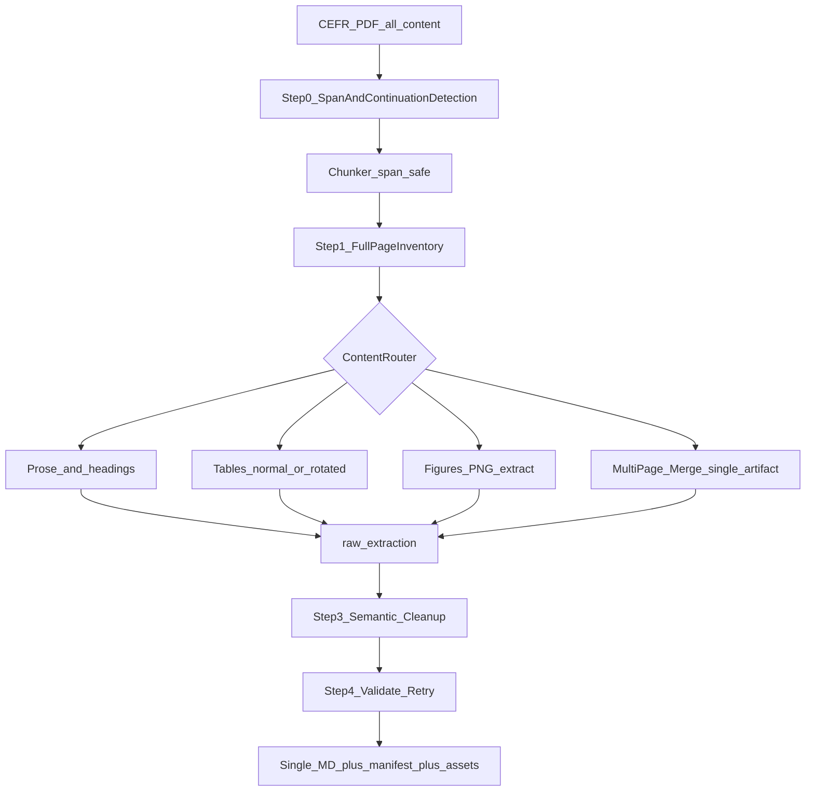
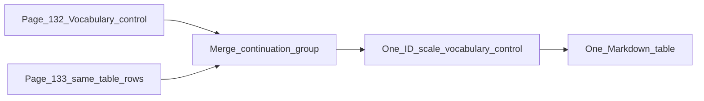

> Build an autonomous Python extraction pipeline for the 278-page CEFR Companion Volume PDF, extracting all content types (prose, tables, figures, appendices) into a single database-ready Markdown file with stable artifact IDs, merged multi-page tables, extracted image assets, and product-tier metadata for your assessment offerings.

# CEFR PDF → Database-Ready Markdown Pipeline (Revised)

## Goal: Extract All Content — Not Just Tables and Text

The original prompt mentioned tables and text, but the purpose is to capture **everything** needed to reconstruct the document for a website and SQLite-backed products:

- **Prose** — foreword, chapters, explanatory narrative, footnotes
- **Headings and section structure** — chapters, subsections, appendices (for navigation)
- **Tables** — illustrative descriptor scales, summary tables, self-assessment grids, appendix tables (including rotated and multi-page)
- **Figures** — diagrams, charts, profiles (raster + vector-rendered PNGs)
- **Lists, captions, and cross-references** — preserved in context
- **Appendix blocks** — treated as first-class sections with correct page spans
- **Blank separator pages** (e.g. page 242) — omitted from output, noted in inventory

Every artifact (table, figure, major section) receives a stable `display_name | id` caption and `<!-- db:... -->` tag for downstream database import. Prose between artifacts is preserved as contextual content — critical for your coaching/assessment products where explanatory text surrounds the scales.

**Input:** [`CEFR Companion Volume_eng.pdf`](CEFR Companion Volume_eng.pdf) — **278 pages**.

| Content signal | Count | Extraction route |
|----------------|-------|------------------|
| Pure prose | 64 | PyMuPDF text |
| Normal tables | 50 | pdfplumber |
| Rotated tables | 91 | Render → auto-rotate → Tesseract OCR |
| Mixed (prose + table/figure) | 50 | Text blocks + structured artifact extraction |
| Blank separators | 18 | Skip in output |
| Multi-page continuations | 20+ | **Merge into single artifact** (see below) |



---

## Folder Structure

```
agent-extraction/
├── chunks/                          # chunk_XX_pages_XX-YY.pdf
├── inventories/                     # chunk_XX_inventory.json
├── work/raw_extraction/                  # chunk_XX.md
├── work/cleaned/                         # chunk_XX.md
├── output/
│   ├── CEFR_Companion_Volume.md     # single combined deliverable
│   ├── manifest.json                # website navigation + product catalog
│   ├── db_import_registry.json      # flat ETL registry (all content types)
│   └── assets/
│       ├── figures/                 # figure_NN_slug.png
│       └── tables/                  # fallback renders for failed OCR tables
├── work/metadata/
│   ├── spanning_tables.json         # continuation groups (merge targets)
│   ├── cleanup_report.md
│   └── sqlite_schema_notes.md
├── pipeline/
└── run_pipeline.py
```

---

## Step 0 — Span-Aware Chunking (Tables + Sections)

**Scripts:** [`pipeline/span_detector.py`](pipeline/span_detector.py), [`pipeline/chunker.py`](pipeline/chunker.py)

### Continuation detection (prevents duplicate tables)

A **continuation** is when the same logical table resumes on the next page. Signals (all must be weighed):

1. **Same category header** — row-0 title matches (e.g. "Vocabulary control" on pages 132 and 133)
2. **No new table caption** — no fresh "Table N" label on the continuation page
3. **Grid line continuity** — drawing bboxes align at page boundary
4. **CEFR level progression** — continuation page picks up levels not yet present (page 132 ends at B2; page 133 continues with lower/additional rows, not a fresh C2→A1 restart)

**Verified example:** `scale_vocabulary_control` is **one table** spanning pages **132–133**, not two artifacts.

**Action:** continuation groups are merged in Step 2 into a **single Markdown table** with **one ID** assigned from the **first page** of the group. Row-0 titles on later pages are never used to mint new IDs.

### Series vs continuation

| Type | Example | Treatment |
|------|---------|-----------|
| `continuation` | Vocabulary control 132–133; Table 2 on 24–25 | **One artifact, merged rows** |
| `series` | Descriptor scales 51–56 (each a different skill) | **Separate artifacts**, distinct IDs, same chunk kept together |
| `section_block` | Appendix 2 self-assessment 177–181 | **One artifact** spanning all pages |

### Chunk plan (10 chunks, span-safe)

| Chunk | Pages | Notes |
|-------|-------|-------|
| chunk_01 | 1–25 | Intro + early tables/figures |
| chunk_02 | 26–50 | Ch 2 content |
| chunk_03 | 51–82 | Descriptor scale series |
| chunk_04 | 83–107 | Mixed + rotated scales |
| chunk_05 | 108–132 | Includes **vocabulary_control continuation** boundary |
| chunk_06 | 133–157 | Continues Ch 5 scales + signing |
| chunk_07 | 158–182 | **Appendix 2 self-assessment grid (177–181)** |
| chunk_08 | 183–241 | Rotated Appendix 5 (59 pp — bottleneck) |
| chunk_09 | 242–267 | Appendices 6–8 |
| chunk_10 | 268–278 | Sources, bibliography |

Chunk boundaries adjusted so no `continuation` or `section_block` group is split.

---

## Step 1 — Per-Chunk Page Inventory (All Content Types)

**Scripts:** [`pipeline/inventory.py`](pipeline/inventory.py), [`pipeline/id_registry.py`](pipeline/id_registry.py)

Each page entry includes:

```json
{
  "page_number": 133,
  "content_type": "multi_page_table",
  "table_orientation": "normal",
  "spanning_info": {
    "group_id": "scale_vocabulary_control",
    "role": "continuation",
    "start_page": 132,
    "end_page": 133
  },
  "figures": [],
  "prose_blocks": true,
  "section_title": "Vocabulary control",
  "product_tier": ["assessment_action", "detailed"]
}
```

**`content_type` values:** `pure_text` | `single_table` | `multi_page_table` | `mixed` | `figure` | `section_block` | `blank`

### Appendix 2 — Self-Assessment Grid (corrected scope)

**Not page 181 alone.** Appendix 2 is a **`section_block`** spanning **pages 177–181**:

| Page | Grid section |
|------|-------------|
| 177 | Reception |
| 178 | Production |
| 179 | Interaction |
| 180–181 | Mediation (rotated layout on 181) |

- **Single artifact ID:** `table_self_assessment_grid`
- **Caption:** `Self-Assessment Grid (Expanded with Online Interaction and Mediation) | table_self_assessment_grid`
- **`product_tier`:** `base` (your entry-level product)
- **Registry:** `page_start: 177`, `page_end: 181`
- **Extraction:** merge all five pages into one structured grid; rotate OCR pages as needed; never emit five separate tables

---

## Step 2 — Intelligent Extraction (Prose + Tables + Figures)

**Scripts:** [`pipeline/extractors/`](pipeline/extractors/), [`pipeline/extract_chunk.py`](pipeline/extract_chunk.py)

| Content | Method |
|---------|--------|
| Prose / headings | PyMuPDF text; strip running headers/footers; preserve hierarchy |
| Normal single-page table | pdfplumber → Markdown pipe table |
| **Multi-page continuation** | Extract each page → **concatenate rows** → dedupe header row once → **one** `<!-- db:id=... -->` block |
| Rotated table | 2× render → auto-rotate (English word-score) → Tesseract → table parse |
| **Section block** (self-assessment) | Per-page extract → merge into unified grid schema → single artifact |
| Figures (raster) | PyMuPDF `extract_image()` → PNG |
| Figures (vector) | Crop by caption + drawing bounds → render PNG |

**Caption + ID format** (all artifacts):

```markdown
<!-- db:id=scale_vocabulary_control type=descriptor_scale product_tier=detailed,assessment_action pages=132-133 -->
### Vocabulary Control | scale_vocabulary_control

| | Vocabulary control |
|---|---|
| C2 | ... |
| ... | ... |
| Pre-A1 | ... |
```

Row-0 titles are used for **naming only when they start a new logical table**. Continuation pages contribute **rows only** — no second heading, no second ID.

### Figure extraction

```markdown
<!-- db:id=figure_06_fictional_profile_clil type=figure product_tier=context pages=38 -->
### Figure 6 – A Fictional Profile of Needs... | figure_06_fictional_profile_clil

```

Format: **PNG** (lossless diagrams). Registry stores `asset_path` for website serving; SQLite can hold path or blob.

### Product-tier tagging

| Tier | Content scope | `product_tier` |
|------|---------------|----------------|
| Base self-assessment | Appendix 2 grid (177–181) | `base` |
| Assessment + action plan | Ch 3–6 descriptor scales + Appendices 1–4 | `assessment_action` |
| Detailed à-la-carte | Individual scales (each merged artifact) | `detailed` |
| Context / coaching | Prose, methodology, figures explaining framework | `context` |

---

## Step 3 — LLM Semantic Cleanup

Agent-native cleanup (optional API fallback if env key present). Exact instruction:

> "Fix OCR artifacts, nonsense strings, repeated fragments, and broken words. Preserve original meaning and table structure exactly. Do not rewrite style or content — only correct obvious errors."

**Must preserve:** prose, `<!-- db:... -->` tags, `| id` captions, merged table structure, image paths, section hierarchy.

---

## Step 4 — Self-Validation & Retry Loop

**Script:** [`pipeline/validators.py`](pipeline/validators.py)

Checks:
- No duplicate IDs for continuation groups (e.g. two `scale_vocabulary_control` blocks → fail)
- Merged tables have monotonic/consistent CEFR rows, single header
- Self-assessment grid is one artifact covering 177–181
- Gibberish ratio on OCR sections
- Every figure/table has ID + asset file exists
- Prose sections present between major artifacts (not table-only output)

**Retry:** max 3 attempts per `{chunk}:{page}:{artifact_id}` → escalate to user.

---

## Final Deliverables

### 1. [`output/CEFR_Companion_Volume.md`](output/CEFR_Companion_Volume.md)
Single file: full prose + all tables (merged) + all figures + navigation anchors.

### 2. [`output/manifest.json`](output/manifest.json)
Website sidebar tree; `products.self_assessment_base` points to `table_self_assessment_grid` with `pages: [177,181]`.

### 3. [`output/db_import_registry.json`](output/db_import_registry.json)
Flat records for **all content types**:

```json
{
  "id": "table_self_assessment_grid",
  "display_caption": "Self-Assessment Grid (Expanded...) | table_self_assessment_grid",
  "type": "section_block",
  "product_tiers": ["base"],
  "page_start": 177,
  "page_end": 181,
  "continuation_pages": [177, 178, 179, 180, 181],
  "anchor": "#table_self_assessment_grid"
}
```

```json
{
  "id": "scale_vocabulary_control",
  "type": "descriptor_scale",
  "product_tiers": ["detailed", "assessment_action"],
  "page_start": 132,
  "page_end": 133,
  "merged_from_pages": [132, 133]
}
```

### 4. [`work/metadata/sqlite_schema_notes.md`](work/metadata/sqlite_schema_notes.md)
DB best practices: stable slug PKs; `content_nodes` tree; `artifacts` (tables, figures, section_blocks); `scale_rows` (level × descriptor); `products` tier mapping; `asset_path` vs BLOB; manifest-driven UI sidebar; product queries (`WHERE 'base' IN product_tiers`).

### 5. [`work/metadata/cleanup_report.md`](work/metadata/cleanup_report.md)

---

## Key Design Principle: Merge at Extraction, Not Post-Processing



The user should **never** need a manual merge step. Continuation detection + ID registry ensure one artifact per logical table/section from the start.

---

## Execution Order (post-approval)

1. Scaffold pipeline modules + requirements.txt
2. Span/continuation detection → `work/metadata/spanning_tables.json`
3. Chunk PDF (10 files)
4. Build inventories with merge groups + section blocks
5. Extract all content per chunk → raw MD + assets
6. Cleanup → validate → retry (focus: chunk_08 OCR, self-assessment merge, 132–133 merge)
7. Merge to single MD + manifests
8. Write cleanup report + SQLite notes

**Runtime estimate:** 2–4 hours (chunk_08 dominates).

## Todos

- [ ] **scaffold-pipeline** — Create pipeline/ package, requirements.txt, run_pipeline.py orchestrator
- [ ] **span-chunk** — Implement continuation-aware span_detector + chunker; flag section_blocks (Appendix 2 = 177-181)
- [ ] **inventory-ids** — Build inventory + id_registry: merge groups share one ID; row-0 naming only for new tables
- [ ] **extractors** — Extract prose, tables (merged continuations), rotated OCR, figures PNG; section_block merge for self-assessment
- [ ] **cleanup-validate** — Cleanup pass; validators reject duplicate IDs for continuations; 3-attempt retry loop
- [ ] **final-merge** — Single CEFR_Companion_Volume.md + manifest.json + db_import_registry.json (all content types)
- [ ] **docs-report** — Write cleanup_report.md and sqlite_schema_notes.md
