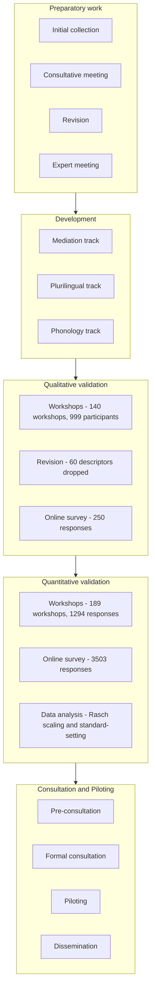

# CEFR Companion Volume

<!-- db:id=cefr_companion_volume type=document product_tier=context pages=1-278 -->

<!-- el:start type=prose id=prose_p001_s0 page=1 -->
**COMMON EUROPEAN  FRAMEWORK  OF REFERENCE  FOR LANGUAGES: LEARNING, TEACHING,  ASSESSMENT Companion volume**<!-- el:end id=prose_p001_s0 -->

Page **1**

<!-- page:1 -->

Page **2**

<!-- page:2 -->

<!-- el:start type=prose id=prose_p003_s0 page=3 --> **COMMON EUROPEAN  FRAMEWORK  OF REFERENCE  FOR LANGUAGES:** LEARNING, TEACHING, ASSESSMENT

Companion volume

This publication updates the CEFR 2001,

the conceptual framework of which remains valid.

www.coe.int/lang-cefr

Language Policy Programme

Education Policy Division

Education Department

Council of Europe
<!-- el:end id=prose_p003_s0 -->

Page **3**

<!-- page:3 -->

<!-- el:start type=prose id=prose_p004_s0 page=4 -->
A preliminary version of this update to the **Common European Framework  of Reference for Languages: learning, teaching, assessment** was published online in English and French in 2018 as “Common European Framework of Reference for Languages: Learning, teaching, assessment: Companion Volume with New Descriptors” and “Cadre européen commun de référence pour les langues: apprendre, enseigner, évaluer : Volume complémentaire avec de nouveaux descripteurs”,respectively.

This volume presents the key messages of the CEFR in a user-friendly form and contains all CEFR illustrative descriptors. For pedagogical use of the CEFR for learning, teaching and assessment, teachers and teacher educators will find it easier to access the CEFR Companion volume as the updated framework. The Companion volume provides the links and references to also consult the chapters of the 2001 edition, where necessary. Researchers wishing to interrogate the underlying concepts and guidance in CEFR chapters about specific areas should access the 2001 edition, which remains valid.

French edition: **Cadre européen commun de référence  pour les langues : apprendre, enseigner, évaluer – Volume complémentaire** All rights reserved. No part of this publication may be translated, reproduced or transmitted, in any form or by any means, electronic (CD-Rom, internet, etc.) or mechanical, including photocopying, recording or any information storage or retrieval system, without prior permission in writing from the Directorate of Communication (F-67075 Strasbourg Cedex or publishing@coe.int).

Cover design and layout: Documents and Publications Production Department (SPDP), Council of Europe

ISBN 978-92-871-8621-8 © Council of Europe, April 2020 Printed at the Council of Europe Citation reference: Council of Europe (2020), **Common European Framework  of Reference for Languages: Learning,  teaching, assessment – Companion volume**, Council of Europe Publishing, Strasbourg, available at www.coe.int/lang-cefr.
<!-- el:end id=prose_p004_s0 -->

Page **4**Page**4**Page**4**Page**4**

<!-- page:4 -->

<!-- el:start type=toc id=toc_p005_s0 page=5 -->
## Contents

## Foreword — 11
## Preface with acknowledgements — 13
## CHAPTER 1: INTRODUCTION — 21
### 1.1. SUMMARY OF CHANGES TO THE ILLUSTRATIVE DESCRIPTORS — 24
## CHAPTER 2: KEY ASPECTS OF THE CEFR FOR TEACHING AND LEARNING — 27
### 2.1. AIMS OF THE CEFR — 28
### 2.2. IMPLEMENTING THE ACTION-ORIENTED APPROACH — 29
### 2.3. PLURILINGUAL AND PLURICULTURAL COMPETENCE — 30
### 2.4. THE CEFR DESCRIPTIVE SCHEME — 31
### 2.5. MEDIATION — 35
### 2.6. THE CEFR COMMON REFERENCE LEVELS — 36
### 2.7. CEFR PROFILES — 38
### 2.8. THE CEFR ILLUSTRATIVE DESCRIPTORS — 41
### 2.9. USING THE CEFR ILLUSTRATIVE DESCRIPTORS — 42
### 2.10. SOME USEFUL RESOURCES FOR CEFR IMPLEMENTATION — 44
#### 2.10.1. WEB RESOURCES — 44
#### 2.10.2. BOOKS — 45
## CHAPTER 3: THE CEFR ILLUSTRATIVE DESCRIPTOR SCALES: COMMUNICATIVE LANGUAGE ACTIVITIES AND STRATEGIES — 47
### 3.1. RECEPTION — 47
#### 3.1.1. RECEPTION ACTIVITIES — 48
##### 3.1.1.1. ORAL COMPREHENSION — 48
- OVERALL ORAL COMPREHENSION — 48
- UNDERSTANDING CONVERSATION BETWEEN OTHER PEOPLE — 49
- UNDERSTANDING AS A MEMBER OF A LIVE AUDIENCE — 50
- UNDERSTANDING ANNOUNCEMENTS AND INSTRUCTIONS — 51
- UNDERSTANDING AUDIO (OR SIGNED) MEDIA AND RECORDINGS — 52
##### 3.1.1.2. AUDIO-VISUAL COMPREHENSION — 52
- WATCHING TV, FILM AND VIDEO — 52
##### 3.1.1.3. READING COMPREHENSION — 53
- OVERALL READING COMPREHENSION — 54
- READING CORRESPONDENCE — 54

* ▶ Page **5***

<!-- page:5 -->

<!-- el:end id=toc_p005_s0 -->
<!-- el:start type=toc id=toc_p006_s0 page=6 -->
- READING FOR ORIENTATION — 55
- READING FOR INFORMATION AND ARGUMENT — 56
- READING INSTRUCTIONS — 58
- READING AS A LEISURE ACTIVITY — 58
#### 3.1.2. RECEPTION STRATEGIES — 59
- IDENTIFYING CUES AND INFERRING (SPOKEN, SIGNED AND WRITTEN) — 60
### 3.2. PRODUCTION — 60
#### 3.2.1. PRODUCTION ACTIVITIES — 61
##### 3.2.1.1. ORAL PRODUCTION — 61
- OVERALL ORAL PRODUCTION — 62
- SUSTAINED MONOLOGUE: DESCRIBING EXPERIENCE — 62
- SUSTAINED MONOLOGUE: GIVING INFORMATION — 63
- SUSTAINED MONOLOGUE: PUTTING A CASE (E. G. IN A DEBATE) — 64
- PUBLIC ANNOUNCEMENTS — 64
- ADDRESSING AUDIENCES — 65
##### 3.2.1.2. WRITTEN PRODUCTION — 66
- OVERALL WRITTEN PRODUCTION — 66
- CREATIVE WRITING — 67
- REPORTS AND ESSAYS — 68
#### 3.2.2. PRODUCTION STRATEGIES — 68
- PLANNING — 69
- COMPENSATING — 69
- MONITORING AND REPAIR — 70
### 3.3. INTERACTION — 70
#### 3.3.1. INTERACTION ACTIVITIES — 71
##### 3.3.1.1. ORAL INTERACTION — 71
- OVERALL ORAL INTERACTION — 72
- UNDERSTANDING AN INTERLOCUTOR — 72
- CONVERSATION — 73
- INFORMAL DISCUSSION (WITH FRIENDS) — 74
- FORMAL DISCUSSION (MEETINGS) — 75
- GOAL-ORIENTED CO-OPERATION — 76
- OBTAINING GOODS AND SERVICES — 77
- INFORMATION EXCHANGE — 78
- INTERVIEWING AND BEING INTERVIEWED — 80
- USING TELECOMMUNICATIONS — 81
##### 3.3.1.2. WRITTEN INTERACTION — 81
- OVERALL WRITTEN INTERACTION — 82
- CORRESPONDENCE — 82
- NOTES, MESSAGES AND FORMS — 83
##### 3.3.1.3. ONLINE INTERACTION — 84
- ONLINE CONVERSATION AND DISCUSSION — 84

*Page **6** ▶ **CEFR – Companion volume***

<!-- page:6 -->

<!-- el:end id=toc_p006_s0 -->
<!-- el:start type=toc id=toc_p007_s0 page=7 -->
- GOAL-ORIENTED ONLINE TRANSACTIONS AND COLLABORATION — 86
#### 3.3.2. INTERACTION STRATEGIES — 87
- TURNTAKING — 88
- CO-OPERATING — 88
- ASKING FOR CLARIFICATION — 89
### 3.4. MEDIATION — 90
#### 3.4.1. MEDIATION ACTIVITIES — 91
- OVERALL MEDIATION — 91
##### 3.4.1.1. MEDIATING A TEXT — 92
- RELAYING SPECIFIC INFORMATION — 93
- EXPLAINING DATA — 96
- PROCESSING TEXT — 98
- TRANSLATING A WRITTEN TEXT — 102
- NOTE-TAKING (LECTURES, SEMINARS, MEETINGS, ETC.) — 105
- EXPRESSING A PERSONAL RESPONSE TO CREATIVE TEXTS (INCLUDING LITERATURE) — 106
- ANALYSIS AND CRITICISM OF CREATIVE TEXTS (INCLUDING LITERATURE) — 107
##### 3.4.1.2. MEDIATING CONCEPTS — 108
- FACILITATING COLLABORATIVE INTERACTION WITH PEERS — 109
- COLLABORATING TO CONSTRUCT MEANING — 109
- MANAGING INTERACTION — 112
- ENCOURAGING CONCEPTUAL TALK — 112
##### 3.4.1.3. MEDIATING COMMUNICATION — 114
- FACILITATING PLURICULTURAL SPACE — 114
- ACTING AS AN INTERMEDIARY IN INFORMAL SITUATIONS (WITH FRIENDS AND COLLEAGUES) — 115
- FACILITATING COMMUNICATION IN DELICATE SITUATIONS AND DISAGREEMENTS — 116
#### 3.4.2. MEDIATION STRATEGIES — 117
##### 3.4.2.1. STRATEGIES TO EXPLAIN A NEW CONCEPT — 118
- LINKING TO PREVIOUS KNOWLEDGE — 118
- ADAPTING LANGUAGE — 118
- BREAKING DOWN COMPLICATED INFORMATION — 118
##### 3.4.2.2. STRATEGIES TO SIMPLIFY A TEXT — 121
- AMPLIFYING A DENSE TEXT — 121
- STREAMLINING A TEXT — 121
## CHAPTER 4: THE CEFR ILLUSTRATIVE DESCRIPTOR SCALES: PLURILINGUAL AND PLURICULTURAL COMPETENCE — 123
- BUILDING ON PLURICULTURAL REPERTOIRE — 124
- PLURILINGUAL COMPREHENSION — 126
- BUILDING ON PLURILINGUAL REPERTOIRE — 127
## CHAPTER 5: THE CEFR ILLUSTRATIVE DESCRIPTOR SCALES: COMMUNICATIVE LANGUAGE COMPETENCES — 129
### 5.1. LINGUISTIC COMPETENCE — 130
- GENERAL LINGUISTIC RANGE — 130

* ▶ Page **7***

<!-- page:7 -->

<!-- el:end id=toc_p007_s0 -->
<!-- el:start type=toc id=toc_p008_s0 page=8 -->
- VOCABULARY RANGE — 131
- GRAMMATICAL ACCURACY — 132
- VOCABULARY CONTROL — 132
- PHONOLOGICAL CONTROL — 133
- ORTHOGRAPHIC CONTROL — 136
### 5.2. SOCIOLINGUISTIC COMPETENCE — 136
- SOCIOLINGUISTIC APPROPRIATENESS — 136
### 5.3. PRAGMATIC COMPETENCE — 137
- FLEXIBILITY — 138
- TURNTAKING — 139
- THEMATIC DEVELOPMENT — 139
- COHERENCE AND COHESION — 140
- PROPOSITIONAL PRECISION — 141
- FLUENCY — 142
## CHAPTER 6: THE CEFR ILLUSTRATIVE DESCRIPTOR SCALES: SIGNING COMPETENCES — 143
### 6.1. LINGUISTIC COMPETENCE — 144
- SIGN LANGUAGE REPERTOIRE — 144
- DIAGRAMMATICAL ACCURACY — 149
### 6.2. SOCIOLINGUISTIC COMPETENCE — 153
- SOCIOLINGUISTIC APPROPRIATENESS AND CULTURAL REPERTOIRE — 153
### 6.3. PRAGMATIC COMPETENCE — 157
- SIGN TEXT STRUCTURE — 157
- SETTING AND PERSPECTIVES — 161
- LANGUAGE AWARENESS AND INTERPRETATION — 164
- PRESENCE AND EFFECT — 166
- PROCESSING SPEED — 167
- SIGNING FLUENCY — 168
## APPENDICES — 171
## APPENDIX 1: SALIENT FEATURES OF THE CEFR LEVELS — 173
## APPENDIX 2: SELF-ASSESSMENT GRID (EXPANDED WITH ONLINE INTERACTION AND MEDIATION) — 177
## APPENDIX 3: QUALITATIVE FEATURES OF SPOKEN LANGUAGE (EXPANDED WITH PHONOLOGY)	 183
## APPENDIX 4: WRITTEN ASSESSMENT GRID — 187
## APPENDIX 5: EXAMPLES OF USE IN DIFFERENT DOMAINS FOR DESCRIPTORS OF ONLINE
- INTERACTION AND MEDIATION ACTIVITIES — 191
## APPENDIX 6: DEVELOPMENT AND VALIDATION OF THE EXTENDED ILLUSTRATIVE DESCRIPTORS	 243
## APPENDIX 7: SUBSTANTIVE CHANGES TO SPECIFIC DESCRIPTORS PUBLISHED IN 2001 — 257
## APPENDIX 8: SUPPLEMENTARY DESCRIPTORS — 259
## APPENDIX 9: SOURCES FOR NEW DESCRIPTORS — 269
## APPENDIX 10: ONLINE RESOURCES — 273

*Page **8** ▶ **CEFR – Companion volume***

<!-- page:8 -->

<!-- el:end id=toc_p008_s0 -->
<!-- el:start type=toc id=toc_p009_s0 page=9 -->
## List of tables and figures
## List of figures
### FIGURE 1 – THE STRUCTURE OF THE CEFR DESCRIPTIVE SCHEME — 32
### FIGURE 2 – THE RELATIONSHIP BETWEEN RECEPTION, PRODUCTION, INTERACTION AND MEDIATION — 34
### FIGURE 3 – CEFR COMMON REFERENCE LEVELS — 36
### FIGURE 4 – A RAINBOW — 36
### FIGURE 5 – THE CONVENTIONAL SIX COLOURS — 36
### FIGURE 6 – A FICTIONAL PROFILE OF NEEDS IN AN ADDITIONAL LANGUAGE – LOWER SECONDARY CLIL — 38
### FIGURE 7 – A PROFILE OF NEEDS IN AN ADDITIONAL LANGUAGE – POSTGRADUATE NATURAL SCIENCES (FICTIONAL) — 39
### FIGURE 8 – A PLURILINGUAL PROFICIENCY PROFILE WITH FEWER CATEGORIES — 40
### FIGURE 9 – A PROFICIENCY PROFILE – OVERALL PROFICIENCY IN ONE LANGUAGE — 40
### FIGURE 10 – A PLURILINGUAL PROFICIENCY PROFILE – ORAL COMPREHENSION ACROSS LANGUAGES — 40
### FIGURE 11 – RECEPTION ACTIVITIES AND STRATEGIES — 47
### FIGURE 12 – PRODUCTION ACTIVITIES AND STRATEGIES — 61
### FIGURE 13 – INTERACTION ACTIVITIES AND STRATEGIES — 71
### FIGURE 14 – MEDIATION ACTIVITIES AND STRATEGIES — 90
### FIGURE 15 – PLURILINGUAL AND PLURICULTURAL COMPETENCE — 123
### FIGURE 16 – COMMUNICATIVE LANGUAGE COMPETENCES — 129
### FIGURE 17 – SIGNING COMPETENCES — 144
### FIGURE 18 – DEVELOPMENT DESIGN OF YOUNG LEARNER PROJECT — 244
### FIGURE 19 – MULTIMETHOD DEVELOPMENTAL RESEARCH DESIGN — 249
### FIGURE 20 – THE PHASES OF THE SIGN LANGUAGE PROJECT — 254
## List of tables
### TABLE 1 – THE CEFR DESCRIPTIVE SCHEME AND ILLUSTRATIVE DESCRIPTORS: UPDATES AND ADDITIONS — 23
### TABLE 2 – SUMMARY OF CHANGES TO THE ILLUSTRATIVE DESCRIPTORS — 24
### TABLE 3 – MACRO-FUNCTIONAL BASIS OF CEFR CATEGORIES FOR COMMUNICATIVE LANGUAGE ACTIVITIES — 33
### TABLE 4 – COMMUNICATIVE LANGUAGE STRATEGIES IN THE CEFR — 35
### TABLE 5 – THE DIFFERENT PURPOSES OF DESCRIPTORS — 44

* ▶ Page **9***

<!-- page:9 -->

Page **10**

<!-- page:10 -->

<!-- el:start type=prose id=prose_p011_s0 page=11 --> **FOREWORD**The**Common European Framework of Reference for Languages: Learning, teaching, assessment** (CEFR)1 is one of the best-known and most used Council of Europe policy instruments. Through the European C (https://rm.coe.int/1680459f97)ultural Convention 50 European countries commit to encouraging “the study by its own nationals of the languages, history and civilisation” of other European countries. The CEFR has played and continues to play an important role in making this vision of Europe a reality.
Since its launch in 2001, the CEFR, together with its related instrument for learners, the European Language Portfolio (ELP),2 has been a central feature of the Council of Europe’s intergovernmental programmes in the field of education, including their initiatives to promote the right to quality education for all. Language education contributes to Council of Europe’s core mission “to achieve a greater unity between its members” and is fundamental to the effective enjoyment of the right to education and other individual human rights and the rights of minorities as well as, more broadly, to developing and maintaining a culture of democracy.

The CEFR is intended to promote quality plurilingual education, facilitate greater social mobility and stimulate reflection and exchange between language professionals for curriculum development and in teacher education. Furthermore the CEFR provides a metalanguage for discussing the complexity of language proficiency for all citizens in a multilingual and intercultural Europe, and for education policy makers to reflect on learning objectives and outcomes that should be coherent and transparent. It has never been the intention that the CEFR should be used to justify a gate-keeping function of assessment instruments.

The Council of Europe hopes that the development in this publication of areas such as mediation, plurilingual/ pluricultural competence and signing competences will contribute to quality inclusive education for all, and to the promotion of plurilingualism and pluriculturalism.

Snežana Samardžić-Marković **Council of Europe Director General for Democracy**<!-- el:end id=prose_p011_s0 -->
1. www.coe.int/lang-cefr.
2. www.coe.int/en/web/portfolio.

Page **11**

<!-- page:11 -->

Page **12**

<!-- page:12 -->

<!-- el:start type=prose id=prose_p013_s0 page=13 --> **PREFACE WITH ACKNOWLEDGEMENTS**The**Common European Framework of Reference for Languages: Learning, teaching, assessment** (CEFR) was published in 2001 (the European Year of Languages) after a comprehensive process of drafting, piloting and consultation. The CEFR has contributed to the implementation of the Council of Europe’s language education principles, including the promotion of reflective learning and learner autonomy.
A comprehensive set of resources has been developed around the CEFR since its publication in order to support implementation and, like the CEFR itself, these resources are presented on the Council of Europe’s CEFR website.3 Building on the success of the CEFR and other projects a number of policy documents and resources that further develop the underlying educational principles and objectives of the CEFR are also available, not only for foreign/second languages but also for the languages of schooling and the development of curricula to promote (http://www.coe.int/lang-platform) plurilingual and intercultural education. Many of these are available on the Platform of resources and references for plurilingual and intercultural education,4 for example: **Guide for the development and implementation of curricula for plurilingual and intercultural education (https://rm.coe.int/16806ae621);5 A handbook for curriculum development and teacher education: the language dimension in all subjects (https://rm.coe.int/16806af387);6** f “From linguistic diversity to plurilingual education: guide for the development of language education policies in Europe”; (https://rm.coe.int/16802fc1c4)7 Others are available separately: policy guidelines and resources for the linguistic integration of adult migrants (http://www.coe.int/en/web/lang-migrants/officials-texts-and-guidelines);8

guidelines for intercultural education and an autobiography of intercultural encounters (http://www.coe.int/t/dg4/autobiography/default_en.asp);9 f **Reference framework of competences for democratic culture (https://go.coe.int/mWYUH)**.10 However, regardless of all this further material provided, the Council of Europe frequently received requests to continue to develop aspects of the CEFR, particularly the illustrative descriptors of second/foreign language proficiency. Requests were made asking the Council of Europe to complement the illustrative scales published in 2001 with descriptors for mediation, reactions to literature and online interaction, to produce versions for young learners and for signing competences, and to develop more detailed coverage in the descriptors for A1 and C levels.

Much work done by other institutions and professional bodies since the publication of the CEFR has confirmed the validity of the initial research conducted under a Swiss National Science Foundation (SNSF) research project by Brian North and Günther Schneider. To respond to the requests received and in keeping with the open, dynamic character of the CEFR, the Education Policy Division (Language Policy Programme) therefore resolved to build on the widespread adoption and use of the CEFR to produce an extended version of the illustrative descriptors that replaces the ones contained in the body of the CEFR 2001 text. For this purpose, validated and calibrated descriptors were generously offered to the Council of Europe by a number of institutions in the field of language education.

For mediation, an important concept introduced in the CEFR that has assumed even greater importance with the increasing linguistic and cultural diversity of our societies, however, no validated and calibrated descriptors existed. The development of descriptors for mediation was, therefore, the longest and most complex part of the project. Descriptor scales are here provided for mediating a text, for mediating concepts and for mediating communication, as well as for the related mediation strategies and plurilingual/pluricultural competences.
<!-- el:end id=prose_p013_s0 -->
3. www.coe.int/lang-cefr.
4. www.coe.int/lang-platform. Beacco J.-C. et al. (2016a), **Guide for the development and implementation of curricula for plurilingual and intercultural education** (https://rm.coe.int/16806ae621), Council
5. of Europe Publishing, Strasbourg, available at https://rm.coe.int/16806ae62
1. Beacco J.-C. et al. (2016b), **A handbook for curriculum development and teacher education: the language dimension in all subjects**, Council
6. of Europe Publishing, Strasbourg, available at https://rm.coe.int/16806af387.
7. Beacco J.-C. and Byram M. (2007), “From linguistic diversity to plurilingual education: guide for the development of language education policies in Europe”, Language Policy Division, Council of Europe, Strasbourg, available at https://rm.coe.int/16802fc1c4.
8. www.coe.int/en/web/lang-migrants/officials-texts-and-guidelines.
9. www.coe.int/t/dg4/autobiography/default_en.asp.
10.	 Council of Europe (2018), **Reference framework of competences for democratic culture**, Council of Europe Publishing, Strasbourg, available at https://go.coe.int/mWYUH, accessed 6 March 2020.

Page **13**

<!-- page:13 -->

<!-- el:start type=prose id=prose_p014_s0 page=14 -->
As part of the process of further developing the descriptors, an effort was made to make them modality-inclusive. The adaptation of the descriptors in this way is informed by the ECML’s pioneering PRO-Sign project. (http://www.ecml.at/ECML-Programme/Programme2012-2015/ProSign/tabid/1752/Default.aspx) In addition, illustrative descriptor scales specifically for signing competences are provided, again informed by SNSF research project No. 100015_156592.

First published online in 2018 as the “CEFR Companion Volume with New Descriptors”, this update to the CEFR therefore represents another step in a process that has been pursued by the Council of Europe since 1964. In particular, the descriptors for new areas represent an enrichment of the original descriptive apparatus. Those responsible for curriculum planning for foreign languages and languages of schooling will find further guidance on promoting plurilingual and intercultural education in the guides mentioned above. In addition to the extended illustrative descriptors, this publication contains a user-friendly explanation of the aims and main principles of the CEFR, which the Council of Europe hopes will help increase awareness of the CEFR’s messages, particularly in teacher education. For ease of consultation, this publication contains links and references to the 2001 edition, which remains a valid reference for its detailed chapters.

The fact that this edition of the CEFR descriptors takes them beyond the area of modern language learning to encompass aspects relevant to language education across the curriculum was overwhelmingly welcomed in the extensive consultation process undertaken in 2016-17. This reflects the increasing awareness of the need for an integrated approach to language education across the curriculum. Language teaching practitioners particularly welcomed descriptors concerned with online interaction, collaborative learning and mediating text. The consultation also confirmed the importance that policy makers attach to the provision of descriptors for plurilingualism/pluriculturalism. This is reflected in the Council of Europe’s recent initiative to develop competences for democratic culture,11 such as valuing cultural diversity and openness to cultural otherness and to other beliefs, worldviews and practices.

This publication owes much to the contributions of members of the language teaching profession across Europe and beyond. It was authored by Brian North, Tim Goodier (Eurocentres Foundation) and Enrica Piccardo (University of Toronto/Université Grenoble-Alpes). The chapter on signing competences was produced by Jörg Keller (Zurich University of Applied Sciences).

Publication has been assisted by a project follow-up advisory group consisting of: Marisa Cavalli, Mirjam Egli Cuenat, Neus Figueras Casanovas, Francis Goullier, David Little, Günther Schneider and Joseph Sheils.

In order to ensure complete coherence and continuity with the CEFR scales published in 2001, the Council of Europe asked the Eurocentres Foundation to once again take on responsibility for co-ordinating the further development of the CEFR descriptors, with Brian North co-ordinating the work. The Council of Europe wishes to express its gratitude to Eurocentres for the professionalism and reliability with which the work has been carried out.

The entire process of updating and extending the illustrative descriptors took place in five stages or sub-projects: Stage 1:	 Filling gaps in the illustrative descriptor scales published in 2001with materials then available (2014-15)

Authoring Group: Brian North, Tunde Szabo, Tim Goodier (Eurocentres Foundation)

Sounding Board: Gilles Breton, Hanan Khalifa, Christine Tagliante, Sauli Takala

Consultants: Coreen Docherty, Daniela Fasoglio, Neil Jones, Peter Lenz, David Little, Enrica Piccardo, Günther Schneider, Barbara Spinelli, Maria Stathopoulou, Bertrand Vittecoq

Stage 2:	 Developing descriptor scales for areas missing in the 2001 set, in particular for mediation (2014-16)

Authoring Group: Brian North, Tim Goodier, Enrica Piccardo, Maria Stathopoulou

Sounding Board: Gilles Breton, Coreen Docherty, Hanan Khalifa, Ángeles Ortega, Christine Tagliante, Sauli Takala

Consultants **(at meetings in June 2014, June 2015 and/or June 2016)**: Marisa Cavalli, Daniel Coste, Mirjam Egli Ceunat, Gudrun Erickson, Daniela Fasoglio, Vincent Folny, Manuela Ferreira Pinto, Glyn Jones, Neil Jones, Peter Lenz, David Little, Gerda Piribauer, Günther Schneider, Joseph Sheils, Belinda Steinhuber, Barbara Spinelli, Bertrand Vittecoq
<!-- el:end id=prose_p014_s0 -->
11.	 https://go.coe.int/mWYUH

*Page **14** ▶ **CEFR – Companion volume***

<!-- page:14 -->

<!-- el:start type=prose id=prose_p015_s0 page=15 -->
Consultants **(at a meeting in June 2016 only)**: Sarah Breslin, Mike Byram, Michel Candelier, Neus Figueras Casanovas, Francis Goullier, Hanna Komorowska, Terry Lamb, Nick Saville, Maria Stoicheva, Luca Tomasi

Stage 3:	 Developing a new scale for phonological control (2015-16)

Authoring Group: Enrica Piccardo, Tim Goodier

Sounding Board: Brian North, Coreen Docherty

Consultants: Sophie Deabreu, Dan Frost, David Horner, Thalia Isaacs, Murray Munro

Stage 4:	 Developing descriptors for signing competences (2015-19)

Authoring Group: Jörg Keller, Petrea Bürgin, Aline Meili, Dawei Ni

Sounding Board: Brian North, Curtis Gautschi, Jean-Louis Brugeille, Kristin Snoddon

Consultants: Patty Shores, Tobias Haug, Lorraine Leeson, Christian Rathmann, Beppie van den Bogaerde

Stage 5:	 Collating descriptors for young learners (2014-16)

Authoring Group: Tunde Szabo (Eurocentres Foundation)

Sounding Board: Coreen Docherty, Tim Goodier, Brian North

Consultants: Angela Hasselgreen, Eli Moe

The Council of Europe wishes to thank the following institutions and projects for kindly making their validated descriptors available: ALTE (Association of Language Testers in Europe)

AMKKIA project (Finland)

Cambridge Assessment English

CEFR-J project

Eaquals

English Profile

Lingualevel/IEF (Swiss) project

Pearson Education The Council of Europe would also like to thank: Pearson Education for kindly validating some 50 descriptors that were included from non-calibrated sources, principally from the Eaquals’ bank and the late John Trim’s translation of descriptors for the C levels in Profile Deutsch.

The Research Centre for Language Teaching, Testing and Assessment, National and Kapodistrian University of Athens (RCeL) for making available descriptors from the Greek Integrated Foreign Languages Curriculum.

Cambridge Assessment English, in particular Coreen Docherty, for the logistical support offered over a period of six months to the project, without which large-scale data collection and analysis would not have been feasible. The Council of Europe also wishes to gratefully acknowledge the support from the institutions listed at the end of this section, who took part in the three phases of validation for the new descriptors, especially all those who also assisted with piloting them.

Cambridge Assessment English and the European Language Portfolio authors for making their descriptors available for the collation of descriptors for young learners.

The Swiss National Science Foundation and the Max Bircher Stiftung for funding the research and development of the descriptors for signing competences.12 Can do statements Descriptors for grammar and vocabulary BULATS Summary of Typical Candidate Abilities Common Scales for Speaking and for Writing Assessment Scales for Speaking and for Writing Descriptors for secondary school learners Eaquals bank of CEFR-related descriptors Descriptors for the C level Descriptors for secondary school learners Global Scale of English (GSE)
<!-- el:end id=prose_p015_s0 -->
12.	 SNSF research project 100015_156592: Gemeinsamer Europäischer Referenzrahmen für Gebärdensprachen: Empirie-basierte Grundlagen für grammatische, pragmatische und soziolinguistische Deskriptoren in Deutschschweizer Gebärdensprache, conducted at the Zurich University of Applied Sciences (ZHAW, Winterthur). The SNSF provided some €385 000 for this research into signing competences.

*Preface with acknowledgements ▶ Page **15***

<!-- page:15 -->

<!-- el:start type=prose id=prose_p016_s0 page=16 -->
The PRO-Sign project team (European Centre for Modern Languages, ECML) for their assistance in finalising the descriptors for signing competences and in adapting the other descriptors for modality inclusiveness.13

The Department of Deaf Studies and Sign Language Interpreting at Humboldt-Universität zu Berlin for undertaking the translation of the whole document, including all the illustrative descriptors, into International Sign.

The following readers, whose comments on an early version of the text on key aspects of the CEFR for learning, teaching and assessment greatly helped to structure it appropriately for readers with different degrees of familiarity with the CEFR: Sezen Arslan, Danielle Freitas, Angelica Galante, İsmail Hakkı Mirici, Nurdan Kavalki, Jean-Claude Lasnier, Laura Muresan, Funda Ölmez.

Organisations, in alphabetical order, that facilitated the recruitment of institutes for the validation of the descriptors for mediation, online interaction, reactions to literature and plurilingual/pluricultural competence: Cambridge Assessment English

CERCLES: European Confederation of Language Centres in Higher Education

CIEP: Centre international d’études pédagogiques

EALTA: European Association for Language Testing and Assessment

Eaquals: Evaluation and Accreditation of Quality in Language Services

FIPLV: International Federation of Language Teaching Associations

Instituto Cervantes

NILE (Norwich Institute for Language Education)

UNIcert Institutes (organised in alphabetical order by country) that participated between February and November 2015 in the validation of the descriptors for mediation, online interaction, reactions to literature and plurilingual/ pluricultural competence, and/or assisted in initial piloting. The Council of Europe also wishes to thank the many individual participants, all of whose institutes could not be included here. **Algeria**Institut Français d’Alger**Argentina** Academia Argüello, Córdoba La Asociación de Ex Alumnos del Profesorado en Lenguas Vivas Juan R. Fernández National University of Córdoba **Austria** BBS (Berufsbildende Schule), Rohrbach BG/BRG (Bundesgymnasium/Bundesrealgymnasium), Hallein CEBS (Center für berufsbezogene Sprachen des bmbf), Vienna Federal Institute for Education Research (BIFIE), Vienna HBLW Linz-Landwiedstraße HLW (Höhere Lehranstalt für wirtschaftliche Berufe) Ferrarischule, Innsbruck **Bolivia**Alliance Française de La Paz**Bosnia and Herzegovina**Anglia V Language School, Bijeljina**Brazil**Alliance Française Alliance Française de Curitiba**Bulgaria** AVO Language and Examination Centre, Sofia St Patrick’s School, Córdoba Universidad Nacional de La Plata, La Plata Institut Français d’Autriche-Vienne International Language Centre of the University of Innsbruck LTRGI (Language Testing Research Group Innsbruck), School of Education, University of Innsbruck Language Centre of the University of Salzburg Pädagogische Hochschule Niederösterreich Institut Français de Bosnie-Herzégovine Instituto Cervantes do Recife Sofia University St. Kliment Ohridski
<!-- el:end id=prose_p016_s0 -->
13.	 See www.ecml.at/ECML-Programme/Programme2012-2015/ProSign/tabid/1752/Default.aspx. Project team: Tobias Haug, Lorraine Leeson, Christian Rathmann, Beppie van den Bogaerde.

*Page **16** ▶ **CEFR – Companion volume***

<!-- page:16 -->

<!-- el:start type=prose id=prose_p017_s0 page=17 --> **Cameroon**Alliance Française de Bamenda**Canada**OISE (Ontario Institute for Studies in Education), University of Toronto**Chile**Alliance Française de La Serena**China** Alliance Française de Chine China Language Assessment, Beijing Foreign Studies University Guangdong University of Foreign Studies, School of Interpreting and Translation Studies **Colombia**Alliance Française de Bogota**Croatia**University of Split Croatian Defence Academy, Zagreb**Cyprus**Cyprus University of Technology**Czech Republic** Charles University, Prague (Institute for Language and Preparatory Studies) Masaryk University Language Centre, Brno **Egypt**Institut Français d’Egypt**Estonia**Foundation Innove, Tallinn**Finland** Aalto University Häme University of Applied Sciences Language Centre, University of Tampere Matriculation Examination Board National Board of Education **France** Alliance Française Alliance Française de Nice Alliance française Paris Ile-de-France British Council, Lyon CAVILAM (Centre d’Approches Vivantes des Langues et des Médias) – Alliance Française CIDEF (Centre international d’études françaises), Université catholique de l’Ouest CIEP (Centre international d’études pédagogiques) CLV (Centre de langues vivantes), Université Grenoble-Alpes Collège International de Cannes **Germany** Bundesarbeitsgemeinschaft Englisch an Gesamtschulen elc-European Language Competence, Frankfurt
Frankfurt School of Finance & Management Fremdsprachenzentrum der Hochschulen im Land Bremen, Bremen University Georg-August-Universität Göttingen (Zentrale Einrichtung für Sprachen und Schlüsselqualifikationen) Goethe-Institut München Institut français d’Allemagne Language Centre, Neu-Ulm University of Applied Sciences (HNU) Institut Français du Cameroun, Yaoundé

Heilongjiang University The Language Training and Testing Center, Taipei

Tianjin Nankai University

Universidad Surcolombiana

X. Gimnazija “Ivan Supek” Ministry of Science, Education and Sports

University of Cyprus

National Institute of Education

University of South Bohemia

Instituto Cervantes de El Cairo

Tampere University of Applied Sciences Turku University University of Eastern Finland University of Helsinki Language Centre University of Jyväskylä

Crea-langues, France Eurocentres Paris France Langue French in Normandy ILCF (Institut de Langue et de Culture Françaises), Lyon

INFREP (Institute National Formation Recherche Education Permanente) International House Nice ISEFE (Institut Savoisien d’Études Françaises pour Étrangers) Université de Franche-Comté

Technische Hochschule Wildau Technische Universität Carolo-Wilhelmina zu Braunschweig (Sprachenzentrum) Technische Universität Darmstadt Technische Universität München (Sprachenzentrum)

telc gGmbH Frankfurt

Universität Freiburg (Sprachlehrinstitut) Universität Hohenheim (Sprachenzentrum) Universität Leipzig (Sprachenzentrum)
<!-- el:end id=prose_p017_s0 -->

*Preface with acknowledgements ▶ Page **17***

<!-- page:17 -->

<!-- el:start type=prose id=prose_p018_s0 page=18 -->
Instituto Cervantes de Munich Institut für Qualitätsentwicklung Mecklenburg-Vorpommern Justus-Liebig Universität Giessen (Zentrum für fremdsprachliche und berufsfeldorientierte Kompetenzen) Pädagogische Hochschule Heidelberg Pädagogische Hochschule Karlsruhe Ruhr-Universität Bochum, ZFA (Zentrum für Fremdsprachenausbildung ) Sprachenzentrum, Europa-Universität Viadrina Frankfurt (Oder) **Greece**Bourtsoukli Language Centre Hellenic American University in Athens**Hungary** ELTE ONYC Eötvös Lorand University Euroexam Budapest Business School Budapest University of Technology and Economics **India**ELT Consultants**Ireland**Alpha College, Dublin Galway Cultural Institute**Italy** Accento, Martina Franca, Apulia AISLi (Associazione Italiana Scuola di Lingue) Alliance Française Bennett Languages, Civitavecchia British School of Trieste British School of Udine Centro Lingue Estere Arma dei Carabinieri

Centro Linguistio di Ateneo – Università di Bologna Centro Linguistico di Ateneo di Trieste

CVCL (Centro per la Valutazione e le Certificazioni linguistiche) – Università per Stranieri di Perugia Free University of Bolzano, Language Study Unit Globally Speaking, Rome Institut Français de Milan Institute for Educational Research/LUMSA University, Rome **Japan**Alliance Française du Japon Institut Français du Japon**Latvia**Baltic International Academy, Department of Translation and Interpreting**Lebanon**Institut Français du Liban**Lithuania**Lithuanian University of Educational Sciences Ministry of Education and Science**Luxembourg**Ministry of Education, Children and Youth**Mexico** University of Guadalajara Universität Passau (Sprachenzentrum) Universität Regensburg (Zentrum für Sprache und Kommunikation) Universität Rostock (Sprachenzentrum)

Universität des Saarlandes (Sprachenzentrum) University Language Centers in Berlin and Brandenburg VHS Siegburg

RCeL: National and Kapodistrian University of Athens Vagionia Junior High School, Crete

ECL Examinations, University of Pécs Tanárok Európai Egyyesülete, AEDE University of Debrecen University of Pannonia

Fluency Center, Coimbatore

NUI Galway Trinity College Dublin

International House, Palermo Istituto Comprensivo di Campli Istituto Monti, Asti Liceo Scientifico “Giorgio Spezia”, Domodossola Padova University Language Centre Pisa University Language Centre Servizio Linguistico di Ateneo, Università Cattolica del Sacro Cuore, Milano Università degli Studi Roma Tre Università degli Studi di Napoli “Parthenope”/I. C. “Nino Cortese”, Casoria, Naples Università degli Studi di Parma

University of Bologna Centro Linguistico di Ateneo, Università della Calabria University of Brescia Università per Stranieri di Siena

Japan School of Foreign Studies, Osaka University Tokyo University of Foreign Studies, Japan

University of Latvia

Vilnius University

University of Luxembourg
<!-- el:end id=prose_p018_s0 -->

*Page **18** ▶ **CEFR – Companion volume***

<!-- page:18 -->

<!-- el:start type=prose id=prose_p019_s0 page=19 --> **Morocco**Institut Français de Maroc**Netherlands**Institut Français des Pays-Bas Cito**New Zealand**LSI (Language Studies International)**North Macedonia**AAB University Elokventa Language Centre**Norway**Department of Teacher Education and School Research, University of Oslo University of Bergen**Peru**Alliance Française au Peru**Poland** British Council, Warsaw
Educational Research Institute, Warsaw Gama College, Kraków Instituto Cervantes, Kraków **Portugal** British Council, Lisbon Camões, Instituto da Cooperação e da Língua

FCSH, NOVA University of Lisbon **Romania** ASE (Academia de Studii Economice din Bucuresti) Institut Français de Roumanie LINGUA Language Centre of Babeș-Bolyai, University Cluj-Napoca **Russia** Globus International Language Centres Lomonosov Moscow State University MGIMO (Moscow State Institute of International Relations) National Research University Higher Schools of Economics, Moscow **Saudi Arabia**ELC (English Language Center ), Taibah University, Madinah**Senegal**Institut Français de Dakar**Serbia**Centre Jules Verne Institut Français de Belgrade**Slovakia**Trnava University**Slovenia**Državni izpitni center**Spain** Alliance Française en Espagne British Council, Madrid British Institute of Seville Centro de Lenguas, Universitat Politècnica de València Consejería de Educación de la Junta de Andalucía

Departament d’EnsenyamentGeneralitat de Catalunya SLO (Netherlands Institute for curriculum development) University of Groningen, Language Centre

Worldwide School of English

Language Center, South East European University MAQS (Macedonian Association for Quality Language Services), Queen Language School

Vox – Norwegian Agency for Lifelong Learning

USIL (Universidad San Ignacio de Loyola)

Jagiellonian Language Center, Jagiellonian University, Kraków LANG LTC Teacher Training Centre, Warsaw Poznan University of Technology, Poland SWPS University of Social Sciences and Humanities, Poland

IPG (Instituto Politécnico da Guarda) ISCAP – Instituto Superior de Contabilidade e Administração do Porto, Instituto Politécnico do Porto University of Aveiro

Petroleum-Gas University of Ploiesti Universitatea Aurel Vlaicu din Arad

Nizhny Novgorod Linguistics University Samara State University St Petersburg State University

National Center for Assessment in Higher Education, Riyadh

University of Belgrade

EOI de Villanueva-Don Benito, Extremadura ILM (Instituto de Lenguas Modernas), Caceres Institut Français d’Espagne Instituto Britanico de Sevilla S. A. Instituto de Lenguas Modernas de la Universidad de Extremadura Lacunza International House, San Sebastián
<!-- el:end id=prose_p019_s0 -->

*Preface with acknowledgements ▶ Page **19***

<!-- page:19 -->

<!-- el:start type=prose id=prose_p020_s0 page=20 -->
EOI de Albacete EOI de Badajoz, Extremadura EOI de Catalunya EOI de Granada EOI de La Coruña, Galicia EOI de Málaga, Málaga EOI de Santa Cruz de Tenerife EOI de Santander EOI de Santiago de Compostela, Galicia EOI (Escola Oficial de Idiomas) de Vigo **Sweden**Instituto Cervantes Stockholm**Switzerland** Bell Switzerland

Eurocentres Lausanne Sprachenzentrum der Universität Basel

TLC (The Language Company) Internationa House Zurich-Baden **Thailand**Alliance Française Bangkok**Turkey**Çağ University, Mersin Ege University Hacettepe University, Ankara**Uganda**Alliance Française de Kampala**Ukraine** Institute of Philology, Taras Shevchenko National University of Kyiv Odessa National Mechnikov University **United Arab Emirates**Higher Colleges of Technology**United Kingdom** Anglia Examinations, Chichester College Cambridge Assessment English

Eurocentres, Bournemouth

Eurocentres, Brighton Eurocentres, London Experience English Instituto Cervantes de Mánchester International Study and Language Institute, University of Reading Kaplan International College, London NILE (Norwich Institute for Language Education) **United States of America** Alliance Française de Porto Rico Cambridge Michigan Language Assessments Columbia University, New York Eastern Michigan University **Uruguay** Centro Educativo Rowan, Montevideo Net Languages, Barcelona Universidad Antonio de Nebrija Universidad Europea de Madrid Universidad Internacional de La Rioja Universidad Católica de València Universidad de Cantabria Universidad de Jaén Universidad Pablo de Olavide, Sevilla Universidad Ramon Llull, Barcelona Universitat Autònoma de Barcelona

University of Gothenburg

UNIL (Université de Lausanne), EPFL (École polytechnique fédérale de Lausanne) Universität Fribourg ZHAW (Zürcher Hochschule für Angewandte Wissenschaften), Winterthu

ID Bilkent University, Ankara Middle East Technical University, Ankara Sabancı University, Istanbul

Sumy State University, Institute for Business Technologies

Taras Shevchenko National University of Kyiv

Pearson Education School of Modern Languages and Culture, University of Warwick Southampton Solent University, School of Business and Law St Giles International London Central Trinity College London University of Exeter University of Hull University of Liverpool

University of Westminster Westminster Professional Language Centre

ETS (Educational Testing Service) Purdue University University of Michigan
<!-- el:end id=prose_p020_s0 -->

*Page **20** ▶ **CEFR – Companion volume***

<!-- page:20 -->

<!-- el:start type=prose id=prose_p021_s0 page=21 -->
Chapter 1 **INTRODUCTION**The**Common European Framework of Reference for Languages: Learning, teaching, assessment** (CEFR)14 is part of the Council of Europe’s continuing work to ensure quality inclusive education as a right of all citizens. T (https://rm.coe.int/1680459f97)his update to the CEFR, first published online in 2018 in English and French as the “CEFR Companion Volume with New Descriptors”, updates and extends the CEFR, which was published as a book in 2001 and which is available in 40 languages at the time of writing. With this new, user-friendly version, the Council of Europe responds to the many comments that the 2001 edition was a very complex document that many language professionals found difficult to access. The key aspects of the CEFR vision are therefore explained in Chapter 2, which elaborates the key notions of the CEFR as a vehicle for promoting quality in second/foreign language teaching and learning as well as in plurilingual and intercultural education. The updated and extended version of the CEFR illustrative descriptors contained in this publication replaces the 2001 version of them.
Teacher educators and researchers will find it worthwhile to follow links and/or references given in Chapter 2 “Key aspects of the CEFR for teaching and learning” in order to also consult the chapters of the 2001 edition on, for example, full details of the descriptive scheme (CEFR 2001, Chapters 4 and 5). The updated and extended illustrative descriptors include all those from the CEFR 2001. The descriptor scales are organised according to the categories of the CEFR descriptive scheme. It is important to note that the changes and additions in this publication do not affect the construct described in the CEFR, or its Common Reference Levels.

The CEFR in fact consists of far more than a set of common reference levels. As explained in Chapter 2, the CEFR broadens the perspective of language education in a number of ways, not least by its vision of the user/learner as a social agent, co-constructing meaning in interaction, and by the notions of mediation and plurilingual/ pluricultural competences. The CEFR has proved successful precisely because it encompasses educational values, a clear model of language-related competences and language use, and practical tools, in the form of illustrative descriptors, to facilitate the development of curricula and orientation of teaching and learning.
<!-- el:end id=prose_p021_s0 -->
14. **Common European Framework of Reference for Languages: Learning, teaching, assessment** (2001), Cambridge University Press, Cambridge, available at https://rm.coe.int/1680459f9

Page **21**

<!-- page:21 -->

<!-- el:start type=prose id=prose_p022_s0 page=22 -->
This publication is the product of a project of the Education Policy Division of the Council of Europe. The focus in that project was to update the CEFR’s illustrative descriptors by:

- highlighting certain innovative areas of the CEFR for which no descriptor scales had been provided in the set of descriptors published in 2001, but which have become increasingly relevant over the past 20 years, especially mediation and plurilingual/pluricultural competence;
- building on the successful implementation and further development of the CEFR, for example by more fully defining “plus levels” and a new “Pre-A1” level;
- responding to demands for more elaborate descriptions of listening and reading in existing scales, and for descriptors for other communicative activities such as online interaction, using telecommunications, and expressing reactions to creative texts (including literature);
- enriching description at A1, and at the C levels, particularly C2;
- adapting the descriptors to make them gender-neutral and “modality-inclusive” (and so applicable also to sign languages), sometimes by changing verbs and sometimes by offering the alternatives “speaker/signer”.

In relation to the final point above, the term “oral” is generally understood by the deaf community to include signing. However, it is important to acknowledge that signing can transmit text that is closer to written than oral text in many scenarios. Therefore, users of the CEFR are invited to make use of the descriptors for written reception, production and interaction also for sign languages, as appropriate. And for this reason, the full set of illustrative descriptors has been adapted with modality-inclusive formulations.

There are plans to make the full set of illustrative descriptors available in International Sign. Meanwhile, the ECML’s PRO-Sign project15 makes available videos in International Sign of many of the descriptors published in 2001.

This CEFR Companion volume presents an extended version of the illustrative descriptors:

- newly developed illustrative descriptor scales are introduced alongside existing ones;
- schematic tables are provided, which group together scales belonging to the same category (communicative language activities or aspects of competence);
- a short rationale is presented for each scale, explaining the thinking behind the categorisation;
- descriptors that were developed and validated in the project, but not subsequently included in the illustrative descriptors, are presented in Appendix 8.

Small changes to formulations have been made to the descriptors to ensure that they are gender-neutral and modality-inclusive. Any substantive changes made to descriptors published in 2001 are listed in Appendix 7. The 2001 scales have been expanded with a selection of validated, calibrated descriptors from the institutions listed in the preface and by descriptors developed, validated, calibrated and piloted during a 2014-17 project to develop descriptors for mediation. The approach taken – both to the update of the descriptors published in 2001 and in the mediation project – is described in Appendix 6. Examples of contexts of use for the new illustrative descriptors for online interaction and for mediation activities, for the public, personal, occupational and educational domains, are provided in Appendix 5.

In addition to the descriptors in this publication, a new collation of descriptors relevant for young learners, (https://www.coe.int/en/web/common-european-framework-reference-languages/bank-of-supplementary-descriptors)16 put together by the Eurocentres Foundation, is also available to assist with course planning and self-assessment. Here, a different approach was adopted: descriptors in the extended illustrative descriptors that are relevant for two age groups (7-1017 and 11-1518) were selected. Then a collation was made of the adaptations of these descriptors relevant to young learners, descriptors that appeared in the ELPs, complemented by assessment descriptors for young learners generously offered by Cambridge Assessment English.

The relationship between the CEFR descriptive scheme, the illustrative descriptors published in 2001 and the updates and additions provided in this publication is shown in Table 1. As can be seen, the descriptor scales for reception are presented before those for production, although the latter appear first in the 2001 CEFR text.
<!-- el:end id=prose_p022_s0 -->

15.	 www.ecml.at/ECML-Programme/Programme2012-2015/ProSign/tabid/1752/Default.aspx. PRO-Sign adaptations of CEFR descriptors are available in Czech, English, Estonian, German, Icelandic and Slovenian.
16.	 Bank of supplementary descriptors, available at www.coe.int/en/web/common-european-framework-reference-languages/ bank-of-supplementary-descriptors.
17.	 Goodier T. (ed.) (2018), “Collated representative samples of descriptors of language competences developed for young learners – Resource for educators, Volume 1: Ages 7-10”, Education Policy Division, Council of Europe, available at https://rm.coe.int/16808b1688.
18.	 Goodier T. (ed.) (2018), “Collated representative samples of descriptors of language competences developed for young learners – Resource for educators, Volume 2: Ages 11-15”, Education Policy Division, Council of Europe, available at https://rm.coe.int/16808b1689.

*Page **22** ▶ **CEFR – Companion volume***

<!-- page:22 -->

<!-- el:start type=prose id=prose_p023_s0 page=23 --> **Table 1 – The CEFR descriptive scheme and illustrative descriptors: updates and additions**
<!-- el:end id=prose_p023_s0 -->

<!-- el:start type=artifact id=table_table_1_the_cefr_descriptive_scheme_and_illustrative_descriptors_updates_and_additions page=23 -->
<!-- db:id=table_table_1_the_cefr_descriptive_scheme_and_illustrative_descriptors_updates_and_additions type=table product_tier=context pages=23 -->
### Table 1 – The CEFR descriptive scheme and illustrative descriptors: updates and additions | table_table_1_the_cefr_descriptive_scheme_and_illustrative_descriptors_updates_and_additions

| | In the 2001 descriptive scheme | In the<br>2001 descriptor scales | Descriptor scales updated in this publication | Descriptor scales added in this publication |
| --- | --- | --- | --- | --- |
| Communicative language activities | | | | |
| Reception | | | | |
| Oral comprehension | √ | √ | √ | |
| Reading comprehension | √ | √ | √ | |
| Production | | | | |
| Oral production | √ | √ | √ | |
| Written production | √ | √ | √ | |
| Interaction | | | | |
| Oral interaction | √ | √ | √ | |
| Written interaction | √ | √ | √ | |
| Online interaction | | | | √ |
| Mediation | | | | |
| Mediating a text | √ | | | √ |
| Mediating concepts | √ | | | √ |
| Mediating communication | √ | | | √ |
| Communicative language strategies | | | | |
| Reception | √ | √ | √ | |
| Production | √ | √ | √ | |
| Interaction | √ | √ | √ | |
| Mediation | | | | √ |
| Plurilingual and pluricultural competence | | | | |
| Building on pluricultural repertoire | √ | | | √ |
| Plurilingual comprehension | √ | | | √ |
| Building on plurilingual repertoire | √ | | | √ |
| Communicative language competences | | | | |
| Linguistic competence | √ | √ | √ | √<br>(Phonology) |
| Sociolinguistic competence | √ | √ | √ | |
| Pragmatic competence | √ | √ | √ | |
| Signing competences | | | | |
| Linguistic competence | | | | √ |
| Sociolinguistic competence | | | | √ |
| Pragmatic competence | | | | √ |
<!-- el:end id=table_table_1_the_cefr_descriptive_scheme_and_illustrative_descriptors_updates_and_additions -->

*Introduction ▶ Page **23***

<!-- page:23 -->

<!-- el:start type=prose id=prose_p024_s0 page=24 -->
### 1.1. SUMMARY OF CHANGES TO THE ILLUSTRATIVE DESCRIPTORS

Table 2 summarises the changes to the CEFR illustrative descriptors and also the rationale for these changes. A short description of the development project is given in Appendix 6, with a more complete version available in the paper by Brian North and Enrica Piccardo: “Developing illustrative descriptors of aspects of mediation for the CEFR (https://rm.coe.int/168073ff31)”.19 **Table 2 – Summary of changes to the illustrative descriptors**
<!-- el:end id=prose_p024_s0 -->

<!-- el:start type=artifact id=table_table_2_summary_of_changes_to_the_illustrative_descriptors page=24 -->
<!-- db:id=scale_what_is_addressed_in_this_publication type=descriptor_scale product_tier=context pages=24-25 -->
### What is addressed in this publication | scale_what_is_addressed_in_this_publication

| What is addressed in this publication | Comments |
| --- | --- |
| Pre-A1 | Descriptors for this band of proficiency that is halfway to A1, mentioned at the beginning of<br>CEFR 2001 Section 3.5, are provided for many scales, including for online interaction. |
| Changes to descriptors published in 2001 | A list of substantive changes to existing descriptors appearing in CEFR 2001 Chapter 4 for communicative language activities and strategies, and in CEFR 2001 Chapter 5 for aspects of communicative language, is provided in Appendix 7. Various other small changes to formulations have been made in order to ensure that the descriptors are gender-neutral and modality-inclusive. |
| Changes to C2 descriptors | Many of the changes proposed in the list in Appendix 7 concern C2 descriptors included in the<br>2001 set. Some instances of highly absolute statements have been adjusted to better reflect the competence of C2 user/learners. |
| Changes to A1-C1 descriptors | A few changes are proposed to other descriptors. It was decided not to “update” descriptors merely because of changes in technology (e.g. references to postcards or public telephones).<br>The scale for “Phonological control” has been replaced (see below). The main changes result from making the descriptors modality-inclusive, to make them equally applicable to sign languages. Changes are also proposed to certain descriptors that refer to linguistic accommodation (or not) by “native speakers”, because this term has become controversial since the CEFR was first published. |
| Plus levels | The description for plus levels (e.g. = B1+, B1.2) has been strengthened. Please see Appendix 1 and CEFR 2001 Sections 3.5 and 3.6 for discussion of the plus levels. |
| Phonology | The scale for “Phonological control” has been redeveloped, with a focus on “Sound articulation” and “Prosodic features”. |
| Mediation | The approach taken to mediation is broader than that presented in the CEFR 2001. In addition to a focus on activities to mediate a text, scales are provided for mediating concepts and for mediating communication, giving a total of 19 scales for mediation activities. Mediation strategies (5 scales) are concerned with strategies employed during the mediation process, rather than in preparation for it. |
| Pluricultural | The scale “Building on pluricultural repertoire” describes the use of pluricultural competences in a communicative situation. Thus, it is skills rather than knowledge or attitudes that are the focus. The scale shows a high degree of coherence with the existing CEFR 2001 scale<br>“Sociolinguistic appropriateness”, although it was developed independently. |
| Plurilingual | The level of each descriptor in the scale “Building on plurilingual repertoire” is the functional level of the weaker language in the combination. Users may wish to indicate explicitly which languages are involved. |
| Specification of languages involved | It is recommended that, as part of the adaptation of the descriptors for practical use in a particular context, the relevant languages should be specified in relation to:<br>- cross-linguistic mediation (particularly scales for mediating a text);<br>- plurilingual comprehension;<br>- building on plurilingual repertoire. |
| Literature | There are three new scales relevant to creative text and literature:<br>- reading as a leisure activity (the purely receptive process; descriptors taken from other sets of<br>CEFR-based descriptors);<br>- expressing a personal response to creative texts (less intellectual, lower levels);<br>- analysis and criticism of creative texts (more intellectual, higher levels). |
| Online | There are two new scales for the following categories:<br>- online conversation and discussion;<br>- goal-oriented online transactions and collaboration.<br>Both these scales concern the multimodal activity typical of web use, including just checking or exchanging responses, spoken interaction and longer production in live link-ups, using chat (written spoken language), longer blogging or written contributions to discussion, and embedding other media. |
| Other new descriptor scales | New scales are provided for the following categories that were missing in the 2001 set, with descriptors taken from other sets of CEFR-based descriptors:<br>- using telecommunications;<br>- giving information. |
| New descriptors are calibrated to the CEFR levels | The new descriptor scales have been formally validated and calibrated to the mathematical scale from the original research that underlies the CEFR levels and descriptor scales. |
| Sign languages | Descriptors have been rendered modality-inclusive. In addition, 14 scales specifically for signing competence are included. These were developed in a research project conducted in<br>Switzerland. |
| Parallel project | |
| Young learners | Two collations of descriptors for young learners from the European Language Portfolios (ELPs) are provided: for the 7-10 and 11-15 age groups respectively. At the moment, no young learner descriptors have been related to descriptors on the new scales, but the relevance for young learners is indicated. |
<!-- el:end id=table_table_2_summary_of_changes_to_the_illustrative_descriptors -->

19.	 North B. and Piccardo E (2016), “Developing illustrative descriptors of aspects of mediation for the CEFR”, Education Policy Division, Council of Europe, Strasbourg, available at https://rm.coe.int/168073ff31.

*Page **24** ▶ **CEFR – Companion volume***

<!-- page:24 -->

<!-- el:start type=prose id=prose_p025_s1 page=25 -->
In addition to Chapter 2 “Key aspects of the CEFR for teaching and learning”, and the extended illustrative descriptors included in this publication, users may wish to consult the following two fundamental policy documents related to plurilingual, intercultural and inclusive education:

- **Guide for the development and implementation of curricula for plurilingual and intercultural education (https://rm.coe.int/16806ae621)** (Beacco et al. 2016a), which constitutes an operationalisation and further development of CEFR 2001 Chap (https://rm.coe.int/16806ae621)ter 8 on language diversification and the curriculum;
- **Reference framework of competences for democratic culture** (Council of Europe 2018), the sources for which inspired some of the new descriptors for mediation includ (https://go.coe.int/mWYUH)ed in this publication.

Users concerned with school education may also wish to consult the paper “Education, mobility, otherness – The (https://rm.coe.int/16807367ee) mediation functions of schools”,20 which helped the conceptualisation of mediation in the descriptor development project.
<!-- el:end id=prose_p025_s1 -->

<!-- el:start type=footnote_zone id=footnote_zone_p025_s2 page=25 -->
20.	 Coste D. and Cavalli M. (2015) “Education, mobility, otherness – The mediation functions of schools”, Language Policy Unit, Council of Europe, Strasbourg, available at https://rm.coe.int/16807367ee.
<!-- el:end id=footnote_zone_p025_s2 -->

*Introduction ▶ Page **25***

<!-- page:25 -->

---

Page **26**

<!-- page:26 -->

<!-- el:start type=prose id=prose_p027_s0 page=27 -->
Chapter 2 **KEY ASPECTS OF THE CEFR FOR  TEACHING AND LEARNING**<!-- el:end id=prose_p027_s0 -->

<!-- el:start type=prose id=prose_p027_s1 page=27 -->
The Common European Framework of Reference for Languages: Learning, teaching, assessment (CEFR) presents a comprehensive descriptive scheme of language proficiency and a set of Common Reference Levels (A1 to C2) defined in illustrative descriptor scales, plus options for curriculum design promoting plurilingual and intercultural education, further elaborated in the **Guide for the development and implementation of curricula for plurilingual and intercultural education** (https://rm.coe.int/16806ae621)(Beacco et al. 2016a).

One of the main principles of the CEFR is the promotion of the positive formulation of educational aims and outcomes at all levels. Its “can do” definition of aspects of proficiency provides a clear, shared roadmap for learning, and a far more nuanced instrument to gauge progress than an exclusive focus on scores in tests and examinations. This principle is based on the CEFR view of language as a vehicle for opportunity and success in social, educational and professional domains. This key feature contributes to the Council of Europe’s goal of quality inclusive education as a right of all citizens. The Council of Europe’s Committee of Ministers recommends the “use of the CEFR as a tool for coherent, transparent and effective plurilingual education in such a way as to promote democratic citizenship, social cohesion and intercultural dialogue”.21

As well as being used as a reference tool by almost all member states of the Council of Europe and the European Union, the CEFR has also had – and continues to have – considerable influence beyond Europe. In fact, the CEFR is being used not only to provide transparency and clear reference points for assessment purposes but also, increasingly, to inform curriculum reform and pedagogy. This development reflects the forward-looking conceptual underpinning of the CEFR and has paved the way for a new phase of work around the CEFR, leading to the extension of the illustrative descriptors published in this edition. Before presenting the illustrative descriptors, however, a reminder of the purpose and nature of the CEFR is outlined. First, we consider the aims of the CEFR, its descriptive scheme and the action-oriented approach, then the Common Reference Levels and creation of profiles in relation to them, plus the illustrative descriptors themselves, and finally the concepts of plurilingualism/ pluriculturalism and mediation that were introduced to language education by the CEFR.
<!-- el:end id=prose_p027_s2 -->

<!-- el:start type=artifact id=callout_p027_0 page=27 -->
> **Background to the CEFR**>
> The CEFR was developed as a continuation of the Council of Europe’s work in language education during the 1970s and 1980s. The CEFR “action-oriented approach” builds on and goes beyond the communicative approach proposed in the mid-1970s in the publication “The Threshold Level”, the first functional/ notional specification of language needs.
>
> The CEFR and the related European Language Portfolio (ELP) that accompanied it were recommended by an intergovernmental symposium held in Switzerland in 1991. As its subtitle suggests, the CEFR is concerned principally with learning and teaching. It aims to facilitate transparency and coherence between the curriculum, teaching and assessment within an institution and transparency and coherence between institutions, educational sectors, regions and countries.
>
> The CEFR was piloted in provisional versions in 1996 and 1998 before being published in English (Cambridge University Press).
<!-- el:end id=callout_p027_0 -->

<!-- el:start type=footnote_zone id=footnote_zone_p027_s4 page=27 -->
21.	 Recommendation CM/Rec(2008)7 of the Committee of Ministers on the use of the Council of Europe’s Common European Framework of Reference for Languages (CEFR) and the promotion of plurilingualism, available at https://search.coe.int/cm/Pages/result_details.aspx?ObjectId=09000016805d2fb1.
<!-- el:end id=footnote_zone_p027_s4 -->

Page **27**

<!-- page:27 -->

<!-- el:start type=prose id=prose_p028_s0 page=28 -->
### 2.1. AIMS OF THE CEFR

<!-- el:end id=prose_p028_s0 -->

<!-- el:start type=prose id=prose_p028_s1 page=28 -->
The CEFR seeks to continue the impetus that Council of Europe projects have given to educational reform. The CEFR aims to help language professionals further improve the quality and effectiveness of language learning and teaching. The CEFR is not focused on assessment, as the word order in its subtitle – **Learning,  teaching, assessment**– makes clear.

In addition to promoting the teaching and learning of languages as a means of communication, the CEFR brings a new, empowering vision of the learner. The CEFR presents the language user/learner as a “social agent”, acting in the social world and exerting agency in the learning process. This implies a real paradigm shift in both course planning and teaching by promoting learner engagement and autonomy.

The CEFR’s action-oriented approach represents a shift away from syllabuses based on a linear progression through language structures, or a pre-determined set of notions and functions, towards syllabuses based on needs analysis, oriented towards real-life tasks and constructed around purposefully selected notions and functions. This promotes a “proficiency” perspective guided by “can do” descriptors rather than a “deficiency” perspective focusing on what the learners have not yet acquired. The idea is to design curricula and courses based on real-world communicative needs, organised around real-life tasks and accompanied by “can do” descriptors that communicate aims to learners. Fundamentally, the CEFR is a tool to assist the planning of curricula, courses and examinations by working backwards from what the users/learners need to be able to do in the language. The provision of a comprehensive descriptive scheme containing illustrative “can do” descriptor scales for as many aspects of the scheme as proves feasible (CEFR 2001 Chapters 4 and 5), plus associated content specifications published separately for different languages (Reference Level Descriptions – RLDs (http://www.coe.int/en/web/common-european-framework-reference-languages/reference-level-descriptions))22 is intended to provide a basis for such planning.

These aims were expressed in the CEFR 2001 as follows:
<!-- el:end id=prose_p028_s1 -->

<!-- el:start type=prose id=prose_p028_s2 page=28 -->
The stated aims of the CEFR are to:

- promote and facilitate co-operation among educational institutions in different countries;
- provide a sound basis for the mutual recognition of language qualifications;
- assist learners, teachers, course designers, examining bodies and educational administrators to situate and co-ordinate their efforts.

(CEFR 2001 Section 1.4)

To further promote and facilitate co-operation, the CEFR also provides Common Reference Levels A1 to C2, defined by the illustrative descriptors. The Common Reference Levels were introduced in CEFR 2001 Chapter 3 and used for the descriptor scales distributed throughout CEFR 2001 Chapters 4 and 5. The provision of a common descriptive scheme, Common Reference Levels, and illustrative descriptors defining aspects of the scheme at
<!-- el:end id=prose_p028_s2 -->

<!-- el:start type=artifact id=callout_p028_0 page=28 -->
> **Priorities of the CEFR**
>
> The provision of common reference points is subsidiary to the CEFR’s main aim of facilitating quality in language education and promoting a Europe of open-minded plurilingual citizens. This was clearly confirmed at the Intergovernmental Language Policy Forum that reviewed progress with the CEFR in 2007, as well as in several recommendations from the Committee of Ministers. This main focus is emphasised yet again in the Guide for the development and implementation of curricula for plurilingual and intercultural education (https://rm.coe.int/16806ae621) (Beacco et al. 2016a).
>
> However, the Language Policy Forum also underlined the need for responsible use of the CEFR levels and exploitation of the methodologies and resources provided for developing examinations, and then relating them to the CEFR.
>
> As the subtitle “learning, teaching, assessment” makes clear, the CEFR is not just an assessment project. CEFR 2001 Chapter 9 outlines many different approaches to assessment, most of which are alternatives to standardised tests.
>
> It explains ways in which the CEFR in general, and its illustrative descriptors in particular, can be helpful to the teacher in the assessment process, but there is no focus on language testing and no mention at all of test items.
>
> In general, the Language Policy Forum emphasised the need for international networking and exchange of expertise in relation to the CEFR through bodies such as the Association of Language Testers in Europe (ALTE) (www.alte.org), the European Association for Language Testing and Assessment (EALTA) (www.ealta.eu.org) and Evaluation and Accreditation of Quality in Language Services (Eaquals) (www.eaquals.org).
<!-- el:end id=callout_p028_0 -->

<!-- el:start type=footnote_zone id=footnote_zone_p028_s4 page=28 -->
22.	 www.coe.int/en/web/common-european-framework-reference-languages/reference-level-descriptions.
<!-- el:end id=footnote_zone_p028_s4 -->

*Page **28** ▶ **CEFR – Companion volume***

<!-- page:28 -->

<!-- el:start type=prose id=prose_p029_s0 page=29 -->
the different levels, is intended to provide a common metalanguage for the language education profession in order to facilitate communication, networking, mobility and the recognition of courses taken and examinations passed. In relation to examinations, the Council of Europe’s Language Policy Division has published a manual for relating language examinations to the CEFR (https://rm.coe.int/1680667a2d),23 now accompanied by a toolkit of accompanying material and a volume of case studies published by Cambridge University Press, together with a manual for language test development and examining (https://rm.coe.int/1680667a2b).24 The Council of Europe’s ECML has also produced **Relating language examinations  to the Common European Framework of Reference for Languages: Learning, teaching, assessment (CEFR) – Highlights (https://www.ecml.at/Portals/1/documents/ECML-resources/2011_10_10_relex._E_web.pdf?ver=2018-03-21-100940-823) from the Manual** 25 and provides capacity building to member states through its RELANG initiative (https://relang.ecml.at).26

However, it is important to underline once again that the CEFR is a tool to facilitate educational reform projects, not a standardisation tool. Equally, there is no body monitoring or even co-ordinating its use. The CEFR itself states right at the very beginning:

One thing should be made clear right away. We have NOT set out to tell practitioners what to do, or how to do it. We are raising questions, not answering them. It is not the function of the Common European Framework to lay down the objectives that users should pursue or the methods they should employ. (CEFR 2001, Notes to the User)

### 2.2. IMPLEMENTING THE ACTION-ORIENTED APPROACH

The CEFR sets out to be comprehensive, in the sense that it is possible to find the main approaches to language education in it, and neutral, in the sense that it raises questions rather than answering them and does not prescribe any particular pedagogic approach. There is, for example, no suggestion that one should stop teaching grammar or literature. There is no “right answer” given to the question of how best to assess a learner’s progress. Nevertheless, the CEFR takes an innovative stance in seeing learners as language users and social agents, and thus seeing language as a vehicle for communication rather than as a subject to study. In so doing, it proposes an analysis of learners’ needs and the use of “can do” descriptors and communicative tasks, on which there is a whole chapter: CEFR 2001 Chapter 7.
<!-- el:end id=prose_p029_s0 -->

<!-- el:start type=prose id=prose_p029_s1 page=29 -->
The methodological message of the CEFR is that language learning should be directed towards enabling learners to act in real-life situations, expressing themselves and accomplishing tasks of different natures. Thus, the criterion suggested for assessment is communicative ability in real life, in relation to a continuum of ability (Levels A1-C2). This is the original and fundamental meaning of “criterion” in the expression “criterion-referenced assessment”. Descriptors from CEFR 2001 Chapters 4 and 5 provide a basis for the transparent definition of curriculum aims and of standards and criteria for assessment, with Chapter 4 focusing on activities (“the what”) and Chapter 5 focusing on competences (“the how”). This is not educationally neutral. It implies that the teaching and learning process is driven by action, that it is actionoriented. It also clearly suggests planning backwards from learners’ real-life communicative needs, with consequent alignment between curriculum, teaching and assessment.
<!-- el:end id=prose_p029_s1 -->

<!-- el:start type=artifact id=callout_a_reminder_of_cefr_2001_chapters page=29 -->
> **A reminder of CEFR 2001 chapters**
>
> *Chapter 1: The Common European Framework (https://www.ecml.at/Portals/1/documents/ECML-resources/2011_10_10_relex._E_web.pdf?ver=2018-03-21-100940-823) in its political and educational context Chapter 2: Approach adopted Chapter 3: Common Reference Levels Chapter 4: Language use and the language user/learner Chapter 5: The user/learner’s competences Chapter 6: Language learning and teaching Chapter 7: Tasks and their role in language teaching Chapter 8: Linguistic diversification and the curriculum Chapter 9: Assessment*
<!-- el:end id=callout_a_reminder_of_cefr_2001_chapters -->

23.	 Council of Europe (2009), “Relating Language Examinations to the Common European Framework of Reference for Languages: Learning, teaching, assessment (CEFR) – A Manual”, Language Policy Division, Council of Europe, Strasbourg, available at https://rm.coe.int/1680667a2d.
24.	 ALTE (2011), “Manual for language test development and examining – For use with the CEFR”, Language Policy Division, Council of Europe, Strasbourg, available at https://rm.coe.int/1680667a2b.
25.	 Noijons J., Bérešová J., Breton G. et al. (2011), **Relating language examinations to the Common European Framework of Reference for  Languages: Learning, teaching, assessment (CEFR) – Highlights from the Manual**, Council of Europe Publishing, Strasbourg, available at: www.ecml.at/tabid/277/PublicationID/67/Default.aspx.
26.	 Relating language curricula, tests and examinations to the Common European Framework of Reference (RELANG): https://relang.ecml.at/.

*Key aspects of the CEFR for teaching and learning ▶ Page **29***

<!-- page:29 -->

<!-- el:start type=prose id=prose_p030_s0 page=30 -->
At the classroom level, there are several implications of implementing the action-oriented approach. Seeing learners as social agents implies involving them in the learning process, possibly with descriptors as a means of communication. It also implies recognising the social nature of language learning and language use, namely the interaction between the social and the individual in the process of learning. Seeing learners as language users implies extensive use of the target language in the classroom – learning to use the language rather than just learning about the language (as a subject). Seeing learners as plurilingual, pluricultural beings means allowing them to use all their linguistic resources when necessary, encouraging them to see similarities and regularities as well as differences between languages and cultures. Above all, the action-oriented approach implies purposeful, collaborative tasks in the classroom, the primary focus of which is not language. If the primary focus of a task is not language, then there must be some other product or outcome (such as planning an outing, making a poster, creating a blog, designing a festival or choosing a candidate). Descriptors can be used to help design such tasks and also to observe and, if desired, to (self-)assess the language use of learners during the task.

Both the CEFR descriptive scheme and the action-oriented approach put the co-construction of meaning (through interaction) at the centre of the learning and teaching process. This has clear implications for the classroom. At times, this interaction will be between teacher and learner(s), but at times, it will be of a collaborative nature, between learners themselves. The precise balance between teacher-centred instruction and such collaborative interaction between learners in small groups is likely to reflect the context, the pedagogic tradition in that context and the proficiency level of the learners concerned. In the reality of today’s increasingly diverse societies, the construction of meaning may take place across languages and draw upon user/learners’ plurilingual and pluricultural repertoires.

### 2.3. PLURILINGUAL AND PLURICULTURAL COMPETENCE (https://rm.coe.int/168069d29b)

The CEFR distinguishes between multilingualism (the coexistence of different languages at the social or individual level) and plurilingualism (the dynamic and developing linguistic repertoire of an individual user/learner). Plurilingualism is presented in the CEFR as an uneven and changing competence, in which the user/learner’s resources in one language or variety may be very different in nature from their resources in another. However, the fundamental point is that plurilinguals have a **single**, interrelated, repertoire that they combine with their general competences and various strategies in order to accomplish tasks (CEFR 2001 Section 6.1.3.2).
<!-- el:end id=prose_p030_s0 -->

<!-- el:start type=prose id=prose_p030_s1 page=30 -->
Plurilingual competence as explained in the CEFR 2001 Section 1.3 involves the ability to call flexibly upon an interrelated, uneven, plurilinguistic repertoire to:

- switch from one language or dialect (or variety) to another;
- express oneself in one language (or dialect, or variety) and understand a person speaking another;
- call upon the knowledge of a number of languages (or dialects, or varieties) to make sense of a text;
- recognise words from a common international store in a new guise;
- mediate between individuals with no common language (or dialect, or variety), even if possessing only a slight knowledge oneself;
- bring the whole of one’s linguistic equipment into play, experimenting with alternative forms of expression;
- exploit paralinguistics (mime, gesture, facial expression, etc.).
<!-- el:end id=prose_p030_s1 -->

<!-- el:start type=artifact id=callout_p030_0 page=30 -->
> The linked concepts of plurilingualism/ pluriculturalism and partial competences were introduced to language education for the first time in the second provisional version of the CEFR in 1996.
>
> They were developed as a form of dynamic, creative process of “languaging” across the boundaries of language varieties, as a methodology and as language policy aims.
>
> The background to this development was a series of studies in bilingualism in the early 1990s at the research centre CREDIF (Centre de recherche et d’étude pour la diffusion du français) in Paris.
>
> The curriculum examples given in CEFR 2001 Chapter 8 consciously promoted the concepts of plurilingual and pluricultural competence (https://rm.coe.int/168069d29b).
>
> These two concepts appeared in a more elaborated form in 1997 in the paper “Plurilingual and pluricultural competence”.
<!-- el:end id=callout_p030_0 -->

*Page **30** ▶ **CEFR – Companion volume***

<!-- page:30 -->

<!-- el:start type=artifact id=callout_p031_0 page=31 -->
> By a curious coincidence, 1996 was also the year in which the term “translanguaging” was first recorded (in relation to bilingual teaching in Wales).
>
> Translanguaging is an action undertaken by plurilingual persons, where more than one language may be involved.
>
> A host of similar expressions now exist, but all are encompassed by the term plurilingualism.
>
> Plurilingualism can in fact be considered from various perspectives: as a sociological or historical fact, as a personal characteristic or ambition, as an educational philosophy or approach, or – fundamentally – as the sociopolitical aim of preserving linguistic diversity.
>
> All these perspectives are increasingly common across Europe.
<!-- el:end id=callout_p031_0 -->

<!-- el:start type=prose id=prose_p031_s1 page=31 -->
Mediation between individuals with no common language is one of the activities in the list above. Because of the plurilingual nature of such mediation, descriptors were also developed and validated for the other points in the above list during the 2014-17 project to develop descriptors for mediation. This was successful except in respect of the last point (paralinguistics): unfortunately, informants could not agree on its relevance or interpret descriptors consistently.

At the time that the CEFR 2001 was published, the concepts discussed in this section, especially the idea of a holistic, interrelated plurilingual repertoire, were innovative. However, that idea has since been supported by psycholinguistic and neurolinguistic research in relation to both people who learn an additional language early in life and those who learn later, with stronger integration for the former. Plurilingualism has also been shown to result in a number of cognitive advantages, due to an enhanced executive control system in the brain (that is the ability to divert attention from distractors in task performance).
<!-- el:end id=prose_p031_s1 -->

<!-- el:start type=prose id=prose_p031_s2 page=31 -->
Most of the references to plurilingualism in the CEFR are to “plurilingual and pluricultural competence (https://rm.coe.int/168069d29b)”. This is because the two aspects usually go hand-in-hand. Having said that, one form of unevenness may actually be that one aspect (for example, pluricultural competence) is much stronger than the other (for example, plurilingual competence; see CEFR 2001 Section 6.1.3.1).

One of the reasons for promoting the development of plurilingualism and pluriculturalism is that experience of them:

- “exploits pre-existing **sociolinguistic**and**pragmatic competences** which in turn develops them further;
- leads to a better perception of what is general and what is specific concerning the linguistic organisation of different languages (form of metalinguistic, interlinguistic or so to speak “hyperlinguistic” awareness);
- by its nature refines knowledge of how to learn and the capacity to enter into relations with others and new situations.

It may, therefore, to some degree accelerate subsequent learning in the linguistic and cultural areas.” (CEFR 2001 Section 6.1.3.3)

Neither pluriculturalism nor the notion of intercultural competence – referred to briefly in CEFR 2001 Sections 5.1.1.3 and 5.1.2.2 – is highly developed in the CEFR book. The implications of plurilingualism and intercultural competence for curriculum design in relation to the CEFR are outlined in the **Guide for the development and  implementation of curricula for plurilingual and intercultural (https://rm.coe.int/16806ae621) education (https://rm.coe.int/16806ae621)** (Beacco et al. 2016a). In addition, a detailed taxonomy of aspects of plurilingual and pluricultural competence relevant to pluralistic approaches is available in the ECML’s Framework of reference for pluralistic approaches to languages and cultures (FREPA/CARAP). (http://carap.ecml.at/Accueil/tabid/3577/language/en-GB/Default.aspx)27

### 2.4. THE CEFR DESCRIPTIVE SCHEME

In this section, we outline the descriptive scheme of the CEFR and point out which elements were further developed in the 2014-17 project. As mentioned above, a core aim of the CEFR is to provide a common descriptive metalanguage to talk about language proficiency. Figure 1 presents the structure of the CEFR descriptive scheme diagrammatically.

After an introduction to relevant key concepts (CEFR 2001 Chapter 1), the CEFR approach is introduced in the very short CEFR 2001 Chapter 2. In any communicative situation, general competences (for example, knowledge of the world, sociocultural competence, intercultural competence, professional experience if any: CEFR 2001 Section 5.1) are always combined with communicative language competences (linguistic, sociolinguistic and pragmatic competences: CEFR 2001 Section 5.2) and strategies (some general, some communicative language strategies)
<!-- el:end id=prose_p031_s2 -->

<!-- el:start type=footnote_zone id=footnote_zone_p031_s3 page=31 -->
27.	 http://carap.ecml.at/Accueil/tabid/3577/language/en-GB/Default.aspx.
<!-- el:end id=footnote_zone_p031_s3 -->

*Key aspects of the CEFR for teaching and learning ▶ Page **31***

<!-- page:31 -->

<!-- el:start type=figure_page id=figure_01_structure_cefr_descriptive_scheme page=32 -->
in order to complete a task (CEFR 2001 Chapter 7). Tasks often require some collaboration with others – hence the need for language. The example chosen in CEFR 2001 Chapter 2 to introduce this idea – moving – is one in which the use of language is only contingent on the task. In moving a wardrobe, some communication, preferably through language, is clearly advisable, but language is not the focus of the task. Similarly, tasks demanding greater sophistication of communication, such as agreeing on the preferred solution to an ethical problem, or holding a project meeting, focus on the task outcomes rather than the language used to achieve them.

The overall approach of the CEFR is summarised in a single paragraph:

Language use, embracing language learning, comprises the actions performed by persons who as individuals and as social agents develop a range of **competences**, both**general**and in particular**communicative language competences**. They draw on the competences at their disposal in various contexts under various**conditions**and under various**constraints**to engage in**language activities**involving**language processes**to produce and/or receive**texts**in relation to**themes**in specific**domains**, activating those**strategies**which seem most appropriate for carrying out the**tasks** to be accomplished. The monitoring of these actions by the participants leads to the reinforcement or modification of their competences. (CEFR 2001 Section 2.1)

Thus, in performing tasks, competences and strategies are mobilised in the performance and in turn further developed through that experience. In an “action-oriented approach”, which translates the CEFR descriptive scheme into practice, some collaborative tasks in the language classroom are therefore essential. This is why the CEFR 2001 includes a chapter on tasks. CEFR 2001 Chapter 7 discusses real-life tasks and pedagogic tasks, possibilities for compromise between the two, factors that make tasks simple or complex from a language point of view, conditions and constraints. The precise form that tasks in the classroom may take, and the dominance that they should have in the programme, is for users of the CEFR to decide. CEFR 2001 Chapter 6 surveys language teaching methodologies, pointing out that different approaches may be appropriate for different contexts. As a matter of fact, the CEFR scheme is highly compatible with several recent approaches to second language learning, including the task-based approach, the ecological approach and in general all approaches informed by sociocultural and socio-constructivist theories. Starting from a discussion of the place of plurilingualism in language education, CEFR 2001 Chapter 8 outlines alternative options for curriculum design, a process taken further in the **Guide for the development and implementation of curricula for plurilingual and intercultural education (https://rm.coe.int/16806ae621)** (Beacco et al. 2016a). No matter what perspective is adopted, it is implicit that tasks in the language classroom should involve communicative language activities and strategies (CEFR 2001 Section 4.4) that also occur in the real world, like those listed in the CEFR descriptive scheme.

<!-- db:id=figure_01_structure_cefr_descriptive_scheme type=figure render_as=text_diagram product_tier=context pages=32 -->
### Figure 1 – The structure of the CEFR descriptive scheme | figure_01_structure_cefr_descriptive_scheme

```text
Overall language proficiency
├── General competences
│  ├── Savoir
│  ├── Savoir-faire
│  ├── Savoir-être
│  └── Savoir apprendre
├── Communicative language competences
│  ├── Linguistic
│  ├── Sociolinguistic
│  └── Pragmatic
├── Communicative language activities
│  ├── Reception
│  ├── Production
│  ├── Interaction
│  └── Mediation
└── Communicative language strategies
  ├── Reception
  ├── Production
  ├── Interaction
  └── Mediation
```
<!-- el:end id=figure_01_structure_cefr_descriptive_scheme -->

28.	 From the ECEP project publication: Piccardo E. et al. (2011), **Pathways through assessing, learning and teaching in the CEFR**, Council of Europe Publishing, Strasbourg, available at http://ecep.ecml.at/Portals/26/training-kit/files/2011_08_29_ECEP_EN.pdf.

*Page **32** ▶ **CEFR – Companion volume***

<!-- page:32 -->

<!-- el:start type=prose id=prose_p033_s0 page=33 -->
With its communicative language activities and strategies, the CEFR replaces the traditional model of the four skills (listening, speaking, reading, writing), which has increasingly proved inadequate in capturing the complex reality of communication. Moreover, organisation by the four skills does not lend itself to any consideration of purpose or macro-function. The organisation proposed by the CEFR is closer to real-life language use, which is grounded in interaction in which meaning is co-constructed. Activities are presented under four modes of communication: reception, production, interaction and mediation.

The development of the CEFR categories for communicative activities was considerably influenced by the distinction between transaction and interpersonal language use, and between interpersonal and ideational language use (development of ideas). This can be seen in Table 3. **Table 3 – Macro-functional basis of CEFR categories for communicative language activities**<!-- el:end id=prose_p033_s0 -->

<!-- el:start type=artifact id=table_creative_interpersonal_language_use page=33 -->
<!-- db:id=table_creative_interpersonal_language_use type=table product_tier=context pages=33 -->
### Creative, interpersonal language use | table_creative_interpersonal_language_use

| --- | --- | --- | --- | --- |
| Creative, interpersonal language use | e.g. Reading as a leisure activity | e.g. Sustained monologue: describing experience | e.g. Conversation | Mediating communication |
| Transactional language use | e.g. Reading for information and argument | e.g. Sustained monologue: giving information | e.g. Obtaining goods and services<br>Information exchange | Mediating a text |
| Evaluative, problem-solving language use | (merged with Reading for information and argument) | e.g. Sustained monologue: presenting a case (e.g. in a debate) | e.g. Discussion | Mediating concepts |
<!-- el:end id=table_creative_interpersonal_language_use -->

<!-- el:start type=prose id=prose_p033_s2 page=33 -->
With regard to the approach to language activities set out in Table 3, the following list of advantages of such a development beyond the four skills is taken from one of the preparatory studies written in the lead-up to the development of the CEFR:29

- the proposed categories (reception, production, interaction, mediation) make sense not just for insiders but also for users: such categories better reflect the way people actually use the language than the four skills do;
- since these are the types of categories used in language training for the world of work, a link between general purpose language and language for specific purposes (LSP) would be facilitated;
- pedagogic tasks involving collaborative small group interaction in the classroom, project work, pen friend correspondence and language examination interviews would be easier to situate with this model;
- organisation in terms of transparent activities in specific contexts of use would facilitate the recording and profiling of the “slices of life” that make up the language learner’s experience;
- such an approach based on genre encourages the activation of content schemata and acquisition of the formal schemata (discourse organisation) appropriate to the genre;
- categories that highlight interpersonal and sustained self-expression are central by A2 and may help counterbalance the pervasive transmission metaphor that sees language as information transfer;
- a move away from the matrix of four skills and three elements (grammatical structure, vocabulary, phonology/graphology) may promote communicative criteria for quality of performance;
- the distinction “reception, interaction, production” recalls classifications used for learning and performance strategies and may well facilitate a broader concept of strategic competence;
- the distinction “reception, interaction, production, mediation” actually marks a progression of difficulty and so might aid the development of the concept of partial qualifications;
- such relatively concrete contexts of use (tending towards supra-genres/speech events rather than abstract skills or functions) make the link to realistic assessment tasks in examinations easier to establish, and should help facilitate the provision of more concrete descriptors.
<!-- el:end id=prose_p033_s2 -->

29.	 North B. (1994) “Perspectives on language proficiency and aspects of competence: a reference paper defining categories and levels”, **CC-LANG** Vol. 94, No. 20, Council of Europe Publishing, Strasbourg.

*Key aspects of the CEFR for teaching and learning ▶ Page **33***

<!-- page:33 -->

<!-- el:start type=figure_page id=figure_02_reception_production_interaction_mediation page=34 -->

The development of e-mail, texting and social media since then shows that, as in many other areas, the CEFR was very forward-looking for its time. The fourth mode, mediation, was developed during the work of the original CEFR Authoring Group.30

Figure 2, which appeared in the 1996 and 1998 provisional versions of the CEFR, shows the relationship between the four modes. Reception and production, divided into spoken and written, give the traditional four skills. Interaction involves both reception and production, but is more than the sum of those parts, and mediation involves both reception and production plus, frequently, interaction.

The CEFR introduces the concept of mediation as follows:

In both the receptive and productive modes, the written and/or oral activities of **mediation** make communication possible between persons who are unable, for whatever reason, to communicate with each other directly. Translation or interpretation, a paraphrase, summary or record, provides for a third party a (re)formulation of a source text to which this third party does not have direct access. Mediation language activities – (re)processing an existing text – occupy an important place in the normal linguistic functioning of our societies. (CEFR 2001 Section 2.1.3)

<!-- db:id=figure_02_reception_production_interaction_mediation type=figure render_as=png product_tier=context pages=34 -->
### Figure 2 – The relationship between reception, production, interaction and mediation | figure_02_reception_production_interaction_mediation


As with many other aspects mentioned in the CEFR, the concepts of interaction and mediation are not greatly developed in the text. This is one disadvantage of covering so much ground in 250 pages. In consequence, the interpretation of mediation in the CEFR has tended to be reduced to interpretation and translation. It is for this reason that the 2014-17 project to develop descriptors for mediation was set up. That project emphasised a wider view of mediation, as outlined in Appendix 6 and explained in detail in “Developing illustrative descriptors of aspects of mediation for the CEFR (https://rm.coe.int/common-european-framework-of-reference-for-languages-learning-teaching/168073ff31)” (North and Piccardo 2016).

The CEFR represents a departure from the traditional distinction made in applied linguistics between the Chomskyan concepts of (hidden) “competence” and (visible) “performance” – with “proficiency” normally defined as the glimpse of someone’s underlying competence derived from a specific performance. In the CEFR, “proficiency” encompasses the ability to perform communicative language activities (“can do …”) while drawing upon both general and communicative language competences (linguistic, sociolinguistic and pragmatic) and activating appropriate communicative strategies.

The acquisition of proficiency is in fact seen as a circular process: by performing activities, the user/learner develops competences and acquires strategies. This approach embraces a view of competence as only existing when enacted in language use, reflecting both (a) the broader view of competence as action from applied psychology, particularly in relation to the world of work and professional training, and (b) the view taken nowadays in the sociocultural approach to learning. The CEFR “can do” descriptors epitomise this philosophy.
<!-- el:end id=figure_02_reception_production_interaction_mediation -->

30.	 The original CEFR Authoring Group was John Trim, Daniel Coste, Brian North and Joseph Sheils.

*Page **34** ▶ **CEFR – Companion volume***

<!-- page:34 -->

<!-- el:start type=artifact id=callout_can_do_descriptors_as_competence page=35 -->
> **“Can do” descriptors as competence**>
> The idea of scientifically calibrating “can do” descriptors to a scale of levels comes originally from the field of professional training for nurses. Tests were not very helpful in assessing a trainee nurse’s competence; what was needed was a systematic, informed observation by an expert nurse, guided by short descriptions of typical nursing competence at different levels of achievement.
>
> This “can do” approach was transferred to language teaching and learning in the work of the Council of Europe in the late 1970s. This happened through three channels: (a) needs-based language training for the world of work; (b) an interest in teacher assessment based on defined, communicative criteria, and (c) experimentation with self-assessment using “can do” descriptors as a way of increasing learner reflection and motivation. Nowadays “can do” descriptors are applied to more and more disciplines in many countries in what is often referred to as a competence-based approach.
<!-- el:end id=callout_can_do_descriptors_as_competence -->

<!-- el:start type=prose id=prose_p035_s1 page=35 -->
Communicative language strategies are thus seen in the CEFR as a kind of hinge between communicative language competences and communicative language activities and are attached to the latter in CEFR 2001 Section 4.4. The development of the descriptors for strategic competence was influenced by the model: plan, execute, monitor and repair. However, as can be seen from Table 4, descriptor scales were not developed for all categories. The categories in italics were also considered at the time of developing the CEFR descriptors published in 2001, but no descriptors were produced. For mediation, in the 2014-17 project, a decision was taken to develop descriptors only for execution strategies.
<!-- el:end id=prose_p035_s1 -->

<!-- el:start type=prose id=prose_p035_s2 page=35 --> **Table 4 – Communicative language strategies in the CEFR**<!-- el:end id=prose_p035_s2 -->

<!-- el:start type=artifact id=table_04_communicative_language_strategies page=35 -->
<!-- db:id=table_04_communicative_language_strategies type=table product_tier=context pages=35 -->
### Planning | table_04_communicative_language_strategies

| --- | --- | --- | --- | --- |
| Planning | Framing | Planning | N/A | |
| Execution | Inferring | Compensating | Turntaking<br>Co-operating | Linking to previous knowledge<br>Adapting language<br>Breaking down complicated information<br>Amplifying a dense text<br>Streamlining a text |
| Evaluation and Repair | Monitoring | Monitoring and self-correction | Asking for clarification<br>Communication repair | |
<!-- el:end id=table_04_communicative_language_strategies -->

<!-- el:start type=prose id=prose_p035_s4 page=35 -->
### 2.5. MEDIATION

As mentioned in discussing the CEFR descriptive scheme above, mediation was introduced to language teaching and learning in the CEFR in the move away from the four skills, as one of the four modes of communication, namely reception, production, interaction and mediation (see Figure 2). Very often when we use a language, several activities are involved; mediation combines reception, production and interaction. Also, in many cases, when we use language it is not just to communicate a message, but rather to develop an idea through what is often called “languaging” (talking the idea through and hence articulating the thoughts) or to facilitate understanding and communication.

Treatment of mediation in the CEFR 2001 is not limited to cross-linguistic mediation (passing on information in another language) as can be seen from the following extracts:

- Section 2.1.3: “make communication possible between persons who are unable, for whatever reason, to communicate with each other directly”;
- Section 4.4.4: “act as an intermediary between interlocutors who are unable to understand each other directly **–** normally (but not exclusively) speakers of different languages”;
- Section 4.6.4: “Both input and output texts may be spoken or written and in L1 or L2.” **(Note: This does not  say that one is in L1 and one is in L2; it states they could both be in L1 or in L2).**
<!-- el:end id=prose_p035_s4 -->

*Key aspects of the CEFR for teaching and learning ▶ Page **35***

<!-- page:35 -->

<!-- el:start type=figure_page id=figure_03_cefr_common_reference_levels page=36 -->
Although the CEFR 2001 does not develop the concept of mediation to its full potential, it emphasises the two key notions of co-construction of meaning in interaction and constant movement between the individual and social level in language learning, mainly through its vision of the user/learner as a social agent. In addition, an emphasis on the mediator as an intermediary between interlocutors underlines the social vision of the CEFR. In this way, although it is not stated explicitly in the 2001 text, the CEFR descriptive scheme **de facto** gives mediation a key position in the action-oriented approach, similar to the role that a number of scholars now give it when they discuss the language learning process.

The approach taken to mediation in the 2014-17 project to extend the CEFR illustrative descriptors is thus wider than considering only cross-linguistic mediation. In addition to cross-linguistic mediation, it also encompasses mediation related to communication and learning as well as social and cultural mediation. This wider approach has been taken because of its relevance in increasingly diverse classrooms, in relation to the spread of CLIL (Content and Language Integrated Learning), and because mediation is increasingly seen as a part of all learning, but especially of all language learning.

The mediation descriptors are particularly relevant for the classroom in connection with small group, collaborative tasks. The tasks can be organised in such a way that learners have to share different inputs, explaining their information and working together in order to achieve a goal. They are even more relevant when this is undertaken in a CLIL context.

### 2.6. THE CEFR COMMON REFERENCE LEVELS

<!-- db:id=figure_03_cefr_common_reference_levels type=figure render_as=png product_tier=context pages=36 -->
### Figure 3 – CEFR Common Reference Levels | figure_03_cefr_common_reference_levels


All categories in the humanities and liberal arts are in any case conventional, socially constructed concepts. Like the colours of the rainbow, language proficiency is actually a continuum. Yet, as with the rainbow, despite the fuzziness of the boundaries between colours, we tend to see some colours more than others, as in Figure 4. Yet, to communicate, we simplify and focus on six main colours, as in Figure 5.

<!-- db:id=figure_04_rainbow type=figure render_as=png product_tier=context pages=36 -->
### Figure 4 – A rainbow | figure_04_rainbow


<!-- db:id=figure_05_conventional_six_colours type=figure render_as=png product_tier=context pages=36 -->
### Figure 5 – The conventional six colours | figure_05_conventional_six_colours


<!-- el:end id=figure_03_cefr_common_reference_levels -->

*Page **36** ▶ **CEFR – Companion volume***

<!-- page:36 -->

<!-- el:start type=prose id=prose_p037_s0 page=37 -->
The Common Reference Levels are defined in detail by the illustrative descriptors in CEFR 2001 Chapters 4 and 5, but the major characteristics of the levels are summarised briefly in CEFR 2001 Section 3.6 (see Appendix 1) and in the three tables used to introduce the levels in CEFR 2001 Chapter 3:

- CEFR Table 1: a global scale, with one short, summary paragraph per level, is provided in Appendix 1;
- CEFR Table 2: a self-assessment grid, which summarises in a simplified form CEFR descriptors for communicative language activities in CEFR 2001 Chapter 4. Table 2 is also used in the Language Passport of the many versions of the ELP and in the EU’s Europass. An expanded version including “Written and online interaction” and “Mediation” is provided in Appendix 2 of this publication;
- CEFR Table 3: a selective summary of the CEFR descriptors for aspects of communicative language competence in CEFR 2001 Chapter 5. An expanded version including “Phonology” is given in this publication in Appendix 3.

It should be emphasised that the top level in the CEFR scheme, C2, has no relation whatsoever with what is sometimes referred to as the performance of an idealised “native speaker”, or a “well-educated native speaker” or a “near native speaker”. Such concepts were not taken as a point of reference during the development of the levels or the descriptors. C2, the top level in the CEFR scheme, is introduced in the CEFR as follows:

**Level C2**, whilst it has been termed**“Mastery”**, is not intended to imply native-speaker or near native-speaker competence. What is intended is to characterise the degree of precision, appropriateness and ease with the language which typifies the speech of those who have been highly successful learners. (CEFR 2001 Section 3.6) **Mastery**(Trim: “**comprehensive mastery**”; Wilkins: “ **Comprehensive Operational Proficiency**”), corresponds to the top examination objective in the scheme adopted by ALTE (Association of Language Testers in Europe). It could be extended to include the more developed intercultural competence above that level which is achieved by many language professionals. (CEFR 2001 Section 3.2)

A1, the bottom level in the CEFR 2001, is not the lowest imaginable level of proficiency in an additional language either. It is described in the CEFR as follows:
<!-- el:end id=prose_p037_s0 -->

<!-- el:start type=prose id=prose_p037_s1 page=37 --> **Level A1 (Breakthrough)**– is considered the lowest level of generative language use – the point at which the learner can**interact in a simple way, ask and answer  simple questions about themselves, where they live, people they know, and things they have, initiate and respond to  simple statements in areas of immediate need or on very familiar topics**, rather than relying purely on a very finite rehearsed, lexically organised repertoire of situation-specific phrases. (CEFR 2001 Section 3.6)

Level A1 **(Breakthrough)** is probably the lowest “level” of generative language proficiency which can be identified. Before this stage is reached, however, there may be a range of specific tasks which learners can perform effectively using a very restricted range of language and which are relevant to the needs of the learners concerned. The 1994-5 Swiss National Science Research Council Survey, which developed and scaled the illustrative descriptors, identified a band of language use, limited to the performance of isolated tasks, which can be presupposed in the definition of Level A1. In certain contexts, for example with young learners, it may be appropriate to elaborate such a “milestone”.
<!-- el:end id=prose_p037_s1 -->

<!-- el:start type=prose id=prose_p037_s2 page=37 -->
The following descriptors relate to simple, general tasks, which were scaled below Level A1, but can constitute useful objectives for beginners:
- can make simple purchases where pointing or other gesture can support the verbal reference;
- can ask and tell day, time of day and date;
- can use some basic greetings;
- can say yes, no, excuse me, please, thank you, sorry;
- can fill in uncomplicated forms with personal details, name, address, nationality, marital status;
- can write a short, simple postcard (CEFR 2001 Section 3.5).
<!-- el:end id=prose_p037_s2 -->

<!-- el:start type=artifact id=callout_p037_0 page=37 -->
> **Background to the CEFR**
>
> The six-level scheme is labelled upwards from A to C precisely because C2 is not the highest imaginable level for proficiency in an additional language.
>
> In fact, a scheme including a seventh level had been proposed by David Wilkins at an intergovernmental symposium held in 1977 to discuss a possible European unit credit scheme.
>
> The CEFR Working Party adopted Wilkins’ first six levels because Wilkins’ seventh level is beyond the scope of mainstream education.
>
> In the SNSF research project that empirically confirmed the levels and developed the CEFR illustrative descriptors published in 2001, the existence of this seventh level was confirmed.
>
> There were user/ learners studying interpretation and translation at the University of Lausanne who were clearly above C2.
>
> Indeed, simultaneous interpreters at European institutions and professional translators operate at a level well above C2.
>
> For instance, C2 is the third of five levels for literary translation recently produced in the PETRA project.
>
> In addition many plurilingual writers display Wilkins’ seventh level of “ambilingual proficiency” without being bilingual from birth.
<!-- el:end id=callout_p037_0 -->

*Key aspects of the CEFR for teaching and learning ▶ Page **37***

<!-- page:37 -->

<!-- el:start type=figure_page id=figure_06_fictional_profile_clil page=38 -->
In the updated and extended set of descriptors in this document, the level referred to above has been labelled Pre-A1 and developed further on the basis of descriptors from the Swiss Lingualevel project and the Japanese CEFR-J project, both targeted at primary and lower secondary school.

The CEFR stresses that the levels are reference levels and that, in any given context, users may well want to subdivide them, illustrating ways in which this might be done in different contexts (CEFR 2001 Section 3.5). In the same section, the CEFR introduced the idea of the plus levels.

Can understand enough to be able to meet needs of a concrete type, provided people articulate clearly and slowly. **A2** Can understand phrases and expressions related to areas of most immediate priority (e.g. very basic personal and family information, shopping, local geography, employment), provided people articulate clearly and slowly.

Plus levels represent a very strong competence at a level that does not yet reach the minimum standard for the next criterion level. Generally, features of the level above are starting to appear. Descriptors from the “plus levels” are not included in the three tables that introduce the CEFR levels in CEFR 2001 Chapter 3 (CEFR Tables 1, 2 and 3).

### 2.7. CEFR PROFILES

Levels are a necessary simplification. We need levels in order to organise learning, track progress and answer questions like “How good is your French?” or “What proficiency should we require from candidates?” However, any simple answer like B2 – or even B2 receptive, B1 productive – hides a complex profile. The reason the CEFR includes so many descriptor scales is to encourage users to develop differentiated profiles. Descriptor scales can be used firstly to identify which language activities are relevant for a particular group of learners and, secondly, to establish which level those learners need to achieve in those activities in order to accomplish their goals. This can be illustrated with the two fictional examples of individual language profiles shown in Figures 6 and 7. In each case, the four shapes in Figures 6 and 7 show the desired profile for reception, interaction, production and mediation respectively. The labels around the edge of the circle are the descriptor scales that are considered to be relevant, and the proficiency level deemed to be desirable on each descriptor scale is indicated by the shading. Notice that the descriptor scales included in the two diagrams are not identical. Only those activities considered to be relevant would be included. Profiles like Figures 6 and 7 may be produced for individuals in the context of very intensive LSP training, but the technique is also very useful for analysing the needs of particular groups of learners.

<!-- db:id=figure_06_fictional_profile_clil type=figure render_as=png product_tier=context pages=38 -->
### Figure 6 – A fictional profile of needs in an additional language – lower secondary CLIL | figure_06_fictional_profile_clil


<!-- el:end id=figure_06_fictional_profile_clil -->

*Page **38** ▶ **CEFR – Companion volume***

<!-- page:38 -->

<!-- el:start type=figure_page id=figure_07_profile_postgraduate_sciences page=39 -->
The profile shown in Figure 6 has “plus levels” between the Common Reference Levels. It sets a relatively high priority (B1) on reception – including reading as a leisure activity – on goal-oriented co-operation, facilitating collaborative interaction and oral production. The highest priority, though, is on understanding the interlocutor (B2), in this case CLIL, presumably the teacher. The profile shown in Figure 7 (postgraduate science student) also puts an emphasis on reception (C1) and on certain aspects of mediation: collaborating to construct meaning, explaining data and processing text. Profiles can be created for various groups, particularly in professional or in specialised educational areas. Stakeholders can be consulted in a two-step process: first to establish the relevant descriptor scales and secondly to determine realistic goals for each one.

Graphic profiles such as those shown in Figures 6 and 7 can also be used to describe the current language proficiency of a user/learner. One can see the development of individual proficiency as a gain of space over time: a gain in relevant terrain.31 A realistic graphic profile of any individual’s proficiency would be more like the uneven Figures 6 and 7 than the more abstract perfection levels shown as concentric circles in Figure 3.

<!-- db:id=figure_07_profile_postgraduate_sciences type=figure render_as=png product_tier=context pages=39 -->
### Figure 7 – A profile of needs in an additional language – postgraduate natural sciences (fictional) | figure_07_profile_postgraduate_sciences


However, for a personal profile of proficiency, working with fewer categories is probably desirable in most circumstances. Figures 6 and 7 worked with the descriptor scales for different, detailed types of activities. A simpler alternative is to use only the seven overall scales (“Overall oral comprehension”,32 etc.). On the other hand, there is no reason why the profile should be confined to one language.

One can take things a stage further and create graphic plurilingual profiles for individual user/learners. Figure 8 shows a plurilingual profile inspired by a model developed in a Canadian project.33 Profiles for different languages are superimposed on each other in the same graphic. The figure shows a profile of “partial competences” not atypical of an adult user/learner: far stronger in reading in all languages.

Such a profile can show the way in which the proficiency of any user/learner is almost always going to be uneven, partial. It will be influenced by home background, by the needs of the situation in which the person has found themselves, and by their experience, including transversal competences acquired in general education, in using other languages, in professional life. The profiles of any two user/learners at the same level are thus unlikely to be absolutely identical
<!-- el:end id=figure_07_profile_postgraduate_sciences -->

31.	 The 1996 and 1998 provisional versions of the CEFR contained a diagram like Figures 6 and 7 to illustrate this analogy of language proficiency profiles as spatial, territorial; in the working group the particular diagram was referred to as “Antarctica” because of its shape. It was considered too complicated a concept for the time and was dropped from the published version.
32.	 Oral comprehension, oral production and oral interaction are each taken to include both spoken and signed modalities, as appropriate in the context.
33.	 LINCDIRE: LINguistic & Cultural DIversity REinvented, available at www.lincdireproject.org/.

*Key aspects of the CEFR for teaching and learning ▶ Page **39***

<!-- page:39 -->

<!-- el:start type=figure_page id=figure_08_plurilingual_proficiency_fewer_categories page=40 -->
since they reflect the life experience of the person concerned as well as their inherent abilities, what the CEFR 2001 (Section 5.2) describes as their “general competences”.

<!-- db:id=figure_08_plurilingual_proficiency_fewer_categories type=figure render_as=png product_tier=context pages=40 -->
### Figure 8 – A plurilingual proficiency profile with fewer categories | figure_08_plurilingual_proficiency_fewer_categories


In practice, there is a tendency to use more linear diagrams to profile an individual’s CEFR language proficiency. Figure 9 shows proficiency in one language in relation to the CEFR “overall” descriptor scales, and Figure 10 shows a profile across languages for oral comprehension. Graphics similar to these appear in versions of the ELP. Earlier ELPs profiled ability in one language after another (as in the example in Figure 9), while some later ones show the plurilingual profile for overall proficiency in each communicative language activity (as in Figure 10).

<!-- db:id=figure_09_overall_proficiency_one_language type=figure render_as=png product_tier=context pages=40 -->
### Figure 9 – A proficiency profile – overall proficiency in one language | figure_09_overall_proficiency_one_language


Graphic profiles have been associated with the CEFR and the ELP since their earliest versions in the late 1990s. Nowadays, it is of course far easier to produce them from a spreadsheet (for example, Excel) and with the many web tools available. However, such graphic profiles only have meaning if one can assume a familiarity with the levels and categories concerned on the part of the reader. The CEFR illustrative descriptors can bring that familiarity.

<!-- db:id=figure_10_plurilingual_oral_comprehension type=figure render_as=png product_tier=context pages=40 -->
### Figure 10 – A plurilingual proficiency profile – Oral comprehension across languages | figure_10_plurilingual_oral_comprehension


<!-- el:end id=figure_08_plurilingual_proficiency_fewer_categories -->

*Page **40** ▶ **CEFR – Companion volume***

<!-- page:40 -->

<!-- el:start type=prose id=prose_p041_s0 page=41 -->
### 2.8. THE CEFR ILLUSTRATIVE DESCRIPTORS

The illustrative descriptors are presented within descriptor scales. Each descriptor scale provides examples of typical language use in a particular area that have been calibrated at different levels. Each individual descriptor has been developed and calibrated separately from the other descriptors on the scale, so that each individual descriptor provides an independent criterion statement that can be used on its own, without the context of the scale. In fact, the descriptors are mainly used in that way: independently of the scale that presents them. The aim of the descriptors is to provide input for curriculum development.

The descriptors are presented in levels for ease of use. Descriptors for the same level from several scales tend to be exploited in adapted form in checklists of descriptors for curriculum or module aims and for self-assessment (as in the ELPs). However, the association of a descriptor with a specific level should not be seen as exclusive or mandatory. The descriptors appear at the first level at which a user/learner is most likely to be able to perform the task described. This is the level at which the descriptor is most likely to be relevant as a curriculum aim: it is the level at which it is reasonable to develop the ability to do what is described. That descriptor would be a challenging, but by no means impossible, aim for user/learners at the level below. Indeed, for some types of learners, with a particular talent, experience or motivation in the area described, it could well be a fully appropriate goal. This emphasises the importance of thinking in terms of profiles (see Figures 6 to 10) as well as levels. Users may find it useful to read CEFR 2001 Section 3.7 (https://rm.coe.int/1680459f97#page=36), “How to read the scales of illustrative descriptors” (p. 36), and Section 3.8 (https://rm.coe.int/1680459f97#page=38) (p. 37), “How to use the scales of descriptors of language proficiency”.

The scales of illustrative descriptors consist of independent, stand-alone descriptors and are not primarily intended for assessment. They are not assessment scales in the sense in which the term is generally used in language assessment. They do not attempt to cover each relevant aspect at every level in the way that scales for assessing a performance conventionally do. They are illustrative, not just in the sense that they are presented as non-mandatory examples, but also in the sense that they provide only illustrations of competence in the area concerned at different levels. They focus on aspects that are new and salient; they do not attempt to describe everything relevant in a comprehensive manner. They are open-ended and incomplete.
<!-- el:end id=prose_p041_s0 -->

<!-- el:start type=artifact id=callout_p041_0 page=41 -->
> **CEFR descriptor research project**>
> The illustrative descriptors published in the CEFR 2001 were based on results from a Swiss National Science Foundation research project set up to develop and validate descriptors for the CEFR and the ELP and to give a picture of the development of language proficiency reached at the end of different school years in the Swiss educational system. The project described in this document, to develop an extended set of illustrative descriptors, replicated the approach taken in this Swiss project, which took place from 1993 to 1997. The methodology used in that original project, and described briefly in CEFR 2001 Appendix B, comprised three phases:
>
> **Intuitive phase:** Detailed analysis of existing descriptor scales and authoring of new descriptors.
>
> **Qualitative phase:** 32 face-to-face workshops with groups of 4 to 12 teachers, focusing on (a) sorting descriptors into the categories they purported to describe; (b) evaluating the clarity, accuracy and relevance of the descriptors; and (c) sorting descriptors into bands of proficiency.
>
> **Quantitative phase:** Rasch scaling analysis of the way 250 teachers interpreted the difficulty of the descriptors when each teacher assessed 10 learners, forming a structured sample of two of their classes at the end of the school year. These evaluations with descriptors took place when the (approximately 80% secondary school) teachers were awarding grades for the school year.
<!-- el:end id=callout_p041_0 -->

<!-- el:start type=prose id=prose_p041_s2 page=41 -->
The illustrative descriptors are one source for the development of standards appropriate to the context concerned; they are not in themselves offered as standards. They are a basis for reflection, discussion and further action. The aim is to open new possibilities, not to pre-empt decisions. The CEFR itself makes this point very clearly, stating that the descriptors are presented as recommendations and are not in any way mandatory.

As a user, you are invited to use the scaling system and associated descriptors critically. The Modern Languages Section of the Council of Europe will be glad to receive a report of your experience in putting them into use. Please note also that scales are provided not only for a global proficiency, but for many of the parameters of language proficiency detailed in Chapters 4 and 5. This makes it possible to specify differentiated profiles for particular learners or groups of learners (CEFR 2001, Notes for the user: xiii-xiv).

The descriptor scales are thus reference tools. They are not intended to be used as assessment instruments, though they can be a source for the development of such instruments. These might take the form of a checklist at one level, or a grid defining several categories at different levels. Users may find it helpful to refer to CEFR 2001 Section 9.2.2, “The criteria for the attainment of a learning objective”.
<!-- el:end id=prose_p041_s2 -->

*Key aspects of the CEFR for teaching and learning ▶ Page **41***

<!-- page:41 -->

<!-- el:start type=prose id=prose_p042_s0 page=42 -->
Each descriptor scale is now accompanied by a short rationale, which highlights key concepts represented in the descriptors as one progresses up the scale. The scales do not always provide a descriptor for every level. The absence of a descriptor does not imply the impossibility of writing one. For example, at C2 the entry is sometimes: “No descriptors available: see C1”. In such cases, the user is invited to consider whether they can formulate for the context concerned a descriptor representing a more demanding version of the definition given for C1.

In CEFR 2001 Section 3.4, the claim made for the validity of the illustrative descriptors is that they:

- draw, in their formulation, on the experience of many institutions active in the field of defining levels of proficiency;
- have been developed in tandem with the descriptive scheme presented in CEFR 2001 Chapters 4 and 5 through an interaction between (a) the theoretical work of the Authoring Group; (b) the analysis of existing scales of proficiency; and (c) the practical workshops with teachers;
- meet the criteria outlined in CEFR 2001 Appendix A for effective descriptors in that each is brief (up to 25 words), clear and transparent, positively formulated, describes something definite, and has independent, stand-alone integrity, not relying on the formulation of other descriptors for its interpretation;
- have been found transparent, useful and relevant by groups of non-native and native-speaker teachers from a variety of educational sectors with very different profiles in terms of linguistic training and teaching experience;
- are relevant to the description of actual learner achievement in lower and upper secondary, vocational and adult education, and could thus represent realistic objectives;
- have been “objectively calibrated” to a common scale. This means that the position of the vast majority of the descriptors on the scale is the product of how they have been interpreted to assess the achievement of learners, rather than just the opinion of the authors;
- provide a bank of criterion statements about the continuum of foreign language proficiency that can be exploited flexibly for the development of criterion-referenced assessment. They can be matched to existing local systems, elaborated by local experience and/or used to develop new sets of objectives.

As a result, the set of illustrative descriptors published in 2001 met with wide acceptance and they have been translated into 40 languages. However, the illustrative descriptors were referred to in the CEFR 2001 as a “descriptor bank” because the idea was that, as with a test item bank, they might later be extended once users developed and validated more descriptors – as has now happened with this update.

The descriptors are intended to provide a common metalanguage to facilitate networking and the development of communities of practice by groups of teachers. Users of the CEFR are invited to select the CEFR levels and illustrative descriptors that they consider to be appropriate for their learners’ needs, to adapt the formulation of the latter, in order to better suit the specific context concerned, and to supplement them with their own descriptors where they deem it necessary. This is the way that descriptors have been adapted for ELPs.

### 2.9. USING THE CEFR ILLUSTRATIVE DESCRIPTORS

<!-- el:end id=prose_p042_s0 -->

<!-- el:start type=prose id=prose_p042_s1 page=42 -->
The main function of descriptors is to help align curriculum, teaching and assessment. Educators can select CEFR descriptors according to their relevance to the particular context, adapting them in the process if necessary. In this way descriptors can provide a detailed, flexible resource for:

- relating learning aims to real-world language use, thus providing a framework for action-oriented learning;
- providing transparent “signposting” to learners, parents or sponsors;
- offering a “menu” to negotiate priorities with adult learners in a process of ongoing needs analysis;
- suggesting classroom tasks to teachers that will involve activities described in several descriptors;
- introducing criterion-referenced assessment with criteria relating to an external framework (here the CEFR).
<!-- el:end id=prose_p042_s1 -->

<!-- el:start type=artifact id=callout_p042_0 page=42 -->
> **Defining curriculum aims from a needs profile**

>
> Step 1: Select the descriptor scales that are relevant to the needs of the group of learners concerned (see Figures 6 and 7). Clearly this is best undertaken in consultation with stakeholders, including teachers and, in the case of adult learners, the learners themselves. Stakeholders can also be asked what other communicative activities are relevant.
>
> Step 2: Determine with the stakeholders, for each relevant descriptor scale, the level that the learners should reach.
>
> Step 3: Collate the descriptors for the target level(s) from all the relevant scales into a list. This provides the very first draft of a set of communicative aims.
>
> Step 4: Refine the list, possibly in discussion with the stakeholders.
<!-- el:end id=callout_p042_0 -->

*Page **42** ▶ **CEFR – Companion volume***

<!-- page:42 -->

<!-- el:start type=artifact id=callout_p043_0 page=43 -->
> **An alternative approach is to:**

>
> Step 1: Determine a global target level for the course.
>
> Step 2: Collate all the descriptors for that level.
>
> Step 3: Identify the descriptors that are relevant, in consultation with stakeholders, and delete the rest.
<!-- el:end id=callout_p043_0 -->

<!-- el:start type=prose id=prose_p043_s1 page=43 -->
Very often, CEFR descriptors are referred to for inspiration in adapting or making explicit the aims of an existing course. In such a case, descriptors from particular scales are selected, adapted to the local context and added to an existing curricular document.

However, CEFR descriptors can also be used to develop a set of learning aims from scratch. In doing so, one should ideally start by creating a needs profile, such as those shown graphically in Figures 6 and 7. In practice, a short cut is often taken by starting from the checklists of CEFR-adapted descriptors already available for different levels in the Language Biography section of the many versions of the ELP.

Whichever approach is taken, any resulting list of descriptors needs to be slimmed down to a reasonable length by removing repetition and aspects that appear less relevant in the particular context. It is usually at this point that descriptors are adapted, shortened, simplified, merged with existing communicative aims and supplemented by other educational aims. What is a “reasonable” length for a list depends on the precise purpose. A list can be long (for example 60 to 80 descriptors) in designing a curriculum for an entire level, but experience suggests that any list used as an instrument for teacher assessment or self-assessment is more effective if it is much shorter (for example, 10 to 20 descriptors) and focused on activities of relevance in a particular section or module of the course.

In using the descriptors to make a list of learning objectives, one should bear in mind that the descriptors from different scales complement one another. One may wish to broaden the scope of a particular descriptor by presenting it linked to descriptors from one or two complementary scales that are relevant to the intended scope of the learning activity. For example, at B1, one might wish to create a broader educational objective for engaging with a text by associating the following descriptors from three different scales:

- Can discuss in simple terms the way in which things that may look “strange” to them in another sociocultural context may well be “normal” for the other people concerned (Building on pluricultural repertoire).

Descriptors can also be useful as a starting point for providing transparent criteria for assessment. CEFR 2001 Chapter 9 outlines different forms of assessment and ways in which descriptors can be useful in relation to them. In discussing the exploitation of descriptors in assessment, the CEFR makes the following point:

In discussing the use of descriptors it is essential to make a distinction between:
<!-- el:end id=prose_p043_s1 -->

<!-- el:start type=footnote_zone id=footnote_zone_p043_s2 page=43 -->
1.	 Descriptors of communicative activities, which are located in Chapter 4.

2.	 Descriptors of aspects of proficiency related to particular competences, which are located in Chapter 5.

The former are very suitable for teacher or self-assessment with regard to real-world tasks. Such teacher or self-assessments are made on the basis of a detailed picture of the learner’s language ability built up during the course concerned. They are attractive because they can help to focus both learners and teachers on an action-oriented approach. (CEFR 2001 Section 9.2.2)

The latter, descriptors of aspects of competences (CEFR 2001 Chapter 5), can be a useful source for developing assessment criteria for how well user/learners are able to perform a particular task: to assess the quality of their production. This is opposed to “the what”: the communicative activities they “can do” (CEFR 2001 Chapter 4). The relationship between the two types of illustrative descriptors is shown in Table 5. Each type (what; how) can take two forms: simpler, for “outsiders”, and more elaborated, for “insiders” (usually teachers). Simple forms of descriptors about what the learner can do are often used to report results to the user/learners themselves and other stakeholders (user-oriented); more elaborated, “insider” forms help teachers or testers to construct a programme and specific tasks in it (constructor-oriented). Simpler versions of descriptors for how a learner performs in a language are used in assessment grids, which usually restrict themselves to four or five assessment criteria; in a spirit of transparency these can be shared with user/learners (assessor-oriented). More elaborated, “insider” forms, usually for a longer list of aspects of quality, can be used as a checklist to diagnose strengths and weaknesses (diagnostic-oriented). Users may wish to follow up on this point in CEFR 2001 Sections 3.8 and 9.2.2, which explain these different orientations.
<!-- el:end id=footnote_zone_p043_s2 -->

*Key aspects of the CEFR for teaching and learning ▶ Page **43***

<!-- page:43 -->

<!-- el:start type=prose id=prose_p044_s0 page=44 --> **Table 5 – The different purposes of descriptors**
<!-- el:end id=prose_p044_s0 -->

<!-- el:start type=artifact id=table_table_5_the_use_of_cefr_illustrative_descriptors_for_different_sesoprup page=44 -->
<!-- db:id=table_table_5_the_use_of_cefr_illustrative_descriptors_for_different_sesoprup type=table product_tier=context pages=44 -->
### Table 5 – The use of CEFR illustrative descriptors for different sesoprup | table_table_5_the_use_of_cefr_illustrative_descriptors_for_different_sesoprup

| | WHAT the user/learner can do (CEFR 2001 Chapter 4) | HOW WELL the user/ learner performs (CEFR<br>2001 Chapter 5) | Of relevance to |
| --- | --- | --- | --- |
| More complex descriptors | Constructor-oriented curriculum descriptors | Diagnostic-oriented assessment descriptors | Curriculum designers<br>Teachers |
| Simpler descriptors | User-oriented learning aims and<br>“can do” learning outcomes | Self-assessment-oriented assessment descriptors | Learners<br>Parents/employers, etc. |
<!-- el:end id=table_table_5_the_use_of_cefr_illustrative_descriptors_for_different_sesoprup -->

<!-- el:start type=prose id=prose_p044_s2 page=44 -->
As mentioned, the primary function of descriptors is to facilitate the provision of transparent and coherent alignment between curriculum, teaching and assessment, particularly teacher assessment, and above all between the “language classroom world” and the real world. Real-world needs will relate to the main domains of language use: the public domain, the private domain, the occupational domain and the educational domain (CEFR 2001 Section 4.1.1; CEFR 2001 Table 5). These domains are illustrated in Appendix 5 with examples for the new scales for online and mediation activities.

The educational domain is clearly as much a real-world domain as the other three domains. Indeed, both needs profiles shown earlier concerned the educational domain (Figure 6 for CLIL; Figure 7 for university study). It is particularly evident in cases such as the language of schooling for children with an immigrant background and CLIL that teacher-learner(s) interaction and collaborative interaction between learners have mediating functions:

- that of organising collective work and the relationships between participants;
- that of facilitating access to, and the construction of, knowledge.

As diversity has increased at both the social and educational level since the CEFR was published, it has become increasingly important to make space for this diversity. This calls for a broader view of mediation, as taken in the 2014-17 project, together with a positive focus on user/learners’ diverse linguistic and cultural repertoires. Classrooms can become a place for raising awareness of and further developing learners’ plurilingual/pluricultural profiles. We very much hope that the provision of CEFR descriptors for mediating text, mediating concepts, mediating communication and for plurilingual/pluricultural competence will help to broaden the types of tasks carried out in language classrooms and to value all the developing language resources that user/learners bring.

### 2.10. SOME USEFUL RESOURCES FOR CEFR IMPLEMENTATION

The Council of Europe’s website contains links to many resources and articles relating to the CEFR, including a bank of supplementary descriptors, samples of performance (videos and scripts) and calibrated assessment tasks. In addition, materials from a number of CEFR-related projects are available through the ECML website. (http://www.ecml.at/Thematicareas/CEFRandELP/Resources/tabid/2971/language/en-GB/Default.aspx) The following list of web resources and books includes some of the most practical guidance in how to exploit the CEFR for language teaching and learning.

#### 2.10.1. Web resources

“Common European Framework of Reference for Languages: Learning, teaching, assessment – A Guide for Users (https://rm.coe.int/1680697848)”,34 available in English and French.

“From communicative to action-oriented: a research pathway” (https://transformingfsl.ca/wp-content/uploads/2015/12/TAGGED_DOCUMENT_CSC605_Research_Guide_English_01.pdf),35 available in English and French.

A quality assurance matrix for CEFR use (http://www.ecml.at/CEFRqualitymatrix)36 (CEFR QualiMatrix), available in English and French.

CEFTrain (Common European Framework of Reference for Languages in Teacher Training). (http://www.helsinki.fi/project/ceftrain/index.php.35.html)37
<!-- el:end id=prose_p044_s2 -->

34.	 Trim J. (ed.) (2001), “Common European Framework of Reference for Languages: Learning, teaching, assessment – A Guide for Users”, Language Policy Division, Council of Europe, Strasbourg, available at https://rm.coe.int/1680697848.
35.	 Piccardo E. (2014), “From communicative to action-oriented: a research pathway”.
36.	 Available at www.ecml.at/CEFRqualitymatrix.
37.	 www.helsinki.fi/project/ceftrain/index.php.35.html.

*Page **44** ▶ **CEFR – Companion volume***

<!-- page:44 -->

<!-- el:start type=prose id=prose_p045_s0 page=45 --> **Council of Europe tools for language teaching – Common European framework and (https://rm.coe.int/168069ce6e) portfolios**,38 available in English and French.

Equals “Practical resources for language teaching” (https://www.eaquals.org/our-expertise/cefr/our-work-practical-resources-for-language-teaching/).39 **Guide for the development and implementation of curricula for plurilingual and intercultural education (https://rm.coe.int/16806ae621)**(Beacco et al. 2016a), available in English and French.**Pathways through assessing, learning and teaching in the CEFR (http://ecep.ecml.at/Portals/26/training-kit/files/2011_08_29_ECEP_EN.pdf)** (Piccardo et al. 2011), available in English and French.

PRO-Sign: Promoting Excellence in Sign Language Instruction. (http://www.ecml.at/ECML-Programme/Programme2016-2019/SignLanguageInstruction/tabid/1856/Default.aspx)40 **2.10.2. Books**Bourguignon C. (2010),**Pour enseigner les langues avec les CERCL – Clés et conseils**, Delagrave, Paris.

Lions-Olivieri M-L. and Liria P. (eds) (2009), **L’approche actionnelle dans l’enseignement des langues. Douze articles pour mieux  comprendre et faire le point**, Difusión-Maison des langues, Paris.

North B. (2014), **The CEFR in practice**, Cambridge University Press, Cambridge.

North B., Angelova M. and Rossner R. (2018), **Language course planning**, Oxford University Press, Oxford.

Piccardo E. and North B. (2019), **The action-oriented approach: a dynamic vision of language education**, Multilingual Matters, Bristol.

Rosen É. and Reinhardt C. (eds) (2010), **Le point sur le Cadre européen commun de référence pour les langues, Clé international, Paris.
<!-- el:end id=prose_p045_s0 -->

38.	 Goullier F. (2007),**Council of Europe tools for language teaching – Common European framework and portfolios**, Les Editions Didier/ Council of Europe, Paris/Strasbourg, available at https://rm.coe.int/168069ce6e.
39.	 Equals “Practical resources for language teaching”, available at www.eaquals.org/our-expertise/cefr/our-work-practical-resourcesfor-language-teaching/.
40.	 www.ecml.at/ECML-Programme/Programme2016-2019/SignLanguageInstruction/tabid/1856/Default.aspx.

*Key aspects of the CEFR for teaching and learning ▶ Page **45***

<!-- page:45 -->

Page**46**<!-- page:46 -->

<!-- el:start type=figure_page id=figure_11_reception_activities_strategies page=47 -->
Chapter 3**THE CEFR ILLUSTRATIVE DESCRIPTOR  SCALES: COMMUNICATIVE LANGUAGE**<!-- db:id=figure_11_reception_activities_strategies type=figure render_as=text_diagram product_tier=context pages=47 -->
### Figure 11 – Reception activities and strategies | figure_11_reception_activities_strategies

```text
Reception
├── Reception activities
│  ├── Oral comprehension
│  │  ├── Overall oral comprehension
│  │  ├── Understanding conversation between other people
│  │  ├── Understanding as a member of a live audience
│  │  ├── Understanding announcements and instructions
│  │  └── Understanding audio (or signed) media and recordings
│  ├── Audio-visual comprehension
│  │  └── Watching TV, film and video
│  └── Reading comprehension
│    ├── Overall reading comprehension
│    ├── Reading correspondence
│    ├── Reading for orientation
│    ├── Reading for information and argument
│    ├── Reading instructions
│    └── Reading as a leisure activity
└── Reception strategies
  └── Identifying cues and inferring
```

### 3.1 RECEPTION

Reception involves receiving and processing input: activating what are thought to be appropriate schemata in order to build up a representation of the meaning being expressed and a hypothesis as to the communicative intention behind it. Incoming co-textual and contextual cues are checked to see if they “fit” the activated schema – or suggest that an alternative hypothesis is necessary. In “oral reception”, the language user receives and processes live or recorded input produced by one or more other people. In “visual reception” (reading and watching) activities the user receives and processes as input written and signed texts produced by one or more people. In “audio-visual comprehension”, for which one scale (watching TV and film) is provided, the user watches TV, video or a film and uses multimedia, with or without subtitles, voiceovers or signing.
<!-- el:end id=figure_11_reception_activities_strategies -->

Page **47**

<!-- page:47 -->

<!-- el:start type=prose id=prose_p048_s0 page=48 -->
#### 3.1.1. Reception activities

##### 3.1.1.1. Oral comprehension

The expression “oral comprehension” covers comprehension in live, face-to-face communication and its remote and/ or recorded equivalent. It thus includes visuo-gestural and audio-vocal modalities. The aspects of oral comprehension included here under reception are different kinds of one-way comprehension, excluding “Understanding an interlocutor”(as a participant in interaction), which is included under interaction. The approach is strongly influenced by the metaphor of concentric circles as one moves out from a role as participant in an interaction towards a oneway role of an overhearer or bystander, to being a member of a live audience, to being a member of an audience at a distance – via media. Scales are provided for “Understanding conversation between other people” (as an overhearer) and for “Understanding as a member of a live audience”. To these scales particular media are added, with “Understanding announcements and instructions”, and “Understanding audio (or signed) media and recordings.” There is also a separate scale for “Watching TV, film and video” included under audio-visual comprehension.
<!-- el:end id=prose_p048_s0 -->

<!-- el:start type=artifact id=scale_overall_oral_comprehension page=48 -->
<!-- db:id=scale_overall_oral_comprehension type=descriptor_scale product_tier=assessment_action,detailed pages=48 -->
### Overall oral comprehension | scale_overall_oral_comprehension

| | Overall oral comprehension |
| --- | --- |
| C2 | Can understand with ease virtually any kind of language, whether live or broadcast, delivered at fast natural speed. |
| C1 | Can understand enough to follow extended discourse on abstract and complex topics beyond their own field, though they may need to confirm occasional details, especially if the variety is unfamiliar.<br>Can recognise a wide range of idiomatic expressions and colloquialisms, appreciating register shifts.<br>Can follow extended discourse even when it is not clearly structured and when relationships are only implied and not signalled explicitly. |
| B2 | Can understand standard language or a familiar variety, live or broadcast, on both familiar and unfamiliar topics normally encountered in personal, social, academic or vocational life. Only extreme<br>[auditory/visual] background noise, inadequate discourse structure and/or idiomatic usage influence the ability to understand. |
| | Can understand the main ideas of propositionally and linguistically complex discourse on both concrete and abstract topics delivered in standard language or a familiar variety, including technical discussions in their field of specialisation.<br>Can follow extended discourse and complex lines of argument, provided the topic is reasonably familiar, and the direction of the argument is signposted by explicit markers. |
| B1 | Can understand straightforward factual information about common everyday or job-related topics, identifying both general messages and specific details, provided people articulate clearly in a generally familiar variety. |
| | Can understand the main points made in clear standard language or a familiar variety on familiar matters regularly encountered at work, school, leisure, etc., including short narratives. |
| A2 | Can understand enough to be able to meet needs of a concrete type, provided people articulate clearly and slowly. |
| | Can understand phrases and expressions related to areas of most immediate priority (e.g. very basic personal and family information, shopping, local geography, employment), provided people articulate clearly and slowly. |
| A1 | Can follow language which is very slow and carefully articulated, with long pauses for them to assimilate meaning.<br>Can recognise concrete information (e.g. places and times) on familiar topics encountered in everyday life, provided it is delivered slowly and clearly. |
| Pre-A1 | Can understand short, very simple questions and statements, provided they are delivered slowly and clearly and accompanied by visuals or manual gestures to support understanding and repeated if necessary.<br>Can recognise everyday, familiar words/signs, provided they are delivered clearly and slowly in a clearly defined, familiar everyday context.<br>Can recognise numbers, prices, dates and days of the week, provided they are delivered slowly and clearly in a defined, familiar everyday context. |
<!-- el:end id=scale_overall_oral_comprehension -->

*Page **48** ▶ **CEFR – Companion volume***

<!-- page:48 -->

<!-- el:start type=prose id=prose_p049_s0 page=49 -->
### Understanding conversation between other people

This scale concerns two main situations: the first is when other participants in a group interaction talk/sign across the user/learner to each other, so that the user/learner is no longer directly addressed. The second situation is when the user/learner is an overhearer to a conversation between other people nearby. Both situations are noticeably more difficult than when the user/learner is directly addressed, firstly because there is no element of accommodation to them and because the speakers/signers may have shared assumptions, experiences they refer to and even variants in usage, and secondly because the user/learner, not being an addressee, has no “right” to ask for clarification, repetition, etc. Key concepts operationalised in the scale include the following:

- picking up and connecting words/signs, phrases, etc.;
- catching enough to identify the topic, and changes of topic;
- identifying chronological progression, for example a story;
- identifying when people agree and disagree, and points made for and against an issue;
- identifying attitudes and sociocultural implications (C levels).
<!-- el:end id=prose_p049_s0 -->

<!-- el:start type=artifact id=scale_understanding_conversation_between_other_people page=49 -->
<!-- db:id=scale_understanding_conversation_between_other_people type=descriptor_scale product_tier=assessment_action,detailed pages=49 -->
### Understanding conversation between other people | scale_understanding_conversation_between_other_people

| | Understanding conversation between other people |
| --- | --- |
| C2 | Can identify the sociocultural implications of most of the language used in colloquial discussions that take place at a natural speed. |
| C1 | Can easily follow complex interactions between third parties in group discussion and debate, even on abstract, complex, unfamiliar topics.<br>Can identify the attitude of each participant in an animated discussion characterised by overlapping turns, digressions and colloquialisms that is delivered at a natural speed in varieties that are familiar. |
| B2 | Can keep up with an animated conversation between proficient users of the target language. |
| | Can with some effort catch much of what is said around them, but may find it difficult to participate effectively in discussion with several users of the target language who do not modify their language in any way.<br>Can identify the main reasons for and against an argument or idea in a discussion conducted in clear standard language or a familiar variety.<br>Can follow chronological sequence in extended informal discourse, e.g. in a story or anecdote. |
| B1 | Can follow much of everyday conversation and discussion, provided it is clearly articulated in standard language or in a familiar variety. |
| | Can generally follow the main points of extended discussion around them, provided it is clearly articulated in standard language or a familiar variety. |
| A2 | Can generally identify the topic of discussion around them when it is conducted slowly and clearly.<br>Can recognise when people agree and disagree in a conversation conducted slowly and clearly. |
| | Can follow in outline short, simple social exchanges, conducted very slowly and clearly. |
| A1 | Can understand some expressions when people are discussing them, family, school, hobbies or surroundings, provided the delivery is slow and clear.<br>Can understand words/signs and short sentences in a simple conversation (e.g. between a customer and a salesperson in a shop), provided people communicate very slowly and very clearly. |
| Pre-A1 | No descriptors available |
<!-- el:end id=scale_understanding_conversation_between_other_people -->

*The CEFR Illustrative Descriptor Scales: communicative language activities and strategies ▶ Page **49***

<!-- page:49 -->

<!-- el:start type=prose id=prose_p050_s0 page=50 -->
### Understanding as a member of a live audience

This scale concerns understanding a speaker addressing an audience,for example in a meeting or seminar, at a conference or lecture, on a guided tour, or at a wedding or other celebration. Understanding the speaker/signer as a member of an audience is in fact usually easier than “Understanding conversation between other people”, even though the user/learner is even further away from being a participant in the discourse. This is firstly because the more structured nature of a monologue means that it is easier to bridge over sections that one does not understand and pick up the thread again. Secondly, the speaker/signer is more likely to be using a neutral register and projecting well so as to maximise the ability of the audience to follow. Key concepts operationalised in the scale include the following:

- following a talk accompanying real artefacts (for example on a guided tour) and visual aids (for example PowerPoint);
- the degree of accommodation to the audience (speed of delivery, extent to which usage is simplified);
- familiarity of the situation and subject matter;
- following a line of argument, distinguishing main points, etc.
<!-- el:end id=prose_p050_s0 -->

<!-- el:start type=artifact id=scale_understanding_as_a_member_of_a_live_audience page=50 -->
<!-- db:id=scale_understanding_as_a_member_of_a_live_audience type=descriptor_scale product_tier=assessment_action,detailed pages=50-51 -->
### Understanding as a member of a live audience | scale_understanding_as_a_member_of_a_live_audience

| | Understanding as a member of a live audience |
| --- | --- |
| C2 | Can follow specialised lectures and presentations employing colloquialism, regional usage or unfamiliar terminology.<br>Can make appropriate inferences when links or implications are not made explicit.<br>Can get the point of jokes or allusions in a presentation. |
| C1 | Can follow most lectures, discussions and debates with relative ease. |
| B2 | Can follow the essentials of lectures, talks and reports and other forms of academic/professional presentation which are propositionally and linguistically complex.<br>Can understand the point of view expressed on topics that are of current interest or that relate to their specialised field, provided the talk is delivered in standard language or a familiar variety. |
| | Can follow complex lines of argument in a clearly articulated lecture, provided the topic is reasonably familiar.<br>Can distinguish main themes from asides, provided the lecture or talk is delivered in standard language or a familiar variety.<br>Can recognise the point of view expressed and distinguish this from facts being reporting. |
| B1 | Can follow a lecture or talk within their own field, provided the subject matter is familiar and the presentation straightforward and clearly structured.<br>Can distinguish between main ideas and supporting details in standard lectures on familiar subjects, provided these are delivered in clearly articulated standard language or a familiar variety. |
| | Can follow in outline straightforward short talks on familiar topics, provided these are delivered in clearly articulated standard language or a familiar variety.<br>Can follow a straightforward conference presentation or demonstration with visual support (e.g. slides, handouts) on a topic or product within their field, understanding explanations given.<br>Can understand the main points of what is said in a straightforward monologue (e.g. a guided tour), provided the delivery is clear and relatively slow. |
| A2 | Can follow the general outline of a demonstration or presentation on a familiar or predictable topic, where the message is expressed slowly and clearly in simple language and there is visual support (e.g. slides, handouts). |
| | Can follow a very simple, well-structured presentation or demonstration, provided it is illustrated with slides, concrete examples or diagrams, it is delivered slowly and clearly with repetition, and the topic is familiar.<br>Can understand the outline of simple information given in a predictable situation, such as on a guided tour<br>(e.g. “This is where the President lives”). |
| A1 | Can understand in outline very simple information being explained in a predictable situation like a guided tour, provided the delivery is very slow and clear and that there are long pauses from time to time. |
| Pre-A1 | No descriptors available |
<!-- el:end id=scale_understanding_as_a_member_of_a_live_audience -->

*Page **50** ▶ **CEFR – Companion volume***

<!-- page:50 -->

*The CEFR Illustrative Descriptor Scales: communicative language activities and strategies ▶ Page **51***

<!-- page:51 -->

---

<!-- el:start type=prose id=prose_p052_s0 page=52 -->
### Understanding audio (or signed) media and recordings

This scale involves broadcast audio and signed media and recorded materials unaccompanied by video, including messages, weather forecasts, narrated stories, news bulletins, interviews and documentaries. Key concepts operationalised in the scale include the following:

- picking out concrete information;
- understanding main points, essential information;
- catching important information;
- identifying speaker mood, attitudes and viewpoints.
<!-- el:end id=prose_p052_s0 -->

<!-- el:start type=artifact id=scale_understanding_audio_or_signed_media_and_recordings page=52 -->
<!-- db:id=scale_understanding_audio_or_signed_media_and_recordings type=descriptor_scale product_tier=assessment_action,detailed pages=52 -->
### Understanding audio (or signed) media and recordings | scale_understanding_audio_or_signed_media_and_recordings

| | Understanding audio (or signed) media and recordings |
| --- | --- |
| C2 | No descriptors available; see C1 |
| C1 | Can understand a wide range of recorded and broadcast material, including some non-standard usage, and identify finer points of detail including implicit attitudes and relationships between people. |
| B2 | Can understand recordings in the standard form of the language likely to be encountered in social, professional or academic life and identify viewpoints and attitudes as well as the information content. |
| | Can understand most documentaries and most other recorded or broadcast material delivered in the standard form of the language and can identify mood, attitude, etc. |
| B1 | Can understand the information content of the majority of recorded or broadcast material on topics of personal interest delivered in clear standard language. |
| | Can understand the main points of news bulletins and simpler recorded material about familiar subjects delivered relatively slowly and clearly.<br>Can understand the main points and important details in stories and other narratives (e.g. a description of a holiday), provided the delivery is slow and clear. |
| A2 | Can understand the most important information contained in short commercials concerning goods and services of interest (e.g. CDs, video games, travel).<br>Can understand in an interview what people say they do in their free time, what they particularly like doing and what they do not like doing, provided they speak slowly and clearly. |
| | Can understand and extract the essential information from short, recorded passages dealing with predictable everyday matters which are delivered slowly and clearly.<br>Can extract important information from short broadcasts (e.g. the weather forecast, concert announcements, sports results), provided people talk clearly.<br>Can understand the important points of a story and manage to follow the plot, provided the story is told slowly and clearly. |
| A1 | Can pick out concrete information (e.g. places and times) from short recordings on familiar everyday topics, provided they are delivered very slowly and clearly. |
| Pre-A1 | Can recognise words/signs, names and numbers that they already know in simple, short recordings, provided these are delivered very slowly and clearly. |
<!-- el:end id=scale_understanding_audio_or_signed_media_and_recordings -->

<!-- el:start type=prose id=prose_p052_s2 page=52 -->
##### 3.1.1.2. Audio-visual comprehension**Watching TV, film and video**

This scale includes live and recorded video material plus, at higher levels, film. Key concepts operationalised in the scale include the following:

- following changes of topic and identifying main points;
- identifying details, nuances and implied meaning (C levels);
- delivery: from slow, clear standard usage to the ability to handle slang and idiomatic usage.
<!-- el:end id=prose_p052_s2 -->

*Page **52** ▶ **CEFR – Companion volume***

<!-- page:52 -->

<!-- el:start type=artifact id=scale_watching_tv_film_and_video page=53 -->
<!-- db:id=scale_watching_tv_film_and_video type=descriptor_scale product_tier=assessment_action,detailed pages=53 -->
### Watching TV, film and video | scale_watching_tv_film_and_video

| | Watching TV, film and video |
| --- | --- |
| C2 | No descriptors available; see C1 |
| C1 | Can follow films employing a considerable degree of slang and idiomatic usage.<br>Can understand in detail the arguments presented in demanding television broadcasts such as current affairs programmes, interviews, discussion programmes and chat shows.<br>Can understand nuances and implied meaning in most films, plays and TV programmes, provided these are delivered in standard language or a familiar variety. |
| B2 | Can extract the main points from the arguments and discussions in news and current affairs programmes. |
| | Can understand most TV news and current affairs programmes.<br>Can understand documentaries, live interviews, talk shows, plays and the majority of films in the standard form of the language or a familiar variety. |
| B1 | Can understand a large part of many TV programmes on topics of personal interest such as interviews, short lectures and news reports when the delivery is relatively slow and clear. |
| | Can follow many films in which visuals and action carry much of the storyline, and which are delivered clearly in straightforward language.<br>Can catch the main points in TV programmes on familiar topics when the delivery is relatively slow and clear. |
| A2 | Can identify the main point of TV news items reporting events, accidents, etc. where the visuals support the commentary.<br>Can follow a TV commercial or a trailer for or scene from a film, understanding what topic(s) are concerned, provided the images are a great help in understanding and the delivery is clear and relatively slow. |
| | Can follow changes of topic of factual TV news items, and form an idea of the main content. |
| A1 | Can recognise familiar words/signs and phrases and identify the topics in headline news summaries and many of the products in advertisements, by exploiting visual information and general knowledge. |
| Pre-A1 | Can identify the subject of a video document on the basis of visual information and previous knowledge. |
<!-- el:end id=scale_watching_tv_film_and_video -->

<!-- el:start type=prose id=prose_p053_s1 page=53 -->
##### 3.1.1.3. Reading comprehension

Reading comprehension is taken to include both written and signed texts. The categories for reading are a mixture between reading purpose and reading particular genres with specific functions. In terms of reading purpose, there is a fundamental difference between “Reading for orientation” and “Reading for information and argument”. The former is sometimes called search reading and mainly takes two forms: firstly, reading a text “diagonally” at speed in order to decide whether to read (parts of) it properly (= “skimming”), and secondly, looking quickly through a text, searching for something specific – usually a piece of information (= “scanning”). The latter is the way one reads artefacts like bus or train timetables, but sometimes one searches through a long prose text looking for something in particular. Then there is a fundamental difference between “Reading for information and argument” and “Reading as a leisure activity”. The latter may well involve non-fiction, but not necessarily literature. It will also encompass magazines and newspapers, vlogs/blogs, biographies, etc. – and possibly even texts that another person would read only for work or study purposes, depending on one’s interests. Finally, there are texts that one reads in a particular way – like “Reading instructions”, a specialised form of reading for information. “Reading correspondence” is different again, and this is offered first since the scales start in each category with interpersonal language use. “Reading as a leisure activity” is listed last purely because it was added in 2018.
<!-- el:end id=prose_p053_s1 -->

*The CEFR Illustrative Descriptor Scales: communicative language activities and strategies ▶ Page **53***

<!-- page:53 -->

<!-- el:start type=artifact id=scale_overall_reading_comprehension page=54 -->
<!-- db:id=scale_overall_reading_comprehension type=descriptor_scale product_tier=assessment_action,detailed pages=54 -->
### Overall reading comprehension | scale_overall_reading_comprehension

| | Overall reading comprehension |
| --- | --- |
| C2 | Can understand virtually all types of texts including abstract, structurally complex, or highly colloquial literary and non-literary writings.<br>Can understand a wide range of long and complex texts, appreciating subtle distinctions of style and implicit as well as explicit meaning. |
| C1 | Can understand in detail lengthy, complex texts, whether or not these relate to their own area of speciality, provided they can reread difficult sections.<br>Can understand a wide variety of texts including literary writings, newspaper or magazine articles, and specialised academic or professional publications, provided there are opportunities for rereading and they have access to reference tools. |
| B2 | Can read with a large degree of independence, adapting style and speed of reading to different texts and purposes, and using appropriate reference sources selectively. Has a broad active reading vocabulary, but may experience some difficulty with low-frequency idioms. |
| B1 | Can read straightforward factual texts on subjects related to their field of interest with a satisfactory level of comprehension. |
| A2 | Can understand short, simple texts on familiar matters of a concrete type which consist of high frequency everyday or job-related language. |
| | Can understand short, simple texts containing the highest frequency vocabulary, including a proportion of shared international vocabulary items. |
| A1 | Can understand very short, simple texts a single phrase at a time, picking up familiar names, words and basic phrases and rereading as required. |
| Pre-A1 | Can recognise familiar words/signs accompanied by pictures, such as a fast-food restaurant menu illustrated with photos or a picture book using familiar vocabulary. |
<!-- el:end id=scale_overall_reading_comprehension -->

<!-- el:start type=prose id=prose_p054_s2 page=54 -->**Reading correspondence**

This scale encompasses reading both personal and formal correspondence. Key concepts operationalised in the scale include the following:

- length and complexity/simplicity of message;
- concreteness of information, whether it follows a routine format;
- the extent to which language is standard, colloquial, idiomatic;
- the extent to which the subject is an everyday one, or if it is related to interests, or specialised.
<!-- el:end id=prose_p054_s2 -->

<!-- el:start type=artifact id=scale_overall_reading_comprehension page=54 -->
<!-- db:id=scale_reading_correspondence type=descriptor_scale product_tier=assessment_action,detailed pages=55 -->
### Reading correspondence | scale_reading_correspondence

| | Reading correspondence |
| --- | --- |
| C2 | Can understand specialised, formal correspondence on a complex topic. |
| C1 | Can understand any correspondence given the occasional use of a dictionary.<br>Can understand implicit as well as explicit attitudes, emotions and opinions expressed in e-mails, discussion forums, vlogs/blogs, etc., provided there are opportunities for rereading and they have access to reference tools.<br>Can understand slang, idiomatic expressions and jokes in private correspondence. |
| B2 | Can read correspondence relating to their field of interest and readily grasp the essential meaning.<br>Can understand what is said in a personal e-mail or posting even where some colloquial language is used. |
<!-- el:end id=scale_overall_reading_comprehension -->

*Page **54** ▶ **CEFR – Companion volume***

<!-- page:54 -->

<!-- el:start type=artifact id=scale_reading_correspondence page=55 -->
<!-- db:id=scale_reading_correspondence type=descriptor_scale product_tier=assessment_action,detailed pages=55 -->
### Reading correspondence | scale_reading_correspondence

| | Reading correspondence |
| --- | --- |
| B1 | Can understand formal correspondence on less familiar subjects well enough to redirect it to someone else. |
| | Can understand the description of events, feelings and wishes in personal letters well enough to correspond regularly with a pen friend.<br>Can understand straightforward personal letters, e-mails or postings giving a relatively detailed account of events and experiences.<br>Can understand standard formal correspondence and online postings in their area of professional interest. |
| A2 | Can understand a simple personal letter, e-mail or post in which the person writing is talking about familiar subjects (such as friends or family) or asking questions on these subjects.<br>Can understand basic types of standard routine letters and faxes (enquiries, orders, letters of confirmation, etc.) on familiar topics. |
| | Can understand short, simple personal letters.<br>Can understand very simple formal e-mails and letters (e.g. confirmation of a booking or online purchase). |
| A1 | Can understand short, simple messages on postcards.<br>Can understand short, simple messages sent via social media or e-mail (e.g. proposing what to do, when and where to meet). |
| Pre-A1 | Can understand from a letter, card or e-mail the event to which they are being invited and the information given about day, time and location.<br>Can recognise times and places in very simple notes and text messages from friends or colleagues (e.g.<br>“Back at 4 o’clock” or “In the meeting room”), provided there are no abbreviations. |
<!-- el:end id=scale_reading_correspondence -->

<!-- el:start type=prose id=prose_p055_s1 page=55 -->**Reading for orientation**

Reading for orientation – search reading – involves “skimming”: reading at speed in order to judge relevance and “scanning”: searching for specific information. In relation to signed texts, both functions are achieved by putting the video into “fast forward”. Key concepts operationalised in the scale include the following:

- the types of text (from notices, leaflets, etc. to articles and books);
- picking out concrete information like times and prices from texts that are visual artefacts, rather than prose text, with helpful layout;
- identifying important information;
- scanning prose text for relevance;
- speed, mentioned in B2.
<!-- el:end id=prose_p055_s1 -->

<!-- el:start type=artifact id=scale_reading_correspondence page=55 -->
<!-- db:id=scale_reading_for_orientation type=descriptor_scale product_tier=assessment_action,detailed pages=56 -->
### Reading for orientation | scale_reading_for_orientation

| | Reading for orientation |
| --- | --- |
| C2 | No descriptors available; see B2 |
| C1 | No descriptors available; see B2 |
| B2 | Can scan quickly through several sources (articles, reports, websites, books, etc.) in parallel, in both their own field and in related fields, and can identify the relevance and usefulness of particular sections for the task at hand. |
| | Can scan quickly through long and complex texts, locating relevant details.<br>Can quickly identify the content and relevance of news items, articles and reports on a wide range of professional topics, deciding whether closer study is worthwhile. |
<!-- el:end id=scale_reading_correspondence -->

*The CEFR Illustrative Descriptor Scales: communicative language activities and strategies ▶ Page **55***

<!-- page:55 -->

<!-- el:start type=artifact id=scale_reading_for_orientation page=56 -->
<!-- db:id=scale_reading_for_orientation type=descriptor_scale product_tier=assessment_action,detailed pages=56 -->
### Reading for orientation | scale_reading_for_orientation

| | Reading for orientation |
| --- | --- |
| B1 | Can scan longer texts in order to locate desired information, and gather information from different parts of a text, or from different texts in order to fulfil a specific task.<br>Can scan through straightforward, factual texts in magazines, brochures or on the web, identify what they are about and decide whether they contain information that might be of practical use. |
| | Can find and understand relevant information in everyday material, such as letters, brochures and short official documents.<br>Can pick out important information about preparation and usage on the labels on foodstuff and medicine.<br>Can assess whether an article, report or review is on the required topic.<br>Can understand the important information in simple, clearly drafted adverts in newspapers or magazines, provided there are not too many abbreviations. |
| A2 | Can find specific information in practical, concrete, predictable texts (e.g. travel guidebooks, recipes), provided they are produced in simple language.<br>Can understand the main information in short and simple descriptions of goods in brochures and websites<br>(e.g. portable digital devices, cameras). |
| | Can find specific, predictable information in simple everyday material such as advertisements, prospectuses, menus, reference lists and timetables.<br>Can locate specific information in lists and isolate the information required (e.g. use the Yellow Pages to find a service or tradesman).<br>Can understand everyday signs and notices, etc. in public places, such as streets, restaurants, railway stations; in workplaces, such as directions, instructions, hazard warnings. |
| A1 | Can recognise familiar names, words/signs and very basic phrases on simple notices in the most common everyday situations.<br>Can understand store guides (information on which floors departments are on) and directions (e.g. where to find lifts).<br>Can understand basic hotel information (e.g. times when meals are served).<br>Can find and understand simple, important information in advertisements, programmes for special events, leaflets and brochures (e.g. what is proposed, costs, the date and place of the event, departure times). |
| Pre-A1 | Can understand simple everyday signs such as “Parking”, “Station”, “Dining room”, “No smoking”, etc.<br>Can find information about places, times and prices on posters, flyers and notices. |
<!-- el:end id=scale_reading_for_orientation -->

<!-- el:start type=prose id=prose_p056_s1 page=56 -->**Reading for information and argument**

Reading for information and argument – detailed reading – involves careful study of a written or signed text that one has judged to be relevant for a purpose at hand. It is often associated with study and professional life. Key concepts operationalised in the scale include the following:

- types of text, from simple, short, illustrated informational material to complex reports and articles;
- subjects of text, from familiar everyday subjects of personal interest to topics outside their area of interest;
- depth of understanding, from getting an idea of the content to understanding the finer points and implications.
<!-- el:end id=prose_p056_s1 -->

<!-- el:start type=artifact id=scale_reading_for_orientation page=56 -->
<!-- db:id=scale_reading_for_information_and_argument type=descriptor_scale product_tier=assessment_action,detailed pages=57 -->
### Reading for information and argument | scale_reading_for_information_and_argument

| | Reading for information and argument |
| --- | --- |
| C2 | Can understand the finer points and implications of a complex report or article even outside their area of specialisation. |
| C1 | Can understand in detail a wide range of lengthy, complex texts likely to be encountered in social, professional or academic life, identifying finer points of detail including attitudes and implied as well as stated opinions. |
<!-- el:end id=scale_reading_for_orientation -->

*Page **56** ▶ **CEFR – Companion volume***

<!-- page:56 -->

<!-- el:start type=artifact id=scale_reading_for_information_and_argument page=57 -->
<!-- db:id=scale_reading_for_information_and_argument type=descriptor_scale product_tier=assessment_action,detailed pages=57 -->
### Reading for information and argument | scale_reading_for_information_and_argument

| | Reading for information and argument |
| --- | --- |
| B2 | Can obtain information, ideas and opinions from highly specialised sources within their field.<br>Can understand specialised articles outside their field, provided they can use a dictionary occasionally to confirm their interpretation of terminology. |
| | Can understand articles and reports concerned with contemporary problems in which particular stances or viewpoints are adopted.<br>Can recognise when a text provides factual information and when it seeks to convince readers of something.<br>Can recognise different structures in discursive text: contrasting arguments, problem–solution presentation and cause–effect relationships. |
| B1 | Can understand straightforward, factual texts on subjects relating to their interests or studies.<br>Can understand short texts on subjects that are familiar or of current interest, in which people give their points of view (e.g. critical contributions to an online discussion forum or readers’ letters to the editor).<br>Can identify the main conclusions in clearly signalled argumentative texts.<br>Can recognise the line of argument in the treatment of the issue presented, though not necessarily in detail. |
| | Can recognise significant points in straightforward news articles on familiar subjects.<br>Can understand most factual information that they are likely to come across on familiar subjects of interest, provided they have sufficient time for rereading.<br>Can understand the main points in descriptive notes such as those on museum exhibits and explanatory boards in exhibitions. |
| A2 | Can identify specific information in simpler material they encounter such as letters, brochures and short news articles describing events.<br>Can follow the general outline of a news report on a familiar type of event, provided the contents are familiar and predictable.<br>Can pick out the main information in short news reports or simple articles in which figures, names, illustrations and titles play a prominent role and support the meaning of the text.<br>Can understand the main points of short texts dealing with everyday topics (e.g. lifestyle, hobbies, sports, weather). |
| | Can understand texts describing people, places, everyday life and culture, etc., provided they use simple language.<br>Can understand information given in illustrated brochures and maps (e.g. the principal attractions of a city).<br>Can understand the main points in short news items on subjects of personal interest (e.g. sport, celebrities).<br>Can understand a short factual description or report within their own field, provided simple language is used and that it does not contain unpredictable detail.<br>Can understand most of what people say about themselves in a personal ad or post and what they say they like in other people. |
| A1 | Can get an idea of the content of simpler informational material and short, simple descriptions, especially if there is visual support.<br>Can understand short texts on subjects of personal interest (e.g. news flashes about sports, music, travel or stories) composed in very simple language and supported by illustrations and pictures. |
| Pre-A1 | Can understand the simplest informational material such as a fast-food restaurant menu illustrated with photos or an illustrated story formulated in very simple everyday words/signs. |
<!-- el:end id=scale_reading_for_information_and_argument -->

*The CEFR Illustrative Descriptor Scales: communicative language activities and strategies ▶ Page **57***

<!-- page:57 -->

<!-- el:start type=prose id=prose_p058_s0 page=58 -->
### Reading instructions

Reading instructions is a specialised form of reading for information, and again concerns written or signed text. Key concepts operationalised in the scale include the following:

- topic of instructions, from routine prohibitions on simple notices and simple directions to detailed conditions and complex instructions on something unfamiliar, possibly outside their area of expertise;
- degree of contextualisation and familiarity;
- length, from a few words/signs to detailed and lengthy, complex instructions in continuous text.
<!-- el:end id=prose_p058_s0 -->

<!-- el:start type=artifact id=scale_reading_instructions page=58 -->
<!-- db:id=scale_reading_instructions type=descriptor_scale product_tier=assessment_action,detailed pages=58 -->
### Reading instructions | scale_reading_instructions

| | Reading instructions |
| --- | --- |
| C2 | No descriptors available; see C1 |
| C1 | Can understand in detail lengthy, complex instructions on a new machine or procedure, whether or not the instructions relate to their own area of speciality, provided they can reread difficult sections. |
| B2 | Can understand lengthy, complex instructions in their field, including details on conditions and warnings, provided they can reread difficult sections. |
| B1 | Can understand instructions and procedures in the form of a continuous text, for instance in a manual, provided they are familiar with the type of process or product concerned. |
| | Can understand clearly expressed, straightforward instructions for a piece of equipment.<br>Can follow simple instructions given on packaging (e.g. cooking instructions).<br>Can understand most short safety instructions, (e.g. on public transport or in manuals for the use of electrical equipment). |
| A2 | Can understand regulations, for example safety, when expressed in simple language.<br>Can understand short instructions illustrated step by step (e.g. for installing new technology). |
| | Can understand simple instructions on equipment encountered in everyday life – such as a public telephone.<br>Can understand simple, brief instructions, provided they are illustrated and not presented in continuous text.<br>Can understand instructions on medicine labels expressed as a simple command (e.g. “Take before meals” or “Do not take if driving”).<br>Can follow a simple recipe, especially if there are pictures to illustrate the most important steps. |
| A1 | Can follow short, simple directions (e.g. to go from X to Y). |
| Pre-A1 | Can understand very short, simple, instructions used in familiar everyday contexts (e.g. “No parking”, “No food or drink”), especially if there are illustrations. |
<!-- el:end id=scale_reading_instructions -->

<!-- el:start type=prose id=prose_p058_s2 page=58 -->**Reading as a leisure activity**

This scale involves both fiction and non-fiction written and signed texts. These may include creative texts, different forms of literature, magazine and newspaper articles, blogs or biographies, among other types of text – depending on one’s interests. Key concepts operationalised in the scale include the following:

- length, variety of texts and whether there are illustrations;
- types of text, from simple descriptions of people and places, through different types of narrative text, to contemporary and classical writings in different genres;
- topics, from everyday topics (for example hobbies, sports, leisure activities, animals) and concrete situations to a full range of abstract and literary topics;
- type of language: from simple to stylistically complex;
- ease of reading: from guessing with the help of images, through reading with a large degree of independence to appreciating the variety of texts;
- depth of understanding: from understanding in outline/the main points to understanding implicit as well as explicit meaning.
<!-- el:end id=prose_p058_s2 -->

*Page **58** ▶ **CEFR – Companion volume***

<!-- page:58 -->

<!-- el:start type=artifact id=scale_reading_as_a_leisure_activity page=59 -->
<!-- db:id=scale_reading_as_a_leisure_activity type=descriptor_scale product_tier=assessment_action,detailed pages=59 -->
### Reading as a leisure activity | scale_reading_as_a_leisure_activity

| | Reading as a leisure activity |
| --- | --- |
| C2 | Can read virtually all forms of texts including classical or colloquial literary and non-literary texts in different genres, appreciating subtle distinctions of style and implicit as well as explicit meaning. |
| C1 | Can read and appreciate a variety of literary texts, provided they can reread certain sections and that they can access reference tools if they wish.<br>Can read contemporary literary texts and non-fiction produced in the standard form of the language or a familiar variety with little difficulty and with appreciation of implicit meanings and ideas. |
| B2 | Can read for pleasure with a large degree of independence, adapting style and speed of reading to different texts (e.g. magazines, more straightforward novels, history books, biographies, travelogues, guides, lyrics, poems), using appropriate reference sources selectively.<br>Can read novels with a strong, narrative plot and that use straightforward, unelaborated language, provided they can take their time and use a dictionary. |
| B1 | Can read newspaper/magazine accounts of films, books, concerts, etc. produced for a wider audience and understand the main points.<br>Can understand simple poems and song lyrics provided these employ straightforward language and style. |
| | Can understand descriptions of places, events, explicitly expressed feelings and perspectives in narratives, guides and magazine articles that employ high frequency everyday language.<br>Can understand a travel diary mainly describing the events of a journey and the experiences and discoveries of the writer.<br>Can follow the plot of stories, simple novels and comics with a clear linear storyline and high frequency everyday language, given regular use of a dictionary. |
| A2 | Can understand enough to read short, simple stories and comic strips involving familiar, concrete situations described in high frequency everyday language.<br>Can understand the main points made in short magazine reports or guide entries that deal with concrete everyday topics (e.g. hobbies, sports, leisure activities, animals). |
| | Can understand short narratives and descriptions of someone’s life composed in simple language.<br>Can understand what is happening in a photo story (e.g. in a lifestyle magazine) and form an impression of what the characters are like.<br>Can understand much of the information provided in a short description of a person (e.g. a celebrity).<br>Can understand the main point of a short article reporting an event that follows a predictable pattern (e.g. the Oscars), provided it is composed clearly in simple language. |
| A1 | Can understand short, illustrated narratives about everyday activities described in simple words.<br>Can understand in outline short texts in illustrated stories, provided the images help them to guess at a lot of the content. |
| Pre-A1 | No descriptors available |
<!-- el:end id=scale_reading_as_a_leisure_activity -->

<!-- el:start type=prose id=prose_p059_s1 page=59 -->
#### 3.1.2. Reception strategies

In reception, understanding progresses through a combination of bottom-up/top-down processing and the use of content and formal schemata in inferencing. One scale is provided for the inferencing strategies that this involves. Key concepts operationalised in the scale include the following:

- exploiting illustrations, formatting, headings, subtitles, position in the text, etc.;
- deducing meaning from the co-text and linguistic context;
- exploiting linguistic clues: from numbers and proper nouns, through word/sign roots, prefixes and suffixes, temporal connectors and logical connectors, to skilled use of a variety of strategies.
<!-- el:end id=prose_p059_s1 -->

*The CEFR Illustrative Descriptor Scales: communicative language activities and strategies ▶ Page **59***

<!-- page:59 -->

<!-- el:start type=artifact id=scale_identifying_cues_and_inferring_spoken_signed_and_written page=60 -->
<!-- db:id=scale_identifying_cues_and_inferring_spoken_signed_and_written type=descriptor_scale product_tier=assessment_action,detailed pages=60 -->
### Identifying cues and inferring (spoken, signed and written) | scale_identifying_cues_and_inferring_spoken_signed_and_written

| | Identifying cues and inferring (spoken, signed and written) |
| --- | --- |
| C2 | No descriptors available; see C1 |
| C1 | Is skilled at using contextual, grammatical and lexical cues to infer attitude, mood and intentions and anticipate what will come next. |
| B2 | Can use a variety of strategies to achieve comprehension, including watching out for main points and checking comprehension by using contextual clues. |
| B1 | Can exploit different types of connectors (numerical, temporal, logical) and the role of key paragraphs in the overall organisation in order to better understand the argumentation in a text.<br>Can extrapolate the meaning of a section of a text by taking into account the text as a whole.<br>Can identify the meaning of unfamiliar words/signs from the context on topics related to their field and interests.<br>Can extrapolate the meaning of occasional unknown words/signs from the context and deduce sentence meaning, provided the topic discussed is familiar. |
| | Can make basic inferences or predictions about text content from headings, titles or headlines.<br>Can watch or listen to a short narrative and predict what will happen next.<br>Can follow a line of argumentation or the sequence of events in a story, by focusing on common logical connectors (e.g. however, because) and temporal connectors (e.g. after that, beforehand).<br>Can deduce the probable meaning of unknown words/signs in a text by identifying their constituent parts<br>(e.g. identifying roots, lexical elements, suffixes and prefixes). |
| A2 | Can use an idea of the overall meaning of short texts and utterances on everyday topics of a concrete type to derive the probable meaning of unknown words/signs from the context.<br>Can exploit their recognition of known words/signs to deduce the meaning of unfamiliar words/signs in short expressions used in routine everyday contexts. |
| | Can exploit format, appearance and typographic features in order to identify the type of text: news story, promotional text, article, textbook, chat or forum, etc.<br>Can exploit numbers, dates, names, proper nouns, etc. to identify the topic of a text.<br>Can deduce the meaning and function of unknown formulaic expressions from their position in a text (e.g. at the beginning or end of a letter). |
| A1 | Can deduce the meaning of an unknown word/sign for a concrete action or object, provided the surrounding text is very simple, and on a familiar everyday subject.<br>Can guess the probable meaning of an unknown word/sign that is similar to one in the language they normally use. |
| Pre-A1 | Can deduce the meaning of a word/sign from an accompanying picture or icon. |
<!-- el:end id=scale_identifying_cues_and_inferring_spoken_signed_and_written -->

<!-- el:start type=prose id=prose_p060_s2 page=60 -->
### 3.2. PRODUCTION

Production includes speaking, signing and writing activities. Oral production is a “long turn”, which may involve a short description or anecdote, or may imply a longer, more formal presentation. Productive activities have an important function in many academic and professional fields (for example oral presentations, written studies and reports – that may be transmitted in sign) and particular social value is attached to them. Judgments are made about the linguistic quality of what has been submitted in writing or in a signed video, and about the
<!-- el:end id=prose_p060_s2 -->

*Page **60** ▶ **CEFR – Companion volume***

<!-- page:60 -->

<!-- el:start type=figure_page id=figure_12_production_activities_strategies page=61 -->
fluency and articulateness of expression in real time, especially when addressing an audience. Ability in this more formal production is not acquired naturally; it is a product of literacy learnt through education and experience. It involves learning the expectations and conventions of the genre concerned. Production strategies are employed to improve the quality of both informal and formal production. “Planning” is obviously more associated with formal genres, but “Monitoring and compensating” for gaps in vocabulary or terminology are also quasi-automated processes in natural language production.

<!-- db:id=figure_12_production_activities_strategies type=figure render_as=text_diagram product_tier=context pages=61 -->
### Figure 12 – Production activities and strategies | figure_12_production_activities_strategies

```text
Production
├── Production activities
│  ├── Oral production
│  │  ├── Overall oral production
│  │  ├── Sustained monologue: describing experience
│  │  ├── Sustained monologue: giving information
│  │  ├── Sustained monologue: putting a case
│  │  ├── Public announcements
│  │  └── Addressing audiences
│  └── Written production
│    ├── Overall written production
│    ├── Creative writing
│    └── Reports and essays
└── Production strategies
  ├── Planning
  ├── Compensating
  └── Monitoring and repair
```

Planning

Compensating

Monitoring and repair
<!-- el:end id=figure_12_production_activities_strategies -->

*The CEFR Illustrative Descriptor Scales: communicative language activities and strategies ▶ Page **61***

<!-- page:61 -->

<!-- el:start type=artifact id=scale_overall_oral_production page=62 -->
<!-- db:id=scale_overall_oral_production type=descriptor_scale product_tier=assessment_action,detailed pages=62 -->
### Overall oral production | scale_overall_oral_production

| --- | --- |
| C2 | Can produce clear, smoothly flowing, well-structured discourse with an effective logical structure which helps the recipient to notice and remember significant points. |
| C1 | Can give clear, detailed descriptions and presentations on complex subjects, integrating sub-themes, developing particular points and rounding off with an appropriate conclusion. |
| B2 | Can give clear, systematically developed descriptions and presentations, with appropriate highlighting of significant points, and relevant supporting detail. |
| | Can give clear, detailed descriptions and presentations on a wide range of subjects related to their field of interest, expanding and supporting ideas with subsidiary points and relevant examples. |
| B1 | Can reasonably fluently sustain a straightforward description of one of a variety of subjects within their field of interest, presenting it as a linear sequence of points. |
| A2 | Can give a simple description or presentation of people, living or working conditions, daily routines. likes/ dislikes, etc. as a short series of simple phrases and sentences linked into a list. |
| A1 | Can produce simple, mainly isolated phrases about people and places. |
| Pre-A1 | Can produce short phrases about themselves, giving basic personal information (e.g. name, address, family, nationality). |
<!-- el:end id=scale_overall_oral_production -->

<!-- el:start type=prose id=prose_p062_s2 page=62 -->**Sustained monologue: describing experience**

This scale concerns narrative and description. It has many short descriptors from A1 to B1 reflecting a relatively direct link between communicative functions and the language used to express them. There is little or no information about quality of language, for which one needs to consult the scales for communicative language competences, which are relevant to spoken, signed and written modalities. Key concepts operationalised in the scale include the following:

- aspects described, from simple everyday information (describe themselves, what they do and where they live), through classic functions (for example, describe plans and arrangements, habits and routines, past activities and personal experiences) and a wide range of subjects related to fields of interest, to detailed descriptions of complex subjects;
- complexity of discourse: from simple words/signs, formulaic expressions and simple sentences or short paragraphs, through relating as a sequence of points, to integrating sub-themes and developing particular points in a smoothly flowing description.
<!-- el:end id=prose_p062_s2 -->

<!-- el:start type=artifact id=scale_overall_oral_production page=62 -->
<!-- db:id=scale_sustained_monologue_describing_experience type=descriptor_scale product_tier=assessment_action,detailed pages=63 -->
### Sustained monologue: describing experience | scale_sustained_monologue_describing_experience

| --- | --- |
| C2 | Can give clear, smoothly flowing, elaborate and often memorable descriptions. |
| C1 | Can give clear, detailed descriptions of complex subjects.<br>Can give elaborate descriptions and narratives, integrating sub-themes, developing particular points and rounding them off with an appropriate conclusion. |
| B2 | Can give clear, detailed descriptions on a wide range of subjects related to their field of interest.<br>Can describe the personal significance of events and experiences in detail. |
| B1 | Can clearly express feelings about something experienced and give reasons to explain those feelings. |
| | Can give straightforward descriptions on a variety of familiar subjects within their field of interest.<br>Can reasonably fluently relate a straightforward narrative or description as a sequence of points.<br>Can give detailed accounts of experiences, describing feelings and reactions.<br>Can relate details of unpredictable occurrences, e.g. an accident.<br>Can relate the plot of a book or film and describe their reactions.<br>Can describe dreams, hopes and ambitions.<br>Can describe events, real or imagined.<br>Can narrate a story. |
<!-- el:end id=scale_overall_oral_production -->

*Page **62** ▶ **CEFR – Companion volume***

<!-- page:62 -->

<!-- el:start type=artifact id=scale_sustained_monologue_describing_experience page=63 -->
<!-- db:id=scale_sustained_monologue_describing_experience type=descriptor_scale product_tier=assessment_action,detailed pages=63 -->
### Sustained monologue: describing experience | scale_sustained_monologue_describing_experience

| --- | --- |
| A2 | Can tell a story or describe something in a simple list of points.<br>Can describe everyday aspects of their environment, e.g. people, places, a job or study experience.<br>Can give short, basic descriptions of events and activities.<br>Can describe plans and arrangements, habits and routines, past activities and personal experiences.<br>Can use simple descriptive language to make brief statements about and compare objects and possessions.<br>Can explain what they like or dislike about something. |
| | Can describe their family, living conditions, educational background, present or most recent job.<br>Can describe people, places and possessions in simple terms.<br>Can express what they are good at and not so good at (e.g. sports, games, skills, subjects).<br>Can briefly describe what they plan to do at the weekend or during the holidays. |
| A1 | Can describe themselves, what they do and where they live.<br>Can describe simple aspects of their everyday life in a series of simple sentences, using simple words/signs and basic phrases, provided they can prepare in advance. |
| Pre-A1 | Can describe themselves (e.g. name, age, family), using simple words/signs and formulaic expressions, provided they can prepare in advance.<br>Can express how they are feeling using simple adjectives like “happy” or “tired”, accompanied by body language. |
<!-- el:end id=scale_sustained_monologue_describing_experience -->

<!-- el:start type=prose id=prose_p063_s1 page=63 -->**Sustained monologue: giving information**

- type of information: from a simple description of an object, or directions, through straightforward factual information on a familiar topic, to complex professional or academic procedures;
- degree of precision: from simple descriptions, through explaining the main points with reasonable precision and communicating detailed information reliably, to making clear distinctions between ideas, concepts and things that closely resemble one another.
<!-- el:end id=prose_p063_s1 -->

<!-- el:start type=artifact id=scale_sustained_monologue_describing_experience page=63 -->

| --- | --- |
| C2 | No descriptors available; see C1 |
| C1 | Can communicate clearly detailed distinctions between ideas, concepts and things that closely resemble one other.<br>Can give instructions on carrying out a series of complex professional or academic procedures. |
| B2 | Can communicate complex information and advice on the full range of matters related to their occupational role. |
| | Can communicate detailed information reliably.<br>Can give a clear, detailed description of how to carry out a procedure. |
| B1 | Can explain the main points in an idea or problem with reasonable precision.<br>Can describe how to do something, giving detailed instructions. |
| | Can report straightforward factual information on a familiar topic, for example to indicate the nature of a problem or to give detailed directions, provided they can prepare beforehand. |
| A2 | Can give simple directions on how to get from X to Y, using basic expressions such as “turn right” and “go straight”, along with sequential connectors such as “first”, “then” and “next”. |
| A1 | Can name an object and indicate its shape and colour while showing it to others using basic words/signs, phrases and formulaic expressions, provided they can prepare in advance. |
<!-- el:end id=scale_sustained_monologue_describing_experience -->

*The CEFR Illustrative Descriptor Scales: communicative language activities and strategies ▶ Page **63***

<!-- page:63 -->

<!-- el:start type=prose id=prose_p064_s0 page=64 -->
### Sustained monologue: putting a case (e.g. in a debate)

This scale describes the ability to sustain an argument. The descriptors published in 2001 were bunched at B2, where this ability is a salient concept. Descriptors have now been added for more levels. Key concepts operationalised in the scale include the following:

- topics: from what they like or dislike about something, through opinions on subjects relating to everyday life, to topical issues and complex issues;
- manner of arguing: from making simple, direct comparisons, through expanding and supporting viewpoints at some length while developing an argument systematically, to taking into account the interlocutor’s perspective and employing emphasis effectively;
- manner of formulation: from presenting an idea in simple terms to highlighting significant points appropriately and formulating points precisely in well-structured language.
<!-- el:end id=prose_p064_s0 -->

<!-- el:start type=artifact id=scale_sustained_monologue_putting_a_case_e_g_in_a_debate page=64 -->
<!-- db:id=scale_sustained_monologue_putting_a_case_e_g_in_a_debate type=descriptor_scale product_tier=assessment_action,detailed pages=64 -->
### Sustained monologue: putting a case (e.g. in a debate) | scale_sustained_monologue_putting_a_case_e_g_in_a_debate

| | Sustained monologue: putting a case (e.g. in a debate) |
| --- | --- |
| C2 | No descriptors available; see C1 |
| C1 | Can argue a case on a complex issue, formulating points precisely and employing emphasis effectively.<br>Can develop an argument systematically in well-structured language, taking into account the interlocutor’s perspective, highlighting significant points with supporting examples and concluding appropriately. |
| B2 | Can develop an argument systematically with appropriate highlighting of significant points, and relevant supporting detail. |
| | Can develop a clear argument, expanding and supporting their points of view at some length with subsidiary points and relevant examples.<br>Can construct a chain of reasoned argument.<br>Can explain a viewpoint on a topical issue giving the advantages and disadvantages of various options. |
| B1 | Can develop an argument well enough to be followed without difficulty most of the time.<br>Can give simple reasons to justify a viewpoint on a familiar topic. |
| | Can express opinions on subjects relating to everyday life, using simple expressions.<br>Can briefly give reasons and explanations for opinions, plans and actions.<br>Can explain whether or not they approve of what someone has done and give reasons to justify this opinion. |
| A2 | Can explain what they like or dislike about something, why they prefer one thing to another, making simple, direct comparisons. |
| | Can present their opinion in simple terms, provided interlocutors are patient. |
<!-- el:end id=scale_sustained_monologue_putting_a_case_e_g_in_a_debate -->

<!-- el:start type=prose id=prose_p064_s2 page=64 -->**Public announcements**

Public announcements are a very specialised way of passing important information to a group of people, perhaps in a private capacity (for example at a wedding), perhaps while organising an event or outing, or in the manner of air cabin staff. Key concepts operationalised in the scale include the following:

- type of content: from predictable, learnt content to announcements on a range of topics;
- intelligibility: from a delivery that recipients will have to concentrate on to follow, to effective use of prosodic cues41 in order to convey finer shades of meaning precisely;
- need for preparation: from very short, rehearsed announcements to spontaneous and almost effortless fluency.
<!-- el:end id=prose_p064_s2 -->

41.	 Prosodic cues are, for example, stress and intonation for spoken languages, and non-manual elements for sign languages.

*Page **64** ▶ **CEFR – Companion volume***

<!-- page:64 -->

<!-- el:start type=artifact id=scale_public_announcements page=65 -->
<!-- db:id=scale_public_announcements type=descriptor_scale product_tier=assessment_action,detailed pages=65 -->
### Public announcements | scale_public_announcements

| | Public announcements |
| --- | --- |
| C2 | No descriptors available; see C1 |
| C1 | Can deliver announcements fluently, almost effortlessly, using stress and intonation to convey finer shades of meaning precisely. |
| B2 | Can deliver announcements on most general topics with a degree of clarity, fluency and spontaneity which causes no strain or inconvenience to the recipient. |
| B1 | Can deliver short, rehearsed announcements on a topic pertinent to everyday occurrences in their field which, despite possible problems with stress and intonation (= non-manuals in a sign language), are nevertheless clearly intelligible. |
| A2 | Can deliver very short, rehearsed announcements of predictable, learnt content which are intelligible to recipients who are prepared to concentrate. |
<!-- el:end id=scale_public_announcements -->

<!-- el:start type=prose id=prose_p065_s1 page=65 -->**Addressing audiences**

This scale involves giving an oral presentation at a public event, in a meeting, seminar or class. Although the talk is clearly prepared, it is not usually read word for word/sign for sign. Nowadays it is conventional to use visual aids like PowerPoint, but this need not be the case. After a presentation, it is customary to take questions spontaneously, answering in a short monologue, so this is included in the descriptors as well. Key concepts operationalised in the scale include the following:

- type of address: from a very short, rehearsed statement, through a prepared, straightforward presentation on a familiar topic within their field, to a well-structured presentation on a complex subject given to an audience unfamiliar with it;
- consideration of the audience: there is no comment at the A levels, but from B1 the progression goes from being clear enough to be followed without difficulty most of the time, to structuring and adapting the talk flexibly to meet the needs of the audience;
- ability to handle questions: from answering straightforward questions with some help, through taking a series of follow-up questions fluently and spontaneously, to handling difficult and even hostile questioning.
<!-- el:end id=prose_p065_s1 -->

<!-- el:start type=artifact id=scale_public_announcements page=65 -->
<!-- db:id=scale_addressing_audiences type=descriptor_scale product_tier=assessment_action,detailed pages=66 -->
### Addressing audiences | scale_addressing_audiences

| --- | --- |
| C2 | Can present a complex topic confidently and articulately to an audience unfamiliar with it, structuring and adapting the talk flexibly to meet the audience’s needs.<br>Can handle difficult and even hostile questioning. |
| C1 | Can give a clear, well-structured presentation on a complex subject, expanding and supporting points of view at some length with subsidiary points, reasons and relevant examples.<br>Can structure a longer presentation appropriately in order to help the audience follow the sequence of ideas and understand the overall argumentation.<br>Can speculate or hypothesise in presenting a complex subject, comparing and evaluating alternative proposals and arguments.<br>Can handle interjections well, responding spontaneously and almost effortlessly. |
| B2 | Can give a clear, systematically developed presentation, with highlighting of significant points, and relevant supporting detail.<br>Can depart spontaneously from a prepared text and follow up interesting points raised by members of the audience, often showing remarkable fluency and ease of expression. |
| | Can give a clear, prepared presentation, giving reasons in support of or against a particular point of view and giving the advantages and disadvantages of various options.<br>Can take a series of follow-up questions with a degree of fluency and spontaneity which poses no strain for either themselves or the audience. |
<!-- el:end id=scale_public_announcements -->

*The CEFR Illustrative Descriptor Scales: communicative language activities and strategies ▶ Page **65***

<!-- page:65 -->

<!-- el:start type=artifact id=scale_addressing_audiences page=66 -->
<!-- db:id=scale_addressing_audiences type=descriptor_scale product_tier=assessment_action,detailed pages=66 -->
### Addressing audiences | scale_addressing_audiences

| --- | --- |
| B1 | Can give a prepared presentation on a familiar topic within their field, outlining similarities and differences<br>(e.g. between products, countries/regions, plans). |
| | Can give a prepared straightforward presentation on a familiar topic within their field which is clear enough to be followed without difficulty most of the time, and in which the main points are explained with reasonable precision.<br>Can take follow-up questions, but may have to ask for repetition if the delivery is rapid. |
| A2 | Can give a short, rehearsed presentation on a topic pertinent to their everyday life, and briefly give reasons and explanations for opinions, plans and actions.<br>Can cope with a limited number of straightforward follow-up questions. |
| | Can give a short, rehearsed, basic presentation on a familiar subject.<br>Can answer straightforward follow-up questions if they can ask for repetition and if some help with the formulation of their reply is possible. |
| A1 | Can use a very short prepared text to deliver a rehearsed statement (e.g. to formally introduce someone, to propose a toast). |
<!-- el:end id=scale_addressing_audiences -->

<!-- el:start type=prose id=prose_p066_s1 page=66 -->
##### 3.2.1.2. Written production

<!-- el:end id=prose_p066_s1 -->

<!-- el:start type=artifact id=scale_addressing_audiences page=66 -->

| --- | --- |
| C2 | Can produce clear, smoothly flowing, complex texts in an appropriate and effective style and a logical structure which helps the reader identify significant points. |
| C1 | Can produce clear, well-structured texts of complex subjects, underlining the relevant salient issues, expanding and supporting points of view at some length with subsidiary points, reasons and relevant examples, and rounding off with an appropriate conclusion.<br>Can employ the structure and conventions of a variety of genres, varying the tone, style and register according to addressee, text type and theme. |
| B2 | Can produce clear, detailed texts on a variety of subjects related to their field of interest, synthesising and evaluating information and arguments from a number of sources. |
| B1 | Can produce straightforward connected texts on a range of familiar subjects within their field of interest, by linking a series of shorter discrete elements into a linear sequence. |
| A2 | Can produce a series of simple phrases and sentences linked with simple connectors like “and”, “but” and<br>“because”. |
| A1 | Can give information about matters of personal relevance (e.g. likes and dislikes, family, pets) using simple words/signs and basic expressions.<br>Can produce simple isolated phrases and sentences. |
| Pre-A1 | Can give basic personal information (e.g. name, address, nationality), perhaps with the use of a dictionary. |
<!-- el:end id=scale_addressing_audiences -->

42.	 The production of formal, signed texts on video is becoming increasingly common. The number of students in the primary, secondary and tertiary education who submit video-recorded assignments in a sign language has been rising rapidly. There are nowadays a number of MA and doctoral dissertations as well as other publications in various genres (e.g. storybooks, textbooks) produced in sign languages. Videoed statements, press releases and public announcements in sign are also increasingly common.

*Page **66** ▶ **CEFR – Companion volume***

<!-- page:66 -->

<!-- el:start type=prose id=prose_p067_s0 page=67 -->
### Creative writing

This scale involves personal, imaginative expression in a variety of text types in written and signed modalities. Key concepts operationalised in the scale include the following:

- aspects described, from simple everyday information, through a variety of subjects related to fields of interest, to engaging stories and descriptions of experience;
- types of text: from diary entries and short, imaginary biographies and simple poems to well-structured and developed descriptions and imaginative texts;
- complexity of discourse: from simple words/signs and phrases, through clear connected text, to following established conventions of the genre concerned in clear, well-structured, smoothly flowing text;
- use of language: from basic vocabulary and simple sentences to an assured, personal, natural style appropriate to both the genre adopted and the reader.
<!-- el:end id=prose_p067_s0 -->

<!-- el:start type=artifact id=scale_creative_writing page=67 -->
<!-- db:id=scale_creative_writing type=descriptor_scale product_tier=assessment_action,detailed pages=67 -->
### Creative writing | scale_creative_writing

| | Creative writing |
| --- | --- |
| C2 | Can relate clear, smoothly flowing and engaging stories and descriptions of experience in a style appropriate to the genre adopted.<br>Can exploit idiom and humour appropriately to enhance the impact of the text. |
| C1 | Can produce clear, detailed, well-structured and developed descriptions and imaginative texts in an assured, personal, natural style appropriate to the reader in mind.<br>Can incorporate idiom and humour, though use of the latter is not always appropriate.<br>Can give a detailed critical review of cultural events (e.g. plays, films, concerts) or literary works. |
| B2 | Can give clear, detailed descriptions of real or imaginary events and experiences marking the relationship between ideas in clear connected text, and following established conventions of the genre concerned. |
| | Can give clear, detailed descriptions on a variety of subjects related to their field of interest.<br>Can give a review of a film, book or play. |
| B1 | Can clearly signal chronological sequence in narrative text.<br>Can give a simple review of a film, book or TV programme using a limited range of language. |
| | Can give straightforward, detailed descriptions on a range of familiar subjects within their field of interest.<br>Can give accounts of experiences, describing feelings and reactions in simple, connected text.<br>Can give a description of an event, a recent trip – real or imagined.<br>Can narrate a story. |
| A2 | Can describe everyday aspects of their environment e.g. people, places, a job or study experience in linked sentences.<br>Can give very short, basic descriptions of events, past activities and personal experiences.<br>Can tell a simple story (e.g. about events on a holiday or about life in the distant future). |
| | Can produce a series of simple phrases and sentences about their family, living conditions, educational background, or present or most recent job.<br>Can create short, simple imaginary biographies and simple poems about people.<br>Can create diary entries that describe activities (e.g. daily routine, outings, sports, hobbies), people and places, using basic, concrete vocabulary and simple phrases and sentences with simple connectives like<br>“and”, “but” and “because”.<br>Can compose an introduction to a story or continue a story, provided they can consult a dictionary and references (e.g. tables of verb tenses in a course book). |
| A1 | Can produce simple phrases and sentences about themselves and imaginary people, where they live and what they do.<br>Can describe in very simple language what a room looks like.<br>Can use simple words/signs and phrases to describe certain everyday objects (e.g. the colour of a car, whether it is big or small). |
| Pre-A1 | No descriptors available |
<!-- el:end id=scale_creative_writing -->

*The CEFR Illustrative Descriptor Scales: communicative language activities and strategies ▶ Page **67***

<!-- page:67 -->

<!-- el:start type=prose id=prose_p068_s0 page=68 -->
### Reports and essays

This scale covers more formal types of transactional and evaluative writing and signed production. Key concepts operationalised in the scale include the following:

- content: from familiar subjects of interest and routine factual information to complex academic and professional topics, distinguishing one’s own viewpoints from those in the sources;
- types of text: from short reports and posters to complex texts that present a case, or provide critical appreciation of proposals or literary works;
- complexity of discourse: from linking sentences with simple connectors to smoothly flowing expositions with effective logical structure.
<!-- el:end id=prose_p068_s0 -->

<!-- el:start type=artifact id=scale_reports_and_essays page=68 -->
<!-- db:id=scale_reports_and_essays type=descriptor_scale product_tier=assessment_action,detailed pages=68 -->
### Reports and essays | scale_reports_and_essays

| | Reports and essays |
| --- | --- |
| C2 | Can produce clear, smoothly flowing, complex reports, articles or essays which present a case, or give critical appreciation of proposals or literary works.<br>Can provide an appropriate and effective logical structure which helps the reader identify significant points.<br>Can set out multiple perspectives on complex academic or professional topics, clearly distinguishing their own ideas and opinions from those in the sources. |
| C1 | Can produce clear, well-structured expositions of complex subjects, underlining the relevant salient issues.<br>Can expand and support points of view at some length with subsidiary points, reasons and relevant examples.<br>Can produce a suitable introduction and conclusion to a longer report, article or dissertation on a complex academic or professional topic provided the topic is within their field of interest and there are opportunities for redrafting and revision. |
| B2 | Can produce an essay or report which develops an argument systematically with appropriate highlighting of significant points and relevant supporting detail.<br>Can produce a detailed description of a complex process.<br>Can evaluate different ideas or solutions to a problem. |
| | Can produce an essay or report which develops an argument, giving reasons in support of or against a particular point of view and explaining the advantages and disadvantages of various options.<br>Can synthesise information and arguments from a number of sources. |
| B1 | Can produce short, simple essays on topics of interest.<br>Can produce a text on a topical subject of personal interest, using simple language to list advantages and disadvantages, and give and justify their opinion.<br>Can summarise, report and give their opinion about accumulated factual information on familiar routine and non-routine matters within their field with some confidence. |
| | Can produce very brief reports in a standard conventionalised format, which pass on routine factual information and state reasons for actions.<br>Can present a topic in a short report or poster, using photographs and short blocks of text. |
| A2 | Can produce simple texts on familiar subjects of interest, linking sentences with connectors like “and”,<br>“because” or “then”.<br>Can give their impressions and opinions about topics of personal interest (e.g. lifestyles and culture, stories), using basic everyday vocabulary and expressions. |
| A1 | No descriptors available |
| Pre-A1 | No descriptors available |
<!-- el:end id=scale_reports_and_essays -->

<!-- el:start type=prose id=prose_p068_s2 page=68 -->
#### 3.2.2. Production strategies

Communication strategies are presented in the CEFR in relation to the classic approach to strategies in interlanguage communication: planning, execution, monitoring and repair. For production strategies, the execution strategy for which an illustrative scale is offered is “Compensating”. Before the appearance of the CEFR, this tended to be the main communication strategy taken into consideration. Monitoring and repair are then combined into one scale.
<!-- el:end id=prose_p068_s2 -->

*Page **68** ▶ **CEFR – Companion volume***

<!-- page:68 -->

<!-- el:start type=prose id=prose_p069_s0 page=69 -->
### Planning

This scale is concerned with mental preparation before speaking, signing or writing. It can involve thinking consciously about what to say and how to formulate it; it can also involve rehearsal or the preparation of drafts. Key concepts operationalised in the scale include the following:

- working out how to express the point that needs to be transmitted, and perhaps rehearsing expression;
- considering how recipients may react to what is said.
<!-- el:end id=prose_p069_s0 -->

<!-- el:start type=artifact id=scale_planning page=69 -->
<!-- db:id=scale_planning type=descriptor_scale product_tier=assessment_action,detailed pages=69 -->
### Planning | scale_planning

| | Planning |
| --- | --- |
| C2 | No descriptors available; see C1 |
| C1 | Can, when preparing a more formal text, consciously adopt the conventions linked to the particular type of text concerned (e.g. structure, level of formality). |
| B2 | Can, in preparing for a potentially complicated or awkward situation, plan what to say in the event of different reactions, reflecting on what expression would be appropriate. |
| | Can plan what is to be said and the means to say it, considering the effect on the recipient(s). |
| B1 | Can rehearse and try out new combinations and expressions, inviting feedback. |
| | Can work out how to communicate the main point(s) they want to get across, exploiting any resources available and limiting the message to what they can recall or find the means to express. |
| A2 | Can recall and rehearse an appropriate set of phrases from their repertoire. |
| A1 | No descriptors available |
| Pre-A1 | No descriptors available |
<!-- el:end id=scale_planning -->

<!-- el:start type=prose id=prose_p069_s2 page=69 -->**Compensating**

Compensating is a strategy for maintaining communication when one cannot think of the appropriate expression. Key concepts operationalised in the scale include the following:

- accompanying gestures to support language;
- deliberately using a “wrong” word/sign and qualifying it;
- defining the missing concept;
- paraphrase (circumlocution) and the extent to which such paraphrasing is evident.
<!-- el:end id=prose_p069_s2 -->

<!-- el:start type=artifact id=scale_planning page=69 -->

| | Compensating |
| --- | --- |
| C2 | Can substitute an equivalent term for a word/sign they can’t recall, so smoothly that it is scarcely noticeable. |
| C1 | Can exploit their range of vocabulary options creatively so as to readily and effectively use circumlocution in almost all situations. |
| B2 | Can use circumlocution and paraphrase to cover gaps in vocabulary and structure. |
| | Can address most communication problems by using circumlocution, or by avoiding difficult expressions. |
| B1 | Can define the features of something concrete for which they can’t remember the word/sign.<br>Can convey meaning by qualifying a word/sign meaning something similar (e.g. a truck for people = bus). |
| | Can use a simple word/sign meaning something similar to the concept they want to convey and invite<br>“correction”.<br>Can “foreignise” word/signs in their first language and ask for confirmation. |
| A2 | Can use an inadequate word/sign from their repertoire and use gestures to clarify what they mean. |
| | Can identify what they mean by pointing to it (e.g. “I’d like this, please”). |
| A1 | Can use gestures to support simple words/signs in expressing a need. |
| Pre-A1 | Can point to something and ask what it is. |
<!-- el:end id=scale_planning -->

*The CEFR Illustrative Descriptor Scales: communicative language activities and strategies ▶ Page **69***

<!-- page:69 -->

<!-- el:start type=prose id=prose_p070_s0 page=70 -->
### Monitoring and repair

This scale covers both (a) the spontaneous realisation that one has made a slip or run into a problem and (b) the more conscious and perhaps planned process of going back over what has been said and checking it for correctness and appropriateness. Key concepts operationalised in the scale include the following:

- changing tack and using a different tactic – very obviously at A levels, very smoothly at C levels;
- self-correcting slips, errors and “favourite mistakes”;
- the extent to which a communication problem must be evident before repair is undertaken.
<!-- el:end id=prose_p070_s0 -->

<!-- el:start type=artifact id=scale_monitoring_and_repair page=70 -->
<!-- db:id=scale_monitoring_and_repair type=descriptor_scale product_tier=assessment_action,detailed pages=70 -->
### Monitoring and repair | scale_monitoring_and_repair

| | Monitoring and repair |
| --- | --- |
| C2 | Can backtrack and restructure around a difficulty so smoothly that the interlocutor is hardly aware of it. |
| C1 | Can backtrack when they encounter a difficulty and reformulate what they want to say without fully interrupting the flow of language.<br>Can self-correct with a high degree of effectiveness. |
| B2 | Can often retrospectively self-correct their occasional “slips” or non-systematic errors and minor flaws in sentence structure. |
| | Can correct slips and errors that they become conscious of, or that have led to misunderstandings.<br>Can make a note of their recurring mistakes and consciously monitor for them. |
| B1 | Can correct mix-ups with the marking of time or expressions that lead to misunderstandings, provided the interlocutor indicates there is a problem. |
| | Can ask for confirmation that a form used is correct.<br>Can start again using a different tactic when communication breaks down. |
| A2 | No descriptors available |
| A1 | No descriptors available |
| Pre-A1 | No descriptors available |
<!-- el:end id=scale_monitoring_and_repair -->

<!-- el:start type=prose id=prose_p070_s2 page=70 -->
### 3.3. INTERACTION

Interaction, which involves two or more parties co-constructing discourse, is central in the CEFR scheme of language use summarised at the start of this document. Interpersonal interaction is considered to be the origin of language, with interpersonal, collaborative and transactional functions. Production in the form of storytelling can be considered a further development in oracy and eventually literacy.

Interaction is also fundamental in learning. The CEFR scales for interaction strategies reflect this with scales for turntaking, co-operating (= collaborative strategies) and asking for clarification. These basic interaction strategies are as important in collaborative learning as they are in real-world communication. The majority of the scales for interaction concern oral interaction. When the CEFR was developed, the notion of written interaction did not meet with universal recognition and was not highly developed as a result. With hindsight, one can see that written interaction (= writing much as you would speak, in a slowed-down dialogue) has taken an increasingly significant role over the past 20 years. Rather than further develop that category, however, the new category of online interaction has been developed.
<!-- el:end id=prose_p070_s2 -->

*Page **70** ▶ **CEFR – Companion volume***

<!-- page:70 -->

<!-- el:start type=figure_page id=figure_13_interaction_activities_strategies page=71 -->
<!-- db:id=figure_13_interaction_activities_strategies type=figure render_as=text_diagram product_tier=context pages=71 -->
### Figure 13 – Interaction activities and strategies | figure_13_interaction_activities_strategies

```text
Interaction
├── Interaction activities
│  ├── Oral interaction
│  │  ├── Overall oral interaction
│  │  ├── Understanding an interlocutor
│  │  ├── Conversation
│  │  ├── Informal discussion
│  │  ├── Formal discussion
│  │  ├── Goal-oriented co-operation
│  │  ├── Obtaining goods and services
│  │  ├── Information exchange
│  │  ├── Interviewing and being interviewed
│  │  └── Using telecommunications
│  ├── Written interaction
│  │  ├── Overall written interaction
│  │  ├── Correspondence
│  │  └── Notes, messages and forms
│  └── Online interaction
│    ├── Online conversation and discussion
│    └── Goal-oriented online transactions and collaboration
└── Interaction strategies
  ├── Turntaking
  ├── Co-operating
  └── Asking for clarification
```

Notes, messages Conversation and forms

Obtaining goods and services

Interviewing and being interviewed

Using telecommunications**3.3.1.1. Oral interaction**The other scales then follow:**Online  interaction**

Online conversation Turntaking and discussion

Asking for clarification
<!-- el:end id=figure_13_interaction_activities_strategies -->

*The CEFR Illustrative Descriptor Scales: communicative language activities and strategies ▶ Page **71***

<!-- page:71 -->

<!-- el:start type=artifact id=scale_overall_oral_interaction page=72 -->
<!-- db:id=scale_overall_oral_interaction type=descriptor_scale product_tier=assessment_action,detailed pages=72 -->
### Overall oral interaction | scale_overall_oral_interaction

| --- | --- |
| C2 | Has a good command of idiomatic expressions and colloquialisms with awareness of connotative levels of meaning. Can convey finer shades of meaning precisely by using, with reasonable accuracy, a wide range of modification devices. Can backtrack and restructure around a difficulty so smoothly that the interlocutor is hardly aware of it. |
| C1 | Can express themselves fluently and spontaneously, almost effortlessly. Has a good command of a broad lexical repertoire allowing gaps to be readily overcome with circumlocutions. There is little obvious searching for expressions or avoidance strategies; only a conceptually difficult subject can hinder a natural, smooth flow of language. |
| B2 | Can use the language fluently, accurately and effectively on a wide range of general, academic, vocational or leisure topics, marking clearly the relationships between ideas. Can communicate spontaneously with good grammatical control without much sign of having to restrict what they want to say, adopting a level of formality appropriate to the circumstances. |
| | Can interact with a degree of fluency and spontaneity that makes regular interaction, and sustained relationships with users of the target language, quite possible without imposing strain on either party. Can highlight the personal significance of events and experiences, and account for and sustain views clearly by providing relevant explanations and arguments. |
| B1 | Can communicate with some confidence on familiar routine and non-routine matters related to their interests and professional field. Can exchange, check and confirm information, deal with less routine situations and explain why something is a problem. Can express thoughts on more abstract, cultural topics such as films, books, music, etc. |
| | Can exploit a wide range of simple language to deal with most situations likely to arise while travelling.<br>Can enter unprepared into conversation on familiar topics, and express personal opinions and exchange information on topics that are familiar, of personal interest or pertinent to everyday life (e.g. family, hobbies, work, travel and current events). |
| A2 | Can interact with reasonable ease in structured situations and short conversations, provided the other person helps if necessary. Can manage simple, routine exchanges without undue effort; can ask and answer questions and exchange ideas and information on familiar topics in predictable everyday situations. |
| | Can communicate in simple and routine tasks requiring a simple and direct exchange of information on familiar and routine matters to do with work and free time. Can handle very short social exchanges but is rarely able to understand enough to keep conversation going of their own accord. |
| A1 | Can interact in a simple way but communication is totally dependent on repetition at a slower rate, rephrasing and repair. Can ask and answer simple questions, initiate and respond to simple statements in areas of immediate need or on very familiar topics. |
| Pre-A1 | Can ask and answer questions about themselves and daily routines, using short, formulaic expressions and relying on gestures to reinforce the information. |
<!-- el:end id=scale_overall_oral_interaction -->

<!-- el:start type=prose id=prose_p072_s2 page=72 -->**Understanding an interlocutor**

This scale concerns understanding a person with whom you are conversing directly in an interaction, with the possibility of negotiating meaning. Key concepts operationalised in the scale include the following:

- topic and setting: from personal details and everyday needs to complex and abstract topics of a specialist nature;
- type of delivery by the interlocutor: from careful and slow to standard language and less familiar varieties;
- degree of accommodation by the interlocutor: from sympathetic repetition and taking the trouble to help, to just confirming details if the accent is less familiar.
<!-- el:end id=prose_p072_s2 -->

*Page **72** ▶ **CEFR – Companion volume***

<!-- page:72 -->

<!-- el:start type=artifact id=scale_understanding_an_interlocutor page=73 -->
<!-- db:id=scale_understanding_an_interlocutor type=descriptor_scale product_tier=assessment_action,detailed pages=73 -->
### Understanding an interlocutor | scale_understanding_an_interlocutor

| --- | --- |
| C2 | Can understand any interlocutor, even on abstract and complex topics of a specialist nature beyond their own field, given an opportunity to adjust to a less familiar variety. |
| C1 | Can understand an interlocutor in detail on abstract and complex topics of a specialist nature beyond their own field, though they may need to confirm occasional details, especially if the variety is unfamiliar. |
| B2 | Can understand in detail what is said to them in the standard language or a familiar variety even in a<br>[audially/visually] noisy environment. |
| B1 | Can follow clearly articulated speech/sign directed at them in everyday conversation, though will sometimes have to ask for repetition of particular words/signs and phrases. |
| A2 | Can understand enough to manage simple, routine exchanges without undue effort.<br>Can generally understand clear, standard speech/sign on familiar matters directed at them, provided they can ask for repetition or reformulation from time to time. |
| | Can understand what is said clearly, slowly and directly to them in simple everyday conversation; can be made to understand, if the interlocutor can take the trouble. |
| A1 | Can understand everyday expressions aimed at the satisfaction of simple needs of a concrete type, delivered directly to them clearly and slowly, with repetition, by a sympathetic interlocutor.<br>Can understand questions and instructions addressed carefully and slowly to them and follow short, simple directions. |
| Pre-A1 | Can understand simple questions that directly concern them (e.g. name, age and address), if the person is asking slowly and clearly.<br>Can understand simple personal information (e.g. name, age, place of residence, origin) when other people introduce themselves slowly and clearly, directly to them, and can understand questions on this theme addressed to them, though the questions may need to be repeated.<br>Can understand a number of familiar words/signs and recognise key information (e.g. numbers, prices, dates and days of the week), provided the delivery is very slow, with repetition if necessary. |
<!-- el:end id=scale_understanding_an_interlocutor -->

<!-- el:start type=prose id=prose_p073_s1 page=73 -->**Conversation**

This scale concerns interaction with a primarily social function: the establishment and maintenance of personal relationships. Key concepts operationalised in the scale include the following:

- setting: from short exchanges, through maintaining a conversation and sustaining relationships, to flexible use for social purposes;
- topics: from personal news, through familiar topics of personal interest, to most general topics;
- language functions: from greetings, etc., through offers, invitations and permission, to degrees of emotion and allusive, joking usage.
<!-- el:end id=prose_p073_s1 -->

<!-- el:start type=artifact id=scale_understanding_an_interlocutor page=73 -->
<!-- db:id=scale_conversation type=descriptor_scale product_tier=assessment_action,detailed pages=74 -->
### Conversation | scale_conversation

| --- | --- |
| C2 | Can converse comfortably and appropriately, unhampered by any linguistic limitations in conducting a full social and personal life. |
| C1 | Can use language flexibly and effectively for social purposes, including emotional, allusive and joking usage. |
| B2 | Can establish a relationship with interlocutors through sympathetic questioning and expressions of agreement plus, if appropriate, comments about third parties or shared conditions.<br>Can indicate reservations and reluctance, state conditions when agreeing to requests or granting permission, and ask for understanding of their own position. |
| | Can engage in extended conversation on most general topics in a clearly participatory fashion, even in a<br>[audially/visually] noisy environment.<br>Can sustain relationships with users of the target language without unintentionally amusing or irritating them or requiring them to behave other than they would with another proficient language user.<br>Can convey degrees of emotion and highlight the personal significance of events and experiences. |
<!-- el:end id=scale_understanding_an_interlocutor -->

*The CEFR Illustrative Descriptor Scales: communicative language activities and strategies ▶ Page **73***

<!-- page:73 -->

<!-- el:start type=artifact id=scale_conversation page=74 -->
<!-- db:id=scale_conversation type=descriptor_scale product_tier=assessment_action,detailed pages=74 -->
### Conversation | scale_conversation

| --- | --- |
| B1 | Can start up a conversation and help keep it going by asking people relatively spontaneous questions about a special experience or event, expressing reactions and opinions on familiar subjects.<br>Can have relatively long conversations on subjects of common interest, provided the interlocutor makes an effort to support understanding. |
| | Can enter unprepared into conversations on familiar topics.<br>Can follow clearly articulated language directed at them in everyday conversation, though will sometimes have to ask for repetition of particular words/signs.<br>Can maintain a conversation or discussion but may sometimes be difficult to follow when trying to express exactly what they would like to.<br>Can express and respond to feelings such as surprise, happiness, sadness, interest and indifference. |
| A2 | Can establish social contact (e.g. greetings and farewells, introductions, giving thanks).<br>Can generally understand clear, standard language on familiar matters directed at them, provided they can ask for repetition or reformulation from time to time.<br>Can participate in short conversations in routine contexts on topics of interest.<br>Can express how they feel in simple terms, and express thanks.<br>Can ask for a favour (e.g. to borrow something), can offer a favour, and can respond if someone asks them to do a favour for them. |
| | Can handle very short social exchanges but is rarely able to understand enough to keep conversation going of their own accord, though they can be made to understand if the interlocutor will take the trouble.<br>Can use simple, everyday, polite forms of greeting and address.<br>Can converse in simple language with peers, colleagues or members of a host family, asking questions and understanding answers relating to most routine matters.<br>Can make and respond to invitations, suggestions and apologies.<br>Can express how they are feeling, using very basic stock expressions.<br>Can state what they like and dislike. |
| A1 | Can understand everyday expressions aimed at the satisfaction of simple needs of a concrete type, delivered directly to them in clear, slow and repeated language by a sympathetic interlocutor.<br>Can take part in a simple conversation of a basic factual nature on a predictable topic (e.g. their home country, family, school).<br>Can make an introduction and use basic greeting and leave-taking expressions.<br>Can ask how people are and react to news. |
| Pre-A1 | Can understand and use basic, formulaic expressions such as “Yes”, “No”, “Excuse me”, “Please”, “Thank you”,<br>“No thank you”, “Sorry”.<br>Can recognise simple greetings.<br>Can greet people, state their name and take leave in a simple way. |
<!-- el:end id=scale_conversation -->

<!-- el:start type=prose id=prose_p074_s1 page=74 -->**Informal discussion (with friends)**

This scale includes aspects of both the interpersonal and evaluative use of language, since these tend to be interwoven in everyday interaction. Key concepts operationalised in the scale include the following:

- topics: from what to do and where to go, to abstract, complex and even unfamiliar topics and sensitive issues;
- ability to follow the discussion: from identifying the topic, through following the main points, to keeping up with animated discussion and understanding colloquial references;
- language functions: from discussing and (dis)agreeing in a limited way to expressing ideas with precision and dealing diplomatically with disagreement and criticism.
<!-- el:end id=prose_p074_s1 -->

*Page **74** ▶ **CEFR – Companion volume***

<!-- page:74 -->

<!-- el:start type=artifact id=scale_informal_discussion_with_friends page=75 -->
<!-- db:id=scale_informal_discussion_with_friends type=descriptor_scale product_tier=assessment_action,detailed pages=75 -->
### Informal discussion (with friends) | scale_informal_discussion_with_friends

| --- | --- |
| C2 | Can advise on or discuss sensitive issues without awkwardness, understanding colloquial references and dealing diplomatically with disagreement and criticism. |
| C1 | Can easily follow and contribute to complex interactions between third parties in group discussion even on abstract, complex unfamiliar topics. |
| B2 | Can keep up with an animated discussion between proficient users of the target language.<br>Can express their ideas and opinions with precision, and present and respond to complex lines of argument convincingly. |
| | Can take an active part in informal discussion in familiar contexts, commenting, putting a point of view clearly, evaluating alternative proposals and making and responding to hypotheses.<br>Can with some effort catch much of what is said around them in discussion, but may find it difficult to participate effectively in discussion with several users of the target language who do not modify their language in any way.<br>Can account for and sustain their opinions in discussion by providing relevant explanations, arguments and comments. |
| B1 | Can follow much of what is said around them on general topics, provided interlocutors avoid very idiomatic usage and articulate clearly.<br>Can express their thoughts about abstract or cultural topics such as music or films.<br>Can explain why something is a problem.<br>Can give brief comments on the views of others.<br>Can compare and contrast alternatives, discussing what to do, where to go, who or which to choose, etc. |
| | Can generally follow the main points in an informal discussion with friends provided they articulate clearly in standard language or a familiar variety.<br>Can give or seek personal views and opinions in discussing topics of interest.<br>Can make their opinions and reactions understood as regards solutions to problems or practical questions of where to go, what to do, or how to organise an event (e.g. an outing).<br>Can express beliefs, opinions and agreement and disagreement politely. |
| A2 | Can generally identify the topic of discussion around them when it is conducted slowly and clearly.<br>Can exchange opinions and compare things and people using simple language.<br>Can discuss what to do in the evening or at the weekend.<br>Can make and respond to suggestions.<br>Can agree and disagree with others. |
| | Can discuss everyday practical issues in a simple way when addressed clearly, slowly and directly.<br>Can discuss what to do, where to go and make arrangements to meet.<br>Can express opinions in a limited way. |
| A1 | Can exchange likes and dislikes for sports, foods, etc., using a limited repertoire of expressions, when addressed clearly, slowly and directly. |
<!-- el:end id=scale_informal_discussion_with_friends -->

<!-- el:start type=prose id=prose_p075_s1 page=75 -->**Formal discussion (meetings)**

- type of meeting and topics: from exchanges on practical problems to discussion of abstract, complex, unfamiliar issues;
- ability to follow the discussion: from needing repetition and clarification to understanding points given prominence and keeping up with animated debate;
- ability to contribute: from needing to rehearse and get help with formulation to probing, evaluating and challenging the contributions of others and arguing one’s own position convincingly.
<!-- el:end id=prose_p075_s1 -->

*The CEFR Illustrative Descriptor Scales: communicative language activities and strategies ▶ Page **75***

<!-- page:75 -->

<!-- el:start type=artifact id=scale_formal_discussion_meetings page=76 -->
<!-- db:id=scale_formal_discussion_meetings type=descriptor_scale product_tier=assessment_action,detailed pages=76 -->
### Formal discussion (meetings) | scale_formal_discussion_meetings

| --- | --- |
| C2 | Can hold their own in formal discussion of complex issues, putting an articulate and persuasive argument, at no disadvantage to other participants.<br>Can advise on/handle complex, delicate or contentious issues, provided they have the necessary specialised knowledge.<br>Can deal with hostile questioning confidently, hold on to the turn and diplomatically rebut counter-arguments. |
| C1 | Can easily keep up with the debate, even on abstract, complex, unfamiliar topics.<br>Can argue a formal position convincingly, responding to questions and comments and answering complex lines of counter-argument fluently, spontaneously and appropriately.<br>Can restate, evaluate and challenge contributions from other participants about matters within their academic or professional competence.<br>Can make critical remarks or express disagreement diplomatically.<br>Can follow up questions by probing for more detail and can reformulate questions if these are misunderstood. |
| B2 | Can keep up with an animated discussion, identifying accurately arguments supporting and opposing points of view.<br>Can use appropriate technical terminology when discussing their area of specialisation with other specialists.<br>Can express their ideas and opinions with precision, and present and respond to complex lines of argument convincingly. |
| | Can participate actively in routine and non-routine formal discussion.<br>Can follow the discussion on matters related to their field, understand in detail the points given prominence.<br>Can contribute, account for and sustain their opinion, evaluate alternative proposals and make and respond to hypotheses. |
| B1 | Can follow much of what is said that is related to their field, provided interlocutors avoid very idiomatic usage and articulate clearly.<br>Can put over a point of view clearly, but has difficulty engaging in debate. |
| | Can take part in routine formal discussion of familiar subjects which is clearly articulated in the standard form of the language or a familiar variety and which involves the exchange of factual information, receiving instructions or the discussion of solutions to practical problems.<br>Can follow argumentation and discussion on a familiar or predictable topic, provided the points are made in relatively simple language and/or repeated, and opportunity is given for clarification. |
| A2 | Can generally follow changes of topic in formal discussion related to their field which is conducted slowly and clearly.<br>Can exchange relevant information and give their opinion on practical problems when asked directly, provided they receive some help with formulation and can ask for repetition of key points if necessary. |
| | Can express what they think about things when addressed directly in a formal meeting, provided they can ask for repetition of key points if necessary. |
<!-- el:end id=scale_formal_discussion_meetings -->

<!-- el:start type=prose id=prose_p076_s1 page=76 -->**Goal-oriented co-operation**

This scale concerns collaborative, task-focused work, which is a daily occurrence in real life, especially in professional contexts. As with the conversation and discussion scales, this scale includes similar descriptors on the ability to follow discussion. Key concepts operationalised in the scale include the following:

- following the discussion: from understanding simple instructions explained directly to them to understanding detailed instructions reliably;
- active contribution to the work: from simply asking for things and giving things to speculating about causes and consequences and organising the entire task.
<!-- el:end id=prose_p076_s1 -->

*Page **76** ▶ **CEFR – Companion volume***

<!-- page:76 -->

---

<!-- el:start type=artifact id=scale_goal_oriented_co_operation_cooking_together_discussing_a_document_organising_an_event_etc page=77 -->
<!-- db:id=scale_goal_oriented_co_operation_cooking_together_discussing_a_document_organising_an_event_etc type=descriptor_scale product_tier=assessment_action,detailed pages=77 -->
### Goal-oriented co-operation (cooking together, discussing a document, organising an event, etc.) | scale_goal_oriented_co_operation_cooking_together_discussing_a_document_organising_an_event_etc

| | Goal-oriented co-operation (cooking together, discussing a document, organising an event, etc.) |
| --- | --- |
| C2 | No descriptors available; see C1 |
| C1 | Can frame a discussion to decide on a course of action with a partner or group, reporting on what others have said, and summarising, elaborating and weighing up multiple points of view. |
| B2 | Can understand detailed instructions reliably.<br>Can help along the progress of the work by inviting others to join in, express what they think, etc.<br>Can outline an issue or a problem clearly, speculating about causes or consequences, and weighing advantages and disadvantages of different approaches. |
| B1 | Can follow what is said, though they may occasionally have to ask for repetition or clarification if the discussion is rapid or extended.<br>Can explain why something is a problem, discuss what to do next, and compare and contrast alternatives.<br>Can give brief comments on the views of others. |
| | Can generally follow what is said and, when necessary, repeat back part of what someone has said to confirm mutual understanding.<br>Can make their opinions and reactions understood as regards possible solutions or the question of what to do next, giving brief reasons and explanations.<br>Can invite others to give their views on how to proceed. |
| A2 | Can understand enough to manage simple, routine tasks without undue effort, asking very simply for repetition when they do not understand.<br>Can discuss what to do next, making and responding to suggestions, and asking for and giving directions. |
| | Can indicate when they are following and can be made to understand what is necessary, if the interlocutor takes the trouble.<br>Can communicate in simple and routine tasks using simple phrases to ask for and provide things, to get simple information and to discuss what to do next. |
| A1 | Can understand questions and instructions addressed carefully and slowly to them and follow short, simple directions.<br>Can act on basic instructions that involve times, locations, numbers, etc.<br>Can ask people for things, and give people things. |
| Pre-A1 | No descriptors available |
<!-- el:end id=scale_goal_oriented_co_operation_cooking_together_discussing_a_document_organising_an_event_etc -->

<!-- el:start type=prose id=prose_p077_s1 page=77 -->**Obtaining goods and services**

This scale mainly concerns service encounters in restaurants, shops, banks, etc. Effectively making a complaint appears at B1, and above this level the scale focuses on following up a complaint or problem and negotiating a solution. Key concepts operationalised in the scale include the following:

- types of situation: from simple everyday transactions to disputes about responsibility and sensitive transactions in public, professional or academic life;
- getting service: from asking for food and drink to asking detailed questions about more complex services;
- demanding satisfaction: from making a complaint (B1) to negotiating a solution to a dispute or a sensitive transaction.
<!-- el:end id=prose_p077_s1 -->

*The CEFR Illustrative Descriptor Scales: communicative language activities and strategies ▶ Page **77***

<!-- page:77 -->

<!-- el:start type=artifact id=scale_obtaining_goods_and_services page=78 -->
<!-- db:id=scale_obtaining_goods_and_services type=descriptor_scale product_tier=assessment_action,detailed pages=78 -->
### Obtaining goods and services | scale_obtaining_goods_and_services

| | Obtaining goods and services |
| --- | --- |
| C2 | No descriptors available; see C1 |
| C1 | Can negotiate complex or sensitive transactions in public, professional or academic life. |
| B2 | Can cope linguistically to negotiate a solution to a dispute like an undeserved traffic ticket, financial responsibility for damage in a flat, or blame regarding an accident.<br>Can outline a case for compensation, using persuasive language to demand satisfaction and state clearly the limits to any concession they are prepared to make. |
| | Can state requirements and ask detailed questions regarding more complex services, e.g. rental agreements.<br>Can explain a problem which has arisen and make it clear that the provider of the service/customer must make a concession. |
| B1 | Can deal with most transactions likely to arise while travelling, arranging travel or accommodation, or dealing with authorities during a foreign visit.<br>Can ask in a shop for an explanation of the difference between two or more products serving the same purpose, in order to make a decision, posing follow-up questions as necessary.<br>Can cope with less routine situations in shops, post offices, banks, e.g. returning an unsatisfactory purchase.<br>Can make a complaint.<br>Can deal with most situations likely to arise when making travel arrangements through an agent or when actually travelling, e.g. asking a passenger where to get off for an unfamiliar destination. |
| A2 | Can deal with common aspects of everyday living such as travel, lodging, eating and shopping.<br>Can interact in predictable everyday situations (e.g. post office, station, shop), using a wide range of simple expressions.<br>Can get all the information needed from a tourist office, as long as it is of a straightforward, non-specialised nature. |
| | Can ask for and provide everyday goods and services.<br>Can get simple information about travel, use public transport (e.g. buses, trains, taxis), ask and give directions, and buy tickets.<br>Can ask about things and make simple transactions in shops, post offices or banks.<br>Can give and receive information about quantities, numbers, prices, etc.<br>Can make simple purchases by stating what is wanted and asking the price.<br>Can order a meal.<br>Can point out when something is wrong (e.g. “The food is cold” or “There is no light in my room”).<br>Can ask (face-to-face) for a medical appointment and understand the reply. Can indicate the nature of a problem to a health professional, perhaps using gestures and body language. |
| A1 | Can ask people for things and give people things.<br>Can ask for food and drink using basic expressions.<br>Can handle numbers, quantities, cost and time. |
| Pre-A1 | Can make simple purchases and/or order food or drink when pointing or other gesture can support the verbal reference. |
<!-- el:end id=scale_obtaining_goods_and_services -->

<!-- el:start type=prose id=prose_p078_s1 page=78 -->**Information exchange**

This scale does not contain descriptors for the C levels, because merely exchanging factual information is no longer a main focus in learning objectives for proficient users. Key concepts operationalised in the scale include the following:

- type of transaction: from simple questions, instructions and directions, through simple, routine exchanges, to exchanging information with other specialists;
- type of information: from personal details, dates, prices, etc., through habits, routines, pastimes and straightforward factual information, to detailed and complex information or advice.
<!-- el:end id=prose_p078_s1 -->

*Page **78** ▶ **CEFR – Companion volume***

<!-- page:78 -->

<!-- el:start type=artifact id=scale_information_exchange page=79 -->
<!-- db:id=scale_information_exchange type=descriptor_scale product_tier=assessment_action,detailed pages=79 -->
### Information exchange | scale_information_exchange

| | Information exchange |
| --- | --- |
| C2 | No descriptors available; see B2 |
| C1 | No descriptors available; see B2 |
| B2 | Can understand and exchange complex information and advice on the full range of matters related to their occupational role.<br>Can use appropriate technical terminology when exchanging information or discussing their area of specialisation with other specialists. |
| | Can pass on detailed information reliably. |
| B1 | Can exchange, check and confirm accumulated factual information on familiar routine and non-routine matters within their field with some confidence.<br>Can summarise and give their opinion about a short story, article, talk, discussion, interview or documentary and answer further questions of detail. |
| | Can find out and pass on straightforward factual information.<br>Can ask for and follow detailed directions.<br>Can obtain more detailed information.<br>Can offer advice on simple matters within their field of experience. |
| A2 | Can understand enough to manage simple, routine exchanges without undue effort.<br>Can deal with practical everyday demands: finding out and passing on straightforward factual information.<br>Can ask and answer questions about habits and routines.<br>Can ask and answer questions about pastimes and past activities.<br>Can ask and answer questions about plans and intentions.<br>Can give and follow simple directions and instructions, e.g. explain how to get somewhere. |
| | Can communicate in simple and routine tasks requiring a simple and direct exchange of information.<br>Can exchange limited information on familiar and routine operational matters.<br>Can ask and answer questions about what they do at work and in their free time.<br>Can ask for and give directions referring to a map or plan.<br>Can ask for and provide personal information.<br>Can ask and answer simple questions about an event (e.g. ask where and when it took place, who was there and what it was like). |
| A1 | Can understand questions and instructions addressed carefully and slowly to them and follow short, simple directions.<br>Can ask and answer simple questions, initiate and respond to simple statements in areas of immediate need or on very familiar topics.<br>Can ask and answer questions about themselves and other people, where they live, people they know, things they have.<br>Can indicate time by lexicalised phrases like “next week”, “last Friday”, “in November”, “3 o’clock”.<br>Can express numbers, quantities and cost in a limited way.<br>Can name the colour of clothes or other familiar objects and can ask the colour of such objects. |
| Pre-A1 | Can tell people their name and ask other people their names.<br>Can use and understand simple numbers in everyday conversations.<br>Can ask and tell what day, time of day and date it is.<br>Can ask for and give a date of birth.<br>Can ask for and give a phone number.<br>Can tell people their age and ask people about their age.<br>Can ask very simple questions for information, such as “What is this?” and understand one or two-word/ sign answers. |
<!-- el:end id=scale_information_exchange -->

*The CEFR Illustrative Descriptor Scales: communicative language activities and strategies ▶ Page **79***

<!-- page:79 -->

<!-- el:start type=prose id=prose_p080_s0 page=80 -->
### Interviewing and being interviewed

This scale concerns the specialised roles associated with doctor’s appointments and job applications as well as other forms of examination, plus surveys and, in an educational context, projects. In relation to signing, there is an assumption that the interlocutor can also sign. Key concepts operationalised in the scale include the following:

- independence from the interlocutor: from requiring direct, slow, clear standard language to acting without any support, at no disadvantage to the other person(s);
- taking the initiative: from bringing up new subjects (B1) to participating fully, developing a point fluently and handling interjections well;
- conducting the actual interview: from using a prepared questionnaire (B1), through departing spontaneously from prepared questions and following up and probing interesting replies, to structuring the discourse and interacting authoritatively.
<!-- el:end id=prose_p080_s0 -->

<!-- el:start type=artifact id=scale_interviewing_and_being_interviewed page=80 -->
<!-- db:id=scale_interviewing_and_being_interviewed type=descriptor_scale product_tier=assessment_action,detailed pages=80 -->
### Interviewing and being interviewed | scale_interviewing_and_being_interviewed

| | Interviewing and being interviewed |
| --- | --- |
| C2 | Can keep up their side of the dialogue extremely well, structuring the discourse and interacting authoritatively with effortless fluency as interviewer or interviewee, at no disadvantage to other participants. |
| C1 | Can participate fully in an interview, as either interviewer or interviewee, expanding and developing the point being discussed fluently without any support, and handling interjections well. |
| B2 | Can carry out an effective, fluent interview, departing spontaneously from prepared questions, following up and probing interesting replies. |
| | Can take the initiative in an interview, and expand and develop ideas with little help or prodding from an interviewer. |
| B1 | Can provide concrete information required in an interview/consultation (e.g. describe symptoms to a doctor), but with limited precision.<br>Can carry out a prepared interview, checking and confirming information, though they may occasionally have to ask for repetition if the other person’s response is rapid or extended. |
| | Can take some initiative in an interview/consultation (e.g. to bring up a new subject) but is very dependent on the interviewer in the interaction.<br>Can describe symptoms in a simple way and ask for advice when using health services, and can understand the answer, provided this is given clearly in everyday language.<br>Can use a prepared questionnaire to carry out a structured interview, with some spontaneous follow-up questions. |
| A2 | Can make themselves understood in an interview and communicate ideas and information on familiar topics, provided they can ask for clarification occasionally, and are given some help to express what they want to.<br>Can describe to a doctor very basic symptoms and ailments such as a cold or the flu. |
| | Can answer simple questions and respond to simple statements in an interview.<br>Can indicate in simple language the nature of a problem to a health professional, perhaps using gestures and body language. |
| A1 | Can reply in an interview to simple direct questions, put very slowly and clearly in direct, non-idiomatic language, about personal details.<br>Can state in simple language the nature of a problem to a health professional and answer simple questions such as “Does that hurt?” even though they have to rely on gestures and body language to reinforce the message. |
| Pre-A1 | No descriptors available |
<!-- el:end id=scale_interviewing_and_being_interviewed -->

*Page **80** ▶ **CEFR – Companion volume***

<!-- page:80 -->

<!-- el:start type=prose id=prose_p081_s0 page=81 -->
### Using telecommunications

This new 2018 scale concerns use of the phone and internet-based apps for remote communication. Key concepts operationalised in the scale include the following:

- range of information and transactions involved: from simple messages and conversations on predictable topics like arrival times, routine messages and basic services to use for a variety of personal and professional purposes;
- interlocutor: from a known person to unknown persons with less familiar accents;
- length of exchange: from short, simple exchanges to extended casual conversation.
<!-- el:end id=prose_p081_s0 -->

<!-- el:start type=artifact id=scale_using_telecommunications page=81 -->
<!-- db:id=scale_using_telecommunications type=descriptor_scale product_tier=assessment_action,detailed pages=81 -->
### Using telecommunications | scale_using_telecommunications

| | Using telecommunications |
| --- | --- |
| C2 | Can use telecommunications confidently and effectively for both personal and professional purposes, even if there is some interference (noise) or the caller has a less familiar accent. |
| C1 | Can use telecommunications effectively for most professional or personal purposes. |
| B2 | Can use telecommunications for a variety of personal and professional purposes, provided they can ask for clarification if the accent or terminology is unfamiliar.<br>Can participate in extended casual conversation over the phone with a known person on a variety of topics. |
| B1 | Can use telecommunications for everyday personal or professional purposes, provided they can ask for clarification from time to time.<br>Can give important details over the (video)phone concerning an unexpected incident (e.g. a problem in a hotel, with travel arrangements, with a hire car). |
| | Can use telecommunications to have relatively simple but extended conversations with people they know personally.<br>Can use telecommunications for routine messages (e.g. arrangements for a meeting) and to obtain basic services (e.g. book a hotel room or make a medical appointment). |
| A2 | Can use telecommunications with their friends to exchange simple news, make plans and arrange to meet. |
| | Can, given repetition and clarifications, participate in a short, simple phone conversation with a known person on a predictable topic, e.g. arrival times, arrangements to meet.<br>Can understand a simple message (e.g. “My flight is late. I will arrive at 10 o’clock.”), confirm details of the message and pass it on by phone to other people concerned. |
| A1 | No descriptors available |
| Pre-A1 | No descriptors available |
<!-- el:end id=scale_using_telecommunications -->

<!-- el:start type=prose id=prose_p081_s2 page=81 -->
##### 3.3.1.2. Written interaction

Written interaction concerns interactive communication through the medium of script or sign.43 There are two scales: “Correspondence” and “Notes, messages and forms”. The former focuses on an interpersonal exchange, while the latter concerns information transfer. In written interaction the language used is similar to oral language.
<!-- el:end id=prose_p081_s2 -->

43.	 The number of formal and informal video-recorded chats and message exchanges has been rising rapidly, most notably through WhatsApp. Signers may correspond in writing or sign – or even switch between the two. In some countries, signers can now send enquiries, comments and complaints to certain service providers through a dedicated web portal. In addition, there are an increasing number of online surveys in which signers can choose whether to answer the questions in writing or in their sign language. The verb “compose” is therefore used in this section to include the possibility of signing.

*The CEFR Illustrative Descriptor Scales: communicative language activities and strategies ▶ Page **81***

<!-- page:81 -->

<!-- el:start type=prose id=prose_p082_s0 page=82 -->
In addition, most interactive situations are tolerant of some error and confusion and have some contextual support. There is usually an opportunity to use interaction strategies like asking for clarification or asking for help with formulation and to repair misunderstandings. Finally, the requirement to produce carefully structured, accurate text is less of a priority.

Online interaction is dealt with separately because it is multimodal (see next section).
<!-- el:end id=prose_p082_s0 -->

<!-- el:start type=artifact id=scale_overall_written_interaction page=82 -->
<!-- db:id=scale_overall_written_interaction type=descriptor_scale product_tier=assessment_action,detailed pages=82 -->
### Overall written interaction | scale_overall_written_interaction

| | Overall written interaction |
| --- | --- |
| C2 | Can express themselves in an appropriate tone and style in virtually any type of formal and informal interaction. |
| C1 | Can express themselves with clarity and precision, relating to the addressee flexibly and effectively. |
| B2 | Can express news and views effectively in writing, and relate to those of others. |
| B1 | Can convey information and ideas on abstract as well as concrete topics, check information, and ask about or explain problems with reasonable precision. |
| | Can compose personal letters and notes asking for or conveying simple information of immediate relevance, getting across the point they feel to be important. |
| A2 | Can compose short, simple formulaic notes relating to matters in areas of immediate need. |
| A1 | Can ask for or pass on personal details. |
| Pre-A1 | Can convey basic information (e.g. name, address, family) in short phrases on a form or in a note, with the use of a dictionary. |
<!-- el:end id=scale_overall_written_interaction -->

<!-- el:start type=prose id=prose_p082_s2 page=82 -->**Correspondence**

The 2001 scale concerned only personal correspondence. The update augments this with descriptors for formal correspondence, since this is an activity that some user/learners need to carry out. Key concepts operationalised in the scale therefore include the following:

- type of message: from simple, personal messages, to in-depth, personal and professional correspondence;
- type of language: from formulaic expressions to emotional, allusive and joking usage and writing with good expression in an appropriate tone and style.
<!-- el:end id=prose_p082_s2 -->

<!-- el:start type=artifact id=scale_overall_written_interaction page=82 -->
<!-- db:id=scale_correspondence type=descriptor_scale product_tier=assessment_action,detailed pages=83 -->
### Correspondence | scale_correspondence

| | Correspondence |
| --- | --- |
| C2 | Can compose virtually any type of correspondence necessary in the course of their professional life in an appropriate tone and style. |
| C1 | Can express themselves with clarity and precision in personal correspondence, using language flexibly and effectively, including emotional, allusive and joking usage.<br>Can, with good expression and accuracy, compose formal correspondence such as letters of clarification, application, recommendation, reference, complaint, sympathy and condolence. |
| B2+ | Can maintain a relationship through personal correspondence using the language fluently and effectively to give detailed descriptions of experiences, pose sympathetic questions and follow up issues of mutual interest.<br>Can in most cases understand idiomatic expressions and colloquialisms in correspondence and other communications and use the most common ones themselves as appropriate to the situation.<br>Can compose formal correspondence such as letters of enquiry, request, application and complaint using appropriate register, structure and conventions.<br>Can compose a forceful but polite letter of complaint, including supporting details and a statement of the desired outcome. |
<!-- el:end id=scale_overall_written_interaction -->

*Page **82** ▶ **CEFR – Companion volume***

<!-- page:82 -->

<!-- el:start type=artifact id=scale_correspondence page=83 -->
<!-- db:id=scale_correspondence type=descriptor_scale product_tier=assessment_action,detailed pages=83 -->
### Correspondence | scale_correspondence

| | Correspondence |
| --- | --- |
| B2 | Can compose letters conveying degrees of emotion and highlighting the personal significance of events and experiences and commenting on the correspondent’s news and views.<br>Can use formality and conventions appropriate to the context when writing personal and professional letters and e-mails.<br>Can compose formal e-mails/letters of invitation, thanks or apology using appropriate registers and conventions.<br>Can compose non-routine professional letters, using appropriate structure and conventions, provided these are restricted to matters of fact.<br>Can obtain, by letter or e-mail, information required for a particular purpose, collate it and forward it by e-mail to other people. |
| B1 | Can compose personal letters giving news and expressing thoughts about abstract or cultural topics such as music or film.<br>Can compose letters expressing different opinions and giving detailed accounts of personal feelings and experiences.<br>Can reply to an advertisement in writing and ask for further information on items that interest them.<br>Can compose basic formal e-mails/letters (e.g. to make a complaint and request action). |
| | Can compose personal letters describing experiences, feelings and events in some detail.<br>Can compose basic e-mails/letters of a factual nature (e.g. to request information or to ask for and give confirmation).<br>Can compose a basic letter of application with limited supporting details. |
| A2 | Can exchange information by text message, by e-mail or in short letters, responding to questions from the other person (e.g. about a new product or activity). |
| | Can convey personal information of a routine nature, for example in a short e-mail or letter introducing themselves.<br>Can compose very simple personal letters expressing thanks and apology.<br>Can compose short, simple notes, e-mails and text messages (e.g. to send or reply to an invitation, to confirm or change an arrangement).<br>Can compose a short text in a greetings card (e.g. for someone’s birthday or to wish them a Happy New Year). |
| A1 | Can compose messages and online postings as a series of very short sentences about hobbies and likes/ dislikes, using simple words and formulaic expressions, with reference to a dictionary.<br>Can compose a short, simple postcard.<br>Can compose a short, very simple message (e.g. a text message) to friends to give them a piece of information or to ask them a question. |
| Pre-A1 | Can convey basic personal information in short phrases and sentences, with reference to a dictionary. |
<!-- el:end id=scale_correspondence -->

<!-- el:start type=prose id=prose_p083_s1 page=83 -->**Notes, messages and forms**

This scale encompasses a range of transactional interactive writing. At the A levels it includes filling in forms with personal details. From A2 the focus is on taking or leaving messages and writing/signing short notes. Key concepts operationalised in the scale therefore include the following:

- filling in forms with personal details (Pre-A1 to A2);
- leaving and taking messages, from simple messages about time, through messages containing several points, to complex personal or professional messages;
- formulating notes: from short and simple to more developed notes to friends, service people, teachers, etc.
<!-- el:end id=prose_p083_s1 -->

*The CEFR Illustrative Descriptor Scales: communicative language activities and strategies ▶ Page **83***

<!-- page:83 -->

<!-- el:start type=artifact id=scale_notes_messages_and_forms page=84 -->
<!-- db:id=scale_notes_messages_and_forms type=descriptor_scale product_tier=assessment_action,detailed pages=84 -->
### Notes, messages and forms | scale_notes_messages_and_forms

| | Notes, messages and forms |
| --- | --- |
| C2 | No descriptors available; see B2 |
| C1 | No descriptors available; see B2 |
| B2 | Can take or leave complex personal or professional messages, provided they can ask for clarification or elaboration if necessary. |
| B1 | Can take routine messages that are likely to occur in a personal, professional or academic context.<br>Can take messages communicating enquiries and explaining problems. |
| | Can formulate notes conveying simple information of immediate relevance to friends, service people, teachers and others who feature in their everyday life, getting across comprehensibly the points they feel are important.<br>Can take messages over the phone containing several points, provided the caller dictates these clearly and sympathetically. |
| A2 | Can take a short, simple message provided they can ask for repetition and reformulation. |
| | Can formulate short, simple notes and messages relating to matters in areas of immediate need.<br>Can fill in personal and other details on most everyday forms (e.g. to open a bank account, or to send a letter by recorded delivery). |
| A1 | Can fill in numbers and dates, own name, nationality, address, age, date of birth or arrival in the country, etc., e.g. on a hotel registration form.<br>Can leave a simple message giving information regarding for instance where they have gone, or what time they will be back (e.g. “Shopping: back at 5 p.m.”). |
| Pre-A1 | Can fill in very simple registration forms with basic personal details: name, address, nationality, marital status. |
<!-- el:end id=scale_notes_messages_and_forms -->

<!-- el:start type=prose id=prose_p084_s1 page=84 -->
##### 3.3.1.3. Online interaction

Online communication is always mediated through a machine, which implies that it is unlikely ever to be exactly the same as face-to-face interaction. There are emergent properties of group interaction online that are almost impossible to capture in traditional competence scales focusing on the individual’s behaviour in speech, signing or in writing. For instance, there is an availability of resources shared in real time. On the other hand, there may be misunderstandings that are not spotted (and corrected) immediately, as is often easier with face-to-face communication. Some requirements for successful communication are:

- the need for more redundancy in messages;
- the need to check that the message has been correctly understood;
- ability to reformulate in order to help comprehension and deal with misunderstandings;
- ability to handle emotional reactions.**Online conversation and discussion** This scalefocuses on conversation and discussion online as a multimodal phenomenon, with an emphasis on how interlocutors communicate online to handle both serious issues and social exchanges in an open-ended way. Key concepts operationalised in the scale include the following:
- instances of simultaneous (real-time) and consecutive interaction, the latter allowing time to prepare a draft and/or consult aids;
- participation in sustained interaction with one or more interlocutors;
- composing posts and contributions for others to respond to;
- comments (for example, evaluative) on the posts, comments and contributions of others;
- reactions to embedded media;
- the ability to include symbols, images and other codes to make the message convey tone, stress and prosody, but also the affective/emotional side, irony, etc.
<!-- el:end id=prose_p084_s1 -->

*Page **84** ▶ **CEFR – Companion volume***

<!-- page:84 -->

<!-- el:start type=prose id=prose_p085_s0 page=85 -->
Progression up the scale is characterised as follows: the move from lower to higher levels is accompanied by a shift from simple social exchanges and personal news towards a broader range of competences encompassing professional and educational discursive interaction at the C levels, with the introduction of real-time interaction and group interaction from B1+. B2 is characterised by the ability to participate actively in discussion and argument, linking a contribution effectively to others in the thread, and repairing misunderstandings appropriately. By C1, the user/learner can modulate their register and give critical evaluations diplomatically. At C2, they can anticipate and deal effectively with possible misunderstandings (including cultural ones), communication issues and emotional reactions. Progression can also be seen as the process of adding virtual “spaces” in which the user/learner can interact such as a “café”, “classroom” or “meeting room”. A user/learner will struggle to interact successfully in an online meeting until they reach the B levels, will be able to interact in a virtual “classroom” at A2 only if carefully guided, and maybe can communicate only very superficially at A1 when posting and chatting in the “café”. At the C levels, on the other hand, the user/learner can adapt their register and interaction style according to the virtual space they are in, adjusting their language appropriately to make communication more effective.
<!-- el:end id=prose_p085_s0 -->

<!-- el:start type=artifact id=scale_online_conversation_and_discussion page=85 -->
<!-- db:id=scale_online_conversation_and_discussion type=descriptor_scale product_tier=assessment_action,detailed pages=85-86 -->
### Online conversation and discussion | scale_online_conversation_and_discussion

| | Online conversation and discussion |
| --- | --- |
| C2 | Can express themselves with clarity and precision in real-time online discussion, adjusting language flexibly and sensitively to context, including emotional, allusive and joking usage.<br>Can anticipate and deal effectively with possible misunderstandings (including cultural ones), communication issues and emotional reactions in an online discussion.<br>Can easily and quickly adapt their register and style to suit different online environments, communication purposes and speech acts. |
| C1 | Can engage in real-time online exchanges with several participants, understanding the communicative intentions and cultural implications of the various contributions.<br>Can participate effectively in live, online professional or academic discussion, asking for and giving further clarification of complex, abstract issues as necessary.<br>Can adapt their register according to the context of online interaction, moving from one register to the other within the same exchange if necessary.<br>Can evaluate, restate and challenge arguments in professional or academic live online chat and discussion. |
| B2 | Can engage in online exchanges, linking their contributions to previous ones in the thread, understanding cultural implications and reacting appropriately. |
| | Can participate actively in an online discussion, stating and responding to opinions on topics of interest at some length, provided contributors avoid unusual or complex language and allow time for responses.<br>Can engage in online exchanges between several participants, effectively linking their contributions to previous ones in the thread, provided a moderator helps manage the discussion.<br>Can recognise misunderstandings and disagreements that arise in an online interaction and deal with them, provided the interlocutor(s) are willing to co-operate. |
| B1 | Can engage in real-time online exchanges with more than one participant, recognising the communicative intentions of each contributor, but may not understand details or implications without further explanation.<br>Can post online accounts of social events, experiences and activities referring to embedded links and media and sharing personal feelings. |
| | Can post a comprehensible contribution in an online discussion on a familiar topic of interest, provided they can prepare the text beforehand and use online tools to fill gaps in language and check accuracy.<br>Can make personal online postings about experiences, feelings and events and respond individually to the comments of others in some detail, though lexical limitations sometimes cause repetition and inappropriate formulation. |
| A2+ | Can introduce themselves and manage simple exchanges online, asking and answering questions and exchanging ideas on predictable everyday topics, provided enough time is allowed to formulate responses, and that they interact with one interlocutor at a time.<br>Can make short descriptive online postings about everyday matters, social activities and feelings, with simple key details.<br>Can comment on other people’s online postings, provided they are written/signed in simple language, reacting to embedded media by expressing feelings of surprise, interest and indifference in a simple way. |
| A2 | Can engage in basic social communication online (e.g. a simple message on a virtual card for special occasions, sharing news and making/confirming arrangements to meet).<br>Can make brief positive or negative comments online about embedded links and media using a repertoire of basic language, though they will generally have to refer to an online translation tool and other resources. |
| A1 | Can formulate very simple messages and personal online postings as a series of very short sentences about hobbies, likes/dislikes, etc., relying on the aid of a translation tool.<br>Can use formulaic expressions and combinations of simple words/signs to post short positive and negative reactions to simple online postings and their embedded links and media, and can respond to further comments with standard expressions of thanks and apology. |
| Pre-A1 | Can post simple online greetings, using basic formulaic expressions and emoticons.<br>Can post online short simple statements about themselves (e.g. relationship status, nationality, occupation), provided they can select them from a menu and/or refer to an online translation tool. |
<!-- el:end id=scale_online_conversation_and_discussion -->

*The CEFR Illustrative Descriptor Scales: communicative language activities and strategies ▶ Page **85***

<!-- page:85 -->

*Page **86** ▶ **CEFR – Companion volume***

<!-- page:86 -->

<!-- el:start type=artifact id=scale_goal_oriented_online_transactions_and_collaboration page=87 -->
<!-- db:id=scale_goal_oriented_online_transactions_and_collaboration type=descriptor_scale product_tier=assessment_action,detailed pages=87 -->
### Goal-oriented online transactions and collaboration | scale_goal_oriented_online_transactions_and_collaboration

| | Goal-oriented online transactions and collaboration |
| --- | --- |
| B2 | Can take a lead role in online collaborative work within their area(s) of expertise, keeping the group on task by reminding it of roles, responsibilities and deadlines in order to achieve established goals.<br>Can engage in online collaborative or transactional exchanges within their area(s) of expertise that require negotiation of conditions and explanation of complicated details and special requirements.<br>Can deal with misunderstandings and unexpected problems that arise in online collaborative or transactional exchanges by responding politely and appropriately in order to help resolve the issue. |
| | Can collaborate online with a group that is working on a project, justifying proposals, seeking clarification and playing a supportive role in order to accomplish shared tasks. |
| B1 | Can engage in online transactions that require an extended exchange of information, provided the interlocutor(s) avoid complex language and are willing to repeat and reformulate when necessary.<br>Can interact online with a group that is working on a project, following straightforward instructions, seeking clarification and helping to accomplish the shared tasks. |
| | Can engage in online collaborative or transactional exchanges that require simple clarification or explanation of relevant details, such as registering for a course, tour or event, or applying for membership.<br>Can interact online with a partner or small group working on a project, provided there are visual aids such as images, statistics and graphs to clarify more complex concepts.<br>Can respond to instructions and ask questions or request clarifications in order to accomplish a shared task online. |
| A2 | Can use formulaic language to respond to routine problems arising in online transactions (e.g. concerning availability of models and special offers, delivery dates, addresses).<br>Can interact online with a supportive partner in a simple collaborative task, responding to basic instructions and seeking clarification, provided there are visual aids such as images, statistics or graphs to clarify the concepts involved. |
| | Can make simple online transactions (e.g. ordering goods or enrolling in a course) by filling in an online form or questionnaire, providing personal details and confirming acceptance of terms and conditions, declining extra services, etc.<br>Can ask basic questions about the availability of a product or feature.<br>Can respond to simple instructions and ask simple questions in order to accomplish a shared task online with the help of a supportive interlocutor. |
| A1 | Can complete a very simple online purchase or application, providing basic personal information (e.g. name, e-mail or telephone number). |
| Pre-A1 | Can make selections (e.g. choosing a product, size, colour) in a simple online purchase or application form, provided there is visual support. |
<!-- el:end id=scale_goal_oriented_online_transactions_and_collaboration -->

<!-- el:start type=prose id=prose_p087_s1 page=87 -->
#### 3.3.2. Interaction strategies

Three descriptor scales are offered for interaction strategies: “Taking the floor” (“Turntaking”), “Co-operating” and “Asking for clarification”**.**Notice that “Taking the floor” (“Turntaking”)**, ** is in fact repeated in the section on “Pragmatic competence”, since it is a crucial part of discourse competence. This is the only instance in which a scale in the CEFR is repeated. In the scale for “Co-operating”, there are two aspects – cognitive strategies: framing, planning and organising ideational content, and collaborative strategies: handling interpersonal, relational aspects. In the section for mediation, these two aspects are further developed in new scales for cognitive strategies (“Collaborating to construct meaning”) and collaborative strategies (“Facilitating collaborative interaction with peers”). In many respects, these two scales represent a further development of the 2001 scale for “Co-operating”. However, since they go considerably further than the more discourse-focused approach of the “Co-operating” scale, it was decided to keep them under mediation.
<!-- el:end id=prose_p087_s1 -->

*The CEFR Illustrative Descriptor Scales: communicative language activities and strategies ▶ Page **87***

<!-- page:87 -->

<!-- el:start type=prose id=prose_p088_s0 page=88 -->
### Turntaking

This scale is concerned with the ability to take the initiative in discourse. As stated above, this ability can be viewed both as an interaction strategy (to take the turn) and as an integral aspect of discourse competence. Key concepts operationalised in the scale include the following:

- initiating, maintaining and ending conversation;
- intervening in an existing conversation or discussion, often using a prefabricated expression to do so, or to gain time to think.
<!-- el:end id=prose_p088_s0 -->

<!-- el:start type=artifact id=scale_turntaking page=88 -->
<!-- db:id=scale_turntaking type=descriptor_scale product_tier=assessment_action,detailed pages=88 -->
### Turntaking | scale_turntaking

| | Turntaking |
| --- | --- |
| C2 | No descriptors available; see C1 |
| C1 | Can select a suitable phrase from a readily available range of discourse functions to preface their remarks appropriately in order to get the floor, or to gain time and keep the floor while thinking. |
| B2 | Can intervene appropriately in discussion, exploiting appropriate language to do so.<br>Can initiate, maintain and end discourse appropriately with effective turntaking.<br>Can initiate discourse, take their turn when appropriate and end conversation when they need to, though they may not always do this elegantly.<br>Can use stock phrases (e.g. “That’s a difficult question to answer”) to gain time and keep the turn while formulating what they want to express. |
| B1 | Can intervene in a discussion on a familiar topic, using a suitable phrase to get the floor. |
| | Can initiate, maintain and close simple, face-to-face conversation on topics that are familiar or of personal interest. |
| A2 | Can use simple techniques to start, maintain or end a short conversation.<br>Can initiate, maintain and close simple, face-to-face conversation. |
| | Can ask for attention. |
| A1 | No descriptors available |
| Pre-A1 | No descriptors available |
<!-- el:end id=scale_turntaking -->

<!-- el:start type=prose id=prose_p088_s2 page=88 -->**Co-operating**This scale concerns collaborative discourse moves intended to help a discussion develop. Key concepts operationalised in the scale include the following:

- confirming comprehension (lower levels);
- ability to give feedback and relate one’s own contribution to that of previous speakers/signers (higher levels);
- summarising the point reached in the discussion in order to take stock (B levels);
- inviting others to contribute.**Note:** This scale is developed further in the scales for “Facilitating collaborative interaction with peers” and “Collaborating to construct meaning”.
<!-- el:end id=prose_p088_s2 -->

<!-- el:start type=artifact id=scale_turntaking page=88 -->
<!-- db:id=scale_co_operating type=descriptor_scale product_tier=assessment_action,detailed pages=89 -->
### Co-operating | scale_co_operating

| | Co-operating |
| --- | --- |
| C2 | Can link contributions skilfully to those of others, widen the scope of the interaction and help steer it towards an outcome. |
| C1 | Can relate own contribution skilfully to that of others. |
| B2+ | Can give feedback on and follow up statements and inferences and so help the development of the discussion.<br>Can summarise and evaluate the main points of discussion on matters within their academic or professional competence. |
<!-- el:end id=scale_turntaking -->

*Page **88** ▶ **CEFR – Companion volume***

<!-- page:88 -->

<!-- el:start type=artifact id=scale_co_operating page=89 -->
<!-- db:id=scale_co_operating type=descriptor_scale product_tier=assessment_action,detailed pages=89 -->
### Co-operating | scale_co_operating

| | Co-operating |
| --- | --- |
| B2 | Can help the discussion along on familiar ground, confirming comprehension, inviting others in, etc.<br>Can summarise the point reached at a particular stage in a discussion and propose the next steps. |
| B1 | Can exploit a basic repertoire of language and strategies to help keep a conversation or discussion going.<br>Can summarise the point reached in a discussion and so help focus the argument. |
| | Can repeat back part of what someone has said to confirm mutual understanding and help keep the development of ideas on course.<br>Can invite others into the discussion. |
| A2 | Can indicate when they are following. |
| A1 | No descriptors available |
| Pre-A1 | No descriptors available |
<!-- el:end id=scale_co_operating -->

<!-- el:start type=prose id=prose_p089_s1 page=89 -->**Asking for clarification**

This scale concerns intervening in an interaction to indicate whether one is following or not, and to ask follow-up questions on certain points, to check comprehension. Key concepts operationalised in the scale include the following:

- indicating comprehension or a comprehension problem (lower levels);
- requesting repetition;
- asking follow-up questions to check comprehension or request more details.
<!-- el:end id=prose_p089_s1 -->

<!-- el:start type=artifact id=scale_co_operating page=89 -->

| | Asking for clarification |
| --- | --- |
| C2 | No descriptors available; see C1 |
| C1 | Can ask for explanation or clarification to ensure they understand complex, abstract ideas in professional or academic contexts, live or online. |
| B2 | Can ask follow-up questions to check that they have understood what someone intended to say, and get clarification of ambiguous points. |
| | Can ask for explanation or clarification to ensure they understand complex, abstract ideas.<br>Can formulate follow-up questions to a member of a group to clarify an issue that is implicit or poorly articulated. |
| B1 | Can ask for further details and clarifications from other group members in order to move a discussion forward. |
| | Can ask someone to clarify or elaborate what they have just said. |
| A2 | Can ask very simply for repetition when they do not understand.<br>Can ask for clarification about key words/signs or phrases not understood, using stock phrases. |
| | Can indicate that they did not follow.<br>Can signal non-understanding and ask for a word/sign to be spelt out. |
| A1 | Can indicate with simple words/signs, intonation and gestures that they do not understand.<br>Can express in a simple way that they do not understand. |
| Pre-A1 | No descriptors available |
<!-- el:end id=scale_co_operating -->

*The CEFR Illustrative Descriptor Scales: communicative language activities and strategies ▶ Page **89***

<!-- page:89 -->

<!-- el:start type=figure_page id=figure_14_mediation_activities_strategies page=90 -->**3.4. MEDIATION**The development and validation of the scales for mediation is described in “Developing illustrative descriptors of aspects of mediation for the CEFR” (https://rm.coe.int/168073ff31) (North and Piccardo 2016). The aim was to provide CEFR descriptors for a broader view of mediation, as presented in the paper “Education, mobility, otherness – The mediation functions of schools” (https://rm.coe.int/16807367ee) (Coste and Cavalli 2015).

In mediation, the user/learner acts as a social agent who creates bridges and helps to construct or convey meaning, sometimes within the same language, sometimes across modalities (e.g. from spoken to signed or vice versa, in cross-modal communication) and sometimes from one language to another (cross-linguistic mediation). The focus is on the role of language in processes like creating the space and conditions for communicating and/or learning, collaborating to construct new meaning, encouraging others to construct or understand new meaning, and passing on new information in an appropriate form. The context can be social, pedagogic, cultural, linguistic or professional.

<!-- db:id=figure_14_mediation_activities_strategies type=figure render_as=text_diagram product_tier=context pages=90 -->
### Figure 14 – Mediation activities and strategies | figure_14_mediation_activities_strategies

```text
Mediation
├── Mediation activities
│  ├── Mediating a text
│  │  ├── Relaying specific information
│  │  ├── Explaining data
│  │  ├── Processing text
│  │  ├── Translating a written text
│  │  ├── Note-taking
│  │  ├── Expressing a personal response to creative texts
│  │  └── Analysis and criticism of creative texts
│  ├── Mediating concepts
│  │  ├── Collaborating in a group
│  │  │  ├── Facilitating collaborative interaction with peers
│  │  │  └── Collaborating to construct meaning
│  │  └── Leading group work
│  │    ├── Managing interaction
│  │    └── Encouraging conceptual talk
│  └── Mediating communication
│    ├── Facilitating pluricultural space
│    ├── Acting as an intermediary
│    └── Facilitating communication in delicate situations and disagreements
└── Mediation strategies
  ├── Strategies to explain a new concept
  │  ├── Linking to previous knowledge
  │  ├── Adapting language
  │  └── Breaking down complicated information
  └── Strategies to simplify a text
    ├── Amplifying a dense text
    └── Streamlining a text
```**Mediating  Mediating concepts a text Collaborating  Leading in a group group work**Relaying Facilitating Managing specific collaborative interaction information interaction with peers Encouraging Explaining conceptual data Collaborating talk to construct meaning Processing text

Translating a written text

Note-taking

Analysis and criticism of creative texts**Mediating  Strategies Strategies  commuto explain a  to simplify nication new concept a text**

Facilitating Linking to Amplifying a pluricultural previous dense text space knowledge

Acting as an Adapting Streamlining intermediary language a text

Breaking Facilitating communicadown tion in delicate complicated situations and information disagreements
<!-- el:end id=figure_14_mediation_activities_strategies -->

*Page **90** ▶ **CEFR – Companion volume***

<!-- page:90 -->

<!-- el:start type=prose id=prose_p091_s0 page=91 -->
#### 3.4.1. Mediation activities

There are many different aspects of mediation, but all share certain characteristics. For example, in mediation one is less concerned with one’s own needs, ideas or expression than with those of the party or parties for whom one is mediating. A person who engages in mediation activity needs to have a well-developed emotional intelligence, or an openness to develop it, in order to have sufficient empathy for the viewpoints and emotional states of other participants in the communicative situation. The term “mediation” is also used to describe a social and cultural process of creating conditions for communication and co-operation, facing and hopefully defusing any delicate situations and tensions that may arise. Cross-linguistic and cross-modal mediation, in particular, inevitably involve social and cultural competence as well as plurilingual competence. This emphasises the fact that one cannot in practice completely separate one type of mediation from another. In adapting descriptors to their context, therefore, users should feel free to mix and match categories to suit their own perspective.

The scales for mediation are presented in three groups, reflecting the way in which mediation tends to occur.

“Mediating a text” involves passing on to another person the content of a text to which they do not have access, often because of linguistic, cultural, semantic or technical barriers. This is the main sense in which the 2001 CEFR text uses the term mediation. The first set of descriptor scales offered are for this, usually cross-linguistic, interpretation, which is increasingly being incorporated into language curricula (for example in Switzerland, Germany, Austria, Italy, Greece and Spain). However, the notion has been further developed to include mediating a text for oneself (for example in taking notes during a lecture) or in expressing reactions to texts, particularly creative and literary ones.

“Mediating concepts” refers to the process of facilitating access to knowledge and concepts for others, particularly if they may be unable to access this directly on their own. This is a fundamental aspect of parenting, mentoring, teaching and training, but also of collaborative learning and work. Mediating concepts involves two complementary aspects: on the one hand constructing and elaborating meaning and on the other hand facilitating and stimulating conditions that are conducive to such conceptual exchange and development.

“Mediating communication” aims to facilitate understanding and shape successful communication between users/learners who may have individual, sociocultural, sociolinguistic or intellectual differences in standpoint. The mediator tries to have a positive influence on aspects of the dynamic relationship between all the participants, including the relationship with themselves. Often, the context of the mediation will be an activity in which participants have shared communicative objectives, but this need not necessarily be the case. The skills involved are relevant to diplomacy, negotiation, pedagogy and dispute resolution, but also to everyday social and/or workplace interactions. Mediating communication is thus primarily concerned with personal encounters. This is not a closed list – users may well be able to think of other types of mediation activities not included here.
<!-- el:end id=prose_p091_s0 -->

<!-- el:start type=artifact id=scale_overall_mediation page=91 -->
<!-- db:id=scale_overall_mediation type=descriptor_scale product_tier=assessment_action,detailed pages=91-92 -->
### Overall mediation | scale_overall_mediation

| | Overall mediation |
| --- | --- |
| C2 | Can mediate effectively and naturally, taking on different roles according to the needs of the people and situation involved, identifying nuances and undercurrents and guiding a sensitive or delicate discussion.<br>Can explain in clear, fluent, well-structured language the way facts and arguments are presented, conveying evaluative aspects and most nuances precisely, and pointing out sociocultural implications (e.g. use of register, understatement, irony and sarcasm). |
| C1 | Can act effectively as a mediator, helping to maintain positive interaction by interpreting different perspectives, managing ambiguity, anticipating misunderstandings and intervening diplomatically in order to redirect the conversation. Can build on different contributions to a discussion, stimulating reasoning with a series of questions. Can convey clearly and fluently in well-structured language the significant ideas in long, complex texts, whether or not they relate to their own fields of interest, including evaluative aspects and most nuances. |
| B2 | Can establish a supportive environment for sharing ideas and facilitate discussion of delicate issues, showing appreciation of different perspectives, encouraging people to explore issues and adjusting sensitively the way they express things. Can build on others’ ideas, making suggestions for ways forward.<br>Can convey the main content of well-structured but long and propositionally complex texts on subjects within their fields of professional, academic and personal interest, clarifying the opinions and purposes of speakers/signers. |
| | Can work collaboratively with people from different backgrounds, creating a positive atmosphere by providing support, asking questions to identify common goals, comparing options for how to achieve them and explaining suggestions for what to do next. Can further develop others’ ideas, pose questions that invite reactions from different perspectives and propose a solution or next steps. Can convey detailed information and arguments reliably, e.g. the significant point(s) contained in complex but well-structured texts within their fields of professional, academic and personal interest. |
| B1 | Can collaborate with people from other backgrounds, showing interest and empathy by asking and answering simple questions, formulating and responding to suggestions, asking whether people agree, and proposing alternative approaches. Can convey the main points made in long texts expressed in uncomplicated language on topics of personal interest, provided they can check the meaning of certain expressions. |
| | Can introduce people from different backgrounds, showing awareness that some questions may be perceived differently, and invite other people to contribute their expertise and experience as well as their views. Can convey information given in clear, well-structured informational texts on subjects that are familiar or of personal or current interest, although lexical limitations cause difficulty with formulation at times. |
| A2 | Can play a supportive role in interaction, provided other participants speak/sign slowly and that one or more of the participants helps them to contribute and to express their suggestions. Can convey relevant information contained in clearly structured, short, simple, informational texts, provided the texts concern concrete, familiar subjects and are formulated in simple everyday language. |
| | Can use simple words/signs to ask someone to explain something. Can recognise when difficulties occur and indicate in simple language the apparent nature of a problem. Can convey the main point(s) involved in short, simple conversations or texts on everyday subjects of immediate interest, provided these are expressed clearly in simple language. |
| A1 | Can use simple words/signs and non-verbal signals to show interest in an idea. Can convey simple, predictable information of immediate interest given in short, simple signs and notices, posters and programmes. |
| Pre-A1 | No descriptors available |
<!-- el:end id=scale_overall_mediation -->

*The CEFR Illustrative Descriptor Scales: communicative language activities and strategies ▶ Page **91***

<!-- page:91 -->

<!-- el:start type=prose id=prose_p092_s1 page=92 -->
##### 3.4.1.1. Mediating a text

For all the descriptors in the scales in this section, Language A and Language B may be different languages, varieties or modalities of the same language, different registers of the same variety, or any combination of the above. However, they may also be identical: the CEFR 2001 is clear that mediation may also be in one language. Alternatively, mediation may involve several languages, varieties or modalities; there may be a Language C and even conceivably a Language D in the communicative situation concerned. The descriptors for mediation are equally applicable in each case. Users may thus wish to specify precisely which languages/varieties/modalities are involved when adapting the descriptors to their context. For ease of use, reference is made in the descriptors to just Language A and Language B.

It is also important to underline that the illustrative descriptors offered in this section are not intended to describe the competences of professional interpreters and translators. The descriptors focus on language competences,
<!-- el:end id=prose_p092_s1 -->

*Page **92** ▶ **CEFR – Companion volume***

<!-- page:92 -->

<!-- el:start type=prose id=prose_p093_s0 page=93 -->
thinking of what a user/learner can do in this area in informal everyday situations. Translation and interpretation competences and strategies are an entirely different field.**Relaying specific information**

Relaying specific information refers to the way some particular piece of information of immediate relevance is extracted from the target text and relayed to someone else. Here, the emphasis is on the specific content that is relevant, rather than the main ideas or lines of argument presented in a text. “Relaying specific information” is related to “Reading for orientation” (although the information concerned may have been given orally in a public announcement or series of instructions). The user/learner scans the source text for the necessary information and then relays this to a recipient. Key concepts operationalised in the two scales include the following:

- relaying information on times, places, prices, etc. from announcements or written/signed artefacts;
- relaying sets of directions or instructions;
- relaying specific, relevant information from informational texts like guides and brochures, from correspondence, or from longer, complex texts like articles, reports, etc.

Progression up the scales is characterised as follows: at Pre-A1 and A1 the user/learner can relay simple information like times, places and numbers, whereas at A2 they can cope with the information in simple texts like instructions and announcements. By B1, they can select and relay specific, relevant information in straightforward oral announcements and in texts like leaflets, brochure entries and letters. By B2, they can reliably relay detailed information from formal correspondence or particular sections of long, complex texts. As with the scale for “Information exchange”, there are no descriptors for the C levels since such purely informational tasks do not require a C level of proficiency.

In the two scales, Language A and Language B may be different languages, varieties of the same language, registers of the same variety, modalities of the same language or variety, or any combination of the above. However, they may also be identical. In the former case, users should specify the languages/ varieties/modalities concerned; in the latter case, users should simply remove the parts in brackets.
<!-- el:end id=prose_p093_s0 -->

*The CEFR Illustrative Descriptor Scales: communicative language activities and strategies ▶ Page **93***

<!-- page:93 -->

<!-- el:start type=artifact id=scale_relaying_specific_information page=94 -->
<!-- db:id=scale_relaying_specific_information type=descriptor_scale product_tier=assessment_action,detailed pages=94-95 -->
### Relaying specific information in speech or sign | scale_relaying_specific_information

| Level | Relaying specific information in speech or sign | Relaying specific information in writing |
|-------|--------------------------------------------------|------------------------------------------|
| C2 | No descriptors available; see C1 | No descriptors available; see B2 |
| C1 | Can explain (in Language B) the relevance of specific information found in a particular section of a long, complex text (in Language A). | No descriptors available; see B2 |
| B2 | Can relay (in Language B) which presentations given (in Language A) at a conference, or which articles in a book (in Language A) are particularly relevant for a specific purpose. | Can relay in writing (in Language B) which presentations at a conference (given in Language A) were relevant, pointing out which would be worth detailed consideration.<br>Can relay in writing (in Language B) the relevant point(s) contained in propositionally complex but well-structured texts (in Language A) within their fields of professional, academic and personal interest.<br>Can relay in writing (in Language B) the relevant point(s) contained in an article (in Language A) from an academic or professional journal. |
| | Can relay (in Language B) the main point(s) contained in formal correspondence and/or reports (in Language A) on general subjects and on subjects related to their fields of interest. | Can relay in a written report (in Language B) relevant decisions that were taken in a meeting (in Language A).<br>Can relay in writing (in Language B) the significant point(s) contained in formal correspondence (in Language A). |
| B1 | Can relay (in Language B) the content of public announcements and messages delivered clearly at normal speed (in Language A).<br>Can relay (in Language B) the contents of detailed instructions or directions, provided these are clearly articulated (in Language A).<br>Can relay (in Language B) specific information given in straightforward informational texts (e.g. leaflets, brochure entries, notices and letters or e-mails) (in Language A). | Can relay in writing (in Language B) specific information points contained in texts delivered (in Language A) on familiar subjects (e.g. calls, announcements and instructions).<br>Can relay in writing (in Language B) specific, relevant information contained in straightforward informational texts (in Language A) on familiar subjects.<br>Can relay in writing (in Language B) specific information given in a straightforward recorded message (left in Language A), provided the topics concerned are familiar and the delivery is slow and clear. |
| A2 | Can relay (in Language B) the point made in a clear announcement (in Language A) concerning familiar everyday subjects, though they may have to simplify the message and search for words/signs.<br>Can relay (in Language B) specific, relevant information contained in short, simple texts, labels and notices (in Language A) on familiar subjects. | Can relay in writing (in Language B) specific information contained in short simple informational texts (in Language A), provided the texts concern concrete, familiar subjects and are composed in simple everyday language. |
| | Can relay (in Language B) the point made in short, clear, simple messages, instructions and announcements, provided these are expressed slowly and clearly in simple language (in Language A).<br>Can relay (in Language B) in a simple way a series of short, simple instructions, provided the original (in Language A) is clearly and slowly articulated. | Can list (in Language B) the main points of short, clear, simple messages and announcements (given in Language A), provided they are clearly and slowly articulated.<br>Can list (in Language B) specific information contained in simple texts (in Language A) on everyday subjects of immediate interest or need. |
| A1 | Can relay (in Language B) simple, predictable information about times and places given in short, simple statements (delivered in Language A). | Can list (in Language B) names, numbers, prices and very simple information of immediate interest in oral texts (in Language A), provided the articulation is very slow and clear, with repetition. |
| Pre-A1 | Can relay (in Language B) simple instructions about places and times (given in Language A), provided these are repeated very slowly and clearly.<br>Can relay (in Language B) very basic information (e.g. numbers and prices) from short, simple, illustrated texts (in Language A). | Can list (in Language B) names, numbers, prices and very simple information from texts (in Language A) that are of immediate interest, that are composed in very simple language and contain illustrations. |
<!-- el:end id=scale_relaying_specific_information -->

*Page **94** ▶ **CEFR – Companion volume***

<!-- page:94 -->

*The CEFR Illustrative Descriptor Scales: communicative language activities and strategies ▶ Page **95***

<!-- page:95 -->

<!-- el:start type=prose id=prose_p096_s0 page=96 -->**Explaining data**

This scalerefers to the transformation into a verbal text of information found in figures (graphs, diagrams, etc.). The user/learner might do this as part of a PowerPoint presentation, or when explaining to a friend or colleague the key information given in graphics accompanying an article, a weather forecast or financial information. Key concepts operationalised in the two scales include the following:

- describing graphic material on familiar topics (e.g. flow charts, weather charts);
- presenting trends in graphs;
- commenting on bar charts;
- selecting and interpreting the salient, relevant points of empirical data presented graphically.

Progression up the scale is characterised as follows: the higher the level, the more complex the visual information is, from everyday visuals (e.g. weather charts) to complex visuals accompanying academic and highly professional texts. Secondly, the higher the level, the more complex the communicative acts involved (interpreting source data, describing the salient points, explaining in detail). There are no descriptors at A1 and A2. At A2+ the user/ learner can describe simple visuals on familiar topics, while at B1 they can describe overall trends and detailed information in diagrams in their fields of interest. At B2 the focus is on the reliable interpretation of complex data, while at C2 the user/learner can interpret and describe various forms of empirical data from conceptually complex research.

In the two scales, Language A and Language B may be different languages, varieties of the same language, registers of the same variety, modalities of the same language or variety, or any combination of the above. However, they may also be identical. In the former case, users should specify the languages/varieties/modalities concerned; in the latter case, users should simply remove the parts in brackets.
<!-- el:end id=prose_p096_s0 -->

*Page **96** ▶ **CEFR – Companion volume***

<!-- page:96 -->

<!-- el:start type=artifact id=scale_explaining_data_in_graphs_diagrams_etc page=97 -->

| Level | Explaining data in speech or sign | Explaining data in writing |
|-------|-----------------------------------|---------------------------|
| C2 | Can interpret and describe clearly and reliably (in Language B) various forms of empirical data and visually organised information (with text in Language A) from conceptually complex research concerning academic or professional topics. | Can interpret and present in writing (in Language B) various forms of empirical data (with text in Language A) from conceptually complex research on academic or professional topics. |
| C1 | Can interpret and describe clearly and reliably (in Language B) the salient points and details contained in complex diagrams and other visually organised information (with text in Language A) on complex academic or professional topics. | Can interpret and present clearly and reliably in writing (in Language B) the salient, relevant points contained in complex diagrams and other visually organised data (with text in Language A) on complex academic or professional topics. |
| B2 | Can interpret and describe reliably (in Language B) detailed information contained in complex diagrams, charts and other visually organised information (with text in Language A) on topics in their fields of interest. | Can interpret and present reliably in writing (in Language B) detailed information from diagrams and visually organised data in their fields of interest (with text in Language A). |
| B1 | Can interpret and describe (in Language B) detailed information in diagrams in their fields of interest (with text in Language A), even though lexical gaps may cause hesitation or imprecise formulation. | Can interpret and present in writing (in Language B) the overall trends shown in simple diagrams (e.g. graphs, bar charts) (with text in Language A), explaining the important points in more detail, given the help of a dictionary or other reference materials. |
| | Can interpret and describe (in Language B) overall trends shown in simple diagrams (e.g. graphs, bar charts) (with text in Language A), even though lexical limitations cause difficulty with formulation at times. | Can describe in simple sentences (in Language B) the main facts shown in visuals on familiar topics (e.g. a weather map, a basic flow chart) (with text in Language A). |
| A2 | Can interpret and describe (in Language B) simple visuals on familiar topics (e.g. a weather map, a basic flow chart) (with text in Language A), even though pauses, false starts and reformulation may be very evident. | No descriptors available |
| A1 | No descriptors available | No descriptors available |
| Pre-A1 | No descriptors available | No descriptors available |
<!-- el:end id=scale_explaining_data_in_graphs_diagrams_etc -->

*The CEFR Illustrative Descriptor Scales: communicative language activities and strategies ▶ Page **97***

<!-- page:97 -->

<!-- el:start type=prose id=prose_p098_s0 page=98 -->**Processing text**

Processing text involves understanding the information and/or arguments included in the source text and then transferring these to another text, usually in a more condensed form, in a way that is appropriate to the context. In other words, the outcome represents a condensing and/or reformulating of the original information and arguments, focusing on the main points and ideas in the source text. The key word in the processing scales is “summarising”. Whereas in “Relaying specific information”the user/learner will almost certainly not read the whole text (unless the information required is well hidden!), in “Processing text” they have first to fully understand all the main points in the source text. “Processing text” is thus related to “Reading for information and argument” (sometimes called reading for detail, or careful reading), although the information concerned may have been given orally in a presentation or lecture. The user/learner may then choose to present the information to the recipient in a completely different order, depending on the goal of the communicative encounter. Key concepts operationalised in the two scales include the following:

- summarising the main points in a source text;
- collating such information and arguments from different sources;
- recognising and clarifying to the recipient the intended audience, the purpose and viewpoint of the original.

Progression up the scale is characterised as follows: in general, as one moves up the scale, the more cognitively and linguistically demanding the process described by the descriptor, the greater the variety of text types, the higher the degree of complexity of the texts and the abstraction of the topics, and the more sophisticated the vocabulary. There is no descriptor for A1. At A2, the learner may need to supplement their limited repertoire with gestures, drawing or expressions embedded from other languages. At lower levels, source texts are simpler and more factual, concerning everyday topics and topics of immediate interest. By B1, texts include TV programmes, conversations and well-structured texts on topics of interest. By B2, the user/learner can synthesise and report information from a number of sources, for example interviews, documentaries, films and complex texts in their fields of interest. By the C levels, they can summarise long, demanding professional or academic texts in well-structured language, inferring attitudes and implicit opinions, and explaining subtle distinctions in the presentation or facts and arguments.

In the two scales, Language A and Language B may be different languages, varieties of the same language, registers of the same variety, modalities of the same language or variety, or any combination of the above. However, they may also be identical. In the former case, users should specify the languages/varieties/modalities concerned; in the latter case, users should simply remove the parts in brackets.
<!-- el:end id=prose_p098_s0 -->

*Page **98** ▶ **CEFR – Companion volume***

<!-- page:98 -->

<!-- el:start type=artifact id=scale_processing_text page=99 -->
<!-- db:id=scale_processing_text type=descriptor_scale product_tier=assessment_action,detailed pages=99-101 -->
### Processing text in speech or sign | scale_processing_text

| Level | Processing text in speech or sign | Processing text in writing |
|-------|-----------------------------------|---------------------------|
| C2 | Can explain (in Language B) inferences when links or implications are not made explicit (in Language A), and point out the sociocultural implications of the form of expression (e.g. understatement, irony, sarcasm). | Can explain in writing (in Language B) the way that facts and arguments are presented in a text (in Language A), particularly when someone else's position is being reported, drawing attention to the use of understatement, veiled criticism, irony and sarcasm.<br>Can summarise information from different sources, reconstructing arguments and accounts in a coherent presentation of the overall result. |
| C1 | Can summarise (in Language B) long, demanding texts (in Language A).<br>Can summarise (in Language B) discussion (in Language A) on matters within their academic or professional competence, elaborating and weighing up different points of view and identifying the most significant points.<br>Can summarise clearly in well-structured language (in Language B) the main points made in complex texts (in Language A) in fields of specialisation other than their own, although they may occasionally check particular technical concepts.<br>Can explain (in Language B) subtle distinctions in the presentation of facts and arguments (in Language A).<br>Can exploit information and arguments from a complex text (in Language A) to discuss a topic (in Language B), glossing with evaluative comments, adding their opinion, etc.<br>Can explain (in Language B) the attitude or opinion expressed in a source text (in Language A) on a specialised topic, supporting inferences they make with reference to specific passages in the original. | Can summarise in writing (in Language B) long, complex texts (in Language A), interpreting the content appropriately, provided they can occasionally check the precise meaning of unusual, technical terms.<br>Can summarise in writing a long and complex text (in Language A) (e.g. an academic article, article providing political analysis, novel extract, editorial, literary review, report or extract from a scientific book) for a specific audience, respecting the style and register of the original. |
| B2+ | Can summarise clearly in well-structured language (in Language B) the information and arguments contained in complex texts (in Language A) on a wide range of subjects related to their fields of interest and specialisation.<br>Can summarise (in Language B) the main points of complex discussions (in Language A), weighing up the different points of view presented. | Can summarise in writing (in Language B) the main content of well-structured but propositionally complex texts (in Language A) on subjects within their fields of professional, academic and personal interest.<br>Can compare, contrast and synthesise in writing (in Language B) the information and viewpoints contained in academic and professional publications (in Language A) in their fields of special interest.<br>Can explain in writing (in Language B) the viewpoint articulated in a complex text (in Language A), supporting inferences they make with reference to specific information in the original. |
| B2 | Can synthesise and report (in Language B) information and arguments from a number of sources (in Language A).<br>Can summarise (in Language B) a wide range of factual and imaginative texts (in Language A), commenting on and discussing contrasting points of view and the main themes.<br>Can summarise (in Language B) the important points made in longer, complex texts (in Language A) on subjects of current interest, including their fields of special interest.<br>Can recognise the intended audience of a text (in Language A) on a topic of interest and explain (in Language B) the purpose, attitudes and opinion of the author.<br>Can summarise (in Language B) extracts from news items, interviews or documentaries containing opinions, arguments and discussions (in Language A).<br>Can summarise (in Language B) the plot and sequence of events in a film or play (in Language A). | Can summarise in writing (in Language B) the main content of complex texts (in Language A) on subjects related to their fields of interest and specialisation. |
| B1+ | Can summarise (in Language B) the main points made in long texts (in Language A) on topics in their fields of interest, provided they can check the meaning of certain expressions.<br>Can summarise (in Language B) a short narrative or article, talk, discussion, interview or documentary (in Language A) and answer further questions about details.<br>Can collate short pieces of information from several sources (in Language A) and summarise them (in Language B) for somebody else. | Can summarise in writing (in Language B) the information and arguments contained in texts (in Language A) on subjects of general or personal interest. |
| B1 | Can summarise (in Language B) the main points made in clear, well-structured texts (in Language A) on subjects that are familiar or of personal interest, although lexical limitations cause difficulty with formulation at times.<br>Can summarise simply (in Language B) the main information content of straightforward texts (in Language A) on familiar subjects (e.g. a short record of an interview, magazine article, travel brochure).<br>Can summarise (in Language B) the main points made during a conversation (in Language A) on a subject of personal or current interest, provided people articulated clearly.<br>Can summarise (in Language B) the main points made in long texts delivered orally (in Language A) on topics in their fields of interest, provided they can listen or view several times.<br>Can summarise (in Language B) the main points or events in TV programmes and video clips (in Language A), provided they can view them several times. | Can summarise in writing (in Language B) the main points made in straightforward, informational texts (in Language A) on subjects that are of personal or current interest, provided oral texts are clearly articulated.<br>Can paraphrase short passages in a simple fashion, using the original text wording and ordering. |
| A2 | Can report (in Language B) the main points made in simple TV or radio news items (in Language A) reporting events, sports, accidents, etc., provided the topics concerned are familiar and the delivery is slow and clear.<br>Can report in simple sentences (in Language B) the information contained in clearly structured, short, simple texts (in Language A) that have illustrations or tables.<br>Can summarise (in Language B) the main point(s) in simple, short informational texts (in Language A) on familiar topics. | Can list as a series of bullet points (in Language B) the relevant information contained in short simple texts (in Language A), provided the texts concern concrete, familiar subjects and contain only simple everyday language.<br>Can pick out and reproduce key words and phrases or short sentences from a short text within the learner's limited competence and experience. |
| | Can convey (in Language B) the main point(s) contained in clearly structured, short, simple texts (in Language A), supplementing their limited repertoire with other means (e.g. gestures, drawings, words/signs from other languages) in order to do so. | Can use simple language to convey (in Language B) the main point(s) contained in very short texts (in Language A) on familiar and everyday themes that contain the highest frequency vocabulary; despite errors, the text remains comprehensible.<br>Can copy out short texts in printed or clearly handwritten format. |
| A1 | Can convey (in Language B) simple, predictable information given in short, very simple signs and notices, posters and programmes (in Language A). | Can, with the help of a dictionary, convey (in Language B) the meaning of simple phrases (in Language A) on familiar and everyday themes.<br>Can copy out single words and short texts presented in standard printed format. |
| Pre-A1 | No descriptors available | No descriptors available |
<!-- el:end id=scale_processing_text -->

*The CEFR Illustrative Descriptor Scales: communicative language activities and strategies ▶ Page **99***

<!-- page:99 -->

*Page **100** ▶ **CEFR – Companion volume***

<!-- page:100 -->

*The CEFR Illustrative Descriptor Scales: communicative language activities and strategies ▶ Page **101***

<!-- page:101 -->

---

<!-- el:start type=prose id=prose_p102_s0 page=102 -->**Translating a written text**Translating a written text in speech or sign is a largely informal activity that is by no means uncommon in everyday personal and professional life. It is the process of spontaneously giving an oral translation of a written text, often a notice, letter, e-mail or other communication. Key concepts operationalised in the scale include the following:

- providing a rough, approximate translation;
- capturing the essential information;
- capturing nuances (higher levels).

Progression up the scale is characterised as follows: the scale moves from rough translation of routine everyday information in simple texts at the lower levels to translation with increasing fluency and accuracy of texts that become increasingly more complex. The distinction between levels A1 to B1 is almost solely the type of texts involved. By B2, the user/learner can provide oral translation of complex texts containing information and arguments on subjects within their fields of professional, academic and personal interest, and at the C levels they can fluently translate complex texts on a wide range of general and specialised subjects, capturing nuances and implications.

“Translating a written text in writing” is by its very nature a more formal process than providing an impromptu oral translation. However, this CEFR descriptor scale is not intended to relate to the activities of professional translators or to their training. Indeed, translating competences are not addressed in the scale. Furthermore, professional translators, like professional interpreters, develop their competences through their career. The language level necessary for a translation also depends on the type of text. Literary translation, for example, requires a level at or above C2. As mentioned when discussing CEFR levels in the section on key aspects of the CEFR, C2 is not the highest definable level of second/foreign language proficiency. It is in fact the middle level of a scale of five levels for literary translation produced in the PETRA project. (https://petra-education.eu/)44 On the other hand, plurilingual user/learners with a more modest level of proficiency sometimes find themselves in a situation in which they are asked to provide a written translation of a text in their professional or personal context. Here they are being asked to reproduce the substantive message of the source text, rather than necessarily interpret the style and tone of the original into an appropriate style and tone in the translation, as a professional translator would be expected to do.

In using the descriptors in this scale it is particularly important to specify the languages involved because the scale deliberately does not address the issue of translating into and from the first language. This is partly because of the fact that, for increasing numbers of plurilingual persons, “first language” and “best language” are not always synonymous. What the scale provides is a functional description of the language ability necessary to reproduce a source text in another language. Key concepts operationalised in the scale include the following:

- comprehensibility of the translation;
- the extent to which the original formulations and structure (over-)influence the translation, as opposed to the text following relevant conventions in the target language;
- capturing nuances in the original.

Progression up the scale is shown in a very similar way to the previous scale. At the lower levels, translating involves approximate translations of short texts containing information that is straightforward and familiar, whereas at the higher levels, the source texts become increasingly complex and the translation is more and more accurate and reflective of the original.

In the two scales, Language A and Language B may be different languages, varieties of the same language, registers of the same variety, modalities of the same language or variety, or any combination of the above. However, they may also be identical. In the former case, users should specify the languages/varieties concerned/ modalities; in the latter case, users should simply remove the parts in brackets.**Note:** As in any case in which mediation across languages is involved, users may wish to complete the descriptor by specifying the languages concerned
<!-- el:end id=prose_p102_s0 -->

44.	 https://petra-education.eu/.

*Page **102** ▶ **CEFR – Companion volume***

<!-- page:102 -->

<!-- el:start type=artifact id=scale_translating_a_written_text page=103 -->
<!-- db:id=scale_translating_a_written_text type=descriptor_scale product_tier=assessment_action,detailed pages=103-104 -->
### Translating a written text in speech or sign | scale_translating_a_written_text

| Level | Translating a written text in speech or sign | Translating a written text in writing |
|-------|-----------------------------------------------|---------------------------------------|
| C2 | Can provide fluent oral translation (into Language B) of abstract texts (written in Language A) on a wide range of subjects of personal, academic and professional interest, successfully conveying evaluative aspects and arguments, including the nuances and implications associated with them. | Can translate (into Language B) technical material outside their field of specialisation (written in Language A), provided subject matter accuracy is checked by a specialist in the field concerned. |
| C1 | Can provide fluent oral translation (into Language B) of complex texts (written in Language A) on a wide range of general and specialised topics, capturing most nuances. | Can translate (into Language B) abstract texts on social, academic and professional subjects in their field (written in Language A), successfully conveying evaluative aspects and arguments, including many of the implications associated with them, though some expression may be over-influenced by the original. |
| B2 | Can provide oral translation (into Language B) of complex texts (written in Language A) containing information and arguments on subjects within their fields of professional, academic and personal interest. | Can produce clearly organised translations (from Language A into Language B) that reflect normal language usage but may be over-influenced by the order, paragraphing, punctuation and particular formulations of the original.<br>Can produce translations (into Language B) that closely follow the sentence and paragraph structure of the original text (in Language A), conveying the main points of the source text accurately, though the translation may read awkwardly. |
| B1 | Can provide oral translation (into Language B) of texts (written in Language A) containing information and arguments on subjects within their fields of professional, academic and personal interest, provided they are written in uncomplicated, standard language.<br>Can provide an approximate oral translation (into Language B) of clear, well-structured informational texts (written in Language A) on subjects that are familiar or of personal interest, although lexical limitations cause difficulty with formulation at times. | Can produce approximate translations (from Language A into Language B) of straightforward, factual texts that are written in uncomplicated, standard language, closely following the structure of the original, although linguistic errors may occur; the translation remains comprehensible.<br>Can produce approximate translations (from Language A into Language B) of information contained in short, factual texts written in uncomplicated, standard language; despite errors, the translation remains comprehensible. |
| A2 | Can provide an approximate oral translation (into Language B) of short, simple, everyday texts (e.g. brochure entries, notices, instructions, letters or e-mails) (written in Language A). | |
| | Can provide a simple, rough oral translation (into Language B) of short, simple texts (e.g. notices on familiar subjects) (written in Language A), capturing the most essential point.<br>Can provide a simple, rough oral translation (into Language B) of routine information on familiar everyday subjects that is written in simple sentences (in Language A) (e.g. personal news, short narratives, directions, notices or instructions). | Can use simple language to provide an approximate translation (from Language A into Language B) of very short texts on familiar and everyday themes that contain the highest frequency vocabulary; despite errors, the translation remains comprehensible. |
| A1 | Can provide a simple, rough oral translation (into Language B) of simple everyday words/signs and phrases (written in Language A) that are encountered on signs and notices, posters, programmes, leaflets, etc. | Can, with the help of a dictionary, translate simple words/signs and phrases (from Language A into Language B), but may not always select the appropriate meaning. |
| Pre-A1 | No descriptors available | No descriptors available |
<!-- el:end id=scale_translating_a_written_text -->

*The CEFR Illustrative Descriptor Scales: communicative language activities and strategies ▶ Page **103***

<!-- page:103 -->

*Page **104** ▶ **CEFR – Companion volume***

<!-- page:104 -->

<!-- el:start type=prose id=prose_p105_s0 page=105 -->
### Note-taking (lectures, seminars, meetings, etc.)

This scale concerns the ability to grasp key information and write coherent notes, which is valuable in academic and professional life. Key concepts operationalised in the scale include the following:

- type of source text: from demonstrations and instructions, through straightforward lectures and meetings on subjects in their field, to meetings and seminars on unfamiliar, complex subjects;
- consideration on the part of the speaker/signer (lower levels): from a slow and clear delivery, plus pauses to take notes, through clearly articulated, well-structured lectures, to multiple sources;
- type of note-taking: from taking notes as a series of points (lower levels), through notes on what seems to them to be important, to appropriate selection of what to note and what to omit;
- accuracy of the notes (higher levels): from notes precise enough for own use (B1), through accurate notes on meetings in their field (B2), to accurate capture of abstract concepts, relationships between ideas, implications and allusions.
<!-- el:end id=prose_p105_s0 -->

<!-- el:start type=artifact id=scale_note_taking_lectures_seminars_meetings_etc page=105 -->
<!-- db:id=scale_note_taking_lectures_seminars_meetings_etc type=descriptor_scale product_tier=assessment_action,detailed pages=105 -->
### Note-taking (lectures, seminars, meetings, etc.) | scale_note_taking_lectures_seminars_meetings_etc

| | Note-taking (lectures, seminars, meetings, etc.) |
| --- | --- |
| C2 | Can, while continuing to participate in a meeting or seminar, create reliable notes (or minutes) for people who are not present, even when the subject matter is complex and/or unfamiliar.<br>Is aware of the implications and allusions of what is said and can take notes on them as well as on the actual words used.<br>Can take notes selectively, paraphrasing and abbreviating successfully to capture abstract concepts and relationships between ideas. |
| C1 | Can take detailed notes during a lecture on topics in their field of interest, recording the information so accurately and so closely to the original that the notes could also be useful to other people.<br>Can make decisions about what to note down and what to omit as the lecture or seminar proceeds, even on unfamiliar matters.<br>Can select relevant, detailed information and arguments on complex, abstract topics from multiple oral sources (e.g. lectures, podcasts, formal discussions and debates, interviews), provided the delivery is at normal speed. |
| B2 | Can understand a clearly structured lecture on a familiar subject, and can take notes on points which strike them as important, even though they tend to concentrate on the actual formulation and therefore to miss some information.<br>Can take accurate notes in meetings and seminars on most matters likely to arise within their field of interest. |
| B1 | Can take notes during a lecture which are precise enough for their own use at a later date, provided the topic is within their field of interest and the lecture is clear and well structured. |
| | Can take notes as a list of key points during a straightforward lecture, provided the topic is familiar, and the lecture is both formulated in simple language and articulated clearly.<br>Can note down routine instructions in a meeting on a familiar subject, provided these are formulated in simple language and they are given sufficient time to do so. |
| A2 | Can take simple notes at a presentation/demonstration where the subject matter is familiar and predictable and the presenter allows for clarification and note-taking. |
| A1 | No descriptors available |
| Pre-A1 | No descriptors available |
<!-- el:end id=scale_note_taking_lectures_seminars_meetings_etc -->

<!-- el:start type=prose id=prose_p105_s2 page=105 -->**Creative texts**

Creative texts are one of the main sources for “Reading as a leisure activity” and there are several descriptors related to the reading of literature in the scale with that title. However, creative texts are not confined to literature or indeed to script. Film, theatre, recitals and multimodal installations are just some of the other types of creative text, as works of imagination and cultural significance. Therefore, while some of the descriptors in this section do refer explicitly to scripted text and/or literature, many refer to “the work” concerned.
<!-- el:end id=prose_p105_s2 -->

*The CEFR Illustrative Descriptor Scales: communicative language activities and strategies ▶ Page **105***

<!-- page:105 -->

<!-- el:start type=prose id=prose_p106_s0 page=106 -->
Creative texts tend to evoke a reaction, and this is often promoted in language education. This response may be expressed in a classroom or in one of the amateur literacy circles often associated with foreign language learning.

There are perhaps four main types of classic response:

- engagement: giving a personal reaction to the language, style or content, feeling drawn to an aspect of the work or a character or characteristic of it;
- interpretation: ascribing meaning or significance to aspects of the work including content, motifs, character motives, metaphor, etc.
- analysis of certain aspects of the work including language, literary devices, context, characters, relationships, etc.
- evaluation: giving a critical appraisal of technique, structure, the vision of the artist, the significance of the work, etc.

There is a fundamental difference between the first two categories (engagement and interpretation) and the last two (analysis and evaluation). Describing a personal reaction and interpretation is cognitively far simpler than giving a more intellectual analysis and/or evaluation. Therefore, two different scales are offered.**Expressing a personal response to creative texts (including literature)**

This first scale reflects the approach taken in school sectors and in adult reading circles. It focuses on expression of the effect that a work has on the user/learner as an individual. Key concepts operationalised in the scale include the following:

- explaining what they liked, what interested them about the work;
- describing characters, saying which they identified with;
- relating aspects of the work to their own experience;
- relating feelings and emotions;
- personal interpretation of the work as a whole or of aspects of it.

Progression up the scale is characterised as follows: at the lower levels the user/learner can say whether they liked the work, say how it made them feel, discuss characters and relate aspects of the work to their own experience, with increased detail at B1. At B2 they can give more elaborate explanations, comment on the form of expression and style and give their interpretation of the development of a plot, the characters and the themes in a story, novel, film or play. At the C levels, they can give broader and deeper interpretations, supporting them with details and examples.
<!-- el:end id=prose_p106_s0 -->

<!-- el:start type=artifact id=scale_expressing_a_personal_response_to_creative_texts_including_literature page=106 -->
<!-- db:id=scale_expressing_a_personal_response_to_creative_texts_including_literature type=descriptor_scale product_tier=context pages=106-107 -->
### Expressing a personal response to creative texts (including literature) | scale_expressing_a_personal_response_to_creative_texts_including_literature

| | Expressing a personal response to creative texts (including literature) |
| --- | --- |
| C2 | No descriptors available |
| C1 | Can describe in detail a personal interpretation of a work, outlining their reactions to certain features and explaining their significance.<br>Can outline a personal interpretation of a character in a work: their psychological/emotional state, the motives for their actions and the consequences of these actions. |
| B2 | Can give a clear presentation of their reactions to a work, developing their ideas and supporting them with examples and arguments.<br>Can give a personal interpretation of the development of a plot, the characters and themes in a story, novel, film or play.<br>Can describe their emotional response to a work and elaborate on the way in which it has evoked this response.<br>Can express in some detail their reactions to the form of expression, style and content of a work, explaining what they appreciated and why. |
| B1 | Can explain why certain parts or aspects of a work especially interested them.<br>Can explain in some detail which character they most identified with and why.<br>Can relate events in a story, film or play to similar events they have experienced or heard about.<br>Can relate the emotions experienced by a character to emotions they have experienced.<br>Can describe the emotions they experienced at a certain point in a story, e.g. the point(s) in a story when they became anxious for a character, and explain why.<br>Can explain briefly the feelings and opinions that a work provoked in them.<br>Can describe the personality of a character.<br>Can describe a character’s feelings and explain the reasons for them. |
| A2 | Can express their reactions to a work, reporting their feelings and ideas in simple language.<br>Can state in simple language which aspects of a work especially interested them.<br>Can state whether they liked a work or not and explain why in simple language. |
| A1 | Can use simple words/signs to state how a work made them feel. |
| Pre-A1 | No descriptors available |
<!-- el:end id=scale_expressing_a_personal_response_to_creative_texts_including_literature -->

*Page **106** ▶ **CEFR – Companion volume***

<!-- page:106 -->

*The CEFR Illustrative Descriptor Scales: communicative language activities and strategies ▶ Page **107***

<!-- page:107 -->

<!-- el:start type=artifact id=scale_analysis_and_criticism_of_creative_texts_including_literature page=108 -->
<!-- db:id=scale_analysis_and_criticism_of_creative_texts_including_literature type=descriptor_scale product_tier=assessment_action,detailed pages=108 -->
### Analysis and criticism of creative texts (including literature) | scale_analysis_and_criticism_of_creative_texts_including_literature

| | Analysis and criticism of creative texts (including literature) |
| --- | --- |
| B2 | Can compare two works, considering themes, characters and scenes, exploring similarities and contrasts and explaining the relevance of the connections between them.<br>Can give a reasoned opinion of a work, showing awareness of the thematic, structural and formal features and referring to the opinions and arguments of others.<br>Can evaluate the way the work encourages identification with characters, giving examples.<br>Can describe the way in which different works differ in their treatment of the same theme. |
| B1 | Can point out the most important episodes and events in a clearly structured narrative in everyday language and explain the significance of events and the connections between them.<br>Can describe the key themes and characters in short narratives involving familiar situations that contain only high frequency everyday language. |
| A2 | Can identify and briefly describe, in basic formulaic language, the key themes and characters in short, simple narratives involving familiar situations that contain only high frequency everyday language. |
| A1 | No descriptors available |
| Pre-A1 | No descriptors available |
<!-- el:end id=scale_analysis_and_criticism_of_creative_texts_including_literature -->

<!-- el:start type=prose id=prose_p108_s1 page=108 -->
##### 3.4.1.2. Mediating concepts

It is recognised in education that language is a tool used to think about a subject and to articulate that thinking in a dynamic co-constructive process. A key component of the development of mediation scales, therefore, is to capture this function. How can the user/learner facilitate access to knowledge and concepts through language? There are two main ways in which this occurs: one is in the context of collaborative work and the other is when someone has the official or unofficial role of facilitator, teacher or trainer. In either context, it is virtually impossible to develop concepts without preparing the ground for it by managing the relational issues concerned. For this reason, two scales are presented for collaborating in a group, and for leading group work. In each case the first scale, presented on the left in the table, concerns establishing the conditions for effective work (= relational mediation).

The second scale, presented on the right in the table, is concerned with the development and elaboration of ideas (= cognitive mediation). As is the case with different aspects of communicative language competence, or of plurilingual and pluricultural competence (https://rm.coe.int/168069d29b), distinctions are made to assist reflection, but real communication requires a holistic integration of different aspects. The four descriptor scales in this section thus form pairs, as indicated below.
<!-- el:end id=prose_p108_s1 -->

<!-- el:start type=artifact id=scale_analysis_and_criticism_of_creative_texts_including_literature page=108 -->

| | Establishing conditions | Developing ideas |
| --- | --- | --- |
| Collaborating in a group | Facilitating collaborative interaction with peers | Collaborating to construct meaning |
| Leading group work | Managing interaction | Encouraging conceptual talk |
<!-- el:end id=scale_analysis_and_criticism_of_creative_texts_including_literature -->

<!-- el:start type=prose id=prose_p108_s3 page=108 -->
The two scales under “establishing conditions” focus on building and maintaining positive interactions and do not deal directly with access to new knowledge and concepts. However, such mediation may well be a necessary precursor or indeed parallel activity in order to facilitate the development of new knowledge. People must be sensitive to others’ views, so a positive atmosphere is often a prerequisite for collaborative engagement that may lead to new knowledge. Although these four scales are directly relevant to the educational domain, they are not confined to the classroom because they are applicable to all domains where there is a need to move people’s thinking forward.
<!-- el:end id=prose_p108_s3 -->

*Page **108** ▶ **CEFR – Companion volume***

<!-- page:108 -->

<!-- el:start type=prose id=prose_p109_s0 page=109 -->**Facilitating collaborative interaction with peers**The user/learner contributes to successful collaboration in a group that they belong to, usually with a specific shared objective or communicative task in mind. They are concerned with making conscious interventions where appropriate to orient the discussion, balance contributions and help to overcome communication difficulties within the group. They do not have a designated lead role in the group, and are not concerned with creating a lead role for themselves, being concerned solely with successful collaboration. Key concepts operationalised in the scale include the following:

- collaborative participation by consciously managing one’s own role and contributions to group communication;
- active orientation of teamwork by helping to review key points and consider or define next steps;
- use of questions and contributions to move the discussion forward in a productive way;
- use of questions and turntaking to balance contributions from other group members with their own contributions.

Progression up the scale is characterised as follows: at A2, the user/learner can collaborate actively in simple, shared tasks, provided someone helps them express their suggestions. At B1, the focus is on posing questions and inviting others to contribute. By B2, the learner/user can refocus the discussion, helping to define goals and comparing ways of achieving them. At C1, they can help steer a discussion tactfully towards a conclusion.**Collaborating to construct meaning**

This scale is concerned with stimulating and developing ideas as a member of a group. It is particularly relevant to collaborative work in problem solving, brainstorming, concept development and project work.

Key concepts operationalised in the scale include the following:

- cognitively framing collaborative tasks by deciding on aims, processes and steps;
- co-constructing ideas/solutions;
- asking others to explain their thinking and identifying inconsistencies in their thought processes;
- summarising the discussion and deciding on next steps.

Progression up the scale is characterised as follows: the scale moves from simple questioning techniques and the organisation of tasks at B1 to further developing other people’s ideas and opinions, co-developing ideas (B2/B2+) to evaluating problems, challenges and proposals, highlighting inconsistencies in thinking (C1), and guiding discussion effectively to a consensus at C2.
<!-- el:end id=prose_p109_s0 -->

*The CEFR Illustrative Descriptor Scales: communicative language activities and strategies ▶ Page **109***

<!-- page:109 -->

<!-- el:start type=artifact id=scale_collaborating_in_a_group page=110 -->
<!-- db:id=scale_collaborating_in_a_group type=descriptor_scale product_tier=assessment_action,detailed pages=110-111 -->
### Collaborating in a group | scale_collaborating_in_a_group

| Level | Facilitating collaborative interaction with peers | Collaborating to construct meaning |
|-------|--------------------------------------------------|-----------------------------------|
| C2 | No descriptors available | Can summarise, evaluate and link the various contributions in order to facilitate agreement on a solution or a way forward. |
| C1 | Can show sensitivity to different perspectives within a group, acknowledging contributions and formulating any reservations, disagreements or criticisms in such a way as to avoid or minimise any offence.<br>Can develop the interaction and tactfully help steer it towards a conclusion. | Can frame a discussion to decide on a course of action with a partner or group, reporting on what others have said, summarising, elaborating and weighing up multiple points of view.<br>Can evaluate problems, challenges and proposals in a collaborative discussion in order to decide on the way forward.<br>Can highlight inconsistencies in thinking, and challenge others' ideas in the process of trying to reach a consensus. |
| B2 | Can, based on people's reactions, adjust the way they formulate questions and/or intervene in a group interaction.<br>Can act as rapporteur in a group discussion, noting ideas and decisions, discussing these with the group and later giving a summary of the group's view(s) in a plenary. | Can highlight the main issue that needs to be resolved in a complex task and the important aspects that need to be taken into account.<br>Can contribute to collaborative decision making and problem solving, expressing and co-developing ideas, explaining details and making suggestions for future action.<br>Can help organise the discussion in a group by reporting what others have said, summarising, elaborating and weighing up different points of view. |
| | Can ask questions to stimulate discussion on how to organise collaborative work.<br>Can help define goals for teamwork and compare options for how to achieve them.<br>Can refocus a discussion by suggesting what to consider next, and how to proceed. | Can further develop other people's ideas and opinions.<br>Can present their ideas in a group and pose questions that invite reactions from other group members' perspectives.<br>Can consider two different sides of an issue, giving arguments for and against, and propose a solution or compromise. |
| B1 | Can collaborate on a shared task, e.g. formulating and responding to suggestions, asking whether people agree, and proposing alternative approaches.<br>Can collaborate in simple, shared tasks and work towards a common goal in a group by asking and answering straightforward questions.<br>Can define the task in basic terms in a discussion and ask others to contribute their expertise and experience. | Can organise the work in a straightforward collaborative task by stating the aim and explaining in a simple manner the main issue that needs to be resolved.<br>Can use questions, comments and simple reformulations to maintain the focus of a discussion. |
| | Can invite other people in a group to contribute their views. | Can ask a group member to give the reason(s) for their views.<br>Can repeat part of what someone has said to confirm mutual understanding and help keep the development of ideas on course. |
| | Can collaborate in simple, shared tasks, provided other participants articulate slowly and one or more people help them contribute and express their suggestions. | Can ensure that the person they are addressing understands what they mean by asking appropriate questions. |
| A2 | Can collaborate in simple, practical tasks, asking what others think, making suggestions and understanding responses, provided they can ask for repetition or reformulation from time to time. | Can make simple remarks and pose occasional questions to indicate that they are following.<br>Can make suggestions in a simple way. |
| A1 | Can invite others' contributions to very simple tasks using short, simple phrases prepared in advance. Can indicate that they understand and ask whether others understand. | Can express an idea and ask what others think, using very simple words/signs and phrases, provided they can prepare in advance. |
| Pre-A1 | No descriptors available | No descriptors available |
<!-- el:end id=scale_collaborating_in_a_group -->

*Page **110** ▶ **CEFR – Companion volume***

<!-- page:110 -->

*The CEFR Illustrative Descriptor Scales: communicative language activities and strategies ▶ Page **111***

<!-- page:111 -->

<!-- el:start type=prose id=prose_p112_s0 page=112 -->**Managing interaction**This scale is intended for situations in which the user/learner has a designated lead role to organise communicative activity between members of a group or several groups, for example as a teacher, workshop facilitator, trainer or meeting chair. They have a conscious approach to managing phases of communication that may include both plenary communication with the whole group, and/or management of communication within and between sub-groups. Key concepts operationalised in the scale include the following:

- leading plenary activity;
- giving instructions and checking understanding of communicative task objectives;
- monitoring and facilitating communication within the group or sub-groups without impeding the flow of communication between group participants;
- reorienting communication in the group or sub-groups; intervening to put a group back on task;
- adapting one’s own contributions and interactive role to support group communication, according to need.

Progression up the scale is characterised as follows: at B1 the user/learner can give clear instructions, allocate turns, and bring participants in a group back to the task. These aspects are extended at B2 with explanations of different roles, ground rules and an ability to put a group back on task with new instructions or to encourage more balanced participation. Several descriptors on monitoring clustered at B2+; only one of these has been kept in the scale. By C1, the user/learner can organise a varied and balanced sequence of plenary, group and individual work, ensuring smooth transitions between the phases, intervening diplomatically in order to redirect discussion, to prevent one person dominating or to confront disruptive behaviour. At C2, they can take on different roles as appropriate, recognise undercurrents and give appropriate guidance, and provide individualised support.**Encouraging conceptual talk**

Encouraging conceptual talk involves providing scaffolding to enable another person or persons to themselves construct a new concept, rather than passively following a lead. The user/learner may do this as a member of a group, taking temporarily the role of facilitator, or they may have the designated role of an expert (for example, an animator, teacher, trainer or manager) who is leading the group in order to help them understand concepts. Key concepts operationalised in the scale include the following:

- asking questions to stimulate logical reasoning (dialogic talk);
- building contributions into logical, coherent discourse.

Progression up the scale is characterised as follows: the scale moves from showing interest at A1, through asking simple questions to bring someone into a discussion or to ask someone’s opinion at A2, to monitoring discussion and posing higher order questions at B2+ and above, in order to encourage logical reasoning, justification of ideas and the construction of coherent lines of thinking.
<!-- el:end id=prose_p112_s0 -->

*Page **112** ▶ **CEFR – Companion volume***

<!-- page:112 -->

<!-- el:start type=artifact id=scale_leading_group_work page=113 -->

| Level | Managing interaction | Encouraging conceptual talk |
|-------|---------------------|----------------------------|
| C2 | Can take on different roles according to the needs of the participants and requirements of the activity (resource person, mediator, supervisor, etc.) and provide appropriate individualised support.<br>Can recognise undercurrents in interaction and take appropriate steps to guide the direction of discussion. | Can effectively lead the development of ideas in a discussion of complex abstract topics, giving direction by targeting questions and encouraging others to elaborate on their reasoning. |
| C1 | Can organise a varied and balanced sequence of plenary, group and individual work, ensuring smooth transitions between the phases.<br>Can intervene diplomatically in order to redirect discussion, prevent one person dominating or confront disruptive behaviour. | Can ask a series of open questions that build on different contributions in order to stimulate logical reasoning (e.g. hypothesising, inferring, analysing, justifying and predicting). |
| B2 | Can organise and manage collaborative group work efficiently.<br>Can monitor individual and group work non-intrusively, intervening to set a group back on task or to ensure even participation.<br>Can intervene supportively in order to focus people's attention on aspects of the task by asking targeted questions and inviting suggestions. | Can encourage members of a group to describe and elaborate on their thinking.<br>Can encourage members of a group to build on one another's information and ideas to come up with a concept or solution. |
| | Can explain the different roles of participants in the collaborative process, giving clear instructions for group work.<br>Can explain ground rules of collaborative discussion in small groups that involves problem solving or the evaluation of alternative proposals.<br>Can intervene when necessary to set a group back on task with new instructions or to encourage more even participation. | Can formulate questions and feedback to encourage people to expand on their thinking and justify or clarify their opinions.<br>Can build on people's ideas and link them into coherent lines of thinking.<br>Can ask people to explain how an idea fits with the main topic under discussion. |
| B1 | Can allocate turns in a discussion, inviting a participant to express their views. | Can ask people to elaborate on specific points they made in their initial explanation.<br>Can ask appropriate questions to check understanding of concepts that have been explained. |
| | Can give simple, clear instructions to organise an activity. | Can ask questions to invite people to clarify their reasoning.<br>Can ask why someone thinks something, or how they think something would work. |
| A2 | Can give very simple instructions to a co-operative group, given some help with formulation when necessary. | Can ask what somebody thinks of a certain idea. |
| A1 | No descriptors available | Can use simple isolated words/signs and non-verbal signals to show interest in an idea. |
| Pre-A1 | No descriptors available | No descriptors available |
<!-- el:end id=scale_leading_group_work -->

*The CEFR Illustrative Descriptor Scales: communicative language activities and strategies ▶ Page **113***

<!-- page:113 -->

<!-- el:start type=prose id=prose_p114_s0 page=114 -->
##### 3.4.1.3. Mediating communication

Despite the brevity of the presentation of mediation in the 2001 CEFR text, the social aspect is underlined. Mediation concerns a language user who plays the role of intermediary between different interlocutors, engaged in activities that “occupy an important place in the normal linguistic functioning of our societies” (CEFR Section 2.1.3). Language is of course not the only reason why people sometimes have difficulty understanding one another. Even if one thinks of mediation in terms of rendering a text comprehensible, the difficulty in comprehension may well be due to a lack of familiarity with the area or field concerned. Understanding the other requires an effort of translation from one’s own perspective to the other, keeping both perspectives in mind; sometimes people need a third person or a third space in order to achieve this. Sometimes there are delicate situations, tensions or even disagreements that need to be faced in order to create the conditions for any understanding and hence any communication.

The descriptors for mediating communication will therefore have direct relevance to teachers, trainers, students and professionals who wish to develop their awareness and competence in this area, in order to achieve better outcomes in their communicative encounters in a particular language or languages, particularly when there is an intercultural element involved.

### Facilitating pluricultural space

This scale reflects the notion of creating a shared space between linguistically and culturally different interlocutors (that is, the capacity to deal with “otherness”, to identify similarities and differences, to build on known and unknown cultural features, and so on) in order to enable communication and collaboration. The user/learner aims to facilitate a positive interactive environment for successful communication between participants of different cultural backgrounds, including in multicultural contexts. Rather than simply building on their pluricultural repertoire to gain acceptance and to enhance their own mission or message (see “Building on pluricultural repertoire”), they are engaged as a cultural mediator: creating a neutral, trusted, shared “space” in order to enhance communication between others. They aim to expand and deepen intercultural understanding between participants in order to avoid and/or overcome any potential communication difficulties arising from contrasting cultural viewpoints. Naturally, the mediator themselves needs a continually developing awareness of sociocultural and sociolinguistic differences affecting cross-cultural communication. Key concepts operationalised in the scale include the following:

- using questions and showing interest to promote understanding of cultural norms and perspectives between participants;
- demonstrating sensitivity to and respect for different sociocultural and sociolinguistic perspectives and norms;
- anticipating, dealing with and/or repairing misunderstandings arising from sociocultural and sociolinguistic differences.

Progression up the scale is characterised as follows: at B1 the emphasis is on introducing people and showing interest and empathy by asking and answering questions. By B2+, appreciation of different perspectives and flexibility are central: the ability to belong to a group yet maintain balance and distance, express oneself sensitively, clarify misunderstandings and explain how things were meant. This aspect is developed further in the C levels, where the user/learner can control their actions and expression according to context, making subtle adjustments in order to prevent and/or repair misunderstandings and cultural incidents. By C2, they can mediate effectively and naturally, taking account of sociocultural and sociolinguistic differences.
<!-- el:end id=prose_p114_s0 -->

<!-- el:start type=artifact id=scale_facilitating_pluricultural_space page=114 -->
<!-- db:id=scale_facilitating_pluricultural_space type=descriptor_scale product_tier=assessment_action,detailed pages=114-115 -->
### Facilitating pluricultural space | scale_facilitating_pluricultural_space

| | Facilitating pluricultural space |
| --- | --- |
| C2 | Can mediate effectively and naturally between members of their own and other communities, taking account of sociocultural and sociolinguistic differences.<br>Can guide a sensitive discussion effectively, identifying nuances and undercurrents. |
| C1 | Can act as a mediator in intercultural encounters, contributing to a shared communication culture by managing ambiguity, offering advice and support, and heading off misunderstandings.<br>Can anticipate how people might misunderstand what has been said or written and can help maintain positive interaction by commenting on and interpreting different cultural perspectives on the issue concerned. |
| B2 | Can exploit knowledge of sociocultural conventions in order to establish a consensus on how to proceed in a particular situation that is unfamiliar to everyone involved.<br>Can, in intercultural encounters, demonstrate appreciation of perspectives other than that of their own worldview, and express themselves in a way appropriate to the context.<br>Can clarify misunderstandings and misinterpretations during intercultural encounters, suggesting how things were actually meant in order to clear the air and move the discussion forward. |
| | Can encourage a shared communication culture by expressing understanding and appreciation of different ideas, feelings and viewpoints, and inviting participants to contribute and react to each other’s ideas.<br>Can work collaboratively with people who have different cultural orientations, discussing similarities and differences in views and perspectives.<br>Can, when collaborating with people from other cultures, adapt the way they work in order to create shared procedures. |
| B1 | Can support communication across cultures by initiating conversation, showing interest and empathy by asking and answering simple questions, and expressing agreement and understanding.<br>Can act in a supportive manner in intercultural encounters, recognising the feelings and different worldviews of other members of the group. |
| | Can support an intercultural exchange using a limited repertoire to introduce people from different cultural backgrounds and to ask and answer questions, showing awareness that some questions may be perceived differently in the cultures concerned.<br>Can help develop a shared communication culture, by exchanging information in a simple way about values and attitudes to language and culture. |
| A2 | Can contribute to an intercultural exchange, using simple words/signs to ask people to explain things and to get clarification of what they say, while exploiting a limited repertoire to express agreement, to invite, to thank, etc. |
| A1 | Can facilitate an intercultural exchange by showing a welcoming attitude and interest with simple words/ signs and non-verbal signals, by inviting others to contribute, and by indicating whether they understand when addressed directly. |
| Pre-A1 | No descriptors available |
<!-- el:end id=scale_facilitating_pluricultural_space -->

*Page **114** ▶ **CEFR – Companion volume***

<!-- page:114 -->

<!-- el:start type=prose id=prose_p115_s1 page=115 -->**Acting as an intermediary in informal situations (with friends and colleagues)**

This scale is intended for situations in which the user/learner as a plurilingual individual mediates across languages and cultures to the best of their ability in an informal situation in the public, private, occupational or educational domain. The scale is therefore not concerned with the activities of professional interpreters. The mediation may be in one direction (for example, during a welcome speech) or in two directions (for example, during a conversation). Key concepts operationalised in the scale include the following:

- informally communicating the sense of what speakers/signers are saying in a conversation;
- conveying important information (for example, in a situation at work);
- repeating the sense of what is expressed in speeches and presentations.

Progression up the scale is characterised as follows: at the A levels, the user/learner can assist in a very simple manner, but by A2+ and B1 they can mediate in predictable everyday situations. However, such assistance is dependent on the interlocutors being supportive in that they alter their expression or will repeat information as necessary. At B2, the user/learner can mediate competently within their fields of interest, given the pauses to do so, and by C1 they can do this fluently on a wide range of subjects. At C2 the user/learner can also convey the meaning of the interlocutors faithfully, reflecting the style, register and cultural context.
<!-- el:end id=prose_p115_s1 -->

*The CEFR Illustrative Descriptor Scales: communicative language activities and strategies ▶ Page **115***

<!-- page:115 -->

<!-- el:start type=artifact id=scale_acting_as_an_intermediary_in_informal_situations_with_friends_and_colleagues page=116 -->
<!-- db:id=scale_acting_as_an_intermediary_in_informal_situations_with_friends_and_colleagues type=descriptor_scale product_tier=assessment_action,detailed pages=116 -->
### Acting as an intermediary in informal situations (with friends and colleagues) | scale_acting_as_an_intermediary_in_informal_situations_with_friends_and_colleagues

| | Acting as an intermediary in informal situations (with friends and colleagues) |
| --- | --- |
| C2 | Can communicate in a clear, fluent, well-structured way (in Language B) the sense of what is said (in<br>Language A) on a wide range of general and specialised topics, maintaining appropriate style and register, conveying finer shades of meaning and elaborating on sociocultural implications. |
| C1 | Can communicate fluently (in Language B) the sense of what is said (in Language A) on a wide range of subjects of personal, academic and professional interest, conveying significant information clearly and concisely as well as explaining cultural references. |
| B2 | Can mediate (between Language A and Language B) conveying detailed information, drawing the attention of both sides to background information and sociocultural cues, and posing clarification and follow-up questions or statements as necessary. |
| | Can communicate (in Language B) the sense of what is said in a welcome address, anecdote or presentation in their field (given in Language A), interpreting cultural cues appropriately and giving additional explanations when necessary, provided the presenter stops frequently in order to allow time for them to do so.<br>Can communicate (in Language B) the sense of what is said (in Language A) on subjects within their fields of interest, conveying and when necessary explaining the significance of important statements and viewpoints, provided the interlocutors give clarifications if needed. |
| B1 | Can communicate (in Language B) the main sense of what is said (in Language A) on subjects within their fields of interest, conveying straightforward factual information and explicit cultural references, provided they can prepare beforehand and that the interlocutors articulate clearly in everyday language. |
| | Can communicate (in Language B) the main sense of what is said (in Language A) on subjects of personal interest, while following important politeness conventions, provided the interlocutors articulate clearly and they can ask for clarification and pause to plan how to express things. |
| A2 | Can communicate (in Language B) the overall sense of what is said (in Language A) in everyday situations, following basic cultural conventions and conveying the essential information, provided this is articulated clearly and they can ask for repetition and clarification. |
| | Can communicate (in Language B) the main point of what is said (in Language A) in predictable everyday situations, conveying back and forth information about personal wants and needs, provided other people help with formulation. |
| A1 | Can communicate (in Language B) other people’s personal details and very simple, predictable information<br>(in Language A), provided other people help with formulation. |
| Pre-A1 | No descriptors available |
<!-- el:end id=scale_acting_as_an_intermediary_in_informal_situations_with_friends_and_colleagues -->

<!-- el:start type=prose id=prose_p116_s1 page=116 -->**Facilitating communication in delicate situations and disagreements**

This scale is intended for situations in which the user/learner may have a formal role to mediate in a disagreement between third parties, or may informally try to resolve a misunderstanding, delicate situation or disagreement between them. The user/learner is primarily concerned with clarifying what the problem is and what the parties want, helping them understand each other’s positions. They may well attempt to persuade the third parties to move closer to a resolution of the issue. They are not at all concerned with their own viewpoint, but seek balance in the representation of the viewpoints of the other parties involved in the discussion. Key concepts operationalised in the scale include the following:

- exploring in a sensitive and balanced way the different viewpoints represented by participants in the dialogue;
- elaborating on viewpoints expressed to enhance and deepen participants’ understanding of the issues discussed;
- establishing common ground;
- establishing possible areas of concession between participants;
- mediating a shift in viewpoint of one or more participants, to move closer to an agreement or resolution.
<!-- el:end id=prose_p116_s1 -->

*Page **116** ▶ **CEFR – Companion volume***

<!-- page:116 -->

<!-- el:start type=prose id=prose_p117_s0 page=117 -->
Progression up the scale is characterised as follows: at the A levels, the user/learner can recognise when disagreements occur. At B1, they can obtain explanations, demonstrate understanding of the issues and seek clarifications where necessary. At B2, they can outline the main issues and the positions of the parties concerned, identify common ground, highlight possible solutions and summarise what is agreed on. These skills are deepened at B2+, with the user/learner showing detailed awareness of the issues and eliciting possible solutions. At the C levels, they have the diplomatic and persuasive language to do this more effectively, guiding a delicate discussion sensitively.
<!-- el:end id=prose_p117_s0 -->

<!-- el:start type=artifact id=scale_facilitating_communication_in_delicate_situations_and_disagreements page=117 -->
<!-- db:id=scale_facilitating_communication_in_delicate_situations_and_disagreements type=descriptor_scale product_tier=assessment_action,detailed pages=117 -->
### Facilitating communication in delicate situations and disagreements | scale_facilitating_communication_in_delicate_situations_and_disagreements

| | Facilitating communication in delicate situations and disagreements |
| --- | --- |
| C2 | Can deal tactfully with a disruptive participant, framing any remarks diplomatically in relation to the situation and cultural perceptions.<br>Can confidently take a firm but diplomatic stance over an issue of principle, while showing respect for the viewpoints of others. |
| C1 | Can demonstrate sensitivity to different viewpoints, using repetition and paraphrase to demonstrate a detailed understanding of each party’s requirements for an agreement.<br>Can formulate a diplomatic request to each side in a disagreement to determine what is central to their position, and what they may be willing to give up under certain circumstances.<br>Can use persuasive language to suggest that parties in disagreement shift towards a new position. |
| B2 | Can elicit possible solutions from parties in disagreement in order to help them to reach consensus, formulating open-ended, neutral questions to minimise embarrassment or offence.<br>Can help the parties in a disagreement better understand each other by restating and reframing their positions more clearly and by prioritising needs and goals.<br>Can formulate a clear and accurate summary of what has been agreed and what is expected from each of the parties. |
| | Can, by asking questions, identify areas of common ground and invite each side to highlight possible solutions.<br>Can outline the main points in a disagreement with reasonable precision and explain the positions of the parties involved.<br>Can summarise the statements made by the two sides, highlighting areas of agreement and obstacles to agreement. |
| B1 | Can ask parties in a disagreement to explain their point of view, and can respond briefly to their explanations, provided the topic is familiar to them and the parties express themselves clearly. |
| | Can demonstrate their understanding of the key issues in a disagreement on a topic familiar to them and make simple requests for confirmation and/or clarification. |
| A2 | Can recognise when people disagree or when difficulties occur in interaction and adapt memorised, simple phrases to seek compromise and agreement. |
| A1 | Can recognise when people disagree or when someone has a problem and can use memorised, simple expressions (e.g. “I understand” or “Are you okay?”) to indicate sympathy. |
| Pre-A1 | No descriptors available |
<!-- el:end id=scale_facilitating_communication_in_delicate_situations_and_disagreements -->

<!-- el:start type=prose id=prose_p117_s2 page=117 -->
#### 3.4.2. Mediation strategies

The user/learner’s ability to mediate does not only involve being linguistically competent in the relevant language or languages; it also entails using mediation strategies that are appropriate in relation to the conventions, conditions and constraints of the communicative context. Mediation strategies are the techniques employed to clarify meaning and facilitate understanding. As a mediator, the user/learner may need to shuttle between people, between texts, between types of discourse and between languages, varieties or modalities, depending on the mediation context. The strategies here presented are communication strategies, that is, ways of helping people to understand, during the actual process of mediation. They concern the way source content is processed for the
<!-- el:end id=prose_p117_s2 -->

*The CEFR Illustrative Descriptor Scales: communicative language activities and strategies ▶ Page **117***

<!-- page:117 -->

<!-- el:start type=prose id=prose_p118_s0 page=118 -->
recipient. For instance, is it necessary to elaborate it, to condense it, to paraphrase it, to simplify it, to illustrate it with metaphors or visuals? The strategies are presented separately because they apply to many of the activities.**3.4.2.1. Strategies to explain a new concept Linking to previous knowledge**Establishing links to previous knowledge is a significant part of the mediation process since it is an essential part of the learning process. The mediator may explain new information by making comparisons, by describing how it relates to something the recipient already knows or by helping recipients activate previous knowledge, for example. Links may be made to other texts, relating new information and concepts to previous material, and to background knowledge of the world. Key concepts operationalised in the scale include the following:

- posing questions to encourage people to activate prior knowledge;
- making comparisons and/or links between new and prior knowledge;
- providing examples and definitions.

Progression up the scale is characterised as follows: there is a progression from comparison to familiar everyday experience at B1, through awareness raising with clear explanations of links at B2, to extended, spontaneous definition of complex concepts that draw on previous knowledge at C2.**Adapting language**The user/learner may need to employ shifts in use of language, style and/or register in order to incorporate the content of a text into a new text of a different genre and register. This may be done through the inclusion of synonyms, similes, simplification or paraphrasing. Key concepts operationalised in the scale include the following:

- paraphrasing;
- adapting delivery;
- explaining technical terminology.

Progression up the scale is characterised as follows: from A2 to B2 the user/learner can exploit paraphrasing and simplification to make the content of texts more accessible. B2 descriptors concern paraphrasing difficult concepts and technical topics comprehensible with paraphrasing, and conscious adaptation of the language used. At the C levels, concepts are technical or complex, and the user/learner is able to present the content in a different genre or register that is appropriate for the audience and purpose.**Breaking down complicated information**

Understanding can often be enhanced by breaking down complicated information into constituent parts, and showing how these parts fit together to give the whole picture. Key concepts operationalised in the scale include the following:

- breaking a process into a series of steps;
- presenting ideas or instructions as bullet points;
- presenting separately the main points in a chain of argument.

Progression up the scale is characterised as follows: at B1 the user/learner can present instructions or informational text one point at a time. At B2, they can break down complicated processes or arguments and present their components separately. At C1, there is an added emphasis on reinforcement and recapitulation, and at C2 the user/learner can explain the relationship of parts to the whole and encourage different ways of analysing the issue.
<!-- el:end id=prose_p118_s0 -->

*Page **118** ▶ **CEFR – Companion volume***

<!-- page:118 -->

<!-- el:start type=artifact id=scale_strategies_to_explain_a_new_concept page=119 -->
<!-- db:id=scale_strategies_to_explain_a_new_concept type=descriptor_scale product_tier=assessment_action,detailed pages=119-120 -->
### Strategies to explain a new concept | scale_strategies_to_explain_a_new_concept

| Level | Linking to previous knowledge | Adapting language | Breaking down complicated information |
|-------|------------------------------|-------------------|--------------------------------------|
| C2 | Can introduce complex concepts (e.g. scientific notions) by providing extended definitions and explanations that draw on previous knowledge that can be assumed. | Can adapt the language of a very wide range of texts in order to present the main content in a register and degree of sophistication and detail appropriate to the audience concerned. | Can facilitate understanding of a complex issue by explaining the relationship of parts to the whole and encourage different ways of approaching it. |
| C1 | Can spontaneously pose a series of questions to encourage people to think about their prior knowledge of an abstract issue and to help them establish a link to what is going to be explained. | Can explain technical terminology and difficult concepts when communicating with non-experts about matters within their own field of specialisation.<br>Can adapt their language (e.g. syntax, idiomaticity, jargon) in order to make a complex specialist topic accessible to recipients who are not familiar with it.<br>Can paraphrase and interpret complex, technical texts, using suitably non-technical language for a recipient who does not have specialist knowledge. | Can facilitate understanding of a complex issue by highlighting and categorising the main points, presenting them in a logically connected pattern, and reinforcing the message by repeating the key aspects in different ways. |
| B2 | Can clearly explain the connections between the goals of the session and the personal or professional interests and experiences of the participant(s). | Can explain technical topics within their field, using suitably non-technical language for a recipient who does not have specialist knowledge.<br>Can make a specific, complex piece of information in their field clearer and more explicit for others by paraphrasing it in simpler language. | Can make a complicated issue easier to understand by presenting the components of the argument separately. |
| | Can formulate questions and give feedback to encourage people to make connections to previous knowledge and experiences.<br>Can explain a new concept or procedure by comparing and contrasting it to one that people are already familiar with. | Can make accessible for others the main contents of a text on a subject of interest (e.g. an essay, a forum discussion, a presentation) by paraphrasing in simpler language. | Can make a complicated process easier to understand by breaking it down into a series of smaller steps. |
| B1 | Can explain how something works by providing examples that draw on people's everyday experiences. | Can paraphrase more simply the main points made in short, straightforward texts on familiar subjects (e.g. short magazine articles, interviews) to make the contents accessible for others. | Can make a short instructional or informational text easier to understand by presenting it as a list of separate points. |
| | Can show how new information is related to what people are familiar with by asking simple questions. | Can paraphrase short passages in a simple fashion, using the original order of the text. | Can make a set of instructions easier to understand by repeating them slowly, a few words/signs at a time, employing verbal and non-verbal emphasis to facilitate understanding. |
| A2 | No descriptors available | Can repeat the main point of a simple message on an everyday subject, using different formulation to help someone else understand it. | No descriptors available |
| A1 | No descriptors available | No descriptors available | No descriptors available |
| Pre-A1 | No descriptors available | No descriptors available | No descriptors available |
<!-- el:end id=scale_strategies_to_explain_a_new_concept -->

*The CEFR Illustrative Descriptor Scales: communicative language activities and strategies ▶ Page **119***

<!-- page:119 -->

*Page **120** ▶ **CEFR – Companion volume***

<!-- page:120 -->

<!-- el:start type=prose id=prose_p121_s0 page=121 -->**3.4.2.2. Strategies to simplify a text Amplifying a dense text**Density of information is often an obstacle to understanding. This scale is concerned with the expansion of the input source through the inclusion of helpful information, examples, details, background information, reasoning and explanatory comments. Key concepts operationalised in the scale include the following:

- using repetition and redundancy, for example by paraphrasing in different ways;
- modifying style to explain things more explicitly;
- giving examples.

Progression up the scale is characterised as follows: at B1 and B2 the emphasis is on providing repetition and further examples, whereas at the C levels the focus is more on elaboration and explanation, adding helpful detail.**Streamlining a text**

This scale is concerned with the opposite to “Amplifying” in the scale above, namely pruning a written text to its essential message(s). This may involve expressing the same information more economically by eliminating repetition and digressions, and excluding those sections of the source that do not add relevant new information. However, it may also involve regrouping the source ideas in order to highlight important points, to draw conclusions or to compare and contrast them. Key concepts operationalised in the scale include the following:

- highlighting key information;
- eliminating repetition and digressions;
- excluding what is not relevant for the audience.

Progression up the scale is characterised as follows: highlighting may be simply underlining or inserting marks in the margin at A2+/B1 but becomes a complete rewrite of the source text at C2. At B2, the learner is able to edit the source text to remove irrelevance and repetition. At the C levels, the focus switches to tailoring a source text for a particular audience.
<!-- el:end id=prose_p121_s0 -->

*The CEFR Illustrative Descriptor Scales: communicative language activities and strategies ▶ Page **121***

<!-- page:121 -->

<!-- el:start type=artifact id=scale_strategies_to_yfilpmis_a_text page=122 -->

| Level | Amplifying a dense text | Streamlining a text |
|-------|------------------------|---------------------|
| C2 | Can elucidate the information given in texts on complex academic or professional topics by elaborating and providing examples. | Can redraft a complex source text, improving coherence, cohesion and the flow of an argument, while removing sections unnecessary for its purpose. |
| C1 | Can make complex, challenging content more accessible by explaining difficult aspects more explicitly and adding helpful detail.<br>Can make the main points contained in a complex text more accessible to the target audience by adding redundancy, explaining, and modifying style and register. | Can reorganise a complex source text in order to focus on the points of most relevance to the target audience. |
| B2 | Can make the content of a text on a subject in their fields of interest more accessible to a target audience by adding examples, reasoning and explanatory comments.<br>Can make concepts on subjects in their fields of interest more accessible by giving concrete examples, recapitulating step by step and repeating the main points.<br>Can make new information more accessible by using repetition and adding illustrations. | Can simplify a source text by excluding non-relevant or repetitive information and taking into consideration the intended audience.<br>Can edit a source text by deleting the parts that do not add new information that is relevant for a given audience in order to make the significant content more accessible for them.<br>Can identify related or repeated information in different parts of a text and merge it in order to make the essential message clearer. |
| B1 | Can make an aspect of an everyday topic clearer and more explicit by conveying the main information in another way.<br>Can make an aspect of an everyday topic clearer by providing simple examples. | Can identify and mark (e.g. underline, highlight) the essential information in a straightforward, informational text, in order to pass this information on to someone else.<br>Can identify and mark (e.g. underline, highlight) the key sentences in a short everyday text. |
| A2 | No descriptors available | No descriptors available |
| A1 | No descriptors available | No descriptors available |
| Pre-A1 | No descriptors available | No descriptors available |
<!-- el:end id=scale_strategies_to_yfilpmis_a_text -->

*Page **122** ▶ **CEFR – Companion volume***

<!-- page:122 -->

<!-- el:start type=figure_page id=figure_15_plurilingual_pluricultural_competence page=123 -->
Chapter 4**THE CEFR ILLUSTRATIVE DESCRIPTOR  SCALES: PLURILINGUAL AND  PLURICULTURAL COMPETENCE**The notions of plurilingualism and pluriculturalism presented in the CEFR 2001 (Sections 1.3, 1.4, and 6.1.3) were the starting point for the development of descriptors in this area. The plurilingual vision associated with the CEFR gives value to cultural and linguistic diversity at the level of the individual. It promotes the need for learners as “social agents” to draw on all their linguistic and cultural resources and experiences in order to fully participate in social and educational contexts, achieving mutual understanding, gaining access to knowledge and in turn, further developing their linguistic and cultural repertoire. As the CEFR 2001 states:

the plurilingual approach emphasises the fact that as an individual person’s experience of language in its cultural contexts expands, from the language of the home to that of society at large and then to the languages of other peoples (whether learnt at school or college, or by direct experience), he or she does not keep these languages and cultures in strictly separated mental compartments, but rather builds up a communicative competence to which all knowledge and experience of language contributes and in which languages interrelate and interact. (CEFR 2001 Section 1.3)

<!-- db:id=figure_15_plurilingual_pluricultural_competence type=figure render_as=text_diagram product_tier=context pages=123 -->
### Figure 15 – Plurilingual and pluricultural competence | figure_15_plurilingual_pluricultural_competence

```text
Plurilingual and pluricultural competence
├── Building on pluricultural repertoire
├── Plurilingual comprehension
└── Building on plurilingual repertoire
```** Plurilingual and pluricultural  competence Building Building  Plurilingual on pluricultural  on plurilingual comprehension repertoire repertoire **The vision of the learner as a social agent in the action-oriented approach takes these concepts further in relation to language education, considering that:

the aim of language education is profoundly modified. It is no longer seen as simply to achieve “mastery” of one or two, or even three languages, each taken in isolation, with the “ideal native speaker” as the ultimate model. Instead, the aim is to develop a linguistic repertory, in which all linguistic abilities have a place. (CEFR 2001 Section 1.3)

In the development of descriptors, the following points mentioned specifically in the CEFR 2001 were given particular attention:

- languages are interrelated and interconnected, especially at the level of the individual;
- languages and cultures are not kept in separated mental compartments;
- all knowledge and experience of languages contribute to building up communicative competence;
- balanced mastery of different languages is not the goal, but rather the ability (and willingness) to modulate their usage according to the social and communicative situation;
- barriers between languages can be overcome in communication, and different languages can be used purposefully for conveying messages in the same situation.
<!-- el:end id=figure_15_plurilingual_pluricultural_competence -->

Page**123**<!-- page:123 -->

<!-- el:start type=prose id=prose_p124_s0 page=124 -->
Other concepts were also taken into consideration after analysing recent literature:

- capacity to deal with “otherness” to identify similarities and differences, to build on known and unknown cultural features, etc. in order to enable communication and collaboration;
- willingness to act as an intercultural mediator;
- proactive capacity to use knowledge of familiar languages to understand new languages, looking for cognates and internationalisms in order to make sense of texts in unknown languages – while being aware of the danger of “false friends”;
- capacity to respond in a sociolinguistically appropriate way by incorporating elements of other languages and/or variations of languages in their own discourse for communication purposes;
- capacity to exploit one’s linguistic repertoire by purposefully blending, embedding and alternating languages at the levels of utterance and discourse;
- readiness and capacity to expand linguistic/plurilinguistic and cultural/pluricultural awareness through an attitude of openness and curiosity.

The reason for associating descriptors in this area with CEFR levels is to provide support to curriculum developers and teachers in their efforts (a) to broaden the perspective of language education in their context and (b) to acknowledge and value the linguistic and cultural diversity of their learners. The provision of descriptors in levels is intended to facilitate the selection of relevant plurilingual/pluricultural aims, which are also realistic in relation to the language level of the user/learners concerned.

This area is the subject of the framework of reference for pluralistic approaches to languages and cultures (http://carap.ecml.at/Accueil/tabid/3577/language/en-GB/Default.aspx) (FREPA/CARAP), which lists different aspects of plurilingual and intercultural competences in a hypertextual structure independent of language level, organised according to three broad areas: knowledge (**savoir**), attitudes (**savoir-être**) and skills (**savoir-faire**). Users may wish to consult FREPA/CARAP for further reflection and for access to related training materials in this area.**Building on pluricultural repertoire**

Many notions that appear in the literature and descriptors for intercultural competence are included, for example:

- the need to deal with ambiguity when faced with cultural diversity, adjusting reactions, modifying language, etc.
- the need for understanding that different cultures may have different practices and norms, and that actions may be perceived differently by people belonging to other cultures;
- the need to take into consideration differences in behaviours (including gestures, tones and attitudes), discussing over-generalisations and stereotypes;
- the need to recognise similarities and use them as a basis to improve communication;
- willingness to show sensitivity to differences;
- readiness to offer and ask for clarification, anticipating possible risks of misunderstanding.

Key concepts operationalised in the scale at most levels include the following:

- recognising and acting on cultural, socio-pragmatic and sociolinguistic conventions/cues;
- recognising and interpreting similarities and differences in perspectives, practices and events;
- evaluating neutrally and critically.

Progression up the scale is characterised as follows: at the A levels the user/learner is capable of recognising potential causes of culturally based complications in communication and of acting appropriately in simple everyday exchanges. At B1 they can generally respond to the most commonly used cultural cues, act according to socio-pragmatic conventions and explain or discuss features of their own and other cultures. At B2, the user/ learner can engage effectively in communication, coping with most difficulties that occur, and is usually able to recognise and repair misunderstandings. At the C levels, this develops into an ability to explain sensitively the background to cultural beliefs, values and practices, interpret and discuss aspects of them, cope with sociolinguistic and pragmatic ambiguity and express reactions constructively with cultural appropriateness.
<!-- el:end id=prose_p124_s0 -->

*Page **124** ▶ **CEFR – Companion volume***

<!-- page:124 -->

<!-- el:start type=artifact id=scale_building_on_pluricultural_repertoire page=125 -->
<!-- db:id=scale_building_on_pluricultural_repertoire type=descriptor_scale product_tier=assessment_action,detailed pages=125 -->
### Building on pluricultural repertoire | scale_building_on_pluricultural_repertoire

| | Building on pluricultural repertoire |
| --- | --- |
| C2 | Can initiate and control their actions and forms of expression according to context, showing awareness of cultural differences and making subtle adjustments in order to prevent and/or repair misunderstandings and cultural incidents. |
| C1 | Can identify differences in sociolinguistic/-pragmatic conventions, critically reflect on them and adjust their communication accordingly.<br>Can sensitively explain the background to and interpret and discuss aspects of cultural values and practices drawing on intercultural encounters, reading, film, etc.<br>Can deal with ambiguity in cross-cultural communication and express their reactions constructively and culturally appropriately in order to bring clarity. |
| B2 |** Can describe and evaluate the viewpoints and practices of their own and other social groups, showing awareness of the implicit values on which judgments and prejudices are frequently based.<br> **Can explain their interpretation of the cultural assumptions, preconceptions, stereotypes and prejudices of their own community and of other communities that they are familiar with.<br>** Can interpret and explain a document or event from another culture and relate it to documents or events from their own culture(s) and/or from cultures with which they are familiar.<br> **Can discuss the objectivity and balance of information and opinions expressed in the media about their own and other communities.<br>Can identify and reflect on similarities and differences in culturally determined behavioural patterns (e.g. gestures and speech volume or, for sign languages, sign size) and discuss their significance in order to negotiate mutual understanding.<br>Can, in an intercultural encounter, recognise that what one normally takes for granted in a particular situation is not necessarily shared by others, and can react and express themselves appropriately.<br>Can generally interpret cultural cues appropriately in the culture concerned.<br>Can reflect on and explain particular ways of communicating in their own and other cultures, and the risks of misunderstanding they generate. |
| B1 | Can generally act according to conventions regarding posture, eye contact and distance from others.<br>Can generally respond appropriately to the most commonly used cultural cues.<br>Can explain features of their own culture to members of another culture or explain features of the other culture to members of their own culture.<br>Can explain in simple terms how their own values and behaviours influence their views of other people’s values and behaviours.<br>Can discuss in simple terms the way in which things that may look “strange” to them in another sociocultural context may well be “normal” for the other people concerned.<br>Can discuss in simple terms the way their own culturally determined actions may be perceived differently by people from other cultures. |
| A2 | Can recognise and apply basic cultural conventions associated with everyday social exchanges (e.g. different greetings, rituals).<br>Can act appropriately in everyday greetings, farewells and expressions of thanks and apology, although they have difficulty coping with any departure from the routine.<br>Can recognise that their behaviour in an everyday transaction may convey a message different from the one they intend, and can try to explain this simply.<br>Can recognise when difficulties occur in interaction with members of other cultures, even though they may not be sure how to behave in the situation. |
| A1 | Can recognise differing ways of numbering, measuring distance, telling the time, etc. even though they may have difficulty applying this in even simple everyday transactions of a concrete type. |
<!-- el:end id=scale_building_on_pluricultural_repertoire -->

<!-- el:start type=prose id=prose_p125_s1 page=125 -->
Descriptors marked with asterisks (**) represent a high level for B2. They may also be suitable for the C levels.
<!-- el:end id=prose_p125_s1 -->

*The CEFR Illustrative Descriptor Scales: plurilingual and pluricultural competence ▶ Page **125***

<!-- page:125 -->

<!-- el:start type=prose id=prose_p126_s0 page=126 -->
### Plurilingual comprehension

The main notion represented by this scale is capacity to use knowledge of and proficiency (even partial) in one

or more languages as leverage for approaching texts in other languages, in order to achieve a communication

goal. Key concepts operationalised in the scale include the following:

- openness and flexibility to work with different elements from different languages;
- exploiting cues;
- exploiting similarities, recognising “false friends” (from B1 up);
- exploiting parallel sources in different languages (from B1 up);
- collating information from all available sources (in different languages).

Progression up the scale is characterised as follows: going up the scale, the focus moves from the lexical level

to the use of co-text and contextual or genre-related clues. A more analytical ability is present at the B levels,

exploiting similarities, recognising “false friends” and exploiting parallel sources in different languages. There

are no descriptors for the C levels, perhaps because the sources used focused on the A and B levels. **Note:** What is calibrated in this scale is the practical functional ability to exploit plurilingualism for comprehension. In any particular context, when specific languages are concerned, users may wish to complete the descriptor by specifying those languages, replacing the expressions underlined and in italics in the descriptor.

For example, the B1 descriptor:

Can deduce the message of a text by exploiting what they have understood from texts on the same theme in **different languages** (e.g. news in brief, museum brochures, online reviews)

might be presented as:

Can deduce the message of a text in German by exploiting what they have understood from texts on the same theme in French and English (e.g. news in brief, museum brochures, online reviews).
<!-- el:end id=prose_p126_s0 -->

<!-- el:start type=artifact id=scale_plurilingual_comprehension page=126 -->
<!-- db:id=scale_plurilingual_comprehension type=descriptor_scale product_tier=assessment_action,detailed pages=126-127 -->
### Plurilingual comprehension | scale_plurilingual_comprehension

| | Plurilingual comprehension |
| --- | --- |
| C2 | No descriptors available, see B2 |
| C1 | No descriptors available, see B2 |
| B2 | Can use their knowledge of contrasting genre conventions and textual patterns in languages in their plurilingual repertoire in order to support comprehension. |
| B1 | Can use what they have understood in one language to understand the topic and main message of a text in another language (e.g. when reading short newspaper articles in different languages on the same theme).<br>Can use parallel translations of texts (e.g. magazine articles, stories, passages from novels) to develop comprehension in different languages.<br>Can deduce the message of a text by exploiting what they have understood from texts on the same theme in different languages (e.g. news in brief, museum brochures, online reviews).<br>Can extract information from documents in different languages in their field (e.g. to include in a presentation).<br>Can recognise similarities and contrasts between the way concepts are expressed in different languages, in order to distinguish between identical uses of the same word/sign and “false friends”.<br>Can use their knowledge of contrasting grammatical structures and functional expressions of languages in their plurilingual repertoire in order to support comprehension. |
| A2 | Can understand short, clearly articulated announcements by piecing together what they understand from the available versions in different languages.<br>Can understand short, clearly expressed messages and instructions by piecing together what they understand from the versions in different languages.<br>Can use simple warnings, instructions and product information given in parallel in different languages to find relevant information. |
| A1 | Can recognise internationalisms and words/signs common to different languages (e.g. haus/hus/house) to:<br>- deduce the meaning of simple signs and notices;<br>- identify the probable message of a short, simple text;<br>- follow in outline short, simple social exchanges conducted very slowly and clearly in their presence;<br>- deduce what people are trying to say directly to them, provided the articulation is very slow and clear, with repetition if necessary. |
<!-- el:end id=scale_plurilingual_comprehension -->

*Page **126** ▶ **CEFR – Companion volume***

<!-- page:126 -->

<!-- el:start type=prose id=prose_p127_s1 page=127 --> **Building on plurilingual repertoire** In this scale we find aspects that characterise both the previous scales. As the social agent is building on their pluricultural repertoire, they are also engaged in exploiting all available linguistic resources in order to communicate effectively in a multilingual context and/or in a classic mediation situation in which the other people do not share a common language. Key concepts operationalised in the scale include the following:

- flexible adaptation to the situation;
- anticipation as to when and to what extent the use of several languages is useful and appropriate;
- adjusting language according to the linguistic skills of interlocutors;
- blending and alternating between languages where necessary;
- explaining and clarifying in different languages;
- encouraging people to use different languages by giving an example.

Progression up the scale is characterised as follows: at the A levels, the focus is on exploiting all possible resources in order to handle a simple everyday transaction. From the B levels, language begins to be manipulated creatively, with the user/learner alternating flexibly between languages at B2 in order to make others feel more comfortable, provide clarifications, communicate specialised information and in general increase the efficiency of communication. At the C levels this focus continues, with the addition of an ability to gloss and explain sophisticated abstract concepts in different languages. Overall there is also a progression from embedding single words/signs from other languages to explaining particularly apt expressions, and exploiting metaphors for effect. **Note:** What is calibrated in this scale is the practical functional ability to exploit plurilingualism. In any particular

context, when specific languages are concerned, users may wish to complete the descriptor by specifying those languages, replacing the expressions underlined and in italics in the descriptor.

For example, the B2 descriptor

Can make use of **different languages in their plurilingual repertoire** during collaborative interaction, in order to clarify the nature of a task, the main steps, the decisions to be taken and the outcomes expected

might be presented as:

Can make use of English, Spanish and French during collaborative interaction, in order to clarify the nature of a task, the main steps, the decisions to be taken and the outcomes expected.
<!-- el:end id=prose_p127_s1 -->

*The CEFR Illustrative Descriptor Scales: plurilingual and pluricultural competence ▶ Page **127***

<!-- page:127 -->

---

<!-- el:start type=artifact id=scale_building_on_plurilingual_repertoire page=128 -->
<!-- db:id=scale_building_on_plurilingual_repertoire type=descriptor_scale product_tier=assessment_action,detailed pages=128 -->
### Building on plurilingual repertoire | scale_building_on_plurilingual_repertoire

| | Building on plurilingual repertoire |
| --- | --- |
| C2 | Can interact in a multilingual context on abstract and specialised topics by alternating flexibly between languages in their plurilingual repertoire and if necessary explaining the different contributions made.<br>Can explore similarities and differences between metaphors and other figures of speech in the languages in their plurilingual repertoire, either for rhetorical effect or for fun. |
| C1 | Can alternate between languages flexibly to facilitate communication in a multilingual context, summarising and glossing in different languages in their plurilingual repertoire contributions to the discussion and texts referred to.<br>Can participate effectively in a conversation in two or more languages in their plurilingual repertoire, adjusting to the changes of language and catering to the needs and linguistic skills of the interlocutors.<br>Can use and explain specialised terminology from another language in their plurilingual repertoire more familiar to the interlocutor(s), in order to improve understanding in a discussion of abstract and specialised topics.<br>Can respond spontaneously and flexibly in the appropriate language when someone else changes to another language in their plurilingual repertoire.<br>Can support comprehension and discussion of a text spoken, signed or written in one language by explaining, summarising, clarifying and expanding it in another language in their plurilingual repertoire. |
| B2 | **Can recognise the extent to which it is appropriate to make flexible use of different languages in their plurilingual repertoire in a specific situation, in order to increase the efficiency of communication.<br>** Can alternate efficiently between languages in their plurilingual repertoire in order to facilitate comprehension with and between third parties who lack a common language.<br> **Can introduce into an utterance an expression from another language in their plurilingual repertoire that is particularly apt for the situation/concept being discussed, explaining it for the interlocutor when necessary.<br>Can alternate between languages in their plurilingual repertoire in order to communicate specialised information and issues on a subject in their field of interest to different interlocutors.<br>Can make use of different languages in their plurilingual repertoire during collaborative interaction, in order to clarify the nature of a task, the main steps, the decisions to be taken and the outcomes expected.<br>Can make use of different languages in their plurilingual repertoire to encourage other people to use the language in which they feel more comfortable. |
| B1 | Can exploit creatively their limited repertoire in different languages in their plurilingual repertoire for everyday contexts, in order to cope with an unexpected situation. |
| A2 | Can mobilise their limited repertoire in different languages in order to explain a problem or to ask for help or clarification.<br>Can use simple words/signs and phrases from different languages in their plurilingual repertoire to conduct a simple, practical transaction or information exchange.<br>Can use a simple word/sign from another language in their plurilingual repertoire to make themselves understood in a routine everyday situation, when they cannot think of an adequate expression in the language being used. |
| A1 | Can use a very limited repertoire in different languages to conduct a very basic, concrete, everyday transaction with a collaborative interlocutor. |
| Pre-A1 | No descriptors available |
<!-- el:end id=scale_building_on_plurilingual_repertoire -->

<!-- el:start type=prose id=prose_p128_s1 page=128 -->
Descriptors marked with asterisks (**) represent a high level for B2. They may also be suitable for the C levels.
<!-- el:end id=prose_p128_s1 -->

*Page **128** ▶ **CEFR – Companion volume***

<!-- page:128 -->

<!-- el:start type=figure_page id=figure_16_communicative_language_competences page=129 -->
Chapter 5 **THE CEFR ILLUSTRATIVE DESCRIPTOR SCALES:** As stated in the first chapter when discussing the CEFR descriptive scheme, the view of competence in the CEFR does not come solely from applied linguistics but also from applied psychology and sociopolitical approaches. However, the different competence models developed in applied linguistics from the early 1980s on did influence the CEFR. Although they organised them in different ways, in general these models shared four main aspects: strategic competence; linguistic competence; pragmatic competence (comprising both discourse and functional/actional competence) and sociocultural competence (including sociolinguistic competence). Since strategic competence is dealt with in relation to activities, the CEFR presents descriptor scales for aspects of communicative language competence in CEFR 2001 Section 5.2 under three headings: “Linguistic competence”, “Pragmatic competence” and “Sociolinguistic competence”. These aspects, or parameters of description, are always intertwined in any language use; they are not separate “components” and cannot be isolated from each other. **Sociolinguistic  Linguistic competence competence** Sociolinguistic General linguistic range appropriateness

Vocabulary range

Grammatical accuracy

Vocabulary control

Phonological control

Orthographic control **Pragmatic competence** Flexibility

Turntaking

Thematic development

Coherence and cohesion

Propositional precision

Fluency

<!-- db:id=figure_16_communicative_language_competences type=figure render_as=text_diagram product_tier=context pages=129 -->
### Figure 16 – Communicative language competences | figure_16_communicative_language_competences

```text
Communicative language competences
├── Linguistic competence
│  ├── General linguistic range
│  ├── Vocabulary range
│  ├── Grammatical accuracy
│  ├── Vocabulary control
│  ├── Phonological control
│  └── Orthographic control
├── Sociolinguistic competence
│  └── Sociolinguistic appropriateness
└── Pragmatic competence
  ├── Flexibility
  ├── Turntaking
  ├── Thematic development
  ├── Coherence and cohesion
  ├── Propositional precision
  └── Fluency
```
<!-- el:end id=figure_16_communicative_language_competences -->

Page **129**

<!-- page:129 -->

<!-- el:start type=prose id=prose_p130_s0 page=130 -->
### 5.1. LINGUISTIC COMPETENCE

Descriptors are available for different aspects of linguistic competence: “Range” (subdivided: “Morpho-syntactic range”, later renamed “General linguistic range”, and “Vocabulary range”); “Control” (subdivided: “Grammatical accuracy” and “Vocabulary control”), “Phonological control” and “Orthographic control”. The range/control distinction is a common one that reflects the need to take account of the complexity of the language used rather than just registering mistakes. “Phonological control” is presented as a grid with the categories “Overall phonological control”, “Sound articulation” and “Prosodic features” (stress and intonation).

The features of language used successfully at different levels are sometimes called “criterial features” but these are particular to different languages. Research in corpus linguistics is beginning to shed light on the nature of these features, and learners’ accuracy in using them, but results cannot easily be generalised across languages or across the linguistic backgrounds of the learners concerned. **General linguistic range**

Since the primary evidence for second language acquisition (that is, progress) is the emergence of new forms and not their mastery, the “range” of language at the user/learner’s disposal is a primary concern. Secondly, attempting to use more complex language, taking risks and moving beyond one’s comfort zone are essential parts of the learning process. When learners are tackling more complex tasks, their control of their language naturally suffers, and this is a healthy process. Learners will tend to have less control over more difficult, more recently learnt morphology and syntax than when they stay within their linguistic comfort zone, and this needs to be taken into consideration when viewing (lack of) accuracy.

Key concepts operationalised in the scale include the following:

- range of settings – from A1 to B2, then unrestricted;
- type of language: from memorised phrases to a very wide range of language to formulate thoughts precisely, give emphasis, differentiate and eliminate ambiguity;
- limitations: from frequent breakdown/misunderstanding in non-routine situations to no signs of having to restrict what they want to say.
<!-- el:end id=prose_p130_s0 -->

<!-- el:start type=artifact id=scale_general_linguistic_range page=130 -->
<!-- db:id=scale_general_linguistic_range type=descriptor_scale product_tier=assessment_action,detailed pages=130-131 -->
### General linguistic range | scale_general_linguistic_range

| | General linguistic range |
| --- | --- |
| C2 | Can exploit a comprehensive and reliable mastery of a very wide range of language to formulate thoughts precisely, give emphasis, differentiate and eliminate ambiguity. No signs of having to restrict what they want to say. |
| C1 | Can use a broad range of complex grammatical structures appropriately and with considerable flexibility.<br>Can select an appropriate formulation from a broad range of language to express themselves clearly, without having to restrict what they want to say. |
| B2 | Can express themselves clearly without much sign of having to restrict what they want to say. |
| | Has a sufficient range of language to be able to give clear descriptions, express viewpoints and develop arguments without much conspicuous searching for words/signs, using some complex sentence forms to do so. |
| B1 | Has a sufficient range of language to describe unpredictable situations, explain the main points in an idea or problem with reasonable precision and express thoughts on abstract or cultural topics such as music and film. |
| | Has enough language to get by, with sufficient vocabulary to express themselves with some hesitation and circumlocutions on topics such as family, hobbies and interests, work, travel and current events, but lexical limitations cause repetition and even difficulty with formulation at times. |
| A2 | Has a repertoire of basic language which enables them to deal with everyday situations with predictable content, though they will generally have to compromise the message and search for words/signs. |
| | Can produce brief, everyday expressions in order to satisfy simple needs of a concrete type (e.g. personal details, daily routines, wants and needs, requests for information).<br>Can use basic sentence patterns and communicate with memorised phrases, groups of a few words/signs and formulae about themselves and other people, what they do, places, possessions, etc.<br>Has a limited repertoire of short, memorised phrases covering predictable survival situations; frequent breakdowns and misunderstandings occur in non-routine situations. |
| A1 | Has a very basic range of simple expressions about personal details and needs of a concrete type.<br>Can use some basic structures in one-clause sentences with some omission or reduction of elements. |
| Pre-A1 | Can use isolated words/signs and basic expressions in order to give simple information about themselves. |
<!-- el:end id=scale_general_linguistic_range -->

*Page **130** ▶ **CEFR – Companion volume***

<!-- page:130 -->

*The CEFR Illustrative Descriptor Scales: Communicative language competences ▶ Page **131***

<!-- page:131 -->

<!-- el:start type=prose id=prose_p132_s0 page=132 --> **Grammatical accuracy**

This scale concerns both the user/learner’s ability to recall “prefabricated” expressions correctly and the capacity to focus on grammatical forms while articulating thought. This is difficult because, when formulating thoughts or performing more demanding tasks, the user/learner has to devote the majority of their mental processing capacity to fulfilling the task. This is why accuracy tends to drop during complex tasks. In addition, research in English, French and German suggests that inaccuracy increases at around B1 as the learner is beginning to use language more independently and creatively. The fact that accuracy does not increase in a linear manner is reflected in the descriptors. Key concepts operationalised in the scale include the following:

- control of a specific repertoire (A1 to B1);
- prominence of mistakes (B1 to B2);
- degree of control (B2 to C2).
<!-- el:end id=prose_p132_s0 -->

<!-- el:start type=artifact id=scale_vocabulary_control page=132 -->
<!-- db:id=scale_vocabulary_control type=descriptor_scale product_tier=assessment_action,detailed pages=132-133 -->
### Vocabulary control | scale_vocabulary_control

| | Grammatical accuracy |
| --- | --- |
| C2 | Maintains consistent grammatical control of complex language, even while attention is otherwise engaged<br>(e.g. in forward planning, in monitoring others’ reactions). |
| C1 | Consistently maintains a high degree of grammatical accuracy; errors are rare and difficult to spot. |
| B2 | Good grammatical control; occasional “slips” or non-systematic errors and minor flaws in sentence structure may still occur, but they are rare and can often be corrected in retrospect. |
| | Shows a relatively high degree of grammatical control. Does not make mistakes which lead to misunderstanding.<br>Has a good command of simple language structures and some complex grammatical forms, although they tend to use complex structures rigidly with some inaccuracy. |
| B1 | Communicates with reasonable accuracy in familiar contexts; generally good control, though with noticeable mother-tongue influence. Errors occur, but it is clear what they are trying to express. |
| | Uses reasonably accurately a repertoire of frequently used “routines” and patterns associated with more predictable situations. |
| A2 | Uses some simple structures correctly, but still systematically makes basic mistakes; nevertheless, it is usually clear what they are trying to say. |
| A1 | Shows only limited control of a few simple grammatical structures and sentence patterns in a learnt repertoire. |
| Pre-A1 | Can employ very simple principles of word/sign order in short statements. |
| | Vocabulary control |
| C2 | Consistently correct and appropriate use of vocabulary. |
| C1 | Uses less common vocabulary idiomatically and appropriately.<br>Occasional minor slips, but no significant vocabulary errors. |
| B2 | Lexical accuracy is generally high, though some confusion and incorrect word/sign choice does occur without hindering communication. |
| | Vocabulary control |
| B1 | Shows good control of elementary vocabulary but major errors still occur when expressing more complex thoughts or handling unfamiliar topics and situations.<br>Uses a wide range of simple vocabulary appropriately when discussing familiar topics. |
| A2 | Can control a narrow repertoire dealing with concrete, everyday needs. |
| A1 | No descriptors available |
| Pre-A1 | No descriptors available |
<!-- el:end id=scale_vocabulary_control -->

<!-- el:start type=prose id=prose_p132_s2 page=132 -->
### Vocabulary control

This scale concerns the user/learner’s ability to choose an appropriate expression from their repertoire. As competence increases, such ability is driven increasingly by association in the form of collocations and lexical chunks, with one expression triggering another. Key concepts operationalised in the scale include the following:

- familiarity of topics (A1 to B1);
- degree of control (B2 to C2).
<!-- el:end id=prose_p132_s2 -->

*Page **132** ▶ **CEFR – Companion volume***

<!-- page:132 -->

<!-- el:start type=prose id=prose_p133_s1 page=133 --> **Phonological control**

The 2001 scale has been replaced in this publication. The description of phonology in CEFR 2001 Section 5.2.1.4 is clear, thorough and sufficiently broad to encompass more recent reflections on aspects of phonology in second/foreign language education. However, the 2001 scale did not capture this conceptual apparatus and the progression appeared unrealistic, particularly in moving from B1 (“Pronunciation is clearly intelligible even if a foreign accent is sometimes evident and occasional mispronunciations occur”) to B2 (“Has a clear, natural, pronunciation and intonation”). In fact, the phonology scale was the least successful of those calibrated in the original research behind the descriptors published in 2001.

In language teaching, the phonological control of an idealised native speaker has traditionally been seen as the target, with accent being seen as a marker of poor phonological control. The focus on accent and on accuracy instead of on intelligibility has been detrimental to the development of the teaching of pronunciation. Idealised models that ignore the retention of accent lack consideration for context, sociolinguistic aspects and learners’ needs. The 2001 scale seemed to reinforce such views and for this reason, the scale was redeveloped from scratch. A process report45 on the sub-project is available on the CEFR website. From an extensive review of the literature and consultation with experts, the following core areas were identified to inform work on descriptor production:

- articulation, including pronunciation of sounds/phonemes;
- prosody, including intonation, rhythm and stress – both word stress and sentence stress – and speech rate/chunking;
- accentedness, accent and deviation from a “norm”;
- intelligibility, accessibility of meaning for interlocutors, covering also the interlocutors’ perceived difficulty in understanding (normally referred to as “comprehensibility”).

However,because of a certain overlapping between sub-categories the scale operationalises the above-mentioned concepts into three categories:

- overall phonological control (replacing the existing scale);
- sound articulation;
- prosodic features (intonation, stress and rhythm).

Intelligibility has been a key factor in discriminating between levels. The focus is on how much effort is required from the interlocutor to decode the speaker’s message. Descriptors from the two more detailed scales are summarised in more global statements, and explicit mention of accent has been used at all levels. Key concepts operationalised in the scale include the following:

- intelligibility: how much effort is required from the interlocutor to decode the speaker’s message;
- the extent of influence from other languages spoken;
- control of sounds;
- control of prosodic features.

The focus is on familiarity and confidence with the target language sounds (the range of sounds a speaker can articulate and with what degree of precision). The key concept operationalised in the scale is the degree of clarity and precision in the articulation of sounds.

The focus is on the ability to effectively use prosodic features to convey meaning in an increasingly precise manner. Key concepts operationalised in the scale include the following:

- control of stress, intonation and/or rhythm;
- ability to exploit and/or vary stress and intonation to highlight their particular message.
<!-- el:end id=prose_p133_s1 -->

<!-- el:start type=footnote_zone id=footnote_zone_p133_s2 page=133 -->
45.	 Piccardo E. (2016), “Phonological Scale Revision Process Report”, Education Policy Division, Council of Europe, available at https://rm.coe.int/168073fff9.
<!-- el:end id=footnote_zone_p133_s2 -->

*The CEFR Illustrative Descriptor Scales: Communicative language competences ▶ Page **133***

<!-- page:133 -->

<!-- el:start type=artifact id=scale_phonological_control page=134 -->
<!-- db:id=scale_phonological_control type=descriptor_scale product_tier=assessment_action,detailed pages=134-135 -->
### Overall phonological control | scale_phonological_control

| Level | Overall phonological control | Sound articulation | Prosodic features |
|-------|------------------------------|--------------------|------------------|
| C2 | Can employ the full range of phonological features in the target language with a high level of control – including prosodic features such as word and sentence stress, rhythm and intonation – so that the finer points of their message are clear and precise. Intelligibility and effective conveyance and enhancement of meaning are not affected in any way by features of accent that may be retained from other language(s). | Can articulate virtually all the sounds of the target language with clarity and precision. | Can exploit prosodic features (e.g. stress, rhythm and intonation) appropriately and effectively in order to convey finer shades of meaning (e.g. to differentiate and emphasise). |
| C1 | Can employ the full range of phonological features in the target language with sufficient control to ensure intelligibility throughout. Can articulate virtually all the sounds of the target language; some features of accent(s) retained from other language(s) may be noticeable, but they do not affect intelligibility. | Can articulate virtually all the sounds of the target language with a high degree of control. They can usually self-correct if they noticeably mispronounce a sound. | Can produce smooth, intelligible spoken discourse with only occasional lapses in control of stress, rhythm and/or intonation, which do not affect intelligibility or effectiveness.<br>Can vary intonation and place stress correctly in order to express precisely what they mean to say. |
| B2 | Can generally use appropriate intonation, place stress correctly and articulate individual sounds clearly; accent tends to be influenced by the other language(s) they speak, but has little or no effect on intelligibility. | Can articulate a high proportion of the sounds in the target language clearly in extended stretches of production; is intelligible throughout, despite a few systematic mispronunciations.<br>Can generalise from their repertoire to predict the phonological features of most unfamiliar words (e.g. word stress) with reasonable accuracy (e.g. while reading). | Can employ prosodic features (e.g. stress, intonation, rhythm) to support the message they intend to convey, though with some influence from the other languages they speak. |
| B1 | Pronunciation is generally intelligible; intonation and stress at both utterance and word levels do not prevent understanding of the message. Accent is usually influenced by the other language(s) they speak. | Is generally intelligible throughout, despite regular mispronunciation of individual sounds and words they are less familiar with. | Can convey their message in an intelligible way in spite of a strong influence on stress, intonation and/or rhythm from the other language(s) they speak. |
| A2 | Pronunciation is generally clear enough to be understood, but conversational partners will need to ask for repetition from time to time. A strong influence from the other language(s) they speak on stress, rhythm and intonation may affect intelligibility, requiring collaboration from interlocutors. Nevertheless, pronunciation of familiar words is clear. | Pronunciation is generally intelligible when communicating in simple everyday situations, provided the interlocutor makes an effort to understand specific sounds.<br>Systematic mispronunciation of phonemes does not hinder intelligibility, provided the interlocutor makes an effort to recognise and adjust to the influence of the speaker's language background on pronunciation. | Can use the prosodic features of everyday words and phrases intelligibly, in spite of a strong influence on stress, intonation and/or rhythm from the other language(s) they speak.<br>Prosodic features (e.g. word stress) are adequate for familiar everyday words and simple utterances. |
| A1 | Pronunciation of a very limited repertoire of learnt words and phrases can be understood with some effort by interlocutors used to dealing with speakers of the language group. Can reproduce correctly a limited range of sounds as well as stress for simple, familiar words and phrases. | Can reproduce sounds in the target language if carefully guided.<br>Can articulate a limited number of sounds, so that speech is only intelligible if the interlocutor provides support (e.g. by repeating correctly and by eliciting repetition of new sounds). | Can use the prosodic features of a limited repertoire of simple words and phrases intelligibly, in spite of a very strong influence on stress, rhythm and/or intonation from the other language(s) they speak; their interlocutor needs to be collaborative. |
<!-- el:end id=scale_phonological_control -->

*Page **134** ▶ **CEFR – Companion volume***

<!-- page:134 -->

*The CEFR Illustrative Descriptor Scales: Communicative language competences ▶ Page **135***

<!-- page:135 -->

<!-- el:start type=prose id=prose_p136_s0 page=136 -->
### Orthographic control

This scale concerns the ability to copy, spell and use layout and punctuation. Key concepts operationalised in the scale include the following:

- copying words and sentences (at lower levels);
- spelling;
- intelligibility through a blend of spelling, punctuation and layout.
<!-- el:end id=prose_p136_s0 -->

<!-- el:start type=artifact id=scale_orthographic_control page=136 -->
<!-- db:id=scale_orthographic_control type=descriptor_scale product_tier=assessment_action,detailed pages=136 -->
### Orthographic control | scale_orthographic_control

| | Orthographic control |
| --- | --- |
| C2 | Writing is orthographically free of error. |
| C1 | Layout, paragraphing and punctuation are consistent and helpful.<br>Spelling is accurate, apart from occasional slips of the pen. |
| B2 | Can produce clearly intelligible, continuous writing which follows standard layout and paragraphing conventions.<br>Spelling and punctuation are reasonably accurate but may show signs of mother-tongue influence. |
| B1 | Can produce continuous writing which is generally intelligible throughout.<br>Spelling, punctuation and layout are accurate enough to be followed most of the time. |
| A2 | Can copy short sentences on everyday subjects, e.g. directions on how to get somewhere.<br>Can write with reasonable phonetic accuracy (but not necessarily fully standard spelling) short words that are in their oral vocabulary. |
| A1 | Can copy familiar words and short phrases, e.g. simple signs or instructions, names of everyday objects, names of shops, and set phrases used regularly.<br>Can spell their address, nationality and other personal details.<br>Can use basic punctuation (e.g. full stops, question marks). |
| Pre-A1 | No descriptors available |
<!-- el:end id=scale_orthographic_control -->

<!-- el:start type=prose id=prose_p136_s2 page=136 -->
### 5.2. SOCIOLINGUISTIC COMPETENCE

Sociolinguistic competence is concerned with the knowledge and skills required to deal with the social dimension of language use. Since language is a sociocultural phenomenon, much of what is contained in the CEFR, particularly in respect of the sociocultural, is also of relevance to sociolinguistic competence. The matters treated here are those specifically relating to language use that are not dealt with elsewhere: linguistic markers of social relations; politeness conventions; register differences; and dialect and accent. **Sociolinguistic appropriateness**

One scale is offered for “Sociolinguistic appropriateness”. Key concepts operationalised in the scale include the following:

- using polite forms and showing awareness of politeness conventions;
- performing language functions in an appropriate way (at lower levels in a neutral register);
- socialising, following basic routines at lower levels, without requiring the interlocutor(s) to behave differently (from B2 up) and employing idiomatic expressions, allusive usage and humour (at C levels);
- recognising sociocultural cues, especially those pointing to differences, and acting accordingly;
- adopting an appropriate register (from B2 up).
<!-- el:end id=prose_p136_s2 -->

*Page **136** ▶ **CEFR – Companion volume***

<!-- page:136 -->

<!-- el:start type=artifact id=scale_sociolinguistic_appropriateness page=137 -->
<!-- db:id=scale_sociolinguistic_appropriateness type=descriptor_scale product_tier=assessment_action,detailed pages=137 -->
### Sociolinguistic appropriateness | scale_sociolinguistic_appropriateness

| | Sociolinguistic appropriateness |
| --- | --- |
| C2 | Can mediate effectively and naturally between users of the target language and members of their own community, taking account of sociocultural and sociolinguistic differences.<br>Has a good command of idiomatic expressions and colloquialisms with awareness of connotative levels of meaning.<br>Appreciates virtually all the sociolinguistic and sociocultural implications of language used by proficient users of the target language and can react accordingly.<br>Can effectively employ, both orally and in writing, a wide variety of sophisticated language to command, argue, persuade, dissuade, negotiate and counsel. |
| C1 | Can recognise a wide range of idiomatic expressions and colloquialisms, appreciating register shifts; may, however, need to confirm occasional details, especially if the accent is unfamiliar.<br>Can understand humour, irony and implicit cultural references and pick up nuances of meaning.<br>Can follow films employing a considerable degree of slang and idiomatic usage.<br>Can use language flexibly and effectively for social purposes, including emotional, allusive and joking usage.<br>Can adjust their level of formality (register and style) to suit the social context: formal, informal or colloquial as appropriate, and maintain a consistent register.<br>Can frame critical remarks or express strong disagreement diplomatically. |
| B2 | Can with some effort keep up with and contribute to group discussions even when talk is fast and colloquial.<br>Can recognise and interpret sociocultural/sociolinguistic cues and consciously modify their linguistic forms of expression in order to express themselves appropriately in the situation.<br>Can express themselves confidently, clearly and politely in a formal or informal register, appropriate to the situation and person(s) concerned. |
| | Can adjust their expression to make some distinction between formal and informal registers but may not always do so appropriately.<br>Can sustain relationships with users of the target language without unintentionally amusing or irritating them or requiring them to behave other than they would with another proficient user.<br>Can express themselves appropriately in situations and avoid crass errors of formulation. |
| B1 | Can perform and respond to a wide range of language functions, using their most common exponents in a neutral register.<br>Is aware of the salient politeness conventions and acts appropriately.<br>Is aware of, and looks out for signs of, the most significant differences between the customs, usages, attitudes, values and beliefs prevalent in the community concerned and those of their own community. |
| A2 | Can perform and respond to basic language functions, e.g. information exchange and requests, and express opinions and attitudes in a simple way.<br>Can socialise simply but effectively using the simplest common expressions and following basic routines. |
| | Can handle very short social exchanges, using everyday polite forms of greeting and address.<br>Can make and respond to invitations, suggestions, apologies, etc. |
| A1 | Can establish basic social contact by using the simplest everyday polite forms of: greetings and farewells; introductions; saying please, thank you, sorry, etc. |
| Pre-A1 | No descriptors available |
<!-- el:end id=scale_sociolinguistic_appropriateness -->

<!-- el:start type=prose id=prose_p137_s1 page=137 -->
### 5.3. PRAGMATIC COMPETENCE

A simple way of understanding the linguistic/pragmatic distinction is to say that linguistic competence is concerned with language usage (as in “correct usage”) and hence with language resources and knowledge of the language as a system, whereas pragmatic competence is concerned with actual language use in the (co-) construction of text. Pragmatic competence is thus primarily concerned with the user/learner’s knowledge of the principles of language use according to which messages are:

- organised, structured and arranged (“discourse competence”);
- used to perform communicative functions (“functional competence”);
- sequenced according to interactional and transactional schemata (“design competence”).
<!-- el:end id=prose_p137_s1 -->

*The CEFR Illustrative Descriptor Scales: Communicative language competences ▶ Page **137***

<!-- page:137 -->

<!-- el:start type=prose id=prose_p138_s0 page=138 -->
Discourse competence concerns the ability to design texts, including generic aspects like “Thematic development”, “Coherence and cohesion” as well as, in an interaction, co-operative principles and “Turntaking”. Functional competence includes “Flexibility” in the use of one’s repertoire and the selection of appropriate sociolinguistic choices. All the scales for communicative language activities describe different types of functional language use. Knowledge of interactional and transactional schemata relates also to sociocultural competence and is to some extent treated under “Sociolinguistic appropriateness” on the one hand and “General linguistic range” and “Vocabulary range” on the other, in terms of range of settings and, at lower levels, repertoires for them. In addition, pragmatic competence involves “speaker meaning” in context as opposed to the “sentence/dictionary meaning” of words and expressions. Thus, articulating exactly what you want to say requires another aspect of pragmatic competence: “Propositional precision”.

Finally, saying anything requires “Fluency”. Fluency is generally understood in two complementary ways: firstly in a holistic way, representing the speaker/signer’s ability to articulate a (possibly complex) message. This more holistic usage is reflected in statements like “she’s an articulate speaker” or “his Russian is very fluent” and implies an ability to talk/sign at length, with appropriate things to say in a wide range of contexts. In a narrower, more technical interpretation, talking/signing at length implies a lack of distraction through breaks and long pauses in the flow. Putting “Fluency” under pragmatic competence cuts across the traditional competence/performance dichotomy used by linguists since Chomsky. As was mentioned in discussing the CEFR model, the CEFR does not continue that tradition. The view taken is that, in an action-oriented approach, competence exists only in action.

### Flexibility

Flexibility is concerned with the ability to adapt language learnt to new situations and to formulate thoughts in different ways. Key concepts operationalised in the scale include the following:

- recombining learnt elements creatively (especially lower levels);
- adapting language to the situation and to changes of direction in conversation and discussion;
- reformulating points in different ways to emphasise points, express degrees of commitment and confidence, and avoid ambiguity.
<!-- el:end id=prose_p138_s0 -->

<!-- el:start type=artifact id=scale_flexibility page=138 -->
<!-- db:id=scale_flexibility type=descriptor_scale product_tier=assessment_action,detailed pages=138 -->
### Flexibility | scale_flexibility

| | Flexibility |
| --- | --- |
| C2 | Shows great flexibility in reformulating ideas in differing linguistic forms to give emphasis, differentiate according to the situation, interlocutor, etc. and to eliminate ambiguity. |
| C1 | Can make a positive impact on an intended audience by effectively varying style of expression and sentence length, use of advanced vocabulary and word order.<br>Can modify their expression to express degrees of commitment or hesitation, confidence or uncertainty. |
| B2 | Can adjust what they say and the means of expressing it to the situation and the recipient and adopt a level of formality appropriate to the circumstances. |
| | Can adjust to the changes of direction, style and emphasis normally found in conversation.<br>Can vary formulation of what they want to say.<br>Can reformulate an idea to emphasise or explain a point. |
| B1 | Can adapt their expression to deal with less routine, even difficult, situations.<br>Can exploit a wide range of simple language flexibly to express much of what they want. |
| A2 | Can adapt well-rehearsed, memorised, simple phrases to particular circumstances through limited lexical substitution.<br>Can expand learnt phrases through simple recombinations of their elements. |
| A1 | No descriptors available |
| Pre-A1 | No descriptors available |
<!-- el:end id=scale_flexibility -->

*Page **138** ▶ **CEFR – Companion volume***

<!-- page:138 -->

<!-- el:start type=prose id=prose_p139_s0 page=139 --> **Turntaking** Turntaking is concerned with the ability to take the discourse initiative. This ability can be viewed both as an interaction strategy (to take the floor) or as an integral aspect of discourse competence. For this reason this scale also appears in the section “Interaction strategies”. Key concepts operationalised in the scale include the following:

- initiating, maintaining and ending conversation;
- intervening in an existing conversation or discussion, often using a prefabricated expression to do so, or to gain time to think. **Note:** This scale is repeated under “Interaction strategies”.
<!-- el:end id=prose_p139_s0 -->

<!-- el:start type=artifact id=scale_turntaking page=139 -->
<!-- db:id=scale_turntaking type=descriptor_scale product_tier=assessment_action,detailed pages=88 -->
### Turntaking | scale_turntaking

| | Turntaking |
| --- | --- |
| C2 | No descriptors available; see C1 |
| C1 | Can select a suitable phrase from a readily available range of discourse functions to preface their remarks appropriately in order to get the floor, or to gain time and keep the floor while thinking. |
| B2 | Can intervene appropriately in discussion, exploiting appropriate language to do so.<br>Can initiate, maintain and end discourse appropriately with effective turntaking.<br>Can initiate discourse, take their turn when appropriate and end conversation when they need to, though they may not always do this elegantly.<br>Can use stock phrases (e.g. “That’s a difficult question to answer”) to gain time and keep the turn while formulating what they want to express. |
| B1 | Can intervene in a discussion on a familiar topic, using a suitable phrase to get the floor. |
| | Can initiate, maintain and close simple face-to-face conversation on topics that are familiar or of personal interest. |
| A2 | Can use simple techniques to start, maintain or close a short conversation.<br>Can initiate, maintain and close simple, face-to-face conversation. |
| | Can ask for attention. |
| A1 | No descriptors available |
| Pre-A1 | No descriptors available |
<!-- el:end id=scale_turntaking -->

<!-- el:start type=prose id=prose_p139_s2 page=139 --> **Thematic development**

This scale is concerned with the way in which ideas are logically presented in a text and related to each other in a clear rhetorical structure. It also involves following relevant discourse conventions. Key concepts operationalised in the scale include the following:

- telling a story/relating a narrative (lower levels);
- developing a text, expanding and supporting points appropriately, for instance with examples;
- developing an argument (especially B2 to C1).
<!-- el:end id=prose_p139_s2 -->

*The CEFR Illustrative Descriptor Scales: Communicative language competences ▶ Page **139***

<!-- page:139 -->

<!-- el:start type=artifact id=scale_thematic_development page=140 -->
<!-- db:id=scale_thematic_development type=descriptor_scale product_tier=assessment_action,detailed pages=140 -->
### Thematic development | scale_thematic_development

| | Thematic development |
| --- | --- |
| C2 | Can use the conventions of the type of text concerned with sufficient flexibility to communicate complex ideas in an effective way, holding the target reader’s attention with ease and fulfilling all communicative purposes. |
| C1 | Can use the conventions of the type of text concerned to hold the target reader’s attention and communicate complex ideas.<br>Can give elaborate descriptions and narratives, integrating sub-themes, developing particular points and rounding off with an appropriate conclusion.<br>Can write a suitable introduction and conclusion to a long, complex text.<br>Can expand and support the main points at some length with subsidiary points, reasons and relevant examples. |
| B2 | Can develop an argument systematically with appropriate highlighting of significant points, and relevant supporting detail.<br>Can present and respond to complex lines of argument convincingly. |
| | Can follow the conventional structure of the communicative task concerned when communicating their ideas.<br>Can develop a clear description or narrative, expanding and supporting their main points with relevant supporting detail and examples.<br>Can develop a clear argument, expanding and supporting their points of view at some length with subsidiary points and relevant examples.<br>Can evaluate the advantages and disadvantages of various options.<br>Can clearly signal the difference between fact and opinion. |
| B1 | Can clearly signal chronological sequence in narrative text.<br>Can develop an argument well enough to be followed without difficulty most of the time. |
| | Shows awareness of the conventional structure of the text type concerned when communicating their ideas.<br>Can reasonably fluently relate a straightforward narrative or description as a sequence of points. |
| A2 | Can tell a story or describe something in a simple list of points.<br>Can give an example of something in a very simple text using “like” or “for example”. |
| | No descriptors available |
| A1 | No descriptors available |
| Pre-A1 | No descriptors available |
<!-- el:end id=scale_thematic_development -->

<!-- el:start type=prose id=prose_p140_s1 page=140 --> **Coherence and cohesion**

Coherence and cohesion refer to the way in which the separate elements of a text are interwoven into a coherent whole by exploiting linguistic devices such as referencing, substitution, ellipsis and other forms of textual cohesion, plus logical and temporal connectors and other forms of discourse markers. Both cohesion and coherence operate at the level of the sentence/utterance and at the level of the complete text. Key concepts operationalised in the scale include the following:

- linking elements, mainly with logical and temporal connectors;
- using paragraphs to emphasise text structure;
- varying the types of cohesive devices used, with fewer “clunky” connectors (C levels).
<!-- el:end id=prose_p140_s1 -->

*Page **140** ▶ **CEFR – Companion volume***

<!-- page:140 -->

<!-- el:start type=artifact id=scale_coherence_and_cohesion page=141 -->
<!-- db:id=scale_coherence_and_cohesion type=descriptor_scale product_tier=assessment_action,detailed pages=141 -->
### Coherence and cohesion | scale_coherence_and_cohesion

| | Coherence and cohesion |
| --- | --- |
| C2 | Can create coherent and cohesive text making full and appropriate use of a variety of organisational patterns and a wide range of cohesive devices. |
| C1 | Can produce clear, smoothly flowing, well-structured language, showing controlled use of organisational patterns, connectors and cohesive devices.<br>Can produce well-organised, coherent text, using a variety of cohesive devices and organisational patterns. |
| B2 | Can use a variety of linking expressions efficiently to mark clearly the relationships between ideas. |
| | Can use a limited number of cohesive devices to link their utterances into clear, coherent discourse, though there may be some “jumpiness” in a long contribution.<br>Can produce text that is generally well-organised and coherent, using a range of linking expressions and cohesive devices.<br>Can structure longer texts in clear, logical paragraphs. |
| B1 | Can introduce a counter-argument in a simple discursive text (e.g. with “however”). |
| | Can link a series of shorter, discrete simple elements into a connected, linear sequence of points.<br>Can form longer sentences and link them together using a limited number of cohesive devices, e.g. in a story.<br>Can make simple, logical paragraph breaks in a longer text. |
| A2 | Can use the most frequently occurring connectors to link simple sentences in order to tell a story or describe something as a simple list of points. |
| | Can link groups of words/signs with simple connectors (e.g. “and”, “but” and “because”). |
| A1 | Can link words/signs or groups of words/signs with very basic linear connectors (e.g. “and” or “then”). |
| Pre-A1 | No descriptors available |
<!-- el:end id=scale_coherence_and_cohesion -->

<!-- el:start type=prose id=prose_p141_s1 page=141 --> **Propositional precision**

This scale concerns the ability to pinpoint how to formulate what one wishes to express. It concerns the extent to which the user/learner can communicate detail and shades of meaning, and can avoid compromising their ideally intended message. Key concepts operationalised in the scale include the following:

- type of setting and information concerned (A1 to B1), with no restriction from B2, when the user/learner can communicate detail reliably, even in more demanding situations;
- degree of detail and precision in information given;
- ability to qualify, emphasise and disambiguate likelihood, commitment, belief, etc.
<!-- el:end id=prose_p141_s1 -->

<!-- el:start type=artifact id=scale_coherence_and_cohesion page=141 -->
<!-- db:id=scale_propositional_precision type=descriptor_scale product_tier=assessment_action,detailed pages=142 -->
### Propositional precision | scale_propositional_precision

| | Propositional precision |
| --- | --- |
| C2 | Can convey finer shades of meaning precisely by using, with reasonable accuracy, a wide range of qualifying devices (e.g. adverbs expressing degree, clauses expressing limitations).<br>Can give emphasis, differentiate and eliminate ambiguity. |
| C1 | Can qualify opinions and statements precisely in relation to degrees of, for example, certainty/uncertainty, belief/doubt, likelihood, etc.<br>Can make effective use of linguistic modality to signal the strength of a claim, an argument or a position. |
| B2 | Can pass on detailed information reliably.<br>Can communicate the essential points even in more demanding situations, though their language lacks expressive power and idiomaticity. |
<!-- el:end id=scale_coherence_and_cohesion -->

*The CEFR Illustrative Descriptor Scales: Communicative language competences ▶ Page **141***

<!-- page:141 -->

<!-- el:start type=artifact id=scale_propositional_precision page=142 -->
<!-- db:id=scale_propositional_precision type=descriptor_scale product_tier=assessment_action,detailed pages=142 -->
### Propositional precision | scale_propositional_precision

| | Propositional precision |
| --- | --- |
| B1 | Can explain the main points in an idea or problem with reasonable precision. |
| | Can convey simple, straightforward information of immediate relevance, getting across the point they feel is most important.<br>Can express the main point they want to make comprehensibly. |
| A2 | Can communicate what they want to say in a simple and direct exchange of limited information on familiar and routine matters, but in other situations they generally have to compromise the message. |
| A1 | Can communicate basic information about personal details and needs of a concrete type in a simple way. |
| Pre-A1 | Can communicate very basic information about personal details in a simple way. |
<!-- el:end id=scale_propositional_precision -->

<!-- el:start type=prose id=prose_p142_s1 page=142 --> **Fluency**

Fluency, as discussed above, has a broader, holistic meaning (= articulate speaker/signer) and a narrower, technical and more psycholinguistic meaning (= accessing one’s repertoire). The broader interpretation would include “Propositional precision”, “Flexibility”, and at least to some extent “Thematic development” and “Coherence/ cohesion”. For this reason, the scale below focuses more on the narrower, more traditional view of fluency. Key concepts operationalised in the scale include the following:

- ability to construct utterances, despite hesitations and pauses (lower levels);
- ability to maintain a lengthy production or conversation;
- ease and spontaneity of expression.
<!-- el:end id=prose_p142_s1 -->

<!-- el:start type=artifact id=scale_propositional_precision page=142 -->

| | Fluency |
| --- | --- |
| C2 | Can express themselves at length with a natural, effortless, unhesitating flow. Pauses only to reflect on precisely the right means to express their thoughts or to find an appropriate example or explanation. |
| C1 | Can express themselves fluently and spontaneously, almost effortlessly. Only a conceptually difficult subject can hinder a natural, smooth flow of language. |
| B2 | Can communicate spontaneously, often showing remarkable fluency and ease of expression in even longer complex stretches of language. |
| | Can produce stretches of language with a fairly even tempo; although they can be hesitant as they search for patterns and expressions, there are few noticeably long pauses.<br>Can interact with a degree of fluency and spontaneity that makes regular interaction with users of the target language quite possible without imposing strain on either party. |
| B1 | Can express themselves with relative ease. Despite some problems with formulation resulting in pauses and “cul-de-sacs”, they are able to keep going effectively without help. |
| | Can keep going comprehensibly, even though pausing for grammatical and lexical planning and repair is very evident, especially in longer stretches of free production. |
| A2 | Can make themselves understood in short contributions, even though pauses, false starts and reformulation are very evident. |
| | Can construct phrases on familiar topics with sufficient ease to handle short exchanges, despite very noticeable hesitation and false starts. |
| A1 | Can manage very short, isolated, mainly pre-packaged utterances, with much pausing to search for expressions, to articulate less familiar words/signs, and to repair communication. |
| Pre-A1 | Can manage very short, isolated, rehearsed utterances using gesture and signalled requests for help when necessary. |
<!-- el:end id=scale_propositional_precision -->

*Page **142** ▶ **CEFR – Companion volume***

<!-- page:142 -->

<!-- el:start type=prose id=prose_p143_s0 page=143 -->
Chapter 6 **THE CEFR ILLUSTRATIVE DESCRIPTOR  SCALES: SIGNING COMPETENCES** Many of the CEFR descriptors, especially those for communicative language activities, are as applicable to sign languages as they are to spoken languages, since sign languages are used to fulfil the same communicative functions. Hence these descriptors are modality-neutral, and modifications have been made to the formulation to emphasise this. However, there are obviously ways in which sign languages differ substantially from spoken languages. Fundamentally, they involve grammatical competences in the use of space, which we term “diagrammatical competence”. They also involve a broadened notion of the term “text”, namely for video-recorded signing that is not based on a written script. These competences go far beyond the paralinguistic features of communication through spoken language. The signing space is typically used to establish and later refer to relevant persons, places and objects in a form of spatial mapping. Sign languages then have syntax, semantics, morphology and phonology just like any other language. These differ of course from one sign language to another, as there are different sign languages in different countries, and sometimes more than one sign language in the same country. But there are certain common features such as the use of indexing, pronouns and classifier constructions. In addition, non-manual elements (facial expression, body orientation, head movement, etc.) and constructed action are used extensively in addition to hand and arm movements that are more traditionally considered to be the articulators of sign languages.

For communication, and reflecting contact with spoken language users, the repertoire of lexical and productive signs is supplemented by literally spelling out words or names using fingerspelling. Roughly, each letter of the spoken language script corresponds to a handshape. In due course, it may become lexicalised and phonologised. Fingerspelling, however, is a means of conveying something unfamiliar, for example a proper name, or a concept that does not have an established sign in the sign language used. Thus, fingerspelling is one of several contact phenomena that facilitate access to the written knowledge of spoken languages. Furthermore, fingerspelling is used to borrow new expressions from spoken languages, which may eventually also become lexicalised.

The categories for signing competences relate to the linguistic, pragmatic and sociolinguistic competences found in spoken languages, and therefore the descriptor scales specifically for signing competences are provided here under those three headings. Scales are provided for receptive and productive competences in seven pairs: two for linguistic competence, one for sociolinguistic competence and four for different aspects of pragmatic competence.

A few of the descriptors calibrated for signing competences are of a more global nature, similar to those included earlier. These have been kept in signing competences because they help to demonstrate the content coherence between the descriptors for signing competences and those for other areas.
<!-- el:end id=prose_p143_s0 -->

Page **143**

<!-- page:143 -->

<!-- el:start type=figure_page id=figure_17_signing_competences page=144 -->
<!-- db:id=figure_17_signing_competences type=figure render_as=text_diagram product_tier=context pages=144 -->
### Figure 17 – Signing competences | figure_17_signing_competences

```text
Signing competences
├── Linguistic
│  ├── Sign language repertoire (receptive/productive)
│  └── Diagrammatical accuracy (receptive/productive)
├── Sociolinguistic
│  └── Sociolinguistic appropriateness and cultural repertoire (receptive/productive)
└── Pragmatic
  ├── Sign text structure (receptive/productive)
  ├── Setting and perspectives (receptive/productive)
  ├── Language awareness and interpretation (receptive)
  ├── Presence and effect (productive)
  ├── Processing speed (receptive)
  └── Signing fluency (productive)
``` **Signing competences** Sign language repertoire Sociolinguistic (receptive/productive) appropriateness and cultural repertoire (receptive/productive) Diagrammatical accuracy (receptive/productive **6.1. LINGUISTIC COMPETENCE** Descriptors are available for “Sign language repertoire” and for “Diagrammatical accuracy”. This distinction reflects the knowledge/control dichotomy and mirrors that between range and control/accuracy with respect to grammar and vocabulary. **Sign language repertoire**

These two scales incorporate language resources that are accessed in both sign language comprehension and production, for example in the combination of non-manual features with classifier handshapes to indicate reference and possibly hand motion and orientation to express other aspects of the intended meaning.

Sign languages draw extensively on productive sign formation. As for spoken languages, the sign language lexicon consists of two sets of entries: established lexical items and productive elements used in the formation of (new) signs or forms respectively. Established signs have a fixed citation form, which is typically cited in dictionaries of sign languages. Elements of the productive lexicon combine in productive relationships between a narrow set of handshapes that operate in signing space to generate new, dynamic descriptions of events. The threedimensional spatial nature of many expressions allows for variable, yet precise formulations. Learners progress in the use of these competences according to the multifaceted needs of expression by acquiring combinatory restrictions as well as principles for stylistic/aesthetic purposes.

Because of the high proportion of productive elements in sign languages, reception demands a high degree of processing of the simultaneously provided morpho-phonological and morpho-syntactic sub-structures, as well as bearing in mind the given contexts for spatial reference. In short, productive sign creation combines meaning-bearing elements that, in the respective combinations, cannot be found in the sign language lexicon, and comprehension demands a re-analysis of such signs. To meet particular communication needs – which encompass more than just a global understanding of what a message is about – learners have to reapply grammatical rules for productive signing, reapply combinatory restrictions, keep track of spatial assignments, and consider the applicability of principles for stylistic-aesthetic purposes. Such sign language comprehension

Sign text structure (receptive/productive)

Setting and perspectives (receptive/productive)

Language awareness and interpretation (receptive)

Presence and effect (productive)

Processing speed (receptive)

Signing fluency (productive)
<!-- el:end id=figure_17_signing_competences -->

*Page **144** ▶ **CEFR – Companion volume***

<!-- page:144 -->

<!-- el:start type=prose id=prose_p145_s0 page=145 -->
processes are reported by learners to be less facilitated by lexical resources than is the case in the comprehension processes of many spoken languages.

Key concepts operationalised in the two scales include:

- knowledge of basic forms, parts of speech, and meanings of manual signs, including registers and variants;
- basic linguistic knowledge of elements in sign languages for naming and referring, and for composing signs with reference to morpho-syntactic and morphological processes and simultaneous constructions;
- manual aspects such as lexical signs, idioms and chunks, as well as the morpho-phonological elements that are used in productive signs;
- knowledge of sign roots and of non-manual elements, for example the use of the eyes, the head, the body and body motion, speed of signing, amplitude of articulation, etc., as well as associated restrictions; these forms are accessed and used to interpret signing, naming and referring;
- knowledge of manual and non-manual elements of sign combinations (frozen forms, idioms and formulaic chunks) as well as knowledge of morpho-phonological rules which are used in productive sign creation; this also includes knowledge of, e.g. the subset of handshapes of a particular sign language;
- language-specific knowledge relating to the combination of the manual and non-manual elements into possible signs, since neither manual nor non-manual elements “surface” in isolation;
- conceptual knowledge of meaning and connotations, to the extent that for example a user/learner can interpret or produce metaphors or irony;
- and overall, demonstrate competence in understanding and using the manual and the non-manual elements of signs.
<!-- el:end id=prose_p145_s0 -->

*The CEFR Illustrative Descriptor Scales: Signing competences ▶ Page **145***

<!-- page:145 -->

<!-- el:start type=artifact id=scale_sign_language_repertoire page=146 -->
<!-- db:id=scale_sign_language_repertoire type=descriptor_scale product_tier=assessment_action,detailed pages=146-148 -->
### Sign language repertoire | scale_sign_language_repertoire

| Level | Receptive | Productive |
|-------|-----------|------------|
| C2 | Can understand abstract concepts, e.g. from the field of science, and assign them to the appropriate context.<br>Can understand creative or newly coined descriptions of phenomena (e.g. a UFO).<br>Can understand challenging texts on a range of topics and explain what they are about. | Can express themselves in abstract, poetic signing.<br>Can formulate abstract expressions and concepts (e.g. in the academic and scientific domain).<br>Can produce with one hand a productive or lexical sign (e.g. a depicting or lexical verb like “search for”), while simultaneously using the other hand as part of a constructed action (e.g. scratching their head in different places as if searching for something).<br>Can present a complex action or event in a linguistically aesthetic way, e.g. by employing handshapes as a means of playful expression. |
| C1 | Can understand the meaning of mouthings in context.<br>Can understand technical texts in their own field and make use of the information, ideas or opinions in them.<br>Can understand specific, precise instructions, wishes, recommendations, etc. | Can express actions, objects and relations between these by using suitable classifier constructions (oneand two-handed) in varying ways with ease.<br>Can employ the appropriate productive sign (e.g. a classifier) in order to highlight a particular meaning.<br>Can sign comprehensibly using just one hand (the dominant hand).<br>Can use a sentence to specify the precisely intended meaning of a vague term (e.g. specify “murder” through use of depiction).<br>Can provide very broad coverage of a topic, taking account of the different aspects involved.<br>Can switch between direct and indirect speech. |
| B2 | Can understand and correctly attribute signed names for commonly known persons and institutions.<br>Can differentiate nuances of meaning that are expressed with specific handshapes.<br>Can understand idioms (and signs particular to the local community).<br>Can understand what is meant when the signer paraphrases without producing the sign for the concept concerned. | Can sign comprehensibly and precisely on a complex subject.<br>Can adapt the signing style to the content and/or object being described.<br>Can present a simple productive action through depiction and constructed action.<br>Can use a differentiated choice of signs that corresponds to the type of text concerned. |
| | Can understand a large number of signs employed in everyday situations.<br>Can deduce the meaning of individual unknown signs through the context of a sentence. | Can employ constructed action (actions are imitated one-to-one).<br>Can always express their own opinion, even when the positions taken and opinions expressed by others are being presented.<br>Can express the same content in a different language.<br>Can alternate between productive and lexical signing.<br>Can communicate information using the productive lexicon only.<br>Can paraphrase lexical elements by using productive elements, e.g. by using depicting signs and other classifier constructions. |
| B1 | Can extract the relevant information from a short text provided it is presented in a simple and structured way.<br>Can distinguish between signs that appear similar.<br>Can deduce the nature of an object from non-manual cues and depictive signs.<br>Can make indirect inferences about the features of the characters in a story from a signer's facial expressions. | Can fingerspell quickly and accurately.<br>Can, in order to facilitate understanding, make a relevant comparison with other things or images or circumstances that the recipient already knows (e.g. “A porcupine looks like a big hedgehog”).<br>Can employ different productive signs (e.g. handshapes indicating handling) when describing an action or event.<br>Can employ mouthings in a differentiated manner that is appropriate to context.<br>Can employ different means (e.g. non-manuals including facial expression, handshape, hand orientation, movement) in order to describe the size and shape of an object.<br>Can present personal characteristics just with mouthings and constructed action. |
| | Can selectively extract information from a signed text, e.g., details of the time, individuals involved, places or appointments and indications as to how or why.<br>Can understand productively expressed actions and processes.<br>Can infer the chronological sequence of events from non-manual cues (close vs. remote events in terms of time).<br>Can understand what kind of creature is meant when the signer imitates people or animals. | Can describe important characteristics of a person or object with the appropriate handshapes.<br>Can modify productive signing appropriately to the context.<br>Can make part of their contribution by using constructed action to present individual, simple actions.<br>Can express the character and qualities of a person or protagonist by using constructed action.<br>Can present actions or events through productive signing.<br>Can vary the scale of their signing (larger, smaller) dependent on the situation.<br>Can give a comprehensive description of a person, including facial expression, skin colour, make-up, hairstyle and profession.<br>Can employ appropriate productive lexicon elements for reference e.g. to animals, instead of lexical signs.<br>Can use mouthings precisely to express specific contents. |
| A2+ | Can understand content that a person expresses only by means of productive signs.<br>Can understand the terms for common technical devices designed for deaf people’s use.<br>Can understand the meaning of modal verbs (e.g. can = <ability>, must = <command>, want = <wish>).<br>Can extract specific information from everyday texts (e.g. numbers, names, places, persons).<br>Can understand signing when the signer provides images to visualise the content. | Can use a range of signs.<br>Can present different aspects of a plot or storyline (e.g. duration, as in “work through the night”).<br>Can employ examples in order to illustrate something.<br>Can indicate clearly the difference between two things.<br>Can relay information in a short and minimal, yet intelligible way.<br>Can, with preparation, use the right names and terminology related to the topic concerned.<br>Can describe a person in terms of their characteristic features. |
| A2 | Can identify details in an extensive description of a person/object, such as body shape, hairstyle, or occupation.<br>Can understand non-manual information on the proximity or distance of a place or object.<br>Can recognise and correctly interpret meaning expressed non-manually.<br>Can recognise and understand the codified backchannelling signs of an interlocutor.<br>Can understand simple reports of what the signer did.<br>Can understand simple instructions, wishes, recommendations, etc. | Can express their own opinion.<br>Can present visually simple information like actions and relationships (e.g. in the family).<br>Can sign a direct demand.<br>Can express an amount/quantity through non-manual cues.<br>Can express proximity and distance by using appropriate non-manual cues.<br>Can describe the design, colour and texture of clothes. |
| A1 | Can understand direct commands (e.g. “open the door”).<br>Can understand quantities expressed non-manually.<br>Can understand descriptions of clothes (pattern, colour).<br>Can understand information on proportions, quantities, and size ratios.<br>Can distinguish between signs that only differ according to the shape of the mouth.<br>Can understand signs even if they are modified manually.<br>Can understand the contribution to meaning from the shape of the mouth, e.g. puffed up or contracted cheeks.<br>Can infer the shape of objects that are described from non-manual signals.<br>Can understand simple negation with <no>, <not>, or a shake of the head.<br>Can understand expressions via fingerspelling if they do not understand the lexical signs.<br>Can recognise and understand facial feedback from the interlocutor (agreement/rejection). | Can produce correct mouthings and employ them to differentiate between otherwise identical signs.<br>Can spell names and technical expressions, among other things, using fingerspelling.<br>Can describe physical shape (height, width, length).<br>Can sign direct requests.<br>Can sign conventional greetings and leave-taking expressions.<br>Can describe a person through facial expressions, hair and physical characteristics or through things the person often wears.<br>Can produce clear and unambiguous handshapes.<br>Can produce the lexical signs for months, days of the week and times of the day.<br>Can state their opinion (agree, disagree). |
<!-- el:end id=scale_sign_language_repertoire -->

<!-- el:start type=footnote_zone id=footnote_zone_p146_s1 page=146 -->
46. This is also known as “body partitioning”.
<!-- el:end id=footnote_zone_p146_s1 -->

*Page **146** ▶ **CEFR – Companion volume***

<!-- page:146 -->

*The CEFR Illustrative Descriptor Scales: Signing competences ▶ Page **147***

<!-- page:147 -->

*Page **148** ▶ **CEFR – Companion volume***

<!-- page:148 -->

<!-- el:start type=prose id=prose_p149_s0 page=149 --> **Diagrammatical accuracy**

Diagrammatical accuracy describes the correctness, accuracy, precision and complexity of syntactic expressions. Taken together, these aspects determine the comprehensibility of the intended meanings of the signed expressions. The competences here relate to manual and non-manual elements; they encompass knowledge and observation of syntactic rules and principles, use of signing space, the bodily expression necessary, head motions and so on. Receptive competences include correctly analysing parts of speech, spatial relations of structured expressions, particular contributions of clausal and phrasal functions, non-manual markings (e.g. to indicate scope, spatial reference, topicalised phrases).

These competences relate to the expression of textuality (see “Sign text structure”) as they are used in structuring signed texts by applying a number of strategies that may include, for example, a specific arrangement of the signing space or rhetorical questions to introduce a new point. This scale also shares commonalities with the scale “Sign language repertoire” because it is fed by lexical knowledge of manual and non-manual meaning–form relationships. “Diagrammatical accuracy” thus also relies on non-manual elements, for example the raising of eyebrows to indicate particular grammatical constructions, and to mark a range of adverbials.

Key concepts operationalised in the receptive scale include:

- the exact memorisation of discourse referents and relations located in signing space;
- the interpretation of different references (e.g. of established elements in signing space, indexing, pronouns, classifiers, congruency, etc.);
- the interpretation of situated events in time as well as temporal relationships and reference to time and duration;
- interpretation of non-manual elements (e.g. use and scope of upper body, facial expression, eye gaze);
- comprehension of sign sequences and linked clauses;
- comprehension of inflected forms, e.g. verbs or other predicates.

Key concepts operationalised in the productive scale include:

- an appropriate use of the signing space, taking account of existing conventions;
- the expression of situated events in time or of temporal relationships by establishing appropriate time references;
- consistency in and accuracy of referencing (to established elements in signing space, indexing, pronouns, classifier constructions, etc.);
- accuracy of non-manual elements (e.g. the range of use of upper body, the use of the body in the articulation of constructed action, facial expression, head movements, etc.);
- accuracy of sign sequences necessary to express certain concepts (e.g. cause and effect);
- use of particular conjunctions or serialisations;
- use of certain structures, e.g. ability to modulate verbs;
- means for structuring sign texts appropriate for the respective text type.
<!-- el:end id=prose_p149_s0 -->

*The CEFR Illustrative Descriptor Scales: Signing competences ▶ Page **149***

<!-- page:149 -->

<!-- el:start type=artifact id=scale_diagrammatical_accuracy page=150 -->
<!-- db:id=scale_diagrammatical_accuracy type=descriptor_scale product_tier=context pages=150-152 -->
### Diagrammatical accuracy | scale_diagrammatical_accuracy

| Level | Receptive | Productive |
|-------|-----------|------------|
| C2 | No descriptors available; see B2+ | No descriptors available; see B2+ |
| C1 | No descriptors available; see B2+ | No descriptors available; see B2+ |
| B2 | Can distinguish the various temporal relationships between the actions and events (simultaneous events, previous event, subsequent event).<br>Can distinguish between whether an action involves several people (objects) or many actions involve one person (subject).<br>Can distinguish between direct and indirect speech in signed texts.<br>Can understand statements that contain predicates that take no agent, e.g., “the water is flowing now”.<br>Can recognise rhetorical questions even if linguistically expressed in a very economical way, e.g., by raising the eyebrows.<br>Can assign classifiers to the correct reference object (e.g., animals) through the context.<br>Can understand aspectual modulations (e.g., staggering, fast, creeping or rolling movements). | Can situate the different contents/actions in the text sensibly in the signing space in order to structure the text.<br>Can maintain full consistency in the reference using indexing, productive signs, in short texts. |
| | Can distinguish on the basis of grammatical signals between statements about real and imaginary events.<br>Can keep apart the characters and their actions even in longer texts.<br>Can recognise sentences as units and indicate how many sentences a short text contains.<br>Can understand verbal aspect (e.g., completion, repetition, continuation, result of actions). | Can use the signing space in a conscious manner, e.g. using the right side for <for> and the left side for <against> reasons.<br>Can use a large or a small signing space, dependent on the situation.<br>Can link productive signing with indicators of time (timelines).<br>Can employ appropriate timelines in order to indicate the point in time or the duration of an event (for temporal relations: simultaneously, beforehand/afterwards, after another).<br>Can express how one does something: <<with X> <without Y>.<br>Can express different temporal relationships (for example, three relationships: simultaneously; before and after; one after another).<br>Can employ upper body posture when indicating time reference, e.g. lean forward for future.<br>Can exploit an appropriate timeline in order to place past, present and future events in the correct relationship to each other.<br>Can exploit variation in the sign order of subject, verb, object in a sentence in order to highlight something (e.g. SVO, SOV, OSV). |
| B1 | Can infer the time, duration or sequence of an event from the timelines employed.<br>Can understand modified lexical signs. | Can express rhetorical questions in an economical manner, e.g. using just the eyebrows.<br>Can express why one does something (aim <<in order to …>>).<br>Can link two phrases to yield the meaning relation of <<although>> and <<despite>>.<br>Can indicate a rhetorical question correctly by leaving a slight pause between the question and the answer.<br>Can establish relationships in the signing space and later reuse these.<br>Can focus on one point on a timeline and/or use temporal adverbials in order to locate an event correctly in past, present or future time.<br>Can make comparisons using adjectives, including superlative forms, e.g. through use of productive signs, changing size, or speed of hand movement. |
| | Can correctly interpret events in a timeline (past, present or future).<br>Can understand statements indicating intentions (aims, <<in order to …>>).<br>Can use non-manual signals to distinguish for example, wh-questions from yes/no questions, or assertions from yes/no questions.<br>Can correctly interpret indexical reference to persons, provided they have been properly introduced and situated.<br>Can identify various strategies for expressing the comparative and superlative of adjectives and understand their meaning (e.g., through changes in the size or speed of the sign or through the correct use of classifiers). | Can situate objects/people in the signing space by indexing and later referencing them with pronouns.<br>Can correctly direct eye gaze in the signing space in order to refer to previously introduced objects or people.<br>Can correctly use different sentence types (statements, questions, imperatives).<br>Can mark questions appropriately, using non-manual markers relevant (e.g. upper body posture plus mimic, eyebrows).<br>Can employ the relevant non-manual elements for the description of a shape.<br>Can employ constructed action in order to convey meaning.<br>Can incorporate number marking into a sign (e.g. to indicate number of persons moving, number of days).<br>Can present a simple temporal sequence by using the signing space.<br>Can support referencing to events in a passage of time with non-manual features (e.g. to distinguish events that are close in time as opposed to events that are distant in time).<br>Can express cause and effect (reason for something). |
| A2 | Can recognise and understand condition and consequence in if-then sentences.<br>Can understand clause linkages that express <even if>/<nevertheless> relations.<br>Can understand conditional sentences, i.e. under what conditions (<if>) a consequence (<then>) occurs.<br>Can understand how sameness <same-as> and difference <different-from> are expressed.<br>Can understand differences in meaning that indicate whether actions are carried out by one person or several people, e.g., a person goes v. many people go. | Can express the conditions under which one does certain things (<if … then>).<br>Can mark verb agreement consistently, maintaining concordance.<br>Can express a non-causal sequence (e.g. <and then …> <and so …> <next …> <after that …>). |
| | Can identify different types of sentence and their meaning through the word order (statements, questions, orders).<br>Can correctly interpret classifier constructions in simple sentences, provided they are clearly signed.<br>Can correctly interpret verb agreement.<br>Can understand the meaning of basic causal relations (e.g., “I'm late because I got stuck in the traffic”).<br>Can recognise and understand modified handshapes.<br>Can understand indirect messages (questions, requests, wishes, rejection, etc.).<br>Can distinguish between and understand different ways of expressing negation. | Can describe the environment (e.g. landscape) with depicting signs.<br>Can use canonical space effectively to place focus on important elements.<br>Can produce accurate handshapes not only in isolated signs but also in sentences.<br>Can use <if … then> sentences.<br>Can express lists and sequences <and …, … plus>).<br>Can employ productive signs correctly in simple sentences. |
| A1 | Can understand an utterance as a direct request, question or order and respond accordingly.<br>Can understand the forms and sizes of objects (e.g., the form of a pyramid) and identify the objects.<br>Can understand different plural forms with simple signs (e.g., plural by means of numbers or by repetition).<br>Can understand lists and sequences (<and>/<both-and>/<and then> meanings).<br>Can understand productively expressed time indicators (<day-before-yesterday>, <3-years-ago>, etc.), when the time references are clearly indicated.<br>Can understand from descriptions of manipulated objects how a signer sets/lays them down or places them. | Can use personal pronouns correctly.<br>Can construct simple sentences with SVO and SOV patterns.<br>Can represent the thickness of an object by using productive signs.<br>Can construct a simple sentence using lexical signs.<br>Can form plurals through use of repetition or by marking a number. |
<!-- el:end id=scale_diagrammatical_accuracy -->

*Page **150** ▶ **CEFR – Companion volume***

<!-- page:150 -->

*The CEFR Illustrative Descriptor Scales: Signing competences ▶ Page **151***

<!-- page:151 -->

*Page **152** ▶ **CEFR – Companion volume***

<!-- page:152 -->

---

<!-- el:start type=prose id=prose_p153_s0 page=153 --> **6.2. SOCIOLINGUISTIC COMPETENCE** In this scale some elements of sociocultural knowledge have been included, since it is difficult to draw a hard and fast line between the two concepts. In the SNSF research project, a number of descriptors for specific knowledge of aspects relevant to deaf communities were calibrated. Despite being important for understanding local culture, shared knowledge and values, and the meaning of particular signs, some topics that relate to regional culture have been placed in the supplementary descriptors in Appendix 9 and should be interpreted and exemplified by regional values relevant wherever needed. **Sociolinguistic appropriateness and cultural repertoire**

This scale is the equivalent of the one for sociolinguistic appropriateness under communicative language competences. In addition to sociolinguistic appropriateness (register, politeness conventions, etc.) some more general elements of cultural and regional knowledge are included.

Key concepts operationalised in the receptive scale include the following:

- ability to recognise different registers and switch between them;
- ability to assess the appropriateness of greetings, introductions and leave taking;
- ability to recognise whether the signer takes into account the social status of a referent or partner;
- ability to assess the appropriateness of the use of signing space (regarding context and recipient);
- ability to apply knowledge of sociocultural norms, taboos, appropriate personal appearance, etc;
- establishment and maintenance of eye contact;
- ability to understand and apply means of gaining attention or means of giving feedback;
- ability to apply knowledge of the landmarks of the local culture(s): people, facts and major community issues;
- ability to deduce social background, regional origin, local ties from the signing of interlocutors;
- ability to take into account knowledge of the world relevant to communication (e.g. abbreviations, technical aids).

Key concepts operationalised in the productive scale include the following:

- expression of registers and ability to switch between them;
- ability to express greetings, introductions and leave taking;
- ability to sign appropriately with regard to the social status of referents and/or the interlocutors;
- adaptation of signing space to the context and recipient(s), taking account of local conditions;
- respect for sociocultural norms, taboos, etc;
- establishment and maintenance of eye contact;
- means of gaining attention; means of giving feedback;
- knowledge of the landmarks of the local culture(s); people, facts and major community issues;
- ability to provide and judge social background, regional origin, local ties from the signing of interlocutors;
- applying knowledge of the world relevant to communication (e.g. abbreviations, technical aids, etc.).
<!-- el:end id=prose_p153_s0 -->

*The CEFR Illustrative Descriptor Scales: Signing competences ▶ Page **153***

<!-- page:153 -->

<!-- el:start type=artifact id=scale_sociolinguistic_appropriateness_and_cultural_repertoire page=154 -->
<!-- db:id=scale_sociolinguistic_appropriateness_and_cultural_repertoire type=descriptor_scale product_tier=assessment_action,detailed pages=154-156 -->
### Sociolinguistic appropriateness and cultural repertoire | scale_sociolinguistic_appropriateness_and_cultural_repertoire

| Level | Receptive | Productive |
|-------|-----------|------------|
| C2 | Can recognise sociocultural conventions in unfamiliar texts (e.g., appropriate register, polite forms, social status, taboo subjects).<br>Can recognise when the signer gives the characters in a story their own linguistic profile and can describe these profiles. | No descriptors available; see C1 |
| C1 | Can recognise the linguistic register chosen by the signer on the basis of the signs used.<br>Can recognise when a signer switches from an informal to a formal register or vice versa.<br>Can judge whether the register employed maintains a distance appropriate to the text.<br>Can infer the social relationship between interlocutors (proximity, hierarchy, etc.) from their remarks.<br>Can indicate a person's social status when they have seen how others address that person (by interpreting the manual signing).<br>Can understand discreet references to persons present when the signer, for example, employs a smaller signing space or holds a hand in front of the index finger so that it is not apparent to whom the finger is pointing. | Can respect sociocultural norms in producing texts (e.g. appropriate register, forms of politeness, status, taboos).<br>Can adapt their register to the audience concerned.<br>Can switch between formal and informal registers without effort.<br>Can express non-lexical difference of register through both manual and non-manual means.<br>Can tell a joke that relates to deaf experiences. |
| B2 | Can deduce from a person's linguistic register their probable background (origin, age, occupation).<br>Can recognise whether the register of a text is appropriate for the target audience.<br>Can recognise whether a text contains all information necessary to enable a target audience with the relevant prior knowledge to understand it.<br>Can recognise a person or character's social status on the basis of manual and non-manual references in the text.<br>Can understand the abbreviations commonly used in the deaf community. | Can gauge whether the public concerned is familiar with deafness and can explain things explicitly if necessary.<br>Can produce lexicalised signs of different registers.<br>Can explain facts and events that are important in deaf communities. |
| | Can attribute a text to a target audience on the basis of the size of a sign, e.g., big/formal or small/intimate setting.<br>Can assign the text to a formal or informal context on the basis of manual or non-manual features in the introduction to the text.<br>Can judge whether a person introduces themselves to other deaf people in a culturally appropriate way.<br>Can recognise and understand cultural references in texts.<br>Can draw on indirect references to important events, persons and institutions in their own country in order to understand a text. | Can adopt the appropriate formal register in order to maintain distance from the reported issue.<br>Can indicate someone's social status through the articulation of signs in the signing space (e.g. use of a higher locus in signing space to indicate a higher status than the signer's). |
| B1 | Can understand and follow explanations on the origin of culture-specific signs, such as names of well-known people, institutions or places. | Can, as appropriate, engage in greeting/leave-taking remark, according to the type of text and the public concerned.<br>Can present themselves in a manner appropriate to the type of text and the public concerned (e.g. clothes, accessories, personal appearance).<br>Can sensitise people to cultural issues.<br>Can, in the course of describing travel, include cultural experiences and aspects typical of the country concerned. |
| | Can judge whether or not a greeting/leave-taking remark is appropriate for the type of text concerned. | Can introduce themselves to deaf people appropriately.<br>Can use their knowledge of the target sign language culture to explain the origin of certain culturally determined signs (e.g. the names of well-known people, institutions and place names).<br>Can indicate someone's social status with non-manual means (e.g. direction of vision).<br>Can use the sign-abbreviations that are conventional in relation to sign language communities. |
| A2 | Can recognise on the basis of the sign-language address pronouns whether strangers are addressing them appropriately.<br>Can recognise when someone wishes to be given the floor (e.g., raising a hand, tapping a person's arm).<br>Can recognise differences in register that the signer expresses manually and non-manually.<br>Can recognise whether the interlocutor responds appropriately to a <thank you> etc. | Can maintain eye contact with their interlocutor while signing.<br>Can accept or decline a direct request or demand.<br>Is familiar with the common technical aids for communication between deaf and hearing people and can name them.<br>Can use an appropriate means of address when meeting an unknown deaf person.<br>Can adapt the signing space used to the context and the audience.<br>Can take into account aspects of the immediate environment that are important for signed communication (e.g. light, objects on the table). |
| A1 | Can maintain appropriate eye contact with a signer in a dialogue. | Can greet a deaf person appropriately.<br>Can employ different strategies in order to establish the eye contact necessary for communication (e.g. waving, tapping a person on the shoulder, arm or hand, tapping on the table, turning off and on lighting).<br>Can attract attention in order to acquire the turn (e.g. by raising a hand or waving to gain eye contact, by tapping the interlocutor on the shoulder).<br>Can maintain direct eye contact with their interlocutor.<br>Can use fingerspelling as an aid when communication problems occur.<br>Can give their interlocutor visual feedback through conventionalised phrases and mouthings.<br>Can give their interlocutor visual feedback (positive and negative) using facial expressions and other non-manual elements (e.g. head nod or shake).<br>Can respond appropriately in conventionalised interactions, e.g. replying with a formulaic <welcome> / <never mind> / <all well …> / <thank you>. |
<!-- el:end id=scale_sociolinguistic_appropriateness_and_cultural_repertoire -->

*Page **154** ▶ **CEFR – Companion volume***

<!-- page:154 -->

*The CEFR Illustrative Descriptor Scales: Signing competences ▶ Page **155***

<!-- page:155 -->

*Page **156** ▶ **CEFR – Companion volume***

<!-- page:156 -->

<!-- el:start type=prose id=prose_p157_s0 page=157 --> **6.3. PRAGMATIC COMPETENCE** Pragmatic competences cover discourse competences in different media, such as the ability to create personal meaning in the context of a face-to-face or a written discourse and to capture the intentions of language action (e.g. of indirect acts of speech), as well as functional competences such as processing and comprehension even of implicit meaning. These competences also relate to language awareness (metalanguage). Pairs of descriptor scales are available for “Sign text structure” and “Setting and perspectives”. In addition there are two other receptive scales, “Language awareness and interpretation” and “Processing speed”, as well as two other productive scales: “Presence and effect” and “Signing fluency”. **Sign text structure**

The focus of this pair of scales is on the ability of the user/learner not only to grasp and understand the structure of different types of text but also to shape and structure their contributions. Sign text structure relates to the scales for “Coherence” and “Thematic development” under “Communicative language competences”.

The pair of scales include knowledge of schema for video-recorded texts, e.g. for reports, stories or explanations and knowledge of the ways texts are built and made coherent. They also include knowledge and employment of particular cohesive devices in interpreting a text or in shaping and structuring a video text. The notion “text” is used here without referring to conventional scripts for spoken languages. It is meant to refer to multiphrase signed expressions to convey ideas, thoughts and meanings that serve some function. The notion “sign text” highlights the fact that texts in sign languages were ephemeral before media for recording (monologues) were commonly available. Apart from jokes, particular narratives, prayers and a small number of other genres of text that were handed down in an “oral tradition” and shared in a community, texts remained dialogic in nature. They could not be conserved and were not accessible for discursive examination, educational purposes or argumentative development. This has changed with video.

However, in contrast to written texts, even videoed signed texts cannot easily be skimmed to look for specific information and headings cannot be checked for a rough overview. Nonetheless, specific knowledge of different text types can help to narrow the search space: a thematic introduction will be found at the beginning, a conclusion at the end of a video; the indication of time and place of an event can be found close to each other; summaries are placed at the beginning, conclusions follow the argumentation and so on.

Language users with text competence are able to recognise and assess well-designed as well as fragmented texts and can grasp explicit and implicit meanings. Text competence also requires the competences of all other scales introduced here, for example “Diagrammatical accuracy” and “Sign language repertoire”. The text structure scales focus on coherence and the structured development of a signed message, whereas, for instance, the descriptors for “Diagrammatical accuracy” focus on the syntactically correct locations for the use of proforms (handshapes used in place of a previously used sign).

Key concepts operationalised in the receptive scale include:

- ability to detect the logical development and reconstruct the coherence of a text;
- ability to understand texts by applying knowledge of text types, schemes, genres, and associated text structures and expected contents;
- ability to react to gaps in the logical development and misfits of coherence in a text;
- ability to identify sub-structures of a text (e.g. particular information or chains of argumentation);
- ability to prioritise different pieces of information based on their emphasis;
- ability to interpret and weigh explicit and implicit references in a text;
- ability to formulate expectations on textual content and to use expectations in the employment of appropriate strategies (e.g. when searching for specific content).

Key concepts operationalised in the productive scale include the following:

- logical development and coherence of the text, with ability to present and justify arguments;
- structuring information and arguments sequentially with an introduction and conclusion, adding examples and explanations where needed;
- creating appropriate transitions; placing emphasis;
- appropriate use of cohesive devices (manual and non-manual, rhetorical, etc.) according to the respective text type;
- referring backwards and forward in the text.
<!-- el:end id=prose_p157_s0 -->

*The CEFR Illustrative Descriptor Scales: Signing competences ▶ Page **157***

<!-- page:157 -->

<!-- el:start type=artifact id=scale_sign_text_structure page=158 -->
<!-- db:id=scale_sign_text_structure type=descriptor_scale product_tier=assessment_action,detailed pages=158-160 -->
### Sign text structure | scale_sign_text_structure

| Level | Receptive | Productive |
|-------|-----------|------------|
| C2 | Can understand logical, causal, temporal or semantic relationships in order to link parts of a signed text to one another.<br>Can distinguish various kinds of evaluative texts from one another (e.g., a controversy text with arguments for and against, justification of an argument, or a philosophical text).<br>Can identify and understand complex hierarchical structures (e.g. in politics and organisations).<br>Can identify missing parts of complex texts or unfamiliar types of texts and infer missing content. | Can mention in passing several other places and people, without losing their thread.<br>Can systematically justify their opinions, for example logically, morally and pragmatically.<br>Can effortlessly use stylistic and rhetoric means to effectively develop their contribution. |
| C1 | Can reproduce the content of a lengthy signed text with various details.<br>Can, after watching a signed text, explain relationships in detail.<br>Can recognise various means of structuring signed texts and correctly interpret their function in the textual context (e.g., rhetorical questions, enumeration, body turns).<br>Can use their own knowledge of types of text to formulate expectations regarding the content and structure of a text and assess its quality accordingly.<br>Can distinguish the separate elements of an argument (assertion, reasons, examples, conclusions) in a signed text.<br>Can predict what is coming next from the order in which elements appear in an utterance, and the emphasis that they receive. | Can develop a convincing, logical argument (thesis, justification, exemplification, conclusion).<br>Can emphasise certain aspects of a complex topic.<br>Can structure complex content in a sensible way.<br>Can employ different types of argumentative texts (e.g. an explanatory text outlining arguments for and against something, or a text giving detailed background and exploring an issue in depth).<br>Can treat a very wide range of topics, introducing and concluding each one appropriately.<br>Can effortlessly employ manual and non-manual, lexical and productive cohesive devices to structure the text.<br>Can adapt the linguistic cohesive devices employed appropriately to the internal structure of the text.<br>Can construct the message of a text from general statements to specific details. |
| B2+ | Can recognise the recurrent, central theme in enacted texts.<br>Can recognise, on the basis of the location of an argument in the signing space, to what opinion the argument belongs.<br>Can identify structural elements of texts and use their functions to understand the text as a whole.<br>Can identify gaps in familiar types of text and fill these coherently by deduction or query.<br>Can recognise whether or not the signer is answering the key questions in a text. | Can formulate an appropriate introduction and conclusion for a text.<br>Can, while concluding, establish a thematic reference back to the introduction.<br>Can organise and formulate content following guiding principles.<br>Can provide recipients who are not present with all the necessary information about the context, so that they can follow what is said.<br>Can group different pieces of information thematically.<br>Can present with images the way an event/organisation is structured.<br>Can use pauses to structure a text (e.g. pausing between different arguments). |
| B2 | Can understand well the content of a clearly structured, lengthy signed text.<br>Can grasp the recurrent, central theme in a text and follow it without difficulty.<br>Can recognise in a signed text the transitions between the introduction, the main text and the conclusions.<br>Can assess whether the introduction and the conclusion of a text fit together.<br>Can recognise a change of topics in a signed text. | Can structure content into categories/topics, situate these in the signing space, and then refer to them through indexing.<br>Can structure the text logically, maintaining a clear development.<br>Can deliver all of the contents and components that are expected for the type of text concerned.<br>Can employ a metalanguage, e.g. to orientate the reader by explaining explicitly in the text the order in which they are doing things.<br>Can create appropriate transitions and links between the different sections of the text.<br>Can highlight the most important aspects of a topic.<br>Can employ principles that govern moving from general ideas to presenting details.<br>Can employ rules that concern going from the general to details.<br>Can indicate temporal relationships between different things related in a report.<br>Can briefly explain a term in the course of a text, when and if this is necessary. |
| B1+ | Can recognise the importance of a statement that is at the centre of the signing space.<br>Can understand references to previously provided information.<br>Can identify connections and relationships between content if these are explicitly referred to in the signed text.<br>Can understand the development of a highly structured signed text.<br>Can recognise means of spatial structuring and use them for understanding a signed text.<br>Can deduce the content of a short text from the context even if local cohesive devices are lacking. | Can structure text content into an introduction, main section and conclusion.<br>Can present content in a sensible order.<br>Can structure a text into a number of thematic sections.<br>Can present clearly the relationships between things by making explicit reference to them.<br>Can point out relevant and interesting details briefly and concisely.<br>Can refer explicitly to what has been said earlier.<br>Can compare the opinions of others and take a position in relation to them.<br>Can relate their own experience to something in the text. |
| B1 | Can recognise simple ways of structuring in a signed text (e.g., a subject and comments on it). | Can formulate the aim and objective of a text in the introduction.<br>Can sequence the successive elements of a text in logical order.<br>Can introduce a topic appropriately, then provide the relevant content.<br>Can indicate the most important aspects of a topic in the hierarchical order of their importance.<br>Can employ simple strategies to structure information (e.g. adding comments on the topic).<br>Can use the sign <palm-up> to mark the end of a particular discourse contribution.<br>Can summarise in a text the most important statements in reply to "when", "where", "who", "what", "how" and "why" questions.<br>Can give reasons for their opinions.<br>Can conclude their contribution correctly (hands together). |
| | | Can introduce a topic adequately.<br>Can differentiate the different points in a list.<br>Can formulate simple for-and-against arguments in the form of questions.<br>Can produce a summary on simple topics. |
| A2 | Can find the main points in short everyday texts.<br>Can identify and understand simple hierarchical structures (e.g., families, work) by using buoys in signing space.<br>Can understand simple time sequences expressed through the signing space.<br>Can infer the intention/objective of a signed text from the introduction. | Can, at the beginning of a text, give the details necessary to frame the description, providing answers to the key "what", "where" and "who" questions. |
| A1 | Can grasp the individual points in an enumeration.<br>Can recognise the end of a signed contribution by e.g., the clasped hands. | No descriptors available |
<!-- el:end id=scale_sign_text_structure -->

*Page **158** ▶ **CEFR – Companion volume***

<!-- page:158 -->

*The CEFR Illustrative Descriptor Scales: Signing competences ▶ Page **159***

<!-- page:159 -->

*Page **160** ▶ **CEFR – Companion volume***

<!-- page:160 -->

<!-- el:start type=prose id=prose_p161_s0 page=161 --> **Setting and perspectives**

A key aspect of sign languages is the use of spatial reference. This requires clearly establishing contexts for interpretation by creating a setting. To do so, the three-dimensional signing space is systematically divided. Discourse referents and particular relations must be placed unambiguously within the signing space. Establishing references serves two main functions: it is a means to establish reference relations within sentences (clauses) and it provides a context of interpretation for a text. Sign languages typically clearly introduce the context and setting of a text at the beginning of the interaction or production in order to establish reference points within the three-dimensional signing space. Once established, these reference points remain in place until a new setting is introduced, or an animate referent moves through space. Consistency of spatial relations is therefore essential in order to produce a coherent, unambiguous contribution.

During a contribution, for example in constructed dialogue (reported speech), it may be necessary for the signer to adopt the perspective of a particular referent. Signers can shift between perspectives by leveraging the potential for moving between referential loci (via a body shift or a shoulder shift), or in more reduced forms (e.g. with eye gaze shifts to mark a change in point of view). In all instances, the canonical viewpoint is typically that of the signer. Thus, sign languages and spoken languages use the same privileged viewpoint: namely that of the signer or speaker.

Key concepts operationalised in the receptive scale include the following:

- ability to envisage signing space and to memorise the relations for the subsequent text;
- ability to recognise a new setting, change of scene, topic, etc.;
- comprehension of an action, event or issue that is presented from the perspective of different people or different points of view;
- ability to follow constructed action (role shifts, shifts of perspectives), constructed dialogue (reported speech), and to recognise the different techniques in doing so, e.g. by body posture, line of vision or other non-manuals;
- interpretation of manual and non-manual signals and comprehension of setting-related references.

Key concepts operationalised in the productive scale include the following:

- ability to envisage and plan use of signing space;
- ability to construct a new setting or indicate a change of scene, topic, etc.;
- ability to present an action, event or issue from the perspective of different people or different points of view;
- ability to adopt or change a role (e.g. through body posture, line of vision, depiction);
- use of non-manual means such as facial expression, posture or eye gaze to indicate different people.
<!-- el:end id=prose_p161_s0 -->

*The CEFR Illustrative Descriptor Scales: Signing competences ▶ Page **161***

<!-- page:161 -->

<!-- el:start type=artifact id=scale_setting_and_perspectives page=162 -->
<!-- db:id=scale_setting_and_perspectives type=descriptor_scale product_tier=context pages=162-163 -->
### Setting and perspectives | scale_setting_and_perspectives

| Level | Receptive | Productive |
|-------|-----------|------------|
| C2 | Can follow a constructed dialogue between several characters without difficulty even if the marking of role changes is reduced e.g., to the direction of vision.<br>Can follow changes of scene, locations or persons during an action.<br>Can easily follow several changes of perspective and role. | Can present a complex action or event by playing different roles and adopting different perspectives. |
| C1 | Can memorise spatial settings established in signing space (e.g., landscape, family, situation) and follow references within the settings without difficulty.<br>Can fully grasp a setting established in the signing space (e.g., landscape, family relations, situation), even if it is only indicated by depicting verbs.<br>Can recognise when the signer is establishing a new scene for reference (a setting) in signing space.<br>Can distinguish between various perspectives (observer/narrator), provided they are clearly marked.<br>Can recognise what the signer says from their own perspective and what they say from another person's perspective.<br>Can, in their interpretation of the text, take account of the perspective of a participant in the action (e.g., that the character does not see everything).<br>Can understand a narrative with several characters when the changes of roles are clearly and slowly marked (e.g., by the position of the upper body and eye gaze). | Can switch between different perspectives.<br>Can create a complex 3-D image including objects in motion. |
| B2 | Can grasp the spatial references in signing space and use these for comprehension.<br>Can recognise what the signer says themselves and what they say from the perspective of another person. | Can use the signing space correctly while presenting an interaction between more than two people (e.g. family dinner).<br>Can correctly introduce and effect a role shift.<br>Can present a simple action or event from the perspective of a participant.<br>Can present a simple action or event from the perspective of an observer/narrator. |
| | | Can linguistically correctly construct a new setting when the text requires a new topic or situation to be addressed.<br>Can introduce a setting using just constructed action and depiction.<br>Can present a change of scene, place or person comprehensively.<br>Can depict the role of a character, e.g. to demonstrate feelings.<br>Can depict a change of character perspective with body posture and/or the direction of vision. |
| B1 | Can correctly identify objects and persons that have already been introduced on the basis of the direction of the signer's gaze.<br>Can use location markings established at the beginning of the text and understand subsequent references to it, provided these are clearly indicated.<br>Can identify and remember relative positions of persons/objects and their spatial relationships with one another.<br>Can, in spatial descriptions, understand where and how objects are located. | Can construct a setting in the signing space for a text (e.g. landscape, family, situation) in a linguistically correct manner.<br>Can describe correctly the relative positions of entities with respect to each other.<br>Can demonstrate a change of character perspective through an alteration in upper body posture. |
| | Can imagine the surroundings, such as the landscape or room furnishings, from descriptions of shapes.<br>Can, by means of subsequent indexical references, once again identify objects and persons previously situated in the signing space. | Can represent the relative proportions and inter-relationships of e.g. a landscape in signing space.<br>Can envisage and describe ideas spatially.<br>Can develop a statement that maps ideas from near to far, and from small to big.<br>Can create a clear image in the signing space.<br>Can employ facial expressions appropriate to a character in a narrative.<br>Can refer to characters in a narrative by using depiction. |
| A2 | No descriptors available | Can use body posture to indicate different opinions in relation to an issue (e.g. by contrasting arguments for and against by a posture oriented to the right and to the left respectively).<br>Can adopt a facial expression appropriate to the character, person or object being described.<br>Can describe a person by using constructed action. |
| | Can understand simple constructed action where the signer takes another person's role. | Can consistently maintain the relative sizes and proportions of objects (e.g. when peeling a banana). |
| A1 | No descriptors available | No descriptors available |
<!-- el:end id=scale_setting_and_perspectives -->

*Page **162** ▶ **CEFR – Companion volume***

<!-- page:162 -->

*The CEFR Illustrative Descriptor Scales: Signing competences ▶ Page **163***

<!-- page:163 -->

<!-- el:start type=prose id=prose_p164_s0 page=164 -->
### Language awareness and interpretation

This scale includes descriptors for competences that enable a correct interpretation of perceived acts of communication as well as of their functions. These competences allow the identification of the respective functions of texts (convincing, amusing, persuading, affecting, etc.) to establish expectations of a text, to understand and evaluate the presence of the signer, and to distinguish different levels of communication. The competences also include the comprehension and assessment of stylistic means, connotative meanings and conscious prosodic signals.

Metalinguistic competences allow for evaluative attributions of specific signs and expressions perceived,for example as an aesthetic contribution or a rhetorical reply. They are applied in the interpretation of a signer’s productions as, for example, in a text making an appeal or request, or in a formal text, and they are applied in reflections on signing.

Over and above accessing lexical and productive repertoires, these competences encompass the ability to understand different types of signed statements, such as variation in tempo and style that are not part of the lexicon. Also, in contrast to authors of written text, the author of a signed text usually remains visible: videoed sign texts are not alienated from authors, and the conveyed meanings are not detached from the authors unless they use technological techniques (e.g. an avatar). Therefore, the appearance of the signer may be substantially important for the interpretation of a signed text. Indeed, this is a feature that videoed texts share with face-to-face interactions.

Key concepts operationalised in the scale include the following:

- correct interpretation of conscious prosodic signals as well as non-linguistic (non-verbal) signals conveyed by the signer;
- identification of the intended communicative act as a whole and assessment of the signer’s conformity to appearance;
- ability to distinguish between intended and unintended, communicative and non-communicative behaviour of the signer, its correct interpretations and reflection;
- correct interpretation of new classifiers, pauses, handshapes, ready-made signs, etc.;
- correct interpretation of non-manual means, e.g. facial expression, eye gaze, mouthing including mouth gestures (or not), as elements of constructed action and constructed dialogue;
- distinction of connotative meaning even if conveyed in a non-explicit way;
- correct interpretation of the rhetorical or structural function of pauses, metaphors, irony, etc.
<!-- el:end id=prose_p164_s0 -->

<!-- el:start type=artifact id=scale_language_awareness_and_interpretation page=164 -->
<!-- db:id=scale_language_awareness_and_interpretation type=descriptor_scale product_tier=assessment_action,detailed pages=164-165 -->
### Language awareness and interpretation | scale_language_awareness_and_interpretation

| | Language awareness and interpretation |
| --- | --- |
| C2 | Can work out the main points of emphasis in sophisticated texts.<br>Can understand aesthetic signing in the context of use, even if they are not familiar with it.<br>Can interpret abstract poetic signs.<br>Can recognise rhetorical and stylistic devices in a signed text and understand their functions (e.g., repetition, rhyme, metaphor, irony).<br>Can understand signing in which the signer combines different stylistic devices simultaneously (e.g., non-dominant hand indicates a context, whereas dominant hand indicates an action from a different perspective, either being combined with non-manual expressions).48<br>Can recognise a variation in the word order and describe its rhetorical effect (e.g., emphasis).<br>Can recognise when a signer employs the sustained hold of a sign as a prosodic or rhetorical device. |
| C1 | Can extract key information on an unfamiliar subject from a lengthy signed text.<br>Can decide whether or not a statement made about a text takes account of an implied meaning.<br>Can correctly interpret metalinguistic references within a signed text.<br>Can grasp unknown concepts by exploiting analogies explained in a text<br>Can distinguish between the use of body posture as a means of structuring the text (e.g., to separate arguments for and against) or as a grammatical device (e.g., for relative clauses).<br>Can understand complicated emotional states that the signer expresses non-manually and by constructed action.<br>Can identify and outline content which is expressed in creative images.<br>Can explain creative language games in which the signer uses, e.g. the handshape, as an aesthetic element. |
| B2 | Can understand conveyed information that is implied, but not explicitly stated in a text (e.g., he went skiing, and I’ll visit him in hospital).<br>Can follow the main points of a text even when the signer also makes digressions.<br>Can recognise whether a signer is delivering a complex text in a relaxed or a tense way.<br>Can recognise whether the signer produces a text in a specific rhythm and describe the effect of various rhythms.<br>Can give reasons why the signer inserts pauses in a text, e.g., because they make sense as a structural element or because the signer has to reflect.<br>Can understand who has what opinion and how these opinions relate to each other.<br>Can recognise when a signer’s personal experiences influence the argumentation and when they do not. |
| | Can determine whether the signing style used is in keeping with the content.<br>Can decide on the basis of the interlocutor’s signs and non-manual cues how certain the signer is about what they are saying (e.g., <undecided> / <uncertain> / <probable>).<br>Can distinguish productive signs with classifier constructions from imitative, iconic signs.<br>Can follow the signs made by an interlocutor even when less use is made of non-manual means.<br>Can describe the effect that the sign speed of a text has on them.<br>Can judge whether a person presents themselves in a way that is in keeping with the context and the type of text concerned (clothing, aura, well-groomed appearance).<br>Can deduce the meaning of unfamiliar signs using comparisons and analogies. |
| B1 | Can understand the sequence of events from the sequence of statements made.<br>Can understand simple “for” and “against” arguments on a particular issue.<br>Can understand what advantages and disadvantages a text mentions on a subject.<br>Can understand the key aspects of conclusions.<br>Can recognise and correctly interpret important elements on the basis of non-manual components used for emphasis (e.g., facial expression, size of movement).<br>Can infer from the classifiers used what general term is being talked about (e.g., “murder” from the handling of a murder weapon).<br>Can distinguish between important and unimportant content in a text. |
| | Can infer the temporal aspect from the movements of the upper body.<br>Can understand a text so well that they are emotionally affected.<br>Can recognise the non-manual elements employed by a signer to produce tension in the text.<br>Can correctly interpret the <palm-up> sign (e.g., to indicate a pause).<br>Can recognise and understand non-manual markers.<br>Can understand explanations so that they can implement instructions. |
| A2 | Can understand an introduction to a subject and reproduce it in their own words.<br>Can grasp the signer’s opinion on a subject.<br>Can relate explanations and examples to one another.<br>Can interpret emotions when the signer communicates these by means of facial expressions. |
| | Can recognise whether or not they are addressed as the recipient.<br>Can understand the main points of signed texts on everyday topics<br>Can grasp and indicate the differences between things.<br>Can identify identical references even if these are expressed in different linguistic ways, e.g., by a lexical sign or by constructed action.<br>Can recognise unfamiliar signs in the continuous flow and ask what they mean. |
| A1 | Can distinguish between positive and negative attitudes on the basis of non-manual cues (e.g., eyebrows together v. high eyebrows).<br>Can understand the direct acceptance or rejection of requests/demands. |
<!-- el:end id=scale_language_awareness_and_interpretation -->

48.	 This is an instance of “body partitioning”.

*Page **164** ▶ **CEFR – Companion volume***

<!-- page:164 -->

*The CEFR Illustrative Descriptor Scales: Signing competences ▶ Page **165***

<!-- page:165 -->

<!-- el:start type=prose id=prose_p166_s0 page=166 -->
### Presence and effect

The extent of the effect on addressees of one’s signing (perlocutionary effects of convincing, amusing, persuading, affecting, etc.) and the specific signs at the user/learner’s disposal are the main focus of this scale. There is a focus on the vocabulary and range of structures, including both manual and non-manual elements, and the way the user can exploit them stylistically in order to produce a catchy text. Whether the user wants to demonstrate sophistication, boast or explain, the signer must be aware of their presence.

This includes different ways of presenting a signed statement, such as variation in tempo and style. In contrast to a written text, the author remains visible in sign texts: videoed texts in a sign language are not typically detached from their authors, and neither are the conveyed meanings. Producing a formal sign text, for example, requires an appropriate formal appearance on the part of the signer. Therefore, there is an additional competence in producing signed texts, namely the “competence of appearance” that must be learnt and that includes various aspects of how to successfully produce an appropriate sign text for specific purposes.

Key concepts operationalised in the scale include the following:

- sophistication and semantic precision in the overall message (up to aesthetic use at C2);
- conscious use of rhetorical means, register options, pause structure and discourse control;
- anticipation of the needs of the addressees in discursive productions;
- use of productive and established lexicon, including ready-made signs, use of depiction where appropriate and effective;
- expression of specific functions and vocabulary (A levels);
- behaviour and appearance of the signer (taking account of the visible environment, accessories, etc.).
<!-- el:end id=prose_p166_s0 -->

<!-- el:start type=artifact id=scale_presence_and_effect page=166 -->
<!-- db:id=scale_presence_and_effect type=descriptor_scale product_tier=assessment_action,detailed pages=166-167 -->
### Presence and effect | scale_presence_and_effect

| | Presence and effect |
| --- | --- |
| C2 | Can be creative, without losing their train of thought.<br>Can use a wide range of different ways to build up suspense and excitement (e.g. constructed action, rhetorical questions, varying rhythm).<br>Can effortlessly and playfully employ handshapes as an aesthetic element, so that creative forms of language emerge.<br>Can present thoughts and feelings in an artistic way by using a selection of signs and depiction, as appropriate. |
| C1 | Can prepare well, so that while signing they do not need to think about content.<br>Appears calm and relaxed when signing, even when a high degree of concentration is required.<br>Can give the characters in a story their own individual linguistic profile (style, tone, register, etc.).<br>Can use language to develop a narrative in such a way that the recipient can become immersed in what is happening in the story.<br>Can alter the pace of signing (from slow to fast) in order to build up suspense.<br>Can cause the recipients to be carried away by enthusiasm.<br>Can employ exaggeration appropriately and effectively. |
| B2 | Can contribute unconventional and original reflections on the topic concerned in a linguistically skilful manner.<br>Can express their imagination and concepts creatively.<br>Can choose from a broad variety of non-manual means to build up suspense and excitement.<br>Can cause an audience to experience strong emotions (e.g. laughing, crying). |
| | Can describe an event in an exciting way.<br>Can express complicated emotional states through constructed action and gesture.<br>Can make relevant comparisons that help the recipient better grasp the information concerned.<br>Can stimulate/awaken curiosity on the part of the recipient with regard to the ending to a text. |
| B1+ | Can convey a new point of view in a way that makes the recipients think.<br>Can express the feelings of a person who is close to them.<br>Can use body language and facial expression to convey meaning.<br>Can emphasise what is important by using non-manual means and the extent of movements. |
| B1 | Can hold the attention of the recipients by employing various means (e.g. rhetorical questions).<br>Can tell a story in a credible way.<br>Can express personal traits of a character. |
| A2 | Can present themselves in a polite and appropriate way.<br>Can state facts in a neutral manner, excluding emotional affectedness.<br>Can convey and stimulate feelings (e.g. joy, sadness). |
| | Can convey emotions through facial expression.<br>Can employ depiction appropriately to express negative and positive feelings (e.g. eyebrows together: negative; eyebrows raised: positive). |
| A1 | Can position themselves so that the signing is easily visible to the recipients.<br>Can express emotional states through depiction only (without the need for lexical signs). |
<!-- el:end id=scale_presence_and_effect -->

*Page **166** ▶ **CEFR – Companion volume***

<!-- page:166 -->

*The CEFR Illustrative Descriptor Scales: Signing competences ▶ Page **167***

<!-- page:167 -->

<!-- el:start type=artifact id=scale_processing_speed page=168 -->
<!-- db:id=scale_processing_speed type=descriptor_scale product_tier=assessment_action,detailed pages=168 -->
### Processing speed | scale_processing_speed

| | Processing speed |
| --- | --- |
| B2 | Can follow unexpected news or video messages without preparation. |
| | Can easily understand descriptions of actions even if the signer uses different classifier constructions (e.g., manipulators, substitutors).<br>Can follow even unexpected twists in a text.<br>Can understand rhythmically presented movement sequences and actions, and recognise their aesthetic quality. |
| B1 | Can follow a long and slowly signed text, provided it is shown several times.<br>Can follow the narration of a well-known story without difficulty.<br>Can recognise and imitate various handshapes, even when the signer uses them in rapid succession.<br>Can spot signing errors and ask for more precision or clarification. |
| | Can follow a longer, fluidly signed text, provided it is repeated.<br>Can understand a relatively long text in one go, provided it is signed slowly.<br>Can understand designations (name, fingerspelled items, functions) for persons in a text and subsequent reference to them. |
| A2 | Can follow the interlocutor’s signs, provided they are clearly visible. |
| | Can understand fluent fingerspelling of letters, provided the producer repeats it, if necessary. |
| A1 | Can understand short, slowly and clearly signed texts in one go. |
<!-- el:end id=scale_processing_speed -->

<!-- el:start type=prose id=prose_p168_s1 page=168 --> **Signing fluency**

This scale is a direct equivalent of the scale for fluency under communicative language competences. Key

concepts operationalised in the scale include the following:

- the pace, regularity and rhythm of signing;
- ability to pause where appropriate;
- ability to articulate simultaneous constructions with different articulators;
- ability to articulate signs one after another with smooth transitions and without distortion;
- ability to fingerspell in a fluid sequence to express words for unknown signs (A levels) or context-dependent emphasis (B level and beyond), or as a means of bilingual contact signing (all levels).
<!-- el:end id=prose_p168_s1 -->

<!-- el:start type=artifact id=scale_processing_speed page=168 -->
<!-- db:id=scale_signing_fluency type=descriptor_scale product_tier=assessment_action,detailed pages=169 -->
### Signing fluency | scale_signing_fluency

| | Signing fluency |
| --- | --- |
| C2 | No descriptors available; see C1 |
| C1 | Can sign rapidly in a steady rhythm.<br>Can sign a longer text fluently and rhythmically.<br>Can employ an extended hold of a sign (hold) as a rhetorical or prosodic feature. |
| B2 | Can sign at a fluent pace, even though some pauses for planning are still necessary.<br>Can relate fluently in a sign language a story that they know.<br>Can hold a sign with one hand in order to demonstrate something static (hold), while simultaneously using the other hand to continue signing.49 |
| | Can sign at a comfortable pace, without needing to think about the individual signs.<br>Can use pauses for effect at appropriate points.<br>Can rhythmically represent the stages of a movement or activity (e.g. leaves falling down, hail).<br>Can fingerspell fluently, connecting or blending elements smoothly. |
<!-- el:end id=scale_processing_speed -->

49.	 These constructions are also known as “fragment buoys”.

*Page **168** ▶ **CEFR – Companion volume***

<!-- page:168 -->

<!-- el:start type=artifact id=scale_signing_fluency page=169 -->
<!-- db:id=scale_signing_fluency type=descriptor_scale product_tier=assessment_action,detailed pages=169 -->
### Signing fluency | scale_signing_fluency

| | Signing fluency |
| --- | --- |
| B1 | Can sign a fluent transition between related points. |
| | Can sign a short text rhythmically.<br>Can employ sequences of handshapes and/or the handshapes for fingerspelling fluently. |
| A2 | Can sign a simple sentence rhythmically. |
| | Can indicate the end of a sentence clearly by leaving a pause. |
| A1 | No descriptors available |
<!-- el:end id=scale_signing_fluency -->

*The CEFR Illustrative Descriptor Scales: Signing competences ▶ Page **169***

<!-- page:169 -->

Page **170**

<!-- page:170 -->

Page **171**

<!-- page:171 -->

Page **172**

<!-- page:172 -->

<!-- el:start type=prose id=prose_p173_s0 page=173 -->
Appendix 1 **SALIENT FEATURES OF THE CEFR LEVELS** Level A1 is considered the lowest level of generative language use – the point at which the learner can “interact in a simple way, ask and answer simple questions about themselves, where they live, people they know, and things they have, initiate and respond to simple statements in areas of immediate need or on very familiar topics”, rather than relying purely on a very finite rehearsed, lexically organised repertoire of situation-specific phrases.

Level A2 does appear to reflect the level referred to by the “Waystage” specification. It is at this level that the majority of descriptors stating social functions are to be found, like “use simple everyday polite forms of greeting and address”; “greet people, ask how they are and react to news”; “handle very short social exchanges”; “ask and answer questions about what people do at work and in free time”; “make and respond to invitations”; “discuss what to do, where to go and make arrangements to meet”; “make and accept offers”. Here too are to be found descriptors on getting out and about: the simplified cut-down version of the full set of transactional specifications in “The Threshold Level” for adults living abroad, like: “make simple transactions in shops, post offices or banks”; “get simple information about travel”; “use public transport: buses, trains, and taxis, ask for basic information, ask and give directions, and buy tickets”; “ask for and provide everyday goods and services”.

The next band represents a “strong Waystage” (A2+) performance. What is noticeable here is more active participation in conversation given some assistance and certain limitations, for example: “initiate, maintain and close simple, restricted face-to-face conversation”; “understand enough to manage simple, routine exchanges without undue effort”; “make themselves understood and exchange ideas and information on familiar topics in predictable everyday situations, provided the other person helps if necessary”; “communicate successfully on basic themes if they can ask for help to express what they want to”; “deal with everyday situations with predictable content, though they will generally have to compromise the message and search for words/signs”; “interact with reasonable ease in structured situations, given some help, but participation in open discussion is fairly restricted”; plus significantly more ability to sustain monologues, for example: “express how they feel in simple terms”; “give an extended description of everyday aspects of their environment, e.g. people, places, a job or study experience”; “describe past activities and personal experiences”; “describe habits and routines”; “describe plans and arrangements”; “explain what they like or dislike about something”; “give short, basic descriptions of events and activities”; “describe pets and possessions”; “use simple descriptive language to make brief statements about and compare objects and possessions”.

Level B1 reflects the “Threshold Level” specification for a visitor to a foreign country and is perhaps most obviously categorised by two features. The first feature is the ability to maintain interaction and get across what you want to, in a range of contexts, for example: “generally follow the main points of extended discussion around them, provided people articulate clearly in standard language”; “give or seek personal views and opinions in an informal discussion with friends”; “express the main point they want to make comprehensibly”; “exploit a wide range of simple language flexibly to express much of what they want to”; “maintain a conversation or discussion but may sometimes be difficult to follow when trying to express exactly what they would like to”; “keep going comprehensibly, even though pausing for grammatical and lexical planning and repair is very evident, especially in longer stretches of free production”. The second feature is the ability to cope flexibly with problems in everyday life, for example “cope with less routine situations on public transport”; “deal with most situations likely to arise when making travel arrangements through an agent or when actually travelling”; “enter unprepared into conversations on familiar topics”; “make a complaint”; “take some initiatives in an interview/consultation (e.g. to bring up a new subject) but is very dependent on interviewer in the interaction”; “ask someone to clarify or elaborate what they have just said”.
<!-- el:end id=prose_p173_s0 -->

Page **173**

<!-- page:173 -->

<!-- el:start type=prose id=prose_p174_s0 page=174 -->
The subsequent band seems to be a “strong Threshold” (B1+). The same two main features continue to be present, with the addition of a number of descriptors that focus on the exchange of “quantities” of information, for example: “take messages communicating enquiries, explaining problems”; “provide concrete information required in an interview/consultation (e.g. describe symptoms to a doctor) but does so with limited precision”; “explain why something is a problem”; “summarise and give their opinion about a short story, article, talk, discussion, interview or documentary and answer further questions of detail”; “carry out a prepared interview, checking and confirming information, though they may occasionally have to ask for repetition if the other person’s response is rapid or extended”; “describe how to do something, giving detailed instructions”; “exchange accumulated factual information on familiar routine and non-routine matters within their field with some confidence”.

Level B2 represents a new level as far above B1 (“Threshold”) as A2 (“Waystage”) is below it. It is intended to reflect the “Vantage Level” specification. The metaphor is that having been progressing slowly but steadily across the intermediate plateau, the user/learner finds they have arrived somewhere, things look different, they acquire a new perspective, can look around them in a new way. This concept does seem to be borne out to a considerable extent by the descriptors calibrated at this level. They represent quite a break with the content so far. For example, at the lower end of the band there is a focus on effective argument: “account for and sustain their opinions in discussion by providing relevant explanations, arguments and comments”; “explain a viewpoint on a topical issue giving the advantages and disadvantages of various options”; “construct a chain of reasoned argument”; “develop an argument giving reasons in support of or against a particular point of view”; “explain a problem and make it clear that their counterpart in a negotiation must make a concession”; “speculate about causes, consequences, hypothetical situations”; “take an active part in informal discussion in familiar contexts, commenting, putting their point of view clearly, evaluating alternative proposals and making and responding to hypotheses”. Secondly, running right through the level there are two new focuses. The first is being able to more than hold your own in social discourse: for example, “converse naturally, fluently and effectively”; “understand in detail what is said to them in the standard language even in an [audially/visually] noisy environment”; “initiate discourse, take their turn when appropriate and end conversation when they need to, though they may not always do this elegantly”; “use stock phrases (e.g. “That’s a difficult question to answer”) to gain time and keep the turn while formulating what to say”; “interact with a degree of fluency and spontaneity that makes regular interaction with users of the target language quite possible without imposing strain on either party”; “adjust to the changes of direction, style and emphasis normally found in conversation”; “sustain relationships with users of the target language without unintentionally amusing or irritating them or requiring them to behave other than they would with another proficient user”. The second new focus is a new degree of language awareness: “correct mistakes if they have led to misunderstandings”; “make a note of their recurrent mistakes and consciously monitor their language”; “generally correct slips and errors if they become conscious of them”; “plan what is to be said and the means to say it, considering the effect on the recipient(s)” **.** In all, this does seem to be a new threshold for a language learner to cross.

At the next band – representing a “strong Vantage” (B2+) performance– the focus on argument, effective social discourse and on language awareness that appears at B2 (“Vantage” **)**continues**.** However, the focus on argument and social discourse can also be interpreted as a new focus on discourse skills. This new degree of discourse competence shows itself in conversational management (co-operating strategies): “give feedback on and follow up statements and inferences by others and so help the development of discussion”; “relate own contribution skilfully to those of others”. It is also apparent in relation to coherence/cohesion: “use a limited number of cohesive devices to link sentences together smoothly into clear, connected discourse”; “use a variety of linking expressions efficiently to mark clearly the relationships between ideas”; “develop an argument systematically with appropriate highlighting of significant points, and relevant supporting detail”. Finally, it is at this band that there is a concentration of items on “negotiating”: “outline a case for compensation, using persuasive language and simple arguments to demand satisfaction”; “state clearly the limits to a concession”.

Level C1, seems to be characterised by good access to a broad range of language, which allows fluent, spontaneous communication, as illustrated by the following examples: “Can express themselves fluently and spontaneously, almost effortlessly. Has a good command of a broad lexical repertoire allowing gaps to be readily overcome with circumlocutions. There is little obvious searching for expressions or avoidance strategies”; “only a conceptually difficult subject can hinder a natural, smooth flow of language”. The discourse skills characterising the previous band continue to be evident at Level C1, with an emphasis on more fluency, for example: “select a suitable phrase from a fluent repertoire of discourse functions to preface their remarks in order to get the floor, or to gain time and keep it while thinking”; “produce clear, smoothly flowing, well-structured language, showing controlled use of organisational patterns, connectors and cohesive devices”.
<!-- el:end id=prose_p174_s0 -->

*Page **174** ▶ **CEFR – Companion volume***

<!-- page:174 -->

<!-- el:start type=prose id=prose_p175_s0 page=175 -->
Level C2 is not intended to imply native-speaker or near native-speaker competence. What is intended is to characterise the degree of precision, appropriateness and ease with the language that typifies the speech of those who have been highly successful learners. Descriptors calibrated here include: “convey finer shades of meaning precisely by using, with reasonable accuracy, a wide range of modification devices”; “has a good command of idiomatic expressions and colloquialisms with awareness of connotative levels of meaning”; “backtrack and restructure around a difficulty so smoothly the interlocutor is hardly aware of it”.

TheCommon Reference Levels can be presented and exploited in a number of different formats, in varying degrees of detail. Yet the existence of fixed points of common reference offers transparency and coherence, a tool for future planning and a basis for further development. The Common Reference Levels are summarised in the following table:
<!-- el:end id=prose_p175_s0 -->

<!-- el:start type=artifact id=scale_proifcient_resu page=175 -->

| Level | Descriptor |
|-------|------------|
| C2 | Can understand virtually all types of texts. Can summarise information from different oral and written sources, reconstructing arguments and accounts in a coherent presentation. Can express themselves spontaneously, very fluently and precisely, differentiating finer shades of meaning even in more complex situations. |
| C1 | Can understand a wide range of demanding, longer texts, and recognise implicit meaning. Can express themselves fluently and spontaneously without much obvious searching for expressions. Can use language flexibly and effectively for social, academic and professional purposes. Can produce clear, well-structured, detailed text on complex subjects, showing controlled use of organisational patterns, connectors and cohesive devices. |
| B2 | Can understand the main ideas of complex text on both concrete and abstract topics, including technical discussions in their field of specialisation. Can interact with a degree of fluency and spontaneity that makes regular interaction with users of the target language quite possible without imposing strain on either party. Can produce clear, detailed text on a wide range of subjects and explain a viewpoint on a topical issue giving the advantages and disadvantages of various options. |
| B1 | Can understand the main points of clear standard input on familiar matters regularly encountered in work, school, leisure, etc. Can deal with most situations likely to arise while travelling in an area where the language is spoken. Can produce simple connected text on topics which are familiar or of personal interest. Can describe experiences and events, dreams, hopes and ambitions and briefly give reasons and explanations for opinions and plans. |
| A2 | Can understand sentences and frequently used expressions related to areas of most immediate relevance (e.g. very basic personal and family information, shopping, local geography, employment). Can communicate in simple and routine tasks requiring a simple and direct exchange of information on familiar and routine matters. Can describe in simple terms aspects of their background, immediate environment and matters in areas of immediate need. |
| A1 | Can understand and use familiar everyday expressions and very basic phrases aimed at the satisfaction of needs of a concrete type. Can introduce themselves and others and can ask and answer questions about personal details such as where someone lives, people they know and things they have. Can interact in a simple way provided the other person talks slowly and clearly and is prepared to help. |
<!-- el:end id=scale_proifcient_resu -->

*Salient features of the CEFR levels ▶ Page **175***

<!-- page:175 -->

Page **176**

<!-- page:176 -->

<!-- el:start type=artifact id=table_self_assessment_grid_expanded_with_online_interaction_and_mediation page=177 -->
<!-- db:id=table_self_assessment_grid_expanded_with_online_interaction_and_mediation type=section_block product_tier=base pages=177-181 -->
### Self-Assessment Grid (Expanded with Online Interaction and Mediation) | table_self_assessment_grid_expanded_with_online_interaction_and_mediation

## Reception

| 2C | some ,speed delivered familiar whether diiffculty<br>,broadcast understanding<br>.accent have oral natural get when fo<br>I ,language the provided kind on ot fast ro have with time even live any ta ni<br>I | sa literary specialised such structurally including dengis/written fo ease forms<br>,texts linguistically with and all<br>,manuals complex ,abstract ,language virtually read<br>.works articles can the ro<br>I |
| --- | --- | --- |
| 1C | iflms not when clearly<br>.explicitly even much and understand and are understand and too programmes implied relationships not talk television signalled structured si extended without ti<br>.effort when can only can<br>I I | technical .style<br>.ifeld not even articles understand appreciating literary complex understand od fo ym they ,instructions longer specialised distinctions and ot and factual relate when and can ,texts long can<br>I I |
| 2B | most reasonably fo<br>.language ni the .programmes current provided lines follow and iflms understand understand understand complex talk and and fo si standard majority news .familiar topic argument lectures extended affairs can can even can<br>VT the<br>I I I | literary and ro which contemporary concerned understand stances adopt articles contemporary<br>.viewpoints writers ni particular problems read reports<br>.prose can with can the<br>I I |
| 1B | encountered si interest ro clear the slow and delivery personal affairs ro no ro VT point fo understand ,school matters language fo understand professional programmes radio .etc familiar points relatively the fo current main ,leisure ,work regularly standard<br>.clear when topics many can main can the ni no<br>I I | ni ,events texts the wishes mainly<br>.letters understand .language -job frequency understand fo and description ro consist personal everyday feelings related high can that can fo<br>I I |
| 2A | and<br>,clear main ,information and very personal related frequency<br>.announcements messages understand local most the<br>,short the .)employment personal .g.e( catch ,geography ,shopping relevance immediate fo vocabulary and ni areas highest phrases simple point can family basic can ot<br>I I | personal menus ,short and<br>,speciifc understand ,timetables ,advertisements sa everyday<br>,prospectuses such ni very simple information predictable .texts<br>,material ifnd read<br>.letters simple simple short can can can and<br>I I I |
| 1A | familiar and basic when concrete concerning<br>.clearly ngis/kaeps family very recognise surroundings and immediate ym and slowly people ,myself phrases words can<br>I | posters example /words simple<br>.catalogues understand and for very ,names notices ,sentences and familiar ni signs can ro no<br>I |
| Reception | comprehension<br>Oral | comprehension<br>Reading |

## Production

| 2C | .points notice helps logical with the style lfowing ,clear remember that ot a ro a recipient effective and appropriate ni description present signiifcant structure argument smoothly context can and the na<br>I | professional remember that effective a complex .style text recipient present ,clear<br>.works .points structure ro appropriate lfowing and reports produce produce produce literary fo summaries signiifcant and the with na that smoothly reviews notice logical articles ,letters can helps case can na can ro ni<br>I I I |
| --- | --- | --- |
| 1C | descriptions appropriate developing subjects<br>,clear off points -sub rounding present<br>.conclusion integrating complex particular na ,themes detailed with and can fo<br>I | .mind style different detailed some dstructure-llew ni<br>,report ni myself the a the what I subjects ta ni ni expressing have ot texts produce .issues eb a fo produce view express appropriate ot underlining ro expositions reader I fo salient consider essay complex .length points fo kinds can can ,text ,clear can na<br>I I I |
| 2B | ym descriptions and giving ot fo ,clear fo<br>.options disadvantages advantages a a .interest related range issue no explain present viewpoint wide subjects detailed various topical fo can ifeld a can the no<br>I I | particular fo giving no essay .interests subjects support ,clear passing a na no<br>.view a information ro produce ym range fo text produce against ni ,report ot fo reasons related detailed point can wide can ro ro<br>I I |
| 1B | .reactions .ambitions phrases fo story .plans ,dreams and plot for give and describe ni way ym iflm the narrate a and explanations and brielfy and ym experiences simple connect describe book ro relate can opinions reasons can hopes ,events order ot can a a ro I I ni I | .interest familiar no text straightforward personal are produce that connected topics fo can ro<br>I |
| 2A | recent sentences ym simple fo most and educational ,conditions ,people family series ni background and describe ro other ym use a present phrases living terms can<br>.job ym and ot<br>I | with and series and connectors linked phrases<br>”but“ a produce<br>.”because“ ,”and“ sentences simple simple can like fo<br>I |
| 1A | sentences<br>I where people simple and describe and use phrases<br>.know live can ot<br>I I | and simple phrases produce<br>.sentences isolated can<br>I |
| Production | production<br>Oral | production<br>Written |

## Interaction

| 2C | the are smoothly around and problem .precisely fI convey myself .colloquialisms expressions with have a<br>.ti people any fo backtrack fo familiarity and ro part aware other diiffculty os restructure have a meaning shades and express idiomatic discussion conversation effortlessly ni take lfuently hardly that can od ifner can and good can<br>I I I I | sensitively emotional tone adjusting ,misunderstandings effectively fo myself<br>.appropriate and and communication possible anticipate .interaction any type style ni appropriate express language ,reactions and deal virtually and lfexibly issues with and can tone na can sa ni<br>I I |
| --- | --- | --- |
| 1C | .purposes effectively ideas for fo relate with language searching and those contribution and opinions formulate professional and and .expressions much spontaneously lfuently express ot<br>.others skilfully precision social lfexibly use obvious without myself can can can ym and for<br>I I I | cultural .effectively register ym and express communication effectively other adapting clarity abstract and and no understand arise<br>.exemplifying and and can contributions fo intentions clarifying and with implications that problems deal language ,precision and ,complex issues lfexibly myself issues with can can the yb<br>I I |
| 2B | language users<br>.views and ,contexts active regular lfuency discussion with with spontaneity ym for .possible na target interact sustaining accounting familiar take interaction makes degree fo part ni can quite the that and can ni I fo a I | generally linking justify em others misunderstandings handling ot support and the ,disagreements contributions with<br>.collaboration ,experiences events signiifcance fo highlight .evitarepo-oc are allow complex the ,people interact and and ,language provided and several ideas ,facts can time avoid theirs can ym ro<br>I I |
| 1B | everyday ro ,familiar unprepared<br>.)events travel interest no .spoken the travelling most conversation ot where<br>,work ,family are likely with current pertinent ot personal that enter language si area while situations deal<br>,hobbies<br>.g.e( topics and into can na arise can life fo ni<br>I I | .concepts graphs aids provided no with a some and clariifcations give provided ,events about respond and more ,images visual working ro and interact ni comments for .beforehand prepare impressions ,experiences interact complex clarify statistics sa are ,project group .detail questions can simple ask ,feelings such there can can can can and ot ot a I I I I |
| 2A | conversation ot even short usually routine enough and communicate<br>,exchanges very no exchange<br>.myself understand t’nac handle topics information and requiring and the I .activities simple simple though familiar going keep social can direct tasks can<br>I fo a ni I | supportive shared can simple .questions doing basic<br>.interlocutor with a collaborate ni a instructions and follow simple ordering ,goods transactions such complete answers ot ,thanks apology ro comments with responding what I ,need what I ma expressing how I ,interaction engage ni social task can can and ,feel can sa ot ro<br>I I |
| 1A | immediate ni answer .express what I help ta a repeat ro si provided questions person a<br>.topics very and things ni no and ot formulate rate ot way interact familiar ro fo ask trying rephrase prepared other simple slower simple need areas can can ma em the<br>I I | comments with very images ot .way how sa<br>.details ,purchase a simply simple can about greetings ,short forms complete and and<br>.media ,posts react ot did statements post personal ni very respond ,ti iflling simple can other can liked what I simple can and a ni<br>I I I I |
| Interaction | interaction<br>Oral | interaction online<br>Written and |

## Mediation

| 2C | irony dstructure-llew evaluative arguments ,clear<br>,understatement .g.e( sociocultural ,precisely most way<br>.)sarcasm ,register implications pointing and ,presented the explain ni conveying nuances and language aspects fo ,lfuent facts can and use out and are<br>I | order way agreement various ,reasoning elaborate encouraging abstract discussion ro ni and fo the solution contributions ,summarising development the evaluating complex guide<br>.forward create linking their others ot ,topics ni a a ideas can for ot no fo<br>I |
| --- | --- | --- |
| 1C | check ifelds ni<br>I technical provided they ,texts ideas language -well clearly occasionally own not complex signiifcant ni ym lfuently convey<br>.concepts particular ,interest ro structured ot whether relate ,long can can the and fo<br>I | steer multiple order perspectives a have reporting that towards and ,summarising logical ,group acknowledge helping ,view and others ni different questions series fo contributions<br>.conclusion pu elaborating stimulate a discussion ,reasoning guiding tactfully fo weighing what no a different points asking<br>,said build open can no ot ni<br>I |
| 2B | academic<br>.interest texts detailed fo contained signiifcant ,reliably ifelds dstructure-llew but and personal ,professional information convey complex arguments ym<br>)s(tniop the within can and .g.e ni<br>I | pose na considering ideas develop .opinions and expand other invite into ro fo fo thinking members and encourage sides lines them s’elpoep further ot from that participation their people different ,thinking coherent link their reactions questions<br>.issue other can clarify group can and no ask<br>I I |
| 1B | personal<br>.interest are texts dstructure-llew given ni that informational fo subjects information convey current ro familiar<br>,clear can ro no<br>I | mutual has part fo can fo check appropriate have speciifc ro ot )s(nosaer ,contribute other contribute and ask deifne a task<br>.understanding conifrm someone back and understanding ot they no views the invite .expertise terms ot repeat concepts questions ask .made points elaborate their clarify people ot others ot basic help said what can can their can for ot ni<br>I I I |
| 2A | no main fo<br>.language clearly ni are ,interest subjects texts involved ni the these simple convey expressed immediate provided everyday<br>)s(tniop simple<br>,short can<br>I | certain forward move from repetition provided I making what practical what a reformulation and collaborate fo discussion ot ni understanding think ask way suggestions make .time for ,responses suggestions ,think asking<br>,simple<br>.ideas people can simple ot ask others ,tasks and the can time can can ro ni<br>I I |
| 1A | and and predictable given posters simple signs<br>.programmes information convey<br>,notices like ,short ,simple texts can ni<br>I | contributions and they ask idea that I ym simple idea<br>.think em whether and na conifrm show and simple other they understand simply express .understand ni na ot sngis/sdrow ,short invite others ot interest signals use .phrases s’elpoep what very can and can using can<br>I I I |
| Mediation | text a<br>Mediating | Mediating concepts |

## Mediation

| 2C | ifner<br>.meaning and fo between communicating and sociolinguistic sociocultural account ,communities other fo ym and mediate fo differences and members naturally effectively shades taking own can<br>I |
| --- | --- |
| 1C | explain information shared persuasive .references and communicate .misunderstandings viewpoints managing<br>.diplomatically and lfuently heading off ot demonstrating communication mediate a language use ,concisely signiifcant different sensitivity ,ambiguity yb cultural ,clearly culture can can can and<br>I I I |
| 2B | ot statements fi speakers ym no fo communicate s’rehto participants yb ,proceed adapting clariifcations<br>,interest within viewpoints signiifcance and ,ideas fo communication encourage expressing each ,viewpoints and appreciation important yb<br>.needed provided fo subjects ot inviting feelings different way I culture shared give ifelds and the can .ideas react the can yb<br>I a I |
| 1B | how I the making introducing shared<br>.things plan and speakers ,interest subjects what communicate ro/dna for about exchanging clearly requests communication a ot personal sense fo .clariifcation conifrmation and information support express pause articulate provided no ,priorities yb said simple ,people culture main can can can ot fo si<br>I I |
| 2A | the compromise and phrases ot use diiffculties disagree ro recognise when personal wants situations ,predictable what communicate ro/dna when I ,things people /words communication yb contribute ot can fo invite simple<br>.agreement .needs point understand seek simple occur and when people can and about everyday said ni main can .agree indicating explain signs ot using can si ot<br>I I I |
| 1A | em provided .understand welcome<br>.formulation help ,simple details communicate contribute inviting labrev-non sngis/sdrow with communication yb people ,information predictable s’elpoep indicating interest ym facilitate yb very personal whether I ot showing others ,signals simple with other and other can and and and can<br>I I |
| Mediation | communication<br>Mediating |
<!-- el:end id=table_self_assessment_grid_expanded_with_online_interaction_and_mediation -->

Page **177**

<!-- page:177 -->

*Page **178** ▶ **CEFR – Companion volume***

<!-- page:178 -->

*Self-assessment grid (expanded with online interaction and mediation) ▶ Page **179***

<!-- page:179 -->

*Page **180** ▶ **CEFR – Companion volume***

<!-- page:180 -->

*Self-assessment grid (expanded with online interaction and mediation) ▶ Page **181***

<!-- page:181 -->

---

Page **182**

<!-- page:182 -->

<!-- el:start type=artifact id=scale_phonology page=183 -->
<!-- db:id=scale_phonology type=descriptor_scale product_tier=assessment_action,context pages=183-185 -->
### Phonology | scale_phonology

| Level | Range | Accuracy | Fluency | Interaction | Coherence | Phonology |
|-------|-------|----------|---------|-------------|-----------|-----------|
| C2 | Shows great flexibility reformulating ideas in differing linguistic forms to convey finer shades of meaning precisely, to give emphasis, to differentiate and to eliminate ambiguity. Also has a good command of idiomatic expressions and colloquialisms. | Maintains consistent grammatical control of complex language, even while attention is otherwise engaged (e.g. in forward planning, in monitoring others' reactions). | Can express themselves spontaneously at length with a natural colloquial flow, avoiding or backtracking around any difficulty so smoothly that the interlocutor is hardly aware of it. | Can interact with ease and skill, picking up and using non-verbal and intonational cues apparently effortlessly. Can interweave their contribution into the joint discourse with fully natural turntaking, referencing, allusion making, etc. | Can create coherent and cohesive discourse making full and appropriate use of a variety of organisational patterns and a wide range of connectors and other cohesive devices. | Can employ the full range of phonological features in the target language with a high level of control – including prosodic features such as word and sentence stress, rhythm and intonation – so that the finer points of their message are clear and precise. Intelligibility is not affected in any way by features of accent that may be retained from other language(s). |
| C1 | Has a good command of a broad range of language allowing them to select a formulation to express themselves clearly in an appropriate style on a wide range of general, academic, professional or leisure topics without having to restrict what they want to say. | Consistently maintains a high degree of grammatical accuracy; errors are rare, difficult to spot and generally corrected when they do occur. | Can express themselves fluently and spontaneously, almost effortlessly. Only a conceptually difficult subject can hinder a natural, smooth flow of language. | Can select a suitable phrase from a readily available range of discourse functions to preface their remarks in order to get or to keep the floor and to relate their own contributions skilfully to those of other speakers. | Can produce clear, smoothly flowing, well-structured language, showing controlled use of organisational patterns, connectors and cohesive devices. | Can employ the full range of phonological features in the target language with sufficient control to ensure intelligibility throughout. Can articulate virtually all the sounds of the target language; some features of accent retained from other language(s) may be noticeable, but they do not affect intelligibility at all. |
| B2 | Has a sufficient range of language to give clear descriptions and express viewpoints on most general topics, without much conspicuous searching for words, using some complex sentence forms to do so. | Shows a relatively high degree of grammatical control. Does not make errors that cause misunderstanding, and can correct most of their mistakes. | Can produce stretches of language with a fairly even tempo; although they can be hesitant as they search for patterns and expressions, there are few noticeably long pauses. | Can initiate discourse, take their turn when appropriate and end conversation when they need to, though they may not always do this elegantly. Can help the discussion along on familiar ground confirming comprehension, inviting others in, etc. | Can use a limited number of cohesive devices to link their utterances into clear, coherent discourse, though there may be some "jumpiness" in a long contribution. | Can generally use appropriate intonation, place stress correctly and articulate individual sounds clearly; accent tends to be influenced by the other language(s) they speak, but has little or no effect on intelligibility. |
| B1 | Has enough language to get by, with sufficient vocabulary to express themselves with some hesitation and circumlocutions on topics such as family, hobbies and interests, work, travel and current events. | Uses reasonably accurately a repertoire of frequently used "routines" and patterns associated with more predictable situations. | Can keep going comprehensibly, even though pausing for grammatical and lexical planning and repair is very evident, especially in longer stretches of free production. | Can initiate, maintain and close simple face-to-face conversation on topics that are familiar or of personal interest. Can repeat part of what someone has said to confirm mutual understanding. | Can link a series of shorter, discrete simple elements into a connected, linear sequence of points. | Pronunciation is generally intelligible; can approximate intonation and stress at both utterance and word levels. However, accent is usually influenced by the other language(s) they speak. |
| A2 | Uses basic sentence patterns with memorised phrases, groups of a few words/signs and formulae in order to communicate limited information in simple everyday situations. | Uses some simple structures correctly, but still systematically makes basic mistakes. | Can make themselves understood in very short utterances, even though pauses, false starts and reformulation are very evident. | Can ask and answer questions and respond to simple statements. Can indicate when they are following but is rarely able to understand enough to keep conversation going of their own accord. | Can link groups of words with simple connectors like "and", "but" and "because". | Pronunciation is generally clear enough to be understood, but conversational partners will need to ask for repetition from time to time. A strong influence from the other language(s) they speak on stress, rhythm and intonation may affect intelligibility, requiring collaboration from interlocutors. Nevertheless, pronunciation of familiar words is clear. |
| A1 | Has a very basic repertoire of words/signs and simple phrases related to personal details and particular concrete situations. | Shows only limited control of a few simple grammatical structures and sentence patterns in a memorised repertoire. | Can manage very short, isolated, mainly pre-packaged utterances, with much pausing to search for expressions, to articulate less familiar words, and to repair communication. | Can ask and answer questions about personal details. Can interact in a simple way but communication is totally dependent on repetition, rephrasing and repair. | Can link words/signs or groups of words/signs with very basic linear connectors like "and" or "then". | Pronunciation of a very limited repertoire of learnt words and phrases can be understood with some effort by interlocutors used to dealing with speakers of the language group concerned. Can reproduce correctly a limited range of sounds as well as stress on simple, familiar words and phrases. |
<!-- el:end id=scale_phonology -->

Page **183**

<!-- page:183 -->

*Page **184** ▶ **CEFR – Companion volume***

<!-- page:184 -->

*Qualitative features of spoken language (expanded with phonology) ▶ Page **185***

<!-- page:185 -->

Page **186**

<!-- page:186 -->

<!-- el:start type=artifact id=scale_argument page=187 -->
<!-- db:id=scale_argument type=descriptor_scale product_tier=assessment_action,context pages=187-189 -->
### Argument | scale_argument

| Level | Overall | Range | Coherence | Accuracy | Description | Argument |
|-------|---------|-------|-----------|----------|-------------|----------|
| C2 | Can write clear, highly accurate and smoothly flowing complex texts in an appropriate and effective personal style conveying finer shades of meaning.<br>Can use a logical structure that helps the reader to find significant points. | Shows great flexibility in formulating ideas in differing linguistic forms to convey finer shades of meaning precisely, to give emphasis and to eliminate ambiguity. Also has a good command of idiomatic expressions and colloquialisms. | Can create coherent and cohesive texts making full and appropriate use of a variety of organisational patterns and a wide range of connectors and other cohesive devices. | Maintains consistent and highly accurate grammatical control of even the most complex language forms. Errors are rare and concern rarely used forms. | Can write clear, smoothly flowing and fully engrossing stories and descriptions of experience in a style appropriate to the genre adopted. | Can produce clear, smoothly flowing, complex reports, articles and essays that present a case or give critical appreciation of proposals or literary works.<br>Can provide an appropriate and effective logical structure that helps the reader to find significant points. |
| C1 | Can write clear, well-structured and mostly accurate texts of complex subjects.<br>Can emphasise the relevant salient issues, expand and support points of view at some length with subsidiary points, reasons and relevant examples, and round off with an appropriate conclusion. | Has a good command of a broad range of language allowing them to select a formulation to express themselves clearly in an appropriate style on a wide range of general, academic, professional or leisure topics without having to restrict what they want to say. Flexibility in style and tone is somewhat limited. | Can produce clear, smoothly flowing, well-structured text, showing controlled use of organisational patterns, connectors and cohesive devices. | Consistently maintains a high degree of grammatical accuracy; occasional errors in grammar, colocations and idioms. | Can write clear, detailed, well-structured and developed descriptions and imaginative texts in a mostly assured, personal, natural style appropriate to the reader in mind. | Can write clear, well-structured expositions of complex subjects, emphasising the relevant salient issues.<br>Can expand and support point of view with some subsidiary points, reasons and examples. |
| B2 | Can write clear, detailed official and semi-official texts on a variety of subjects related to their field of interest, synthesising and evaluating information and arguments from a number of sources.<br>Can make a distinction between formal and informal language with occasional less appropriate expressions. | Has a sufficient range of language to give clear descriptions, and express viewpoints on most general topics, without much conspicuous searching for words, using some complex sentence forms to do so. Language lacks, however, expressiveness and idiomaticity and use of more complex forms is still stereotypical. | Can use a number of cohesive devices to link their sentences into clear, coherent text, though there may be some "jumpiness" in a longer text. | Shows a relatively high degree of grammatical control. Does not make errors that cause misunderstandings. | Can write clear, detailed descriptions of real or imaginary events and experiences marking the relationship between ideas in clear connected text, and following established conventions of the genre concerned.<br>Can write clear, detailed descriptions on a variety of subjects related to their field of interest.<br>Can write a review of a film, book or play. | Can write an essay or report that develops an argument systematically with appropriate highlighting of some significant points and relevant supporting detail. Can evaluate different ideas or solutions to a problem.<br>Can write an essay or report that develops an argument, giving some reasons in support of or against a particular point of view and explaining the advantages and disadvantages of various options.<br>Can synthesise information and arguments from a number of sources. |
| B1 | Can write straightforward connected texts on a range of familiar subjects within their field of interest, by linking a series of shorter discrete elements into a linear sequence. The texts are understandable but occasional unclear expressions and/or inconsistencies may cause a break-up in reading. | Has enough language to get by, with sufficient vocabulary to express themselves with some circumlocutions on topics such as family, hobbies and interests, work, travel and current events. | Can link a series of shorter discrete elements into a connected, linear text. | Uses reasonably accurately a repertoire of frequently used "routines" and patterns associated with more common situations. Occasionally makes errors that the reader usually can interpret correctly on the basis of the context. | Can write accounts of experiences, describing feelings and reactions in simple connected text.<br>Can write a description of an event or recent trip – real or imagined.<br>Can narrate a story.<br>Can write straightforward, detailed descriptions on a range of familiar subjects within their field of interest. | Can write short, simple essays on topics of interest.<br>Can summarise, report and give their opinion on accumulated factual information on familiar routine and non-routine matters within their field, with some confidence.<br>Can write very brief reports in a standard conventionalised format, which pass on routine factual information and state reasons for actions. |
| A2 | Can write a series of simple phrases and sentences linked with simple connectors like "and", "but" and "because". Longer texts may contain expressions and show coherence problems that make the text hard to understand. | Uses basic sentence patterns with memorised phrases, groups of a few words and formulae in order to communicate limited information, mainly in everyday situations. | Can link groups of words with simple connectors like "and", "but" and "because". | Uses simple structures correctly, but still systematically makes basic mistakes. Errors may sometimes cause misunderstandings. | Can write very short, basic descriptions of events, past activities and personal experiences.<br>Can write short, simple, imaginary biographies and simple poems about people. | |
| A1 | Can write simple isolated phrases and sentences. Longer texts contain coherence problems that make the text very hard or impossible to understand. | Has a very basic repertoire of words and simple phrases related to personal details and particular concrete situations. | Can link words or groups of words with very basic linear connectors like "and" and "then". | Shows only limited control of a few simple grammatical structures and sentence patterns in a memorised repertoire. Errors may cause misunderstandings. | Can write simple phrases and sentences about themselves and imaginary people, where they live and what they do, etc. | |
<!-- el:end id=scale_argument -->

Page **187**

<!-- page:187 -->

*Page **188** ▶ **CEFR – Companion volume***

<!-- page:188 -->

*Written assessment grid ▶ Page **189***

<!-- page:189 -->

Page **190**

<!-- page:190 -->

<!-- el:start type=prose id=prose_p191_s0 page=191 -->
for the four domains set out in CEFR 2001 Section 4.1.1. These examples are intended to assist educators in selecting activities appropriate to their learners for each descriptor.

The examples were validated in a series of distance workshops carried out during Phase 3 of the validation, from November to December 2015. **EXAMPLES OF USE IN DIFFERENT DOMAINS FOR DESCRIPTORS  OF ONLINE INTERACTION AND MEDIATION ACTIVITIES** Appendix 5
<!-- el:end id=prose_p191_s0 -->

<!-- el:start type=artifact id=scale_online_interaction page=191 -->
<!-- db:id=scale_online_interaction type=descriptor_scale product_tier=detailed,context pages=191-241 -->
### Online conversation and discussion | scale_online_interaction

| Level | Online conversation and discussion | Personal | Public | Occupational | Educational |
|-------|--------------------------------------|----------|--------|--------------|-------------|
| C2 | Can express themselves with clarity and precision in real-time online discussion, adjusting language flexibly and sensitively to context, including emotional, allusive and joking usage.<br>Can anticipate and deal effectively with possible misunderstandings (including cultural ones), communication issues and emotional reactions in an online discussion.<br>Can easily and quickly adapt their register and style to suit different online environments, communication purposes and speech acts. | in an online political or philosophical discussion held by friends/enthusiasts such as an online book club forum | as a moderator or contributor in an online public policy forum | as a convenor for a union online forum and/or website | as a lead contributor in an online hang-out space for co-researchers at a university |
| C1 | Can engage in real-time online exchanges with several participants, understanding the communicative intentions and cultural implications of the various contributions.<br>Can participate effectively in live, online professional or academic discussion, asking for and giving further clarification of complex, abstract issues as necessary. | in an online political or philosophical discussion held by friends/enthusiasts, such as an online book club forum | participating in a chat thread held as a follow-up to a public presentation | in an interdepartmental chat in a large corporation | as a student contributor to an open online course or forum |
| | | | | in an online meeting to discuss long-term company strategy, or in an online professional development session for teachers | as a student contributor to an open online course or forum (e.g. a massive online open course – MOOC) |
| C1 | Can adapt their register according to the context of online interaction, moving from one register to the other within the same exchange if necessary. | in a discussion on a social networking site | as a participant in an online support group website for social or personal issues | during a staff committee meeting held online to discuss working conditions, or as a participant in an online focus group meeting | in an online forum for students or teachers of the same discipline |
| | Can evaluate, restate and challenge arguments in professional or academic live online chat and discussion. | [not applicable] | in a special interest online forum evaluating content and issues | as a consultant participating in an online business or project meeting | participating in an online discussion forum for a college debating society |
| B2+ | Can engage in online exchanges, linking their contributions to previous ones in the thread, understanding cultural implications and reacting appropriately. | in a discussion on a social networking site | as a participant in an online support group website for social or personal issues<br>in a special interest online forum evaluating content and issues | in an interdepartmental chat in a large corporation<br>during a staff committee meeting held online to discuss working conditions, or as a participant in an online focus group meeting | in an online forum for students or teachers of the same discipline |
| B2 | Can participate actively in an online discussion, stating and responding to opinions on topics of interest at some length, provided contributors avoid unusual or complex language and allow time for responses. | in a critical discussion of arts or music with friends online | in a public online discussion forum/comment thread held by a broadcasting/news agency | in a staff committee meeting held online to discuss working conditions, or as a participant in an online focus group meeting | in a discussion with other students at another school in an e-twinning project |
| | Can engage in online exchanges between several participants, effectively linking their contributions to previous ones in the thread, provided a moderator helps manage the discussion. | making contact online with remote friends and/or family to catch up in detail on personal news and plans | as a contributor to a forum about a commercial software or gaming website<br>as a participant in an online support group website for social or personal issues | in a staff committee meeting held online, or as a participant in an online focus group meeting | in a collaborative meeting with students from another school in an e-twinning project |
| | Can recognise misunderstandings and disagreements that arise in an online interaction and deal with them, provided the interlocutor(s) are willing to co-operate. | in a discussion on a social networking site | in a special interest online forum evaluating content and issues | in an interdepartmental chat in a large corporation | |
| B1+ | Can engage in real-time online exchanges with more than one participant, recognising the communicative intentions of each contributor, but may not understand details or implications without further explanation. | | as a contributor to a forum about a commercial software or gaming website | in a staff committee meeting held online, or as a participant in an online focus group meeting | |
| | Can post online accounts of social events, experiences and activities referring to embedded links and media and sharing personal feelings. | making contact online with remote friends and/or family to catch up in detail on personal news and plans | as a forum contributor to an events website connected to a public/cultural festival | as a contributor to a departmental online social events feed in a corporation | as a contributor to a university student union social events feed |
| B1 | Can post a comprehensible contribution in an online discussion on a familiar topic of interest, provided they can prepare the text beforehand and use online tools to fill gaps in language and check accuracy. | | as a contributor to the reviews and issues area of a commercial software or gaming website | as a participant in a simple online focus group meeting | in an online forum for students studying the same subjects |
| | Can make personal online postings about experiences, feelings and events and respond individually to the comments of others in some detail, though lexical limitations sometimes cause repetition and inappropriate formulation. | | as a forum contributor to an events website connected to a public/cultural festival | as a contributor to a professional development forum | |
| A2+ | Can introduce themselves and manage simple exchanges online, asking and answering questions and exchanging ideas on predictable everyday topics, provided enough time is allowed to formulate responses, and that they interact with one interlocutor at a time.<br>Can make short descriptive online postings about everyday matters, social activities and feelings, with simple key details.<br>Can comment on other people's online postings, provided they are written/signed in simple language, reacting to embedded media by expressing feelings of surprise, interest and indifference in a simple way. | making contact online with remote friends and/or family to catch up on personal news and plans | as a contributor to an online travel advice service | as a contributor to a simple departmental online forum on familiar topics | in the Q&A section of a school learning platform |
| A2 | Can engage in basic social communication online (e.g. a simple message on a virtual card for special occasions, sharing news and making/confirming arrangements to meet).<br>Can make brief positive or negative comments online about embedded links and media using a repertoire of basic language, though they will generally have to refer to an online translation tool and other resources. | | public postings to a festival/event website | | |
| A1 | Can formulate very simple messages and personal online postings as a series of very short sentences about hobbies, likes/dislikes, etc., relying on the aid of a translation tool. | making contact online with remote friends and/or family – also as a possible language classroom simulation | public postings to a festival/event website – also as a possible language classroom simulation | as a contributor to a simple departmental social feed – also as a possible language classroom simulation | in the Q&A section of a school learning platform – also as a possible language classroom simulation |
| | Can use formulaic expressions and combinations of simple words/signs to post short positive and negative reactions to simple online postings and their embedded links and media, and can respond to further comments with standard expressions of thanks and apology. | making contact online with remote friends and/or family – also as a possible language classroom simulation | | | in the Q&A section of a school learning platform – also as a possible language classroom simulation |
| Pre-A1 | Can post simple online greetings, using basic formulaic expressions and emoticons.<br>Can post online short simple statements about themselves (e.g. relationship status, nationality, occupation), provided they can select them from a menu and/or refer to an online translation tool. | on a social network site | on a social network site | [not applicable] | as a language classroom simulation |
| B2+ | Can take a lead role in online collaborative work within their area(s) of expertise, keeping the group on task by reminding it of roles, responsibilities and deadlines in order to achieve established goals.<br>Can engage in online collaborative or transactional exchanges within their area(s) of expertise that require negotiation of conditions and explanation of complicated details and special requirements. | [not applicable] | as a team leader in a social intervention project organised online (e.g. by a non-governmental organisation) | leading group task(s) in an online professional development project, involving collaborative work with a clearly defined goal | in a clearly structured online collaborative activity at school/university |
| | Can deal with misunderstandings and unexpected problems that arise in online collaborative or transactional exchanges by responding politely and appropriately in order to help resolve the issue. | | reporting a public services issue online to the local council (e.g. a waste-collection issue) | in an online staff meeting on implementing new procedures | in a straightforward online collaborative activity at school/university |
| B2 | Can collaborate online with a group that is working on a project, justifying proposals, seeking clarification and playing a supportive role in order to accomplish shared tasks. | | as a team leader in a social intervention project organised online (e.g. by a non-governmental organisation) | leading group task(s) in an online professional development project, involving collaborative work with a clearly defined goal | in a clearly structured online collaborative activity at school/university |
| B1+ | Can engage in online transactions that require an extended exchange of information, provided the interlocutor(s) avoid complex language and are willing to repeat and reformulate when necessary.<br>Can interact online with a group that is working on a project, following straightforward instructions, seeking clarification and helping to accomplish the shared tasks. | | reporting a public services issue online to the local council (e.g. a waste-collection issue) | participating in a well-structured online seminar introducing new procedures | in a straightforward online collaborative activity at school/university |
| B1 | Can engage in online collaborative or transactional exchanges that require simple clarification or explanation of relevant details, such as registering for a course, tour or event, or applying for membership. | | making a tour booking or enrolling in an association or event online | | |
| | Can interact online with a partner or small group working on a project, provided there are visual aids such as images, statistics and graphs to clarify more complex concepts.<br>Can respond to instructions and ask questions or request clarifications in order to accomplish a shared task online. | | as a member of a community group organising environmental improvement | | |
| A2+ | Can use formulaic language to respond to routine problems arising in online transactions (e.g. concerning availability of models and special offers, delivery dates, addresses).<br>Can interact online with a supportive partner in a simple collaborative task, responding to basic instructions and seeking clarification, provided there are visual aids such as images, statistics or graphs to clarify the concepts involved. | [not applicable] | ordering goods online with use of a chat window<br>assisting simple online planning and promotion of a public event such as a street party | completing simple interdepartmental orders and requests | enrolling in a course online<br>in a teacher-guided online collaborative activity at school |
| A2 | Can make simple online transactions (e.g. ordering goods or enrolling in a course) by filling in an online form or questionnaire, providing personal details and confirming acceptance of terms and conditions, declining extra services, etc.<br>Can ask basic questions about the availability of a product or feature. | | ordering goods online | | enrolling in a course online |
| | Can respond to simple instructions and ask simple questions in order to accomplish a shared task online with the help of a supportive interlocutor. | | [not applicable] | in completing a task over Skype with a colleague from another country | in a teacher-guided online collaborative activity at school |
| A1 | Can complete a very simple online purchase or application, providing basic personal information (e.g. name, e-mail or telephone number). | | ordering goods by completing a simple order form with familiar words and illustrations | completing a simple interdepartmental form with familiar words and illustrations | enrolling in a course online, but likely only as a language classroom simulation |
| Pre-A1 | Can make selections (e.g. choosing a product, size, colour) in a simple online purchase or application form, provided there is visual support. | | ordering goods by completing a simple tick-box order form with familiar words and illustrations | completing a simple interdepartmental tick-box form with familiar words and illustrations | |
| C2 | No descriptors available: see C1 | | | | |
| C1 | Can explain (in Language B) the relevance of specific information found in a particular section of a long, complex text (in Language A). | in an article, website, book or talk face-to-face or online concerning current affairs or an area of personal interest or concern | from presentations at public meetings, from public documents explaining policy changes, political speeches | a business report, article, regulation or workplace policy | an article, book, reference book or lecture/presentation |
| B2+ | Can relay (in Language B) which presentations given (in Language A) at a conference, or which articles in a book (in Language A), are particularly relevant for a specific purpose. | web talk/self-help group explanations (e.g. how to repair your printer); articles related to a particular theme or current issue of interest | presentations at public meetings, from public documents explaining policy changes<br>a press conference, on various web talk sites, in relation to a particular issue | a trade fair, a professional conference, reports and newspaper articles in relation to a particular project | an academic conference, various web talk sites, from academic books and journals in relation to a particular project |
| B2 | Can relay (in Language B) the main point(s) contained in formal correspondence and/or reports (in Language A) on general subjects and on subjects related to their fields of interest. | a notice, announcement, letter or e-mail outlining policies, regulations or procedures (e.g. related to housing, insurance, rent/mortgage, employment or health care) | a notice or announcement made by a public authority or facility like a library, swimming pool, etc. outlining regulations or procedures | a letter, e-mail or notice outlining why a meeting had to be cancelled, whether someone is for or against an idea and why, workplace policies or regulations | a letter, e-mail or notice outlining university policies, procedures or regulations |
| B1 | Can relay (in Language B) the content of public announcements and messages delivered clearly at normal speed (in Language A). | on the radio or TV | in a station, airport, sports stadium, at political rallies/events, alerts, warnings or instructions that may be given at an accident site or construction zone | at a trade fair or conference, at a factory, warehouse, refinery, on a ship, during safety drills | during a university event/lecture, which may take place in a large auditorium |
| | Can relay (in Language B) the contents of detailed instructions or directions, provided these are clearly articulated (in Language A). | on the radio or TV, from a passer-by (e.g. travel/route information), instructions from a friend over the phone on how to get to a party | instructions at airports, stations and on planes, buses and trains, or on how to use simple equipment such as a hotel safe, directions on how to get from X to Y, a travel itinerary | instructions given in a meeting on how to perform a work task, or operate simple equipment; instructions, particularly on safety procedures, given at a trade fair or conference, at a factory, warehouse, on a ship | academic regulations, policies/procedures, course/assignment requirements given by a professor/teacher; instructions on how to use simple research tools to complete a school task or on how to conduct a simple experiment |
| | Can relay (in Language B) specific information given in straightforward informational texts (e.g. leaflets, brochure entries, notices and letters or e-mails) (in Language A). | leaflets, brochures, guidebooks, websites, details of a housing agreement | leaflets, information panels in museums or galleries, notices identifying immediate public hazards, club/association rules, travel itineraries, times and locations of club/association meetings, information about a sale or promotion | possible products that meet a requirement, the terms of a commercial offer, equipment operational instructions, safety procedures | school policies and regulations, a course outline, steps involved in completing an assignment/school task, a list of assignments as well as relevant criteria, notices, exam regulations, conditions for participation in an exchange programme |
| A2+ | Can relay (in Language B) the point made in a clear announcement (in Language A) concerning familiar everyday subjects, though they may have to simplify the message and search for words/signs. | on the TV or radio, announcements about weddings, births and changes to circumstances | weather reports, train platform changes, how to purchase tickets for an event | announcements about changes to job responsibilities, information about new workplace procedures | information about an upcoming test at school, such as when it is and what will be tested; details about an upcoming school trip |
| | Can relay (in Language B) specific, relevant information contained in short, simple texts, labels and notices (in Language A) on familiar subjects. | news about the family from a personal letter or e-mail | leaflets, information panels in museums or galleries, notices identifying immediate public hazards, travel itineraries, times and locations of club/association meetings, information about a sale or promotion | possible products that meet a requirement, safety procedures, location, date and time of a meeting stated in an e-mail/letter | news about school activities from a flyer or leaflet |
| A2 | Can relay (in Language B) the point made in short, clear, simple messages, instructions and announcements, provided these are expressed slowly and clearly in simple language (in Language A). | announcements of personal interest such as weddings or births, changes to employment or living circumstances, simple messages left for family or housemates about meeting times or requests to complete tasks such as taking out the rubbish | at airports, stations and on planes, trains and buses about routes, times of arrival or departure, changes in platform or gate, weather forecasts | simple messages left by customers or colleagues for others, announcements about changes to job procedures | information about a school trip or exchange programme, messages about school opening/closing times in response to inclement weather, information about class tasks or homework |
| | Can relay (in Language B) in a simple way a series of short, simple instructions, provided the original speech (in Language A) is clearly and slowly articulated. | a recipe, how to use a basic household appliance, how to assemble a piece of furniture | how to get from X to Y, directions provided by a traffic or parking official | how to operate office equipment such as changing the toner on a photocopier or downloading software | instructions concerning a homework assignment, or a simple experiment |
| A1 | Can relay (in Language B) simple, predictable information about times and places given in short, simple statements (delivered in Language A). | TV schedule announcements about upcoming programmes of interest | the location and starting time of an event/performance, travel itineraries | the location and starting/finishing time of a meeting; information about work hours, breaks, the location of toilets, drink machines | the location and time of a school excursion or after-school activity, the location of the canteen, toilets and water fountains |
| | Can relay (in Language B) simple instructions about places and times (given in Language A), provided these are repeated very slowly and clearly. | restaurant reservations, dinner invitations including date and time | notices on bulletin boards/walls about when a store opens/closes, location of toilets | a meeting location and time from an e-mail | school timetable, the meeting location for a school trip |
| Pre-A1 | Can relay (in Language B) very basic information (e.g. numbers and prices) from short, simple, illustrated texts (in Language A). | the name, address and phone number of a restaurant, restaurant menus including prices and main ingredients | the name and address of a shop, the prices of goods, timetables, travel itineraries, performance information schedule, seating availability, price, etc. | [not applicable] | the location of a school, the cost of a uniform or school supplies, the destination and cost of a school trip, school timetables |
| C2 | No descriptors available: see B2+ | | | | |
| C1 | No descriptors available: see B2+ | | | | |
| B2+ | Can relay in writing (in Language B) which presentations at a conference (given in Language A) were relevant, pointing out which would be worth detailed consideration. | [not applicable] | from a press conference, on various web talk sites, in relation to a particular issue | from a trade fair, a professional conference, in relation to a particular project | from an academic conference, on various web talk sites, in relation to a particular project |
| | Can relay in writing (in Language B) the relevant point(s) contained in propositionally complex but well-structured texts (in Language A) within their fields of professional, academic and personal interest. | | public regulations such as housing or tax laws, a notice or announcement made by a public authority | from a business report, regulation or workplace policy | information from an article, website, notes taken from a lecture, or a presentation delivered by a university professor |
| | Can relay in writing (in Language B) the relevant point(s) contained in an article (in Language A) from an academic or professional journal. | | in relation to a particular issue that is the subject of a community meeting | from a report, business article | information from an article, book or journal for a classmate or a professor |
| B2 | Can relay in a written report (in Language B) relevant decisions that were taken in a meeting (in Language A). | | from a club | from a business meeting | from a meeting of student representatives |
| | Can relay in writing (in Language B) the significant point(s) contained in formal correspondence (in Language A). | a rental agreement or insurance policy for a friend or family member | terms and conditions for a trip or service | in a circular sent to employees, in a letter from a partner giving notice or stating new conditions; in a complaint | in a circular sent by a school principal to parents; in a reply from an organisation to a request for information sent during a project |
| B1 | Can relay in writing (in Language B) specific information points contained in texts delivered in Language A on familiar subjects (e.g. calls, announcements and instructions). | a short message, an e-mail to a friend mentioning the reason they will be late | a notice or announcement made by a public authority | customer orders, queries or complaints, changes to work schedule or procedures, how to operate office equipment | changes to school opening/closing times as a result of inclement weather, changes to class location or meeting place for a class trip |
| | Can relay in writing (in Language B) specific, relevant information contained in straightforward informational texts (in Language A) on familiar subjects. | instructions on how to use household appliances taken from a manual, messages for family or housemates sent in an e-mail, information e-mailed about when and where to meet a friend/family member | from e-mails, letters about events or schedules | quantities and delivery times from an e-mailed order, tasks and deadlines for the person concerned from the minutes to a meeting, relevant steps in simple user instructions for a piece of equipment | e-mail instructions about a school trip, a task assignment or details of course requirements taken from a course syllabus |
| | Can relay in writing (in Language B) specific information given in a straightforward recorded message (left in Language A), provided the topics concerned are familiar and the delivery is slow and clear. | a message about the time and place of a meeting, a request to complete a household task such as preparing a meal or taking out the rubbish | queue at the embassy, answering machine: request for call back from an administration or public office, bank | simple customer orders, queries or complaints, telephone message for a colleague, changes to work procedures | about school timetables or schedule changes |
| A2+ | Can relay in writing (in Language B) specific information contained in short, simple informational texts (in Language A), provided the texts concern concrete, familiar subjects and are composed in simple everyday language. | from newspapers, instructions on appliances or medicine | brochures, websites, adverts, posters, schedules | about a work task, instructions on how to operate simple equipment, about safety procedures, job requirements posted in an advertisement | about a school task, test or homework assignment found in a course syllabus, how to do a simple experiment in a science class from a handout, about a museum visit or other school trip described in a leaflet |
| A2 | Can list (in Language B) the main points of short, clear, simple messages and announcements (given in Language A), provided they are clearly and slowly articulated. | simple telephone messages for family or housemates, announcements of personal interest for family or friends | directions on how to get from X to Y, which train platform or flight gate and at what time, about a train or flight delay | telephone message for a colleague, changes to work procedures | school timetables, schedules or openings/closings, task roles as part of a group assignment, homework assigned |
| | Can list (in Language B) specific information contained in simple texts (in Language A) on everyday subjects of immediate interest or need. | household manuals, instructions on how to prepare a meal | advertisements, prospectuses, brochures, leaflets, travel itineraries, timetables, directions | manual instructions on how to operate simple equipment, about safety procedures, job requirements posted in an advertisement | textbooks, class readings, about a school task, test or homework assignment, how to do a simple experiment in a science class, about a museum visit or other school trip |
| A1 | Can list (in Language B) names, numbers, prices and very simple information of immediate interest in oral texts (in Language A), provided the articulation is very slow and clear, with repetition. | from a TV channel repeatedly demonstrating products | announcements about when a store opens/closes | a short, simple telephone message for a colleague | a simple, short telephone message about a change to a timetable, schedule or meeting point |
| Pre-A1 | Can list (in Language B) names, numbers, prices and very simple information from texts (in Language A) that are of immediate interest, that are composed in very simple language and contain illustrations. | the name, address and phone number of a restaurant, restaurant menus including prices and main ingredients | the name and address of a shop, the prices of goods, timetables, travel itineraries, performance information, schedule, seating availability, price, etc. | [not applicable] | the location of a school, the cost of a uniform or school supplies, the destination and cost of a school trip, school timetables |
| C2 | Can interpret and describe clearly and reliably (in Language B) various forms of empirical data and visually organised information (with text in Language A) from conceptually complex research concerning academic or professional topics. | diagrams/visual data on topics of personal interest such as medical research or environmental data for family or friends; economic data presented graphically to accompany a newspaper article | diagrams/visual data from corporate or public sector reports that are relevant for a community policy or planning meeting; data included in presentations at public meetings | detailed analysis of financials, a market survey or government diagrams/visual data presented in a meeting | diagrams/visual data from published academic research or collected as part of a research project presented in a lecture or academic conference/round-table event |
| C1 | Can interpret and describe clearly and reliably (in Language B) the salient points and details contained in complex diagrams and other visually organised information (with text in Language A) on complex academic or professional topics. | | | | visual data included in published academic research or collected as part of a research project presented in a lecture or academic conference/round-table event |
| B2 | Can interpret and describe reliably (in Language B) detailed information contained in complex diagrams, charts and other visually organised information (with text in Language A) on topics in their fields of interest. | a diagram in an article of personal interest; a process diagram for a household device or piece of leisure software, explained to a friend or family member | diagrams/visuals from corporate or public sector reports that are relevant for a community policy or planning meeting | graphs, charts and tables referenced in employee training or company reports | graphs, bar charts or diagrams in a formal class presentation, at secondary school/college/university |
| B1+ | Can interpret and describe (in Language B) detailed information in diagrams in their fields of interest (with text in Language A), even though lexical gaps may cause hesitation or imprecise formulation. | | | | |
| B1 | Can interpret and describe (in Language B) overall trends shown in simple diagrams (e.g. graphs, bar charts) (with text in Language A), even though lexical limitations cause difficulty with formulation at times. | trends represented in household bills or personal finances, explained to a friend or family member | weather report (statistics and trends) when determining the best dates for a community event, basic financial trends presented during a community/club meeting, diagrammatic displays in a science museum | trends represented in a graph or bar chart during a business meeting or responsibilities represented in a company organogram used for employee training | general trends found in graphs, bar charts or diagrams, used in pair or group work at secondary school/college/university |
| A2+ | Can interpret and describe (in Language B) simple visuals on familiar topics (e.g. a weather map, a basic flow chart) (with text in Language A), even though pauses, false starts and reformulation may be very evident. | a weather map consulted when planning outdoor activities, the main features of a household device shown in a diagram, identified to a friend or family member | historic weather data when determining the best dates for a community event, basic financial trends presented during a community/club meeting, a bus or metro route map, or a floor plan of a building or shopping centre | a flow chart representing a simple work process or activity such as changing the toner of a photocopier or basic roles and responsibilities as represented in a company organogram | features of graphs, bar charts or diagrams such as population/weather changes over time, used in pair or group work at secondary school/college/university |
| A2 | No descriptors available | | | | |
| A1 | No descriptors available | | | | |
| Pre-A1 | No descriptors available | | | | |
| C1 | Can interpret and present clearly and reliably in writing (in Language B) the salient, relevant points contained in complex diagrams and other visually organised data (with text in Language A) on complex academic or professional topics. | diagrams/visual data on topics of personal interest such as medical research or environmental data for family or friends; economic data presented graphically to accompany a newspaper article | diagrams/visuals from corporate or public sector reports that are relevant for a community policy or planning meeting; data included in presentations at public meetings | detailed analysis of financials, a market survey or government diagrams/visual data presented in a meeting | visual data included in published academic research or collected as part of a research project presented in a lecture or academic conference/round-table event |
| B2 | Can interpret and present reliably in writing (in Language B) detailed information from diagrams and visually organised data in their fields of interest (with text in Language A). | instructions and diagram left for a house-sitter to operate a complex appliance | health and safety procedures (e.g. at a hospital, factory, library) | an internal (company) report/memo on the significant points contained in a visual attachment such as a graph, bar chart or numeric table | written assignment accompanying technical visual information provided for a school/university project |
| B1+ | Can interpret and present in writing (in Language B) the overall trends shown in simple diagrams (e.g. graphs, bar charts) (with text in Language A), explaining the important points in more detail, given the help of a dictionary or other reference materials. | trends represented in household bills or personal finances, for family members | simple weather data or basic financial data posted as part of an online discussion for a community/club event | an e-mail describing the main features of a visual attachment such as a graph or bar chart | a simple class assignment summarising a survey or demographic data |
| B1 | Can describe in simple sentences (in Language B) the main facts shown in visuals on familiar topics (e.g. a weather map, a basic flow chart) (with text in Language A). | an e-mail giving simple local directions represented on a map | simple demographic information or trends posted in an online community/club discussion forum | instructions for a simple office procedure represented in a flow chart | a simple written narrative accompanying a picture or pictures as a classroom assignment |
| A2 | No descriptors available | | | | |
| A1 | No descriptors available | | | | |
| Pre-A1 | No descriptors available | | | | |
| C2 | Can explain (in Language B) inferences when links or implications are not made explicit (in Language A), and point out the sociocultural implications of the form of expression (e.g. understatement, irony, sarcasm). | discussions, current affairs programmes, books, newspaper articles, commentaries and editorials, specialised articles or other publications addressed to a general educated readership | contributions at a town hall meeting, a public debate/lecture, a forum discussion, a political tract, a public policy document, a legal opinion, a political speech | presentation at a conference, seminar or meeting, a professional publication, a technical report, a press statement or conference | a lecture at an academic conference, web talks, instructional material, textbooks, papers in academic journals, reference books |
| | Can summarise (in Language B) long, demanding texts (in Language A). | current affairs programmes, articles in a magazine or newspaper | a forum discussion involving several participants, political speeches, sermons, opinions and documents | a presentation at a conference, seminar or meeting, a report, contract, regulations | a web talk, a lecture at an academic conference or seminar, academic articles and books |
| C1 | Can summarise (in Language B) discussion (in Language A) on matters within their academic or professional competence, elaborating and weighing up different points of view and identifying the most significant points. | discussions, current affairs programmes | a forum discussion involving several participants | a meeting or seminar | a forum discussion, round table or colloquium involving several participants |
| | Can summarise clearly in well-structured language (in Language B) the main points made in complex texts (in Language A) in fields of specialisation other than their own, although they may occasionally check particular technical concepts. | newspaper editorials and commentaries, TV news and current affairs programmes | laws, public legal documents, regulations, presentations, speeches, sermons | a technical report addressed to a specialised audience, a business letter, a contract, a regulation, conference presentations | instructional material, a textbook, a reader, a dictionary, papers in academic journals, lectures, conference presentations and discussions, web talks |
| | Can explain (in Language B) subtle distinctions in the presentation of facts and arguments (in Language A). | discussions, current affairs programmes, books, newspaper articles, commentaries and editorials, specialised articles, or other publications addressed to a general educated readership | contributions at a town hall meeting, a public debate/lecture, a forum discussion, a political tract, a public policy document, a legal opinion, a political speech | presentation at a conference, seminar or meeting, a professional publication, a technical report, a press statement or conference | a lecture at an academic conference, web talks, instructional material, textbooks, papers in academic journals, reference books |
| C1 | Can exploit information and arguments from a complex text (in Language A) to discuss a topic (in Language B), glossing with evaluative comments, adding their opinion, etc. | books, newspaper articles, commentaries and editorials, specialised articles; TV news and current affairs programmes, talk shows | a political tract, a public policy document; a forum discussion, presentation, a political speech, sermon | technical reports, professional articles, specifications, contracts | instructional material, a textbook, a reader, a paper in an academic journal, lectures, conference presentations and discussions, web talks |
| | Can explain (in Language B) the attitude or opinion expressed in a source text (in Language A) on a specialised topic, supporting inferences they make with reference to specific passages in the original. | books, newspaper articles, commentaries and editorials, specialised articles; TV news and current affairs programmes, talk shows | | | |
| B2+ | Can summarise clearly in well-structured language (in Language B) the information and arguments contained in complex texts (in Language A) on a wide range of subjects related to their fields of interest and specialisation. | | presentations, (political) speeches, sermons | conference presentations | lectures, conference presentations and discussions, web talks |
| | Can summarise (in Language B) the main points of complex discussions (in Language A), weighing up the different points of view presented. | a discussion on family occasions, TV news and current affairs programmes, talk shows | a formal discussion between several participants | in meetings, briefing or orientation sessions | a panel at an academic conference involving several speakers |
| B2 | Can synthesise and report (in Language B) information and arguments from a number of sources (in Language A). | on current affairs: web talks or interviews, TV news and analysis, documentaries, articles | at a town hall or political meeting: news items, interviews or documentaries on the issue at hand | in a report, at a meeting: media coverage of a company/government announcement/policy | when undertaking a project: web talks, lectures, vox pop interviews, surveys, blogs, documentaries |
| B2 | Can summarise (in Language B) a wide range of factual and imaginative texts (in Language A), commenting on and discussing contrasting points of view and the main themes. | books, newspaper articles, commentaries and editorials, specialised articles, or other publications addressed to a general educated readership | a political tract, a public policy document, a novel, short story | technical reports, professional articles, specifications, contracts | papers in academic journals, reference books, novels, short stories |
| | Can summarise (in Language B) the important points made in longer, complex texts (in Language A) on subjects of current interest, including their fields of special interest. | | a political tract, a public policy document | technical reports, professional articles, specifications, contracts | papers in academic journals, reference books |
| | Can recognise the intended audience of a text (in Language A) on a topic of interest and explain (in Language B) the purpose, attitudes and opinion of the author. | from websites, current affairs programmes, documentaries, newspaper articles and editorials | in interviews, announcements, policy statements | presentations at conferences, reports, specialised articles | talks by visiting speakers, websites and web talks, documentaries, articles |
| | Can summarise (in Language B) extracts from news items, interviews or documentaries containing opinions, arguments and discussions (in Language A). | in an informal discussion with friends, chat on social media | an informal discussion in a public place (e.g. airport, restaurant) | in team or strategy meetings | as part of a group project |
| | Can summarise (in Language B) the plot and sequence of events in a film or play (in Language A). | in an informal discussion with friends | [not applicable] | [not applicable] | in a lesson, as part of a project |
| B1+ | Can summarise (in Language B) the main points made in long texts (in Language A) on topics in their fields of interest, provided they can check the meaning of certain expressions. | long telephone calls, TV current affairs programmes, documentaries, web talks | speeches, talks at public meetings | a presentation or lecture, relevant documentaries or current affairs programmes | university lectures, relevant documentaries or current affairs programmes, web talks |
| | Can summarise (in Language B) a short narrative or article, talk, discussion, interview or documentary (in Language A) and answer further questions about details. | discussions with friends, documentaries, short narratives, articles in newspaper or magazines | a talk at a public meeting, an interview, public notices | presentations or discussions at conferences, seminars or meetings, newspaper articles | web talks, documentaries and discussions, articles of academic relevance, short narratives |
| | Can collate short pieces of information from several sources (in Language A) and summarise them (in Language B) for somebody else. | informal discussions, prospectuses, advertisements, programmes in theatres, song lyrics | public notices and announcements, notes from meetings, relevant reports in newspapers and magazines | reports, meetings, letters and e-mails, notes from meetings, press coverage | web talks, instructions for carrying out tasks, articles on related topic |
| B1 | Can summarise (in Language B) the main points made in clear, well-structured texts (in Language A) on subjects that are familiar or of personal interest, although lexical limitations cause difficulty with formulation at times. | personal letters, short articles, brochures, advertisements | short articles, short official letters, public statements and notices, regulations, leaflets, event programmes | presentations and demonstrations, reports, business letters | talks by visiting speakers, web talks, descriptions, narratives, textbook entries, websites, news summaries, short articles |
| | Can summarise simply (in Language B) the main information content of straightforward texts (in Language A) on familiar subjects (e.g. a short record of an interview, magazine article, travel brochure). | a short written interview or magazine article, a travel brochure, letters, e-mails, newspaper news summaries | | reports, business letters and e-mails | descriptions, textbook narratives, websites, news summaries, short articles |
| | Can summarise (in Language B) the main points made during a conversation (in Language A) on a subject of personal or current interest, provided people articulated clearly. | a conversation exchanging news and talking about plans, news exchanged at a wedding | points made in informal conversation with a public official | a consultation with an expert, an auditor, a consultant | what an authority consulted said in relation to a request, what a person interviewed for a project said |
| | Can summarise (in Language B) the main points made in long texts delivered orally (in Language A) on topics in their fields of interest, provided they can listen or view several times. | long telephone calls, TV current affairs programmes, documentaries, web talks | speeches, talks at public meetings | a presentation or lecture, a round-table discussion, relevant documentaries or current affairs programmes | university lectures, relevant documentaries or current affairs programmes, web talks |
| | Can summarise (in Language B) the main points or events in TV programmes and video clips (in Language A), provided they can view them several times. | a scene in a film, novella or sitcom | a current affairs programme on the subject of a public meeting | a news extract, interview or public statement relevant to the institution | a scene in a documentary, an interview |
| A2+ | Can report (in Language B) the main points made in simple TV or radio news items (in Language A) reporting events, sports, accidents, etc., provided the topics concerned are familiar and the delivery is slow and clear. | in an informal discussion with friends, chat on social media | an informal discussion in a public place (e.g. airport, restaurant) | [not applicable] | as part of a project involving collecting information from media sources |
| A2+ | Can report in simple sentences (in Language B) the information contained in clearly structured, short, simple texts (in Language A) that have illustrations or tables. | "who, when, where" information in a news item | options for a concert or sport event, information in notices and posters, timetables, graffiti, programmes, tickets | the details of a work schedule | an illustrated story, a simple informational text about a country, with tables of information |
| | Can summarise (in Language B) the main point(s) in simple, short informational texts (in Language A) on familiar topics. | "who, when, where" information in a news item, website/brochures, simple guide entries | information panels in museums, institutional leaflets (e.g. hospital, police) | reports of annual financial performance | details of tasks and assignments, descriptions of courses or examinations |
| A2 | Can convey (in Language B) the main point(s) contained in clearly structured, short, simple texts (in Language A), supplementing their limited repertoire with other means (e.g. gestures, drawings, words/signs from other languages) in order to do so. | weather reports, very simple assembly instructions | information about times and costs of transport, availability of services | [not applicable] | weather reports, short illustrated descriptions of places, very simple picture stories |
| A1 | Can convey (in Language B) simple, predictable information given in short, very simple signs and notices, posters and programmes (in Language A). | notes on teenagers' doors, information pinned to the fridge, e.g. whose turn it is to cook/clean/wash up | signs and notices giving directions, posters and programmes announcing and giving times of events | signs and notices giving locations and/or warnings, notices with schedules | class lists, information on events in the social programme |
| Pre-A1 | No descriptors available | | | | |
| C2 | Can explain in writing (in Language B) the way facts and arguments are presented in a text (in Language A), particularly when someone else's position is being reported, drawing attention to the use of understatement, veiled criticism, irony and sarcasm.<br>Can summarise information from different sources, reconstructing arguments and accounts in a coherent presentation of the overall result. | discussions, current affairs programmes, books, newspaper articles, commentaries and editorials, specialised articles, or other publications addressed to a general educated readership | contributions at a town hall meeting, a public debate, a forum discussion, a political meeting, a political tract, a public policy document, a legal opinion | a presentation at a conference, seminar or meeting, a professional publication, a technical report, a conference | a lecture at an academic conference, web talks, instructional material, textbooks, papers in academic journals, reference books |
| C1 | Can summarise in writing (in Language B) long, complex texts (in Language A), interpreting the content appropriately, provided they can occasionally check the precise meaning of unusual, technical terms. | | contributions at a town hall meeting, a public debate, a forum discussion, a political meeting, a political tract, a public policy document | a presentation at a conference, seminar or meeting, a professional publication, a technical report, a conference, business proposals | a lecture at an academic conference, web talks, instructional material, textbooks, papers in academic journals |
| | Can summarise in writing a long and complex text (in Language A) (e.g. an academic article, article providing political analysis, novel extract, editorial, literary review, report or extract from a scientific book) for a specific audience, respecting the style and register of the original. | | contributions at a town hall meeting, a public debate, a forum discussion, a political meeting, a political tract, a public policy document, a legal opinion | a presentation at a conference, seminar or meeting, a professional publication, a technical report, a conference | a lecture at an academic conference, web talks, instructional material, textbooks, papers in academic journals, reference books |
| B2+ | Can summarise in writing (in Language B) the main content of well-structured but propositionally complex texts (in Language A) on subjects within their fields of professional, academic and personal interest. | a discussion on family occasions, TV news and current affairs programmes, talk shows | presentations, speeches, sermons | conference presentations | lectures, conference presentations and discussions, web talks |
| | Can compare, contrast and synthesise in writing (in Language B) the information and viewpoints contained in academic and professional publications (in Language A) in their fields of special interest. | [not applicable] | public policy documents | professional journals and newspapers, policy documents, technical reports | academic articles, reviews, books |
| B2 | Can explain in writing (in Language B) the viewpoint articulated in a complex text (in Language A), supporting inferences they make with reference to specific information in the original.<br>Can summarise in writing (in Language B) the main content of complex texts (in Language A) on subjects related to their fields of interest and specialisation. | documentaries, current affairs programmes, articles in a magazine or newspaper, novels, short stories, plays | a forum discussion involving several participants, blogs, speeches, sermons, legal pleas, opinions and documents, policy documents | a presentation at a conference, seminar, meeting, briefing session or press conference, a report, a contract, regulations, articles | a web talk, a lecture, an academic seminar, academic papers and books, novels, short stories, plays |
| B1+ | Can summarise in writing (in Language B) the information and arguments contained in texts (in Language A) on subjects of general or personal interest. | documentaries, current affairs programmes, articles in a magazine or newspaper, novels, short stories, plays | a forum discussion involving several participants, blogs, speeches, sermons, legal pleas, opinions and documents, policy documents | a presentation at a conference, seminar, meeting, briefing session or press conference, a report, a contract, regulations, articles | a web talk, a lecture, an academic seminar, academic papers and books, novels, short stories, plays |
| B1 | Can summarise in writing (in Language B) the main points made in straightforward, informational texts (in Language A) on subjects that are of personal or current interest, provided oral texts are clearly articulated. | a telephone call, a web talk, news bulletins, documentaries, personal letters, informational brochures, short articles | a presentation at a public meeting, public statements or notices | a video-recorded presentation at a meeting, a briefing session for a task, reports and business letters | an orientation session, instructions for an assignment, a talk by a visiting speaker, narratives and short articles |
| B1 | Can paraphrase short passages in a simple fashion, using the original text wording and ordering. | personal letters, short articles, brochures, advertisements, website texts | short official letters, public statements and notices, regulations, leaflets providing information about changes to services, event programmes | reports, business letters | narratives, textbook entries, websites, news summaries, short articles |
| A2+ | Can list as a series of bullet points (in Language B) the relevant information contained in short simple texts (in Language A), provided the texts concern concrete, familiar subjects and contain only simple everyday language.<br>Can pick out and reproduce key words and phrases or short sentences from a short text within the learner's limited competence and experience. | "who, when, where" information in a news item, website/brochure descriptions, simple guide entries | information panels in museums, institutional leaflets (e.g. hospital, police) | notices, regulations, instructions for a task | details of tasks and assignments, descriptions of courses or examinations, textbook extracts |
| A2 | Can use simple language to convey (in Language B) the main point(s) contained in very short texts (in Language A) on familiar and everyday themes that contain the highest frequency vocabulary; despite errors, the text remains comprehensible.<br>Can copy out short texts in printed or clearly handwritten format. | letters with news | public notices, guidebook entries | simple work instructions such as how to change the toner on a printer | simple, short narratives, general academic regulations such as for an exam |
| A1 | Can, with the help of a dictionary, convey (in Language B) the meaning of simple phrases (in Language A) on familiar and everyday themes.<br>Can copy out single words and short texts presented in standard printed format. | | public notices, transportation information | simple instructions and reports on subjects in their field | simple narratives, academic regulations |
| Pre-A1 | No descriptors available | | | | |
| C2 | Can provide fluent oral translation (into Language B) of abstract texts (written in Language A) on a wide range of subjects of personal, academic and professional interest, successfully conveying evaluative aspects and arguments, including the nuances and implications associated with them. | specialised magazine articles and reports on matters of personal interest | public policy document, declarations, rules or regulations | professional publications, technical reports, contracts, press releases | academic projects and related documents |
| C1 | Can provide fluent oral translation (into Language B) of complex written texts (written in Language A) on a wide range of general and specialised topics, capturing most nuances. | | | | |
| B2+ | Can provide oral translation (into Language B) of complex texts (written in Language A) containing information and arguments on subjects within their fields of professional, academic and personal interest. | newspaper or magazine articles on current issues of personal interest | texts accompanying artworks at a museum or exhibition, municipal regulations such as recycling, parking, etc. | technical reports related to their profession | academic articles and reports, regulations |
| B1+ | Can provide oral translation (into Language B) of texts (written in Language A) containing information and arguments on subjects within their fields of professional, academic and personal interest, provided they are written in uncomplicated, standard language. | | | | |
| B1 | Can provide an approximate oral translation (into Language B) of clear, well-structured informational texts (written in Language A) on subjects that are familiar or of personal interest, although lexical limitations cause difficulty with formulation at times. | e-mails or letters with news from friends/relatives | simple reports such as a witness statement to an accident | a CV and presentation letter from a job or internship applicant | brochure(s) describing extracurricular activities available, including conditions |
| | | | notices about changes to public services such as parking regulations or rubbish collection | an extended CV and presentation letter from a job or internship applicant | |
| A2+ | Can provide an approximate oral translation (into Language B) of short, simple everyday texts (e.g. brochure entries, notices, instructions, letters or e-mails) (written in Language A). | | | | |
| A2 | Can provide a simple, rough, oral translation (into Language B) of short, simple texts (e.g. notices on familiar subjects) (written in Language A), capturing the most essential point. | labels on food products or electronic devices, instructions on how to use a medicine | instructions on how to purchase a travel card | basic health and safety regulations at the workplace | notices on books or course/class exchanges |
| | Can provide a simple, rough oral translation (into Language B) of routine information on familiar everyday subjects that is written in simple sentences (in Language A) (e.g. personal news, short narratives, directions, notices or instructions). | personal news in e-mails and letters | directions, notices, information on posters | notices, instructions, basic health and safety regulations | exam instructions |
| A1 | Can provide a simple, rough oral translation (into Language B) of simple everyday words/signs and phrases (written in Language A) that are encountered on signs and notices, posters, programmes, leaflets, etc. | [not applicable] | signs and notices, posters, programmes, leaflets | signs and notices, posters, leaflets | signs and notices, posters, timetables |
| Pre-A1 | No descriptors available | | | | |
| C1 | Can translate (into Language B) abstract texts on social, academic and professional subjects in their field (written in Language A), successfully conveying evaluative aspects and arguments, including many of the implications associated with them, though some expression may be over-influenced by the original. | letters, articles in a magazine or newspaper, short stories | speeches, sermons, policy documents | scientific, technical, financial or project reports, regulations, articles and other professional publications | academic papers and books, literary criticism |
| B2+ | Can produce clearly organised translations (from Language A into Language B) that reflect normal language usage but may be over-influenced by the order, paragraphing, punctuation and particular formulations of the original. | letters, articles in a magazine or newspaper, some colloquial writings | | | academic papers and books, novels, short stories, plays |
| B2 | Can produce translations (into Language B) that closely follow the sentence and paragraph structure of the original text (in Language A), conveying the main points of the source text accurately, though the translation may read awkwardly. | letters with news, articles of general interest | public documents describing general regulations, guidebook entries, statements of opinion | straightforward letters, instructions, reports on subjects in their field | straightforward narratives, general academic regulations |
| B1+ | Can produce approximate translations (from Language A into Language B) of straightforward, factual texts that are written in uncomplicated, standard language, closely following the structure of the original, although linguistic errors may occur; the translation remains comprehensible. | | | straightforward letters, instructions, reports on subjects in their field | general academic regulations |
| B1 | Can produce approximate translations (from Language A into Language B) of information contained in short, factual texts written in uncomplicated, standard language; despite errors, the translation remains comprehensible. | letters with news | public notices, guidebook entries | simple work instructions such as how to change the toner in a printer | simple, short narratives, general academic regulations such as for an exam |
| A2 | Can use simple language to provide an approximate translation (from Language A into Language B) of very short texts on familiar and everyday themes that contain the highest frequency vocabulary; despite errors, the translation remains comprehensible. | | public notices, transportation information | simple instructions and reports on subjects in their field | simple narratives, academic regulations |
| A1 | Can, with the help of a dictionary, translate simple words/signs and phrases (from Language A into Language B), but may not always select the appropriate meaning. | | | | |
| Pre-A1 | No descriptors available | | | | |
| C2 | Can, while continuing to participate in a meeting or seminar, create reliable notes (or minutes) for people who are not present, even when the subject matter is complex and/or unfamiliar. | [not applicable] | at a public meeting, at a committee/club/association meeting, during a seminar on a topic of interest | at a management meeting or a training seminar | in a seminar or discussion forum |
| | Is aware of the implications and allusions of what is said and can take notes on them as well as on the actual words used.<br>Can take notes selectively, paraphrasing and abbreviating successfully to capture abstract concepts and relationships between ideas. | | at a public meeting, at a committee/club/association meeting, during a seminar on a topic of interest | at a management meeting, professional conference or training seminar | in a seminar or discussion forum, while attending a lecture |
| C1 | Can take detailed notes during a lecture on topics in their field of interest, recording the information so accurately and so closely to the original that the notes could also be useful to other people. | | during a public lecture on a topic of interest | at a professional conference or training seminar | while attending a lecture, watching a web talk |
| | Can make decisions about what to note down and what to omit as the lecture or seminar proceeds, even on unfamiliar matters. | | at a public meeting, at a committee/club/association meeting, during a seminar or lecture on a topic of interest | at a management meeting, professional conference or training seminar | in a seminar or discussion forum, while attending a lecture |
| | Can select relevant, detailed information and arguments on complex, abstract topics from multiple oral sources (e.g. lectures, podcasts, formal discussions and debates, interviews), provided the delivery is at normal speed. | in researching a topic of personal interest | in researching an area for an association, pressure group, political party, etc. | in researching an area for a report or presentation | in researching an area for a paper or seminar presentation |
| B2 | Can understand a clearly structured lecture on a familiar subject, and can take notes on points which strike them as important, even though they tend to concentrate on the actual formulation and therefore to miss some information. | [not applicable] | during a public lecture on a topic of interest | at a professional conference or training seminar | while attending a lecture, watching a web talk |
| | Can take accurate notes in meetings and seminars on most matters likely to arise within their field of interest. | | at a public meeting, at a committee/club/association meeting, during a seminar on a topic of interest | at a management meeting, a training seminar | in a seminar or discussion forum |
| B1+ | Can take notes during a lecture which are precise enough for their own use at a later date, provided the topic is within their field of interest and the lecture is clear and well structured. | | during a public lecture on a topic of interest | at a professional conference or training seminar | while attending a lecture or watching a web talk |
| B1 | Can take notes as a list of key points during a straightforward lecture, provided the topic is familiar, and the lecture is both formulated in simple language and articulated clearly. | | during a public lecture on a topic of interest | at a professional conference or training seminar | while attending a lecture or watching a web talk |
| | Can note down routine instructions in a meeting on a familiar subject, provided these are formulated in simple language and they are given sufficient time to do so. | | at a public meeting, at a committee/club/association meeting, during a seminar on a topic of interest | at an internal meeting or a training seminar | in a seminar or discussion forum |
| A2 | Can take simple notes at a presentation/demonstration where the subject matter is familiar and predictable and the presenter allows for clarification and note-taking. | | at a fair/shopping centre demonstration of a new product of interest | at a professional conference, fair or training seminar | [not applicable] |
| A1 | No descriptors available | | | | |
| Pre-A1 | No descriptors available | | | | |
| C2 | No descriptors available: see C1 | | | | |
| C1 | Can describe in detail a personal interpretation of a work, outlining their reactions to certain features and explaining their significance. | a novel or short story just read, a play, film, musical or other show just seen, paintings or sculptures in a gallery, cultural artefacts in a museum – in discussion with friends | a novel, short story, play, poem, read or studied as a member of a cultural circle organised by a cultural institute or club | in socialising with foreign partners or clients: casual discussion of the literature, film industry or major cultural artefacts of the other person's country | a novel, poem, play, short story or other classical or contemporary work studied in a literature course |
| | Can outline a personal interpretation of a character in a work: their psychological/emotional state, the motives for their actions and the consequences of these actions. | a novel or short story just read, a play, film or musical just seen – in discussion with friends | a film or other cultural/artistic artefact at a screening or exhibition organised by a cultural institute or club | [not applicable] | |
| B2 | Can give a clear presentation of their reactions to a work, developing their ideas and supporting them with examples and arguments.<br>Can give a personal interpretation of the development of a plot, the characters and themes in a story, novel, film or play. | a novel or short story just read, a play, film, musical or other show just seen, paintings or sculptures in a gallery, cultural artefacts in a museum – in discussion with friends | a more straightforward novel or short story read as a member of a foreign language reading circle organised by a teacher or cultural institute | in socialising with foreign partners or clients: casual discussion of the literature, film industry or major cultural artefacts of the other person's country | a novel, poem, play, short story or other literary work studied in class |
| | Can describe their emotional response to a work and elaborate on the way in which it has evoked this response.<br>Can express in some detail their reactions to the form of expression, style and content of a work, explaining what they appreciated and why. | | | [not applicable] | |
| B1 | Can explain why certain parts or aspects of a work especially interested them.<br>Can explain in some detail which character they most identified with and why.<br>Can relate events in a story, film or play to similar events they have experienced or heard about.<br>Can relate the emotions experienced by a character to emotions they have experienced.<br>Can describe the emotions they experienced at a certain point in a story, e.g. the point(s) in a story when they became anxious for a character, and explain why.<br>Can explain briefly the feelings and opinions that a work provoked in them.<br>Can describe the personality of a character.<br>Can describe a character’s feelings and explain the reasons for them. | a simpler short story or novel just read, a film, musical or other show just seen – with friends | a more straightforward novel or short story read as a member of a foreign language reading circle organised by a teacher or cultural institute | in socialising with foreign partners or clients: casual discussion of/references to heritage literature (e.g. Cervantes, Shakespeare) studied at school or works of well-known film stars | a simpler short story, fairy/folk tale or extract from a novel read in class or for homework, a video story watched in class |
| A2 | Can express their reactions to a work, reporting their feelings and ideas in simple language.<br>Can state in simple language which aspects of a work especially interested them.<br>Can state whether they liked a work or not and explain why in simple language. | [not applicable] | [not applicable] | [not applicable] | a simple story, fairy/folk tale or poem read in class |
| A1 | Can use simple words/signs to state how a work made them feel. | | | | |
| Pre-A1 | No descriptors available | | | | |
| C2 | Can give a critical appraisal of work of different periods and genres (e.g. novels, poems and plays), appreciating subtle distinctions of style and implicit as well as explicit meaning.<br>Can recognise the finer subtleties of nuanced language, rhetorical effect, and stylistic language use (e.g. metaphors, abnormal syntax, ambiguity), interpreting and “unpacking” meanings and connotations.<br>Can critically evaluate the way in which structure, language and rhetorical devices are exploited in a work for a particular purpose and give a reasoned argument concerning their appropriateness and effectiveness.<br>Can give a critical appreciation of deliberate breaches of linguistic conventions in a piece of writing. | [not applicable] | in writing a review of a novel, film, writer’s or artist’s life work for the journal or blog of a cultural circle organised by a cultural institute or club | [not applicable] | a novel, poem, play, short story or other classical or contemporary work studied in a literature course |
| C1 | Can critically appraise a wide variety of texts including literary works of different periods and genres.<br>Can evaluate the extent to which a work follows the conventions of its genre.<br>Can describe and comment on ways in which the work engages the audience (e.g. by building up and subverting expectations). | | | | |
| B2 | Can compare two works, considering themes, characters and scenes, exploring similarities and contrasts and explaining the relevance of the connections between them.<br>Can give a reasoned opinion of a work, showing awareness of the thematic, structural and formal features and referring to the opinions and arguments of others.<br>Can evaluate the way the work encourages identification with characters, giving examples.<br>Can describe the way in which different works differ in their treatment of the same theme. | a novel or short story just read, a play, film, musical or other show just seen, paintings or sculptures in a gallery, cultural artefacts in a museum – in discussion with friends | a more straightforward novel or short story read as a member of a foreign language reading circle organised by a teacher or cultural institute | | a novel, poem, play, short story or other literary work studied in class |
| B1 | Can point out the most important episodes and events in a clearly structured narrative in everyday language and explain the significance of events and the connections between them. | a novel or short story just read, a play, film, musical or other show just seen, paintings or sculptures in a gallery, cultural artefacts in a museum – in discussion with friends | a more straightforward novel or short story read as a member of a foreign language reading circle organised by a teacher or cultural institute | [not applicable] | a simpler short story, fairy/folk tale or extract from a novel read in class or for homework |
| | Can describe the key themes and characters in short narratives involving familiar situations that contain only high frequency everyday language. | [not applicable] | [not applicable] | | |
| A2 | Can identify and briefly describe, in basic formulaic language, the key themes and characters in short, simple narratives involving familiar situations that contain only high frequency everyday language. | | | | a simple story, fairy/folk tale or poem read in class |
| A1 | No descriptors available | | | | |
| Pre-A1 | No descriptors available | | | | |
| C2 | No descriptors available: see C1 | | | | |
| C1 | Can show sensitivity to different perspectives within a group, acknowledging contributions and formulating any reservations, disagreements or criticisms in such a way as to avoid or minimise any offence.<br>Can develop the interaction and tactfully help steer it towards a conclusion. | during an exchange with friends, family members, colleagues met in informal circumstances to discuss an issue they are aware of | as a member/chair/moderator at a community/association meeting; a fundraising event; a Q&A session in a public presentation of a project (e.g. for a new building/facility) | as a chair/member of a group during focus group meetings; during a relatively straightforward business transaction; during programme meetings; during committee meetings | as a lecturer/instructor at a conference during Q&A time; during a previously organised debate in a class at school/university; in community-of-practice work for teacher development |
| B2+ | Can, based on people’s reactions, adjust the way they formulate questions and/or intervene in a group interaction.<br>Can act as rapporteur in a group discussion, noting ideas and decisions, discussing these with the group and later giving a summary of the group’s view(s) in a plenary. | | | | during a collaborative task in a class at school/university; in community-of-practice work for teacher development |
| B2 | Can ask questions to stimulate discussion on how to organise collaborative work.<br>Can help define goals for teamwork and compare options for how to achieve them.<br>Can refocus a discussion by suggesting what to consider next, and how to proceed. | during an exchange with friends, family members, colleagues met in informal circumstances to choose between possible solutions to a problem | at community meetings dealing with a specific issue, with visual support | | during a simple collaborative task in a class at school/university; in community-of-practice work with the support of other teachers |
| B1+ | Can collaborate on a shared task, e.g. formulating and responding to suggestions, asking whether people agree, and proposing alternative approaches.<br>Can collaborate in simple, shared tasks and work towards a common goal in a group by asking and answering straightforward questions.<br>Can define the task in basic terms in a discussion and ask others to contribute their expertise and experience. | | at a community meeting dealing with a straightforward issue, with visual support | during a relatively straightforward business transaction; during committee meetings between colleagues | |
| B1 | Can invite other people in a group to contribute their views. | during a short exchange with friends, family members, colleagues met in informal circumstances for instance to ask for advice before choosing among possible solutions to a problem | at a community meeting dealing with a straightforward issue, with visual support | as a chair/member of a group during focus group meetings; during a relatively straightforward business transaction; during committee meetings | during a simple collaborative task in a class at school/university; in community-of-practice work with the support of other teachers |
| A2+ | Can collaborate in simple, shared tasks, provided other participants articulate slowly and one or more people help them contribute and express their suggestions. | during a short exchange with friends, family members | [not applicable] | during a straightforward business transaction | during a simple collaborative task in a class at school/university |
| A2 | Can collaborate in simple, practical tasks, asking what others think, making suggestions and understanding responses, provided they can ask for repetition or reformulation from time to time. | | | | |
| A1 | Can invite others’ contributions to very simple tasks using short, simple phrases prepared in advance. Can indicate that they understand and ask whether others understand. | | | | |
| Pre-A1 | No descriptors available | | | | |
| C2 | Can summarise, evaluate and link the various contributions in order to facilitate agreement on a solution or a way forward. | during an exchange with friends, family members, colleagues met in informal circumstances to discuss an issue they are aware of | as a chair/moderator at a community/association meeting; a fundraising event; a Q&A session in a public presentation of a project (e.g. for a new building/facility) | as a chair/moderator of a group during focus group meetings; during a business transaction; during programme meetings; during committee meetings | as a lecturer/instructor at a conference during Q&A time; during a previously organised debate in a class at school/university; in community-of-practice work for teacher development |
| C1 | Can frame a discussion to decide on a course of action with a partner or group, reporting on what others have said, summarising, elaborating and weighing up multiple points of view. | | at community meetings dealing with a specific issue, with visual support | | |
| | Can evaluate problems, challenges and proposals in a collaborative discussion in order to decide on the way forward.<br>Can highlight inconsistencies in thinking, and challenge others’ ideas in the process of trying to reach a consensus. | | | | in completing a group problem-solving task or project or in a class debate |
| B2+ | Can highlight the main issue that needs to be resolved in a complex task and the important aspects that need to be taken into account. | in helping a friend plan how to resolve a financial or family problem, when planning a family event, e.g. a wedding or anniversary party | as a member/chair/moderator of a planning meeting for a (political) campaign or project and/or an event set up by a club | as a chair/member of a strategy meeting or project-planning meeting | when organising a group assignment such as writing a collective review or designing a research project, in planning an exchange visit or project |
| | Can contribute to collaborative decision making and problem solving, expressing and co-developing ideas, explaining details and making suggestions for future action.<br>Can help organise the discussion in a group by reporting what others have said, summarising, elaborating and weighing up different points of view. | when planning a complicated outing, holiday or project with family and friends | | as a member of a strategy meeting or project-planning meeting; during collaborative work on a project | when planning, with classmates/colleagues, a group assignment or project, an educational outing or exchange visit |
| B2 | Can further develop other people’s ideas and opinions. | a conversation with family or friends to plan a themed or staged social event such as a (surprise) party | as a member of a club in a community meeting to organise a public event | | in completing a group problem-solving task or project, or in a class debate; in community-of-practice work for teacher development |
| | Can present their ideas in a group and pose questions that invite reactions from other group members’ perspectives. | in a discussion with family or friends with strongly differing ideas about what to do on holiday, during a family reunion, a house renovation | at a community meeting seeking a solution to a local social problem (e.g. security, vandalism, traffic conditions, lack of green areas and/or of amenities/services) | | |
| B2 | Can consider two different sides of an issue, giving arguments for and against, and propose a solution or compromise. | in a discussion with family or friends with strongly differing ideas about what to do on holiday, during a family reunion, during a house renovation, or during a domestic dispute between housemates | at a community meeting seeking a solution to a local social problem (e.g. security, vandalism, traffic conditions, lack of green areas and/or of amenities/services) | as a member of a strategy meeting or project-planning meeting; during collaborative work on a project | in completing a group problem-solving task or project or in a class debate; in community-of-practice work for teacher development |
| B1+ | Can organise the work in a straightforward collaborative task by stating the aim and explaining in a simple manner the main issue that needs to be resolved.<br>Can use questions, comments and simple reformulations to maintain the focus of a discussion. | in a discussion with flatmates or friends about how to reorganise arrangements in an apartment, how to repair something, how to organise an event | in attending a public consultation meeting about local issues such as transport, planning applications or community policy/events | at a project-planning meeting; during collaborative work on a project | in completing a group problem-solving task or project, or in a class debate |
| B1 | Can ask a group member to give the reason(s) for their views.<br>Can repeat part of what someone has said to confirm mutual understanding and help keep the development of ideas on course. | | | | |
| A2+ | Can ensure that the person they are addressing understands what they mean by asking appropriate questions. | in a discussion of options for an evening out, when organising a party or when deciding on house rules | [not applicable] | during collaborative work on a project | in completing a group problem-solving task or project |
| A2 | Can make simple remarks and pose occasional questions to indicate that they are following.<br>Can make suggestions in a simple way. | | | | |
| A1 | Can express an idea and ask what others think, using very simple words/signs and phrases, provided they can prepare in advance. | | | | |
| Pre-A1 | No descriptors available | | | | |
| C2 | Can take on different roles according to the needs of the participants and requirements of the activity (resource person, mediator, supervisor, etc.) and provide appropriate individualised support. | [not applicable] | as a member/chair/moderator at a community meeting; at a political/volunteer/charity/association meeting or sports event, at a local, regional, national, international level | at consultation meetings/sessions on policy/structure change in an organisation; at professional development sessions; during work on complex collaborative projects within another business, at partnering institutions | during activities implying group/pair work, collaborative tasks, think/pair/share, project work at school/university or in teacher education; parent/student assembly, organising for instance a protest/opposition, a school trip; at a PhD workshop |
| | Can recognise undercurrents in interaction and take appropriate steps to guide the direction of discussion. | during a short exchange with friends, family members met in informal circumstances | | | |
| C1 | Can organise a varied and balanced sequence of plenary, group and individual work, ensuring smooth transitions between the phases. | [not applicable] | | | |
| | Can intervene diplomatically in order to redirect discussion, prevent one person dominating or confront disruptive behaviour. | | | at a meeting on procedures, during collaborative work on a project | |
| B2+ | Can organise and manage collaborative group work efficiently. | [not applicable] | as a member/chair/moderator at a community meeting; at a political/volunteer/charity/association meeting or sports event, at a local, regional, national, international level | at consultation sessions on policy/structure change in an organisation; at professional development sessions; during work on complex collaborative projects, at partnering institutions | during activities implying group/pair work, collaborative tasks, think/pair/share, project work at school/university or in teacher education; parent/student assembly, organising for instance a protest/opposition, a school trip; at a PhD workshop |
| | Can monitor individual and group work non-intrusively, intervening to set a group back on task or to ensure even participation. | | | at a meeting on procedures, during collaborative work on a project | |
| | Can intervene supportively in order to focus people’s attention on aspects of the task by asking targeted questions and inviting suggestions. | | | at consultation sessions on policy/structure change in an organisation; at professional development sessions; during work on complex collaborative projects within another business, at partnering institutions | |
| B2 | Can explain the different roles of participants in the collaborative process, giving clear instructions for group work.<br>Can explain ground rules of collaborative discussion in small groups that involves problem solving or the evaluation of alternative proposals. | [not applicable] | as a member/chair/moderator at a community meeting; at a political/volunteer/charity/association meeting or sports event, at a local, regional, national, international level | as a chair/member of a group during focus group meetings; during committee meetings | during activities implying group/pair work, collaborative tasks, think/pair/share, project work at school/university or in teacher education; parent/student assembly, organising for instance a protest/opposition, a school trip; at a PhD workshop |
| B1+ | Can intervene when necessary to set a group back on task with new instructions or to encourage more even participation. | | as a member/chair/moderator at a community meeting with a specific, clearly defined goal; at a festival working with a group, with a specific goal | at a meeting on procedures, during collaborative work on a project | during a clearly structured collaborative activity at school/university |
| B1 | Can allocate turns in a discussion, inviting a participant to express their views. | | residents meeting to agree routine terms of upkeep, etc. | as a team member at a meeting of a small task force | |
| A2 | Can give simple, clear instructions to organise an activity.<br>Can give very simple instructions to a co-operative group, given some help with formulation when necessary. | | as a member/chair/moderator at a community meeting with a specific, clearly defined goal; at a festival working with a group, with a specific goal | at a meeting on procedures, during collaborative work on a project, at a staff meeting on introducing new procedures/equipment | |
| A1 | No descriptors available | | | | |
| Pre-A1 | No descriptors available | | | | |

| Level | Encouraging conceptual talk | Personal | Public | Occupational | Educational |
|-------|----------------------------|----------|--------|--------------|-------------|
| C2 | Can effectively lead the development of ideas in a discussion of complex abstract topics, giving direction by targeting questions and encouraging others to elaborate on their reasoning. | when discussing social and political issues with friends and relatives | at a community meeting discussing details of an action plan | when taking the lead during project team meetings and brainstorming sessions | when leading a seminar, giving a lesson, engaging in class debates or discussions |
| C1 | Can ask a series of open questions that build on different contributions in order to stimulate logical reasoning (e.g. hypothesising, inferring, analysing, justifying and predicting). | | | | |
| B2+ | Can encourage members of a group to describe and elaborate on their thinking.<br>Can encourage members of a group to build on one another’s information and ideas to come up with a concept or solution. | | | | when leading a seminar, giving a lesson, engaging in class debates or discussions; as a lecturer/instructor at a conference during Q&A time |
| B2 | Can formulate questions and feedback to encourage people to expand on their thinking and justify or clarify their opinions.<br>Can build on people’s ideas and link them into coherent lines of thinking.<br>Can ask people to explain how an idea fits with the main topic under discussion. | when discussing social and political issues with friends and relatives | at a community meeting discussing details of an action plan | when taking the lead during project team meetings and brainstorming sessions | when leading a seminar, giving a lesson, engaging in class debates or discussions; as a lecturer/instructor at a conference during Q&A time |
| B1+ | Can ask people to elaborate on specific points they made in their initial explanation. | when discussing films, plays and other forms of entertainment with friends/relatives | in attending a public consultation meeting about local issues such as transport, planning applications or community policy/events | during project team meetings and brainstorming sessions; during collaborative work on a project | when engaging in class debates or discussion |
| B1 | Can ask appropriate questions to check understanding of concepts that have been explained. | [not applicable] | [not applicable] | | in simple class debates or discussions with (fellow) students |
| | Can ask questions to invite people to clarify their reasoning.<br>Can ask why someone thinks something, or how they think something would work. | when discussing social and personal issues with friends and relatives | in attending a public consultation meeting about local issues such as transport, planning applications or community policy/events | | |
| A2 | Can ask what somebody thinks of a certain idea. | when discussing options with family, friends or housemates for an evening out, when organising a party | at a community meeting | during team meetings; during collaborative work on a project | when engaging in simple class discussions |
| A1 | Can use simple isolated words/signs and non-verbal signals to show interest in an idea. | in a discussion of options for an evening out | [not applicable] | [not applicable] | in a simple group activity |
| Pre-A1 | No descriptors available | | | | |
| C2 | Can mediate effectively and naturally between members of their own and other communities, taking account of sociocultural and sociolinguistic differences.<br>Can guide a sensitive discussion effectively, identifying nuances and undercurrents. | in multicultural gatherings or celebrations of personal relevance with friends and/or family | during a multicultural community meeting, when shopping, travelling or dealing with public affairs in a multicultural environment | during a meeting at senior management level in a multinational setting | at a seminar in a multicultural educational setting |
| C1 | Can act as a mediator in intercultural encounters, contributing to a shared communication culture by managing ambiguity, offering advice and support, and heading off misunderstandings.<br>Can anticipate how people might misunderstand what has been said or written and can help maintain positive interaction by commenting on and interpreting different cultural perspectives on the issue concerned. | when breaking/delivering news on delicate issues from third parties | at a multicultural guidance and counselling session concerning for instance marriage, divorce, child custody | when discussing the terms of a multilateral contract, when explaining the laws or regulations in another country | when teaching a university course to a multicultural class |
| B2+ | Can exploit knowledge of sociocultural conventions in order to establish a consensus on how to proceed in a particular situation that is unfamiliar to everyone involved. | in multicultural gatherings or celebrations of personal relevance with friends and/or family | during a multicultural community meeting, when shopping, travelling or dealing with public affairs in a multicultural environment | during a meeting at senior management level in a multinational setting | at a seminar in a multicultural educational setting |
| | Can, in intercultural encounters, demonstrate appreciation of perspectives other than that of their own worldview, and express themselves in a way appropriate to the context. | when discussing with friends and/or relatives social or personal issues or ways to act in an informal multicultural setting | when interacting with individuals and/or groups in the neighbourhood | helping colleagues from a different cultural background find a way through work-related problems | in supporting inclusive education |
| | Can clarify misunderstandings and misinterpretations during intercultural encounters, suggesting how things were actually meant in order to clear the air and move the discussion forward. | in potentially conflicting private situations involving persons from different cultures or backgrounds | in peer interaction at public events (e.g. festivals, talks, demonstrations)<br>when conducting or moderating a public debate on multicultural issues | when discussing the implementation of international commercial policies with colleagues | as an instructor when dealing with conflicts between students on an international campus |
| B2 | Can encourage a shared communication culture by expressing understanding and appreciation of different ideas, feelings and viewpoints, and inviting participants to contribute and react to each other’s ideas. | when presented to, or introducing someone to, a new group of friends/people sharing interests | in peer interaction at public events (e.g. festivals, talks, demonstrations) | when escorting colleagues from other countries around town or company premises | as an instructor when teaching a multicultural primary class at intercultural centres |
| | Can work collaboratively with people who have different cultural orientations, discussing similarities and differences in views and perspectives. | when organising shared activities with friends or roommates | in joint activities with travel mates during a trip, in peer interaction at public events (e.g. festivals, talks, demonstrations) | in discussions with colleagues about simple tasks, working hours, holidays | with schoolmates in academic activities |
| B2 | Can, when collaborating with people from other cultures, adapt the way they work in order to create shared procedures. | when organising shared activities with friends or roommates | during a multicultural community meeting | when discussing the implementation of international commercial policies with colleagues | at a seminar in a multicultural educational setting |
| B1+ | Can support communication across cultures by initiating conversation, showing interest and empathy by asking and answering simple questions, and expressing agreement and understanding. | in everyday conversations with friends and relatives from different cultural backgrounds | during holidays, with locals | between colleagues during work-related telephone exchanges or conversations | with schoolmates in out-of-school activities |
| | Can act in a supportive manner in intercultural encounters, recognising the feelings and different worldviews of other members of the group. | when organising shared activities with friends or roommates | during a multicultural community meeting | in discussions with colleagues about simple tasks, working hours, holidays | at a seminar in a multicultural educational setting |
| B1 | Can support an intercultural exchange using a limited repertoire to introduce people from different cultural backgrounds and to ask and answer questions, showing awareness that some questions may be perceived differently in the cultures concerned.<br>Can help develop a shared communication culture, by exchanging information in a simple way about values and attitudes to language and culture. | in a simple informal conversation between friends/relatives and visitors | in simple exchanges and conversations at restaurants | when introducing newcomers into the workplace | as an instructor when welcoming students into the school’s sports team |
| A2 | Can contribute to an intercultural exchange, using simple words/signs to ask people to explain things and to get clarification of what they say, while exploiting a limited repertoire to express agreement, to invite, to thank, etc. | | | | |
| A1 | Can facilitate an intercultural exchange by showing a welcoming attitude and interest with simple words/signs and non-verbal signals, by inviting others to contribute, and by indicating whether they understand when addressed directly. | | | when a newcomer is introduced into the workplace | as a student welcoming a new person who joins the group |
| Pre-A1 | No descriptors available | | | | |
| C2 | Can communicate in a clear, fluent, well-structured way (in Language B) the sense of what is said (in Language A) on a wide range of general and specialised topics, maintaining appropriate style and register, conveying finer shades of meaning and elaborating on sociocultural implications. | in a discussion with friends/relatives, guests/hosts (e.g. on politics, literature)<br>at a gathering with guests | during a public lecture, at a political rally or meeting, at a (religious) ceremony | at a management meeting, a social or cultural event during a work-related visit in another country | at a school event such as an awards evening with parents, at a welcome address or presentation to visiting guests from other schools, in webinars, debates and discussions |
| C1 | Can communicate fluently (in Language B) the sense of what is said (in Language A) on a wide range of subjects of personal, academic and professional interest, conveying significant information clearly and concisely as well as explaining cultural references. | interpretation, at a formal gathering with guests, of complex ceremonies, statements, conversations, or discussions | at a public meeting, at an intercultural event | during discussions on organisational matters such as international conferences or events, contract negotiations | during an interview as part of a research project, at a conference or seminar |
| | Can mediate (between Language A and Language B) conveying detailed information, drawing the attention of both sides to background information and sociocultural cues, and posing clarification and follow-up questions or statements as necessary. | with visiting guests/relatives from another country | | | |
| B2+ | Can communicate (in Language B) the sense of what is said in a welcome address, anecdote or presentation in their field (in Language A), interpreting cultural cues appropriately and giving additional explanations when necessary, provided the presenter stops frequently in order to allow time for them to do so. | in discussions with relatives/friends on matters such as studying or working abroad | during a guided visit | with visiting partners or clients, in a discussion in an international team about organisation, project and resource planning | in a parent–teacher meeting to discuss a child’s school performance, with an academic in discussion of their specialised field |
| B2 | Can communicate (in Language B) the sense of what is said (in Language A) on subjects within their fields of interest, conveying and when necessary explaining the significance of important statements and viewpoints, provided the interlocutors give clarifications if needed. | in a conversation with friends/relatives, guests/hosts about important current affairs | during a guided visit (e.g. an exhibition) | during a visit to company/factory/university premises<br>at dinner with visiting colleagues | in a parent–teacher meeting to discuss a child’s school performance; during a school exchange with visiting principals, teachers or students<br>at a school event or parents’ day |
| B1+ | Can communicate (in Language B) the main sense of what is said (in Language A) on subjects within their fields of interest, conveying straightforward factual information and explicit cultural references, provided they can prepare beforehand and the interlocutors articulate clearly in everyday language. | in everyday conversations with friends and relatives (e.g. on family, work, daily events) | in casual conversations with other travellers during a trip or holiday (e.g. on travel, hobbies, interests) | in everyday conversations with colleagues/workmates (e.g. on interests, work, daily events) | during a school exchange – incoming and outgoing, in a parent–teacher meeting to discuss a child’s school performance |
| B1 | Can communicate (in Language B) the main sense of what is said (in Language A) on subjects of personal interest, while following important politeness conventions, provided the interlocutors articulate clearly and they can ask for clarification and pause to plan how to express things. | in a conversation between friends/relatives and visitors to make arrangements for an outing<br>interpreting on the telephone for relatives and friends when applying for a service such as the internet or utilities | at a restaurant with guests, conversing about background, hobbies, education<br>at a public office offering services, such as a licensing office | at the workplace to organise a leaving party<br>during a visit from a client | with a new student from their country of origin |
| A2+ | Can communicate (in Language B) the overall sense of what is said (in Language A) in everyday situations, following basic cultural conventions and conveying the essential information, provided it is articulated clearly and they can ask for repetition and clarification. | | | | |
| A2 | Can communicate (in Language B) the main point of what is said (in Language A) in predictable everyday situations, conveying back and forth information about personal wants and needs, provided other people help with formulation. | during the introduction of a visitor/guest to family/friend circles | at a public office offering services, such as a licensing office | during a visit from a client | |
| A1 | Can communicate (in Language B) other people’s personal details and very simple, predictable information (in Language A), provided other people help with formulation. | | | | |
| Pre-A1 | No descriptors available | | | | |
| C2 | Can deal tactfully with a disruptive participant, framing any remarks diplomatically in relation to the situation and cultural perceptions.<br>Can confidently take a firm but diplomatic stance over an issue of principle, while showing respect for the viewpoints of others. | in a disagreement between friends or family members discussing personal or social issues | in a situation with intercommunal conflict tensions | in collaborative work that takes a difficult turn<br>in negotiations, in discussions about cuts and restructuring | in cases of disruptive classroom behaviour<br>in cases of bullying or racial/gender-aggravated school violence |
| C1 | Can demonstrate sensitivity to different viewpoints, using repetition and paraphrase to demonstrate a detailed understanding of each party’s requirements for an agreement.<br>Can formulate a diplomatic request to each side in a disagreement to determine what is central to their position, and what they may be willing to give up under certain circumstances.<br>Can use persuasive language to suggest that parties in disagreement shift towards a new position. | in a disagreement between housemates about house rules, when discussing with relatives decisions about responsibilities and measures concerning child or elderly care | during an incident on a package holiday or a public event | in the resolution of organisational and functional conflicts | in dysfunctional group work, when organising and managing peer mediation, or in a disagreement between two groups of students |
| B2+ | Can elicit possible solutions from parties in disagreement in order to help them to reach consensus, formulating open-ended, neutral questions to minimise embarrassment or offence. | in a disagreement between housemates about house rules, when discussing with relatives decisions about responsibilities and measures concerning child or elderly care | during an incident on a package holiday or a public event | in the resolution of organisational and functional conflicts | in mediating in dysfunctional group work, when organising and managing peer mediation, or in a disagreement between two groups of students |
| | Can help the parties in a disagreement better understand each other by restating and reframing their positions more clearly and by prioritising needs and goals. | in disputes with landlords/tenants (e.g. over financial responsibility for damage in a flat) | in arguments affecting third parties at restaurants, cinemas or other public places | when dealing with everyday negative interactions between employees | |
| | Can formulate a clear and accurate summary of what has been agreed and what is expected from each of the parties. | | in disputes regarding an accident | at collective bargaining or labour arbitration | |
| B2 | Can, by asking questions, identify areas of common ground and invite each side to highlight possible solutions. | | helping others with complaints about bills or services at shops, transport, banks | during minor disputes at the workplace | |
| B2 | Can outline the main points in a disagreement with reasonable precision and explain the positions of the parties involved. | in a disagreement between housemates about house rules, when discussing with relatives decisions about responsibilities and measures concerning child or elderly care | in arguments affecting third parties at restaurants, cinemas or other public places | when dealing with everyday negative interactions between employees | in mediating in dysfunctional group work, when organising and managing peer mediation, or in a disagreement between two groups of students |
| | Can summarise the statements made by the two sides, highlighting areas of agreement and obstacles to agreement. | in disputes with landlords/tenants (e.g. over financial responsibility for damage in a flat) | as a member/chair/moderator at a community meeting to discuss social policies or safety and security problems | during preparatory meetings to examine and revise an agenda or an action plan | |
| B1+ | Can ask parties in a disagreement to explain their point of view, and can respond briefly to their explanations, provided the topic is familiar to them and the parties express themselves clearly. | in arguments between flatmates over household responsibilities or home improvements | in arguments affecting third parties at restaurants, cinemas or other public places | when dealing with everyday negative interactions between employees | when dealing with everyday negative interactions between classmates |
| B1 | Can demonstrate their understanding of the key issues in a disagreement on a topic familiar to them and make simple requests for confirmation and/or clarification. | | | | |
| A2 | Can recognise when people disagree or when difficulties occur in interaction, and adapt memorised, simple phrases to seek compromise and agreement. | in arguments between flatmates over household responsibilities | in an argument at a party, on an outing, at a public place like a station or museum | when two people in the workplace have an argument about how to do something, or a task not completed | when fellow students start arguing, or are left out, during group work |
| A1 | Can recognise when people disagree, or when someone has a problem, and can use memorised, simple expressions (e.g. “I understand” or “Are you okay?”) to indicate sympathy. | when a flatmate is upset, perhaps during or after an argument | | when a colleague is upset, perhaps during or after an argument | |
| Pre-A1 | No descriptors available | | | | |
<!-- el:end id=scale_online_interaction -->

Page **191**

<!-- page:191 -->

<!-- el:start type=artifact id=scale_online_interaction page=192 -->

| Level | Online conversation and discussion | Personal | Public | Occupational | Educational |
|-------|--------------------------------------|----------|--------|--------------|-------------|
| C1 | Can adapt their register according to the context of online interaction, moving from one register to the other within the same exchange if necessary. | in a discussion on a social networking site | as a participant in an online support group website for social or personal issues | during a staff committee meeting held online to discuss working conditions, or as a participant in an online focus group meeting | in an online forum for students or teachers of the same discipline |
| | Can evaluate, restate and challenge arguments in professional or academic live online chat and discussion. | [not applicable] | in a special interest online forum evaluating content and issues | as a consultant participating in an online business or project meeting | participating in an online discussion forum for a college debating society |
| B2+ | Can engage in online exchanges, linking their contributions to previous ones in the thread, understanding cultural implications and reacting appropriately. | in a discussion on a social networking site | as a participant in an online support group website for social or personal issues<br>in a special interest online forum evaluating content and issues | in an interdepartmental chat in a large corporation<br>during a staff committee meeting held online to discuss working conditions, or as a participant in an online focus group meeting | in an online forum for students or teachers of the same discipline |
<!-- el:end id=scale_online_interaction -->

*Page **192** ▶ **CEFR – Companion volume***

<!-- page:192 -->

<!-- el:start type=artifact id=scale_online_interaction page=193 -->

| Level | Online conversation and discussion | Personal | Public | Occupational | Educational |
|-------|--------------------------------------|----------|--------|--------------|-------------|
| B2 | Can participate actively in an online discussion, stating and responding to opinions on topics of interest at some length, provided contributors avoid unusual or complex language and allow time for responses. | in a critical discussion of arts or music with friends online | in a public online discussion forum/comment thread held by a broadcasting/news agency | in a staff committee meeting held online to discuss working conditions, or as a participant in an online focus group meeting | in a discussion with other students at another school in an e-twinning project |
| | Can engage in online exchanges between several participants, effectively linking their contributions to previous ones in the thread, provided a moderator helps manage the discussion. | making contact online with remote friends and/or family to catch up in detail on personal news and plans | as a contributor to a forum about a commercial software or gaming website<br>as a participant in an online support group website for social or personal issues | in a staff committee meeting held online, or as a participant in an online focus group meeting | in a collaborative meeting with students from another school in an e-twinning project |
| | Can recognise misunderstandings and disagreements that arise in an online interaction and deal with them, provided the interlocutor(s) are willing to co-operate. | in a discussion on a social networking site | in a special interest online forum evaluating content and issues | in an interdepartmental chat in a large corporation | |
| B1+ | Can engage in real-time online exchanges with more than one participant, recognising the communicative intentions of each contributor, but may not understand details or implications without further explanation. | | as a contributor to a forum about a commercial software or gaming website | in a staff committee meeting held online, or as a participant in an online focus group meeting | |
| | Can post online accounts of social events, experiences and activities referring to embedded links and media and sharing personal feelings. | making contact online with remote friends and/or family to catch up in detail on personal news and plans | as a forum contributor to an events website connected to a public/cultural festival | as a contributor to a departmental online social events feed in a corporation | as a contributor to a university student union social events feed |
| B1 | Can post a comprehensible contribution in an online discussion on a familiar topic of interest, provided they can prepare the text beforehand and use online tools to fill gaps in language and check accuracy. | | as a contributor to the reviews and issues area of a commercial software or gaming website | as a participant in a simple online focus group meeting | in an online forum for students studying the same subjects |
| | Can make personal online postings about experiences, feelings and events and respond individually to the comments of others in some detail, though lexical limitations sometimes cause repetition and inappropriate formulation. | | as a forum contributor to an events website connected to a public/cultural festival | as a contributor to a professional development forum | |
<!-- el:end id=scale_online_interaction -->

*Examples of use in different domains for descriptors of online interaction and mediation activities ▶ Page **193***

<!-- page:193 -->

<!-- el:start type=artifact id=scale_online_interaction page=194 -->

| Level | Online conversation and discussion | Personal | Public | Occupational | Educational |
|-------|--------------------------------------|----------|--------|--------------|-------------|
| A2+ | Can introduce themselves and manage simple exchanges online, asking and answering questions and exchanging ideas on predictable everyday topics, provided enough time is allowed to formulate responses, and that they interact with one interlocutor at a time.<br>Can make short descriptive online postings about everyday matters, social activities and feelings, with simple key details.<br>Can comment on other people's online postings, provided they are written/signed in simple language, reacting to embedded media by expressing feelings of surprise, interest and indifference in a simple way. | making contact online with remote friends and/or family to catch up on personal news and plans | as a contributor to an online travel advice service | as a contributor to a simple departmental online forum on familiar topics | in the Q&A section of a school learning platform |
| A2 | Can engage in basic social communication online (e.g. a simple message on a virtual card for special occasions, sharing news and making/confirming arrangements to meet).<br>Can make brief positive or negative comments online about embedded links and media using a repertoire of basic language, though they will generally have to refer to an online translation tool and other resources. | | public postings to a festival/event website | | |
| A1 | Can formulate very simple messages and personal online postings as a series of very short sentences about hobbies, likes/dislikes, etc., relying on the aid of a translation tool. | making contact online with remote friends and/or family – also as a possible language classroom simulation | public postings to a festival/event website – also as a possible language classroom simulation | as a contributor to a simple departmental social feed – also as a possible language classroom simulation | in the Q&A section of a school learning platform – also as a possible language classroom simulation |
| | Can use formulaic expressions and combinations of simple words/signs to post short positive and negative reactions to simple online postings and their embedded links and media, and can respond to further comments with standard expressions of thanks and apology. | making contact online with remote friends and/or family – also as a possible language classroom simulation | | | in the Q&A section of a school learning platform – also as a possible language classroom simulation |
<!-- el:end id=scale_online_interaction -->

*Page **194** ▶ **CEFR – Companion volume***

<!-- page:194 -->

<!-- el:start type=artifact id=scale_online_interaction page=195 -->

| Level | Online conversation and discussion | Personal | Public | Occupational | Educational |
|-------|--------------------------------------|----------|--------|--------------|-------------|
| Pre-A1 | Can post simple online greetings, using basic formulaic expressions and emoticons.<br>Can post online short simple statements about themselves (e.g. relationship status, nationality, occupation), provided they can select them from a menu and/or refer to an online translation tool. | on a social network site | on a social network site | [not applicable] | as a language classroom simulation |
<!-- el:end id=scale_online_interaction -->

<!-- el:start type=prose id=prose_p195_s1 page=195 -->
as the lead researcher in a collaborative research collaborative research programme requiring programme requiring online data collection as a participant in a data collection and **Educational** online qualitative [not applicable] and evaluation

evaluation

as a project manager using procedures across multiple online tools to co-ordinate travel agent or enrolment the introduction of new systems across multiple tools to co-ordinate the educational institution as the facilitator in an **Occupational** as personal assistant, project using online introduction of new online collaborative as a participant in a secretary for an **Situation (and roles)** remote sites locations project

a social intervention a social intervention as the convenor for as the convenor for non-governmental non-governmental advice service and/ project organised project organised moderator of an online (e.g. by a online (e.g. by a online citizens’ **Public** or Q&A forum organisation) organisation) as voluntary

### Online interaction **Personal**[not applicable]

with frictions that arise during the collaborative process. providing examples through media (visual, audio, graphic). adjusting language flexibly to manage discussions and role (e.g. applications with complicated requirements), Can deal with complex online transactions in a service online, formulating and revising detailed instructions, Can deal effectively with communication problems and transactional exchange by reformulating, clarifying and Can provide guidance and add precision to the work forms of online collaboration, following and relaying Can co-ordinate a group that is working on a project instructions with precision in order to reach the goal. collaborative writing and redrafting as well as other Can resolve misunderstandings and deal effectively providing clarifications in order to accomplish the cultural issues that arise in an online collaborative or of a group at the redrafting and editing stages of **Goal-oriented online transactions**evaluating proposals from team members, and Can participate in complex projects requiring**and collaboration** collaborative work.

negotiations. shared tasks. **C2 C1**classroom simulation**Educational**as a language**Occupational**[not applicable] **Situation (and roles)**on a social network site**Public**### Online interaction

on a social network site **Personal** Can post simple online greetings, using basic formulaic

occupation), provided they can select them from a **Online conversation and discussion** themselves (e.g. relationship status, nationality, Can post online short simple statements about menu and/or refer to an online translation tool.

expressions and emoticons. **Pre-A1**
<!-- el:end id=prose_p195_s2 -->

<!-- el:start type=artifact id=scale_online_interaction page=195 -->

| Level | Online conversation and discussion | Personal | Public | Occupational | Educational |
|-------|--------------------------------------|----------|--------|--------------|-------------|
| Pre-A1 | Can post simple online greetings, using basic formulaic expressions and emoticons.<br>Can post online short simple statements about themselves (e.g. relationship status, nationality, occupation), provided they can select them from a menu and/or refer to an online translation tool. | on a social network site | on a social network site | [not applicable] | as a language classroom simulation |
<!-- el:end id=scale_online_interaction -->

*Examples of use in different domains for descriptors of online interaction and mediation activities ▶ Page **195***

<!-- page:195 -->

<!-- el:start type=artifact id=scale_online_interaction page=196 -->

| Level | Goal-oriented online transactions and collaboration | Personal | Public | Occupational | Educational |
|-------|------------------------------------------------------|----------|--------|--------------|-------------|
| B2+ | Can take a lead role in online collaborative work within their area(s) of expertise, keeping the group on task by reminding it of roles, responsibilities and deadlines in order to achieve established goals.<br>Can engage in online collaborative or transactional exchanges within their area(s) of expertise that require negotiation of conditions and explanation of complicated details and special requirements. | [not applicable] | as a team leader in a social intervention project organised online (e.g. by a non-governmental organisation) | leading group task(s) in an online professional development project, involving collaborative work with a clearly defined goal | in a clearly structured online collaborative activity at school/university |
| | Can deal with misunderstandings and unexpected problems that arise in online collaborative or transactional exchanges by responding politely and appropriately in order to help resolve the issue. | | reporting a public services issue online to the local council (e.g. a waste-collection issue) | in an online staff meeting on implementing new procedures | in a straightforward online collaborative activity at school/university |
| B2 | Can collaborate online with a group that is working on a project, justifying proposals, seeking clarification and playing a supportive role in order to accomplish shared tasks. | | as a team leader in a social intervention project organised online (e.g. by a non-governmental organisation) | leading group task(s) in an online professional development project, involving collaborative work with a clearly defined goal | in a clearly structured online collaborative activity at school/university |
| B1+ | Can engage in online transactions that require an extended exchange of information, provided the interlocutor(s) avoid complex language and are willing to repeat and reformulate when necessary.<br>Can interact online with a group that is working on a project, following straightforward instructions, seeking clarification and helping to accomplish the shared tasks. | | reporting a public services issue online to the local council (e.g. a waste-collection issue) | participating in a well-structured online seminar introducing new procedures | in a straightforward online collaborative activity at school/university |
| B1 | Can engage in online collaborative or transactional exchanges that require simple clarification or explanation of relevant details, such as registering for a course, tour or event, or applying for membership. | | making a tour booking or enrolling in an association or event online | | |
| | Can interact online with a partner or small group working on a project, provided there are visual aids such as images, statistics and graphs to clarify more complex concepts.<br>Can respond to instructions and ask questions or request clarifications in order to accomplish a shared task online. | | as a member of a community group organising environmental improvement | | |
<!-- el:end id=scale_online_interaction -->

*Page **196** ▶ **CEFR – Companion volume***

<!-- page:196 -->

<!-- el:start type=artifact id=scale_online_interaction page=197 -->

| Level | Goal-oriented online transactions and collaboration | Personal | Public | Occupational | Educational |
|-------|------------------------------------------------------|----------|--------|--------------|-------------|
| A2+ | Can use formulaic language to respond to routine problems arising in online transactions (e.g. concerning availability of models and special offers, delivery dates, addresses).<br>Can interact online with a supportive partner in a simple collaborative task, responding to basic instructions and seeking clarification, provided there are visual aids such as images, statistics or graphs to clarify the concepts involved. | [not applicable] | ordering goods online with use of a chat window<br>assisting simple online planning and promotion of a public event such as a street party | completing simple interdepartmental orders and requests | enrolling in a course online<br>in a teacher-guided online collaborative activity at school |
| A2 | Can make simple online transactions (e.g. ordering goods or enrolling in a course) by filling in an online form or questionnaire, providing personal details and confirming acceptance of terms and conditions, declining extra services, etc.<br>Can ask basic questions about the availability of a product or feature. | | ordering goods online | | enrolling in a course online |
| | Can respond to simple instructions and ask simple questions in order to accomplish a shared task online with the help of a supportive interlocutor. | | [not applicable] | in completing a task over Skype with a colleague from another country | in a teacher-guided online collaborative activity at school |
| A1 | Can complete a very simple online purchase or application, providing basic personal information (e.g. name, e-mail or telephone number). | | ordering goods by completing a simple order form with familiar words and illustrations | completing a simple interdepartmental form with familiar words and illustrations | enrolling in a course online, but likely only as a language classroom simulation |
| Pre-A1 | Can make selections (e.g. choosing a product, size, colour) in a simple online purchase or application form, provided there is visual support. | | ordering goods by completing a simple tick-box order form with familiar words and illustrations | completing a simple interdepartmental tick-box form with familiar words and illustrations | |
<!-- el:end id=scale_online_interaction -->

*Examples of use in different domains for descriptors of online interaction and mediation activities ▶ Page **197***

<!-- page:197 -->

<!-- el:start type=artifact id=scale_mediating_a_text page=198 -->

| Level | Relaying specific information in speech or sign | Personal | Public | Occupational | Educational |
|-------|--------------------------------------------------|----------|--------|--------------|-------------|
| C2 | No descriptors available: see C1 | | | | |
| C1 | Can explain (in Language B) the relevance of specific information found in a particular section of a long, complex text (in Language A). | in an article, website, book or talk face-to-face or online concerning current affairs or an area of personal interest or concern | from presentations at public meetings, from public documents explaining policy changes, political speeches | a business report, article, regulation or workplace policy | an article, book, reference book or lecture/presentation |
| B2+ | Can relay (in Language B) which presentations given (in Language A) at a conference, or which articles in a book (in Language A), are particularly relevant for a specific purpose. | web talk/self-help group explanations (e.g. how to repair your printer); articles related to a particular theme or current issue of interest | presentations at public meetings, from public documents explaining policy changes<br>a press conference, on various web talk sites, in relation to a particular issue | a trade fair, a professional conference, reports and newspaper articles in relation to a particular project | an academic conference, various web talk sites, from academic books and journals in relation to a particular project |
| B2 | Can relay (in Language B) the main point(s) contained in formal correspondence and/or reports (in Language A) on general subjects and on subjects related to their fields of interest. | a notice, announcement, letter or e-mail outlining policies, regulations or procedures (e.g. related to housing, insurance, rent/mortgage, employment or health care) | a notice or announcement made by a public authority or facility like a library, swimming pool, etc. outlining regulations or procedures | a letter, e-mail or notice outlining why a meeting had to be cancelled, whether someone is for or against an idea and why, workplace policies or regulations | a letter, e-mail or notice outlining university policies, procedures or regulations |
<!-- el:end id=scale_mediating_a_text -->

*Page **198** ▶ **CEFR – Companion volume***

<!-- page:198 -->

<!-- el:start type=artifact id=scale_mediating_a_text page=199 -->

| Level | Relaying specific information in speech or sign | Personal | Public | Occupational | Educational |
|-------|--------------------------------------------------|----------|--------|--------------|-------------|
| B1 | Can relay (in Language B) the content of public announcements and messages delivered clearly at normal speed (in Language A). | on the radio or TV | in a station, airport, sports stadium, at political rallies/events, alerts, warnings or instructions that may be given at an accident site or construction zone | at a trade fair or conference, at a factory, warehouse, refinery, on a ship, during safety drills | during a university event/lecture, which may take place in a large auditorium |
| | Can relay (in Language B) the contents of detailed instructions or directions, provided these are clearly articulated (in Language A). | on the radio or TV, from a passer-by (e.g. travel/route information), instructions from a friend over the phone on how to get to a party | instructions at airports, stations and on planes, buses and trains, or on how to use simple equipment such as a hotel safe, directions on how to get from X to Y, a travel itinerary | instructions given in a meeting on how to perform a work task, or operate simple equipment; instructions, particularly on safety procedures, given at a trade fair or conference, at a factory, warehouse, on a ship | academic regulations, policies/procedures, course/assignment requirements given by a professor/teacher; instructions on how to use simple research tools to complete a school task or on how to conduct a simple experiment |
| | Can relay (in Language B) specific information given in straightforward informational texts (e.g. leaflets, brochure entries, notices and letters or e-mails) (in Language A). | leaflets, brochures, guidebooks, websites, details of a housing agreement | leaflets, information panels in museums or galleries, notices identifying immediate public hazards, club/association rules, travel itineraries, times and locations of club/association meetings, information about a sale or promotion | possible products that meet a requirement, the terms of a commercial offer, equipment operational instructions, safety procedures | school policies and regulations, a course outline, steps involved in completing an assignment/school task, a list of assignments as well as relevant criteria, notices, exam regulations, conditions for participation in an exchange programme |
<!-- el:end id=scale_mediating_a_text -->

*Examples of use in different domains for descriptors of online interaction and mediation activities ▶ Page **199***

<!-- page:199 -->

<!-- el:start type=artifact id=scale_mediating_a_text page=200 -->

| Level | Relaying specific information in speech or sign | Personal | Public | Occupational | Educational |
|-------|--------------------------------------------------|----------|--------|--------------|-------------|
| A2+ | Can relay (in Language B) the point made in a clear announcement (in Language A) concerning familiar everyday subjects, though they may have to simplify the message and search for words/signs. | on the TV or radio, announcements about weddings, births and changes to circumstances | weather reports, train platform changes, how to purchase tickets for an event | announcements about changes to job responsibilities, information about new workplace procedures | information about an upcoming test at school, such as when it is and what will be tested; details about an upcoming school trip |
| | Can relay (in Language B) specific, relevant information contained in short, simple texts, labels and notices (in Language A) on familiar subjects. | news about the family from a personal letter or e-mail | leaflets, information panels in museums or galleries, notices identifying immediate public hazards, travel itineraries, times and locations of club/association meetings, information about a sale or promotion | possible products that meet a requirement, safety procedures, location, date and time of a meeting stated in an e-mail/letter | news about school activities from a flyer or leaflet |
| A2 | Can relay (in Language B) the point made in short, clear, simple messages, instructions and announcements, provided these are expressed slowly and clearly in simple language (in Language A). | announcements of personal interest such as weddings or births, changes to employment or living circumstances, simple messages left for family or housemates about meeting times or requests to complete tasks such as taking out the rubbish | at airports, stations and on planes, trains and buses about routes, times of arrival or departure, changes in platform or gate, weather forecasts | simple messages left by customers or colleagues for others, announcements about changes to job procedures | information about a school trip or exchange programme, messages about school opening/closing times in response to inclement weather, information about class tasks or homework |
| | Can relay (in Language B) in a simple way a series of short, simple instructions, provided the original speech (in Language A) is clearly and slowly articulated. | a recipe, how to use a basic household appliance, how to assemble a piece of furniture | how to get from X to Y, directions provided by a traffic or parking official | how to operate office equipment such as changing the toner on a photocopier or downloading software | instructions concerning a homework assignment, or a simple experiment |
<!-- el:end id=scale_mediating_a_text -->

*Page **200** ▶ **CEFR – Companion volume***

<!-- page:200 -->

<!-- el:start type=artifact id=scale_mediating_a_text page=201 -->

| Level | Relaying specific information in speech or sign | Personal | Public | Occupational | Educational |
|-------|--------------------------------------------------|----------|--------|--------------|-------------|
| A1 | Can relay (in Language B) simple, predictable information about times and places given in short, simple statements (delivered in Language A). | TV schedule announcements about upcoming programmes of interest | the location and starting time of an event/performance, travel itineraries | the location and starting/finishing time of a meeting; information about work hours, breaks, the location of toilets, drink machines | the location and time of a school excursion or after-school activity, the location of the canteen, toilets and water fountains |
| | Can relay (in Language B) simple instructions about places and times (given in Language A), provided these are repeated very slowly and clearly. | restaurant reservations, dinner invitations including date and time | notices on bulletin boards/walls about when a store opens/closes, location of toilets | a meeting location and time from an e-mail | school timetable, the meeting location for a school trip |
| Pre-A1 | Can relay (in Language B) very basic information (e.g. numbers and prices) from short, simple, illustrated texts (in Language A). | the name, address and phone number of a restaurant, restaurant menus including prices and main ingredients | the name and address of a shop, the prices of goods, timetables, travel itineraries, performance information schedule, seating availability, price, etc. | [not applicable] | the location of a school, the cost of a uniform or school supplies, the destination and cost of a school trip, school timetables |
<!-- el:end id=scale_mediating_a_text -->

*Examples of use in different domains for descriptors of online interaction and mediation activities ▶ Page **201***

<!-- page:201 -->

<!-- el:start type=artifact id=scale_mediating_a_text page=202 -->

| Level | Relaying specific information in writing | Personal | Public | Occupational | Educational |
|-------|------------------------------------------|----------|--------|--------------|-------------|
| C2 | No descriptors available: see B2+ | | | | |
| C1 | No descriptors available: see B2+ | | | | |
| B2+ | Can relay in writing (in Language B) which presentations at a conference (given in Language A) were relevant, pointing out which would be worth detailed consideration. | [not applicable] | from a press conference, on various web talk sites, in relation to a particular issue | from a trade fair, a professional conference, in relation to a particular project | from an academic conference, on various web talk sites, in relation to a particular project |
| | Can relay in writing (in Language B) the relevant point(s) contained in propositionally complex but well-structured texts (in Language A) within their fields of professional, academic and personal interest. | | public regulations such as housing or tax laws, a notice or announcement made by a public authority | from a business report, regulation or workplace policy | information from an article, website, notes taken from a lecture, or a presentation delivered by a university professor |
| | Can relay in writing (in Language B) the relevant point(s) contained in an article (in Language A) from an academic or professional journal. | | in relation to a particular issue that is the subject of a community meeting | from a report, business article | information from an article, book or journal for a classmate or a professor |
| B2 | Can relay in a written report (in Language B) relevant decisions that were taken in a meeting (in Language A). | | from a club | from a business meeting | from a meeting of student representatives |
| | Can relay in writing (in Language B) the significant point(s) contained in formal correspondence (in Language A). | a rental agreement or insurance policy for a friend or family member | terms and conditions for a trip or service | in a circular sent to employees, in a letter from a partner giving notice or stating new conditions; in a complaint | in a circular sent by a school principal to parents; in a reply from an organisation to a request for information sent during a project |
<!-- el:end id=scale_mediating_a_text -->

*Page **202** ▶ **CEFR – Companion volume***

<!-- page:202 -->

<!-- el:start type=artifact id=scale_mediating_a_text page=203 -->

| Level | Relaying specific information in writing | Personal | Public | Occupational | Educational |
|-------|------------------------------------------|----------|--------|--------------|-------------|
| B1 | Can relay in writing (in Language B) specific information points contained in texts delivered in Language A on familiar subjects (e.g. calls, announcements and instructions). | a short message, an e-mail to a friend mentioning the reason they will be late | a notice or announcement made by a public authority | customer orders, queries or complaints, changes to work schedule or procedures, how to operate office equipment | changes to school opening/closing times as a result of inclement weather, changes to class location or meeting place for a class trip |
| | Can relay in writing (in Language B) specific, relevant information contained in straightforward informational texts (in Language A) on familiar subjects. | instructions on how to use household appliances taken from a manual, messages for family or housemates sent in an e-mail, information e-mailed about when and where to meet a friend/family member | from e-mails, letters about events or schedules | quantities and delivery times from an e-mailed order, tasks and deadlines for the person concerned from the minutes to a meeting, relevant steps in simple user instructions for a piece of equipment | e-mail instructions about a school trip, a task assignment or details of course requirements taken from a course syllabus |
| | Can relay in writing (in Language B) specific information given in a straightforward recorded message (left in Language A), provided the topics concerned are familiar and the delivery is slow and clear. | a message about the time and place of a meeting, a request to complete a household task such as preparing a meal or taking out the rubbish | queue at the embassy, answering machine: request for call back from an administration or public office, bank | simple customer orders, queries or complaints, telephone message for a colleague, changes to work procedures | about school timetables or schedule changes |
| A2+ | Can relay in writing (in Language B) specific information contained in short, simple informational texts (in Language A), provided the texts concern concrete, familiar subjects and are composed in simple everyday language. | from newspapers, instructions on appliances or medicine | brochures, websites, adverts, posters, schedules | about a work task, instructions on how to operate simple equipment, about safety procedures, job requirements posted in an advertisement | about a school task, test or homework assignment found in a course syllabus, how to do a simple experiment in a science class from a handout, about a museum visit or other school trip described in a leaflet |
<!-- el:end id=scale_mediating_a_text -->

*Examples of use in different domains for descriptors of online interaction and mediation activities ▶ Page **203***

<!-- page:203 -->

<!-- el:start type=artifact id=scale_mediating_a_text page=204 -->

| Level | Relaying specific information in writing | Personal | Public | Occupational | Educational |
|-------|------------------------------------------|----------|--------|--------------|-------------|
| A2 | Can list (in Language B) the main points of short, clear, simple messages and announcements (given in Language A), provided they are clearly and slowly articulated. | simple telephone messages for family or housemates, announcements of personal interest for family or friends | directions on how to get from X to Y, which train platform or flight gate and at what time, about a train or flight delay | telephone message for a colleague, changes to work procedures | school timetables, schedules or openings/closings, task roles as part of a group assignment, homework assigned |
| | Can list (in Language B) specific information contained in simple texts (in Language A) on everyday subjects of immediate interest or need. | household manuals, instructions on how to prepare a meal | advertisements, prospectuses, brochures, leaflets, travel itineraries, timetables, directions | manual instructions on how to operate simple equipment, about safety procedures, job requirements posted in an advertisement | textbooks, class readings, about a school task, test or homework assignment, how to do a simple experiment in a science class, about a museum visit or other school trip |
| A1 | Can list (in Language B) names, numbers, prices and very simple information of immediate interest in oral texts (in Language A), provided the articulation is very slow and clear, with repetition. | from a TV channel repeatedly demonstrating products | announcements about when a store opens/closes | a short, simple telephone message for a colleague | a simple, short telephone message about a change to a timetable, schedule or meeting point |
| Pre-A1 | Can list (in Language B) names, numbers, prices and very simple information from texts (in Language A) that are of immediate interest, that are composed in very simple language and contain illustrations. | the name, address and phone number of a restaurant, restaurant menus including prices and main ingredients | the name and address of a shop, the prices of goods, timetables, travel itineraries, performance information, schedule, seating availability, price, etc. | [not applicable] | the location of a school, the cost of a uniform or school supplies, the destination and cost of a school trip, school timetables |
<!-- el:end id=scale_mediating_a_text -->

*Page **204** ▶ **CEFR – Companion volume***

<!-- page:204 -->

<!-- el:start type=artifact id=scale_mediating_a_text page=205 -->

| Level | Explaining data (in graphs, diagrams, etc.) in speech or sign | Personal | Public | Occupational | Educational |
|-------|--------------------------------------------------------------|----------|--------|--------------|-------------|
| C2 | Can interpret and describe clearly and reliably (in Language B) various forms of empirical data and visually organised information (with text in Language A) from conceptually complex research concerning academic or professional topics. | diagrams/visual data on topics of personal interest such as medical research or environmental data for family or friends; economic data presented graphically to accompany a newspaper article | diagrams/visual data from corporate or public sector reports that are relevant for a community policy or planning meeting; data included in presentations at public meetings | detailed analysis of financials, a market survey or government diagrams/visual data presented in a meeting | diagrams/visual data from published academic research or collected as part of a research project presented in a lecture or academic conference/round-table event |
| C1 | Can interpret and describe clearly and reliably (in Language B) the salient points and details contained in complex diagrams and other visually organised information (with text in Language A) on complex academic or professional topics. | | | | visual data included in published academic research or collected as part of a research project presented in a lecture or academic conference/round-table event |
| B2 | Can interpret and describe reliably (in Language B) detailed information contained in complex diagrams, charts and other visually organised information (with text in Language A) on topics in their fields of interest. | a diagram in an article of personal interest; a process diagram for a household device or piece of leisure software, explained to a friend or family member | diagrams/visuals from corporate or public sector reports that are relevant for a community policy or planning meeting | graphs, charts and tables referenced in employee training or company reports | graphs, bar charts or diagrams in a formal class presentation, at secondary school/college/university |
| B1+ | Can interpret and describe (in Language B) detailed information in diagrams in their fields of interest (with text in Language A), even though lexical gaps may cause hesitation or imprecise formulation. | | | | |
| B1 | Can interpret and describe (in Language B) overall trends shown in simple diagrams (e.g. graphs, bar charts) (with text in Language A), even though lexical limitations cause difficulty with formulation at times. | trends represented in household bills or personal finances, explained to a friend or family member | weather report (statistics and trends) when determining the best dates for a community event, basic financial trends presented during a community/club meeting, diagrammatic displays in a science museum | trends represented in a graph or bar chart during a business meeting or responsibilities represented in a company organogram used for employee training | general trends found in graphs, bar charts or diagrams, used in pair or group work at secondary school/college/university |
<!-- el:end id=scale_mediating_a_text -->

*Examples of use in different domains for descriptors of online interaction and mediation activities ▶ Page **205***

<!-- page:205 -->

<!-- el:start type=artifact id=scale_mediating_a_text page=206 -->

| Level | Explaining data (in graphs, diagrams, etc.) in speech or sign | Personal | Public | Occupational | Educational |
|-------|--------------------------------------------------------------|----------|--------|--------------|-------------|
| A2+ | Can interpret and describe (in Language B) simple visuals on familiar topics (e.g. a weather map, a basic flow chart) (with text in Language A), even though pauses, false starts and reformulation may be very evident. | a weather map consulted when planning outdoor activities, the main features of a household device shown in a diagram, identified to a friend or family member | historic weather data when determining the best dates for a community event, basic financial trends presented during a community/club meeting, a bus or metro route map, or a floor plan of a building or shopping centre | a flow chart representing a simple work process or activity such as changing the toner of a photocopier or basic roles and responsibilities as represented in a company organogram | features of graphs, bar charts or diagrams such as population/weather changes over time, used in pair or group work at secondary school/college/university |
| A2 | No descriptors available | | | | |
| A1 | No descriptors available | | | | |
| Pre-A1 | No descriptors available | | | | |
<!-- el:end id=scale_mediating_a_text -->

<!-- el:start type=prose id=prose_p206_s1 page=206 -->
or master’s dissertation that includes empirical as part of a PhD thesis **Educational** data

financial report, market for senior management development activities data from a company corporate report or **Occupational**from research and**Text (and discourse environment)** research or other

[not applicable] **Public**### Mediating a text**Personal**[not applicable]

A) from conceptually complex research on academic or various forms of empirical data (with text in Language Can interpret and present in writing (in Language B) **Explaining data (in graphs,  diagrams, etc.) in writing**professional topics.**C2** features of graphs, bar at secondary school/ such as population/ pair or group work charts or diagrams **Educational** over time, used in college/university weather changes

work process or activity toner of a photocopier company organogram representing a simple such as changing the **Occupational**responsibilities as or basic roles and**Text (and discourse environment)** represented in a

a flow chart

floor plan of a building metro route map, or a historic weather data basic financial trends the best dates for a when determining or shopping centre a community/club community event, presented during meeting, a bus or **Public**### Mediating a text

features of a household to a friend or family diagram, identified activities, the main device shown in a planning outdoor **Personal** consulted when a weather map

member

(with text in Language A), even though pauses, false starts Can interpret and describe (in Language B) simple visuals on familiar topics (e.g. a weather map, a basic flow chart) **Explaining data (in graphs, diagrams,  etc.) in speech or sign**and reformulation may be very evident.**No descriptors available No descriptors available No descriptors available Pre-A1 A2+ A2 A1**
<!-- el:end id=prose_p206_s2 -->

<!-- el:start type=artifact id=scale_mediating_a_text page=206 -->

| Level | Explaining data (in graphs, diagrams, etc.) in speech or sign | Personal | Public | Occupational | Educational |
|-------|--------------------------------------------------------------|----------|--------|--------------|-------------|
| A2+ | Can interpret and describe (in Language B) simple visuals on familiar topics (e.g. a weather map, a basic flow chart) (with text in Language A), even though pauses, false starts and reformulation may be very evident. | a weather map consulted when planning outdoor activities, the main features of a household device shown in a diagram, identified to a friend or family member | historic weather data when determining the best dates for a community event, basic financial trends presented during a community/club meeting, a bus or metro route map, or a floor plan of a building or shopping centre | a flow chart representing a simple work process or activity such as changing the toner of a photocopier or basic roles and responsibilities as represented in a company organogram | features of graphs, bar charts or diagrams such as population/weather changes over time, used in pair or group work at secondary school/college/university |
| A2 | No descriptors available | | | | |
| A1 | No descriptors available | | | | |
| Pre-A1 | No descriptors available | | | | |
<!-- el:end id=scale_mediating_a_text -->

*Page **206** ▶ **CEFR – Companion volume***

<!-- page:206 -->

<!-- el:start type=artifact id=scale_mediating_a_text page=207 -->

| Level | Explaining data (in graphs, diagrams, etc.) in writing | Personal | Public | Occupational | Educational |
|-------|--------------------------------------------------------|----------|--------|--------------|-------------|
| C1 | Can interpret and present clearly and reliably in writing (in Language B) the salient, relevant points contained in complex diagrams and other visually organised data (with text in Language A) on complex academic or professional topics. | diagrams/visual data on topics of personal interest such as medical research or environmental data for family or friends; economic data presented graphically to accompany a newspaper article | diagrams/visuals from corporate or public sector reports that are relevant for a community policy or planning meeting; data included in presentations at public meetings | detailed analysis of financials, a market survey or government diagrams/visual data presented in a meeting | visual data included in published academic research or collected as part of a research project presented in a lecture or academic conference/round-table event |
| B2 | Can interpret and present reliably in writing (in Language B) detailed information from diagrams and visually organised data in their fields of interest (with text in Language A). | instructions and diagram left for a house-sitter to operate a complex appliance | health and safety procedures (e.g. at a hospital, factory, library) | an internal (company) report/memo on the significant points contained in a visual attachment such as a graph, bar chart or numeric table | written assignment accompanying technical visual information provided for a school/university project |
| B1+ | Can interpret and present in writing (in Language B) the overall trends shown in simple diagrams (e.g. graphs, bar charts) (with text in Language A), explaining the important points in more detail, given the help of a dictionary or other reference materials. | trends represented in household bills or personal finances, for family members | simple weather data or basic financial data posted as part of an online discussion for a community/club event | an e-mail describing the main features of a visual attachment such as a graph or bar chart | a simple class assignment summarising a survey or demographic data |
| B1 | Can describe in simple sentences (in Language B) the main facts shown in visuals on familiar topics (e.g. a weather map, a basic flow chart) (with text in Language A). | an e-mail giving simple local directions represented on a map | simple demographic information or trends posted in an online community/club discussion forum | instructions for a simple office procedure represented in a flow chart | a simple written narrative accompanying a picture or pictures as a classroom assignment |
| A2 | No descriptors available | | | | |
| A1 | No descriptors available | | | | |
| Pre-A1 | No descriptors available | | | | |
<!-- el:end id=scale_mediating_a_text -->

*Examples of use in different domains for descriptors of online interaction and mediation activities ▶ Page **207***

<!-- page:207 -->

<!-- el:start type=artifact id=scale_mediating_a_text page=208 -->

| Level | Processing text in speech or sign | Personal | Public | Occupational | Educational |
|-------|-----------------------------------|----------|--------|--------------|-------------|
| C2 | Can explain (in Language B) inferences when links or implications are not made explicit (in Language A), and point out the sociocultural implications of the form of expression (e.g. understatement, irony, sarcasm). | discussions, current affairs programmes, books, newspaper articles, commentaries and editorials, specialised articles or other publications addressed to a general educated readership | contributions at a town hall meeting, a public debate/lecture, a forum discussion, a political tract, a public policy document, a legal opinion, a political speech | presentation at a conference, seminar or meeting, a professional publication, a technical report, a press statement or conference | a lecture at an academic conference, web talks, instructional material, textbooks, papers in academic journals, reference books |
| | Can summarise (in Language B) long, demanding texts (in Language A). | current affairs programmes, articles in a magazine or newspaper | a forum discussion involving several participants, political speeches, sermons, opinions and documents | a presentation at a conference, seminar or meeting, a report, contract, regulations | a web talk, a lecture at an academic conference or seminar, academic articles and books |
| C1 | Can summarise (in Language B) discussion (in Language A) on matters within their academic or professional competence, elaborating and weighing up different points of view and identifying the most significant points. | discussions, current affairs programmes | a forum discussion involving several participants | a meeting or seminar | a forum discussion, round table or colloquium involving several participants |
| | Can summarise clearly in well-structured language (in Language B) the main points made in complex texts (in Language A) in fields of specialisation other than their own, although they may occasionally check particular technical concepts. | newspaper editorials and commentaries, TV news and current affairs programmes | laws, public legal documents, regulations, presentations, speeches, sermons | a technical report addressed to a specialised audience, a business letter, a contract, a regulation, conference presentations | instructional material, a textbook, a reader, a dictionary, papers in academic journals, lectures, conference presentations and discussions, web talks |
| | Can explain (in Language B) subtle distinctions in the presentation of facts and arguments (in Language A). | discussions, current affairs programmes, books, newspaper articles, commentaries and editorials, specialised articles, or other publications addressed to a general educated readership | contributions at a town hall meeting, a public debate/lecture, a forum discussion, a political tract, a public policy document, a legal opinion, a political speech | presentation at a conference, seminar or meeting, a professional publication, a technical report, a press statement or conference | a lecture at an academic conference, web talks, instructional material, textbooks, papers in academic journals, reference books |
<!-- el:end id=scale_mediating_a_text -->

*Page **208** ▶ **CEFR – Companion volume***

<!-- page:208 -->

<!-- el:start type=artifact id=scale_mediating_a_text page=209 -->

| Level | Processing text in speech or sign | Personal | Public | Occupational | Educational |
|-------|-----------------------------------|----------|--------|--------------|-------------|
| C1 | Can exploit information and arguments from a complex text (in Language A) to discuss a topic (in Language B), glossing with evaluative comments, adding their opinion, etc. | books, newspaper articles, commentaries and editorials, specialised articles; TV news and current affairs programmes, talk shows | a political tract, a public policy document; a forum discussion, presentation, a political speech, sermon | technical reports, professional articles, specifications, contracts | instructional material, a textbook, a reader, a paper in an academic journal, lectures, conference presentations and discussions, web talks |
| | Can explain (in Language B) the attitude or opinion expressed in a source text (in Language A) on a specialised topic, supporting inferences they make with reference to specific passages in the original. | books, newspaper articles, commentaries and editorials, specialised articles; TV news and current affairs programmes, talk shows | | | |
| B2+ | Can summarise clearly in well-structured language (in Language B) the information and arguments contained in complex texts (in Language A) on a wide range of subjects related to their fields of interest and specialisation. | | presentations, (political) speeches, sermons | conference presentations | lectures, conference presentations and discussions, web talks |
| | Can summarise (in Language B) the main points of complex discussions (in Language A), weighing up the different points of view presented. | a discussion on family occasions, TV news and current affairs programmes, talk shows | a formal discussion between several participants | in meetings, briefing or orientation sessions | a panel at an academic conference involving several speakers |
| B2 | Can synthesise and report (in Language B) information and arguments from a number of sources (in Language A). | on current affairs: web talks or interviews, TV news and analysis, documentaries, articles | at a town hall or political meeting: news items, interviews or documentaries on the issue at hand | in a report, at a meeting: media coverage of a company/government announcement/policy | when undertaking a project: web talks, lectures, vox pop interviews, surveys, blogs, documentaries |
<!-- el:end id=scale_mediating_a_text -->

*Examples of use in different domains for descriptors of online interaction and mediation activities ▶ Page **209***

<!-- page:209 -->

<!-- el:start type=artifact id=scale_mediating_a_text page=210 -->

| Level | Processing text in speech or sign | Personal | Public | Occupational | Educational |
|-------|-----------------------------------|----------|--------|--------------|-------------|
| B2 | Can summarise (in Language B) a wide range of factual and imaginative texts (in Language A), commenting on and discussing contrasting points of view and the main themes. | books, newspaper articles, commentaries and editorials, specialised articles, or other publications addressed to a general educated readership | a political tract, a public policy document, a novel, short story | technical reports, professional articles, specifications, contracts | papers in academic journals, reference books, novels, short stories |
| | Can summarise (in Language B) the important points made in longer, complex texts (in Language A) on subjects of current interest, including their fields of special interest. | | a political tract, a public policy document | technical reports, professional articles, specifications, contracts | papers in academic journals, reference books |
| | Can recognise the intended audience of a text (in Language A) on a topic of interest and explain (in Language B) the purpose, attitudes and opinion of the author. | from websites, current affairs programmes, documentaries, newspaper articles and editorials | in interviews, announcements, policy statements | presentations at conferences, reports, specialised articles | talks by visiting speakers, websites and web talks, documentaries, articles |
| | Can summarise (in Language B) extracts from news items, interviews or documentaries containing opinions, arguments and discussions (in Language A). | in an informal discussion with friends, chat on social media | an informal discussion in a public place (e.g. airport, restaurant) | in team or strategy meetings | as part of a group project |
| | Can summarise (in Language B) the plot and sequence of events in a film or play (in Language A). | in an informal discussion with friends | [not applicable] | [not applicable] | in a lesson, as part of a project |
| B1+ | Can summarise (in Language B) the main points made in long texts (in Language A) on topics in their fields of interest, provided they can check the meaning of certain expressions. | long telephone calls, TV current affairs programmes, documentaries, web talks | speeches, talks at public meetings | a presentation or lecture, relevant documentaries or current affairs programmes | university lectures, relevant documentaries or current affairs programmes, web talks |
| | Can summarise (in Language B) a short narrative or article, talk, discussion, interview or documentary (in Language A) and answer further questions about details. | discussions with friends, documentaries, short narratives, articles in newspaper or magazines | a talk at a public meeting, an interview, public notices | presentations or discussions at conferences, seminars or meetings, newspaper articles | web talks, documentaries and discussions, articles of academic relevance, short narratives |
| | Can collate short pieces of information from several sources (in Language A) and summarise them (in Language B) for somebody else. | informal discussions, prospectuses, advertisements, programmes in theatres, song lyrics | public notices and announcements, notes from meetings, relevant reports in newspapers and magazines | reports, meetings, letters and e-mails, notes from meetings, press coverage | web talks, instructions for carrying out tasks, articles on related topic |
<!-- el:end id=scale_mediating_a_text -->

*Page **210** ▶ **CEFR – Companion volume***

<!-- page:210 -->

<!-- el:start type=artifact id=scale_mediating_a_text page=211 -->

| Level | Processing text in speech or sign | Personal | Public | Occupational | Educational |
|-------|-----------------------------------|----------|--------|--------------|-------------|
| B1 | Can summarise (in Language B) the main points made in clear, well-structured texts (in Language A) on subjects that are familiar or of personal interest, although lexical limitations cause difficulty with formulation at times. | personal letters, short articles, brochures, advertisements | short articles, short official letters, public statements and notices, regulations, leaflets, event programmes | presentations and demonstrations, reports, business letters | talks by visiting speakers, web talks, descriptions, narratives, textbook entries, websites, news summaries, short articles |
| | Can summarise simply (in Language B) the main information content of straightforward texts (in Language A) on familiar subjects (e.g. a short record of an interview, magazine article, travel brochure). | a short written interview or magazine article, a travel brochure, letters, e-mails, newspaper news summaries | | reports, business letters and e-mails | descriptions, textbook narratives, websites, news summaries, short articles |
| | Can summarise (in Language B) the main points made during a conversation (in Language A) on a subject of personal or current interest, provided people articulated clearly. | a conversation exchanging news and talking about plans, news exchanged at a wedding | points made in informal conversation with a public official | a consultation with an expert, an auditor, a consultant | what an authority consulted said in relation to a request, what a person interviewed for a project said |
| | Can summarise (in Language B) the main points made in long texts delivered orally (in Language A) on topics in their fields of interest, provided they can listen or view several times. | long telephone calls, TV current affairs programmes, documentaries, web talks | speeches, talks at public meetings | a presentation or lecture, a round-table discussion, relevant documentaries or current affairs programmes | university lectures, relevant documentaries or current affairs programmes, web talks |
| | Can summarise (in Language B) the main points or events in TV programmes and video clips (in Language A), provided they can view them several times. | a scene in a film, novella or sitcom | a current affairs programme on the subject of a public meeting | a news extract, interview or public statement relevant to the institution | a scene in a documentary, an interview |
| A2+ | Can report (in Language B) the main points made in simple TV or radio news items (in Language A) reporting events, sports, accidents, etc., provided the topics concerned are familiar and the delivery is slow and clear. | in an informal discussion with friends, chat on social media | an informal discussion in a public place (e.g. airport, restaurant) | [not applicable] | as part of a project involving collecting information from media sources |
<!-- el:end id=scale_mediating_a_text -->

*Examples of use in different domains for descriptors of online interaction and mediation activities ▶ Page **211***

<!-- page:211 -->

<!-- el:start type=artifact id=scale_mediating_a_text page=212 -->

| Level | Processing text in speech or sign | Personal | Public | Occupational | Educational |
|-------|-----------------------------------|----------|--------|--------------|-------------|
| A2+ | Can report in simple sentences (in Language B) the information contained in clearly structured, short, simple texts (in Language A) that have illustrations or tables. | "who, when, where" information in a news item | options for a concert or sport event, information in notices and posters, timetables, graffiti, programmes, tickets | the details of a work schedule | an illustrated story, a simple informational text about a country, with tables of information |
| | Can summarise (in Language B) the main point(s) in simple, short informational texts (in Language A) on familiar topics. | "who, when, where" information in a news item, website/brochures, simple guide entries | information panels in museums, institutional leaflets (e.g. hospital, police) | reports of annual financial performance | details of tasks and assignments, descriptions of courses or examinations |
| A2 | Can convey (in Language B) the main point(s) contained in clearly structured, short, simple texts (in Language A), supplementing their limited repertoire with other means (e.g. gestures, drawings, words/signs from other languages) in order to do so. | weather reports, very simple assembly instructions | information about times and costs of transport, availability of services | [not applicable] | weather reports, short illustrated descriptions of places, very simple picture stories |
| A1 | Can convey (in Language B) simple, predictable information given in short, very simple signs and notices, posters and programmes (in Language A). | notes on teenagers' doors, information pinned to the fridge, e.g. whose turn it is to cook/clean/wash up | signs and notices giving directions, posters and programmes announcing and giving times of events | signs and notices giving locations and/or warnings, notices with schedules | class lists, information on events in the social programme |
| Pre-A1 | No descriptors available | | | | |
<!-- el:end id=scale_mediating_a_text -->

*Page **212** ▶ **CEFR – Companion volume***

<!-- page:212 -->

<!-- el:start type=artifact id=scale_mediating_a_text page=213 -->

| Level | Processing text in writing | Personal | Public | Occupational | Educational |
|-------|---------------------------|----------|--------|--------------|-------------|
| C2 | Can explain in writing (in Language B) the way facts and arguments are presented in a text (in Language A), particularly when someone else's position is being reported, drawing attention to the use of understatement, veiled criticism, irony and sarcasm.<br>Can summarise information from different sources, reconstructing arguments and accounts in a coherent presentation of the overall result. | discussions, current affairs programmes, books, newspaper articles, commentaries and editorials, specialised articles, or other publications addressed to a general educated readership | contributions at a town hall meeting, a public debate, a forum discussion, a political meeting, a political tract, a public policy document, a legal opinion | a presentation at a conference, seminar or meeting, a professional publication, a technical report, a conference | a lecture at an academic conference, web talks, instructional material, textbooks, papers in academic journals, reference books |
| C1 | Can summarise in writing (in Language B) long, complex texts (in Language A), interpreting the content appropriately, provided they can occasionally check the precise meaning of unusual, technical terms. | | contributions at a town hall meeting, a public debate, a forum discussion, a political meeting, a political tract, a public policy document | a presentation at a conference, seminar or meeting, a professional publication, a technical report, a conference, business proposals | a lecture at an academic conference, web talks, instructional material, textbooks, papers in academic journals |
| | Can summarise in writing a long and complex text (in Language A) (e.g. an academic article, article providing political analysis, novel extract, editorial, literary review, report or extract from a scientific book) for a specific audience, respecting the style and register of the original. | | contributions at a town hall meeting, a public debate, a forum discussion, a political meeting, a political tract, a public policy document, a legal opinion | a presentation at a conference, seminar or meeting, a professional publication, a technical report, a conference | a lecture at an academic conference, web talks, instructional material, textbooks, papers in academic journals, reference books |
<!-- el:end id=scale_mediating_a_text -->

*Examples of use in different domains for descriptors of online interaction and mediation activities ▶ Page **213***

<!-- page:213 -->

<!-- el:start type=artifact id=scale_mediating_a_text page=214 -->

| Level | Processing text in writing | Personal | Public | Occupational | Educational |
|-------|---------------------------|----------|--------|--------------|-------------|
| B2+ | Can summarise in writing (in Language B) the main content of well-structured but propositionally complex texts (in Language A) on subjects within their fields of professional, academic and personal interest. | a discussion on family occasions, TV news and current affairs programmes, talk shows | presentations, speeches, sermons | conference presentations | lectures, conference presentations and discussions, web talks |
| | Can compare, contrast and synthesise in writing (in Language B) the information and viewpoints contained in academic and professional publications (in Language A) in their fields of special interest. | [not applicable] | public policy documents | professional journals and newspapers, policy documents, technical reports | academic articles, reviews, books |
| B2 | Can explain in writing (in Language B) the viewpoint articulated in a complex text (in Language A), supporting inferences they make with reference to specific information in the original.<br>Can summarise in writing (in Language B) the main content of complex texts (in Language A) on subjects related to their fields of interest and specialisation. | documentaries, current affairs programmes, articles in a magazine or newspaper, novels, short stories, plays | a forum discussion involving several participants, blogs, speeches, sermons, legal pleas, opinions and documents, policy documents | a presentation at a conference, seminar, meeting, briefing session or press conference, a report, a contract, regulations, articles | a web talk, a lecture, an academic seminar, academic papers and books, novels, short stories, plays |
| B1+ | Can summarise in writing (in Language B) the information and arguments contained in texts (in Language A) on subjects of general or personal interest. | documentaries, current affairs programmes, articles in a magazine or newspaper, novels, short stories, plays | a forum discussion involving several participants, blogs, speeches, sermons, legal pleas, opinions and documents, policy documents | a presentation at a conference, seminar, meeting, briefing session or press conference, a report, a contract, regulations, articles | a web talk, a lecture, an academic seminar, academic papers and books, novels, short stories, plays |
| B1 | Can summarise in writing (in Language B) the main points made in straightforward, informational texts (in Language A) on subjects that are of personal or current interest, provided oral texts are clearly articulated. | a telephone call, a web talk, news bulletins, documentaries, personal letters, informational brochures, short articles | a presentation at a public meeting, public statements or notices | a video-recorded presentation at a meeting, a briefing session for a task, reports and business letters | an orientation session, instructions for an assignment, a talk by a visiting speaker, narratives and short articles |
<!-- el:end id=scale_mediating_a_text -->

*Page **214** ▶ **CEFR – Companion volume***

<!-- page:214 -->

<!-- el:start type=artifact id=scale_mediating_a_text page=215 -->

| Level | Processing text in writing | Personal | Public | Occupational | Educational |
|-------|---------------------------|----------|--------|--------------|-------------|
| B1 | Can paraphrase short passages in a simple fashion, using the original text wording and ordering. | personal letters, short articles, brochures, advertisements, website texts | short official letters, public statements and notices, regulations, leaflets providing information about changes to services, event programmes | reports, business letters | narratives, textbook entries, websites, news summaries, short articles |
| A2+ | Can list as a series of bullet points (in Language B) the relevant information contained in short simple texts (in Language A), provided the texts concern concrete, familiar subjects and contain only simple everyday language.<br>Can pick out and reproduce key words and phrases or short sentences from a short text within the learner's limited competence and experience. | "who, when, where" information in a news item, website/brochure descriptions, simple guide entries | information panels in museums, institutional leaflets (e.g. hospital, police) | notices, regulations, instructions for a task | details of tasks and assignments, descriptions of courses or examinations, textbook extracts |
| A2 | Can use simple language to convey (in Language B) the main point(s) contained in very short texts (in Language A) on familiar and everyday themes that contain the highest frequency vocabulary; despite errors, the text remains comprehensible.<br>Can copy out short texts in printed or clearly handwritten format. | letters with news | public notices, guidebook entries | simple work instructions such as how to change the toner on a printer | simple, short narratives, general academic regulations such as for an exam |
| A1 | Can, with the help of a dictionary, convey (in Language B) the meaning of simple phrases (in Language A) on familiar and everyday themes.<br>Can copy out single words and short texts presented in standard printed format. | | public notices, transportation information | simple instructions and reports on subjects in their field | simple narratives, academic regulations |
| Pre-A1 | No descriptors available | | | | |
<!-- el:end id=scale_mediating_a_text -->

*Examples of use in different domains for descriptors of online interaction and mediation activities ▶ Page **215***

<!-- page:215 -->

<!-- el:start type=artifact id=scale_mediating_a_text page=216 -->

| Level | Translating a written text in speech or sign | Personal | Public | Occupational | Educational |
|-------|---------------------------------------------|----------|--------|--------------|-------------|
| C2 | Can provide fluent oral translation (into Language B) of abstract texts (written in Language A) on a wide range of subjects of personal, academic and professional interest, successfully conveying evaluative aspects and arguments, including the nuances and implications associated with them. | specialised magazine articles and reports on matters of personal interest | public policy document, declarations, rules or regulations | professional publications, technical reports, contracts, press releases | academic projects and related documents |
| C1 | Can provide fluent oral translation (into Language B) of complex written texts (written in Language A) on a wide range of general and specialised topics, capturing most nuances. | | | | |
| B2+ | Can provide oral translation (into Language B) of complex texts (written in Language A) containing information and arguments on subjects within their fields of professional, academic and personal interest. | newspaper or magazine articles on current issues of personal interest | texts accompanying artworks at a museum or exhibition, municipal regulations such as recycling, parking, etc. | technical reports related to their profession | academic articles and reports, regulations |
| B1+ | Can provide oral translation (into Language B) of texts (written in Language A) containing information and arguments on subjects within their fields of professional, academic and personal interest, provided they are written in uncomplicated, standard language. | | | | |
| B1 | Can provide an approximate oral translation (into Language B) of clear, well-structured informational texts (written in Language A) on subjects that are familiar or of personal interest, although lexical limitations cause difficulty with formulation at times. | e-mails or letters with news from friends/relatives | simple reports such as a witness statement to an accident | a CV and presentation letter from a job or internship applicant | brochure(s) describing extracurricular activities available, including conditions |
| | | | notices about changes to public services such as parking regulations or rubbish collection | an extended CV and presentation letter from a job or internship applicant | |
| A2+ | Can provide an approximate oral translation (into Language B) of short, simple everyday texts (e.g. brochure entries, notices, instructions, letters or e-mails) (written in Language A). | | | | |
<!-- el:end id=scale_mediating_a_text -->

*Page **216** ▶ **CEFR – Companion volume***

<!-- page:216 -->

<!-- el:start type=prose id=prose_p217_s0 page=217 -->
course/class exchanges notices on books or posters, timetables **Educational** signs and notices, exam instructions

basic health and safety basic health and safety notices, instructions, **Occupational**signs and notices, regulations at the**Text (and discourse environment)** posters, leaflets

regulations workplace

instructions on how to information on posters posters, programmes, purchase a travel card directions, notices, signs and notices, **Public** leaflets

### Mediating a text

devices, instructions on products or electronic how to use a medicine

e-mails and letters personal news in **Personal**[not applicable] labels on food

subjects that is written in simple sentences (in Language A) (written in Language A) that are encountered on signs and (e.g. personal news, short narratives, directions, notices or Language B) of short, simple texts (e.g. notices on familiar Language B) of simple everyday words/signs and phrases Language B) of routine information on familiar everyday **Translating a written text in speech or sign** subjects) (written in Language A), capturing the most Can provide a simple, rough, oral translation (into Can provide a simple, rough oral translation (into Can provide a simple, rough oral translation (into

notices, posters, programmes, leaflets, etc. **No descriptors available**essential point. instructions).**Pre-A1 A2 A1**<!-- el:end id=prose_p217_s0 -->

<!-- el:start type=artifact id=scale_mediating_a_text page=217 -->

| Level | Translating a written text in speech or sign | Personal | Public | Occupational | Educational |
|-------|---------------------------------------------|----------|--------|--------------|-------------|
| A2 | Can provide a simple, rough, oral translation (into Language B) of short, simple texts (e.g. notices on familiar subjects) (written in Language A), capturing the most essential point. | labels on food products or electronic devices, instructions on how to use a medicine | instructions on how to purchase a travel card | basic health and safety regulations at the workplace | notices on books or course/class exchanges |
| | Can provide a simple, rough oral translation (into Language B) of routine information on familiar everyday subjects that is written in simple sentences (in Language A) (e.g. personal news, short narratives, directions, notices or instructions). | personal news in e-mails and letters | directions, notices, information on posters | notices, instructions, basic health and safety regulations | exam instructions |
| A1 | Can provide a simple, rough oral translation (into Language B) of simple everyday words/signs and phrases (written in Language A) that are encountered on signs and notices, posters, programmes, leaflets, etc. | [not applicable] | signs and notices, posters, programmes, leaflets | signs and notices, posters, leaflets | signs and notices, posters, timetables |
| Pre-A1 | No descriptors available | | | | |
<!-- el:end id=scale_mediating_a_text -->

<!-- el:start type=prose id=prose_p217_s2 page=217 --> **Educational** academic papers

publications, technical **Occupational**reports, contracts,**Text (and discourse environment)** press releases professional

document, a legal a political tract, **Public** a public policy

opinion

### Mediating a text

addressed to a general articles, commentaries or other publications educated readership specialised articles, letters, newspaper **Personal** and editorials,

provided subject matter accuracy is checked by a specialist Can translate (into Language B) technical material outside

their field of specialisation (written in Language A), **Translating written text in writing**in the field concerned.**C2**
<!-- el:end id=prose_p217_s2 -->

<!-- el:start type=artifact id=scale_mediating_a_text page=217 -->

| Level | Translating a written text in speech or sign | Personal | Public | Occupational | Educational |
|-------|---------------------------------------------|----------|--------|--------------|-------------|
| A2 | Can provide a simple, rough, oral translation (into Language B) of short, simple texts (e.g. notices on familiar subjects) (written in Language A), capturing the most essential point. | labels on food products or electronic devices, instructions on how to use a medicine | instructions on how to purchase a travel card | basic health and safety regulations at the workplace | notices on books or course/class exchanges |
| | Can provide a simple, rough oral translation (into Language B) of routine information on familiar everyday subjects that is written in simple sentences (in Language A) (e.g. personal news, short narratives, directions, notices or instructions). | personal news in e-mails and letters | directions, notices, information on posters | notices, instructions, basic health and safety regulations | exam instructions |
| A1 | Can provide a simple, rough oral translation (into Language B) of simple everyday words/signs and phrases (written in Language A) that are encountered on signs and notices, posters, programmes, leaflets, etc. | [not applicable] | signs and notices, posters, programmes, leaflets | signs and notices, posters, leaflets | signs and notices, posters, timetables |
| Pre-A1 | No descriptors available | | | | |
<!-- el:end id=scale_mediating_a_text -->

*Examples of use in different domains for descriptors of online interaction and mediation activities ▶ Page **217***

<!-- page:217 -->

<!-- el:start type=artifact id=scale_mediating_a_text page=218 -->

| Level | Translating a written text in writing | Personal | Public | Occupational | Educational |
|-------|--------------------------------------|----------|--------|--------------|-------------|
| C1 | Can translate (into Language B) abstract texts on social, academic and professional subjects in their field (written in Language A), successfully conveying evaluative aspects and arguments, including many of the implications associated with them, though some expression may be over-influenced by the original. | letters, articles in a magazine or newspaper, short stories | speeches, sermons, policy documents | scientific, technical, financial or project reports, regulations, articles and other professional publications | academic papers and books, literary criticism |
| B2+ | Can produce clearly organised translations (from Language A into Language B) that reflect normal language usage but may be over-influenced by the order, paragraphing, punctuation and particular formulations of the original. | letters, articles in a magazine or newspaper, some colloquial writings | | | academic papers and books, novels, short stories, plays |
| B2 | Can produce translations (into Language B) that closely follow the sentence and paragraph structure of the original text (in Language A), conveying the main points of the source text accurately, though the translation may read awkwardly. | letters with news, articles of general interest | public documents describing general regulations, guidebook entries, statements of opinion | straightforward letters, instructions, reports on subjects in their field | straightforward narratives, general academic regulations |
| B1+ | Can produce approximate translations (from Language A into Language B) of straightforward, factual texts that are written in uncomplicated, standard language, closely following the structure of the original, although linguistic errors may occur; the translation remains comprehensible. | | | straightforward letters, instructions, reports on subjects in their field | general academic regulations |
| B1 | Can produce approximate translations (from Language A into Language B) of information contained in short, factual texts written in uncomplicated, standard language; despite errors, the translation remains comprehensible. | letters with news | public notices, guidebook entries | simple work instructions such as how to change the toner in a printer | simple, short narratives, general academic regulations such as for an exam |
| A2 | Can use simple language to provide an approximate translation (from Language A into Language B) of very short texts on familiar and everyday themes that contain the highest frequency vocabulary; despite errors, the translation remains comprehensible. | | public notices, transportation information | simple instructions and reports on subjects in their field | simple narratives, academic regulations |
| A1 | Can, with the help of a dictionary, translate simple words/signs and phrases (from Language A into Language B), but may not always select the appropriate meaning. | | | | |
| Pre-A1 | No descriptors available | | | | |
<!-- el:end id=scale_mediating_a_text -->

*Page **218** ▶ **CEFR – Companion volume***

<!-- page:218 -->

<!-- el:start type=artifact id=scale_mediating_a_text page=219 -->

| Level | Note-taking (lectures, seminars, meetings, etc.) | Personal | Public | Occupational | Educational |
|-------|--------------------------------------------------|----------|--------|--------------|-------------|
| C2 | Can, while continuing to participate in a meeting or seminar, create reliable notes (or minutes) for people who are not present, even when the subject matter is complex and/or unfamiliar. | [not applicable] | at a public meeting, at a committee/club/association meeting, during a seminar on a topic of interest | at a management meeting or a training seminar | in a seminar or discussion forum |
| | Is aware of the implications and allusions of what is said and can take notes on them as well as on the actual words used.<br>Can take notes selectively, paraphrasing and abbreviating successfully to capture abstract concepts and relationships between ideas. | | at a public meeting, at a committee/club/association meeting, during a seminar on a topic of interest | at a management meeting, professional conference or training seminar | in a seminar or discussion forum, while attending a lecture |
| C1 | Can take detailed notes during a lecture on topics in their field of interest, recording the information so accurately and so closely to the original that the notes could also be useful to other people. | | during a public lecture on a topic of interest | at a professional conference or training seminar | while attending a lecture, watching a web talk |
| | Can make decisions about what to note down and what to omit as the lecture or seminar proceeds, even on unfamiliar matters. | | at a public meeting, at a committee/club/association meeting, during a seminar or lecture on a topic of interest | at a management meeting, professional conference or training seminar | in a seminar or discussion forum, while attending a lecture |
| | Can select relevant, detailed information and arguments on complex, abstract topics from multiple oral sources (e.g. lectures, podcasts, formal discussions and debates, interviews), provided the delivery is at normal speed. | in researching a topic of personal interest | in researching an area for an association, pressure group, political party, etc. | in researching an area for a report or presentation | in researching an area for a paper or seminar presentation |
<!-- el:end id=scale_mediating_a_text -->

*Examples of use in different domains for descriptors of online interaction and mediation activities ▶ Page **219***

<!-- page:219 -->

<!-- el:start type=artifact id=scale_mediating_a_text page=220 -->

| Level | Note-taking (lectures, seminars, meetings, etc.) | Personal | Public | Occupational | Educational |
|-------|--------------------------------------------------|----------|--------|--------------|-------------|
| B2 | Can understand a clearly structured lecture on a familiar subject, and can take notes on points which strike them as important, even though they tend to concentrate on the actual formulation and therefore to miss some information. | [not applicable] | during a public lecture on a topic of interest | at a professional conference or training seminar | while attending a lecture, watching a web talk |
| | Can take accurate notes in meetings and seminars on most matters likely to arise within their field of interest. | | at a public meeting, at a committee/club/association meeting, during a seminar on a topic of interest | at a management meeting, a training seminar | in a seminar or discussion forum |
| B1+ | Can take notes during a lecture which are precise enough for their own use at a later date, provided the topic is within their field of interest and the lecture is clear and well structured. | | during a public lecture on a topic of interest | at a professional conference or training seminar | while attending a lecture or watching a web talk |
| B1 | Can take notes as a list of key points during a straightforward lecture, provided the topic is familiar, and the lecture is both formulated in simple language and articulated clearly. | | during a public lecture on a topic of interest | at a professional conference or training seminar | while attending a lecture or watching a web talk |
| | Can note down routine instructions in a meeting on a familiar subject, provided these are formulated in simple language and they are given sufficient time to do so. | | at a public meeting, at a committee/club/association meeting, during a seminar on a topic of interest | at an internal meeting or a training seminar | in a seminar or discussion forum |
| A2 | Can take simple notes at a presentation/demonstration where the subject matter is familiar and predictable and the presenter allows for clarification and note-taking. | | at a fair/shopping centre demonstration of a new product of interest | at a professional conference, fair or training seminar | [not applicable] |
| A1 | No descriptors available | | | | |
| Pre-A1 | No descriptors available | | | | |
<!-- el:end id=scale_mediating_a_text -->

*Page **220** ▶ **CEFR – Companion volume***

<!-- page:220 -->

<!-- el:start type=artifact id=scale_mediating_a_text page=221 -->

| Level | Expressing a personal response to creative texts (including literature) | Personal | Public | Occupational | Educational |
|-------|------------------------------------------------------------------------|----------|--------|--------------|-------------|
| C2 | No descriptors available: see C1 | | | | |
| C1 | Can describe in detail a personal interpretation of a work, outlining their reactions to certain features and explaining their significance. | a novel or short story just read, a play, film, musical or other show just seen, paintings or sculptures in a gallery, cultural artefacts in a museum – in discussion with friends | a novel, short story, play, poem, read or studied as a member of a cultural circle organised by a cultural institute or club | in socialising with foreign partners or clients: casual discussion of the literature, film industry or major cultural artefacts of the other person's country | a novel, poem, play, short story or other classical or contemporary work studied in a literature course |
| | Can outline a personal interpretation of a character in a work: their psychological/emotional state, the motives for their actions and the consequences of these actions. | a novel or short story just read, a play, film or musical just seen – in discussion with friends | a film or other cultural/artistic artefact at a screening or exhibition organised by a cultural institute or club | [not applicable] | |
| B2 | Can give a clear presentation of their reactions to a work, developing their ideas and supporting them with examples and arguments.<br>Can give a personal interpretation of the development of a plot, the characters and themes in a story, novel, film or play. | a novel or short story just read, a play, film, musical or other show just seen, paintings or sculptures in a gallery, cultural artefacts in a museum – in discussion with friends | a more straightforward novel or short story read as a member of a foreign language reading circle organised by a teacher or cultural institute | in socialising with foreign partners or clients: casual discussion of the literature, film industry or major cultural artefacts of the other person's country | a novel, poem, play, short story or other literary work studied in class |
| | Can describe their emotional response to a work and elaborate on the way in which it has evoked this response.<br>Can express in some detail their reactions to the form of expression, style and content of a work, explaining what they appreciated and why. | | | [not applicable] | |
<!-- el:end id=scale_mediating_a_text -->

*Examples of use in different domains for descriptors of online interaction and mediation activities ▶ Page **221***

<!-- page:221 -->

<!-- el:start type=artifact id=scale_mediating_a_text page=222 -->

| Level | Expressing a personal response to creative texts (including literature) | Personal | Public | Occupational | Educational |
|-------|--------------------------------------------------------------------------|----------|--------|--------------|-------------|
| B1 | Can explain why certain parts or aspects of a work especially interested them.<br>Can explain in some detail which character they most identified with and why.<br>Can relate events in a story, film or play to similar events they have experienced or heard about.<br>Can relate the emotions experienced by a character to emotions they have experienced.<br>Can describe the emotions they experienced at a certain point in a story, e.g. the point(s) in a story when they became anxious for a character, and explain why.<br>Can explain briefly the feelings and opinions that a work provoked in them.<br>Can describe the personality of a character.<br>Can describe a character’s feelings and explain the reasons for them. | a simpler short story or novel just read, a film, musical or other show just seen – with friends | a more straightforward novel or short story read as a member of a foreign language reading circle organised by a teacher or cultural institute | in socialising with foreign partners or clients: casual discussion of/references to heritage literature (e.g. Cervantes, Shakespeare) studied at school or works of well-known film stars | a simpler short story, fairy/folk tale or extract from a novel read in class or for homework, a video story watched in class |
| A2 | Can express their reactions to a work, reporting their feelings and ideas in simple language.<br>Can state in simple language which aspects of a work especially interested them.<br>Can state whether they liked a work or not and explain why in simple language. | [not applicable] | [not applicable] | [not applicable] | a simple story, fairy/folk tale or poem read in class |
| A1 | Can use simple words/signs to state how a work made them feel. | | | | |
| Pre-A1 | No descriptors available | | | | |
<!-- el:end id=scale_mediating_a_text -->

*Page **222** ▶ **CEFR – Companion volume***

<!-- page:222 -->

<!-- el:start type=artifact id=scale_mediating_a_text page=223 -->

| Level | Analysis and criticism of creative texts (including literature) | Personal | Public | Occupational | Educational |
|-------|----------------------------------------------------------------|----------|--------|--------------|-------------|
| C2 | Can give a critical appraisal of work of different periods and genres (e.g. novels, poems and plays), appreciating subtle distinctions of style and implicit as well as explicit meaning.<br>Can recognise the finer subtleties of nuanced language, rhetorical effect, and stylistic language use (e.g. metaphors, abnormal syntax, ambiguity), interpreting and “unpacking” meanings and connotations.<br>Can critically evaluate the way in which structure, language and rhetorical devices are exploited in a work for a particular purpose and give a reasoned argument concerning their appropriateness and effectiveness.<br>Can give a critical appreciation of deliberate breaches of linguistic conventions in a piece of writing. | [not applicable] | in writing a review of a novel, film, writer’s or artist’s life work for the journal or blog of a cultural circle organised by a cultural institute or club | [not applicable] | a novel, poem, play, short story or other classical or contemporary work studied in a literature course |
| C1 | Can critically appraise a wide variety of texts including literary works of different periods and genres.<br>Can evaluate the extent to which a work follows the conventions of its genre.<br>Can describe and comment on ways in which the work engages the audience (e.g. by building up and subverting expectations). | | | | |
| B2 | Can compare two works, considering themes, characters and scenes, exploring similarities and contrasts and explaining the relevance of the connections between them.<br>Can give a reasoned opinion of a work, showing awareness of the thematic, structural and formal features and referring to the opinions and arguments of others.<br>Can evaluate the way the work encourages identification with characters, giving examples.<br>Can describe the way in which different works differ in their treatment of the same theme. | a novel or short story just read, a play, film, musical or other show just seen, paintings or sculptures in a gallery, cultural artefacts in a museum – in discussion with friends | a more straightforward novel or short story read as a member of a foreign language reading circle organised by a teacher or cultural institute | | a novel, poem, play, short story or other literary work studied in class |
<!-- el:end id=scale_mediating_a_text -->

*Examples of use in different domains for descriptors of online interaction and mediation activities ▶ Page **223***

<!-- page:223 -->

<!-- el:start type=artifact id=scale_mediating_a_text page=224 -->

| Level | Analysis and criticism of creative texts (including literature) | Personal | Public | Occupational | Educational |
|-------|----------------------------------------------------------------|----------|--------|--------------|-------------|
| B1 | Can point out the most important episodes and events in a clearly structured narrative in everyday language and explain the significance of events and the connections between them. | a novel or short story just read, a play, film, musical or other show just seen, paintings or sculptures in a gallery, cultural artefacts in a museum – in discussion with friends | a more straightforward novel or short story read as a member of a foreign language reading circle organised by a teacher or cultural institute | [not applicable] | a simpler short story, fairy/folk tale or extract from a novel read in class or for homework |
| | Can describe the key themes and characters in short narratives involving familiar situations that contain only high frequency everyday language. | [not applicable] | [not applicable] | | |
| A2 | Can identify and briefly describe, in basic formulaic language, the key themes and characters in short, simple narratives involving familiar situations that contain only high frequency everyday language. | | | | a simple story, fairy/folk tale or poem read in class |
| A1 | No descriptors available | | | | |
| Pre-A1 | No descriptors available | | | | |
<!-- el:end id=scale_mediating_a_text -->

*Page **224** ▶ **CEFR – Companion volume***

<!-- page:224 -->

<!-- el:start type=artifact id=scale_mediating_concepts page=225 -->

| Level | Facilitating collaborative interaction with peers | Personal | Public | Occupational | Educational |
|-------|---------------------------------------------------|----------|--------|--------------|-------------|
| C2 | No descriptors available: see C1 | | | | |
| C1 | Can show sensitivity to different perspectives within a group, acknowledging contributions and formulating any reservations, disagreements or criticisms in such a way as to avoid or minimise any offence.<br>Can develop the interaction and tactfully help steer it towards a conclusion. | during an exchange with friends, family members, colleagues met in informal circumstances to discuss an issue they are aware of | as a member/chair/moderator at a community/association meeting; a fundraising event; a Q&A session in a public presentation of a project (e.g. for a new building/facility) | as a chair/member of a group during focus group meetings; during a relatively straightforward business transaction; during programme meetings; during committee meetings | as a lecturer/instructor at a conference during Q&A time; during a previously organised debate in a class at school/university; in community-of-practice work for teacher development |
| B2+ | Can, based on people’s reactions, adjust the way they formulate questions and/or intervene in a group interaction.<br>Can act as rapporteur in a group discussion, noting ideas and decisions, discussing these with the group and later giving a summary of the group’s view(s) in a plenary. | | | | during a collaborative task in a class at school/university; in community-of-practice work for teacher development |
| B2 | Can ask questions to stimulate discussion on how to organise collaborative work.<br>Can help define goals for teamwork and compare options for how to achieve them.<br>Can refocus a discussion by suggesting what to consider next, and how to proceed. | during an exchange with friends, family members, colleagues met in informal circumstances to choose between possible solutions to a problem | at community meetings dealing with a specific issue, with visual support | | during a simple collaborative task in a class at school/university; in community-of-practice work with the support of other teachers |
| B1+ | Can collaborate on a shared task, e.g. formulating and responding to suggestions, asking whether people agree, and proposing alternative approaches.<br>Can collaborate in simple, shared tasks and work towards a common goal in a group by asking and answering straightforward questions.<br>Can define the task in basic terms in a discussion and ask others to contribute their expertise and experience. | | at a community meeting dealing with a straightforward issue, with visual support | during a relatively straightforward business transaction; during committee meetings between colleagues | |
<!-- el:end id=scale_mediating_concepts -->

*Examples of use in different domains for descriptors of online interaction and mediation activities ▶ Page **225***

<!-- page:225 -->

<!-- el:start type=artifact id=scale_mediating_concepts page=226 -->

| Level | Facilitating collaborative interaction with peers | Personal | Public | Occupational | Educational |
|-------|---------------------------------------------------|----------|--------|--------------|-------------|
| B1 | Can invite other people in a group to contribute their views. | during a short exchange with friends, family members, colleagues met in informal circumstances for instance to ask for advice before choosing among possible solutions to a problem | at a community meeting dealing with a straightforward issue, with visual support | as a chair/member of a group during focus group meetings; during a relatively straightforward business transaction; during committee meetings | during a simple collaborative task in a class at school/university; in community-of-practice work with the support of other teachers |
| A2+ | Can collaborate in simple, shared tasks, provided other participants articulate slowly and one or more people help them contribute and express their suggestions. | during a short exchange with friends, family members | [not applicable] | during a straightforward business transaction | during a simple collaborative task in a class at school/university |
| A2 | Can collaborate in simple, practical tasks, asking what others think, making suggestions and understanding responses, provided they can ask for repetition or reformulation from time to time. | | | | |
| A1 | Can invite others’ contributions to very simple tasks using short, simple phrases prepared in advance. Can indicate that they understand and ask whether others understand. | | | | |
| Pre-A1 | No descriptors available | | | | |
<!-- el:end id=scale_mediating_concepts -->

*Page **226** ▶ **CEFR – Companion volume***

<!-- page:226 -->

<!-- el:start type=artifact id=scale_mediating_concepts page=227 -->

| Level | Collaborating to construct meaning | Personal | Public | Occupational | Educational |
|-------|-----------------------------------|----------|--------|--------------|-------------|
| C2 | Can summarise, evaluate and link the various contributions in order to facilitate agreement on a solution or a way forward. | during an exchange with friends, family members, colleagues met in informal circumstances to discuss an issue they are aware of | as a chair/moderator at a community/association meeting; a fundraising event; a Q&A session in a public presentation of a project (e.g. for a new building/facility) | as a chair/moderator of a group during focus group meetings; during a business transaction; during programme meetings; during committee meetings | as a lecturer/instructor at a conference during Q&A time; during a previously organised debate in a class at school/university; in community-of-practice work for teacher development |
| C1 | Can frame a discussion to decide on a course of action with a partner or group, reporting on what others have said, summarising, elaborating and weighing up multiple points of view. | | at community meetings dealing with a specific issue, with visual support | | |
| | Can evaluate problems, challenges and proposals in a collaborative discussion in order to decide on the way forward.<br>Can highlight inconsistencies in thinking, and challenge others’ ideas in the process of trying to reach a consensus. | | | | in completing a group problem-solving task or project or in a class debate |
<!-- el:end id=scale_mediating_concepts -->

*Examples of use in different domains for descriptors of online interaction and mediation activities ▶ Page **227***

<!-- page:227 -->

<!-- el:start type=artifact id=scale_mediating_concepts page=228 -->

| Level | Collaborating to construct meaning | Personal | Public | Occupational | Educational |
|-------|-----------------------------------|----------|--------|--------------|-------------|
| B2+ | Can highlight the main issue that needs to be resolved in a complex task and the important aspects that need to be taken into account. | in helping a friend plan how to resolve a financial or family problem, when planning a family event, e.g. a wedding or anniversary party | as a member/chair/moderator of a planning meeting for a (political) campaign or project and/or an event set up by a club | as a chair/member of a strategy meeting or project-planning meeting | when organising a group assignment such as writing a collective review or designing a research project, in planning an exchange visit or project |
| | Can contribute to collaborative decision making and problem solving, expressing and co-developing ideas, explaining details and making suggestions for future action.<br>Can help organise the discussion in a group by reporting what others have said, summarising, elaborating and weighing up different points of view. | when planning a complicated outing, holiday or project with family and friends | | as a member of a strategy meeting or project-planning meeting; during collaborative work on a project | when planning, with classmates/colleagues, a group assignment or project, an educational outing or exchange visit |
| B2 | Can further develop other people’s ideas and opinions. | a conversation with family or friends to plan a themed or staged social event such as a (surprise) party | as a member of a club in a community meeting to organise a public event | | in completing a group problem-solving task or project, or in a class debate; in community-of-practice work for teacher development |
| | Can present their ideas in a group and pose questions that invite reactions from other group members’ perspectives. | in a discussion with family or friends with strongly differing ideas about what to do on holiday, during a family reunion, a house renovation | at a community meeting seeking a solution to a local social problem (e.g. security, vandalism, traffic conditions, lack of green areas and/or of amenities/services) | | |
<!-- el:end id=scale_mediating_concepts -->

*Page **228** ▶ **CEFR – Companion volume***

<!-- page:228 -->

<!-- el:start type=artifact id=scale_mediating_concepts page=229 -->

| Level | Collaborating to construct meaning | Personal | Public | Occupational | Educational |
|-------|-----------------------------------|----------|--------|--------------|-------------|
| B2 | Can consider two different sides of an issue, giving arguments for and against, and propose a solution or compromise. | in a discussion with family or friends with strongly differing ideas about what to do on holiday, during a family reunion, during a house renovation, or during a domestic dispute between housemates | at a community meeting seeking a solution to a local social problem (e.g. security, vandalism, traffic conditions, lack of green areas and/or of amenities/services) | as a member of a strategy meeting or project-planning meeting; during collaborative work on a project | in completing a group problem-solving task or project or in a class debate; in community-of-practice work for teacher development |
| B1+ | Can organise the work in a straightforward collaborative task by stating the aim and explaining in a simple manner the main issue that needs to be resolved.<br>Can use questions, comments and simple reformulations to maintain the focus of a discussion. | in a discussion with flatmates or friends about how to reorganise arrangements in an apartment, how to repair something, how to organise an event | in attending a public consultation meeting about local issues such as transport, planning applications or community policy/events | at a project-planning meeting; during collaborative work on a project | in completing a group problem-solving task or project, or in a class debate |
| B1 | Can ask a group member to give the reason(s) for their views.<br>Can repeat part of what someone has said to confirm mutual understanding and help keep the development of ideas on course. | | | | |
| A2+ | Can ensure that the person they are addressing understands what they mean by asking appropriate questions. | in a discussion of options for an evening out, when organising a party or when deciding on house rules | [not applicable] | during collaborative work on a project | in completing a group problem-solving task or project |
| A2 | Can make simple remarks and pose occasional questions to indicate that they are following.<br>Can make suggestions in a simple way. | | | | |
| A1 | Can express an idea and ask what others think, using very simple words/signs and phrases, provided they can prepare in advance. | | | | |
| Pre-A1 | No descriptors available | | | | |
<!-- el:end id=scale_mediating_concepts -->

*Examples of use in different domains for descriptors of online interaction and mediation activities ▶ Page **229***

<!-- page:229 -->

<!-- el:start type=artifact id=scale_mediating_concepts page=230 -->

| Level | Managing interaction | Personal | Public | Occupational | Educational |
|-------|---------------------|----------|--------|--------------|-------------|
| C2 | Can take on different roles according to the needs of the participants and requirements of the activity (resource person, mediator, supervisor, etc.) and provide appropriate individualised support. | [not applicable] | as a member/chair/moderator at a community meeting; at a political/volunteer/charity/association meeting or sports event, at a local, regional, national, international level | at consultation meetings/sessions on policy/structure change in an organisation; at professional development sessions; during work on complex collaborative projects within another business, at partnering institutions | during activities implying group/pair work, collaborative tasks, think/pair/share, project work at school/university or in teacher education; parent/student assembly, organising for instance a protest/opposition, a school trip; at a PhD workshop |
| | Can recognise undercurrents in interaction and take appropriate steps to guide the direction of discussion. | during a short exchange with friends, family members met in informal circumstances | | | |
| C1 | Can organise a varied and balanced sequence of plenary, group and individual work, ensuring smooth transitions between the phases. | [not applicable] | | | |
| | Can intervene diplomatically in order to redirect discussion, prevent one person dominating or confront disruptive behaviour. | | | at a meeting on procedures, during collaborative work on a project | |
<!-- el:end id=scale_mediating_concepts -->

*Page **230** ▶ **CEFR – Companion volume***

<!-- page:230 -->

<!-- el:start type=artifact id=scale_mediating_concepts page=231 -->

| Level | Managing interaction | Personal | Public | Occupational | Educational |
|-------|---------------------|----------|--------|--------------|-------------|
| B2+ | Can organise and manage collaborative group work efficiently. | [not applicable] | as a member/chair/moderator at a community meeting; at a political/volunteer/charity/association meeting or sports event, at a local, regional, national, international level | at consultation sessions on policy/structure change in an organisation; at professional development sessions; during work on complex collaborative projects, at partnering institutions | during activities implying group/pair work, collaborative tasks, think/pair/share, project work at school/university or in teacher education; parent/student assembly, organising for instance a protest/opposition, a school trip; at a PhD workshop |
| | Can monitor individual and group work non-intrusively, intervening to set a group back on task or to ensure even participation. | | | at a meeting on procedures, during collaborative work on a project | |
| | Can intervene supportively in order to focus people’s attention on aspects of the task by asking targeted questions and inviting suggestions. | | | at consultation sessions on policy/structure change in an organisation; at professional development sessions; during work on complex collaborative projects within another business, at partnering institutions | |
<!-- el:end id=scale_mediating_concepts -->

*Examples of use in different domains for descriptors of online interaction and mediation activities ▶ Page **231***

<!-- page:231 -->

<!-- el:start type=artifact id=scale_mediating_concepts page=232 -->

| Level | Managing interaction | Personal | Public | Occupational | Educational |
|-------|----------------------|----------|--------|--------------|-------------|
| B2 | Can explain the different roles of participants in the collaborative process, giving clear instructions for group work.<br>Can explain ground rules of collaborative discussion in small groups that involves problem solving or the evaluation of alternative proposals. | [not applicable] | as a member/chair/moderator at a community meeting; at a political/volunteer/charity/association meeting or sports event, at a local, regional, national, international level | as a chair/member of a group during focus group meetings; during committee meetings | during activities implying group/pair work, collaborative tasks, think/pair/share, project work at school/university or in teacher education; parent/student assembly, organising for instance a protest/opposition, a school trip; at a PhD workshop |
| B1+ | Can intervene when necessary to set a group back on task with new instructions or to encourage more even participation. | | as a member/chair/moderator at a community meeting with a specific, clearly defined goal; at a festival working with a group, with a specific goal | at a meeting on procedures, during collaborative work on a project | during a clearly structured collaborative activity at school/university |
| B1 | Can allocate turns in a discussion, inviting a participant to express their views. | | residents meeting to agree routine terms of upkeep, etc. | as a team member at a meeting of a small task force | |
| A2 | Can give simple, clear instructions to organise an activity.<br>Can give very simple instructions to a co-operative group, given some help with formulation when necessary. | | as a member/chair/moderator at a community meeting with a specific, clearly defined goal; at a festival working with a group, with a specific goal | at a meeting on procedures, during collaborative work on a project, at a staff meeting on introducing new procedures/equipment | |
<!-- el:end id=scale_mediating_concepts -->

*Page **232** ▶ **CEFR – Companion volume***

<!-- page:232 -->

<!-- el:start type=artifact id=scale_mediating_concepts page=233 -->

| Level | Managing interaction | Personal | Public | Occupational | Educational |
|-------|----------------------|----------|--------|--------------|-------------|
| A1 | No descriptors available | | | | |
| Pre-A1 | No descriptors available | | | | |

| Level | Encouraging conceptual talk | Personal | Public | Occupational | Educational |
|-------|----------------------------|----------|--------|--------------|-------------|
| C2 | Can effectively lead the development of ideas in a discussion of complex abstract topics, giving direction by targeting questions and encouraging others to elaborate on their reasoning. | when discussing social and political issues with friends and relatives | at a community meeting discussing details of an action plan | when taking the lead during project team meetings and brainstorming sessions | when leading a seminar, giving a lesson, engaging in class debates or discussions |
| C1 | Can ask a series of open questions that build on different contributions in order to stimulate logical reasoning (e.g. hypothesising, inferring, analysing, justifying and predicting). | | | | |
| B2+ | Can encourage members of a group to describe and elaborate on their thinking.<br>Can encourage members of a group to build on one another’s information and ideas to come up with a concept or solution. | | | | when leading a seminar, giving a lesson, engaging in class debates or discussions; as a lecturer/instructor at a conference during Q&A time |
<!-- el:end id=scale_mediating_concepts -->

<!-- el:start type=prose id=prose_p233_s1 page=233 -->
conference during Q&A lecturer/instructor at a **Educational** in class debates or in class debates or lesson, engaging lesson, engaging seminar, giving a seminar, giving a discussions; as a when leading a when leading a

discussions

time

brainstorming sessions team meetings and lead during project **Occupational**when taking the**Situation (and roles)**meeting discussing details of an action at a community**Public**### Mediating concepts

plan

issues with friends and

social and political when discussing **Personal** relatives

another’s information and ideas to come up with a concept discussion of complex abstract topics, giving direction by targeting questions and encouraging others to elaborate Can ask a series of open questions that build on different (e.g. hypothesising, inferring, analysing, justifying and Can encourage members of a group to describe and contributions in order to stimulate logical reasoning Can encourage members of a group to build on one Can effectively lead the development of ideas in a **Encouraging conceptual talk** elaborate on their thinking.

on their reasoning.

predicting). or solution. **B2+ C1 C2**<!-- el:end id=prose_p233_s1 -->

<!-- el:start type=prose id=prose_p233_s2 page=233 --> **Educational Occupational Situation (and roles) Public**### Mediating concepts**Personal Managing interaction No descriptors available No descriptors available Pre-A1 A1**
<!-- el:end id=prose_p233_s2 -->

<!-- el:start type=artifact id=scale_mediating_concepts page=233 -->

| Level | Managing interaction | Personal | Public | Occupational | Educational |
|-------|----------------------|----------|--------|--------------|-------------|
| A1 | No descriptors available | | | | |
| Pre-A1 | No descriptors available | | | | |

| Level | Encouraging conceptual talk | Personal | Public | Occupational | Educational |
|-------|----------------------------|----------|--------|--------------|-------------|
| C2 | Can effectively lead the development of ideas in a discussion of complex abstract topics, giving direction by targeting questions and encouraging others to elaborate on their reasoning. | when discussing social and political issues with friends and relatives | at a community meeting discussing details of an action plan | when taking the lead during project team meetings and brainstorming sessions | when leading a seminar, giving a lesson, engaging in class debates or discussions |
| C1 | Can ask a series of open questions that build on different contributions in order to stimulate logical reasoning (e.g. hypothesising, inferring, analysing, justifying and predicting). | | | | |
| B2+ | Can encourage members of a group to describe and elaborate on their thinking.<br>Can encourage members of a group to build on one another’s information and ideas to come up with a concept or solution. | | | | when leading a seminar, giving a lesson, engaging in class debates or discussions; as a lecturer/instructor at a conference during Q&A time |
<!-- el:end id=scale_mediating_concepts -->

*Examples of use in different domains for descriptors of online interaction and mediation activities ▶ Page **233***

<!-- page:233 -->

<!-- el:start type=artifact id=scale_mediating_concepts page=234 -->

| Level | Encouraging conceptual talk | Personal | Public | Occupational | Educational |
|-------|----------------------------|----------|--------|--------------|-------------|
| B2 | Can formulate questions and feedback to encourage people to expand on their thinking and justify or clarify their opinions.<br>Can build on people’s ideas and link them into coherent lines of thinking.<br>Can ask people to explain how an idea fits with the main topic under discussion. | when discussing social and political issues with friends and relatives | at a community meeting discussing details of an action plan | when taking the lead during project team meetings and brainstorming sessions | when leading a seminar, giving a lesson, engaging in class debates or discussions; as a lecturer/instructor at a conference during Q&A time |
| B1+ | Can ask people to elaborate on specific points they made in their initial explanation. | when discussing films, plays and other forms of entertainment with friends/relatives | in attending a public consultation meeting about local issues such as transport, planning applications or community policy/events | during project team meetings and brainstorming sessions; during collaborative work on a project | when engaging in class debates or discussion |
| B1 | Can ask appropriate questions to check understanding of concepts that have been explained. | [not applicable] | [not applicable] | | in simple class debates or discussions with (fellow) students |
| | Can ask questions to invite people to clarify their reasoning.<br>Can ask why someone thinks something, or how they think something would work. | when discussing social and personal issues with friends and relatives | in attending a public consultation meeting about local issues such as transport, planning applications or community policy/events | | |
| A2 | Can ask what somebody thinks of a certain idea. | when discussing options with family, friends or housemates for an evening out, when organising a party | at a community meeting | during team meetings; during collaborative work on a project | when engaging in simple class discussions |
| A1 | Can use simple isolated words/signs and non-verbal signals to show interest in an idea. | in a discussion of options for an evening out | [not applicable] | [not applicable] | in a simple group activity |
| Pre-A1 | No descriptors available | | | | |
<!-- el:end id=scale_mediating_concepts -->

*Page **234** ▶ **CEFR – Companion volume***

<!-- page:234 -->

<!-- el:start type=artifact id=scale_mediating_communication page=235 -->

| Level | Facilitating pluricultural space | Personal | Public | Occupational | Educational |
|-------|--------------------------------|----------|--------|--------------|-------------|
| C2 | Can mediate effectively and naturally between members of their own and other communities, taking account of sociocultural and sociolinguistic differences.<br>Can guide a sensitive discussion effectively, identifying nuances and undercurrents. | in multicultural gatherings or celebrations of personal relevance with friends and/or family | during a multicultural community meeting, when shopping, travelling or dealing with public affairs in a multicultural environment | during a meeting at senior management level in a multinational setting | at a seminar in a multicultural educational setting |
| C1 | Can act as a mediator in intercultural encounters, contributing to a shared communication culture by managing ambiguity, offering advice and support, and heading off misunderstandings.<br>Can anticipate how people might misunderstand what has been said or written and can help maintain positive interaction by commenting on and interpreting different cultural perspectives on the issue concerned. | when breaking/delivering news on delicate issues from third parties | at a multicultural guidance and counselling session concerning for instance marriage, divorce, child custody | when discussing the terms of a multilateral contract, when explaining the laws or regulations in another country | when teaching a university course to a multicultural class |
<!-- el:end id=scale_mediating_communication -->

*Examples of use in different domains for descriptors of online interaction and mediation activities ▶ Page **235***

<!-- page:235 -->

<!-- el:start type=artifact id=scale_mediating_communication page=236 -->

| Level | Facilitating pluricultural space | Personal | Public | Occupational | Educational |
|-------|--------------------------------|----------|--------|--------------|-------------|
| B2+ | Can exploit knowledge of sociocultural conventions in order to establish a consensus on how to proceed in a particular situation that is unfamiliar to everyone involved. | in multicultural gatherings or celebrations of personal relevance with friends and/or family | during a multicultural community meeting, when shopping, travelling or dealing with public affairs in a multicultural environment | during a meeting at senior management level in a multinational setting | at a seminar in a multicultural educational setting |
| | Can, in intercultural encounters, demonstrate appreciation of perspectives other than that of their own worldview, and express themselves in a way appropriate to the context. | when discussing with friends and/or relatives social or personal issues or ways to act in an informal multicultural setting | when interacting with individuals and/or groups in the neighbourhood | helping colleagues from a different cultural background find a way through work-related problems | in supporting inclusive education |
| | Can clarify misunderstandings and misinterpretations during intercultural encounters, suggesting how things were actually meant in order to clear the air and move the discussion forward. | in potentially conflicting private situations involving persons from different cultures or backgrounds | in peer interaction at public events (e.g. festivals, talks, demonstrations)<br>when conducting or moderating a public debate on multicultural issues | when discussing the implementation of international commercial policies with colleagues | as an instructor when dealing with conflicts between students on an international campus |
| B2 | Can encourage a shared communication culture by expressing understanding and appreciation of different ideas, feelings and viewpoints, and inviting participants to contribute and react to each other’s ideas. | when presented to, or introducing someone to, a new group of friends/people sharing interests | in peer interaction at public events (e.g. festivals, talks, demonstrations) | when escorting colleagues from other countries around town or company premises | as an instructor when teaching a multicultural primary class at intercultural centres |
| | Can work collaboratively with people who have different cultural orientations, discussing similarities and differences in views and perspectives. | when organising shared activities with friends or roommates | in joint activities with travel mates during a trip, in peer interaction at public events (e.g. festivals, talks, demonstrations) | in discussions with colleagues about simple tasks, working hours, holidays | with schoolmates in academic activities |
<!-- el:end id=scale_mediating_communication -->

*Page **236** ▶ **CEFR – Companion volume***

<!-- page:236 -->

<!-- el:start type=artifact id=scale_mediating_communication page=237 -->

| Level | Facilitating pluricultural space | Personal | Public | Occupational | Educational |
|-------|--------------------------------|----------|--------|--------------|-------------|
| B2 | Can, when collaborating with people from other cultures, adapt the way they work in order to create shared procedures. | when organising shared activities with friends or roommates | during a multicultural community meeting | when discussing the implementation of international commercial policies with colleagues | at a seminar in a multicultural educational setting |
| B1+ | Can support communication across cultures by initiating conversation, showing interest and empathy by asking and answering simple questions, and expressing agreement and understanding. | in everyday conversations with friends and relatives from different cultural backgrounds | during holidays, with locals | between colleagues during work-related telephone exchanges or conversations | with schoolmates in out-of-school activities |
| | Can act in a supportive manner in intercultural encounters, recognising the feelings and different worldviews of other members of the group. | when organising shared activities with friends or roommates | during a multicultural community meeting | in discussions with colleagues about simple tasks, working hours, holidays | at a seminar in a multicultural educational setting |
| B1 | Can support an intercultural exchange using a limited repertoire to introduce people from different cultural backgrounds and to ask and answer questions, showing awareness that some questions may be perceived differently in the cultures concerned.<br>Can help develop a shared communication culture, by exchanging information in a simple way about values and attitudes to language and culture. | in a simple informal conversation between friends/relatives and visitors | in simple exchanges and conversations at restaurants | when introducing newcomers into the workplace | as an instructor when welcoming students into the school’s sports team |
| A2 | Can contribute to an intercultural exchange, using simple words/signs to ask people to explain things and to get clarification of what they say, while exploiting a limited repertoire to express agreement, to invite, to thank, etc. | | | | |
| A1 | Can facilitate an intercultural exchange by showing a welcoming attitude and interest with simple words/signs and non-verbal signals, by inviting others to contribute, and by indicating whether they understand when addressed directly. | | | when a newcomer is introduced into the workplace | as a student welcoming a new person who joins the group |
| Pre-A1 | No descriptors available | | | | |
<!-- el:end id=scale_mediating_communication -->

*Examples of use in different domains for descriptors of online interaction and mediation activities ▶ Page **237***

<!-- page:237 -->

<!-- el:start type=artifact id=scale_mediating_communication page=238 -->

| Level | Acting as intermediary in informal situations (with friends and colleagues) | Personal | Public | Occupational | Educational |
|-------|----------------------------------------------------------------------------|----------|--------|--------------|-------------|
| C2 | Can communicate in a clear, fluent, well-structured way (in Language B) the sense of what is said (in Language A) on a wide range of general and specialised topics, maintaining appropriate style and register, conveying finer shades of meaning and elaborating on sociocultural implications. | in a discussion with friends/relatives, guests/hosts (e.g. on politics, literature)<br>at a gathering with guests | during a public lecture, at a political rally or meeting, at a (religious) ceremony | at a management meeting, a social or cultural event during a work-related visit in another country | at a school event such as an awards evening with parents, at a welcome address or presentation to visiting guests from other schools, in webinars, debates and discussions |
| C1 | Can communicate fluently (in Language B) the sense of what is said (in Language A) on a wide range of subjects of personal, academic and professional interest, conveying significant information clearly and concisely as well as explaining cultural references. | interpretation, at a formal gathering with guests, of complex ceremonies, statements, conversations, or discussions | at a public meeting, at an intercultural event | during discussions on organisational matters such as international conferences or events, contract negotiations | during an interview as part of a research project, at a conference or seminar |
| | Can mediate (between Language A and Language B) conveying detailed information, drawing the attention of both sides to background information and sociocultural cues, and posing clarification and follow-up questions or statements as necessary. | with visiting guests/relatives from another country | | | |
| B2+ | Can communicate (in Language B) the sense of what is said in a welcome address, anecdote or presentation in their field (in Language A), interpreting cultural cues appropriately and giving additional explanations when necessary, provided the presenter stops frequently in order to allow time for them to do so. | in discussions with relatives/friends on matters such as studying or working abroad | during a guided visit | with visiting partners or clients, in a discussion in an international team about organisation, project and resource planning | in a parent–teacher meeting to discuss a child’s school performance, with an academic in discussion of their specialised field |
| B2 | Can communicate (in Language B) the sense of what is said (in Language A) on subjects within their fields of interest, conveying and when necessary explaining the significance of important statements and viewpoints, provided the interlocutors give clarifications if needed. | in a conversation with friends/relatives, guests/hosts about important current affairs | during a guided visit (e.g. an exhibition) | during a visit to company/factory/university premises<br>at dinner with visiting colleagues | in a parent–teacher meeting to discuss a child’s school performance; during a school exchange with visiting principals, teachers or students<br>at a school event or parents’ day |
<!-- el:end id=scale_mediating_communication -->

*Page **238** ▶ **CEFR – Companion volume***

<!-- page:238 -->

<!-- el:start type=artifact id=scale_mediating_communication page=239 -->

| Level | Acting as intermediary in informal situations (with friends and colleagues) | Personal | Public | Occupational | Educational |
|-------|----------------------------------------------------------------------------|----------|--------|--------------|-------------|
| B1+ | Can communicate (in Language B) the main sense of what is said (in Language A) on subjects within their fields of interest, conveying straightforward factual information and explicit cultural references, provided they can prepare beforehand and the interlocutors articulate clearly in everyday language. | in everyday conversations with friends and relatives (e.g. on family, work, daily events) | in casual conversations with other travellers during a trip or holiday (e.g. on travel, hobbies, interests) | in everyday conversations with colleagues/workmates (e.g. on interests, work, daily events) | during a school exchange – incoming and outgoing, in a parent–teacher meeting to discuss a child’s school performance |
| B1 | Can communicate (in Language B) the main sense of what is said (in Language A) on subjects of personal interest, while following important politeness conventions, provided the interlocutors articulate clearly and they can ask for clarification and pause to plan how to express things. | in a conversation between friends/relatives and visitors to make arrangements for an outing<br>interpreting on the telephone for relatives and friends when applying for a service such as the internet or utilities | at a restaurant with guests, conversing about background, hobbies, education<br>at a public office offering services, such as a licensing office | at the workplace to organise a leaving party<br>during a visit from a client | with a new student from their country of origin |
| A2+ | Can communicate (in Language B) the overall sense of what is said (in Language A) in everyday situations, following basic cultural conventions and conveying the essential information, provided it is articulated clearly and they can ask for repetition and clarification. | | | | |
| A2 | Can communicate (in Language B) the main point of what is said (in Language A) in predictable everyday situations, conveying back and forth information about personal wants and needs, provided other people help with formulation. | during the introduction of a visitor/guest to family/friend circles | at a public office offering services, such as a licensing office | during a visit from a client | |
| A1 | Can communicate (in Language B) other people’s personal details and very simple, predictable information (in Language A), provided other people help with formulation. | | | | |
| Pre-A1 | No descriptors available | | | | |
<!-- el:end id=scale_mediating_communication -->

*Examples of use in different domains for descriptors of online interaction and mediation activities ▶ Page **239***

<!-- page:239 -->

<!-- el:start type=artifact id=scale_mediating_communication page=240 -->

| Level | Facilitating communication in delicate situations and disagreements | Personal | Public | Occupational | Educational |
|-------|---------------------------------------------------------------------|----------|--------|--------------|-------------|
| C2 | Can deal tactfully with a disruptive participant, framing any remarks diplomatically in relation to the situation and cultural perceptions.<br>Can confidently take a firm but diplomatic stance over an issue of principle, while showing respect for the viewpoints of others. | in a disagreement between friends or family members discussing personal or social issues | in a situation with intercommunal conflict tensions | in collaborative work that takes a difficult turn<br>in negotiations, in discussions about cuts and restructuring | in cases of disruptive classroom behaviour<br>in cases of bullying or racial/gender-aggravated school violence |
| C1 | Can demonstrate sensitivity to different viewpoints, using repetition and paraphrase to demonstrate a detailed understanding of each party’s requirements for an agreement.<br>Can formulate a diplomatic request to each side in a disagreement to determine what is central to their position, and what they may be willing to give up under certain circumstances.<br>Can use persuasive language to suggest that parties in disagreement shift towards a new position. | in a disagreement between housemates about house rules, when discussing with relatives decisions about responsibilities and measures concerning child or elderly care | during an incident on a package holiday or a public event | in the resolution of organisational and functional conflicts | in dysfunctional group work, when organising and managing peer mediation, or in a disagreement between two groups of students |
| B2+ | Can elicit possible solutions from parties in disagreement in order to help them to reach consensus, formulating open-ended, neutral questions to minimise embarrassment or offence. | in a disagreement between housemates about house rules, when discussing with relatives decisions about responsibilities and measures concerning child or elderly care | during an incident on a package holiday or a public event | in the resolution of organisational and functional conflicts | in mediating in dysfunctional group work, when organising and managing peer mediation, or in a disagreement between two groups of students |
| | Can help the parties in a disagreement better understand each other by restating and reframing their positions more clearly and by prioritising needs and goals. | in disputes with landlords/tenants (e.g. over financial responsibility for damage in a flat) | in arguments affecting third parties at restaurants, cinemas or other public places | when dealing with everyday negative interactions between employees | |
| | Can formulate a clear and accurate summary of what has been agreed and what is expected from each of the parties. | | in disputes regarding an accident | at collective bargaining or labour arbitration | |
| B2 | Can, by asking questions, identify areas of common ground and invite each side to highlight possible solutions. | | helping others with complaints about bills or services at shops, transport, banks | during minor disputes at the workplace | |
<!-- el:end id=scale_mediating_communication -->

*Page **240** ▶ **CEFR – Companion volume***

<!-- page:240 -->

<!-- el:start type=artifact id=scale_mediating_communication page=241 -->

| Level | Facilitating communication in delicate situations and disagreements | Personal | Public | Occupational | Educational |
|-------|---------------------------------------------------------------------|----------|--------|--------------|-------------|
| B2 | Can outline the main points in a disagreement with reasonable precision and explain the positions of the parties involved. | in a disagreement between housemates about house rules, when discussing with relatives decisions about responsibilities and measures concerning child or elderly care | in arguments affecting third parties at restaurants, cinemas or other public places | when dealing with everyday negative interactions between employees | in mediating in dysfunctional group work, when organising and managing peer mediation, or in a disagreement between two groups of students |
| | Can summarise the statements made by the two sides, highlighting areas of agreement and obstacles to agreement. | in disputes with landlords/tenants (e.g. over financial responsibility for damage in a flat) | as a member/chair/moderator at a community meeting to discuss social policies or safety and security problems | during preparatory meetings to examine and revise an agenda or an action plan | |
| B1+ | Can ask parties in a disagreement to explain their point of view, and can respond briefly to their explanations, provided the topic is familiar to them and the parties express themselves clearly. | in arguments between flatmates over household responsibilities or home improvements | in arguments affecting third parties at restaurants, cinemas or other public places | when dealing with everyday negative interactions between employees | when dealing with everyday negative interactions between classmates |
| B1 | Can demonstrate their understanding of the key issues in a disagreement on a topic familiar to them and make simple requests for confirmation and/or clarification. | | | | |
| A2 | Can recognise when people disagree or when difficulties occur in interaction, and adapt memorised, simple phrases to seek compromise and agreement. | in arguments between flatmates over household responsibilities | in an argument at a party, on an outing, at a public place like a station or museum | when two people in the workplace have an argument about how to do something, or a task not completed | when fellow students start arguing, or are left out, during group work |
| A1 | Can recognise when people disagree, or when someone has a problem, and can use memorised, simple expressions (e.g. “I understand” or “Are you okay?”) to indicate sympathy. | when a flatmate is upset, perhaps during or after an argument | | when a colleague is upset, perhaps during or after an argument | |
| Pre-A1 | No descriptors available | | | | |
<!-- el:end id=scale_mediating_communication -->

*Examples of use in different domains for descriptors of online interaction and mediation activities ▶ Page **241***

<!-- page:241 -->

---

Page **242**

<!-- page:242 -->

<!-- el:start type=prose id=prose_p243_s0 page=243 -->
Appendix 6 **DEVELOPMENT AND VALIDATION OF THE  EXTENDED ILLUSTRATIVE DESCRIPTORS UPDATING THE 2001 SCALES** The illustrative descriptor scales published in 2001 are among the most widely exploited aspects of the CEFR and the relevance of the descriptors has remained remarkably stable over time. Therefore, the approach taken was to supplement the 2001 set rather than change the descriptors in it. There are, however, substantive changes to a small number of descriptors in the scales from CEFR 2001 Chapters 4 and 5. The amendment of a small number of “absolute” statements at C2 is intended to better reflect the fact that the CEFR illustrative descriptors do not take an idealised native speaker as a reference point for the competence of a user/learner. These small changes are included in the extended set of illustrative descriptors published here, and are listed in Appendix 7. The working method adopted began with a small Authoring Group from the Eurocentres Foundation that selected, incorporated and, where necessary, adapted relevant calibrated materials drawn from the sources cited in the preface. In a series of meetings with a small group of experts that acted as a Sounding Board, the resulting set of descriptors was refined before being submitted to a larger group of consultants for review. **NEW SCALES** At this stage of the project, new scales were added for “Reading as a leisure activity” (under “Written reception”), for “Using telecommunications” (under “Spoken interaction”) and for “Sustained monologue: giving information” (under “Spoken production”). Certain existing descriptors defining more monologic speech were also moved from the scale “Information exchange” to the “Sustained monologue: giving information” scale during this process. **PRE-A1** Pre-A1 represents a “milestone” halfway towards Level A1, a band of proficiency at which the learner has not yet acquired a generative capacity, but relies upon a repertoire of words and formulaic expressions. The existence of a band of proficiency below A1 is referred to at the beginning of CEFR 2001 Section 3.5. A short list of descriptors is given there that had been calibrated below A1 in the SNSF research project that had developd the illustrative descriptors. A fuller description of the competences of learners at A1 and the inclusion of a level below A1 was important for users as evidenced by the number of descriptor projects that focused on these lower levels. Therefore, a band of proficiency labelled Pre-A1 is included in the majority of the scales. **PHONOLOGY** For “Phonological control”, which was an existing CEFR 2001 (https://rm.coe.int/phonological-scale-revision-process-report-cefr/168073fff9) scale, a completely new set of descriptors was developed /see “Phonological Scale Revision Process Report” (Piccardo 2016). Phonology had been the least successful scale developed in the research behind the descriptors published in 2001. The phonology scale was the only CEFR illustrative descriptor scale for which a native-speaker norm, albeit implicit, had been adopted. In an update, it appeared more appropriate to focus on intelligibility as the primary construct in phonological control, in line with current research, especially in the context of providing descriptors for building on plurilingual/ pluricultural repertoires. The resulting phonology project followed all three validation phases described below in relation to other new scales, with over 250 informants involved in each phase. **YOUNG LEARNERS** The collated descriptors for young learners are available on the CEFR website. There is a recognised need for instruments to better support CEFR alignment of teaching and learning for young learners. However, a conscious decision was taken to avoid parallel design and calibration of new descriptors for young learners during this project, as young learner descriptors are largely derived and adapted from the CEFR illustrative descriptors, according to age and context. Moreover, a great deal of work has already been done in this area by professionals across the member states in the design and validation of European Language Portfolios for young learners. Therefore, the approach adopted for young learners was to collect and collate descriptors for young learners
<!-- el:end id=prose_p243_s0 -->

Page **243**

<!-- page:243 -->

<!-- el:start type=figure_page id=figure_18_young_learner_project_design page=244 -->
and organise these into the two main age groups (7 to 10 and 11 to 15) that were represented by the majority of validated ELP samples available.

Though not fully comprehensive, the project brings together a representative selection of ELP descriptors for young learners from a range of Council of Europe member states, using in particular materials drawn from accredited models in the Council of Europe ELP bank and/or samples registered on the Council of Europe website, along with young learner assessment descriptors supplied by Cambridge Assessment English. These were individually aligned to the illustrative descriptors published in 2001 according to level, identifying meaningful correspondences between young learner descriptors and CEFR illustrative descriptors, and presented to the Sounding Board of experts for document peer review. This collation and alignment is intended to support further development of young learner curricula, portfolios and assessment instruments, with an awareness of lifelong learning leading to competences described in the CEFR.

In addition, the extended illustrative descriptors were included in the document for educators to consider for relevance to young learner programmes. Guidance judgments were added as to the proposed relevance of each of the extended CEFR illustrative descriptors to each of the two age groups. These judgments were also ratified by the Sounding Board through peer review, and in a separate consultative workshop.

The descriptors51 are presented in two documents, one for each age group. The documents have an identical structure, presenting the descriptors by level, starting with Pre-A1, and filtering out non-relevant CEFR illustrative descriptors that have been evaluated as clearly beyond the typical cognitive, social or experiential capacity of the age group (mainly at the higher levels). The documents thus show what CEFR descriptor the young learner descriptor is related to along with an indication of the relevance of a CEFR descriptor to the age group if no young learner descriptor examples are yet available. Additionally, an archive document retains all the mapped descriptors together for both age groups, organised by scale.

<!-- db:id=figure_18_young_learner_project_design type=figure render_as=mermaid product_tier=context pages=244 -->
### Figure 18 – Development design of Young Learner Project | figure_18_young_learner_project_design

```mermaid
flowchart TD
  PW[Preparatory work] --> IC[Initial collation of validated ELP and assessment descriptors]
  IC --> CS[Categorisation of sources]
  CS --> EC1[Expert consultation]
  PW --> DEV[Development]
  DEV --> JC[Judgement of correspondences to 2001 illustrative descriptors]
  JC --> SCR[Steering committee review of collation format]
  SCR --> AD[Addition of extended set descriptors with judgements of relevance]
  DEV --> QV[Qualitative validation]
  QV --> EC2[Expert consultation - peer review]
  EC2 --> RW[Rework / expert workshop]
  QV --> SRD[Separate reference documents for each age group]
  SRD --> FU[Final updates]
  QV --> FIN[Finalisation]
  FIN --> FU
  FU --> OUT[A new collation of descriptors for young learners]
``` **Initial collation  of validated ELP & assessment  Preparatory descriptors work**Shortlist of 35 sources evaluated / collated from 19 member states**Judgement of  correspondences to 2001 illustrative  descriptors Development**By main researcher, according to validated Young Learner descriptor levels**Expert  consultation Qualitative**Peer review of Young**validation**Learner descriptor alignment and judgments of relevance**Separate  reference documents for  each age group**Introduction chapter**Finalisation** Reorganisation of descriptors by level rather than scale Archive version retained with both age groups organised by scale **Categorisation  Expert consultation of sources**Relevant age Sources aligned groups finalised by age group**Addition of  Steering extended set  committee descriptors  review of with judgments  collation format of relevance** By members of CEFR Extended descriptors extended set expert evaluated for relevance authoring group to each age group **Rework / expert  workshop**Update of alignments, judgments of relevance and comments**Final updates**Adjustments to final**A new collation**document versions**of descriptors for**to reflect validated changes to the**young learners** extended set of CEFR illustrative descriptors
<!-- el:end id=figure_18_young_learner_project_design -->

51.	 Bank of supplementary descriptors, www.coe.int/en/web/common-european-framework-reference-languages/bank-ofsupplementary-descriptors.

*Page **244** ▶ **CEFR – Companion volume***

<!-- page:244 -->

<!-- el:start type=prose id=prose_p245_s0 page=245 --> **MEDIATION The conceptual approach to mediation** The 1996 provisional version of the CEFR, published during the last stages of the Swiss research project, sketched out categories for illustrative descriptor scales for mediation to complement those for reception, interaction and production. However, no project was set up to develop them. One important aim of the current update, therefore, was to finally provide such descriptor scales for mediation, given the increasing relevance of this area in education. In the consideration of mediation, descriptors for building on plurilingual and pluricultural repertoires were also added. It was to the validation of these new descriptors for mediation, online interaction, reactions to literature and building on plurilingual/pluricultural repertoires that the institutions listed in the preface contributed.

The main focus in developing new scales was on mediation, for aspects of which 23 descriptor scales are now available (mediation activities: 18; mediation strategies: 5). The approach taken to mediation was broader than that presented in CEFR 2001, in which Section 2.1.3 introduced mediation as the fourth category of communicative language activities, in addition to reception, interaction and production:

In both the receptive and productive modes, the written and/or oral activities of **mediation** make communication possible between persons who are unable, for whatever reason, to communicate with each other directly. Translation or interpretation, a paraphrase, summary or record, provides for a third party a (re)formulation of a source text to which this third party does not have direct access. Mediating language activities – (re)processing an existing text – occupy an important place in the normal linguistic functioning of our societies.

This description is taken a stage further in CEFR 2001 Section 4.4.4:

In **mediating activities**, the language user is not concerned to express his/her own meanings, but simply to act as an intermediary between interlocutors who are unable to understand each other directly – normally (but not exclusively) speakers of different languages. Examples of mediating activities include spoken interpretation and written translation as well as summarising and paraphrasing texts in the same language, when the language of the original text is not understandable to the intended recipient.

The focus in the text of the CEFR 2001 book is thus on information transfer and on acting as an intermediary either in one language or across languages.

The conceptual approach taken in this project is closer to that adopted by Coste and Cavalli, in line with the broader educational field, in their 2015 paper for the Council of Europe, “Education, mobility, otherness – The mediation functions of schools (https://rm.coe.int/education-mobility-otherness-the-mediation-functions-of-schools/16807367ee)” (Coste and Cavalli 2015). The full conceptualisation of mediation is described in “Developing illustrative descriptors of aspects of mediation for the CEFR” (https://rm.coe.int/common-european-framework-of-reference-for-languages-learning-teaching/168073ff31) (North and Piccardo 2016). In developing categories for mediation, the Authoring Group used Coste and Cavalli’s distinction between:

- “Relational mediation”: the process of establishing and managing interpersonal relationships in order to create a positive, collaborative environment (for which six scales were developed);
- “Cognitive mediation”: the process of facilitating access to knowledge and concepts, particularly when an individual may be unable to access this directly on their own, due perhaps to the novelty and unfamiliarity of the concepts and/or to a linguistic or cultural barrier.

However, it is virtually impossible to undertake cognitive mediation without taking account of the relational issues concerned. Real communication requires a holistic integration of both aspects. For this reason, the mediation scales are presented in a more practical division into four groups:

- mediating a text;
- mediating concepts;
- mediating communication;
- mediation strategies.

Finally, consideration of cross-linguistic and cultural mediation led to an interest in the ability to exploit a plurilinguistic or pluricultural repertoire, for which three additional scales were developed:

- building on pluricultural repertoire;
- plurilingual comprehension;
- building on plurilingual repertoire.
<!-- el:end id=prose_p245_s0 -->

*Development and validation of the extended illustrative descriptors ▶ Page **245***

<!-- page:245 -->

<!-- el:start type=prose id=prose_p246_s0 page=246 -->
The aim of developing descriptors for plurilingual and pluricultural competence (https://rm.coe.int/168069d29b) linked to CEFR levels is to encourage teachers to include the acquisition of plurilingual and pluricultural competence, appropriate to the proficiency level of their learners, in their planning. **METHODOLOGY ADOPTED** The project emulated and further extended the methodologies employed in the original CEFR descriptor research by Brian North and Günther Schneider in Switzerland. It followed a similar mixed methods research design, with qualitative and quantitative development, as summarised in Figure 12. An extensive review of relevant literature was followed by an intuitive authoring phase, with feedback from a Sounding Board. This was followed between February 2015 and February 2016 by three phases of validation activities with around 1 000 people. The validation was then followed between July 2016 and February 2017 by three rounds of consultation, with piloting between January 2017 and July 2017.

The methodology followed for the development and validation of the new scales mirrored that undertaken in the original Swiss research (see CEFR 2001 Appendix B), but on a larger scale. Like the original research the project had three broad phases:

- initial research and development (intuitive phase);
- checking and improving the categories and quality of the descriptors (qualitative phase);
- calibrating the best descriptors to a mathematical scale and confirming the cut-offs between the levels (quantitative phase).

The above tasks took place between January 2014 and March 2016, followed by consultation and piloting. **PREPARATORY WORK** The first step was to collect existing instruments and articles related to mediation; at this point the mediation descriptors from Profile Deutsch and some other sources were translated into English. In a series of liaison meetings with Daniel Coste and Marisa Cavalli, the authors of “Education, mobility, otherness – The mediation functions of schools” (Coste and Cavalli 2015), a set of initial categories was developed and an initial collection of descriptors for mediating text and mediating concepts was collected and drafted. The main categories into which scales were grouped in the early stages were:

- cognitive mediation (facilitating access to knowledge, awareness and skills);
- interpersonal mediation (establishing and maintaining relationships; defining roles and conventions in order to enhance receptivity, avoid/resolve conflict and negotiate compromise);
- textual mediation (transmitting information and argument: clarifying, summarising, translating, etc.).

The full initial collection also included a number of draft scales related to aspects of institutional mediation (for example: integrating newcomers, dealing with stakeholders as an institution, developing and maintaining institutional relationships), together with a number of scales on different aspects of mediation by teachers – both aspects reflecting the focus of Coste and Cavalli on the mediation role of schools. However, at the first consultative meeting, held in July 2014, there was a consensus that these scales were in effect recycling aspects of interaction and production already present in the CEFR, rather than breaking new ground. For this reason, development was focused on the above-mentioned categories of conceptual, interpersonal and textual mediation. The collection was reworked for an expert meeting that set up an Authoring Group in September 2014. **DEVELOPMENT**

The Authoring Group then conducted a thorough literature review and redrafted the initial collection in a series of meetings between September 2014 and February 2015. Sub-groups worked on online interaction, plurilingual/pluricultural competence and phonology. Work on plurilingual and pluricultural competences arose naturally from consideration of cross-linguistic mediation, particularly in the role of intermediaries. Work on phonology was undertaken because the existing CEFR 2001 scale for phonological control, alone among the CEFR illustrative scales, took an implied native speaker as a point of reference and set up unrealistic expectations (B2: “Has acquired a natural pronunciation and intonation”). This was considered incompatible with a plurilingual perspective. A Sounding Board closely supported the work of the Authoring Group with input materials and feedback. In February 2015, a set of 427 draft descriptors for online interaction, mediation activities and strategies and for plurilingual/pluricultural competence were ready for the first round of validation activities. Since work on
<!-- el:end id=prose_p246_s0 -->

*Page **246** ▶ **CEFR – Companion volume***

<!-- page:246 -->

<!-- el:start type=prose id=prose_p247_s0 page=247 -->
plurilingual/pluricultural competence and phonology started later, only some of the descriptors for the former and none of those for the latter were included at this point. The phonology descriptors were first tried out in a workshop in June 2015 and in consultation with phonology experts. **QUALITATIVE VALIDATION** By this stage, 137 institutes had been recruited to take part in validation. This first phase took place at these institutions from February to March 2015 during face-to-face workshop sessions, in which almost 1 000 people took part. The task was a more systematic version of the one used in the 32 workshops in the original CEFR descriptor research project. Participants discussed in pairs some 60 descriptors for three to five related areas, decided what area they were describing, rated them for (a) clarity, (b) pedagogic relevance and (c) relation to real-world language use, and suggested improvements to formulation. Following this, some 60 descriptors were dropped, including one entire scale. Very many of the other descriptors were reformulated, usually shortened, and two new scales (“Spoken translation of written text”; “Breaking down complicated information”) were drafted at the suggestion of workshop participants. It was at this point that some of the detail being removed from descriptors was put into examples for different domains (see Appendix 5). Qualitative validation for phonology, in which 250 project participants took part online in the same (familiar) activities, came much later in the year, in November and December 2015. **QUANTITATIVE VALIDATION**

In the next phase, 189 institutions took part, with a total of 1 294 participants from 45 countries. Again, each participating institution organised a face-to-face workshop. After familiarisation activities similar to those recommended in the Council of Europe’s manual entitled “Relating Language Examinations to the Common European Framework of Reference for Languages: Learning, Teaching, Assessment (CEFR) – A Manual” (https://rm.coe.int/1680667a2d) (Council of Europe 2009) participants took part in a standard-setting workshop in which, individually and after discussion, they assigned draft descriptors to CEFR levels. The full range of CEFR proficiency bands from the initial CEFR descriptor research was used for this purpose (= 10 bands from Pre-A1 to C2). Participants wrote their decisions on PDF printouts and only at the end did they enter their considered, final, individual decisions into an online survey.

In the analysis, firstly the percentages of respondents assigning each descriptor to each level and sub-level were calculated, and then a Rasch Model scaling analysis was carried out, as in the original CEFR descriptor research. To conduct a Rasch analysis, one needs a matrix of linked data, and each item (here descriptor) should ideally have 100 responses. This goal was met for all descriptor scales: the lowest number of respondents for any one scale being 151 and the highest 273.

A matrix of this type was used for each of the validation phases, with a conscious effort to target categories of descriptors to groups known to be interested in the categories concerned. The advantages of the Rasch analysis were firstly that it enabled those descriptors that just did not work and those participants who just could not complete the task to be identified and excluded, and secondly that it gave each descriptor an arithmetic value. That value could then be converted to the scale underlying the CEFR descriptors published in 2001 by using some of them as “anchor items”.

Results from the preliminary quantitative analysis were discussed at a consultative meeting in July 2015, following which 36 descriptors were dropped and about half relegated to recalibration, usually after amendments. A major issue was a lack of descriptors at A1 and A2 for mediation and plurilingual/pluricultural competence. An effort was made to draft these before the following phase.

The main quantitative data collection then followed in an online survey conducted in English and French between October and December 2015. This time respondents replied individually to the question: “Could you, or a person whom you are thinking of, do what is described in the descriptor?” They were asked to do this three times, for their different plurilingual personae and/or for people whom they knew very well (partners, children, etc.), and this resulted in 3 503 usable responses from about 1 500 people. The task was a slightly adapted replication of the one used in the calibration of the descriptors published in 2001, which was based on teacher assessment with descriptors of a representative sample of students in their classes. Two analyses were carried out: a global analysis with all the descriptors and a second analysis in which each main category was analysed separately. Decisions about the level of each descriptor were then made on the basis of all of the information available.

Quantitative validation for phonology followed in January 2016, with 272 people taking part. There were two tasks: (a) assigning to levels, and (b) assessing learner performances in video clips (“Can the learner in the video do what is described in the descriptor?”). Different standard-setting techniques were employed; again, readers are referred to “Phonological Scale Revision Process Report” (Piccardo 2016) for details.
<!-- el:end id=prose_p247_s0 -->

*Development and validation of the extended illustrative descriptors ▶ Page **247***

<!-- page:247 -->

<!-- el:start type=artifact id=scale_the_rasch_model page=248 -->
> The Rasch Model is named after a Danish mathematician, George Rasch. It is the most commonly used of a family of probability models that operationalise latent trait theory (also called item response theory – IRT). The model analyses the extent to which an item “fits” in the underlying construct (= latent trait) that is being measured. It also estimates on a mathematical scale, firstly difficulty values (= how difficult each item is) and secondly, ability values (= how competent each person is in the trait in question). The model is used for many purposes but two of the main ones are:
>
> - building banks of items for tests;
>
> - questionnaire analysis.
>
> To analyse questionnaires, a variant called the rating scale model (RSM) is used. A multifaceted variant of the RSM can remove subjectivity from assessors’ judgments. Detailed explanations are available in the Reference Supplement to “Relating Language Examinations to the Common European Framework of Reference for Languages: Learning, Teaching, Assessment (CEFR) – A Manual” (Council of Europe 2009).
>
> The main advantage of the Rasch Model is that, unlike with classical test theory, the values obtained are generalisable to other groups that can be considered to be part of the same overall population (that is, sufficiently share the same characteristics).
>
> The objective scaling and the potential generalisability of the scale values obtained makes the model particularly suitable for determining at which level one should situate “can do” descriptors on a common framework scale like the CEFR levels.
<!-- el:end id=scale_the_rasch_model -->

<!-- el:start type=prose id=prose_p248_s1 page=248 --> **FURTHER VALIDATION OF PLURILINGUAL AND PLURICULTURAL COMPETENCE (https://rm.coe.int/168069d29b)**

Finally, an extra survey was carried out in February 2016 for three reasons. Firstly, it was an opportunity to include descriptors for reception strategies and plurilingual comprehension, mostly adapted from the MIRIADI Project;52 secondly, the task in the main online survey had not worked well for plurilingualism, so the extra survey re-ran this with a different task; finally, it was an opportunity to add more descriptors for pluricultural competence, particularly at lower levels. The survey was carried out in two completely separate parallel versions. From among the project participants, 267 volunteers completed one form, while 62 experts in plurilingual education completed the other. The results were then contrasted and it was established that there was no statistically significant difference between them. The calibrations to levels were also extremely compatible with the existing CEFR 2001 scale for sociolinguistic appropriateness.
<!-- el:end id=prose_p248_s1 -->

52.	 www.miriadi.net/en/miriadi-plan.

*Page **248** ▶ **CEFR – Companion volume***

<!-- page:248 -->

<!-- el:start type=figure_page id=figure_19_multimethod_research_design page=249 -->
<!-- db:id=figure_19_multimethod_research_design type=figure render_as=mermaid product_tier=context pages=249 -->
### Figure 19 – Multimethod developmental research design | figure_19_multimethod_research_design


<!-- el:end id=figure_19_multimethod_research_design -->

*Development and validation of the extended illustrative descriptors ▶ Page **249***

<!-- page:249 -->

<!-- el:start type=prose id=prose_p250_s0 page=250 --> **ISSUES AND RESPONSES** A great amount of feedback was given by participants in the validation activities in 2015, in consultation meetings and during the wider consultation and piloting in 2016-17. This section focuses on some of the key issues that were raised over the duration of the project and how each one was addressed. **RELATIONSHIP OF MEDIATION SCALES TO CEFR 2001 SCALES** Although the focus in the project was to provide descriptors for activities and strategies that were not already covered by CEFR 2001 descriptor scales, some aspects of the mediation scales, particularly at lower levels, are reminiscent of the kinds of activities described in existing CEFR scales. This is because some aspects of mediation, in the broader interpretation now being adopted, are already present in the illustrative descriptor scales published in 2001. The new scales under “Mediating a text” for “Relaying specific information”, “Explaining data” and “Processing text”, for example, are an elaboration of concepts introduced in the existing scale for “Processing text” under “Text” in CEFR 2001 Section 4.6.3. Similarly, the scales particularly concerning group interaction in “Facilitating collaborative interaction with peers”, “Collaborating to construct meaning” and “Encouraging conceptual talk”, are in many ways a further development of concepts in the existing scale “Co-operating strategies under interaction strategies”. This underlines the difficulty of any scheme of categorisation. We should never underestimate the fact that categories are convenient, invented artefacts that make it easier for us to interpret the world. Boundaries are fuzzy and overlap is inevitable. **CROSS-LINGUISTIC MEDIATION**

Earlier versions of the descriptors had experimented with various formulations seeking to take account of this point. However, making clear distinctions proved to be remarkably difficult. “Mother tongue” and “first language” and “language of schooling” are often not synonymous and even expressions like “source language” and “target language” proved confusing (for example when mediating from another language one may be mediating to the mother tongue; the other language is in such a case the source language and the mother tongue would be the target language). Attempts to cater to these variations also meant that at one point the collection of descriptors unnecessarily tripled in size, with very minor changes in formulation.

Therefore, the project group decided to take the line that, as with the illustrative descriptors published in 2001, what is calibrated is the perceived difficulty of the functional language ability irrespective of what languages are involved. It is recommended that those languages be specified by the user as part of the adaptation of the descriptors for practical use.

The scales for “Mediating a text” contain a reference to “Language A” and “Language B”: broad terms for mediated communication sources and communication outputs respectively. It is stated in the notes that mediation may be within one language or across languages, varieties or registers (or any combination of these), and that the user may wish to state the specific languages concerned. Equally, the user may wish to provide examples relevant to their context, perhaps inspired by those presented in Appendix 5 for the four domains of language use: public, personal, occupational and educational.

Can explain (in Language B) the relevance of specific information given in a particular section of a long, complex text (in Language A).

might become: Can explain in French the relevance of specific information given in a particular section of a long, complex text in English (e.g. an article, website, book or talk face-to-face/online concerning current affairs or an area of personal interest or concern).

or if communication within one target language is concerned:

Can explain the relevance of specific information given in a particular section of a long, complex text (e.g. an article, website, book or talk face-to-face/online concerning current affairs or an area of personal interest or concern).

All the descriptors for mediating a text involve integrated skills, a mixture of reception and production. The focus is not on reception, for which CEFR scales already exist. The level at which descriptors are calibrated reflects the level of processing and production required. When reception and production are in different languages, then the level represented by the descriptor is that needed to process and articulate the source message in the target language(s).
<!-- el:end id=prose_p250_s0 -->

*Page **250** ▶ **CEFR – Companion volume***

<!-- page:250 -->

Similarly, the profiles of user/learners at, for example, B1 will differ greatly in relation to “Building on plurilingual/ pluricultural repertoire”, dependent on their personal trajectories and the experience and competences acquired along the way. Therefore, rather than seeking to eliminate the influence of individual differences, the approach taken in the descriptors acknowledges that they are a key contributing factor to learners’ unique profiles of communicative ability. **GENERAL AND COMMUNICATIVE LANGUAGE COMPETENCES  IN BUILDING ON PLURICULTURAL REPERTOIRE** As with mediating, using one’s pluricultural repertoire involves a range of general competences (CEFR 2001 Section 5.1), usually in close conjunction with pragmatic and sociolinguistic competences (CEFR 2001 Section 5.2.2 and 5.2.3). Thus in this scale, as in the mediation scales and many other CEFR scales, competences other than language competences come into play. The boundaries between knowledge of the world, sociocultural knowledge and intercultural awareness are not really clear-cut, as the CEFR 2001 explains. Nor are those between practical skills and know-how – which includes social skills – and sociocultural knowledge or intercultural skills and know-how. The field of socio-pragmatics also studies aspects of these areas from a more “linguistic” point of view. What is more important than possible overlap between categories is the fact that the user/learner calls on all these various aspects, merged with the appropriate communicative language competence, in the creation of meaning in a communicative situation. Some are more likely than others to be able to do this to the extent permitted by a given language proficiency level, perhaps because of their differing aptitudes and experience. **CONSULTATION AND PILOTING**

The development and validation described above were then followed by a process of consultation and piloting in three phases:

- expert workshop;
- pre-consultation online survey with experts;
- formal consultation.

<!-- el:end id=prose_p251_s0 -->

*Development and validation of the extended illustrative descriptors ▶ Page **251***

<!-- page:251 -->

<!-- el:start type=prose id=prose_p252_s0 page=252 -->
In the formal consultation, two thirds of the respondents definitely welcomed the fact that the descriptor scales for mediation moved beyond the area of classic modern language teaching (to Content and Language Integrated Learning – CLIL, and Language of Schooling), with over 90% of both individuals and institutions agreeing to some extent. A great number of comments and suggestions were received, which have helped to finalise descriptor formulations, scale titles and the way in which the scales are presented.

Piloting took place between February and June 2017, with results continuing to feed into formulation of and presentation of the descriptor scales. The vast majority of the pilots selected descriptors from relevant scales in order to inform the design of communicative tasks in the classroom, and then used the descriptors to observe the language use of the learners. Feedback on the descriptors was very positive, with some useful suggestions for small revisions. The most popular areas for piloting were collaborating in small groups, mediating a text and plurilingual/pluricultural competence. In one pilot, the two descriptor scales for online interaction were also presented in a separate survey of 1 175 Italian teachers of English who were completing an online course in use of digital resources.53 Of these respondents, 94.8% found the descriptors very clear or quite clear, and 80.8% reported that they were very easy or quite easy to use for self-assessment.

At the same time as the formal consultation, a questionnaire was also sent to Council of Europe member states asking about use of the CEFR in their countries, familiarity with support materials recently provided by the Council of Europe’s Education Policy Division (Language Policy Programme) and their reaction to the proposed new descriptor scales. Member states were also asked to suggest institutions for piloting. Results were very positive, except for some reservations concerning the use of the CEFR in initial teacher education – only half of the respondents saying it has been highly helpful. As might be expected, the dimensions of the CEFR most often referred to in official documents and implemented in practice were the descriptors (83% highly so), the levels (75% highly so) and the action-oriented approach (63% highly so). To the question of whether they welcomed the new scales, the positive response was highest for plurilingual/pluricultural competence (79%), followed by online interaction (75%), mediation (63%) and literature (58%). **INCORPORATION OF DESCRIPTORS FOR SIGN LANGUAGES**

People who are born deaf may acquire a sign language as their first language given appropriate input by their parents and peers. Sign languages are not merely a form of gesturally-based communication, and not simply a different medium through which a spoken language is expressed. Linguistic research has provided ample evidence that sign languages are human languages in their own right, like spoken languages, and display linguistic features, means, rules and restrictions like those found in spoken language. Those features include language acquisition, processing, loss and all the other psychological processes and language-specific representations that also apply in spoken languages.

Parallel to the main project mentioned above, descriptors for sign language competence were produced, following a similar methodology to that used in a project at the Zurich University of Applied Sciences (ZHAW), funded by the SNSF.54 The project identified and calibrated descriptors for productive and receptive signing competence. These are descriptors that apply specifically to sign languages and complement the existing CEFR descriptors.

However, one should also remember that the CEFR descriptors, which express an ability to act in the language, are relevant to all human languages. Sign languages are used to fulfil actions just as spoken languages are. Therefore the same descriptors can be applied to both language modalities, and as a result all the CEFR descriptors have been reformulated to be modality-neutral.

Ever since the CEFR was introduced, there has been a need to define common learning targets, curricula and levels for education in sign languages. The CEFR is in fact increasingly used in order to structure courses in sign language. Most deaf children (95%) are born to hearing parents so, although the community of deaf people is small, there is a great need for such courses, not just for the families of deaf children, but also for educational purposes (interpreters, deaf migrants, hard-of-hearing people, teachers, linguists, etc.). In addition, the CEFR is starting to play a role in relation to the training and qualifications of sign language teachers and interpreters and, most particularly, in working towards official recognition of sign languages and the qualifications of sign language professionals. The initiative to include descriptors for sign language in the CEFR therefore received strong support from a number of associations in the community of the deaf.
<!-- el:end id=prose_p252_s0 -->

53.	 “Techno-CLIL 2017”, moderators: Letizia Cinganotto and Daniela Cuccurullo, https://moodle4teachers.org/enrol/index.php?id=90.
54.	 The Council of Europe wishes to thank the SNSF for providing the approximately €385 000 that made the project possible.

*Page **252** ▶ **CEFR – Companion volume***

<!-- page:252 -->

<!-- el:start type=prose id=prose_p253_s0 page=253 -->
The ZHAW55 sign language project “Common European Framework of Reference for Sign Languages: development of descriptors for Swiss-German Sign Language” operated to a different timescale, with the research completed in June 2019, three years after the completion of the main descriptor project. Again, the sign language project followed a mixed-method, developmental research design that combined intuitive, qualitative and quantitative analyses. However, as the signing community is small, the sign language project took place on a smaller scale. The three main phases of the project are outlined in Figure 20.

The approach was entirely data-based. Rather than adapting existing CEFR descriptors to sign language, the ZHAW project’s aim was to produce descriptors for aspects of signing competence based on the study of videos of expert signers. The expert signers were recorded signing different types of texts and these performances were then discussed in a series of workshops with sign language teachers. The ZHAW Authoring Group then formulated descriptors on the basis of comments and analysis from the sign language teachers. In this way a collection of over 300 descriptors for productive competences as well as 260 descriptors for receptive competences was developed. As in the mediation project, there was no consideration of level at this stage: the aim was to capture significant aspects of competence in words. As in the mediation project, descriptors were improved in an iterative process of consultation and conducting workshops.

Furthermore, a simple validation experiment in the project demonstrated that hearing non-signers and deaf non-teachers had a significantly different interpretation of the level a descriptor refers to in comparison to deaf teachers. Therefore, the descriptors were calibrated only by deaf sign language instructors either born deaf or with L1-competence attributed by the community on the basis of their signed forms (videos).

The descriptors were then grouped into categories. Initially it had been intended to produce scales for different types of text (narrative, descriptive, explanatory, etc.).56 However, very many of the descriptors were identified as relevant for several text types because they treated transversal competences. Finally, therefore, in a workshop undertaken by the project team, the descriptors were grouped into sets on the basis of similarity. Three separate groups sorted the descriptors into piles that appeared to describe related competences. A final categorisation was then negotiated. The characteristics of each set were examined and refined, leading to the definition of categories for nine scales as follows: **Linguistic competence:** 1. Sign language repertoire (receptive/productive);

2. Diagrammatical accuracy (receptive/productive). **Sociolinguistic competence**:

Sociolinguistic appropriateness and cultural repertoire (receptive/productive). **Pragmatic competence:**<!-- el:end id=prose_p253_s0 -->

3.
4. Sign text structure (receptive/productive);
5. Setting and perspectives (receptive/productive);
6. Language awareness and interpretation (receptive);
7. Presence and effect (productive) (in German: Auftritt and Wirkung);
8. Processing speed (receptive);
9. Signing fluency (productive).
55.	 Zurich University of Applied Sciences Authoring Group: Jörg Keller, Petrea Bürgin, Aline Meili and Dawei Ni.
56.	 Keller J. et al. (2017), “Auf dem Weg zum Gemeinsamen Europäischen Referenzrahmen (GER) für Gebärdensprachen. Empirie-basierte Bestimmung von Deskriptoren für Textkompetenz am Beispiel der Deutschschweizer Gebärdensprache (DSGS)”, **Das Zeichen**, No. 105 , pp. 86-97; Keller J. et al. (2018), “Deskriptoren zur gebärdensprachlichen Textstrukturierung im GER für Gebärdensprachen”, **Das Zeichen**, No. 109 , pp. 242-5. Keller J. (2019), “Deskriptoren für Textkompetenz in Gebärdensprachen”, in Barras M. et al. (eds), **IDT 2017, Band 2**. Berlin: ESV, pp. 111-117.

*Development and validation of the extended illustrative descriptors ▶ Page **253***

<!-- page:253 -->

<!-- el:start type=figure_page id=figure_20_sign_language_project_phases page=254 -->
<!-- db:id=figure_20_sign_language_project_phases type=figure render_as=mermaid product_tier=context pages=254 -->
### Figure 20 – The phases of the sign language project | figure_20_sign_language_project_phases

```mermaid
flowchart LR
  PW[Preparatory work] --> IT[Identifying text types]
  IT --> IE[Identifying experts for text types]
  IE --> FS[Filming expert signers]
  DEV[Development] --> FD[Formulating descriptors]
  FD --> VD[Validating descriptors with signers]
  VAL[Validating] --> CC[Checking categories]
  CC --> CAL[Calibrating to CEFR levels]
  CAL --> OUT[Sign language descriptors]
  PW --> DEV --> VAL
``` **Preparatory Identifying work text types Formulating Development descriptors Checking Validating categories** The final step was calibration to CEFR levels. To create a scale of descriptors, the Rasch Model was used, as in the mediation and phonology projects and the original CEFR descriptor project. However, this time it was videos of the descriptors being signed that provided the data. Videos were provided for this purpose in both Swiss-German Sign Language and International Sign (IS). The latter is a contact lingua franca, used in this case for signers from different European countries who took part. Following a successful trial of the rating scale by the project group, respondents to online surveys were asked to rate the degree of difficulty that a descriptor represented on a 4-point rating scale from 1 (not difficult) to 4 (very difficult).

The entire dataset (N = 223) was checked for cases with very few or no evaluations, which were then removed. Sample sizes and distributions of completed evaluations were then checked for the two main groups (Swiss and European). In the Swiss group, N = 53, with nearly all evaluating all descriptors in the entire set of over 300. In the European group, N = 37, with all participants evaluating a subset of all descriptors, resulting in a mean of 15 assessments per descriptor57 in addition to the 53 from the Swiss-German group.

As mentioned above while briefly describing the Rasch Model, descriptors will be more accurately placed at the right level if persons and items for whom the data does not fit the model (because they are improbable) are removed from the data. This step was followed in this project as in the main project.

The final step was to establish the cut-off between the CEFR levels on the sign language scale. To facilitate this process, calibrated CEFR descriptors published in 2001 had been included to act as “anchor items” to transform the scale produced to the mathematical values underlying the CEFR scale. For an explanation of this process, users are referred to the sections on quantitative validation in the “Developing illustrative descriptors of aspects of mediation for the CEFR” (https://rm.coe.int/common-european-framework-of-reference-for-languages-learning-teaching/168073ff31) (North and Piccardo 2016) and the “Phonological Scale Revision Process Report” (https://rm.coe.int/phonological-scale-revision-process-report-cefr/168073fff9) (Piccardo 2016). However, unlike in those two projects, the mathematical values of these CEFR 2001 “anchors” were not credible, even when unstable anchors had been removed. Therefore an alternative standard-setting method based on expert judgment was used.58 **Validating  descriptors with signers Calibrating to  Sign language CEFR levels descriptors**<!-- el:end id=figure_20_sign_language_project_phases -->

57.	 While small, these values meet the minimum **a priori** requirements for 95% confidence intervals on difficulty parameters to within +/− 1 logit: see Linacre J. (1994), “Sample size and item calibration stability”, **Rasch Measurement Transactions** Vol. 7, No. 4, p. 328. The Standard Error of Measurement for the sign language descriptors is greater than for the other descriptors, but calibration on the scale is intuitively sensible. In a few cases, descriptors within the margin of error to the next proficiency band have been moved to that adjacent band on the basis of collective expert judgment.
58.	 The method used was a variant of the “Bookmark Method” explained in “Relating Language Examinations to the Common European Framework of Reference for Languages: Learning, Teaching, Assessment (CEFR) – A Manual” (Council of Europe 2009).

*Page **254** ▶ **CEFR – Companion volume***

<!-- page:254 -->

<!-- el:start type=prose id=prose_p255_s0 page=255 --> **FINALISATION**

The feedback received in the various phases of validation, consultation and piloting between February 2015 and June 2017 was very helpful in identifying and eliminating less successful descriptors and scales, and in revising formulations. The process is documented in an archive available to researchers on the Council of Europe’s website. The definitive version of the descriptors included in this document has taken account of all the feedback received.

Since very many descriptors were validated for certain levels of some scales, especially B2, a number have been excluded from the extended version of the illustrative descriptors, although they are successfully validated descriptors. They are available in Appendix 8. In itself this redundancy is a good thing as it underlines the coherence of the calibration to levels, but it is not necessary to include all the descriptors concerned in the finalised CEFR illustrative descriptor scales. They will later be presented as supplementary descriptors in the CEFR-related descriptor bank that can be found on the Council of Europe’s website.
<!-- el:end id=prose_p255_s0 -->

*Development and validation of the extended illustrative descriptors ▶ Page **255***

<!-- page:255 -->

Page **256**

<!-- page:256 -->

<!-- el:start type=prose id=prose_p257_s0 page=257 -->
Appendix 7 **SUBSTANTIVE CHANGES TO SPECIFIC  DESCRIPTORS PUBLISHED IN 2001**<!-- el:end id=prose_p257_s0 -->

<!-- el:start type=artifact id=scale_overall_listening_oral_comprehension page=257 -->
<!-- db:id=scale_overall_listening_oral_comprehension type=descriptor_scale product_tier=context pages=257 -->
### Overall listening oral comprehension | scale_overall_listening_oral_comprehension

| Overall listening oral comprehension | |
| --- | --- |
| C2 | Can understand with ease virtually Has no difficulty with any kind of spoken/signers language, whether live or broadcast, delivered at fast native natural speed. |
| Understanding conversation between other native people | |
| B2+ | Can keep up with an animated conversation between native speakers/signers of the target language. |
| B2 | Can with some effort catch much of what is said around them, but may find it difficult to participate effectively in discussion with several native speakers/signers of the target language who do not modify their language in any way. |
| Listening Understanding as a member of a live audience | |
| C2 | Can follow specialised lectures and presentations employing a high degree of colloquialism, regional usage or unfamiliar terminology. |
| C2 | Can understand and interpret critically virtually all forms of the written language types of written/signed texts including abstract, structurally complex, or highly colloquial literary and non-literary writings. |
| B2 | Can interact with a degree of fluency and spontaneity that makes regular interaction, and sustained relationships with speakers/signers of the target language native speakers quite possible without imposing strain on either party. Can highlight the personal significance of events and experiences, account for and sustain views clearly by providing relevant explanations and arguments. |
| Understanding a native speaker an interlocutor | |
| C2 | Can understand any native-speaker interlocutor, even on abstract and complex topics of a specialist nature beyond their own field, given an opportunity to adjust to a non-standard less familiar variety accent or dialect. |
| B2 | Can sustain relationships with users of the target language native speakers without unintentionally amusing or irritating them or requiring them to behave other than they would with another native proficient speaker/signer. |
| B2+ | Can keep up with an animated discussion between native speakers/signers of the target language. |
| B2 | Can with some effort catch much of what is said around them in discussion, but may find it difficult to participate effectively in discussion with several native speakers/signers of the target language who do not modify their language in any way. |
| C2 | Can hold their own in formal discussion of complex issues, putting forward an articulate and persuasive argument, at no disadvantage to native speakers other participants. |
| Interviewing and being interviewed | |
| C2 | Can keep up their side of the dialogue extremely well, structuring the talk and interacting authoritatively with complete effortless fluency as interviewer or interviewee, at no disadvantage to native speakers. other participants. |
| Sociolinguistic appropriateness | |
| C2 | Can mediate effectively and naturally between speakers/signers of the target language and of their own community of origin, taking account of sociocultural and sociolinguistic differences. |
| C2 | Appreciates fully virtually all the sociolinguistic and sociocultural implications of language used by native proficient speakers/signers of the target language and can react accordingly. |
| B2 | Can sustain relationships with users of the target language native speakers without unintentionally amusing or irritating them or requiring them to behave other than they would with another native proficient speaker. |
| Spoken Fluency | |
| B2 | Can interact with a degree of fluency and spontaneity that makes regular interaction with users of the target language native speakers quite possible without imposing strain on either party. |
<!-- el:end id=scale_overall_listening_oral_comprehension -->

Page **257**

<!-- page:257 -->

Page **258**

<!-- page:258 -->

<!-- el:start type=prose id=prose_p259_s0 page=259 -->
Appendix 8 **SUPPLEMENTARY DESCRIPTORS** The descriptors in this appendix were also developed, validated and calibrated in the project to develop descriptors for mediation. They have been excluded from the extended illustrative descriptors for one of three reasons: because of redundancy, because it had not been possible to develop descriptors for a sufficient range of levels, or because of comments in the consultation phases. They will be added to the bank of supplementary descriptors on the Council of Europe website. **SCALES**<!-- el:end id=prose_p259_s0 -->

<!-- el:start type=artifact id=scale_interpreting page=259 -->
<!-- db:id=scale_interpreting type=descriptor_scale product_tier=context pages=259 -->
### Interpreting | scale_interpreting

| Interpreting | |
| --- | --- |
| Note: As in any case in which mediation across languages is involved, users may wish to complete the descriptor by specifying the languages concerned, as in this example for a C2 descriptor:<br>Can provide almost completely accurate simultaneous or consecutive interpretation into French of complex, formal discourse in German, conveying the meaning of the speaker faithfully and reflecting the style, register and cultural context without omissions or additions. | |
| C2 | Can provide almost completely accurate simultaneous or consecutive interpretation of complex, formal discourse, conveying the meaning of the speaker faithfully and reflecting the style, register and cultural context without omissions or additions.<br>Can, in informal situations, provide simultaneous or consecutive interpretation in clear, fluent, wellstructured language on a wide range of general and specialised topics, conveying style, register and finer shades of meaning precisely.<br>Can provide simultaneous or consecutive interpretation, coping with unpredictable complications, conveying many nuances and cultural allusions on top of the main message, though expression may not always reflect the appropriate conventions. |
| C1 | Can provide consecutive interpretation fluently on a wide range of subjects of personal, academic and professional interest, passing on significant information clearly and concisely. |
| B2 | Can mediate during an interview, conveying complex information, drawing the attention of both sides to background information, and posing clarification and follow-up questions as necessary.<br>Can provide consecutive interpretation of a welcome address, anecdote or presentation in their field, provided the speaker stops frequently to allow time for them to do so.<br>Can provide consecutive interpretation on subjects of general interest and/or within their field, passing on important statements and viewpoints, provided the speaker stops frequently to allow them to do so, and gives clarifications if necessary.<br>Can, during an interview, interpret and convey detailed information reliably and provide supporting information, although they may search for expressions and will sometimes need to ask for clarification of certain formulations. |
| B1 | Can, during an interview, interpret and convey straightforward factual information, provided they can prepare beforehand and that the speakers articulate clearly in everyday language.<br>Can interpret informally on subjects of personal or current interest, provided the speakers articulate clearly in standard language and that they can ask for clarification and pause to plan how to express things. |
<!-- el:end id=scale_interpreting -->

Page **259**

<!-- page:259 -->

<!-- el:start type=artifact id=scale_a2 page=260 -->
<!-- db:id=scale_a2 type=descriptor_scale product_tier=context pages=260 -->
### A2 | scale_a2

| A2 | Can interpret informally in everyday situations, conveying the essential information, provided the speakers articulate clearly in standard language and that they can ask for repetition and clarification.<br>Can interpret informally in predictable everyday situations, passing back and forth information about personal wants and needs, provided the speakers help with formulation.<br>Can interpret simply in an interview, conveying straightforward information on familiar topics, provided they can prepare beforehand and that the speakers articulate clearly.<br>Can indicate in a simple fashion that somebody else might be able to help in interpreting. |
| --- | --- |
| A1 | Can communicate with simple words and gestures what basic needs a third party has in a particular situation. |
<!-- el:end id=scale_a2 -->

<!-- el:start type=artifact id=scale_a2 page=260 -->

| Phonological control: sound recognition | |
| --- | --- |
| C2 | Can consciously incorporate relevant features of regional and sociolinguistic varieties of pronunciation appropriately. |
| C1 | Can recognise features of regional and sociolinguistic varieties of pronunciation and consciously incorporate the most prominent in their speech. |
| B2 | Can recognise common words when pronounced in a different regional variety from the one(s) they are accustomed to. |
| B1 | Can recognise when their comprehension difficulty is caused by a regional variety of pronunciation. |
<!-- el:end id=scale_a2 -->

<!-- el:start type=prose id=prose_p260_s2 page=260 --> **INDIVIDUAL DESCRIPTORS**
<!-- el:end id=prose_p260_s2 -->

<!-- el:start type=artifact id=scale_a2 page=260 -->
<!-- db:id=scale_online_conversation_and_discussion type=descriptor_scale product_tier=assessment_action,detailed pages=85-86 -->
### Online conversation and discussion | scale_online_conversation_and_discussion

| --- | --- |
| C2 | Can use with precision colloquialisms, humorous language, idiomatic abbreviations and/or specialised register to enhance the impact of comments made in an online discussion. |
| C1 | Can express their ideas and opinions with precision in an online discussion on a complex subject or specialised topic related to their field, presenting and responding to complex lines of argument convincingly.<br>Can critically evaluate online comments and express negative reactions diplomatically. |
| B2+ | Can exploit different online environments to initiate and maintain relationships, using language fluently to share experiences and develop the interaction by asking appropriate questions. |
| B2 | Can develop an argument in an online discussion giving reasons for or against a particular point of view, though some contributions may appear repetitive.<br>Can express degrees of emotion in personal online postings, highlighting the personal significance of events and experiences and responding flexibly to further comments.<br>Can repair possible misunderstandings in an online discussion with an appropriate response. |
| B1 | Can initiate, maintain and close simple online conversations on topics that are familiar to them, though with some pauses for real-time responses. |
| A2 | Can post online how they are feeling or what they are doing, using formulaic expressions, and respond to further comments with simple thanks or apology. |
| Pre-<br>A1 | Can establish basic social contact online by using the simplest everyday polite forms of greetings and farewells. |
<!-- el:end id=scale_a2 -->

*Page **260** ▶ **CEFR – Companion volume***

<!-- page:260 -->

<!-- el:start type=artifact id=scale_goal_oriented_online_transactions_and_collaboration page=261 -->
<!-- db:id=scale_goal_oriented_online_transactions_and_collaboration type=descriptor_scale product_tier=assessment_action,detailed pages=87 -->
### Goal-oriented online transactions and collaboration | scale_goal_oriented_online_transactions_and_collaboration

| Goal-oriented online transactions and collaboration | |
| --- | --- |
| C1 | Can deal effectively with communication problems and cultural issues that arise in online collaborative or transactional exchanges, by adjusting their register appropriately. |
| A2+ | Can exchange basic information with a supportive interlocutor online in order to address a problem or simple shared task. |
<!-- el:end id=scale_goal_oriented_online_transactions_and_collaboration -->

<!-- el:start type=artifact id=scale_establishing_a_positive_atmosphere page=261 -->

| Establishing a positive atmosphere | |
| --- | --- |
| B2 | Can establish a supportive environment for sharing ideas and practice by providing clear explanations and encouraging people to explore and discuss the issue they are encountering, relating it to their experience.<br>Can use humour appropriate to the situation (e.g. an anecdote, a joking or light-hearted comment) in order to create a positive atmosphere or to redirect attention.<br>Can create a positive atmosphere and encourage participation by giving both practical and emotional support. |
| B1 | Can create a positive atmosphere by the way they greet and welcome people and ask a series of questions that demonstrate interest. |
<!-- el:end id=scale_establishing_a_positive_atmosphere -->

<!-- el:start type=artifact id=scale_processing_text_in_speech_or_sign page=261 -->

| Processing text in speech or sign | |
| --- | --- |
| C1 | Can summarise clearly and fluently in well-structured language the significant ideas presented in complex texts, whether or not they relate to their own fields of interest or specialisation.<br>Can summarise in clear, fluent, well-structured speech the information and arguments contained in complex, spoken or written texts on a wide range of general and specialised topics. |
| B2+ | Can clarify the implicit opinions and purposes of speakers, including attitudes. |
| B1+ | Can summarise and comment on factual information within their field of interest. |
<!-- el:end id=scale_processing_text_in_speech_or_sign -->

<!-- el:start type=artifact id=scale_processing_text_in_writing page=261 -->

| Processing text in writing | |
| --- | --- |
| B1 | Can summarise in writing the main points made in straightforward informational texts regarding subjects that are of personal or current interest.<br>Can summarise in writing the main points made in spoken or written informational texts regarding subjects of personal interest, using simple formulations and the help of a dictionary to do so. |
<!-- el:end id=scale_processing_text_in_writing -->

<!-- el:start type=artifact id=scale_visually_representing_information page=261 -->

| Visually representing information | |
| --- | --- |
| B2 | Can make abstract concepts accessible by visually representing them (in mind maps, tables, flow charts, etc.), facilitating understanding by highlighting and explaining the relationship between ideas.<br>Can represent information visually (with graphic organisers like mind maps, tables, flow charts, etc.) to make both the key concepts and the relationship between them (e.g. problem–solution, compare-contrast) more accessible.<br>Can, from a text, produce a graphic to present the main ideas in it (a mind map, pie chart, etc.) in order to help people understand the concepts involved.<br>Can make the key points of abstract concepts more accessible by representing information visually (in mind maps, tables, flow charts, etc.).<br>Can visually represent a concept or a process in order to make relations between information explicit (e.g. in flow charts, tables showing cause–effect, problem–solution). |
| B1 | Can communicate the essential points of a concept or the main steps in a straightforward procedure by using a drawing or graphic organiser.<br>Can represent straightforward information clearly with a graphic organiser (e.g. a PowerPoint slide contrasting before/after, advantages/disadvantages, problem/solution).<br>Can create a drawing or diagram to illustrate a simple text written in high frequency language. |
<!-- el:end id=scale_visually_representing_information -->

*Supplementary descriptors ▶ Page **261***

<!-- page:261 -->

<!-- el:start type=artifact id=scale_expressing_a_personal_response_to_creative_texts_including_literature page=262 -->
<!-- db:id=scale_expressing_a_personal_response_to_creative_texts_including_literature type=descriptor_scale product_tier=context pages=262 -->
### Expressing a personal response to creative texts (including literature) | scale_expressing_a_personal_response_to_creative_texts_including_literature

| Expressing a personal response to creative texts (including literature) | |
| --- | --- |
| A2+ | Can select simple passages they particularly like from a work of literature to use as quotes. |
| A2 | Can explain in simple sentences how a work of literature made them feel. |
<!-- el:end id=scale_expressing_a_personal_response_to_creative_texts_including_literature -->

<!-- el:start type=artifact id=scale_expressing_a_personal_response_to_creative_texts_including_literature page=262 -->
<!-- db:id=scale_analysis_and_criticism_of_creative_texts_including_literature type=descriptor_scale product_tier=assessment_action,detailed pages=108 -->
### Analysis and criticism of creative texts (including literature) | scale_analysis_and_criticism_of_creative_texts_including_literature

| Analysis and criticism of creative texts (including literature) | |
| --- | --- |
| C2 | Can analyse complex works of literature, identifying meanings, opinions and implicit attitudes. |
| C1 | Can explain the effect of rhetorical/literary devices on the reader, e.g. the way in which the author changes style in order to convey different moods. |
<!-- el:end id=scale_expressing_a_personal_response_to_creative_texts_including_literature -->

<!-- el:start type=artifact id=scale_expressing_a_personal_response_to_creative_texts_including_literature page=262 -->

| Facilitating collaborative interaction | |
| --- | --- |
| B2+ | Can invite participation, introduce issues and manage contributions on matters within their academic or professional competence. |
| B2+ | Can keep a record of ideas and decisions in group work, discuss these with the group and structure a report back to a plenary. |
| B2 | Can intervene to support collaborative problem solving initiated by another person. |
<!-- el:end id=scale_expressing_a_personal_response_to_creative_texts_including_literature -->

<!-- el:start type=artifact id=scale_expressing_a_personal_response_to_creative_texts_including_literature page=262 -->

| Collaborating to construct meaning | |
| --- | --- |
| B2+ | Can synthesise the key points towards the end of a discussion. |
<!-- el:end id=scale_expressing_a_personal_response_to_creative_texts_including_literature -->

<!-- el:start type=artifact id=scale_expressing_a_personal_response_to_creative_texts_including_literature page=262 -->

| Managing interaction | |
| --- | --- |
| B2+ | Can intervene to address problems in a group and to prevent the marginalisation of any participant. |
| B2 | Can give clear instructions to organise pair and small group work and conclude them with summary reports in a plenary. |
<!-- el:end id=scale_expressing_a_personal_response_to_creative_texts_including_literature -->

<!-- el:start type=artifact id=scale_expressing_a_personal_response_to_creative_texts_including_literature page=262 -->

| Encouraging conceptual talk | |
| --- | --- |
| B2+ | Can monitor performance non-intrusively and effectively, taking notes and later providing clear feedback.<br>Can monitor group work, drawing attention to the characteristics of good work and encouraging peer evaluation.<br>Can monitor a small group discussion to ensure that ideas are not only exchanged but are used to build a line of argument or enquiry. |
| B2 | Can present information and instruct people to use it independently to try and solve problems. |
<!-- el:end id=scale_expressing_a_personal_response_to_creative_texts_including_literature -->

<!-- el:start type=artifact id=scale_expressing_a_personal_response_to_creative_texts_including_literature page=262 -->
<!-- db:id=scale_facilitating_pluricultural_space type=descriptor_scale product_tier=assessment_action,detailed pages=114-115 -->
### Facilitating pluricultural space | scale_facilitating_pluricultural_space

| Facilitating pluricultural space | |
| --- | --- |
| C1 | Can recognise different communication conventions and their effect on discourse processes, adjust the way they speak accordingly, and help to establish related “rules” to support effective intercultural communication.<br>Can interact flexibly and effectively in situations in which intercultural issues need to be acknowledged and tasks need to be completed together, by exploiting their capacity to belong to the group(s) while maintaining balance and distance. |
<!-- el:end id=scale_expressing_a_personal_response_to_creative_texts_including_literature -->

*Page **262** ▶ **CEFR – Companion volume***

<!-- page:262 -->

<!-- el:start type=artifact id=scale_b2 page=263 -->
<!-- db:id=scale_b2 type=descriptor_scale product_tier=context pages=263 -->
### B2+ | scale_b2

| B2+ | Can project themselves empathetically into another person’s perspective and ways of thinking and feeling so as to respond appropriately with both words and actions. |
| --- | --- |
| B2 | Can establish a relationship with members of other cultures, showing interest and empathy through questioning, expressions of agreement and identification of emotional and practical needs.<br>Can encourage discussion without being dominant, expressing understanding and appreciation of different ideas, feelings and viewpoints, and inviting participants to contribute and react to each other’s ideas.<br>Can help create a shared understanding based on their appreciation of the use of direct/indirect and explicit/implicit communication. |
<!-- el:end id=scale_b2 -->

<!-- el:start type=artifact id=scale_b2 page=263 -->
<!-- db:id=scale_facilitating_communication_in_delicate_situations_and_disagreements type=descriptor_scale product_tier=assessment_action,detailed pages=117 -->
### Facilitating communication in delicate situations and disagreements | scale_facilitating_communication_in_delicate_situations_and_disagreements

| Facilitating communication in delicate situations and disagreements | |
| --- | --- |
| B2+ | Can facilitate discussion of delicate situations or disagreements by outlining the essential issues that need resolving.<br>Can formulate open-ended, neutral questions to obtain information about sensitive issues while minimising embarrassment or offence.<br>Can use repetition and paraphrase to demonstrate detailed understanding of each party’s requirements for an agreement.<br>Can explain the background to a delicate situation or disagreement by repeating and summarising statements made.<br>Can clarify interests and objectives in a negotiation with open-ended questions that convey a neutral atmosphere.<br>Can facilitate discussion of a disagreement by explaining the origins of the problem, reporting respective lines of argument, outlining the essential issues that need resolving, and identifying points in common.<br>Can help the parties in disagreement to consider different possible solutions by weighing the advantages and disadvantages of each solution.<br>Can evaluate the position of one party in a disagreement and invite them to reconsider an issue, relating their argumentation to that party’s stated aim. |
| B2 | Can summarise the essentials of what has been agreed. |
<!-- el:end id=scale_b2 -->

<!-- el:start type=artifact id=scale_b2 page=263 -->

| Linking to previous knowledge | |
| --- | --- |
| B2 | Can raise people’s awareness of how something builds on their existing knowledge by providing and explaining visual representations (e.g. diagram/chart, tables, flow charts).<br>Can explain clearly how something that will be introduced builds on what people probably already know. |
<!-- el:end id=scale_b2 -->

<!-- el:start type=artifact id=scale_b2 page=263 -->

| Breaking down complicated information | |
| --- | --- |
| C1 | Can make a complex issue more comprehensible by building up the chain of steps or line of argument, and by recapitulating at key points. |
<!-- el:end id=scale_b2 -->

<!-- el:start type=artifact id=scale_b2 page=263 -->

| Adapting language | |
| --- | --- |
| C1 | Can make information in a complex written text (e.g. a scientific article) more accessible by presenting the content in a different genre and register. |
| B2+ | Can adapt articulation, sentence stress, intonation, speed and volume in order to structure content, highlight important aspects and mark transitions from one topic to another.<br>Can make difficult concepts in a complex spoken or written text more comprehensible through paraphrase. |
| B1+ | Can use paraphrase to explain the content of a spoken or written text on a familiar topic in a simplified, more concrete form. |
<!-- el:end id=scale_b2 -->

*Supplementary descriptors ▶ Page **263***

<!-- page:263 -->

<!-- el:start type=artifact id=scale_amplifying_a_dense_text page=264 -->
<!-- db:id=scale_amplifying_a_dense_text type=descriptor_scale product_tier=context pages=264 -->
### Amplifying a dense text | scale_amplifying_a_dense_text

| Amplifying a dense text | |
| --- | --- |
| B2 | Can support understanding of unfamiliar language in a text by providing additional examples that contain similar language. |
<!-- el:end id=scale_amplifying_a_dense_text -->

<!-- el:start type=artifact id=scale_amplifying_a_dense_text page=264 -->

| Streamlining a text | |
| --- | --- |
| C1 | Can rewrite a complex source text, reorganising it in order to focus on the points of most relevance to the target audience. |
| B2 | Can distil the relevant information from different parts of the source text in order to guide the recipient to understanding the essential points.<br>Can distil information from different parts of the source text in order to make accessible contrasting information and arguments contained in it.<br>Can eliminate repetition and digressions in a text in order to make the essential message accessible. |
<!-- el:end id=scale_amplifying_a_dense_text -->

<!-- el:start type=artifact id=scale_amplifying_a_dense_text page=264 -->
<!-- db:id=scale_building_on_pluricultural_repertoire type=descriptor_scale product_tier=assessment_action,detailed pages=125 -->
### Building on pluricultural repertoire | scale_building_on_pluricultural_repertoire

| Building on pluricultural repertoire | |
| --- | --- |
| C2 | Can effectively employ, both in person and in writing, a wide variety of sophisticated communicative strategies to command, argue, persuade, dissuade, negotiate, counsel and show empathy in a culturally appropriate manner. |
| B2+ | Can exploit their awareness of similarities and differences between cultures for successful intercultural communication in both personal and professional domains. |
| B2+ | Can engage appropriately in communication, following the main verbal and non-verbal conventions and rituals appropriate to the context, coping with most difficulties that occur. |
| B2 | Can recognise cultural stereotypes – favourable and discriminatory – and describe how they influence their own or another’s behaviour.<br>Can analyse and explain the balance that they personally maintain in the adjustment process between acculturation and preserving their own culture(s).<br>Can adapt their behaviour and verbal expression to new cultural environments, avoiding behaviours that they are aware may be viewed as impolite.<br>Can explain their interpretation of culturally specific opinions, practices, beliefs and values, pointing out similarities and differences to their own and other cultures. |
| B2 | Can comment on cultural differences, comparing them in depth with their own experience and traditions.<br>Can interact effectively in a situation in which intercultural issues need to be acknowledged in order to solve a task co-operatively.<br>Can enquire about relevant cultural norms and practices while collaborating in an intercultural encounter and then apply the knowledge gained under the constraints of real-time interaction. |
<!-- el:end id=scale_amplifying_a_dense_text -->

<!-- el:start type=artifact id=scale_amplifying_a_dense_text page=264 -->
<!-- db:id=scale_plurilingual_comprehension type=descriptor_scale product_tier=assessment_action,detailed pages=126-127 -->
### Plurilingual comprehension | scale_plurilingual_comprehension

| Plurilingual comprehension | |
| --- | --- |
| A2 | Can exploit easily identifiable vocabulary (e.g. international expressions, words with roots common to different languages – like “bank” or “music”) in order to form a hypothesis as to the meaning of a text. |
<!-- el:end id=scale_amplifying_a_dense_text -->

<!-- el:start type=artifact id=scale_amplifying_a_dense_text page=264 -->
<!-- db:id=scale_building_on_plurilingual_repertoire type=descriptor_scale product_tier=assessment_action,detailed pages=128 -->
### Building on plurilingual repertoire | scale_building_on_plurilingual_repertoire

| Building on plurilingual repertoire | |
| --- | --- |
| C2 | Can borrow metaphors and other figures of speech from other languages in their plurilingual repertoire for rhetorical effect, elaborating, reformulating and explaining them as necessary. |
| C1 | Can tell a joke from a different language, keeping the punch line in the original language, because the joke depends on it and explaining the joke to those recipients who do not understand it. |
<!-- el:end id=scale_amplifying_a_dense_text -->

*Page **264** ▶ **CEFR – Companion volume***

<!-- page:264 -->

<!-- el:start type=artifact id=scale_b2 page=265 -->
<!-- db:id=scale_b2 type=descriptor_scale product_tier=context pages=263 -->
### B2+ | scale_b2

| B2 | Can follow a conversation happening around them in a language or languages in which they have receptive competence, and express their contribution in a language that is understood by one or more of the interlocutors.<br>Can support understanding and the development of ideas in multilingual group work in which participants are using different languages in their plurilingual repertoire flexibly.<br>Can manage interaction in two or more languages in their plurilingual repertoire in order to keep a discussion or a task moving, encouraging people to use their languages flexibly.<br>Can engage a multilingual group in an activity and encourage contributions in different languages by narrating a story/incident in one language in their plurilingual repertoire and then explaining it in another.<br>Can exploit, and explain if necessary, an expression from another language in their plurilingual repertoire for a concept for which such a suitable expression seems not to exist in the language being used. |
| --- | --- |
| B1 | Can use an apt word from another language that the interlocutor speaks, when they cannot think of an adequate expression in the language being spoken. |
<!-- el:end id=scale_b2 -->

<!-- el:start type=prose id=prose_p265_s1 page=265 --> **SIGN LANGUAGE COMPETENCES**
<!-- el:end id=prose_p265_s1 -->

<!-- el:start type=artifact id=scale_sign_language_repertoire page=265 -->
<!-- db:id=scale_sign_language_repertoire type=descriptor_scale product_tier=assessment_action,detailed pages=146-148 -->
### Sign language repertoire | scale_sign_language_repertoire

| Sign language repertoire | |
| --- | --- |
| C2 | Can describe a phenomenon, e.g. a UFO, in a creative, abstract manner. |
| C1 | Can create original, artistic signing, going beyond known vocabulary. |
| B2+ | Can describe different aspects of objects and events with precision.<br>Can explain precisely the consequences that a decision will have. |
| B2 | Can sign indirect messages (indirect questions, requests, wishes and demands).<br>Can summarise a proposition (e.g. being put to a vote), formulating it more simply with the relevant vocabulary.<br>Can express clearly and precisely what they want, despite any vocabulary limitations.<br>Can modify signs manually and non-manually. |
| B1+ | Can use comparison to characterise people and objects.<br>Knows specific signing expressions connected with sign language culture.<br>Can discuss the advantages and disadvantages of an issue. |
| B1 | Can imitate the behaviour of living beings (people, animals) using constructed action.<br>Can describe in simple sentences the places they visited (e.g. on a holiday).<br>Can circumscribe concepts with paraphrases, without knowing the proper signs for the concepts concerned. |
| A2+ | Can explain something comprehensibly. |
| A2 | Can understand a simple signed text despite a limited vocabulary.<br>Can indicate animals with lexical signs.<br>Can correctly perform newly created signs, e.g. for persons or colours. |
| A1 | Can understand commonplace expressions in a dialogue (e.g., greetings or thanks).<br>Can understand the lexical signs for months, days, numbers and times.<br>Can understand greetings in sign language.<br>Can understand lexicalised signs for animals.<br>Can follow simple instructions, explanations and statements of reasons.<br>Can employ simple mouthings appropriate to the context. |
<!-- el:end id=scale_sign_language_repertoire -->

*Supplementary descriptors ▶ Page **265***

<!-- page:265 -->

<!-- el:start type=artifact id=scale_diagrammatical_accuracy page=266 -->
<!-- db:id=scale_diagrammatical_accuracy type=descriptor_scale product_tier=context pages=266 -->
### Diagrammatical accuracy | scale_diagrammatical_accuracy

| Diagrammatical accuracy | |
| --- | --- |
| C1 | Can indicate the movement of objects/living things (e.g. the gait of different animals). |
| B2+ | Can express comparisons (the same as ..., different to ...). |
| B1+ | Can form the plural with productive signs. |
| B1 | Can use different ways of expressing negation. |
| A1 | Can understand simple statements. |
<!-- el:end id=scale_diagrammatical_accuracy -->

<!-- el:start type=artifact id=scale_diagrammatical_accuracy page=266 -->
<!-- db:id=scale_sociolinguistic_appropriateness_and_cultural_repertoire type=descriptor_scale product_tier=assessment_action,detailed pages=154-156 -->
### Sociolinguistic appropriateness and cultural repertoire | scale_sociolinguistic_appropriateness_and_cultural_repertoire

| Sociolinguistic appropriateness and cultural repertoire | |
| --- | --- |
| C1 | Can assign a statement to a sociocultural register.<br>Can understand the designations for important laws, institutions and deaf organisations (e.g., WFDYS,<br>EFSLI). |
| B2+ | Can explain the local sociocultural habits and rules, e.g. the procedure followed in elections.<br>Can designate people who are important for deaf communities and sign language (regionally and internationally).<br>Can make (indirect) reference to important dates, persons and institutions in their country. |
| B1+ | Can discreetly refer to people who are present by, for example, using a smaller signing space or by holding a hand in front of the index finger so that it is not apparent to whom the finger is pointing.<br>Can indicate the institutions, laws and regulations that are important for sign language in their country. |
| B1 | Knows the names of relevant government departments and political parties in their country.<br>Knows the organisations that are most important for deaf people (e.g. national council for the deaf, associations).<br>Knows the national sign language situation, e.g. for Switzerland: 3 sign languages; 5 dialects of Swiss-<br>German Sign Language (DSGS). |
<!-- el:end id=scale_diagrammatical_accuracy -->

<!-- el:start type=artifact id=scale_diagrammatical_accuracy page=266 -->
<!-- db:id=scale_sign_text_structure type=descriptor_scale product_tier=assessment_action,detailed pages=158-160 -->
### Sign text structure | scale_sign_text_structure

| Sign text structure | |
| --- | --- |
| B2+ | Can tell a story from beginning to end, without leaving out parts of it.<br>Can, when describing something, comply with canonical order in spatial placement (e.g. naming large immoveable objects before small immoveable objects, and introducing moving objects after static objects). |
| B2 | Can produce a text with a clear line of development.<br>Can relate, for example, the plot of a film, a picture story, a narrative.<br>Can deliver sufficient important information in adequate measure and leave to one side elements that are not important.<br>Can link given signs fluently into a short coherent text.<br>Can contrast and account for the opinions of others. |
| B1+ | Can use personal experiences as examples in order to support an argument. |
| B1 | Can, when describing a person, a character, or an animal, list visible characteristics in the correct order (e.g. from head to toe).<br>Can answer key questions on a text clearly. |
<!-- el:end id=scale_diagrammatical_accuracy -->

*Page **266** ▶ **CEFR – Companion volume***

<!-- page:266 -->

---

<!-- el:start type=artifact id=scale_setting_and_perspectives page=267 -->
<!-- db:id=scale_setting_and_perspectives type=descriptor_scale product_tier=context pages=267 -->
### Setting and perspectives | scale_setting_and_perspectives

| Setting and perspectives | |
| --- | --- |
| Above<br>C2 | Can employ a variety of different signing forms and techniques in an artistic way. |
| C1 | Can associate events with particular feelings that the immediate environment induces (e.g. sunrise with the feeling of happiness). |
| B2 | Can persuade people, e.g. to register for an event. |
| B1+ | Can establish the necessary conditions for a text (lighting, background, atmosphere of the room). |
| A2 | Can convey emotions by non-manual means. |
<!-- el:end id=scale_setting_and_perspectives -->

<!-- el:start type=artifact id=scale_setting_and_perspectives page=267 -->
<!-- db:id=scale_language_awareness_and_interpretation type=descriptor_scale product_tier=assessment_action,detailed pages=164-165 -->
### Language awareness and interpretation | scale_language_awareness_and_interpretation

| Language awareness and interpretation | |
| --- | --- |
| C2 | Can distinguish between and assess different types of justification, e.g., logical, moral, pragmatic.<br>Can recognise when the signer exaggerates individual aspects of a topic in order to achieve a particular effect.<br>Can understand artistic representations of thoughts and feelings. |
| C1 | Can pick up specific vocabulary on the subject through the context.<br>Can grasp the main ideas of a complex text, even if some gaps in understanding of particular details remain.<br>Can judge whether a text has the necessary elements of tension to enable one to become immersed in the action.<br>Can judge the stylistic sophistication of texts.<br>Can grasp and explain the content and intended emotional effect of a text. |
| B2+ | Can distinguish facts from opinions.<br>Can explain why a text is gripping. |
| B2 | Can identify a person or character by interpreting the personality traits or behaviour mimicked or indicated by the signer (e.g., that a timid person tends to look away, that an outgoing individual comes up and says hello).<br>Can distinguish between a description of other people’s opinions and the personal opinion of the producer of the text.<br>Can extract key information from a report and order it chronologically. |
| B1+ | Can understand and state the interlocutor’s opinion on a subject.<br>Can form their own opinion about a text. |
<!-- el:end id=scale_setting_and_perspectives -->

<!-- el:start type=artifact id=scale_setting_and_perspectives page=267 -->
<!-- db:id=scale_processing_speed type=descriptor_scale product_tier=assessment_action,detailed pages=168 -->
### Processing speed | scale_processing_speed

| Processing speed | |
| --- | --- |
| C2 | Can quickly extract relevant details even from longer signed texts. |
<!-- el:end id=scale_setting_and_perspectives -->

*Supplementary descriptors ▶ Page **267***

<!-- page:267 -->

Page **268**

<!-- page:268 -->

<!-- el:start type=prose id=prose_p269_s0 page=269 -->
Appendix 9 **SOURCES FOR NEW DESCRIPTORS**Abbe A., Gulick L. M. V. and Herman J. L. (2007),**Cross-cultural competence in army leaders: a conceptual and empirical foundation**, United States Army Research Institute for the Behavioral and Social Sciences, Arlington, VA, available at www.dtic.mil/docs/ citations/ADA476072, accessed 9 September 2019.

Alberta Teachers of English as a Second Language (2005), **Section 7. Intercultural Communicative Competence. ATESL Adult ESL  Curriculum Framework**, Alberta Teachers of English as a Second Language, Figure 2, Adapted Intercultural Knowledge and Skills Strand of the Massachusetts Curriculum Framework, available at www.atesl.ca/resources/resource-library/, accessed 9 September 2019.

Alexander R. (2008), “Culture, dialogue and learning: an emerging pedagogy”, in Mercer N. and Hodgkinson S. (eds), **Exploring  talk in schools**, Sage, London, pp. 91-114.

ALTE Can Do Statements 2001, Appendix D in the CEFR 2001, available at www.coe.int/en/web/common-european-frameworkreference-languages (http://www.coe.int/en/web/common-european-framework-reference-languages), accessed 9 September 2019.

Association of American Colleges and Universities, **Intercultural Knowledge and Competence Value Rubric**, available at www. aacu.org/value/rubrics/intercultural-knowledge, accessed 9 September 2019.

Barrett M. (2013), “Intercultural competence: a distinctive hallmark of interculturalism?”, in Barrett M. (ed.), **Interculturalism  and multiculturalism: similarities and differences**, Council of Europe Publishing, Strasbourg, pp. 147-68.

Barrett M. (2014), “Competences for democratic culture and intercultural dialogue (CDCID)”, 3rd meeting of the Ad hoc group of experts, Strasbourg, Council of Europe, 16 and 17 June, Phase One of CDCID: Collation of Existing Competence Schemes, CDCID 3/2014 – Doc.4.0.

Barrett M. et al. (2014), **Developing intercultural competence through education**, Pestalozzi Series No. 3, Council of Europe Publishing, Strasbourg, available at https://rm.coe.int/16808ce258, accessed 9 September 2019.

Beacco J.-C., Porquier R. and Bouquet S. (2004), **Niveau B2 pour le français : Un référentiel**, Didier, Paris.

Beacco J.-C. et al. (2006), **Niveau A1.1 pour le français/référentiel DILF livre**, Didier, Paris.

BULATS Summary of typical candidate abilities (global scale), available at www.englishtest.it/wp-content/uploads/2015/05/ Cambridge_English_BULATS_Sample_Certificate.pdf, accessed 9 September 2019.

Byram M. (1997), **Teaching and assessing intercultural communicative competence**, Multilingual Matters, Clevedon, Somerset.

Cambridge Assessment Scales for Speaking: see www.cambridgeenglish.org/exams-and-tests/cambridge-english-scale/, accessed 9 September 2019.

Cambridge Common Scale for Writing: Overall Writing Scales, available in, for example **Cambridge English Business Certificates.  Handbook for teachers for exams from 2016**, available at www.cambridgeenglish.org/images/business-english-certificateshandbook-for-teachers.pdf (http://www.cambridgeenglish.org/images/business-english-certificates-handbook-for-teachers.pdf), accessed 9 September 2019.

Cambridge Overall Speaking Scales.

Cambridge Overall Writing Scales.

CARAP/FREPA, **A Framework of Reference for Pluralistic Approaches to Languages and Cultures (http://carap.ecml.at/Accueil/tabid/3577/language/en-GB/Default.aspx)**, available at http://carap.ecml.at, accessed 9 September 2019.

CEFR-J project for Japanese secondary school learners of English, 2011: for an update, see http://events.cambridgeenglish.org/alte-2014/docs/presentations/alte2014-masashi-negishi.pdf, accessed 9 September 2019; see also Negishi, Takada and Tono (2013).
<!-- el:end id=prose_p269_s0 -->

Page **269**

<!-- page:269 -->

<!-- el:start type=prose id=prose_p270_s0 page=270 -->
Center for Applied Linguistics, Washington DC: Descriptors from translation collected in 1992 and included in the bank of descriptors for the CEFR descriptor research, but never used.

Center für berufsbezogenen Sprachen, das Sprachen-Kompetenzzentrum der Sektion Berufsbildung des BMBF, Vienna.

CERCLES Portfolio descriptors, included in Lenz P. and Schneider G. (2004), “A bank of descriptors for self-assessment in European Language”, available at www.coe.int/en/web/common-european-framework-reference-languages/bank-ofsupplementary-descriptors (http://www.coe.int/en/web/common-european-framework-reference-languages/bank-of-supplementary-descriptors), accessed 9 September 2019.

Common European Framework of Reference for Sign Languages: development of descriptors for Swiss-German Sign Language. Swiss National Science Foundation research project. ZHAW: Zurich University of Applied Sciences, School of Applied Linguistics, Institute of Language Competence.

Corcoll López C. and González-Davies M. (2016), “Switching codes in the plurilingual classroom”, **ELT Journal** No. 70, 1 January 2016, pp. 67-77.

Council of Europe, **Autobiography of intercultural encounters**, available at www.coe.int/lang-autobiography, accessed 9 September 2019.

Creese A. and Blackledge A. (2010), “Translanguaging in the bilingual classroom: a pedagogy for learning and teaching?”, **Modern Language Journal** Vol. 94, No. I, pp. 103-15.

Dunbar S. (1992), “Integrating language and content: a case study”, **TESL Canada Journal** Vol. 10, No. 1, pp. 62-70.

Eaquals (2008), **Eaquals can do SIP: Eaquals/ALTE Portfolio Descriptor revision**, available at www.coe.int/en/web/commoneuropean-framework-reference-languages/bank-of-supplementary-descriptors, accessed 9 September 2019.

ELTDU (1976), “Stages of attainment scale”, English Language Development Unit, Oxford University Press, Oxford.

Eurocentres adaptation of ELTDU scale: see www.eurocentres.com, accessed 9 September 2019.

European Language Portfolio Serial No. 1 (Prototype based closely on CEFR/Swiss project descriptors), see: www.coe.int/en/ web/portfolio, accessed 9 September 2019.

European Profiling Grid, EPG Project, available at www.epg-project.eu, accessed 9 September 2019.

Fantini A. and Tirmizi A. (2006), “Exploring and assessing intercultural competence”, World Learning Publications, Paper 1, http://digitalcollections.sit.edu/cgi/viewcontent.cgi?article=1001&context=worldlearning_publications, accessed 17 July 2018.

Federal Bureau of Investigation, Washington DC, Descriptors from translation collected in 1992 and included in the bank of descriptors for the CEFR descriptor research, but never used.

Frau-Meigs D. (2007), “General Rapporteur’s report on the workshop on ‘Media literacy and human rights: education for sustainable democratic societies’”, Graz, Austria, 5 to 7 December 2007.

GCSE: UK General Certificate of Secondary Education, assessment criteria for English.

Glaboniat M. et al. (2005), **Profile deutsch A1 – C2. Lernzielbestimmungen, Kannbeschreibungen, Kommunikative Mittel**, Langenscheidt, Munich.

Gollob R., Krapf P. and Weidinger W. (eds) (2010), **Educating for democracy: background materials on democratic citizenship and  human rights education for teachers**, Council of Europe Publishing, Strasbourg, available at https://rm.coe.int/16802f727b, accessed 9 September 2019.

Green A. (2012a), **Language functions revisited: theoretical and empirical bases for language construct definition across the ability  range**, English Profile Studies, Volume 2, UCLES/Cambridge University Press, Cambridge.

Green A. (2012b), “Performance conditions added to descriptors”, appendix to **Language functions revisited: theoretical and  empirical bases for language construct definition across the ability range**. English Profile Studies, Volume 2, UCLES/Cambridge University Press, Cambridge.

Grindal K. (1997), **EDC: Basic Concepts and Core Competences: The approach in Norway**, Council of Europe Publishing, Strasbourg.

GSE (Global Scale of English: Pearson), available at www.pearson.com/english/about/gse/learning-objectives.html, accessed 9 September 2019.

Hardman F. (2008), “Teachers’ use of feedback in whole-class and group-based talk”, in Mercer N. and Hodgkinson S. (eds), **Exploring talk in schools**,Sage, London, pp. 131-50.

HarmoS: EDK (Schweizerischer Konferenz der Kantonalen Erziehungsdirektoren) (2008), Projekt Bildungsstandards HarmoS: Vorschläge für Basisstandards Fremdsprachen, available at www.edk.ch/dyn/11659.php, accessed 9 September 2019.
<!-- el:end id=prose_p270_s0 -->

*Page **270** ▶ **CEFR – Companion volume***

<!-- page:270 -->

<!-- el:start type=prose id=prose_p271_s0 page=271 -->
Himmelmann G. (2003), Zukunft, Fachidentität und Standards der politischen Bildung, Institut für Sozialwissenschaften, TU Braunschweig, Braunschweig [unpublished, summarised in Byram, 2008, **From foreign language education to education for  intercultural citizenship,** Multilingual Matters, Toronto].

Hodel H., Pädagogischer Hochschule Luzern: Descriptors for Literature 2007. Descriptors for Literature 2013 (Personal communication: work in progress in HarmoS-related national project on objectives for school years).

Huber J., Mompoint-Gaillard P. and Lázár I. (eds) (2014), **TASKs for democracy: developing competences for sustainable democratic  societies**, Council of Europe Publishing, Strasbourg.

INCA Project (2004), Intercultural Competence Assessment, INCA Assessor Manual, available at ec.europa.eu/migrant-integration/ librarydoc/the-inca-project-intercultural-competence-assessment, accessed 9 September 2019.

Interagency Language Roundtable, Scale of Proficiency, available at www.govtilr.org, (http://www.govtilr.org/skills/ILRscale1.htm) accessed 9 September 2019.

Jørgensen J. N. et al. (2011), “Polylanguaging in superdiversity”, **Diversities** Vol. 13, No. 2, pp. 22-37, available at www.unesco. org/shs/diversities/vol13/issue2/art2, (http://www.unesco.org/shs/diversities/vol13/issue2/art2) accessed 9 September 2019.

Karwacka-Vögele K. (2012), “Towards indicators for intercultural understanding”, in Huber J. (ed.), **Intercultural competence for  all: preparation for living in a heterogeneous world**, Council of Europe Publishing, Strasbourg, pp. 51-60.

King J. and Chetty R. (2014), “Codeswitching: linguistic and literacy understanding of teaching dilemmas in multilingual classrooms”, **Linguistics and Education** Vol. 25, pp. 40-50.

Koch L. [co-author of Swiss ELP 2000 (CH-2000)], Proposed additional descriptors for reading in a secondary school context (unpublished).

Lázár I. et al. (eds), **Developing and assessing intercultural communicative competence. A guide for language teachers and  teacher educators**, Council of Europe Publishing, Strasbourg/Graz, available at http://archive.ecml.at/mtp2/publications/B1_ICCinTE_E_internet.pdf, accessed 9 September 2019.

Lenz P. and Berthele R. (2010), “Assessment in plurilingual and intercultural education”, Satellite Study No. 2 accompanying Beacco J.-C. et al. (2016a), **Guide for the development and implementation of curricula for plurilingual and intercultural education (https://rm.coe.int/16806ae621)**, Language Policy Unit, Council of Europe, Strasbourg, available at https://rm.coe.int/16805a1e55, accessed 9 September 2019.59

Lewis G., Jones B. and Baker C. (2012), “Translanguaging: developing its conceptualisation and contextualisation”, **Educational  Research and Evaluation** Vol. 18, No. 7, pp. 655-70.

LICI Project, **Handbook: language in content instruction**, available at www.yumpu.com/en/document/view/17817415/ language-in-content-instruction-lici-project, accessed 9 September 2019.

Lingualevel/IEF (Swiss) project for 13-15 year olds, 2009, available at www.lingualevel.ch, accessed 9 September 2019.

Lüdi G. (2014), “Dynamics and management of linguistic diversity in companies and institutes of higher education: results from the DYLAN project”, in Gromes P. and Hu A. (eds), **Plurilingual Education: policies – practices – language development**,  Studies on Linguistic Diversity 3, John Benjamins, Hamburg, pp. 113-18.

Mercer N. and Dawes L. (2008), “The value of exploratory talk”, in Mercer N. and Hodgkinson S. (eds), **Exploring talk in schools**,  Sage, London, pp. 55-72.

MIRIADI Project, Skills reference data on multilingual communication in intercomprehension, available at www.miriadi.net/ en/printpdf/book/export/html/746 (http://www.miriadi.net/en/printpdf/book/export/html/746), accessed 9 September 2019.

National Institute for Dispute Resolution (1995), “Performance-based assessment: a methodology, for use in selecting, training and evaluating mediators”, Washington DC, available at www.convenor.com/uploads/2/3/4/8/23485882/method. pdf (https://www.convenor.com/uploads/2/3/4/8/23485882/method.pdf), accessed 9 September 2019.

Negishi M., Takada T. and Tono Y. (2013), “A progress report on the development of the CEFR-J”, in Galaczi E. D. and Weir C. J. (2013) (eds), **Exploring Language Frameworks: proceedings of the ALTE Krak** ó **w Conference, July 2011**, Studies in Language Testing Series No. 36, Cambridge University Press, Cambridge, pp. 135-63.

Neuner G. (2012), “The dimensions of intercultural education”, in Huber J. (ed.), **Intercultural competence for all: preparation  for living in a heterogeneous world**, Pestalozzi Series No. 2, Council of Europe Publishing, Strasbourg, pp. 11-49, available at https://rm.coe.int/16808ce20c, accessed 9 September 2019.
<!-- el:end id=prose_p271_s0 -->

59.	 The document was prepared for the Policy Forum “The right of learners to quality and equity in education – The role of linguistic and intercultural competence”, which took place in Geneva, Switzerland from 2 to 4 November 2010.

*Sources for new descriptors ▶ Page **271***

<!-- page:271 -->

<!-- el:start type=prose id=prose_p272_s0 page=272 -->
Newby D. et al. (2006), “European Portfolio for Student Teachers of Languages”,EPOSTL, European Centre for Modern Languages, Council of Europe Publishing, Strasbourg, available at www.ecml.at/tabid/277/PublicationID/16/Default.aspx, accessed 9 September 2019.

North-South Centre of the Council of Europe (2012), “Global education guidelines. A handbook for educators to understand and implement global education”, North-South Centre of the Council of Europe, Lisbon, available at https://rm.coe.int/168070eb85, accessed 9 September 2019.

Oatley K. (1994), “A taxonomy of the emotions of literary response and a theory of identification in fictional narrative”, **Poetics** Vol. 23, pp. 53-74.

OECD (2005), “The definition and selection of key competencies. Executive summar (http://www.oecd.org/pisa/35070367.pdf)y”, Organisation for Economic Co-operation and Development/DeSeCo, Paris, available at www.oecd.org/pisa/35070367.pdf, accessed 9 September 2019.

Pierce K. M. and Gilles C. (2008), “From exploratory talk to critical conversations”, in Mercer N. and Hodgkinson S. (eds), **Exploring  talk in schools**, Sage, London, pp. 37-54.

Purves A. C. (1971), “The evaluation of learning in literature”, in Bloom B. S., Hastings J. T. and G. F Madaus (eds), **Handbook of  formative and summative evaluation of student learning**, McGraw-Hill, New York, pp. 699-766.

Research Centre for Language Teaching, Testing and Assessment, National and Kapodistrian University of Athens, Mediation descriptors related to the mediation tasks in the Greek KPG examinations.

Schneider G., North B. and Koch L. (2000), **A European Language Portfolio**, Berner Lehrmittel und Medienverlag, Berne.

Takala S. (unpublished), AMMKIA: Finnish Project.

Thompson S., Hillman K. and De Bortoli L. (2013), **A Teacher’s Guide to PISA Reading Literacy**, ACER, Melbourne, available at www.acer.org/files/PISA_Thematic_Report_-_Reading_-_web.pdf, accessed 9 September 2019.

Trim J. L. M, “C1 Level Can Do Specifications for Profile Deutsch”, Appendix A, in Green A. (2012), **Language functions revisited:  theoretical and empirical bases for language construct definition across the ability range**, English Profile Studies, Volume 2, UCLES/Cambridge University Press, Cambridge.

Tuning Educational Structures in Europe (n.d.-a), **Approaches to teaching, learning and assessment in competences based degree  programmes**, available at http://tuningacademy.org/?lang=en, accessed 9 September 2019.

Tuning Educational Structures in Europe (n.d.-b), **Generic competences**, available at http://tuningacademy.org/?lang=en, accessed 9 September 2019.

Tuning Educational Structures in Europe (n.d.-c), **Education – Specific competences**, available at http://tuningacademy.org/?lang=en, accessed 9 September 2019.

Vacca J. S. (2008), “Using scaffolding techniques to teach a social studies lesson about Buddha to sixth graders”, **Journal of  Adolescent and Adult Literacy** Vol. 51, No. 8, pp. 652-8.

Vollmer H. and Thürmann E. (2016), “Language sensitive teaching of so-called non-language subjects: a checklist”, in Beacco J.-C. et al. (eds), **A handbook for curriculum development and teacher training – The language dimension in all subjects**, Council of Europe Publishing, Strasbourg.60

Walqui A. (2006), “Scaffolding instruction for English language learners: a conceptual framework”, **International Journal of  Bilingual Education and Bilingualism** Vol. 9, No. 2, pp. 159-80.

Webb N. (2009), “The teacher’s role in promoting collaborative dialogue in the classroom”, **British Journal of Educational  Psychology** Vol. 78, No. 1, pp. 1-28.

Zwiers J. (2008), **Building academic language**, Jossey-Bass, San Francisco.
<!-- el:end id=prose_p272_s0 -->

60.	 . An extended version of this checklist has been published in German: Thürmann, Eike and Vollmer, Helmut Johannes (2012), “Schulsprache und Sprachsensibler Fachunterricht: Eine Checkliste mit Erläuterungen”, in Röhner C. and Hövelbrinks B. (eds), **Fachbezogene Sprachförderung in Deutsch als Zweitsprache**, Juventa, Weinheim, pp. 212-33.

*Page **272** ▶ **CEFR – Companion volume***

<!-- page:272 -->

<!-- el:start type=prose id=prose_p273_s0 page=273 -->
Appendix 10 **ONLINE RESOURCES** ALTE (2011), “Manual for language test development and examining – For use with the CEFR”, Language Policy Division, Council of Europe, Strasbourg, available at https://rm.coe.int/1680667a2b, accessed 9 September 2019.

Bank of supplementary descriptors, available at www.coe.int/en/web/common-european-framework-reference-languages/ bank-of-supplementary-descriptors, accessed 9 September 2019.

Barrett M. et al. (2016), **Competences for democratic culture: living together as equals in culturally diverse democratic societies**, Council of Europe Publishing, Strasbourg, available at https://rm.coe.int/16806ccc07, accessed 10 December 2019.

Beacco J.-C. et al. (2016a), **Guide for the development and implementation of curricula for plurilingual and intercultural education** (https://rm.coe.int/16806ae621), Council of Europe Publishing, Strasbourg, available at https://rm.coe.int/16806ae621, accessed 9 September 2019.

Beacco J.-C. et al. (2016b), **A Handbook for Curriculum Development and Teacher Training: the language dimension in all subjects**, Council of Europe Publishing, Strasbourg, available at https://rm.coe.int/16806af387, accessed 9 September 2019.

Beacco J.-C. and Byram M. (2007), **From Linguistic Diversity to Plurilingual Education: guide for the development of language  education policies in Europe**, Language Policy Division, Council of Europe, available at https://rm.coe.int/16802fc1c4, accessed 9 September 2019.

CEFR QualiMatrix, A quality assurance matrix for CEFR use, available at www.ecml.at/CEFRqualitymatrix, accessed 9 September 2019.

CEFTrain (Common European Framework of Reference for Languages in Teacher Training): www.helsinki.fi/project/ceftrain/ index.php.35.html, accessed 9 September 2019. **Competences for Democratic Culture**: available at www.coe.int/competences, accessed 9 September 2019.

Coste D. and Cavalli M. (2015) **Education, Mobility, Otherness – the mediation functions of schools**, Language Policy Unit, Council of Europe, Strasbourg, available at https://rm.coe.int/16807367ee, accessed 9 September 2019.

Committee of Ministers, Recommendation CM/Rec(2008)7 on the use of the Council of Europe’s Common European Framework of Reference for Languages (CEFR) and the promotion of plurilingualism, available at https://search.coe.int/cm/ Pages/result_details.aspx?ObjectId=09000016805d2fb1, accessed 9 September 2019.

Committee of Ministers, recommendations on language and language learning: available at www.coe.int/en/web/commoneuropean-framework-reference-languages/recommendations, accessed 9 September 2019.

Council of Europe (2001), **Common European Framework of Reference for Languages: Learning, teaching, assessment**, Cambridge University Press, Cambridge, available at https://rm.coe.int/1680459f97, accessed 9 September 2019.

Council of Europe (2009a), **Relating Language Examinations to the Common European Framework of Reference for Languages:  Learning, teaching, assessment (CEFR) – a manual**, Language Policy Division, Council of Europe, Strasbourg, available at https://rm.coe.int/1680667a2d, accessed 9 September 2019.

Council of Europe (2009b), **Autobiography of Intercultural Encounters**, available at www.coe.int/t/dg4/autobiography/ default_en.asp, accessed 9 September 2019.

Council of Europe (2018), **Reference framework of competences for democratic culture**, Council of Europe Publishing, Strasbourg, available at https://go.coe.int/mWYUH, accessed 17 April 2020.

Council of Europe, Official texts and guidelines relating to linguistic integration of adult migrants: available at www.coe.int/ en/web/lang-migrants/officials-texts-and-guidelines, accessed 9 September 2019.
<!-- el:end id=prose_p273_s0 -->

Page **273**

<!-- page:273 -->

<!-- el:start type=prose id=prose_p274_s0 page=274 -->
Eaquals “Practical resources for language teaching”, available at www.eaquals.org/our-expertise/cefr/our-work-practicalresources-for-language-teaching/ (http://www.eaquals.org/our-expertise/cefr/our-work-practical-resources-for-language-teaching/), accessed 9 September 2019.

European Centre for Modern Languages of the Council of Europe: see www.ecml.at, accessed 9 September 2019.

European Centre for Modern Languages thematic pages for the CEFR and the ELP: see www.ecml.at/Thematicareas/ CEFRandELP/tabid/1935/language/en-GB/Default.aspx, accessed 9 September 2019.

Europass: see http://europass.cedefop.europa.eu/, accessed 9 September 2019.

European Language Portfolio (ELP): www.coe.int/en/web/portfolio, accessed 9 September 2019.

FREPA/CARAP, **A Framework of Reference for Pluralistic Approaches to Languages and Cultures**, available at http://carap.ecml.at/Accueil/tabid/3577/language/en-GB/Default.aspx, accessed 9 September 2019.

Goodier T. (ed.) (2018), **Collated Representative Samples of Descriptors of Language Competences Developed for Young  Learners – resource for educators, Volume 1: Ages 7-10**, Education Policy Division, Council of Europe, available at https://rm.coe.int/16808b1688, accessed 9 September 2019.

Goodier T. (ed.) (2018), **Collated Representative Samples of Descriptors of Language Competences Developed for Young Learners  – resource for educators, Volume 2: Ages 11-15**, Education Policy Division, Council of Europe, available at https://rm.coe.int/16808b1689, accessed 9 September 2019.

Goullier F. (2007), **Council of Europe Tools for Language Teaching – Common European framework and portfolios**, Didier/Council of Europe, Paris/Strasbourg, available at https://rm.coe.int/168069ce6e, accessed 9 September 2019.

Guidelines for intercultural dialogue in non-formal learning/education, available at https://pjp-eu.coe.int/en/web/youthpartnership/icd-guidelines, accessed 9 September 2019.

LINCDIRE: LINguistic & Cultural DIversity REinvented, available at www.lincdireproject.org, accessed 10 September 2019.

MIRIADI Project Plan: available at www.miriadi.net/en/miriadi-plan, accessed 9 September 2019.

Noijons J., Bérešová J., Breton G. et al. (2011), **Relating Language Examinations to the Common European Framework of Reference  for Languages: Learning, teaching, assessment (CEFR) – Highlights from the Manual**, Council of Europe Publishing, Strasbourg, available at: www.ecml.at/tabid/277/PublicationID/67/Default.aspx, accessed 9 September 2019.

North B. and Piccardo E. (2016), “Developing illustrative descriptors of aspects of mediation for the CEFR”, Education Policy Division, Council of Europe, Strasbourg, available at https://rm.coe.int/168073ff31, accessed 9 September 2019.

PETRA-E Network: available at https://petra-education.eu/, accessed 9 September 2019.

Piccardo E. et al. (2011), **Pathways through Assessing, Learning and Teaching in the CEFR**, Council of Europe Publishing, Strasbourg, available at http://ecep.ecml.at/Portals/26/training-kit/files/2011_08_29_ECEP_EN.pdf, accessed 9 September 2019.

Piccardo E. (2014), “From communicative to action-oriented: a research pathway”, Curriculum Services Canada, available at https://transformingfsl.ca/en/resources/?pagenum=2, accessed 9 September 2019.

Piccardo E. (2016), “Phonological Scale Revision Process Report”, Education Policy Division, Council of Europe, available at https://rm.coe.int/168073fff9, accessed 9 September 2019.

Platform of resources and references for plurilingual and intercultural education: available at www.coe.int/lang-platform, accessed 9 September 2019.

PRO-Sign Project: Sign languages and the Common European Framework of Reference for Languages – Descriptors and approaches to assessment, available at www.ecml.at/ECML-Programme/Programme2012-2015/ProSign/PRO-Signreferencelevels/tabid/1844/Default.aspx.

Reference Level Descriptions (RLDs): available at www.coe.int/en/web/common-european-framework-reference-languages/ reference-level-descriptions, accessed 9 September 2019.

Relating language curricula, tests and examinations to the Common European Framework of Reference (RELANG): available at https://relang.ecml.at/, accessed 9 September 2019.

Techno-CLIL 2017, moderators: Letizia Cinganotto and Daniela Cuccurullo, available at https://moodle4teachers.org/enrol/index.php?id=90, accessed 9 September 2019.

Trim J. (ed.) (2001), “Common European Framework of Reference for Languages: Learning, teaching, assessment –A Guide for Users”, Language Policy Division, Council of Europe, Strasbourg, available at https://rm.coe.int/1680697848, accessed 9 September 2019.
<!-- el:end id=prose_p274_s0 -->

*Page **274** ▶ **CEFR – Companion volume***

<!-- page:274 -->

<!-- el:start type=prose id=prose_p275_s0 page=275 --> **Sales agents for publications of the Council of Europe Agents de vente des publications du Conseil de l’Europe BELGIUM/BELGIQUE FINLAND/FINLANDE** La Librairie Européenne - Akateeminen Kirjakauppa The European Bookshop PO Box 128 Rue de l’Orme, 1 Keskuskatu 1 BE-1040 BRUXELLES FI-00100 HELSINKI Tel.: + 32 (0)2 231 04 35 Tel.: + 358 (0)9 121 4430 Fax: + 32 (0)2 735 08 60 Fax: + 358 (0)9 121 4242 E-mail: info@libeurop.eu E-mail: akatilaus@akateeminen.com http://www.libeurop.be http://www.akateeminen.com

Jean De Lannoy/DL Services **FRANCE** c/o Michot Warehouses Please contact directly / Bergense steenweg 77 Merci de contacter directement Chaussée de Mons Council of Europe Publishing BE-1600 SINT PIETERS LEEUW Éditions du Conseil de l’Europe Fax: + 32 (0)2 706 52 27 F-67075 STRASBOURG Cedex E-mail: jean.de.lannoy@dl-servi.com Tel.: + 33 (0)3 88 41 25 81 http://www.jean-de-lannoy.be Fax: + 33 (0)3 88 41 39 10 E-mail: publishing@coe.int **CANADA** http://book.coe.int Renouf Publishing Co. Ltd. 22-1010 Polytek Street Librairie Kléber CDN-OTTAWA, ONT K1J 9J1 1, rue des Francs-Bourgeois Tel.: + 1 613 745 2665 F-67000 STRASBOURG Fax: + 1 613 745 7660 Tel.: + 33 (0)3 88 15 78 88 Toll-Free Tel.: (866) 767-6766 Fax: + 33 (0)3 88 15 78 80 E-mail: order.dept@renoufbooks.com E-mail: librairie-kleber@coe.int http://www.renoufbooks.com http://www.librairie-kleber.com **CROATIA/CROATIE NORWAY/NORVÈGE** Robert’s Plus d.o.o. Akademika Marasoviçeva 67 Postboks 84 Blindern HR-21000 SPLIT NO-0314 OSLO Tel.: + 385 21 315 800, 801, 802, 803 Tel.: + 47 2 218 8100 Fax: + 385 21 315 804 Fax: + 47 2 218 8103 E-mail: robertsplus@robertsplus.hr E-mail: support@akademika.no http://www.akademika.no **CZECH REPUBLIC/  RÉPUBLIQUE TCHÈQUE POLAND/POLOGNE** Suweco CZ, s.r.o. Ars Polona JSC Klecakova 347 25 Obroncow Street CZ-180 21 PRAHA 9 PL-03-933 WARSZAWA Tel.: + 420 2 424 59 204 Tel.: + 48 (0)22 509 86 00 Fax: + 420 2 848 21 646 Fax: + 48 (0)22 509 86 10 E-mail: import@suweco.cz E-mail: arspolona@arspolona.com.pl http://www.suweco.cz http://www.arspolona.com.pl **DENMARK/DANEMARK  PORTUGAL** GAD Marka Lda Vimmelskaftet 32 Rua dos Correeiros 61-3 DK-1161 KØBENHAVN K PT-1100-162 LISBOA Tel.: + 45 77 66 60 00 Tel: 351 21 3224040 Fax: + 45 77 66 60 01 Fax: 351 21 3224044 E-mail: reception@gad.dk E-mail: apoio.clientes@marka.pt http://www.gad.dk www.marka.pt **Council of Europe Publishing/Éditions du Conseil de l’Europe** F-67075 STRASBOURG Cedex Tel.: + 33 (0)3 88 41 25 81 – Fax: + 33 (0)3 88 41 39 10 – E-mail: publishing@coe.int – Website: http://book.coe.int **RUSSIAN FEDERATION/  FÉDÉRATION DE RUSSIE** Ves Mir 17b, Butlerova ul. - Office 338 RU-117342 MOSCOW Tel.: + 7 495 739 0971 Fax: + 7 495 739 0971 E-mail: orders@vesmirbooks.ru http://www.vesmirbooks.ru **SWITZERLAND/SUISSE** Planetis Sàrl 16, chemin des Pins CH-1273 ARZIER Tel.: + 41 22 366 51 77 Fax: + 41 22 366 51 78 E-mail: info@planetis.ch **TAIWAN** Tycoon Information Inc. 5th Floor, No. 500, Chang-Chun Road Taipei, Taiwan Tel.: 886-2-8712 8886 Fax: 886-2-8712 4747, 8712 4777 E-mail: info@tycoon-info.com.tw orders@tycoon-info.com.tw **UNITED KINGDOM/ROYAUME-UNI** The Stationery Office Ltd PO Box 29 GB-NORWICH NR3 1GN Tel.: + 44 (0)870 600 5522 Fax: + 44 (0)870 600 5533 E-mail: book.enquiries@tso.co.uk http://www.tsoshop.co.uk **UNITED STATES and CANADA/  ÉTATS-UNIS et CANADA** Manhattan Publishing Co 670 White Plains Road USA-10583 SCARSDALE, NY Tel: + 1 914 472 4650 Fax: + 1 914 472 4316 E-mail: coe@manhattanpublishing.com http://www.manhattanpublishing.com
<!-- el:end id=prose_p275_s0 -->

Page **275**

<!-- page:275 -->

Page **276**

<!-- page:276 -->

Page **277**

<!-- page:277 -->

<!-- el:start type=prose id=prose_p278_s0 page=278 -->
The CEFR Companion volume broadens the scope of language education. It reflects academic and societal developments since the publication of the Common European Framework of Reference for Languages (CEFR) and updates the 2001 version. It owes much to the contributions of members of the language teaching profession across Europe and beyond.

This volume contains:

- an explanation of the key aspects of the CEFR for teaching and learning;
- a complete set of updated CEFR descriptors that replaces the 2001 set with:
- modality-inclusive and gender-neutral descriptors;
- added detail on listening and reading;
- a new Pre-A1 level, plus enriched description at A1 and C levels;
- a replacement scale for phonological competence;
- new scales for mediation, online interaction and plurilingual/ pluricultural competence;
- new scales for sign language competence;
- a short report on the four-year development, validation and consultation processes.

The CEFR Companion volume represents another step in a process of engagement with language education that has been pursued by the Council of Europe since 1971 and which seeks to:

- promote and support the learning and teaching of modern languages;
- enhance intercultural dialogue, and thus mutual understanding, social cohesion and democracy;
- protect linguistic and cultural diversity in Europe; and - promote the right to quality education for all.

PREMS  058220 **EDUCATION FOR DEMOCRACY www.coe.int/lang-cefr ENG** The Council of Europe is the continent’s leading human rights organisation. It comprises 47 member states, including all members of the European Union. All Council of Europe member states have signed up to the European Convention on Human Rights, a treaty designed to protect human rights, democracy and the rule of law. The European Court of Human Rights oversees the implementation of the Convention in the member states. **http://book.coe.int** ISBN 978-92-871-8621-8 €35/US$70

9 789287 186218
<!-- el:end id=prose_p278_s0 -->

Page **278**Page**278**Page**278**Page**278**

<!-- page:278 -->

---
