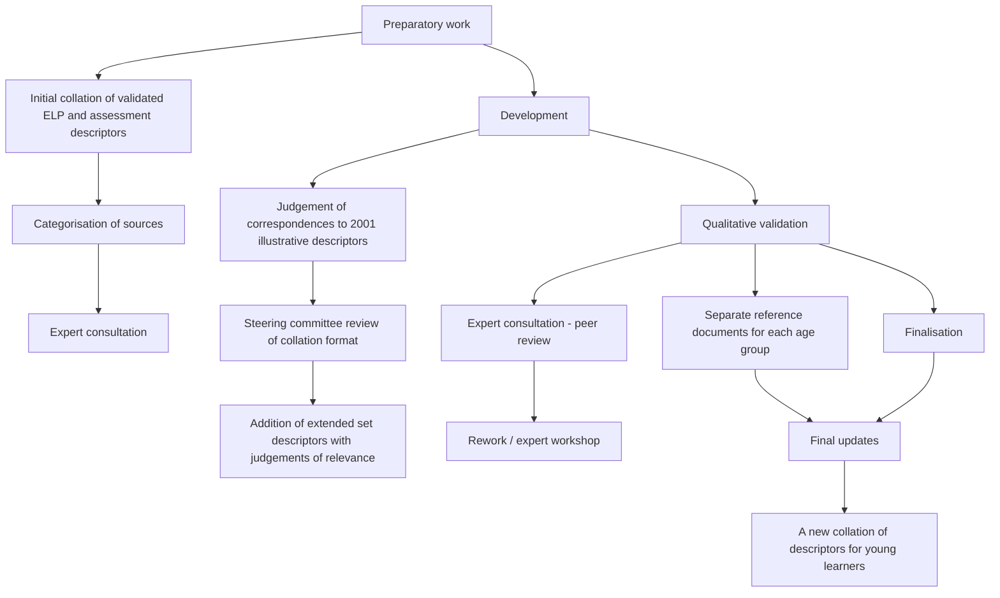
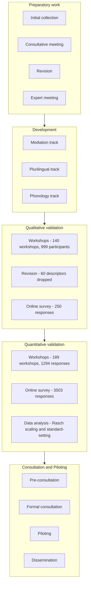
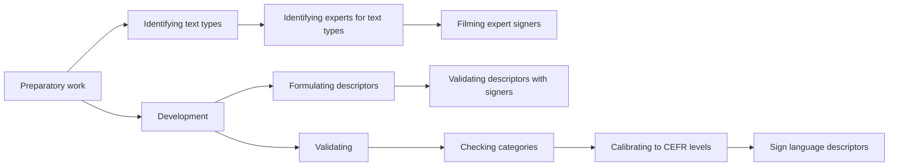

# chunk_09 (pages 242-266)

Page **242**

<!-- page:242 -->

<!-- el:start type=prose id=prose_p243_s0 page=243 -->
Appendix 6

**DEVELOPMENT AND VALIDATION OF THE  EXTENDED ILLUSTRATIVE DESCRIPTORS UPDATING THE 2001 SCALES**

The illustrative descriptor scales published in 2001 are among the most widely exploited aspects of the CEFR and the relevance of the descriptors has remained remarkably stable over time. Therefore, the approach taken was to supplement the 2001 set rather than change the descriptors in it. There are, however, substantive changes to a small number of descriptors in the scales from CEFR 2001 Chapters 4 and 5. The amendment of a small number of “absolute” statements at C2 is intended to better reflect the fact that the CEFR illustrative descriptors do not take an idealised native speaker as a reference point for the competence of a user/learner. These small changes are included in the extended set of illustrative descriptors published here, and are listed in Appendix 7. The working method adopted began with a small Authoring Group from the Eurocentres Foundation that selected, incorporated and, where necessary, adapted relevant calibrated materials drawn from the sources cited in the preface. In a series of meetings with a small group of experts that acted as a Sounding Board, the resulting set of descriptors was refined before being submitted to a larger group of consultants for review.

**NEW SCALES**

At this stage of the project, new scales were added for “Reading as a leisure activity” (under “Written reception”), for “Using telecommunications” (under “Spoken interaction”) and for “Sustained monologue: giving information” (under “Spoken production”). Certain existing descriptors defining more monologic speech were also moved from the scale “Information exchange” to the “Sustained monologue: giving information” scale during this process.

**PRE-A1**

Pre-A1 represents a “milestone” halfway towards Level A1, a band of proficiency at which the learner has not yet acquired a generative capacity, but relies upon a repertoire of words and formulaic expressions. The existence of a band of proficiency below A1 is referred to at the beginning of CEFR 2001 Section 3.5. A short list of descriptors is given there that had been calibrated below A1 in the SNSF research project that had developd the illustrative descriptors. A fuller description of the competences of learners at A1 and the inclusion of a level below A1 was important for users as evidenced by the number of descriptor projects that focused on these lower levels. Therefore, a band of proficiency labelled Pre-A1 is included in the majority of the scales.

**PHONOLOGY**

For “Phonological control”, which was an existing CEFR 2001 (https://rm.coe.int/phonological-scale-revision-process-report-cefr/168073fff9) scale, a completely new set of descriptors was developed /see “Phonological Scale Revision Process Report” (Piccardo 2016). Phonology had been the least successful scale developed in the research behind the descriptors published in 2001. The phonology scale was the only CEFR illustrative descriptor scale for which a native-speaker norm, albeit implicit, had been adopted. In an update, it appeared more appropriate to focus on intelligibility as the primary construct in phonological control, in line with current research, especially in the context of providing descriptors for building on plurilingual/ pluricultural repertoires. The resulting phonology project followed all three validation phases described below in relation to other new scales, with over 250 informants involved in each phase.

**YOUNG LEARNERS**

The collated descriptors for young learners are available on the CEFR website. There is a recognised need for instruments to better support CEFR alignment of teaching and learning for young learners. However, a conscious decision was taken to avoid parallel design and calibration of new descriptors for young learners during this project, as young learner descriptors are largely derived and adapted from the CEFR illustrative descriptors, according to age and context. Moreover, a great deal of work has already been done in this area by professionals across the member states in the design and validation of European Language Portfolios for young learners. Therefore, the approach adopted for young learners was to collect and collate descriptors for young learners
<!-- el:end id=prose_p243_s0 -->

Page **243**

<!-- page:243 -->

<!-- el:start type=figure_page id=figure_18_young_learner_project_design page=244 -->
and organise these into the two main age groups (7 to 10 and 11 to 15) that were represented by the majority of validated ELP samples available.

Though not fully comprehensive, the project brings together a representative selection of ELP descriptors for young learners from a range of Council of Europe member states, using in particular materials drawn from accredited models in the Council of Europe ELP bank and/or samples registered on the Council of Europe website, along with young learner assessment descriptors supplied by Cambridge Assessment English. These were individually aligned to the illustrative descriptors published in 2001 according to level, identifying meaningful correspondences between young learner descriptors and CEFR illustrative descriptors, and presented to the Sounding Board of experts for document peer review. This collation and alignment is intended to support further development of young learner curricula, portfolios and assessment instruments, with an awareness of lifelong learning leading to competences described in the CEFR.

In addition, the extended illustrative descriptors were included in the document for educators to consider for relevance to young learner programmes. Guidance judgments were added as to the proposed relevance of each of the extended CEFR illustrative descriptors to each of the two age groups. These judgments were also ratified by the Sounding Board through peer review, and in a separate consultative workshop.

The descriptors51 are presented in two documents, one for each age group. The documents have an identical structure, presenting the descriptors by level, starting with Pre-A1, and filtering out non-relevant CEFR illustrative descriptors that have been evaluated as clearly beyond the typical cognitive, social or experiential capacity of the age group (mainly at the higher levels). The documents thus show what CEFR descriptor the young learner descriptor is related to along with an indication of the relevance of a CEFR descriptor to the age group if no young learner descriptor examples are yet available. Additionally, an archive document retains all the mapped descriptors together for both age groups, organised by scale.

<!-- db:id=figure_18_young_learner_project_design type=figure render_as=mermaid product_tier=context pages=244 -->
### Figure 18 – Development design of Young Learner Project | figure_18_young_learner_project_design

**Initial collation  of validated ELP** **& assessment  Preparatory** **descriptors work**Shortlist of 35 sources evaluated / collated from 19 member states**Judgement of  correspondences** **to 2001 illustrative  descriptors** **Development**By main researcher, according to validated Young Learner descriptor levels**Expert  consultation** **Qualitative**Peer review of Young**validation**Learner descriptor alignment and judgments of relevance**Separate  reference** **documents for  each age group**Introduction chapter**Finalisation** Reorganisation of descriptors by level rather than scale Archive version retained with both age groups organised by scale **Categorisation  Expert consultation** **of sources**Relevant age Sources aligned groups finalised by age group**Addition of  Steering** **extended set  committee** **descriptors  review of** **with judgments  collation format** **of relevance** By members of CEFR Extended descriptors extended set expert evaluated for relevance authoring group to each age group

**Rework / expert  workshop**Update of alignments, judgments of relevance and comments**Final updates**Adjustments to final**A new collation**document versions**of descriptors for**to reflect validated changes to the**young learners** extended set of CEFR illustrative descriptors
<!-- el:end id=figure_18_young_learner_project_design -->

51.	 Bank of supplementary descriptors, www.coe.int/en/web/common-european-framework-reference-languages/bank-ofsupplementary-descriptors.

*Page **244** ▶ **CEFR – Companion volume***

<!-- page:244 -->

<!-- el:start type=prose id=prose_p245_s0 page=245 -->
**MEDIATION The conceptual approach to mediation**

The 1996 provisional version of the CEFR, published during the last stages of the Swiss research project, sketched out categories for illustrative descriptor scales for mediation to complement those for reception, interaction and production. However, no project was set up to develop them. One important aim of the current update, therefore, was to finally provide such descriptor scales for mediation, given the increasing relevance of this area in education. In the consideration of mediation, descriptors for building on plurilingual and pluricultural repertoires were also added. It was to the validation of these new descriptors for mediation, online interaction, reactions to literature and building on plurilingual/pluricultural repertoires that the institutions listed in the preface contributed.

The main focus in developing new scales was on mediation, for aspects of which 23 descriptor scales are now available (mediation activities: 18; mediation strategies: 5). The approach taken to mediation was broader than that presented in CEFR 2001, in which Section 2.1.3 introduced mediation as the fourth category of communicative language activities, in addition to reception, interaction and production:

In both the receptive and productive modes, the written and/or oral activities of **mediation** make communication possible between persons who are unable, for whatever reason, to communicate with each other directly. Translation or interpretation, a paraphrase, summary or record, provides for a third party a (re)formulation of a source text to which this third party does not have direct access. Mediating language activities – (re)processing an existing text – occupy an important place in the normal linguistic functioning of our societies.

This description is taken a stage further in CEFR 2001 Section 4.4.4:

In **mediating activities**, the language user is not concerned to express his/her own meanings, but simply to act as an intermediary between interlocutors who are unable to understand each other directly – normally (but not exclusively) speakers of different languages. Examples of mediating activities include spoken interpretation and written translation as well as summarising and paraphrasing texts in the same language, when the language of the original text is not understandable to the intended recipient.

The focus in the text of the CEFR 2001 book is thus on information transfer and on acting as an intermediary either in one language or across languages.

The conceptual approach taken in this project is closer to that adopted by Coste and Cavalli, in line with the broader educational field, in their 2015 paper for the Council of Europe, “Education, mobility, otherness – The mediation functions of schools (https://rm.coe.int/education-mobility-otherness-the-mediation-functions-of-schools/16807367ee)” (Coste and Cavalli 2015). The full conceptualisation of mediation is described in “Developing illustrative descriptors of aspects of mediation for the CEFR” (https://rm.coe.int/common-european-framework-of-reference-for-languages-learning-teaching/168073ff31) (North and Piccardo 2016). In developing categories for mediation, the Authoring Group used Coste and Cavalli’s distinction between:

- “Relational mediation”: the process of establishing and managing interpersonal relationships in order to create a positive, collaborative environment (for which six scales were developed);

- “Cognitive mediation”: the process of facilitating access to knowledge and concepts, particularly when an individual may be unable to access this directly on their own, due perhaps to the novelty and unfamiliarity of the concepts and/or to a linguistic or cultural barrier.

However, it is virtually impossible to undertake cognitive mediation without taking account of the relational issues concerned. Real communication requires a holistic integration of both aspects. For this reason, the mediation scales are presented in a more practical division into four groups:

- mediating a text;

- mediating concepts;

- mediating communication;

- mediation strategies.

Finally, consideration of cross-linguistic and cultural mediation led to an interest in the ability to exploit a plurilinguistic or pluricultural repertoire, for which three additional scales were developed:

- building on pluricultural repertoire;

- plurilingual comprehension;

- building on plurilingual repertoire.
<!-- el:end id=prose_p245_s0 -->

*Development and validation of the extended illustrative descriptors ▶ Page **245***

<!-- page:245 -->

<!-- el:start type=prose id=prose_p246_s0 page=246 -->
The aim of developing descriptors for plurilingual and pluricultural competence (https://rm.coe.int/168069d29b) linked to CEFR levels is to encourage teachers to include the acquisition of plurilingual and pluricultural competence, appropriate to the proficiency level of their learners, in their planning.

**METHODOLOGY ADOPTED**

The project emulated and further extended the methodologies employed in the original CEFR descriptor research by Brian North and Günther Schneider in Switzerland. It followed a similar mixed methods research design, with qualitative and quantitative development, as summarised in Figure 12. An extensive review of relevant literature was followed by an intuitive authoring phase, with feedback from a Sounding Board. This was followed between February 2015 and February 2016 by three phases of validation activities with around 1 000 people. The validation was then followed between July 2016 and February 2017 by three rounds of consultation, with piloting between January 2017 and July 2017.

The methodology followed for the development and validation of the new scales mirrored that undertaken in the original Swiss research (see CEFR 2001 Appendix B), but on a larger scale. Like the original research the project had three broad phases:

- initial research and development (intuitive phase); f checking and improving the categories and quality of the descriptors (qualitative phase); f calibrating the best descriptors to a mathematical scale and confirming the cut-offs between the levels (quantitative phase).

The above tasks took place between January 2014 and March 2016, followed by consultation and piloting.

**PREPARATORY WORK**

The first step was to collect existing instruments and articles related to mediation; at this point the mediation descriptors from Profile Deutsch and some other sources were translated into English. In a series of liaison meetings with Daniel Coste and Marisa Cavalli, the authors of “Education, mobility, otherness – The mediation functions of schools” (Coste and Cavalli 2015), a set of initial categories was developed and an initial collection of descriptors for mediating text and mediating concepts was collected and drafted. The main categories into which scales were grouped in the early stages were:

- cognitive mediation (facilitating access to knowledge, awareness and skills); f interpersonal mediation (establishing and maintaining relationships; defining roles and conventions in order to enhance receptivity, avoid/resolve conflict and negotiate compromise); f textual mediation (transmitting information and argument: clarifying, summarising, translating, etc.).

The full initial collection also included a number of draft scales related to aspects of institutional mediation (for example: integrating newcomers, dealing with stakeholders as an institution, developing and maintaining institutional relationships), together with a number of scales on different aspects of mediation by teachers – both aspects reflecting the focus of Coste and Cavalli on the mediation role of schools. However, at the first consultative meeting, held in July 2014, there was a consensus that these scales were in effect recycling aspects of interaction and production already present in the CEFR, rather than breaking new ground. For this reason, development was focused on the above-mentioned categories of conceptual, interpersonal and textual mediation. The collection was reworked for an expert meeting that set up an Authoring Group in September 2014.

**DEVELOPMENT**

The Authoring Group then conducted a thorough literature review and redrafted the initial collection in a series of meetings between September 2014 and February 2015. Sub-groups worked on online interaction, plurilingual/pluricultural competence and phonology. Work on plurilingual and pluricultural competences arose naturally from consideration of cross-linguistic mediation, particularly in the role of intermediaries. Work on phonology was undertaken because the existing CEFR 2001 scale for phonological control, alone among the CEFR illustrative scales, took an implied native speaker as a point of reference and set up unrealistic expectations (B2: “Has acquired a natural pronunciation and intonation”). This was considered incompatible with a plurilingual perspective. A Sounding Board closely supported the work of the Authoring Group with input materials and feedback. In February 2015, a set of 427 draft descriptors for online interaction, mediation activities and strategies and for plurilingual/pluricultural competence were ready for the first round of validation activities. Since work on
<!-- el:end id=prose_p246_s0 -->

*Page **246** ▶ **CEFR – Companion volume***

<!-- page:246 -->

<!-- el:start type=prose id=prose_p247_s0 page=247 -->
plurilingual/pluricultural competence and phonology started later, only some of the descriptors for the former and none of those for the latter were included at this point. The phonology descriptors were first tried out in a workshop in June 2015 and in consultation with phonology experts.

**QUALITATIVE VALIDATION**

By this stage, 137 institutes had been recruited to take part in validation. This first phase took place at these institutions from February to March 2015 during face-to-face workshop sessions, in which almost 1 000 people took part. The task was a more systematic version of the one used in the 32 workshops in the original CEFR descriptor research project. Participants discussed in pairs some 60 descriptors for three to five related areas, decided what area they were describing, rated them for (a) clarity, (b) pedagogic relevance and (c) relation to real-world language use, and suggested improvements to formulation. Following this, some 60 descriptors were dropped, including one entire scale. Very many of the other descriptors were reformulated, usually shortened, and two new scales (“Spoken translation of written text”; “Breaking down complicated information”) were drafted at the suggestion of workshop participants. It was at this point that some of the detail being removed from descriptors was put into examples for different domains (see Appendix 5). Qualitative validation for phonology, in which 250 project participants took part online in the same (familiar) activities, came much later in the year, in November and December 2015.

**QUANTITATIVE VALIDATION**

In the next phase, 189 institutions took part, with a total of 1 294 participants from 45 countries. Again, each participating institution organised a face-to-face workshop. After familiarisation activities similar to those recommended in the Council of Europe’s manual entitled “Relating Language Examinations to the Common European Framework of Reference for Languages: Learning, Teaching, Assessment (CEFR) – A Manual” (https://rm.coe.int/1680667a2d) (Council of Europe 2009) participants took part in a standard-setting workshop in which, individually and after discussion, they assigned draft descriptors to CEFR levels. The full range of CEFR proficiency bands from the initial CEFR descriptor research was used for this purpose (= 10 bands from Pre-A1 to C2). Participants wrote their decisions on PDF printouts and only at the end did they enter their considered, final, individual decisions into an online survey.

In the analysis, firstly the percentages of respondents assigning each descriptor to each level and sub-level were calculated, and then a Rasch Model scaling analysis was carried out, as in the original CEFR descriptor research. To conduct a Rasch analysis, one needs a matrix of linked data, and each item (here descriptor) should ideally have 100 responses. This goal was met for all descriptor scales: the lowest number of respondents for any one scale being 151 and the highest 273.

A matrix of this type was used for each of the validation phases, with a conscious effort to target categories of descriptors to groups known to be interested in the categories concerned. The advantages of the Rasch analysis were firstly that it enabled those descriptors that just did not work and those participants who just could not complete the task to be identified and excluded, and secondly that it gave each descriptor an arithmetic value. That value could then be converted to the scale underlying the CEFR descriptors published in 2001 by using some of them as “anchor items”.

Results from the preliminary quantitative analysis were discussed at a consultative meeting in July 2015, following which 36 descriptors were dropped and about half relegated to recalibration, usually after amendments. A major issue was a lack of descriptors at A1 and A2 for mediation and plurilingual/pluricultural competence. An effort was made to draft these before the following phase.

The main quantitative data collection then followed in an online survey conducted in English and French between October and December 2015. This time respondents replied individually to the question: “Could you, or a person whom you are thinking of, do what is described in the descriptor?” They were asked to do this three times, for their different plurilingual personae and/or for people whom they knew very well (partners, children, etc.), and this resulted in 3 503 usable responses from about 1 500 people. The task was a slightly adapted replication of the one used in the calibration of the descriptors published in 2001, which was based on teacher assessment with descriptors of a representative sample of students in their classes. Two analyses were carried out: a global analysis with all the descriptors and a second analysis in which each main category was analysed separately. Decisions about the level of each descriptor were then made on the basis of all of the information available.

Quantitative validation for phonology followed in January 2016, with 272 people taking part. There were two tasks: (a) assigning to levels, and (b) assessing learner performances in video clips (“Can the learner in the video do what is described in the descriptor?”). Different standard-setting techniques were employed; again, readers are referred to “Phonological Scale Revision Process Report” (Piccardo 2016) for details.
<!-- el:end id=prose_p247_s0 -->

*Development and validation of the extended illustrative descriptors ▶ Page **247***

<!-- page:247 -->

<!-- el:start type=artifact id=scale_the_rasch_model page=248 -->
> The Rasch Model is named after a Danish mathematician, George Rasch. It is the most commonly used of a family of probability models that operationalise latent trait theory (also called item response theory – IRT). The model analyses the extent to which an item “fits” in the underlying construct (= latent trait) that is being measured. It also estimates on a mathematical scale, firstly difficulty values (= how difficult each item is) and secondly, ability values (= how competent each person is in the trait in question). The model is used for many purposes but two of the main ones are:
>
> - building banks of items for tests;
>
> - questionnaire analysis.
>
> To analyse questionnaires, a variant called the rating scale model (RSM) is used. A multifaceted variant of the RSM can remove subjectivity from assessors’ judgments. Detailed explanations are available in the Reference Supplement to “Relating Language Examinations to the Common European Framework of Reference for Languages: Learning, Teaching, Assessment (CEFR) – A Manual” (Council of Europe 2009).
>
> The main advantage of the Rasch Model is that, unlike with classical test theory, the values obtained are generalisable to other groups that can be considered to be part of the same overall population (that is, sufficiently share the same characteristics).
>
> The objective scaling and the potential generalisability of the scale values obtained makes the model particularly suitable for determining at which level one should situate “can do” descriptors on a common framework scale like the CEFR levels.
<!-- el:end id=scale_the_rasch_model -->

<!-- el:start type=prose id=prose_p248_s1 page=248 -->
**FURTHER VALIDATION OF PLURILINGUAL AND PLURICULTURAL COMPETENCE (https://rm.coe.int/168069d29b)**

Finally, an extra survey was carried out in February 2016 for three reasons. Firstly, it was an opportunity to include descriptors for reception strategies and plurilingual comprehension, mostly adapted from the MIRIADI Project;52 secondly, the task in the main online survey had not worked well for plurilingualism, so the extra survey re-ran this with a different task; finally, it was an opportunity to add more descriptors for pluricultural competence, particularly at lower levels. The survey was carried out in two completely separate parallel versions. From among the project participants, 267 volunteers completed one form, while 62 experts in plurilingual education completed the other. The results were then contrasted and it was established that there was no statistically significant difference between them. The calibrations to levels were also extremely compatible with the existing CEFR 2001 scale for sociolinguistic appropriateness.
<!-- el:end id=prose_p248_s1 -->

52.	 www.miriadi.net/en/miriadi-plan.

*Page **248** ▶ **CEFR – Companion volume***

<!-- page:248 -->

<!-- el:start type=figure_page id=figure_19_multimethod_research_design page=249 -->
<!-- db:id=figure_19_multimethod_research_design type=figure render_as=mermaid product_tier=context pages=249 -->
### Figure 19 – Multimethod developmental research design | figure_19_multimethod_research_design

<!-- el:end id=figure_19_multimethod_research_design -->

*Development and validation of the extended illustrative descriptors ▶ Page **249***

<!-- page:249 -->

<!-- el:start type=prose id=prose_p250_s0 page=250 -->
**ISSUES AND RESPONSES**

A great amount of feedback was given by participants in the validation activities in 2015, in consultation meetings and during the wider consultation and piloting in 2016-17. This section focuses on some of the key issues that were raised over the duration of the project and how each one was addressed.

**RELATIONSHIP OF MEDIATION SCALES TO CEFR 2001 SCALES**

Although the focus in the project was to provide descriptors for activities and strategies that were not already covered by CEFR 2001 descriptor scales, some aspects of the mediation scales, particularly at lower levels, are reminiscent of the kinds of activities described in existing CEFR scales. This is because some aspects of mediation, in the broader interpretation now being adopted, are already present in the illustrative descriptor scales published in 2001. The new scales under “Mediating a text” for “Relaying specific information”, “Explaining data” and “Processing text”, for example, are an elaboration of concepts introduced in the existing scale for “Processing text” under “Text” in CEFR 2001 Section 4.6.3. Similarly, the scales particularly concerning group interaction in “Facilitating collaborative interaction with peers”, “Collaborating to construct meaning” and “Encouraging conceptual talk”, are in many ways a further development of concepts in the existing scale “Co-operating strategies under interaction strategies”. This underlines the difficulty of any scheme of categorisation. We should never underestimate the fact that categories are convenient, invented artefacts that make it easier for us to interpret the world. Boundaries are fuzzy and overlap is inevitable.

**CROSS-LINGUISTIC MEDIATION**

Earlier versions of the descriptors had experimented with various formulations seeking to take account of this point. However, making clear distinctions proved to be remarkably difficult. “Mother tongue” and “first language” and “language of schooling” are often not synonymous and even expressions like “source language” and “target language” proved confusing (for example when mediating from another language one may be mediating to the mother tongue; the other language is in such a case the source language and the mother tongue would be the target language). Attempts to cater to these variations also meant that at one point the collection of descriptors unnecessarily tripled in size, with very minor changes in formulation.

Therefore, the project group decided to take the line that, as with the illustrative descriptors published in 2001, what is calibrated is the perceived difficulty of the functional language ability irrespective of what languages are involved. It is recommended that those languages be specified by the user as part of the adaptation of the descriptors for practical use.

The scales for “Mediating a text” contain a reference to “Language A” and “Language B”: broad terms for mediated communication sources and communication outputs respectively. It is stated in the notes that mediation may be within one language or across languages, varieties or registers (or any combination of these), and that the user may wish to state the specific languages concerned. Equally, the user may wish to provide examples relevant to their context, perhaps inspired by those presented in Appendix 5 for the four domains of language use: public, personal, occupational and educational.

For example, the first descriptor on the scale for “Relaying specific information in speech or sign”:

Can explain (in Language B) the relevance of specific information given in a particular section of a long, complex text (in Language A).

might become: Can explain in French the relevance of specific information given in a particular section of a long, complex text in English (e.g. an article, website, book or talk face-to-face/online concerning current affairs or an area of personal interest or concern).

or if communication within one target language is concerned:

Can explain the relevance of specific information given in a particular section of a long, complex text (e.g. an article, website, book or talk face-to-face/online concerning current affairs or an area of personal interest or concern).

All the descriptors for mediating a text involve integrated skills, a mixture of reception and production. The focus is not on reception, for which CEFR scales already exist. The level at which descriptors are calibrated reflects the level of processing and production required. When reception and production are in different languages, then the level represented by the descriptor is that needed to process and articulate the source message in the target language(s).
<!-- el:end id=prose_p250_s0 -->

*Page **250** ▶ **CEFR – Companion volume***

<!-- page:250 -->

<!-- el:start type=prose id=prose_p251_s0 page=251 -->
**GENERAL AND COMMUNICATIVE LANGUAGE COMPETENCES**

In any CEFR descriptor scale, the descriptors at a particular level define what can reasonably be achieved when the user/learner has a communicative language competence (CEFR 2001 Section 5.2) in the language(s) concerned corresponding to the CEFR level given, provided the person concerned also has the personal characteristics, knowledge, cognitive maturity and experience – that is to say the general competences (CEFR 2001 Section 5.1) – necessary to do so successfully. The CEFR scales are intended to be used to profile ability. It is unlikely that all users who are globally “B1” are capable of doing exactly what is defined at B1 on all CEFR descriptor scales, no more and no less. It is far more likely that people whose overall level is at B1 will in fact be A2 or A2+ in relation to some activities and B1+ or even B2 in relation to others, depending upon their personal profile of general competences, in turn dependent on age, experience, etc. This is the case with many existing CEFR 2001 descriptor scales that concern cognitive abilities like “Note-taking”, “Reading for information and argument”, “Formal discussion (meetings)”, “Sustained monologue: addressing audiences”, and producing “Reports and essays”. It is equally the case with many mediation activities. Some of the scales under mediating a text (for example “Processing text”) or mediation strategies (for example “Streamlining text”) involve activities requiring a degree of cognitive sophistication that may also not be shared equally by everyone. Furthermore, the scales for mediating communication require interpersonal skills that are not shared equally, partly due to experience.

Similarly, the profiles of user/learners at, for example, B1 will differ greatly in relation to “Building on plurilingual/ pluricultural repertoire”, dependent on their personal trajectories and the experience and competences acquired along the way. Therefore, rather than seeking to eliminate the influence of individual differences, the approach taken in the descriptors acknowledges that they are a key contributing factor to learners’ unique profiles of communicative ability.

**GENERAL AND COMMUNICATIVE LANGUAGE COMPETENCES  IN BUILDING ON PLURICULTURAL REPERTOIRE**

As with mediating, using one’s pluricultural repertoire involves a range of general competences (CEFR 2001 Section 5.1), usually in close conjunction with pragmatic and sociolinguistic competences (CEFR 2001 Section

5.2.2 and 5.2.3). Thus in this scale, as in the mediation scales and many other CEFR scales, competences other than language competences come into play. The boundaries between knowledge of the world, sociocultural knowledge and intercultural awareness are not really clear-cut, as the CEFR 2001 explains. Nor are those between practical skills and know-how – which includes social skills – and sociocultural knowledge or intercultural skills and know-how. The field of socio-pragmatics also studies aspects of these areas from a more “linguistic” point of view. What is more important than possible overlap between categories is the fact that the user/learner calls on all these various aspects, merged with the appropriate communicative language competence, in the creation of meaning in a communicative situation. Some are more likely than others to be able to do this to the extent permitted by a given language proficiency level, perhaps because of their differing aptitudes and experience.

**CONSULTATION AND PILOTING**

The development and validation described above were then followed by a process of consultation and piloting in three phases:

- expert workshop; f pre-consultation online survey with experts; f formal consultation.

After a meeting with Council of Europe experts in June 2016 and a detailed pre-consultation online survey of CEFR experts in the summer of 2016, the descriptors were revised before a formal consultation took place in English and French between October 2016 and February 2017. There were two parallel surveys of individuals and institutions. Some 500 individual informants completed the survey, together with a number of invited institutions and curriculum or assessment agencies. Among other questions, respondents were asked to state to what extent they found each of the new scales to be helpful and to comment on the descriptors. All the proposed new scales were considered to be helpful or very helpful by 80% of the respondents, with the institutions/agencies tending to give a more positive response. The most popular new scales concerned mediating a text, collaborating in small groups and online interaction. There was a considerable difference of opinion between individuals and institutions on two descriptor scales: “Goal-oriented online transactions and collaboration” and “Building on plurilingual repertoire”. While 96% of the institutions found these two scales helpful or very helpful, only 81% to 82% of individuals did so.
<!-- el:end id=prose_p251_s0 -->

*Development and validation of the extended illustrative descriptors ▶ Page **251***

<!-- page:251 -->

<!-- el:start type=prose id=prose_p252_s0 page=252 -->
In the formal consultation, two thirds of the respondents definitely welcomed the fact that the descriptor scales for mediation moved beyond the area of classic modern language teaching (to Content and Language Integrated Learning – CLIL, and Language of Schooling), with over 90% of both individuals and institutions agreeing to some extent. A great number of comments and suggestions were received, which have helped to finalise descriptor formulations, scale titles and the way in which the scales are presented.

Piloting took place between February and June 2017, with results continuing to feed into formulation of and presentation of the descriptor scales. The vast majority of the pilots selected descriptors from relevant scales in order to inform the design of communicative tasks in the classroom, and then used the descriptors to observe the language use of the learners. Feedback on the descriptors was very positive, with some useful suggestions for small revisions. The most popular areas for piloting were collaborating in small groups, mediating a text and plurilingual/pluricultural competence. In one pilot, the two descriptor scales for online interaction were also presented in a separate survey of 1 175 Italian teachers of English who were completing an online course in use of digital resources.53 Of these respondents, 94.8% found the descriptors very clear or quite clear, and 80.8% reported that they were very easy or quite easy to use for self-assessment.

At the same time as the formal consultation, a questionnaire was also sent to Council of Europe member states asking about use of the CEFR in their countries, familiarity with support materials recently provided by the Council of Europe’s Education Policy Division (Language Policy Programme) and their reaction to the proposed new descriptor scales. Member states were also asked to suggest institutions for piloting. Results were very positive, except for some reservations concerning the use of the CEFR in initial teacher education – only half of the respondents saying it has been highly helpful. As might be expected, the dimensions of the CEFR most often referred to in official documents and implemented in practice were the descriptors (83% highly so), the levels (75% highly so) and the action-oriented approach (63% highly so). To the question of whether they welcomed the new scales, the positive response was highest for plurilingual/pluricultural competence (79%), followed by online interaction (75%), mediation (63%) and literature (58%).

**INCORPORATION OF DESCRIPTORS FOR SIGN LANGUAGES**

People who are born deaf may acquire a sign language as their first language given appropriate input by their parents and peers. Sign languages are not merely a form of gesturally-based communication, and not simply a different medium through which a spoken language is expressed. Linguistic research has provided ample evidence that sign languages are human languages in their own right, like spoken languages, and display linguistic features, means, rules and restrictions like those found in spoken language. Those features include language acquisition, processing, loss and all the other psychological processes and language-specific representations that also apply in spoken languages.

Parallel to the main project mentioned above, descriptors for sign language competence were produced, following a similar methodology to that used in a project at the Zurich University of Applied Sciences (ZHAW), funded by the SNSF.54 The project identified and calibrated descriptors for productive and receptive signing competence. These are descriptors that apply specifically to sign languages and complement the existing CEFR descriptors.

However, one should also remember that the CEFR descriptors, which express an ability to act in the language, are relevant to all human languages. Sign languages are used to fulfil actions just as spoken languages are. Therefore the same descriptors can be applied to both language modalities, and as a result all the CEFR descriptors have been reformulated to be modality-neutral.

Ever since the CEFR was introduced, there has been a need to define common learning targets, curricula and levels for education in sign languages. The CEFR is in fact increasingly used in order to structure courses in sign language. Most deaf children (95%) are born to hearing parents so, although the community of deaf people is small, there is a great need for such courses, not just for the families of deaf children, but also for educational purposes (interpreters, deaf migrants, hard-of-hearing people, teachers, linguists, etc.). In addition, the CEFR is starting to play a role in relation to the training and qualifications of sign language teachers and interpreters and, most particularly, in working towards official recognition of sign languages and the qualifications of sign language professionals. The initiative to include descriptors for sign language in the CEFR therefore received strong support from a number of associations in the community of the deaf.
<!-- el:end id=prose_p252_s0 -->

53.	 “Techno-CLIL 2017”, moderators: Letizia Cinganotto and Daniela Cuccurullo, https://moodle4teachers.org/enrol/index.php?id=90.
54.	 The Council of Europe wishes to thank the SNSF for providing the approximately €385 000 that made the project possible.

*Page **252** ▶ **CEFR – Companion volume***

<!-- page:252 -->

<!-- el:start type=prose id=prose_p253_s0 page=253 -->
The ZHAW55 sign language project “Common European Framework of Reference for Sign Languages: development of descriptors for Swiss-German Sign Language” operated to a different timescale, with the research completed in June 2019, three years after the completion of the main descriptor project. Again, the sign language project followed a mixed-method, developmental research design that combined intuitive, qualitative and quantitative analyses. However, as the signing community is small, the sign language project took place on a smaller scale. The three main phases of the project are outlined in Figure 20.

The approach was entirely data-based. Rather than adapting existing CEFR descriptors to sign language, the ZHAW project’s aim was to produce descriptors for aspects of signing competence based on the study of videos of expert signers. The expert signers were recorded signing different types of texts and these performances were then discussed in a series of workshops with sign language teachers. The ZHAW Authoring Group then formulated descriptors on the basis of comments and analysis from the sign language teachers. In this way a collection of over 300 descriptors for productive competences as well as 260 descriptors for receptive competences was developed. As in the mediation project, there was no consideration of level at this stage: the aim was to capture significant aspects of competence in words. As in the mediation project, descriptors were improved in an iterative process of consultation and conducting workshops.

Furthermore, a simple validation experiment in the project demonstrated that hearing non-signers and deaf non-teachers had a significantly different interpretation of the level a descriptor refers to in comparison to deaf teachers. Therefore, the descriptors were calibrated only by deaf sign language instructors either born deaf or with L1-competence attributed by the community on the basis of their signed forms (videos).

The descriptors were then grouped into categories. Initially it had been intended to produce scales for different types of text (narrative, descriptive, explanatory, etc.).56 However, very many of the descriptors were identified as relevant for several text types because they treated transversal competences. Finally, therefore, in a workshop undertaken by the project team, the descriptors were grouped into sets on the basis of similarity. Three separate groups sorted the descriptors into piles that appeared to describe related competences. A final categorisation was then negotiated. The characteristics of each set were examined and refined, leading to the definition of categories for nine scales as follows:

**Linguistic competence:**

1. Sign language repertoire (receptive/productive);

2. Diagrammatical accuracy (receptive/productive).

**Sociolinguistic competence**:

Sociolinguistic appropriateness and cultural repertoire (receptive/productive).

**Pragmatic competence:**
<!-- el:end id=prose_p253_s0 -->

3.
4. Sign text structure (receptive/productive);
5. Setting and perspectives (receptive/productive);
6. Language awareness and interpretation (receptive);
7. Presence and effect (productive) (in German: Auftritt and Wirkung);
8. Processing speed (receptive);
9. Signing fluency (productive).
55.	 Zurich University of Applied Sciences Authoring Group: Jörg Keller, Petrea Bürgin, Aline Meili and Dawei Ni.
56.	 Keller J. et al. (2017), “Auf dem Weg zum Gemeinsamen Europäischen Referenzrahmen (GER) für Gebärdensprachen. Empirie-basierte Bestimmung von Deskriptoren für Textkompetenz am Beispiel der Deutschschweizer Gebärdensprache (DSGS)”, **Das Zeichen**, No. 105 , pp. 86-97; Keller J. et al. (2018), “Deskriptoren zur gebärdensprachlichen Textstrukturierung im GER für Gebärdensprachen”, **Das Zeichen**, No. 109 , pp. 242-5. Keller J. (2019), “Deskriptoren für Textkompetenz in Gebärdensprachen”, in Barras M. et al. (eds), **IDT 2017, Band 2**. Berlin: ESV, pp. 111-117.

*Development and validation of the extended illustrative descriptors ▶ Page **253***

<!-- page:253 -->

<!-- el:start type=figure_page id=figure_20_sign_language_project_phases page=254 -->
<!-- db:id=figure_20_sign_language_project_phases type=figure render_as=mermaid product_tier=context pages=254 -->
### Figure 20 – The phases of the sign language project | figure_20_sign_language_project_phases

**Preparatory Identifying** **work text types Formulating** **Development descriptors Checking** **Validating categories**

The final step was calibration to CEFR levels. To create a scale of descriptors, the Rasch Model was used, as in the mediation and phonology projects and the original CEFR descriptor project. However, this time it was videos of the descriptors being signed that provided the data. Videos were provided for this purpose in both Swiss-German Sign Language and International Sign (IS). The latter is a contact lingua franca, used in this case for signers from different European countries who took part. Following a successful trial of the rating scale by the project group, respondents to online surveys were asked to rate the degree of difficulty that a descriptor represented on a 4-point rating scale from 1 (not difficult) to 4 (very difficult).

The entire dataset (N = 223) was checked for cases with very few or no evaluations, which were then removed. Sample sizes and distributions of completed evaluations were then checked for the two main groups (Swiss and European). In the Swiss group, N = 53, with nearly all evaluating all descriptors in the entire set of over 300. In the European group, N = 37, with all participants evaluating a subset of all descriptors, resulting in a mean of 15 assessments per descriptor57 in addition to the 53 from the Swiss-German group.

As mentioned above while briefly describing the Rasch Model, descriptors will be more accurately placed at the right level if persons and items for whom the data does not fit the model (because they are improbable) are removed from the data. This step was followed in this project as in the main project.

The final step was to establish the cut-off between the CEFR levels on the sign language scale. To facilitate this process, calibrated CEFR descriptors published in 2001 had been included to act as “anchor items” to transform the scale produced to the mathematical values underlying the CEFR scale. For an explanation of this process, users are referred to the sections on quantitative validation in the “Developing illustrative descriptors of aspects of mediation for the CEFR” (https://rm.coe.int/common-european-framework-of-reference-for-languages-learning-teaching/168073ff31) (North and Piccardo 2016) and the “Phonological Scale Revision Process Report” (https://rm.coe.int/phonological-scale-revision-process-report-cefr/168073fff9) (Piccardo 2016). However, unlike in those two projects, the mathematical values of these CEFR 2001 “anchors” were not credible, even when unstable anchors had been removed. Therefore an alternative standard-setting method based on expert judgment was used.58

**Validating  descriptors** **with signers Calibrating to  Sign language** **CEFR levels descriptors**
<!-- el:end id=figure_20_sign_language_project_phases -->

57.	 While small, these values meet the minimum **a priori** requirements for 95% confidence intervals on difficulty parameters to within +/− 1 logit: see Linacre J. (1994), “Sample size and item calibration stability”, **Rasch Measurement Transactions** Vol. 7, No. 4, p. 328. The Standard Error of Measurement for the sign language descriptors is greater than for the other descriptors, but calibration on the scale is intuitively sensible. In a few cases, descriptors within the margin of error to the next proficiency band have been moved to that adjacent band on the basis of collective expert judgment.
58.	 The method used was a variant of the “Bookmark Method” explained in “Relating Language Examinations to the Common European Framework of Reference for Languages: Learning, Teaching, Assessment (CEFR) – A Manual” (Council of Europe 2009).

*Page **254** ▶ **CEFR – Companion volume***

<!-- page:254 -->

<!-- el:start type=prose id=prose_p255_s0 page=255 -->
**FINALISATION**

The feedback received in the various phases of validation, consultation and piloting between February 2015 and June 2017 was very helpful in identifying and eliminating less successful descriptors and scales, and in revising formulations. The process is documented in an archive available to researchers on the Council of Europe’s website. The definitive version of the descriptors included in this document has taken account of all the feedback received.

Since very many descriptors were validated for certain levels of some scales, especially B2, a number have been excluded from the extended version of the illustrative descriptors, although they are successfully validated descriptors. They are available in Appendix 8. In itself this redundancy is a good thing as it underlines the coherence of the calibration to levels, but it is not necessary to include all the descriptors concerned in the finalised CEFR illustrative descriptor scales. They will later be presented as supplementary descriptors in the CEFR-related descriptor bank that can be found on the Council of Europe’s website.
<!-- el:end id=prose_p255_s0 -->

*Development and validation of the extended illustrative descriptors ▶ Page **255***

<!-- page:255 -->

Page **256**

<!-- page:256 -->

<!-- el:start type=prose id=prose_p257_s0 page=257 -->
Appendix 7

**SUBSTANTIVE CHANGES TO SPECIFIC  DESCRIPTORS PUBLISHED IN 2001**
<!-- el:end id=prose_p257_s0 -->

<!-- el:start type=artifact id=scale_overall_listening_oral_comprehension page=257 -->
<!-- db:id=scale_overall_listening_oral_comprehension type=descriptor_scale product_tier=context pages=257 -->
### Overall listening oral comprehension | scale_overall_listening_oral_comprehension

| Overall listening oral comprehension | |
| --- | --- |
| C2 | Can understand with ease virtually Has no difficulty with any kind of spoken/signers language, whether live or broadcast, delivered at fast native natural speed. |
| Understanding conversation between other native people | |
| B2+ | Can keep up with an animated conversation between native speakers/signers of the target language. |
| B2 | Can with some effort catch much of what is said around them, but may find it difficult to participate effectively in discussion with several native speakers/signers of the target language who do not modify their language in any way. |
| Listening Understanding as a member of a live audience | |
| C2 | Can follow specialised lectures and presentations employing a high degree of colloquialism, regional usage or unfamiliar terminology. |
| Overall reading comprehension | |
| C2 | Can understand and interpret critically virtually all forms of the written language types of written/signed texts including abstract, structurally complex, or highly colloquial literary and non-literary writings. |
| Overall oral interaction | |
| B2 | Can interact with a degree of fluency and spontaneity that makes regular interaction, and sustained relationships with speakers/signers of the target language native speakers quite possible without imposing strain on either party. Can highlight the personal significance of events and experiences, account for and sustain views clearly by providing relevant explanations and arguments. |
| Understanding a native speaker an interlocutor | |
| C2 | Can understand any native-speaker interlocutor, even on abstract and complex topics of a specialist nature beyond their own field, given an opportunity to adjust to a non-standard less familiar variety accent or dialect. |
| Conversation | |
| B2 | Can sustain relationships with users of the target language native speakers without unintentionally amusing or irritating them or requiring them to behave other than they would with another native proficient speaker/signer. |
| Informal discussion (with friends) | |
| B2+ | Can keep up with an animated discussion between native speakers/signers of the target language. |
| B2 | Can with some effort catch much of what is said around them in discussion, but may find it difficult to participate effectively in discussion with several native speakers/signers of the target language who do not modify their language in any way. |
| Formal discussion (meetings) | |
| C2 | Can hold their own in formal discussion of complex issues, putting forward an articulate and persuasive argument, at no disadvantage to native speakers other participants. |
| Interviewing and being interviewed | |
| C2 | Can keep up their side of the dialogue extremely well, structuring the talk and interacting authoritatively with complete effortless fluency as interviewer or interviewee, at no disadvantage to native speakers. other participants. |
| Sociolinguistic appropriateness | |
| C2 | Can mediate effectively and naturally between speakers/signers of the target language and of their own community of origin, taking account of sociocultural and sociolinguistic differences. |
| C2 | Appreciates fully virtually all the sociolinguistic and sociocultural implications of language used by native proficient speakers/signers of the target language and can react accordingly. |
| B2 | Can sustain relationships with users of the target language native speakers without unintentionally amusing or irritating them or requiring them to behave other than they would with another native proficient speaker. |
| Spoken Fluency | |
| B2 | Can interact with a degree of fluency and spontaneity that makes regular interaction with users of the target language native speakers quite possible without imposing strain on either party. |
<!-- el:end id=scale_overall_listening_oral_comprehension -->

Page **257**

<!-- page:257 -->

Page **258**

<!-- page:258 -->

<!-- el:start type=prose id=prose_p259_s0 page=259 -->
Appendix 8

**SUPPLEMENTARY DESCRIPTORS**

The descriptors in this appendix were also developed, validated and calibrated in the project to develop descriptors for mediation. They have been excluded from the extended illustrative descriptors for one of three reasons: because of redundancy, because it had not been possible to develop descriptors for a sufficient range of levels, or because of comments in the consultation phases. They will be added to the bank of supplementary descriptors on the Council of Europe website.

**SCALES**
<!-- el:end id=prose_p259_s0 -->

<!-- el:start type=artifact id=scale_interpreting page=259 -->
<!-- db:id=scale_interpreting type=descriptor_scale product_tier=context pages=259 -->
### Interpreting | scale_interpreting

| Interpreting | |
| --- | --- |
| Note: As in any case in which mediation across languages is involved, users may wish to complete the descriptor by specifying the languages concerned, as in this example for a C2 descriptor: Can provide almost completely accurate simultaneous or consecutive interpretation into French of complex, formal discourse in German, conveying the meaning of the speaker faithfully and reflecting the style, register and cultural context without omissions or additions. | |
| C2 | Can provide almost completely accurate simultaneous or consecutive interpretation of complex, formal discourse, conveying the meaning of the speaker faithfully and reflecting the style, register and cultural context without omissions or additions. Can, in informal situations, provide simultaneous or consecutive interpretation in clear, fluent, wellstructured language on a wide range of general and specialised topics, conveying style, register and finer shades of meaning precisely. Can provide simultaneous or consecutive interpretation, coping with unpredictable complications, conveying many nuances and cultural allusions on top of the main message, though expression may not always reflect the appropriate conventions. |
| C1 | Can provide consecutive interpretation fluently on a wide range of subjects of personal, academic and professional interest, passing on significant information clearly and concisely. |
| B2 | Can mediate during an interview, conveying complex information, drawing the attention of both sides to background information, and posing clarification and follow-up questions as necessary. Can provide consecutive interpretation of a welcome address, anecdote or presentation in their field, provided the speaker stops frequently to allow time for them to do so. Can provide consecutive interpretation on subjects of general interest and/or within their field, passing on important statements and viewpoints, provided the speaker stops frequently to allow them to do so, and gives clarifications if necessary. Can, during an interview, interpret and convey detailed information reliably and provide supporting information, although they may search for expressions and will sometimes need to ask for clarification of certain formulations. |
| B1 | Can, during an interview, interpret and convey straightforward factual information, provided they can prepare beforehand and that the speakers articulate clearly in everyday language. Can interpret informally on subjects of personal or current interest, provided the speakers articulate clearly in standard language and that they can ask for clarification and pause to plan how to express things. |
<!-- el:end id=scale_interpreting -->

Page **259**

<!-- page:259 -->

<!-- el:start type=artifact id=scale_a2 page=260 -->
<!-- db:id=scale_a2 type=descriptor_scale product_tier=context pages=260 -->
### A2 | scale_a2

| A2 | Can interpret informally in everyday situations, conveying the essential information, provided the speakers articulate clearly in standard language and that they can ask for repetition and clarification. Can interpret informally in predictable everyday situations, passing back and forth information about personal wants and needs, provided the speakers help with formulation. Can interpret simply in an interview, conveying straightforward information on familiar topics, provided they can prepare beforehand and that the speakers articulate clearly. Can indicate in a simple fashion that somebody else might be able to help in interpreting. |
| --- | --- |
| A1 | Can communicate with simple words and gestures what basic needs a third party has in a particular situation. |
| Pre-A1 | No descriptors available |
<!-- el:end id=scale_a2 -->

<!-- el:start type=artifact id=scale_a2 page=260 -->
| Phonological control: sound recognition | |
| --- | --- |
| C2 | Can consciously incorporate relevant features of regional and sociolinguistic varieties of pronunciation appropriately. |
| C1 | Can recognise features of regional and sociolinguistic varieties of pronunciation and consciously incorporate the most prominent in their speech. |
| B2 | Can recognise common words when pronounced in a different regional variety from the one(s) they are accustomed to. |
| B1 | Can recognise when their comprehension difficulty is caused by a regional variety of pronunciation. |
<!-- el:end id=scale_a2 -->

<!-- el:start type=prose id=prose_p260_s2 page=260 -->
**INDIVIDUAL DESCRIPTORS**
<!-- el:end id=prose_p260_s2 -->

<!-- el:start type=artifact id=scale_a2 page=260 -->
<!-- db:id=scale_online_conversation_and_discussion type=descriptor_scale product_tier=assessment_action,detailed pages=85-86 -->
### Online conversation and discussion | scale_online_conversation_and_discussion

| Online conversation and discussion | |
| --- | --- |
| C2 | Can use with precision colloquialisms, humorous language, idiomatic abbreviations and/or specialised register to enhance the impact of comments made in an online discussion. |
| C1 | Can express their ideas and opinions with precision in an online discussion on a complex subject or specialised topic related to their field, presenting and responding to complex lines of argument convincingly. Can critically evaluate online comments and express negative reactions diplomatically. |
| B2+ | Can exploit different online environments to initiate and maintain relationships, using language fluently to share experiences and develop the interaction by asking appropriate questions. |
| B2 | Can develop an argument in an online discussion giving reasons for or against a particular point of view, though some contributions may appear repetitive. Can express degrees of emotion in personal online postings, highlighting the personal significance of events and experiences and responding flexibly to further comments. Can repair possible misunderstandings in an online discussion with an appropriate response. |
| B1 | Can initiate, maintain and close simple online conversations on topics that are familiar to them, though with some pauses for real-time responses. |
| A2 | Can post online how they are feeling or what they are doing, using formulaic expressions, and respond to further comments with simple thanks or apology. |
| Pre- A1 | Can establish basic social contact online by using the simplest everyday polite forms of greetings and farewells. |
<!-- el:end id=scale_a2 -->

*Page **260** ▶ **CEFR – Companion volume***

<!-- page:260 -->

<!-- el:start type=artifact id=scale_goal_oriented_online_transactions_and_collaboration page=261 -->
<!-- db:id=scale_goal_oriented_online_transactions_and_collaboration type=descriptor_scale product_tier=assessment_action,detailed pages=87 -->
### Goal-oriented online transactions and collaboration | scale_goal_oriented_online_transactions_and_collaboration

| Goal-oriented online transactions and collaboration | |
| --- | --- |
| C1 | Can deal effectively with communication problems and cultural issues that arise in online collaborative or transactional exchanges, by adjusting their register appropriately. |
| A2+ | Can exchange basic information with a supportive interlocutor online in order to address a problem or simple shared task. |
<!-- el:end id=scale_goal_oriented_online_transactions_and_collaboration -->

<!-- el:start type=artifact id=scale_establishing_a_positive_atmosphere page=261 -->
| Establishing a positive atmosphere | |
| --- | --- |
| B2 | Can establish a supportive environment for sharing ideas and practice by providing clear explanations and encouraging people to explore and discuss the issue they are encountering, relating it to their experience. Can use humour appropriate to the situation (e.g. an anecdote, a joking or light-hearted comment) in order to create a positive atmosphere or to redirect attention. Can create a positive atmosphere and encourage participation by giving both practical and emotional support. |
| B1 | Can create a positive atmosphere by the way they greet and welcome people and ask a series of questions that demonstrate interest. |
<!-- el:end id=scale_establishing_a_positive_atmosphere -->

<!-- el:start type=artifact id=scale_processing_text_in_speech_or_sign page=261 -->
| Processing text in speech or sign | |
| --- | --- |
| C1 | Can summarise clearly and fluently in well-structured language the significant ideas presented in complex texts, whether or not they relate to their own fields of interest or specialisation. Can summarise in clear, fluent, well-structured speech the information and arguments contained in complex, spoken or written texts on a wide range of general and specialised topics. |
| B2+ | Can clarify the implicit opinions and purposes of speakers, including attitudes. |
| B1+ | Can summarise and comment on factual information within their field of interest. |
<!-- el:end id=scale_processing_text_in_speech_or_sign -->

<!-- el:start type=artifact id=scale_processing_text_in_writing page=261 -->
| Processing text in writing | |
| --- | --- |
| B1 | Can summarise in writing the main points made in straightforward informational texts regarding subjects that are of personal or current interest. Can summarise in writing the main points made in spoken or written informational texts regarding subjects of personal interest, using simple formulations and the help of a dictionary to do so. |
<!-- el:end id=scale_processing_text_in_writing -->

<!-- el:start type=artifact id=scale_visually_representing_information page=261 -->
| Visually representing information | |
| --- | --- |
| B2 | Can make abstract concepts accessible by visually representing them (in mind maps, tables, flow charts, etc.), facilitating understanding by highlighting and explaining the relationship between ideas. Can represent information visually (with graphic organisers like mind maps, tables, flow charts, etc.) to make both the key concepts and the relationship between them (e.g. problem–solution, compare-contrast) more accessible. Can, from a text, produce a graphic to present the main ideas in it (a mind map, pie chart, etc.) in order to help people understand the concepts involved. Can make the key points of abstract concepts more accessible by representing information visually (in mind maps, tables, flow charts, etc.). Can visually represent a concept or a process in order to make relations between information explicit (e.g. in flow charts, tables showing cause–effect, problem–solution). |
| B1 | Can communicate the essential points of a concept or the main steps in a straightforward procedure by using a drawing or graphic organiser. Can represent straightforward information clearly with a graphic organiser (e.g. a PowerPoint slide contrasting before/after, advantages/disadvantages, problem/solution). Can create a drawing or diagram to illustrate a simple text written in high frequency language. |
<!-- el:end id=scale_visually_representing_information -->

*Supplementary descriptors ▶ Page **261***

<!-- page:261 -->

<!-- el:start type=artifact id=scale_expressing_a_personal_response_to_creative_texts_including_literature page=262 -->
<!-- db:id=scale_expressing_a_personal_response_to_creative_texts_including_literature type=descriptor_scale product_tier=context pages=262 -->
### Expressing a personal response to creative texts (including literature) | scale_expressing_a_personal_response_to_creative_texts_including_literature

| Expressing a personal response to creative texts (including literature) | |
| --- | --- |
| A2+ | Can select simple passages they particularly like from a work of literature to use as quotes. |
| A2 | Can explain in simple sentences how a work of literature made them feel. |
<!-- el:end id=scale_expressing_a_personal_response_to_creative_texts_including_literature -->

<!-- el:start type=artifact id=scale_expressing_a_personal_response_to_creative_texts_including_literature page=262 -->
<!-- db:id=scale_analysis_and_criticism_of_creative_texts_including_literature type=descriptor_scale product_tier=assessment_action,detailed pages=108 -->
### Analysis and criticism of creative texts (including literature) | scale_analysis_and_criticism_of_creative_texts_including_literature

| Analysis and criticism of creative texts (including literature) | |
| --- | --- |
| C2 | Can analyse complex works of literature, identifying meanings, opinions and implicit attitudes. |
| C1 | Can explain the effect of rhetorical/literary devices on the reader, e.g. the way in which the author changes style in order to convey different moods. |
<!-- el:end id=scale_expressing_a_personal_response_to_creative_texts_including_literature -->

<!-- el:start type=artifact id=scale_expressing_a_personal_response_to_creative_texts_including_literature page=262 -->
| Facilitating collaborative interaction | |
| --- | --- |
| B2+ | Can invite participation, introduce issues and manage contributions on matters within their academic or professional competence. |
| B2+ | Can keep a record of ideas and decisions in group work, discuss these with the group and structure a report back to a plenary. |
| B2 | Can intervene to support collaborative problem solving initiated by another person. |
<!-- el:end id=scale_expressing_a_personal_response_to_creative_texts_including_literature -->

<!-- el:start type=artifact id=scale_expressing_a_personal_response_to_creative_texts_including_literature page=262 -->
| Collaborating to construct meaning | |
| --- | --- |
| B2+ | Can synthesise the key points towards the end of a discussion. |
<!-- el:end id=scale_expressing_a_personal_response_to_creative_texts_including_literature -->

<!-- el:start type=artifact id=scale_expressing_a_personal_response_to_creative_texts_including_literature page=262 -->
| Managing interaction | |
| --- | --- |
| B2+ | Can intervene to address problems in a group and to prevent the marginalisation of any participant. |
| B2 | Can give clear instructions to organise pair and small group work and conclude them with summary reports in a plenary. |
<!-- el:end id=scale_expressing_a_personal_response_to_creative_texts_including_literature -->

<!-- el:start type=artifact id=scale_expressing_a_personal_response_to_creative_texts_including_literature page=262 -->
| Encouraging conceptual talk | |
| --- | --- |
| B2+ | Can monitor performance non-intrusively and effectively, taking notes and later providing clear feedback. Can monitor group work, drawing attention to the characteristics of good work and encouraging peer evaluation. Can monitor a small group discussion to ensure that ideas are not only exchanged but are used to build a line of argument or enquiry. |
| B2 | Can present information and instruct people to use it independently to try and solve problems. |
<!-- el:end id=scale_expressing_a_personal_response_to_creative_texts_including_literature -->

<!-- el:start type=artifact id=scale_expressing_a_personal_response_to_creative_texts_including_literature page=262 -->
<!-- db:id=scale_facilitating_pluricultural_space type=descriptor_scale product_tier=assessment_action,detailed pages=114-115 -->
### Facilitating pluricultural space | scale_facilitating_pluricultural_space

| Facilitating pluricultural space | |
| --- | --- |
| C1 | Can recognise different communication conventions and their effect on discourse processes, adjust the way they speak accordingly, and help to establish related “rules” to support effective intercultural communication. Can interact flexibly and effectively in situations in which intercultural issues need to be acknowledged and tasks need to be completed together, by exploiting their capacity to belong to the group(s) while maintaining balance and distance. |
<!-- el:end id=scale_expressing_a_personal_response_to_creative_texts_including_literature -->

*Page **262** ▶ **CEFR – Companion volume***

<!-- page:262 -->

<!-- el:start type=artifact id=scale_b2 page=263 -->
<!-- db:id=scale_b2 type=descriptor_scale product_tier=context pages=263 -->
### B2+ | scale_b2

| B2+ | Can project themselves empathetically into another person’s perspective and ways of thinking and feeling so as to respond appropriately with both words and actions. |
| --- | --- |
| B2 | Can establish a relationship with members of other cultures, showing interest and empathy through questioning, expressions of agreement and identification of emotional and practical needs. Can encourage discussion without being dominant, expressing understanding and appreciation of different ideas, feelings and viewpoints, and inviting participants to contribute and react to each other’s ideas. Can help create a shared understanding based on their appreciation of the use of direct/indirect and explicit/implicit communication. |
<!-- el:end id=scale_b2 -->

<!-- el:start type=artifact id=scale_b2 page=263 -->
<!-- db:id=scale_facilitating_communication_in_delicate_situations_and_disagreements type=descriptor_scale product_tier=assessment_action,detailed pages=117 -->
### Facilitating communication in delicate situations and disagreements | scale_facilitating_communication_in_delicate_situations_and_disagreements

| Facilitating communication in delicate situations and disagreements | |
| --- | --- |
| B2+ | Can facilitate discussion of delicate situations or disagreements by outlining the essential issues that need resolving. Can formulate open-ended, neutral questions to obtain information about sensitive issues while minimising embarrassment or offence. Can use repetition and paraphrase to demonstrate detailed understanding of each party’s requirements for an agreement. Can explain the background to a delicate situation or disagreement by repeating and summarising statements made. Can clarify interests and objectives in a negotiation with open-ended questions that convey a neutral atmosphere. Can facilitate discussion of a disagreement by explaining the origins of the problem, reporting respective lines of argument, outlining the essential issues that need resolving, and identifying points in common. Can help the parties in disagreement to consider different possible solutions by weighing the advantages and disadvantages of each solution. Can evaluate the position of one party in a disagreement and invite them to reconsider an issue, relating their argumentation to that party’s stated aim. |
| B2 | Can summarise the essentials of what has been agreed. |
<!-- el:end id=scale_b2 -->

<!-- el:start type=artifact id=scale_b2 page=263 -->
| Linking to previous knowledge | |
| --- | --- |
| B2 | Can raise people’s awareness of how something builds on their existing knowledge by providing and explaining visual representations (e.g. diagram/chart, tables, flow charts). Can explain clearly how something that will be introduced builds on what people probably already know. |
<!-- el:end id=scale_b2 -->

<!-- el:start type=artifact id=scale_b2 page=263 -->
| Breaking down complicated information | |
| --- | --- |
| C1 | Can make a complex issue more comprehensible by building up the chain of steps or line of argument, and by recapitulating at key points. |
<!-- el:end id=scale_b2 -->

<!-- el:start type=artifact id=scale_b2 page=263 -->
| Adapting language | |
| --- | --- |
| C1 | Can make information in a complex written text (e.g. a scientific article) more accessible by presenting the content in a different genre and register. |
| B2+ | Can adapt articulation, sentence stress, intonation, speed and volume in order to structure content, highlight important aspects and mark transitions from one topic to another. Can make difficult concepts in a complex spoken or written text more comprehensible through paraphrase. |
| B1+ | Can use paraphrase to explain the content of a spoken or written text on a familiar topic in a simplified, more concrete form. |
<!-- el:end id=scale_b2 -->

*Supplementary descriptors ▶ Page **263***

<!-- page:263 -->

<!-- el:start type=artifact id=scale_amplifying_a_dense_text page=264 -->
<!-- db:id=scale_amplifying_a_dense_text type=descriptor_scale product_tier=context pages=264 -->
### Amplifying a dense text | scale_amplifying_a_dense_text

| Amplifying a dense text | |
| --- | --- |
| B2 | Can support understanding of unfamiliar language in a text by providing additional examples that contain similar language. |
<!-- el:end id=scale_amplifying_a_dense_text -->

<!-- el:start type=artifact id=scale_amplifying_a_dense_text page=264 -->
| Streamlining a text | |
| --- | --- |
| C1 | Can rewrite a complex source text, reorganising it in order to focus on the points of most relevance to the target audience. |
| B2 | Can distil the relevant information from different parts of the source text in order to guide the recipient to understanding the essential points. Can distil information from different parts of the source text in order to make accessible contrasting information and arguments contained in it. Can eliminate repetition and digressions in a text in order to make the essential message accessible. |
<!-- el:end id=scale_amplifying_a_dense_text -->

<!-- el:start type=artifact id=scale_amplifying_a_dense_text page=264 -->
<!-- db:id=scale_building_on_pluricultural_repertoire type=descriptor_scale product_tier=assessment_action,detailed pages=125 -->
### Building on pluricultural repertoire | scale_building_on_pluricultural_repertoire

| Building on pluricultural repertoire | |
| --- | --- |
| C2 | Can effectively employ, both in person and in writing, a wide variety of sophisticated communicative strategies to command, argue, persuade, dissuade, negotiate, counsel and show empathy in a culturally appropriate manner. |
| B2+ | Can exploit their awareness of similarities and differences between cultures for successful intercultural communication in both personal and professional domains. |
| B2+ | Can engage appropriately in communication, following the main verbal and non-verbal conventions and rituals appropriate to the context, coping with most difficulties that occur. |
| B2 | Can recognise cultural stereotypes – favourable and discriminatory – and describe how they influence their own or another’s behaviour. Can analyse and explain the balance that they personally maintain in the adjustment process between acculturation and preserving their own culture(s). Can adapt their behaviour and verbal expression to new cultural environments, avoiding behaviours that they are aware may be viewed as impolite. Can explain their interpretation of culturally specific opinions, practices, beliefs and values, pointing out similarities and differences to their own and other cultures. |
| B2 | Can comment on cultural differences, comparing them in depth with their own experience and traditions. Can interact effectively in a situation in which intercultural issues need to be acknowledged in order to solve a task co-operatively. Can enquire about relevant cultural norms and practices while collaborating in an intercultural encounter and then apply the knowledge gained under the constraints of real-time interaction. |
<!-- el:end id=scale_amplifying_a_dense_text -->

<!-- el:start type=artifact id=scale_amplifying_a_dense_text page=264 -->
<!-- db:id=scale_plurilingual_comprehension type=descriptor_scale product_tier=assessment_action,detailed pages=126-127 -->
### Plurilingual comprehension | scale_plurilingual_comprehension

| Plurilingual comprehension | |
| --- | --- |
| A2 | Can exploit easily identifiable vocabulary (e.g. international expressions, words with roots common to different languages – like “bank” or “music”) in order to form a hypothesis as to the meaning of a text. |
<!-- el:end id=scale_amplifying_a_dense_text -->

<!-- el:start type=artifact id=scale_amplifying_a_dense_text page=264 -->
<!-- db:id=scale_building_on_plurilingual_repertoire type=descriptor_scale product_tier=assessment_action,detailed pages=128 -->
### Building on plurilingual repertoire | scale_building_on_plurilingual_repertoire

| Building on plurilingual repertoire | |
| --- | --- |
| C2 | Can borrow metaphors and other figures of speech from other languages in their plurilingual repertoire for rhetorical effect, elaborating, reformulating and explaining them as necessary. |
| C1 | Can tell a joke from a different language, keeping the punch line in the original language, because the joke depends on it and explaining the joke to those recipients who do not understand it. |
<!-- el:end id=scale_amplifying_a_dense_text -->

*Page **264** ▶ **CEFR – Companion volume***

<!-- page:264 -->

<!-- el:start type=artifact id=scale_b2 page=265 -->
<!-- db:id=scale_b2 type=descriptor_scale product_tier=context pages=263 -->
### B2+ | scale_b2

| B2 | Can follow a conversation happening around them in a language or languages in which they have receptive competence, and express their contribution in a language that is understood by one or more of the interlocutors. Can support understanding and the development of ideas in multilingual group work in which participants are using different languages in their plurilingual repertoire flexibly. Can manage interaction in two or more languages in their plurilingual repertoire in order to keep a discussion or a task moving, encouraging people to use their languages flexibly. Can engage a multilingual group in an activity and encourage contributions in different languages by narrating a story/incident in one language in their plurilingual repertoire and then explaining it in another. Can exploit, and explain if necessary, an expression from another language in their plurilingual repertoire for a concept for which such a suitable expression seems not to exist in the language being used. |
| --- | --- |
| B1 | Can use an apt word from another language that the interlocutor speaks, when they cannot think of an adequate expression in the language being spoken. |
<!-- el:end id=scale_b2 -->

<!-- el:start type=prose id=prose_p265_s1 page=265 -->
**SIGN LANGUAGE COMPETENCES**
<!-- el:end id=prose_p265_s1 -->

<!-- el:start type=artifact id=scale_sign_language_repertoire page=265 -->
<!-- db:id=scale_sign_language_repertoire type=descriptor_scale product_tier=assessment_action,detailed pages=146-148 -->
### Sign language repertoire | scale_sign_language_repertoire

| Sign language repertoire | |
| --- | --- |
| C2 | Can describe a phenomenon, e.g. a UFO, in a creative, abstract manner. |
| C1 | Can create original, artistic signing, going beyond known vocabulary. |
| B2+ | Can describe different aspects of objects and events with precision. Can explain precisely the consequences that a decision will have. |
| B2 | Can sign indirect messages (indirect questions, requests, wishes and demands). Can summarise a proposition (e.g. being put to a vote), formulating it more simply with the relevant vocabulary. Can express clearly and precisely what they want, despite any vocabulary limitations. Can modify signs manually and non-manually. |
| B1+ | Can use comparison to characterise people and objects. Knows specific signing expressions connected with sign language culture. Can discuss the advantages and disadvantages of an issue. |
| B1 | Can imitate the behaviour of living beings (people, animals) using constructed action. Can describe in simple sentences the places they visited (e.g. on a holiday). Can circumscribe concepts with paraphrases, without knowing the proper signs for the concepts concerned. |
| A2+ | Can explain something comprehensibly. |
| A2 | Can understand a simple signed text despite a limited vocabulary. Can indicate animals with lexical signs. Can correctly perform newly created signs, e.g. for persons or colours. |
| A1 | Can understand commonplace expressions in a dialogue (e.g., greetings or thanks). Can understand the lexical signs for months, days, numbers and times. Can understand greetings in sign language. Can understand lexicalised signs for animals. Can follow simple instructions, explanations and statements of reasons. Can employ simple mouthings appropriate to the context. |
<!-- el:end id=scale_sign_language_repertoire -->

*Supplementary descriptors ▶ Page **265***

<!-- page:265 -->

<!-- el:start type=artifact id=scale_diagrammatical_accuracy page=266 -->
<!-- db:id=scale_diagrammatical_accuracy type=descriptor_scale product_tier=context pages=266 -->
### Diagrammatical accuracy | scale_diagrammatical_accuracy

| Diagrammatical accuracy | |
| --- | --- |
| C1 | Can indicate the movement of objects/living things (e.g. the gait of different animals). |
| B2+ | Can express comparisons (the same as ..., different to ...). |
| B1+ | Can form the plural with productive signs. |
| B1 | Can use different ways of expressing negation. |
| A1 | Can understand simple statements. |
<!-- el:end id=scale_diagrammatical_accuracy -->

<!-- el:start type=artifact id=scale_diagrammatical_accuracy page=266 -->
<!-- db:id=scale_sociolinguistic_appropriateness_and_cultural_repertoire type=descriptor_scale product_tier=assessment_action,detailed pages=154-156 -->
### Sociolinguistic appropriateness and cultural repertoire | scale_sociolinguistic_appropriateness_and_cultural_repertoire

| Sociolinguistic appropriateness and cultural repertoire | |
| --- | --- |
| C1 | Can assign a statement to a sociocultural register. Can understand the designations for important laws, institutions and deaf organisations (e.g., WFDYS, EFSLI). |
| B2+ | Can explain the local sociocultural habits and rules, e.g. the procedure followed in elections. Can designate people who are important for deaf communities and sign language (regionally and internationally). Can make (indirect) reference to important dates, persons and institutions in their country. |
| B1+ | Can discreetly refer to people who are present by, for example, using a smaller signing space or by holding a hand in front of the index finger so that it is not apparent to whom the finger is pointing. Can indicate the institutions, laws and regulations that are important for sign language in their country. |
| B1 | Knows the names of relevant government departments and political parties in their country. Knows the organisations that are most important for deaf people (e.g. national council for the deaf, associations). Knows the national sign language situation, e.g. for Switzerland: 3 sign languages; 5 dialects of Swiss- German Sign Language (DSGS). |
<!-- el:end id=scale_diagrammatical_accuracy -->

<!-- el:start type=artifact id=scale_diagrammatical_accuracy page=266 -->
<!-- db:id=scale_sign_text_structure type=descriptor_scale product_tier=assessment_action,detailed pages=158-160 -->
### Sign text structure | scale_sign_text_structure

| Sign text structure | |
| --- | --- |
| B2+ | Can tell a story from beginning to end, without leaving out parts of it. Can, when describing something, comply with canonical order in spatial placement (e.g. naming large immoveable objects before small immoveable objects, and introducing moving objects after static objects). |
| B2 | Can produce a text with a clear line of development. Can relate, for example, the plot of a film, a picture story, a narrative. Can deliver sufficient important information in adequate measure and leave to one side elements that are not important. Can link given signs fluently into a short coherent text. Can contrast and account for the opinions of others. |
| B1+ | Can use personal experiences as examples in order to support an argument. |
| B1 | Can, when describing a person, a character, or an animal, list visible characteristics in the correct order (e.g. from head to toe). Can answer key questions on a text clearly. |
<!-- el:end id=scale_diagrammatical_accuracy -->

*Page **266** ▶ **CEFR – Companion volume***

<!-- page:266 -->